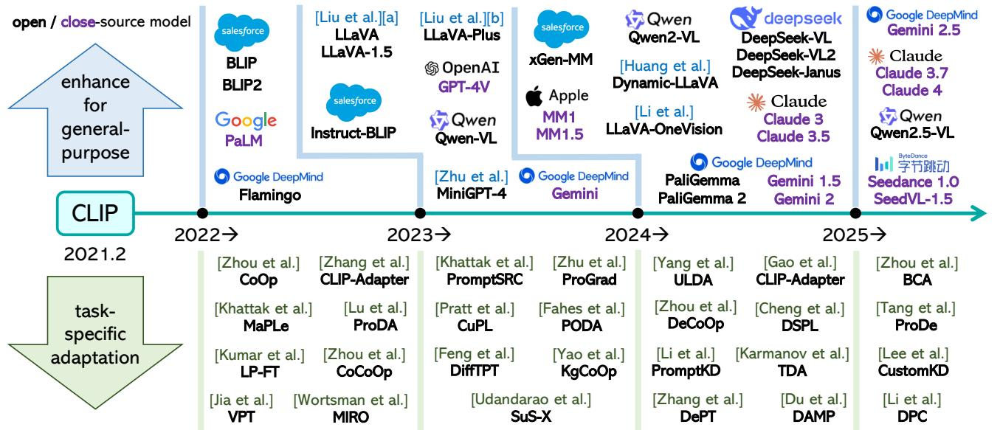
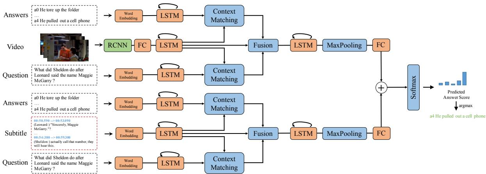
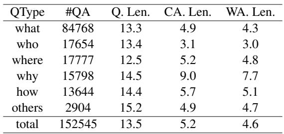
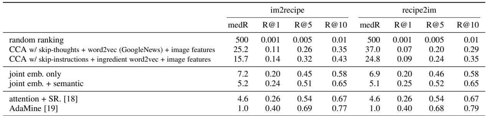

# 当前技术方案

_整理时间: 2026-05-26 · 状态快照（含 noncs2000 新增产线）_

## 这个项目到底在干什么

项目有**两条并行的生产线**，共享同一个图+生成+QC+打包架构，但论文来源和领域不同：

| 产线 | 论文 | 交付包 | 规模 |
|------|------|--------|------|
| **M4query_v2**（CS） | 1,147 篇多模态 ML 论文 | `M4query_v2_clean_chunk_aug` | 8,104 triplets |
| **noncs2000**（非CS） | 2,103 篇 math/astro-ph/cond-mat/hep | `M4query_noncs2000_final` | 8,204 triplets |

输入: arXiv PDF + LaTeX 源码。

输出: 一批 M4 风格的多模态检索三元组 —— 每个 query 需要从一篇论文里同时召回**图 + 表 + 公式 + 段落 + chunk** 多个粒度的证据，并能跟该论文的其他干扰元素以及跨论文的噪声区分开。

为什么不简单: 非 CS 论文的图、表、公式形态和 ML 论文完全不同（天文图像 vs 模型架构图，物理公式 vs ML loss 函数），导致 embedding 对齐和跨文档连接都更难。整个方案的核心问题就是: **没有 LaTeX 的时候，怎么把图、表、公式跨文档地正确串起来。**

---

## 三个 query 示例（取自实际交付）

**交付物**: `data/03_queries/M4query_v2_clean_chunk_aug/`（5/18 推送的版本）
**规模**: 8,104 条 query × 3-4 positive × 5 hard_neg × 5 random_neg；corpus 169,671 条 passage（paragraph 117K / chunk 29K / figure 9K / table 7K / formula 6.9K）
**说明**: 这是给检索训练用的三元组格式。下面三条原样从 `train_triplets.jsonl` 抽，positive 里的图直接嵌进来。

---

### 示例 1: figure + formula + 段落 + chunk

`query_id: l3_de_2506.18504_0006`（VLM prompt design）

> **Query**: What prompt design addresses the timeline's growing domain-diverse adaptation pressure when frozen prompts are insufficient under significant domain gap?
>
> **Reasoning chain**: The field is increasingly focused on diverse task-specific adaptation problems rather than relying only on general-purpose models. Because domain gaps can defeat frozen-prompt methods, the paper motivates moving toward transfer mechanisms that adapt more explicitly to domain differences. The proposed prompt structure answers that need by combining shared prompts with domain-specific prompts for source and target domains.
>
> **Answer**: The timeline shows rapid expansion of task-specific adaptation methods alongside general MLLMs, implying increasing pressure to handle varied transfer settings. The bridge explains that frozen prompt learning can be inadequate when the domain gap is large, motivating stronger transfer mechanisms. The resulting design uses both domain-invariant prompts and domain-specialized prompts for source and target domains, capturing shared structure while adapting to each domain.

**Positives (4 个)**:

- `2506.18504_figure_3` — *"Fig. 3. An overview of recent advances in vision-language systems, including adapting VLMs (lower part) and building generalist multimodal models (upper part)."*

  

- `2506.18504_formula_6` — `$$t_c^d = [U]_0, ..., [U]_k [V]_{k+1}^d, ..., [V]_m^d [\mathrm{class}]_c$$`（domain-aware prompt 模板）

- `2506.18504_paragraph_92` — *"Prompt-based methods introduced in Section 3 learn additional prompts with original parameters frozen, which may not be sufficient for tasks with significant domain gap..."*

- `2506.18504_chunk_18` — section-level 聚合，覆盖 paragraph_92 所在节

**Hard negatives** (同文档干扰): `chunk_38`, `chunk_39`, `figure_5`, `figure_1`；外加一个 GPT-3 论文段落 `2005.14165_paragraph_322`
**Random negatives**: 5 条来自其它论文的混合粒度

---

### 示例 2: figure + table + 段落 + chunk

`query_id: l3_de_1809.01696_1562`（Video QA, 多模态 answer selection）

> **Query**: Which baseline is motivated by the multi-stream model's answer selection setup because correct answers tend to be longer than wrong ones across question types?
>
> **Reasoning chain**: The task setup explicitly evaluates candidate answers paired with a question using a scoring model. Because answer candidates are being selected, the authors use answer-length bias as the mechanism for defining their first baseline. The per-question-type length columns verify that correct answers are longer on average, supporting the longest-answer baseline.
>
> **Answer**: The model in the diagram scores candidate answers for each question-answer pair, and the bridge explains that this motivates a simple baseline that picks the longest candidate because correct answers are on average longer. The statistics confirm that pattern by showing CA Len. exceeds WA Len. across the question-type rows and in the total row. Therefore, the baseline is to select the longest answer for each question.

**Positives (4 个)**:

- `1809.01696_figure_4` — *"Figure 4: Illustration of our multi-stream model for Multi-Modal Video QA. Our full model takes different contextual sources..."*

  

- `1809.01696_table_1` — *"Table 1: Statistics for different question types based on first question word."*

  

- `1809.01696_paragraph_75` — 描述 longer-answer baseline 的动机段
- `1809.01696_chunk_17` — 段落 75 所在的 chunk

**Hard negatives** + **random negatives**: 略（5 + 5，分布同 EX1）

这条最干净: query 同时锚 figure（模型图）和 table（统计表），需要把"correct answers longer than wrong"这个观察和"multi-stream"这个模型设计 join 起来。

---

### 示例 3: formula + table + 段落 + chunk

`query_id: l3_de_1810.06553_0957`（Recipe-image cross-modal retrieval, AdaMine）

> **Query**: Which retrieval advantage for AdaMine on Recipe1M follows from training recipe-image alignment with cosine similarity and then ranking queries in the common space by cosine similarity?
>
> **Reasoning chain**: The method is trained with a cosine-based objective that structures recipe and image embeddings in a shared space. Because evaluation ranks candidates by cosine similarity in the same common space learned by the loss, improved alignment should directly improve retrieval. AdaMine verifies the expected retrieval advantage by achieving the strongest performance across both retrieval directions.
>
> **Answer**: The loss uses cosine similarity to pull matched recipe-image pairs together and push mismatched pairs apart in a shared embedding space. The evaluation then ranks im2recipe and recipe2im candidates by cosine similarity in that same common space, so better alignment should translate into stronger retrieval. In the AdaMine row, that expectation is confirmed by the best retrieval results, with the lowest median ranks and highest recall values among the listed methods.

**Positives (4 个)**:

- `1810.06553_formula_1` — cosine loss 定义: `$$L_{cos}(\phi^r, \phi^v, y) = \begin{cases} 1 - \cos(\phi^r, \phi^v), & y=1 \\ \max(0, \cos(\phi^r, \phi^v) - \alpha), & y=-1 \end{cases}$$`

- `1810.06553_table_3` — *"TABLE 3. Im2recipe retrieval comparisons on Recipe1M. Median ranks and recall rate at top K are reported for baselines and our method."*

  

- `1810.06553_paragraph_118` — *"For evaluation, given a test query image, we use cosine similarity in the common space for ranking the relevant recipes..."*

- `1810.06553_chunk_27` — 评估协议 chunk

**Hard negatives**: `1810.06553_chunk_18`, `figure_6`, `figure_8`（同文档），`2409.00147_chunk_14`, `2412.07213_chunk_5`（跨文档）
**Random negatives**: 5 条跨论文混合粒度

这条体现公式 bucket 在产线里的位置: query 描述 cosine 训练 + cosine 排序的方法学闭环，positive 必须把 loss 定义（formula）和实际指标（table）都召回。

---

### 三条共有的产线特征

1. **正例都来自同一文档** —— 整个 8,104 条 query 都是 intra-doc 多粒度正例（cross-doc 那条线没进这一版交付，见后文 T2）
2. **每条都有一个 chunk 兜底** —— 即使图/表/公式没召回，section-level chunk 也能给检索一个降级信号
3. **Hard negative 主要来自同文档** —— 训练时引导模型分辨"同篇的别张图" vs "正确那张图"
4. **Visual negative 占比 ~45%** ——文本元素不再欠采样

---

## 主力生产管线 A: CS 论文（已交付到 M4query_v2_clean_chunk_aug）

**两个关键事实**:
1. 当前交付的 query 全部是**单文档内**多模态检索（chunk_aug 扩到 8,104 条 triplet）。跨文档能力虽有验证（见下一节），但**从未进入主力生产**。
2. 当前交付的**拓扑骨架是 LaTeX 引用图**（`latex_reference_graph_v2.json` + `latex_hub_multihop_candidates_v2.json`），MinerU-only 那条线已验证但**没进这版交付**。

下面按真实脚本顺序走一遍。

### A. 图骨架

LaTeX 引用图是当前生产的主拓扑（不是冻结的，可重新跑）：

- `scripts/build_latex_reference_graph.py`：解析 .tex 源码，抽 `\ref{}` / `\cite{}` / `\label{}` → `data/01_graphs/latex_reference_graph_v2.json`（最新 v2 产物 4/11，287 MB；后续如果换 corpus 可重跑）
- `data/01_graphs/latex_hub_multihop_candidates_v2.json`（5.3 MB, 4/11）—— hub 元素 + 多跳邻居候选拓扑
- `data/01_graphs/multimodal_elements.json` —— MinerU 解析的全部多模态元素

> 当前生产链路直接读这三份产物作为输入，没在每次 sweep 里重跑建图。

### B. 候选池（4 个预构建文件，最近一次生产直接复用）

最新生产（5/13 `delivery_sweep_2000`）的输入是 4 个已经准备好的候选池，由 `scripts/prep_delivery_chunks.py` 切成 7 个 cell：

| 候选池文件 | pair 量 | 来源 |
|---|---|---|
| `data/03_queries/method_c_true2_candidates_2026-04-12T050859Z.json` | 817 | Method C v3 era（`scripts/pilot_method_c.py` + `method_c_auto_followup.py` 4/12 产出，长链发现 + 压缩桥）|
| `data/02_enriched/hub_candidates_enriched_v4_intra_doc.json` | 96 | v4 enrichment 流程 |
| `data/02_enriched/hub_candidates_enriched_v4_intra_doc_long_seed.json` | 88 | 同上，long-seed 变体 |
| `data/02_enriched/m2_diverse_candidates_intra_doc.json` | 108 | M2 多样性候选 |

`prep_delivery_chunks.py` 把 method_c_true2 的 817 pair 等分成 4 块 (a/b/c/d)，其它三个池各自 1 个 cell，共 7 cell。

### C. 候选过滤 + Query 生成（每个 cell 串行跑两步）

每个 cell 在 slurm 里执行两条命令：

**Step 1: `scripts/filter_enriched_pair_candidates.py`** —— 严格 intra-doc 过滤
- `--multimodal-counts 2,3` 限制每个 pair 必须含 2-3 个多模态元素
- `--require-both-endpoints` 两端必须都有 enrichment（`enriched_title` / `enriched_content` 至少一个非空）
- `--require-all-multimodal-elements` 所有 multimodal element 都要有 enrichment
- `--require-candidate-bridge-text` 必须有桥文本
- `--exclude-query-jsonl` 排除已经生成过 query 的 pair（去重 4 个历史 pass 文件）
- L3 cell 加 `--force-reasoning-chain-target`

**Step 2: `scripts/generate_multihop_l1_queries.py`** —— 多模态 LLM 生成 query
- `--candidates` 过滤后的 pair 文件
- `--topology-candidates` v2 hub 多跳候选
- `--reference-graph` v2 引用图
- `--provider company --model gpt-5.4`
- `--query-style {academic, mixed}` + 可选 `--use-persona`
- `--pass-only` 只写 QC 通过的（默认开）

7 cell 配置（来自 `slurm_scripts/14_delivery_sweep_2000.sh`）:

| Cell | 候选池 chunk | style | persona | L3 force | 预期 pass |
|---|---|---|---|---|---|
| 0 | method_c[0:205] | mixed | on | — | ~190 |
| 1 | method_c[205:410] | mixed | on | — | ~190 |
| 2 | method_c[410:615] | mixed | off | — | ~185 |
| 3 | method_c[615:817] | academic | off | — | ~160 |
| 4 | hub_v4_intra_doc | mixed | on | — | ~88 |
| 5 | m2_diverse_intra | mixed | on | — | ~100 |
| 6 | hub_v4_long_seed | mixed | off | L3 | ~50 |

调用细节：每个 LLM call 会嵌 figure / table 的 base64 图。Round 1 预期 ~963 pass + 已有 563 unique pass = ~1526，缺口由 slurm 15 (v2 enrich) 补齐。

输出 JSONL 关键字段：`query`, `answer`, `reasoning_chain`, `path`, `element_ids`, `required_evidence_spans`, `visual_anchors`, `text_evidence`, `dual_evidence`, `cross_modal`, `query_type`。

### D. QC 双层闸门（这是 pipeline 真正的精度门）

QC 在生成器进程里同步跑，只有两层都过的 query 才写进 `*_pass.jsonl`。

**Layer 1: 规则 QC (`src/qc/pipelines.py qc_multihop_query`)** —— 15+ 项原子检查依次跑：

| 类别 | 检查 |
|---|---|
| 元语言 | `meta_language`（"the figure shows..." 这种描述句）|
| Yes/no | `yes_no_question`, `yes_no_answer` |
| 数字泄漏 | `numeric_leakage`（query 直接抄 evidence 数字）|
| Shortcut | `template_shortcut`, `templated_opening`, `template_collapse`, `parallel_dual_ask` |
| HopWeaver | `fact_distribution_violation`（hop 重复用同文档）, `no_shortcut_violation`（单文档可走完所有 evidence）, `non_causal_chain`（不是 premise → intermediate → conclusion）|
| Anchor leakage | Jaccard 阈值 + entity amnesty（domain-essential 术语豁免）|
| Evidence | `evidence_spans_incomplete`, `missing_dual_anchor`, `short_evidence`, `text_evidence_over_reliance` |
| 单元素答题 | `single_element_answer`（规则推断）|
| 公式专属 | figure+formula 对的 `formula_symbol_grounding_missing`（answer 里没出现公式符号）|
| 推理连接 | `weak_reasoning_connector`（because/therefore/thus 缺失）|
| 架构对 | `architecture_intent_missing`（架构图对没说设计意图）|

**Layer 2: LLM judge (`src/qc/llm_judge.py run_llm_qc`)** —— 规则 QC 过了之后**恰好 2 次 LLM 调用**：

- **`judge_single_element_batch()`**: 一次批量调用判断每个 evidence element 单独是否能回答 query。任何一个元素被判 "sufficient alone" → 这条 query 是伪多跳，作废
- **`judge_answer_grounding()`**: 多模态调用（evidence 文本 + figure/table 图片），判断 answer 的每个声明是否能从 evidence 推出。直接矛盾的 numeric/name claim → 幻觉，作废
- 4/19 修了 ablation bug（`src/qc/llm_judge.py`），修前的早期 pass 文件需要重新 LLM QC

**通过率**: v2 CS 论文上 25-30%（pair → pass），noncs2000 非 CS 论文上 47-52%（候选池的 enrichment 覆盖更全、pair 质量更高导致）

### E. Pass 文件聚合 + delivery v2 打包

`scripts/build_full_delivery.py` (Apr 16):
1. 合并 10 个 pass 文件去重: sweep_2026-04-12 (6 个) + l3_enriched_v3_rerun2_pass + l3_enriched_v3_new82_rerun2_pass + m2_diverse_v1_hub_kb_pass + long_chain_iterative_pass → **556 条 unique query**
2. 从 MinerU 元素 + LaTeX 长文本构建初始 corpus
3. 初始 triplet：每条 query 配 2 个同文档 hard neg + 1 个跨文档 random neg
4. 输出 `data/06_delivery/delivery_v2_2026-04-19.jsonl` → 后落为 `data/03_queries/M4query_v2/`

### F. Bridge 节点的 source 匹配

`scripts/match_bridge_to_source.py`: 把 v2 里每个 `_bridge` 假 passage 还原回真实 source。

1. **Literal 3-key 子串匹配**：把 bridge 文本归一化（去 LaTeX 命令、去标点），取 3 个 60-char key（开头/中段/结尾），跨同文档全部非桥 passage 的 text/caption/description 字段找子串命中
2. **TF-IDF cosine 兜底**：literal 没命中的，对剩余 candidates 跑 TfidfVectorizer + cosine，**阈值 0.35** 以下丢弃
3. 输出 `data/03_queries/M4query_v2_clean/bridge_to_source.json`：`{bridge_id: {source_passage_id, source_type, source_field, method, score}}`

最终结果（README 直接数字）：
- 7,471 条桥成功映射回 source paragraph（86.9%）
- 1,118 条桥要么 source 找不到（435 条）要么 source 是 figure/table/formula（683 条）

### G. Clean 步: 去污染

把 v2 → v2_clean 过程中移除以下 passage（README 列的）：
- 没文字也没可用描述的裸图/裸表
- `image_path` 指向的文件实际不存在的视觉占位符
- 纯参考文献列表、超长拼接文本、邮箱列表、JSON 碎片、过短文本
- `table_screenshot`：合并进同表的 `table` 记录
- 没图或没找回 HTML table body 的 `table`
- `section` 类（text 跟 caption 完全重复，且是页眉/标题噪声）

视觉 passage 的 `description` 字段缺失时，回退用 enrichment 文件和 query 生成时的 `evidence_span` 补；description 跟 caption 完全相同就清空（避免拼接重复）。

结果: corpus 从 v2 缩到 **M4query_v2_clean 147,905 passage**。

### H. Chunk aug: 多粒度兜底 + 负样本扩

`scripts/build_clean_chunk_aug.py` (May 15):

1. **Chunk 聚合**：对每个文档把 paragraph 按 **section 边界 + ~400 词软上限**聚合成 chunk，不跨 section、不重叠
2. **Bridge 替换**（依赖 F 步的 `bridge_to_source.json`）：
   - 能映射回 source paragraph 的 7,471 条 → bridge 节点删除，正例变成 [endpoint_a, endpoint_b, source_paragraph, source_chunk] = **4 个正例**
   - 不能映射的 1,118 条 → bridge 文本本身改 `type=paragraph` 入库，正例数保持 3 个
3. **负样本扩到 5+5**：
   - `HARD_NEG_TARGET=5, RANDOM_NEG_TARGET=5`
   - 每组负样本里强制保留 2-3 个文本类 slot（chunk 或 paragraph），75% 概率 3 个 / 25% 概率 2 个
   - Visual:text 比例从原 72:28 重平衡到 ~45:55

**主力交付物**: `data/03_queries/M4query_v2_clean_chunk_aug/`
- 8,104 query × (3 或 4 positive + 5 hard_neg + 5 random_neg)
- corpus 169,671 passage（含 29,237 个 chunk = 17.2%）
- 完整图片 `images/{doc_id}/{hash}.jpg`

### I. 横切：API 调用全程留痕

所有 LLM 调用（query 生成的 vision call + judge 的两次 call）都走 `src.utils.token_logger.log_run`，写到 `api_logs_cannt_delete/calls/<model>/<month>/<date>.jsonl`，含 prompt / response / token 数 / latency。这是合规要求的审计链路。

---

---

## NonCS 生产管线（2026-05-25 交付，`M4query_noncs2000_final`）

### 背景

M4query_v2 的 1,147 篇论文全部是 CS/ML 领域。为了拓展领域覆盖、增加数据多样性，2026-05 启动了 noncs2000 产线：从 arXiv 的非 CS 类别（math / astro-ph / cond-mat / hep / quant-ph / stat / nucl / q-bio / nlin / econ）采集论文，用同样的图+生成+QC 管线生产 L3 推理链 query。

### 论文采集

`scripts/collect_noncs_arxiv_review_refs.py`：survey-seed → 引用扩展策略。从 36 个非 CS 学科各搜 review/survey 论文作为种子 → 下载种子 LaTeX 源码 → 提取参考文献中的 arXiv ID → 过滤非 CS 类别 → 下载 PDF+LaTeX。最终拿到 **2,103 篇论文**（PDF + LaTeX 双全）。

### 图骨架

`scripts/build_latex_reference_graph.py` + `scripts/build_citation_graph.py` + `scripts/analyze_latex_graph_topology.py` 在 2,103 篇上重跑：
- `noncs2000_latex_reference_graph_2111.json`：LaTeX 引用 DAG
- `noncs2000_latex_hub_multihop_candidates_2111.json`：14,638 条 hub 多跳候选（2-hop 7,424 + 3-hop 7,214）

### Enrichment

`scripts/enrich_hub_candidates.py`：从 7,214 条 3-hop 拓扑候选中生成 6,521 条 L3 enriched pair（hop≥3, quality_score≥0.5）。与 v2 不同，noncs2000 **跳过了 `filter_enriched_pair_candidates.py`** —— 因为非 CS 论文的 element enrichment 覆盖率（99%+）远高于 v2 的 CS 论文，不需要二次过滤。

### Query 生成

分三轮，共用同一批 6,521 个 L3 candidate pair，用不同配置生成风格互补的 query：

| 轮次 | 配置 | jobs | Pass 数 | Pass Rate |
|------|------|------|---------|-----------|
| **sweep** | acad / acad_persona / mixed_persona | 3 config × 4 shards | 2,797 | ~52% |
| **retry** | 同上，处理 sweep 未覆盖 candidate | 3 config × 2 splits | 4,546 | ~47% |
| **real_user** | real_user style（5种真用户模板轮换） | 6 shards | 1,691 | ~50% |

**关键发现**：retry 的 pass rate（47%）略低于 sweep（52%），根因是 gpt-5.4 的 anchor_leakage Jaccard 分数从均值 0.158 上升到 0.180（+14%），导致超过 0.20 阈值的比例从 28% 升至 36%。不是 candidate 质量下降，是模型行为变化（生成更多 "blue curve" / "upper panel" 类视觉描述词）。**模板已更新 Rule 13 来压制此问题**（见 git diff `templates.py`）。

### 打包

`scripts/package_noncs2000_final.py`：
1. 合并 sweep + retry + real_user 去重 → **8,204 条 unique pass query**
2. Corpus：figure / table / formula / section / chunk 五粒度，共 148,691 passage
3. Image：21,838 张图从 MinerU 输出拷贝到 `images/{doc_id}/{hash}.jpg`，corpus 内 image_path 重写
4. Triplet：每条 query 配 3-4 positive + 5 hard_neg + 5 random_neg
5. 与 v2 的关键差异：**不用 bridge 节点**，positive 直接从 element_ids + elem→chunk 索引构建，无 source 匹配步骤

### 交付产物

```
M4query_noncs2000_final/
├── corpus.jsonl.gz      58 MB  (148,691 passages)
├── train_triplets.jsonl   5 MB  (8,204 triplets)
├── images/              1.1 GB  (21,838 jpg)
└── README.md
```

### 华为域论文采集（同步进行中）

为进一步聚焦华为业务领域（无线通信 / 光通信 / AI / 计算 / 终端 / 数字能源 / 智能汽车 / 芯片 / 新材料），新增 `scripts/collect_huawei_domain_papers.py`：83 个 topic query → 200 seed → 引用扩展，目标 3,000 篇华为域论文。当前已下载 ~2,000 篇，MinerU 解析进行中。

---

## 已验证但未进入主力交付的能力

这四件事**有证据、有产物**，但都还**只活在 `data/01_graphs/` 和 `data/04_xdoc_citation/`**，没参与过当前交付的 query 生成或三元组打包。它们是下一版交付要消化的素材。

### a. MinerU 替代 LaTeX 作为文档内拓扑骨架（C15）

- 从 MinerU 输出里 regex 抽 "Figure N" / "Table M" / "Eq. K" 这类显式引用
- 跟 LaTeX `\ref` 在 52 篇重叠文档上 A/B：**84% 召回**、26/52 篇 100% 召回、人工抽样 6/6 正确
- **现状**: 验证了"MinerU 可以替代 LaTeX"，但当前交付的拓扑还是 `latex_reference_graph_v2.json`；下一版要拿这个替换掉 LaTeX 依赖，把 corpus 从 1147 篇 LaTeX 可用论文扩到任意 PDF

### b. 跨文档引用预测（C18）

- 用 LaTeX 引用图当 ground truth 训 XGBoost：chunk-level **AUC 0.852 / F1 0.746**，top-50 precision = 1.0
- 推到 1147 篇全集，预测出 **53,435 条跨文档引用边**（75% 概率 ≥ 0.95）
- 主特征：`title_match`（论文标题出现在引用文本里），占 88% 重要性
- **现状**: 边没用进当前交付的 query 生成；下一版要靠它做跨文档 query 候选预过滤

### c. 公式专用 encoder（C17）

- CLIP text 上所有公式相似度挤在 0.92 附近，标准差只有 0.027 —— 不可区分
- 换 `math-similarity/Bert-MLM_arXiv-MP-class_arXiv` 后标准差到 0.172 —— 可用
- 产出 4,331 条公式相似度边
- **现状**: 用于图边构建，没用进当前交付的 retrieval encoder

### d. 跨文档视觉相似度（C16，仅召回层）

- CLIP 视觉 + caption rerank 产出 3,238 条候选边
- 诚实结论：**87% 的候选 caption 一个词都不重合，只有 5% 有真实文本支撑**
- 解析出来的 caption 35% 是 "(a)(b)" 子图标 / 残缺 OCR / 太短不可用
- **现状**: 当召回层够用，当硬边不够，等更强的语义判官

---

## 探索中的跨文档路线（都还没进交付）

跨文档是下一步的核心目标。三条候选路线在并行验证：

### 路线 1: 实体桥接链

**做法**: 两篇论文如果共享 ≥2 个高 IDF 实体（如 "winobias" + "coreference resolution"），就建实体桥；BFS 找 3-paper 2-bridge 的元素链。

**当前数据**（53 篇公平性子集）:
- 83 对 entity-bridge pair 经 LLM judge，**25.3% 端到端 strong**（21/83）—— 这是目前最强的跨文档精度信号
- 进一步组成 38 条 3-paper 链，其中 3 条两端 bridge 都 strong、9 条至少一端 strong
- 已经能投影成多轮 session（Trinity E2E：16/16 生成、50% turn-dependency QC 通过）

**下一步 (T2)**: 在 1147 篇全集上跑（用上面的 a. citation prediction 做预过滤），目标 ≥ 100 条链级 strong → 才能升级为主力交付的跨文档输入。

### 路线 2: 元素级语言学验证

**做法**: 直接对（caption + enriched_content）元素对跑 Genette + RST 关系分类，跳过此前 section→element 笛卡尔投影那一步。

**前期教训**: section 级 100 条边里 46% usable，但投影到 element 级后链头到链尾 0% strong —— 笛卡尔积稀释了信号。

**下一步 (T1)**: 直接元素对判定，top-1500 高 CLIP 相似度元素对，预算 ~$10。链级 head-to-head usable ≥ 15% 救活，< 5% 关闭。

### 路线 3: 公式 routing 全量验证

**做法**: query 含公式 anchor 时路由到数学专用 encoder + RRF 融合。

**现状**: smoke50 上公式 bucket R@10 +7.3pp（0.5600 → 0.6313），但全量集没跑过。

**下一步 (T3)**: 1147 篇全量重跑。≥ +5pp 进 paper 主结果，≤ +2pp 标 smoke-only。

---

## 技术细节（部分可考虑申请技术秘密）

⭐⭐⭐ = 强建议申请；⭐⭐ = 可申请；⭐ = 内部 know-how。每条只列已经在 claims / experiments 文档里写过的口径，没扩出验证之外的实现细节。

### T1. ⭐⭐⭐ 把 LaTeX 引用图当弱标签，训 XGBoost 预测跨文档引用边（claim C18）

- 训练数据：4,028 对 LaTeX → MinerU 对齐的 citation pair
- 特征：只用 MinerU 解析后能算的字段。**`title_match`（论文标题出现在 chunk 文本里）单独占 88.1% 的特征重要性**
- 评估：按 source doc 分组的 5 折交叉验证（同篇 chunk 不会跨折叠泄露），**AUC 0.852 / F1 0.746，每折 top-50 precision 都是 1.0**
- 推理：在 1147 篇全集上跑出 53,435 条预测边，**75% 概率 ≥ 0.95**
- 适用范围：MinerU 输出里 paper title 保留在 reference list 且正文里有 citation marker 的论文；OCR 噪声大或 reference 段解析差的论文表现会变弱

**为什么可申请**：用 LaTeX bibliography 做弱标签 + 只用 PDF 解析字段做特征，是为了让模型训完之后能在**没有 LaTeX 的纯 PDF** 上推断。这个组合方案公开文献里没有。

### T2. ⭐⭐⭐ 公式相似度从 CLIP 切到数学专用 encoder（claim C17）

- 诊断：抽 200 条公式样本测 CLIP 文本 encoder 给的两两相似度，**标准差只有 0.027**（任何两条公式 CLIP 都觉得"差不多像"，threshold 切不开）
- 替换：换成 `math-similarity/Bert-MLM_arXiv-MP-class_arXiv`（768-d），同样 200 条样本上**标准差涨到 0.172**，范围 0.036 ~ 0.977，可用
- 自动阈值：基于该分布把 threshold 从 0.45 重标定到 0.85
- 入图：写进 `build_mineru_vl_edges.py` 的 `--formula-backend math_similarity`，跟 CLIP 视觉/文本分离独立；全量产出 4,331 条公式相似度边
- 后续：smoke50 上把 query 含公式 anchor 时路由到这个 encoder + RRF 融合，formula bucket R@10 +7.3pp（0.5600 → 0.6313）

**为什么可申请**：业内做多模态检索默认对公式走 CLIP 文本通道。"用 encoder 输出的标准差诊断 → 切换数学专用 encoder → 仅在 query 含公式 anchor 时路由"这套组合是我们独有的发现路径。

### T3. ⭐⭐⭐ Bridge 节点的两段式 fallback（让跨文档训练信号"装进" intra-doc 三元组）

跨文档 L3 推理链原本带一个"桥段落"（跨论文的概念衔接文本）。直接保留会让 corpus 多出一类不属于任何论文的 passage。我们的处理（来自 `M4query_v2_clean_chunk_aug` README 的事实）：

- **第一段：source paragraph 替换（7,471 条 / 86.9% 成功）**——在 1147 篇 corpus 里找到该桥文本对应的真实 source paragraph 时，把 bridge 节点替换为 source paragraph + 它所在的 chunk，正例数 3 → 4
- **第二段：假 paragraph 保留（1,118 条 / 13.1% 失败）**——找不到 source（435 条），或 source 是 figure / table / formula（683 条）时，把桥文本本身**改 type 为 paragraph 当合成节点入库**，passage_id 用 `<query_id>_bridge` 命名以免和真实 paragraph ID 冲突

**为什么可申请**：这是让 8,104 条 query 表面格式上都是 intra-doc、但训练时仍保留跨文档推理信号的核心 trick。公开的多跳问答数据集（HotpotQA、MultiHopQA 等）都没人这么处理跨文档桥。

### T4. ⭐⭐ Chunk 聚合规则

- 按 section 边界 + 约 400 词软上限聚合 paragraph 成 chunk
- **不跨 section**：即使前后段语义连续也不合并
- **不滑窗、不重叠**：跟主流检索框架（LangChain / LlamaIndex 默认 512 token + 50 overlap）不一样
- **每条 query 必附一个 chunk 正例兜底**：即使 figure / table 没召回，section-level chunk 也能给检索一个降级信号
- corpus 169,671 passage 里 chunk 占 29,237（17.2%）

**为什么可申请**："不跨 section + 必附 chunk 兜底"是从 C9（chunk-as-retrieval-unit 稀释 dual-evidence 信号）的失败反推出来的设计，不是行业默认。

### T5. ⭐⭐ 负样本三层重平衡（README 直接证据）

- **Hard negative 按来源分层**：以同文档其它元素为主（强迫模型分辨"同篇别的图" vs "正确那张图"），少量跨文档话题相邻（防止只学到文档 ID 这种 shortcut）
- **Visual / 文本 比例从 72:28 调到 ~45:55**：原始按 corpus 模态分布抽是 visual 占 72%，手动压到 45 让文本元素不再欠采样
- **抽取概率**：hard_neg 和 random_neg 各随机抽 2-3 个文本类（chunk / paragraph）slot——75% 概率 3 个，25% 概率 2 个

**为什么可申请**：公开的多模态检索数据集都不做模态级重平衡，训出来的 retriever 对 visual 模态过拟合。

### T6. ⭐⭐ Turn-dependency QC 协议（多轮 session 用，跨文档链路上的核心闸门）

- **抹除测试**：把 Turn N-1 的 assistant 回答抹掉 → 重问 Turn N → 如果 LLM 还能答对，这条 session **作废**
- **指代强制**：每个 Turn N ≥ 2 必须含至少 1 个指代表达式（pronoun / 定指 NP / 省略），抗"独立可答"作弊
- **Evidence 锁定**：style pass 只允许加 persona / 指代变形，`element_ids` 和 `required_evidence_spans` 不动
- 当前验证：L3 链投影 60% 通过、entity-bridge 链投影 100% 通过（smoke）

**为什么可申请**：把"多轮 session"从"两轮拼接"升级到"判定真依赖"的 QC 协议。公开的多轮 LLM 评测都没这么严格。

### T7. ⭐⭐ Entity-bridge 链的 IDF 双阈值（跨文档链构造）

- `min_idf = 2.5`：抽出的实体必须在 corpus 里 IDF ≥ 2.5（剔除 "method" / "model" / "result" 这类高频通用词）
- `min_elem_overlap = 2`：两篇 paper 共享 entity 必须 ≥ 2 个，单实体不构成桥
- `max_hops = 2`：BFS 限 2 跳，防止链过长稀释推理信号
- 53 篇子集上的效果：83 对 entity-bridge pair 经 LLM judge **25.3% 端到端 strong**（21/83）—— 当前最强的跨文档精度信号

**为什么可申请**：实体桥本身是公开方法，但这套阈值组合是反复 ablate 出来的；公开文献没有匹配的设置。

### T8. ⭐ HopWeaver 规则 QC 三件套（生产管线已集成）

- 每个 hop 必须用不同文档
- 不能有单文档桥接不相邻 hop
- 因果链方向必须是 premise → intermediate → conclusion

**为什么不必申请**：HopWeaver 文献已发表，我们是实现者不是发明者，作为内部工程 know-how 保留即可。

### T9. ⭐ Pass-only filter 通过率

- 用 gpt-5.4 做 evidence-grounding judge
- 通过率稳定在 25-30%（多 array job 验证）

**为什么不必申请**：通用 LLM-as-judge 模板，没有独特做法。

---

## 一句话总结

**当前有两个主力交付：M4query_v2_clean_chunk_aug（8,104 条，CS/ML 论文）和 M4query_noncs2000_final（8,204 条，非 CS 论文），合计 16,308 条 triplet。两条线共享 LaTeX 引用图 + L3 推理链生成 + 双层 QC（规则+LLM judge）+ 多粒度 chunk aug 打包架构。MinerU 替代 LaTeX、跨文档引用预测、公式 encoder、跨文档视觉召回四件事已验过单点能力但未进交付。下一版的独立目标: 把拓扑骨架从 LaTeX 切到 MinerU（解锁任意 PDF），把跨文档真正做进 query 生成（解锁多文档推理），把华为域论文（3,000 篇）接进产线。**
