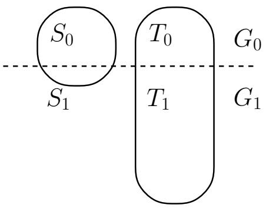

# Fairness Through Awareness

Cynthia Dwork∗

Moritz Hardt† Toniann Pitassi‡ Richard Zemel¶

Omer Reingold§

November 26, 2024

# Abstract

We study fairness in classification, where individuals are classified, e.g., admitted to a university, and the goal is to prevent discrimination against individuals based on their membership in some group, while maintaining utility for the classifier (the university). The main conceptual contribution of this paper is a framework for fair classification comprising (1) a (hypothetical) task-specific metric for determining the degree to which individuals are similar with respect to the classification task at hand; (2) an algorithm for maximizing utility subject to the fairness constraint, that similar individuals are treated similarly. We also present an adaptation of our approach to achieve the complementary goal of “fair affirmative action,” which guarantees statistical parity (i.e., the demographics of the set of individuals receiving any classification are the same as the demographics of the underlying population), while treating similar individuals as similarly as possible. Finally, we discuss the relationship of fairness to privacy: when fairness implies privacy, and how tools developed in the context of differential privacy may be applied to fairness.

# 1 Introduction

In this work, we study fairness in classification. Nearly all classification tasks face the challenge of achieving utility in classification for some purpose, while at the same time preventing discrimination against protected population subgroups. A motivating example is membership in a racial minority in the context of banking. An article in The Wall Street Journal (8/4/2010) describes the practices of a credit card company and its use of a tracking network to learn detailed demographic information about each visitor to the site, such as approximate income, where she shops, the fact that she rents children’s videos, and so on. According to the article, this information is used to “decide which credit cards to show first-time visitors” to the web site, raising the concern of steering, namely the (illegal) practice of guiding members of minority groups into less advantageous credit offerings [SA10].

We provide a normative approach to fairness in classification and a framework for achieving it. Our framework permits us to formulate the question as an optimization problem that can be solved by a linear program. In keeping with the motivation of fairness in online advertising, our approach will permit the entity that needs to classify individuals, which we call the vendor, as much freedom as possible, without knowledge of or trust in this party. This allows the vendor to benefit from investment in data mining and market research in designing its classifier, while our absolute guarantee of fairness frees the vendor from regulatory concerns.

Our approach is centered around the notion of a task-specific similarity metric describing the extent to which pairs of individuals should be regarded as similar for the classification task at hand.1 The similarity metric expresses ground truth. When ground truth is unavailable, the metric may reflect the “best” available approximation as agreed upon by society. Following established tradition [Raw01], the metric is assumed to be public and open to discussion and continual refinement. Indeed, we envision that, typically, the distance metric would be externally imposed, for example, by a regulatory body, or externally proposed, by a civil rights organization.

The choice of a metric need not determine (or even suggest) a particular classification scheme. There can be many classifiers consistent with a single metric. Which classification scheme is chosen in the end is a matter of the vendor’s utility function which we take into account. To give a concrete example, consider a metric that expresses which individuals have similar credit worthiness. One advertiser may wish to target a specific product to individuals with low credit, while another advertiser may seek individuals with good credit.

# 1.1 Key Elements of Our Framework

Treating similar individuals similarly. We capture fairness by the principle that any two individuals who are similar with respect to a particular task should be classified similarly. In order to accomplish this individual-based fairness, we assume a distance metric that defines the similarity between the individuals. This is the source of “awareness” in the title of this paper. We formalize this guiding principle as a Lipschitz condition on the classifier. In our approach a classifier is a randomized mapping from individuals to outcomes, or equivalently, a mapping from individuals to distributions over outcomes. The Lipschitz condition requires that any two individuals $x , y$ that are at distance $d ( x , y ) \in [ 0 , 1 ]$ map to distributions $M ( x )$ and $M ( y )$ respectively, such that the statistical distance between $M ( x )$ and $M ( y )$ is at most $d ( x , y )$ In other words, the distributions over outcomes observed by $x$ and $y$ are indistinguishable up to their distance $d ( x , y )$

Formulation as an optimization problem. We consider the natural optimization problem of constructing fair (i.e., Lipschitz) classifiers that minimize the expected utility loss of the vendor. We observe that this optimization problem can be expressed as a linear program and hence solved efficiently. Moreover, this linear program and its dual interpretation will be used heavily throughout our work.

Connection between individual fairness and group fairness. Statistical parity is the property that the demographics of those receiving positive (or negative) classifications are identical to the demographics of the population as a whole. Statistical parity speaks to group fairness rather than individual fairness, and appears desirable, as it equalizes outcomes across protected and non-protected groups. However, we demonstrate its inadequacy as a notion of fairness through several examples in which statistical parity is maintained, but from the point of view of an individual, the outcome is blatantly unfair. While statistical parity (or group fairness) is insufficient by itself, we investigate conditions under which our notion of fairness implies statistical parity. In Section 3, we give conditions on the similarity metric, via an Earthmover distance, such that fairness for individuals (the Lipschitz condition) yields group fairness (statistical parity). More precisely, we show that the Lipschitz condition implies statistical parity between two groups if and only if the Earthmover distance between the two groups is small. This characterization is an important tool in understanding the consequences of imposing the Lipschitz condition.

Fair affirmative action. In Section 4, we give techniques for forcing statistical parity when it is not implied by the Lipschitz condition (the case of preferential treatment), while preserving as much fairness for individuals as possible. We interpret these results as providing a way of achieving fair affirmative action.

A close relationship to privacy. We observe that our definition of fairness is a generalization of the notion of differential privacy [Dwo06, DMNS06]. We draw an analogy between individuals in the setting of fairness and databases in the setting of differential privacy. In Section 5 we build on this analogy and exploit techniques from differential privacy to develop a more efficient variation of our fairness mechanism. We prove that our solution has small error when the metric space of individuals has small doubling dimension, a natural condition arising in machine learning applications. We also prove a lower bound showing that any mapping satisfying the Lipschitz condition has error that scales with the doubling dimension. Interestingly, these results also demonstrate a quantiative trade-off between fairness and utility. Finally, we touch on the extent to which fairness can hide information from the advertiser in the context of online advertising.

Prevention of certain evils. We remark that our notion of fairness interdicts a catalogue of discriminatory practices including the following, described in Appendix A: redlining; reverse redlining; discrimination based on redundant encodings of membership in the protected set; cutting off business with a segment of the population in which membership in the protected set is disproportionately high; doing business with the “wrong” subset of the protected set (possibly in order to prove a point); and “reverse tokenism.”

# 1.2 Discussion: The Metric

As noted above, the metric should (ideally) capture ground truth. Justifying the availability of or access to the distance metric in various settings is one of the most challenging aspects of our framework, and in reality the metric used will most likely only be society’s current best approximation to the truth. Of course, metrics are employed, implicitly or explicitly, in many classification settings, such as college admissions procedures, advertising (“people who buy X and live in zipcode Y are similar to people who live in zipcode Z and buy W”), and loan applications (credit scores). Our work advocates for making these metrics public.

An intriguing example of an existing metric designed for the health care setting is part of the AALIM project [AAL], whose goal is to provide a decision support system for cardiology that helps a physician in finding a suitable diagnosis for a patient based on the consensus opinions of other physicians who have looked at similar patients in the past. Thus the system requires an accurate understanding of which patients are similar based on information from multiple domains such as cardiac echo videos, heart sounds, ECGs and physicians’ reports. AALIM seeks to ensure that individuals with similar health characteristics receive similar treatments from physicians. This work could serve as a starting point in the fairness setting, although it does not (yet?) provide the distance metric that our approach requires. We discuss this further in Section 6.1.

Finally, we can envision classification situations in which it is desirable to “adjust” or otherwise “make up” a metric, and use this synthesized metric as a basis for determining which pairs of individuals should be classified similarly.2 Our machinery is agnostic as to the “correctness” of the metric, and so can be employed in these settings as well.

# 1.3 Related Work

There is a broad literature on fairness, notably in social choice theory, game theory, economics, and law. Among the most relevant are theories of fairness and algorithmic approaches to apportionment; see, for example, the following books: H. Peyton Young’s Equity, John Roemer’s Equality of Opportunity and Theories of Distributive Justice, as well as John Rawls’ A Theory of Justice and Justice as Fairness: A Restatement. Calsamiglia [Cal05] explains,

“Equality of opportunity defines an important welfare criterion in political philosophy and policy analysis. Philosophers define equality of opportunity as the requirement that an individual’s well being be independent of his or her irrelevant characteristics. The difference among philosophers is mainly about which characteristics should be considered irrelevant. Policymakers, however, are often called upon to address more specific questions: How should admissions policies be designed so as to provide equal opportunities for college? Or how should tax schemes be designed so as to equalize opportunities for income? These are called local distributive justice problems, because each policymaker is in charge of achieving equality of opportunity to a specific issue.”

In general, local solutions do not, taken together, solve the global problem: “There is no mechanism comparable to the invisible hand of the market for coordinating distributive justice at the micro into just outcomes at the macro level” [You95], (although Calsamiglia’s work treats exactly this problem [Cal05]). Nonetheless, our work is decidedly “local,” both in the aforementioned sense and in

our definition of fairness. To our knowledge, our approach differs from much of the literature in our fundamental skepticism regarding the vendor; we address this by separating the vendor from the data owner, leaving classification to the latter.

Concerns for “fairness” also arise in many contexts in computer science, game theory, and economics. For example, in the distributed computing literature, one meaning of fairness is that a process that attempts infinitely often to make progress eventually makes progress. One quantitative meaning of unfairness in scheduling theory is the maximum, taken over all members of a set of longlived processes, of the difference between the actual load on the process and the so-called desired load (the desired load is a function of the tasks in which the process participates) $\left[ \mathrm { A A N ^ { + } 9 8 } \right]$ ; other notions of fairness appear in [BS06, Fei08, FT11], to name a few. For an example of work incorporating fairness into game theory and economics see the eponymous paper [Rab93].

# 2 Formulation of the Problem

In this section we describe our setup in its most basic form. We shall later see generalizations of this basic formulation. Individuals are the objects to be classified; we denote the set of individuals by V. In this paper we consider classifiers that map individuals to outcomes. We denote the set of outcomes by A In the simplest non-trivial case $A = \{ 0 , 1 \}$ To ensure fairness, we will consider randomized classifiers mapping individuals to distributions over outcomes. To introduce our notion of fairness we assume the existence of a metric on individuals $d \colon V \times V  \mathbb { R }$ We will consider randomized mappings $M \colon V \to \Delta ( A )$ . from individuals to probability distributions over outcomes. Such a mapping naturally describes a randomized classification procedure: to classify $x \in V$ choose an outcome a according to the distribution $M ( x )$ . We interpret the goal of “mapping similar people similarly” to mean that the distributions assigned to similar people are similar. Later we will discuss two specific measures of similarity of distributions, $D _ { \infty }$ and $D _ { \mathrm { t v } }$ , of interest in this work.

Definition 2.1 (Lipschitz mapping). A mapping $M \colon V \to \Delta ( A )$ satisfies the $( D , d )$ -Lipschitz property if for every $x , y \in V ,$ we have

$$
D (M x, M y) \leq d (x, y). \tag {1}
$$

When $D$ and $d$ are clear from the context we will refer to this simply as the Lipschitz property.

We note that there always exists a Lipschitz classifier, for example, by mapping all individuals to the same distribution over A Which classifier we shall choose thus depends on a notion of utility. We capture utility using a loss function $L \colon V \times A \to \mathbb { R }$ This setup naturally leads to the optimization problem:

Find a mapping from individuals to distributions over outcomes that minimizes expected loss subject to the Lipschitz condition.

# 2.1 Achieving Fairness

Our fairness definition leads to an optimization problem in which we minimize an arbitrary loss function $L \colon V \times A \to \mathbb { R }$ while achieving the $( D , d )$ -Lipschitz property for a given metric $d \colon V \times V  \mathbb { R }$ . We denote by $\boldsymbol { \mathcal { I } }$ an instance of our problem consisting of a metric $d \colon V \times V  \mathbb { R }$ and a loss function $L \colon V { \times } A \to \mathbb { R }$ , We denote the optimal value of the minimization problem by opt(I), as formally defined .in Figure 1. We will also write the mapping $M \colon V \to \Delta ( A )$ as $M = \{ \mu _ { x } \} _ { x \in V }$ where $\mu _ { x } = M ( x ) \in \Delta ( A )$

$$
\operatorname {o p t} (I) \stackrel {\text {d e f}} {=} \min  _ {\{\mu_ {x} \} _ {x \in V}} \mathbb {E} _ {x \sim V} \mathbb {E} _ {a \sim \mu_ {x}} L (x, a) \tag {2}
$$

$$
\text {s u b j e c t} \quad \forall x, y \in V,: \quad D \left(\mu_ {x}, \mu_ {y}\right) \leq d (x, y) \tag {3}
$$

$$
\forall x \in V: \quad \mu_ {x} \in \Delta (A) \tag {4}
$$

Figure 1: The Fairness LP: Loss minimization subject to fairness constraint

Probability Metrics The first choice for $D$ that may come to mind is the statistical distance: Let $P , Q$ denote probability measures on a finite domain A The statistical distance or total variation norm ,between $P$ and $Q$ is denoted by

$$
D _ {\mathrm {t v}} (P, Q) = \frac {1}{2} \sum_ {a \in A} | P (a) - Q (a) |. \tag {5}
$$

The following lemma is easily derived from the definitions of opt $( \boldsymbol { \mathcal { T } } )$ and $D _ { \mathrm { t v } }$

Lemma 2.1. Let $D = D _ { \mathrm { t v } }$ . Given an instance $\boldsymbol { \mathcal { I } }$ we can compute opt $( \mathcal { T } )$ with a linear program of size poly(|V | |A|)

Remark 2.1. When dealing with the set $V$ , we have assumed that $V$ is the set of real individuals (rather than the potentially huge set of all possible encodings of individuals). More generally, we may only have access to a subsample from the set of interest. In such a case, there is the additional challenge of extrapolating a classifier over the entire set.

A weakness of using $D _ { \mathrm { t v } }$ as the distance measure on distributions, it that we should then assume that the distance metric (measuring distance between individuals) is scaled such that for similar individuals $d ( x , y )$ is very close to zero, while for very dissimilar individuals $d ( x , y )$ is close to one. A potentially better choice for $D$ in this respect is sometimes called relative $\ell _ { \infty }$ metric:

$$
D _ {\infty} (P, Q) = \sup  _ {a \in A} \log \left(\max  \left\{\frac {P (a)}{Q (a)}, \frac {Q (a)}{P (a)} \right\}\right). \tag {6}
$$

With this choice we think of two individuals $x , y$ as similar if $d ( x , y ) \ll 1 $ In this case, the Lipschitz condition in Equation 1 ensures that $x$ and $y$ map to similar distributions over A On the other hand, when $x , y$ are very dissimilar, i.e., $d ( x , y ) \gg 1$ the condition imposes only a weak constraint on the two corresponding distributions over outcomes.

Lemma 2.2. Let $D = D _ { \infty }$ . Given an instance $\boldsymbol { \mathcal { I } }$ we can compute opt $( \mathcal { T } )$ with a linear program of size poly $( | V | , | A | )$

Proof. We note that the objective function and the first constraint are indeed linear in the variables $\mu _ { x } ( a )$ as the first constraint boils down to requirements of the form $\mu _ { x } ( a ) \leq e ^ { d ( x , y ) } \mu _ { y } ( a )$ . The second constraint $\mu _ { x } \in \Delta ( A )$ can easily be rewritten as a set of linear constraints. 

Notation. Recall that we often write the mapping $M \colon V \to \Delta ( A )$ as $M = \{ \mu _ { x } \} _ { x \in V }$ where $\mu _ { x } = M ( x ) \in$ $\Delta ( A )$ In this case, when $S$ is a distribution over $V$ we denote by $\mu _ { S }$ µthe distribution over $A$ defined as $\mu _ { S } ( a ) = \mathbb { E } _ { x \sim S } \mu _ { x } ( a )$ where $a \in A$

Useful Facts It is not hard to check that both $D _ { \mathrm { t v } }$ and $D _ { \infty }$ are metrics with the following properties.

Lemma 2.3. $D _ { \mathrm { t v } } ( P , Q ) \leq 1 - \exp ( - D _ { \infty } ( P , Q ) ) \leq D _ { \infty } ( P , Q )$

Fact 2.1. For any three distributions $P , Q , R$ and non-negative numbers $\alpha , \beta \ge 0$ such that $\alpha + \beta = 1$ we have $D _ { \mathrm { t v } } ( \alpha P + \beta Q , R ) \leq \alpha D _ { \mathrm { t v } } ( P , R ) + \beta D _ { \mathrm { t v } } ( Q , R ) .$

Post-Processing. An important feature of our definition is that it behaves well with respect to postprocessing. Specifically, if $M \colon V \to \Delta ( A )$ is $( D , d )$ -Lipschitz for $D \in \{ D _ { \mathrm { t v } } , D _ { \infty } \}$ and $f \colon A \to B$ is any possibly randomized function from $A$ ,to another set $B$ , then the composition $f \circ M \colon V \to \Delta ( B )$ is a $( D , d )$ ,-Lipschitz mapping. This would in particular be useful in the setting of the example in ,Section 2.2.

# 2.2 Example: Ad network

Here we expand on the example of an advertising network mentioned in the Introduction. We explain how the Fairness LP provides a fair solution protecting against the evils described in Appendix A. The Wall Street Journal article [SA10] describes how the $\left[ \mathbf { X } { + } \mathbf { l } \right]$ tracking network collects demographic information about individuals, such as their browsing history, geographical location, and shopping behavior, and utilizes this to assign a person to one of 66 groups. For example, one of these groups is “White Picket Fences,” a market segment with median household income of just over $\$ 50,000$ , aged 25 to 44 with kids, with some college education, etc. Based on this assignment to a group, CapitalOne decides which credit card, with particular terms of credit, to show the individual. In general we view a classification task as involving two distinct parties: the data owner is a trusted party holding the data of individuals, and the vendor is the party that wishes to classify individuals. The loss function may be defined solely by either party or by both parties in collaboration. In this example, the data owner is the ad network $\left[ \mathbf { X } { + } \mathbf { l } \right]$ , and the vendor is CapitalOne.

The ad network $\left( \left[ \mathbf { x } { + } 1 \right] \right)$ maintains a mapping from individuals into categories. We can think of these categories as outcomes, as they determine which ads will be shown to an individual. In order to comply with our fairness requirement, the mapping from individuals into categories (or outcomes) will have to be randomized and satisfy the Lipschitz property introduced above. Subject to the Lipschitz constraint, the vendor can still express its own belief as to how individuals should be assigned to categories using the loss function. However, since the Lipschitz condition is a hard constraint there is no possibility of discriminating between individuals that are deemed similar by the metric. In particular, this will disallow arbitrary distinctions between protected individuals, thus preventing both reverse tokenism and the self-fulfilling prophecy (see Appendix A). In addition, the metric can eliminate the existence of redundant encodings of certain attributes thus also preventing redlining of those attributes. In Section 3 we will see a characterization of which attributes are protected by the metric in this way.

# 2.3 Connection to Differential Privacy

Our notion of fairness may be viewed as a generalization of differential privacy [Dwo06, DMNS06]. As it turns out our notion can be seen as a generalization of differential privacy. To see this, consider a simple setting of differential privacy where a database curator maintains a database $x$ (thought of as a subset of some universe $U$ ) and a data analyst is allowed to ask a query $F \colon V \to A$ on the database. Here we denote the set of databases by $V = 2 ^ { U }$ and the range of the query by A A mapping

$M \colon V \to \Delta ( A )$ satisfies $\epsilon$ -differential privacy if and only if $M$ satisfies the $( D _ { \infty } , d )$ -Lipschitz property, where, letting $x \triangle y$ denote the symmetric difference between $x$ and $y$ , we define $d ( x , y ) \stackrel { \mathrm { d e f } } { = } \epsilon | x \triangle y |$ .

The utility loss of the analyst for getting an answer $a \ \in \ A$ from the mechanism is defined as $L ( x , a ) = d _ { A } ( F x , a )$ that is distance of the true answer from the given answer. Here distance refers to some distance measure in A that we described using the notation $d _ { A }$ For example, when $A \ = \ \mathbb { R }$ , this could simply be $d _ { A } ( a , b ) = | a - b |$ . The optimization problem (2) in Figure 1 (i.e., $\begin{array} { r } { \mathrm { o p t } ( \mathcal { T } ) \stackrel { \mathrm { d e f } } { = } \operatorname* { m i n } \mathbb { E } _ { x \sim V } \mathbb { E } _ { a \sim \mu _ { x } } L ( x , a ) ) } \end{array}$ , . now defines the optimal differentially private mechanism in this µ ,setting. We can draw a conceptual analogy between the utility model in differential privacy and that in fairness. If we think of outcomes as representing information about an individual, then the vendor wishes to receive what she believes is the most “accurate” representation of an individual. This is quite similar to the goal of the analyst in differential privacy.

In the current work we deal with more general metric spaces than in differential privacy. Nevertheless, we later see (specifically in Section 5) that some of the techniques used in differential privacy carry over to the fairness setting.

# 3 Relationship between Lipschitz property and statistical parity

In this section we discuss the relationship between the Lipschitz property articulated in Definition 2.1 and statistical parity. As we discussed earlier, statistical parity is insufficient as a general notion of fairness. Nevertheless statistical parity can have several desirable features, e.g., as described in Proposition 3.1 below. In this section we demonstrate that the Lipschitz condition naturally implies statistical parity between certain subsets of the population.

Formally, statistical parity is the following property.

Definition 3.1 (Statistical parity). We say that a mapping $M \colon V \to \Delta ( A )$ satisfies statistical parity between distributions $S$ and $T$ up to bias $\epsilon$ if

$$
D _ {\mathrm {t v}} \left(\mu_ {S}, \mu_ {T}\right) \leq \epsilon . \tag {7}
$$

Proposition 3.1. Let $M \colon V \to \Delta ( A )$ be a mapping that satisfies statistical parity between two sets S and $T$ up to bias $\epsilon$ Then, for every set of outcomes $O \subseteq A$ we have the following two properties.

1 $. \ \lvert \mathbb { P r } \left\{ M ( x ) \in O \mid x \in S \right\} - \mathbb { P r } \left\{ M ( x ) \in O \mid x \in T \right\} \rvert \leq \epsilon ,$   
2. $| \operatorname* { P r } \left\{ x \in S \mid M ( x ) \in O \right\} - \operatorname* { P r } \left\{ x \in T \mid M ( x ) \in O \right\} ) | \leq \epsilon .$

Intuitively, this proposition says that if $M$ satisfies statistical parity, then members of S are equally likely to observe a set of outcomes as are members of $T$ Furthermore, the fact that an individual observed a particular outcome provides no information as to whether the individual is a member of S or a member of T We can always choose $T = S ^ { c }$ in which case we compare $S$ to the general population.

# 3.1 Why is statistical parity insufficient?

Although in some cases statistical parity appears to be desirable – in particular, it neutralizes redundant encodings – we now argue its inadequacy as a notion of fairness, presenting three examples in which statistical parity is maintained, but from the point of view of an individual, the outcome is blatantly unfair. In describing these examples, we let S denote the protected set and $S ^ { c }$ its complement.

Example 1: Reduced Utility. Consider the following scenario. Suppose in the culture of S the most talented students are steered toward science and engineering and the less talented are steered toward finance, while in the culture of $S ^ { c }$ the situation is reversed: the most talented are steered toward finance and those with less talent are steered toward engineering. An organization ignorant of the culture of S and seeking the most talented people may select for “economics,” arguably choosing the wrong subset of S , even while maintaining parity. Note that this poor outcome can occur in a “fairness through blindness” approach – the errors come from ignoring membership in S .

Example 2: Self-fulfilling prophecy. This is when unqualified members of $S$ are chosen, in order to “justify” future discrimination against S (building a case that there is no point in “wasting” resources on $S$ ). Although senseless, this is an example of something pernicious that is not ruled out by statistical parity, showing the weakness of this notion. A variant of this apparently occurs in selecting candidates for interviews: the hiring practices of certain firms are audited to ensure sufficiently many interviews of minority candidates, but less care is taken to ensure that the best minorities – those that might actually compete well with the better non-minority candidates – are invited [Zar11].

Example 3: Subset Targeting. Statistical parity for S does not imply statistical parity for subsets of S . This can be maliciously exploited in many ways. For example, consider an advertisement for a product $X$ which is targeted to members of S that are likely to be interested in $X$ and to members of $S ^ { c }$ that are very unlikely to be interested in X. Clicking on such an ad may be strongly correlated with membership in $S$ (even if exposure to the ad obeys statistical parity).

# 3.2 Earthmover distance: Lipschitz versus statistical parity

A fundamental question that arises in our approach is: When does the Lipschitz condition imply statistical parity between two distributions S and T on V? We will see that the answer to this question is closely related to the Earthmover distance between S and $T$ , which we will define shortly.

The next definition formally introduces the quantity that we will study, that is, the extent to which any Lipschitz mapping can violate statistical parity. In other words, we answer the question, “How biased with respect to $S$ and $T$ might the solution of the fairness LP be, in the worst case?”

Definition 3.2 (Bias). We define

$$
\operatorname {b i a s} _ {D, d} (S, T) \stackrel {\text {d e f}} {=} \max  \mu_ {S} (0) - \mu_ {T} (0), \tag {8}
$$

where the maximum is taken over all $( D , d )$ -Lipschitz mappings $M = \{ \mu _ { x } \} _ { x \in V }$ mapping $V$ into $\Delta ( \{ 0 , 1 \} )$

Note that $\mathrm { b i a s } _ { D , d } ( S , T ) \in [ 0 , 1 ]$ Even though in the definition we restricted ourselves to mappings ,into distributions over $\{ 0 , 1 \}$ , . it turns out that this is without loss of generality, as we show next.

Lemma 3.1. Let $D \in \{ D _ { \mathrm { t v } } , D _ { \infty } \}$ and let $M \colon V \to \Delta ( A )$ be any $( D , d )$ -Lipschitz mapping. Then, M ,satisfies statistical parity between $S$ and $T$ up to bi $\mathfrak { t s o } _ { D , d } ( S , T )$

Proof. Let $M = \{ \mu _ { x } \} _ { x \in V }$ be any $( D , d )$ -Lipschitz mapping into $A$ We will construct a $( D , d )$ -Lipschitz mapping $M ^ { \prime } \colon V \to \Delta ( \{ 0 , 1 \} )$ which has the same bias between $S$ and $T$ as $M$

Indeed, let $A _ { S } = \{ a \in A : \mu _ { S } ( a ) > \mu _ { T } ( a ) \}$ and let $A _ { T } = A _ { S } ^ { c }$ $\mathrm { P u t } \mu _ { x } ^ { \prime } ( 0 ) = \mu _ { x } ( A _ { S } )$ and $\mu _ { x } ^ { \prime } ( 1 ) = \mu _ { x } ( A _ { T } )$ We claim that $M ^ { \prime } = \{ \mu _ { x } ^ { \prime } \} _ { x \in V }$ µis a $( D , d )$ . µ-Lipschitz mapping. In both cases $D \in \{ D _ { \mathrm { t v } } , D _ { \infty } \}$ µ .this follows directly from the definition. On the other hand, it is easy to see that

$$
D _ {\mathrm {t v}} \left(\mu_ {S}, \mu_ {T}\right) = D _ {\mathrm {t v}} \left(\mu_ {S} ^ {\prime}, \mu_ {T} ^ {\prime}\right) = \mu_ {S} ^ {\prime} (0) - \mu_ {T} ^ {\prime} (0) \leq \operatorname {b i a s} _ {D, d} (S, T).
$$

Earthmover Distance. We will presently relate bia $s _ { D , d } ( S , T )$ for $D \in \{ D _ { \mathrm { t v } } , D _ { \infty } \}$ to certain Earthmover distances between S and $T$ , which we define next.

Definition 3.3 (Earthmover distance). Let $\sigma \colon V \times V  \mathbb { R }$ be a nonnegative distance function. The $\sigma \mathrm { . }$ σ-Earthmover distance between two distributions $S$ and $T$ , denoted $\sigma _ { \mathrm { E M } } ( S , T )$ is defined as the value σof the so-called Earthmover $L P$ :

$$
\begin{array}{l} \sigma_ {\mathrm {E M}} (S, T) \stackrel {{\mathrm {d e f}}} {{=}} \quad \min  \quad \sum_ {x, y \in V} h (x, y) \sigma (x, y) \\ \text {s u b j e c t} \quad \sum_ {y \in V} h (x, y) = S (x) \\ \sum_ {y \in V} h (y, x) = T (x) \\ h (x, y) \geq 0 \\ \end{array}
$$

We will need the following standard lemma, which simplifies the definition of the Earthmover distance in the case where $\sigma$ is a metric.

Lemma 3.2. Let $d \colon V \times V  \mathbb { R }$ be a metric. Then,

$$
\begin{array}{l} d _ {\mathrm {E M}} (S, T) = \min  \sum_ {x, y \in V} h (x, y) d (x, y) \\ \text {s u b j e c t} \quad \sum_ {y \in V} h (x, y) = \sum_ {y \in V} h (y, x) + S (x) - T (x) \\ h (x, y) \geq 0 \\ \end{array}
$$

Theorem 3.3. Let d be a metric. Then,

$$
\operatorname {b i a s} _ {D _ {\mathrm {t v}}, d} (S, T) \leq d _ {\mathrm {E M}} (S, T). \tag {9}
$$

If furthermore $d ( x , y ) \leq 1$ for all $x , y$ then we have

$$
\operatorname {b i a s} _ {D _ {\mathrm {t v}}, d} (S, T) \geq d _ {\mathrm {E M}} (S, T). \tag {10}
$$

Proof. The proof is by linear programming duality. We can express $\mathsf { b i a s } _ { D _ { \mathrm { t v } } , d } ( S , T )$ as the following linear program:

$$
\begin{array}{l} \operatorname {b i a s} (S, T) = \max  \sum_ {x \in V} S (x) \mu_ {x} (0) - \sum_ {x \in V} T (x) \mu_ {x} (0) \\ \text {s u b j e c t} \quad \mu_ {x} (0) - \mu_ {y} (0) \leq d (x, y) \\ \mu_ {x} (0) + \mu_ {x} (1) = 1 \\ \mu_ {x} (a) \geq 0 \\ \end{array}
$$

Here, we used the fact that

$$
D _ {\mathrm {t v}} \left(\mu_ {x}, \mu_ {y}\right) \leq d (x, y) \quad \Longleftrightarrow \quad \left| \mu_ {x} (0) - \mu_ {y} (0) \right| \leq d (x, y).
$$

The constraint on the RHS is enforced in the linear program above by the two constraints $\mu _ { x } ( 0 ) { - } \mu _ { y } ( 0 ) \leq$ $d ( x , y )$ and $\mu _ { y } ( 0 ) - \mu _ { x } ( 0 ) \leq d ( x , y )$

, y µy µ , y .We can now prove (9). Since $d$ is a metric, we can apply Lemma 3.2. Let $\{ f ( x , y ) \} _ { x , y \in V }$ be a solution to the LP defined in Lemma 3.2. By putting $\epsilon _ { x } = 0$ for all $x \in V ,$ , y ,y we can extend this to a feasible solution to the LP defining bias $( S , T )$  , achieving the same objective value. Hence, we have $\mathtt { b i a s } ( S , T ) \le d _ { \mathrm { E M } } ( S , T )$

Let us now prove (10), using the assumption that $d ( x , y ) \leq 1$ To do so, consider dropping the constraint that $\mu _ { x } ( 0 ) + \mu _ { x } ( 1 ) = 1$ and denote by $\beta ( S , T )$ , y . the resulting LP:

$$
\begin{array}{l} \beta (S, T) \stackrel {{\text {d e f}}} {{=}} \quad \max  \quad \sum_ {x \in V} S (x) \mu_ {x} (0) - \sum_ {x \in V} T (x) \mu_ {x} (0) \\ \text {s u b j e c t} \quad \mu_ {x} (0) - \mu_ {y} (0) \leq d (x, y) \\ \mu_ {x} (0) \geq 0 \\ \end{array}
$$

It is clear that $\beta ( S , T ) \ge \mathrm { b i a s } ( S , T )$ and we claim that in fact ${ \displaystyle \ b i a s ( S , T ) \ \geq \ \beta ( S , T ) }$ To see this, β ,consider any solution $\{ \mu _ { x } ( 0 ) \} _ { x \in V }$ ,to $\beta ( S , T )$ , β , . Without changing the objective value we may assume that $\mathrm { m i n } _ { x \in V } \mu _ { x } ( 0 ) = 0$ µ β , . By our assumption that $d ( x , y ) \leq 1$ this means that $\mathrm { m a x } _ { x \in V } \mu _ { x } ( 0 ) \leq 1 .$ Now put $\mu _ { x } ( 1 ) = 1 - \mu _ { x } ( 0 ) \in [ 0 , 1 ]$ , y This gives a solution to bias $( S , T )$ µ . achieving the same objective value. We µ µtherefore have,

$$
\operatorname {b i a s} (S, T) = \beta (S, T).
$$

On the other hand, by strong LP duality, we have

$$
\begin{array}{l} \beta (S, T) = \quad \min  \quad \sum_ {x, y \in V} h (x, y) d (x, y) \\ \text {s u b j e c t} \quad \sum_ {y \in V} h (x, y) \geq \sum_ {y \in V} h (y, x) + S (x) - T (x) \\ h (x, y) \geq 0 \\ \end{array}
$$

It is clear that in the first constraint we must have equality in any optimal solution. Otherwise we can improve the objective value by decreasing some variable $h ( x , y )$ without violating any constraints.

Since $d$ , yis a metric we can now apply Lemma 3.2 to conclude that $\beta ( S , T ) = d _ { \mathrm { E M } } ( S , T )$ and thus $\mathrm { b i a s } ( S , T ) = d _ { \mathrm { E M } } ( S , T )$ 

Remark 3.1. Here we point out a different proof of the fact that $\mathrm { b i a s } _ { D _ { \mathrm { t v } } , d } ( S , T ) \leq d _ { \mathrm { E M } } ( S , T )$ which does not involve LP duality. Indeed $d _ { \mathrm { E M } } ( S , T )$ can be interpreted as giving the cost of the best coupling between the two distributions $S$ and $T$ ,subject to the penalty function $d ( x , y )$ Recall, a coupling is a distribution $( X , Y )$ over $V \times V$ such that the marginal distributions are $S$ , yand $T$ respectively. The cost ,of the coupling is $\mathbb { E } d ( X , Y )$ , It is not difficult to argue directly that any such coupling gives an upper bound on $\mathsf { b i a s } _ { D _ { \mathrm { t v } } , d } ( S , T )$ We chose the linear programming proof since it leads to additional insight into the tightness of the theorem.

The situation for $\mathrm { b i a s } _ { D _ { \infty } , d }$ is somewhat more complicated and we do not get a tight characterization in terms of an Earthmover distance. We do however have the following upper bound.

# Lemma 3.4.

$$
\operatorname {b i a s} _ {D _ {\infty}, d} (S, T) \leq \operatorname {b i a s} _ {D _ {\mathrm {t v}}, d} (S, T) \tag {11}
$$

Proof. By Lemma 2.3, we have $D _ { \mathrm { t v } } ( \mu _ { x } , \mu _ { y } ) \ : \leq \ : D _ { \infty } ( \mu _ { x } , \mu _ { y } )$ for any two distributions $\mu _ { x } , \mu _ { y }$ Hence, every $( D _ { \infty } , d )$ µ ,-Lipschitz mapping is also $( D _ { \mathrm { t v } } , d )$ µ , µy-Lipschitz. Therefore, $\mathsf { b i a s } _ { D _ { \mathrm { t v } } , d } ( S , T )$ µ , µy. is a relaxation of $\mathsf { b i a s } _ { D _ { \infty } , d } ( S , T )$ 

# Corollary 3.5.

$$
\operatorname {b i a s} _ {D _ {\infty}, d} (S, T) \leq d _ {\mathrm {E M}} (S, T) \tag {12}
$$

For completeness we note the dual linear program obtained from the definition of $\mathsf { b i a s } _ { D _ { \infty } , d } ( S , T )$

$$
\operatorname {b i a s} _ {D _ {\infty}, d} (S, T) = \quad \min  \quad \sum_ {x \in V} \epsilon_ {x}
$$

$$
\text {s u b j e c t} \quad \sum_ {y \in V} f (x, y) + \epsilon_ {x} \geq \sum_ {y \in V} f (y, x) e ^ {d (x, y)} + S (x) - T (x) \tag {13}
$$

$$
\sum_ {y \in V} g (x, y) + \epsilon_ {x} \geq \sum_ {y \in V} g (y, x) e ^ {d (x, y)} \tag {14}
$$

$$
f (x, y), g (x, y) \geq 0
$$

Similar to the proof of Theorem 3.3, we may interpret this program as a flow problem. The variables $f ( x , y ) , g ( x , y )$ represent a nonnegative flow from $x$ to $y$ and $\epsilon _ { x }$ are slack variables. Note that the variables $\epsilon _ { x }$ are unrestricted as they correspond to an equality constraint. The first constraint requires that $x$ has at least $S \left( x \right) - T \left( x \right)$ outgoing units of flow in $f .$ The RHS of the constraints states that the penalty for receiving a unit of flow from $y$ is $e ^ { d ( x , y ) }$ . However, it is no longer clear that we can get rid of the variables $\epsilon _ { x } , g ( x , y )$

Open Question 3.1. Can we achieve a tight characterization of when $( D _ { \infty } , d )$ -Lipschitz implies statistical parity?

# 4 Fair Affirmative Action

In this section, we explore how to implement what may be called fair affirmative action. Indeed, a typical question when we discuss fairness is, “What if we want to ensure statistical parity between two groups S and T but members of S are less likely to be “qualified”? In Section 3, we have seen that when $S$ and $T$ are “similar” then the Lipschitz condition implies statistical parity. Here we consider the complementary case where $S$ and $T$ are very different and imposing statistical parity corresponds to preferential treatment. This is a cardinal question, which we examine with a concrete example illustrated in Figure 2.

For simplicity, let $T = S ^ { c }$ . Assume $| S | / | T \cup S | = 1 / 1 0$ , so S is only $10 \%$ of the population. Suppose that our task-specific metric partitions $S \cup T$ into two groups, call them $G _ { 0 }$ and $G _ { 1 }$ , where members of $G _ { i }$ are very close to one another and very far from all members of $G _ { 1 - i }$ . Let $S _ { i }$ , respectively $T _ { i }$ , denote the intersection $S \cap G _ { i }$ , respectively $T \cap G _ { i }$ , for $i = 0$ 1. Finally, assume $| S _ { 0 } | = | T _ { 0 } | = 9 | S | / 1 0 .$ Thus, $G _ { 0 }$ contains less than $20 \%$ of the total population, and is equally divided between S and $T$ .

The Lipschitz condition requires that members of each $G _ { i }$ be treated similarly to one another, but there is no requirement that members of $G _ { 0 }$ be treated similarly to members of $G _ { 1 }$ . The treatment of

  
Figure 2: $S _ { 0 } = G _ { 0 } \cap S$ , $T _ { 0 } = G _ { 0 } \cap T$

members of S , on average, may therefore be very different from the treatment, on average, of members of $T$ , since members of S are over-represented in $G _ { 0 }$ and under-represented in $G _ { 1 }$ . Thus the Lipschitz condition says nothing about statistical parity in this case.

Suppose the members of $G _ { i }$ are to be shown an advertisement $\mathrm { a d } _ { i }$ for a loan offering, where the terms in $\mathrm { a d } _ { 1 }$ are superior to those in $\mathrm { a d } _ { 0 }$ . Suppose further that the distance metric has partitioned the population according to (something correlated with) credit score, with those in $G _ { 1 }$ having higher scores than those in $G _ { 0 }$ .

On the one hand, this seems fair: people with better ability to repay are being shown a more attractive product. Now we ask two questions: “What is the effect of imposing statistical parity?” and “What is the effect of failing to impose statistical parity?”

Imposing Statistical Parity. Essentially all of $S$ is in $G _ { 0 }$ , so for simplicity let us suppose that indeed $S _ { 0 } = S \subset G _ { 0 }$ . In this case, to ensure that members of $S$ have comparable chance of seeing $\mathrm { a d } _ { 1 }$ as do members of $T$ , members of $S$ must be treated, for the most part, like those in $T _ { 1 }$ . In addition, by the Lipschitz condition, members of $T _ { 0 }$ must be treated like members of $S _ { 0 } = S$ , so these, also, are treated like $T _ { 1 }$ , and the space essentially collapses, leaving only trivial solutions such as assigning a fixed probability distribution on the advertisements $( \mathrm { a d } _ { 0 } , \mathrm { a d } _ { 1 } )$ and showing ads according to this distribution to each individual, or showing all individuals ${ \mathrm { a d } } _ { i }$ for some fixed i. However, while fair (all individuals are treated identically), these solutions fail to take the vendor’s loss function into account.

Failing to Impose Statistical Parity. The demographics of the groups $G _ { i }$ differ from the demographics of the general population. Even though half the individuals shown $\operatorname { a d } _ { 0 }$ are members of $S$ and half are members of $T$ , this in turn can cause a problem with fairness: an “anti-S ” vendor can effectively eliminate most members of $S$ by replacing the “reasonable” advertisement $\operatorname { a d } _ { 0 }$ offering less good terms, with a blatantly hostile message designed to drive away customers. This eliminates essentially all business with members of S , while keeping intact most business with members of $T$ . Thus, if members of $S$ are relatively far from the members of $T$ according to the distance metric, then satisfying the Lipschitz condition may fail to prevent some of the unfair practices.

# 4.1 An alternative optimization problem

With the above discussion in mind, we now suggest a different approach, in which we insist on statistical parity, but we relax the Lipschitz condition between elements of S and elements of $S ^ { c }$ . This is consistent with the essence of preferential treatment, which implies that elements in $S$ are treated differently than elements in T . The approach is inspired by the use of the Earthmover relaxation in the context of metric labeling and 0-extension [KT02, CKNZ04]. Relaxing the $S \times T$ Lipschitz constraints also makes sense if the information about the distances between members of $S$ and members of $T$ is of lower quality, or less reliable, than the internal distance information within these two sets.

We proceed in two steps:

1. (a) First we compute a mapping from elements in S to distributions over $T$ which transports the uniform distribution over S to the uniform distribution over $T$ , while minimizing the total distance traveled. Additionally the mapping preserves the Lipschitz condition between elements within S   
(b) This mapping gives us the following new loss function for elements of T : For $y \in T$ and $a \in A$ we define a new loss, $L ^ { \prime } ( y , a )$ , as

$$
L ^ {\prime} (y, a) = \sum_ {x \in S} \mu_ {x} (y) L (x, a) + L (y, a),
$$

where $\{ \mu _ { x } \} _ { x \in S }$ denotes the mapping computed in step (a). $L ^ { \prime }$ can be viewed as a reweighting µof the loss function $L$ , taking into account the loss on $S$ (indirectly through its mapping to T ).

2. Run the Fairness LP only on $T$ , using the new loss function $L ^ { \prime }$ .

Composing these two steps yields a a mapping from $V = S \cup T$ into $A$

Formally, we can express the first step of this alternative approach as a restricted Earthmover problem defined as

$$
d _ {\mathrm {E M} + \mathrm {L}} (S, T) \stackrel {\text {d e f}} {=} \quad \min  \quad \underset {x \in S} {\mathbb {E}} \underset {y \sim \mu_ {x}} {\mathbb {E}} d (x, y) \tag {15}
$$

$$
\text {s u b j e c t} \quad D \left(\mu_ {x}, \mu_ {x ^ {\prime}}\right) \leq d \left(x, x ^ {\prime}\right) \quad \text {f o r a l l} \quad x, x ^ {\prime} \in S
$$

$$
D _ {\mathrm {t v}} \left(\mu_ {S}, U _ {T}\right) \leq \epsilon
$$

$$
\mu_ {x} \in \Delta (T) \quad \text {f o r a l l} \quad x \in S
$$

Here, $U _ { T }$ denotes the uniform distribution over T Given $\{ \mu _ { x } \} _ { x \in S }$ which minimizes (15) and $\{ \nu _ { x } \} _ { x \in T }$ .which minimizes the original fairness LP (2) restricted to $T$ µ we define the mapping $M \colon V \to \Delta ( A )$ by putting

$$
M (x) = \left\{ \begin{array}{l l} v _ {x} & x \in T \\ \mathbb {E} _ {y \sim \mu_ {x}} v _ {y} & x \in S \end{array} . \right. \tag {16}
$$

Before stating properties of the mapping $M$ we make some remarks.

1. Fundamentally, this new approach shifts from minimizing loss, subject to the Lipschitz constraints, to minimizing loss and disruption of $S \times T$ Lipschitz requirement, subject to the parity and $S \times S$ and $T \times T$ Lipschitz constraints. This gives us a bicriteria optimization problem, with a wide range of options.

2. We also have some flexibility even in the current version. For example, we can eliminate the re-weighting, prohibiting the vendor from expressing any opinion about the fate of elements in S . This makes sense in several settings. For example, the vendor may request this due to ignorance (e.g., lack of market research) about S , or the vendor may have some (hypothetical) special legal status based on past discrimination against S .   
3. It is instructive to compare the alternative approach to a modification of the Fairness LP in which we enforce statistical parity and eliminate the Lipschitz requirement on $S \times T$ . The alternative approach is more faithful to the $S \times T$ distances, providing protection against the self-fulfilling prophecy discussed in the Introduction, in which the vendor deliberately selects the “wrong” subset of S while still maintaining statistical parity.   
4. A related approach to addressing preferential treatment involves adjusting the metric in such a way that the Lipschitz condition will imply statistical parity. This coincides with at least one philosophy behind affirmative action: that the metric does not fully reflect potential that may be undeveloped because of unequal access to resources. Therefore, when we consider one of the strongest individuals in S , affirmative action suggests it is more appropriate to consider this individual as similar to one of the strongest individuals of $T$ (rather than to an individual of $T$ which is close according to the original distance metric). In this case, it is natural to adjust the distances between elements in S and $T$ rather than inside each one of the populations (other than possibly re-scaling). This gives rise to a family of optimization problems:

Find a new distance metric $d ^ { \prime }$ which “best approximates” $d$ under the condition that S and $T$ have small Earthmover distance under $d ^ { \prime }$ ,

where we have the flexibility of choosing the measure of quality to how well $d ^ { \prime }$ approximates $d$

Let $M$ be the mapping of Equation 16. The following properties of $M$ are easy to verify.

Proposition 4.1. The mapping M defined in (16) satisfies

1. statistical parity between S and T up to bias   
2. the Lipschitz condition for every pair $( x , y ) \in ( S \times S ) \cup ( T \times T )$

Proof. The first property follows since

$$
D _ {\mathrm {t v}} (M (S), M (T)) = D _ {\mathrm {t v}} \left(\underset {x \in S} {\mathbb {E}} \underset {y \sim \mu_ {x}} {\mathbb {E}} \nu_ {y}, \underset {x \in T} {\mathbb {E}} \nu_ {x}\right) \leq D _ {\mathrm {t v}} (\mu_ {S}, U _ {T}) \leq \epsilon .
$$

The second claim is trivial for $( x , y ) \in T \times T$ So, let $( x , y ) \in S \times S$ Then,

$$
D (M (x), M (y)) \leq D (\mu_ {x}, \mu_ {y}) \leq d (x, y).
$$

We have given up the Lipschitz condition between $S$ and $T$ , instead relying on the terms $d ( x , y )$ in the objective function to discourage mapping $x$ to distant $y$ , y’s. It turns out that the Lipschitz condition between elements $x \in S$ and $y \in T$ yis still maintained on average and that the expected violation is given by $d _ { \mathrm { E M + L } } ( S , T )$ as shown next.

Proposition 4.2. Suppose $D = D _ { \mathrm { t v } }$ in (15). Then, the resulting mapping M satisfies

$$
\underset {x \in S} {\mathbb {E}} \max _ {y \in T} \left[ D _ {\mathrm {t v}} (M (x), M (y)) - d (x, y) \right] \leq d _ {\mathrm {E M + L}} (S, T).
$$

Proof. For every $x \in S$ and $y \in T$ we have

$$
\begin{array}{l} D _ {\mathrm {t v}} (M (x), M (y)) = D _ {\mathrm {t v}} \left(\underset {z \sim \mu_ {x}} {\mathbb {E}} M (z), M (y)\right) \\ \leq \mathbb {E} _ {z \sim \mu_ {x}} D _ {\mathrm {t v}} (M (z), M (y)) \quad (\text {b y}) \\ \leq \underset {z \sim \mu_ {x}} {\mathbb {E}} d (z, y) \quad (\text {P r o p o s i t i o n 4 . 1 s i n c e} z, y \in T) \\ \leq d (x, y) + \underset {z \sim \mu_ {x}} {\mathbb {E}} d (x, z) \quad (\text {b y}) \\ \end{array}
$$

The proof is completed by taking the expectation over $x \in S$

An interesting challenge for future work is handling preferential treatment of multiple protected subsets that are not mutually disjoint. The case of disjoint subsets seems easier and in particular amenable to our approach.

# 5 Small loss in bounded doubling dimension

The general LP shows that given an instance $\boldsymbol { \mathcal { I } }$ , it is possible to find an “optimally fair” mapping in polynomial time. The result however does not give a concrete quantitative bound on the resulting loss. Further, when the instance is very large, it is desirable to come up with more efficient methods to define the mapping.

We now give a fairness mechanism for which we can prove a bound on the loss that it achieves in a natural setting. Moreover, the mechanism is significantly more efficient than the general linear program. Our mechanism is based on the exponential mechanism [MT07], first considered in the context of differential privacy.

We will describe the method in the natural setting where the mapping $M$ maps elements of $V$ to distributions over $V$ itself. The method could be generalized to a different set A as long as we also have a distance function defined over A and some distance preserving embedding of $V$ into A. A natural loss function to minimize in the setting where $V$ is mapped into distributions over $V$ is given by the metric $d$ itself. In this setting we will give an explicit Lipschitz mapping and show that under natural assumptions on the metric space $( V , d )$ the mapping achieves small loss.

Definition 5.1. Given a metric $d \colon V \times V  \mathbb { R }$ the exponential mechanism E : $V \to \Delta ( V )$ is defined by putting

$$
\operatorname {E} (x) \stackrel {\text {d e f}} {=} \left[ Z _ {x} ^ {- 1} e ^ {- d (x, y)} \right] _ {y \in V},
$$

where $\begin{array} { r } { Z _ { x } = \sum _ { y \in V } e ^ { - d ( x , y ) } } \end{array}$

Lemma 5.1 ([MT07]). The exponential mechanism is $( D _ { \infty } , d )$ -Lipschitz.

One cannot in general expect the exponential mechanism to achieve small loss. However, this turns out to be true in the case where $( V , d )$ has small doubling dimension. It is important to note that in differential privacy, the space of databases does not have small doubling dimension. The situation

in fairness is quite different. Many metric spaces arising in machine learning applications do have bounded doubling dimension. Hence the theorem that we are about to prove applies in many natural settings.

Definition 5.2. The doubling dimension of a metric space $( V , d )$ is the smallest number $k$ such that for every $x \in V$ and every $R \geq 0$ the ball of radius $R$ around $x$ denoted $B ( x , R ) = \{ y \in V \colon d ( x , y ) \leq R \}$ can be covered by $2 ^ { k }$ balls of radius $R / 2$

We will also need that points in the metric space are not too close together.

Definition 5.3. We call a metric space $( V , d )$ well separated if there is a positive constant $\epsilon > 0$ such that $| B ( x , \epsilon ) | = 1$ for all $x \in V .$

Theorem 5.2. Let d be a well separated metric space of bounded doubling dimension. Then the exponential mechanism satisfies

$$
\underset {x \in V} {\mathbb {E}} \underset {y \sim \mathrm {E} (x)} {\mathbb {E}} d (x, y) = O (1).
$$

Proof. Suppose $d$ has doubling dimension $k$ It was shown in [CG08] that doubling dimension $k$ implies for every $R \geq 0$ that

$$
\underset {x \in V} {\mathbb {E}} | B (x, 2 R) | \leq 2 ^ {k ^ {\prime}} \underset {x \in V} {\mathbb {E}} | B (x, R) |, \tag {17}
$$

where $k ^ { \prime } = O ( k )$ It follows from this condition and the assumption on $( V , d )$ that for some positive $\epsilon > 0$

$$
\underset {x \in V} {\mathbb {E}} | B (x, 1) | \leq \left(\frac {1}{\epsilon}\right) ^ {k ^ {\prime}} \underset {x \in V} {\mathbb {E}} | B (x, \epsilon) | = 2 ^ {O (k)}. \tag {18}
$$

Then,

$$
\begin{array}{l} \mathbb{E}_{x\in V}\mathbb{E}_{y\sim \mathrm{E}(x)}d(x,y)\leq 1 + \mathbb{E}_{x\in V}\int_{1}^{\infty}\frac{re^{-r}}{Z_{x}} |B(x,r)|\mathrm{d}r \\ \leq 1 + \mathbb {E} _ {x \in V} \int_ {1} ^ {\infty} r e ^ {- r} | B (x, r) | \mathrm {d} r \quad (\text {s i n c e} Z _ {x} \geq e ^ {- d (x, x)} = 1) \\ = 1 + \int_ {1} ^ {\infty} r e ^ {- r} \mathbb {E} _ {x \in V} | B (x, r) | \mathrm {d} r \\ \leq 1 + \int_ {1} ^ {\infty} r e ^ {- r} r ^ {k ^ {\prime}} \underset {x \in V} {\mathbb {E}} | B (x, 1) | \mathrm {d} r \quad \text {(u s i n g (1 8))} \\ \leq 1 + 2 ^ {O (k)} \int_ {0} ^ {\infty} r ^ {k ^ {\prime} + 1} e ^ {- r} d r \\ \leq 1 + 2 ^ {O (k)} \left(k ^ {\prime} + 2\right)! \\ \end{array}
$$

As we assumed that $k = O ( 1 )$ we conclude

$$
\underset {x \in V} {\mathbb {E}} \underset {y \sim \operatorname {E} (x)} {\mathbb {E}} d (x, y) \leq 2 ^ {O (k)} (k ^ {\prime} + 2)! \leq O (1).
$$

Remark 5.1. If $( V , d )$ is not well-separated, then for every constant $\epsilon > 0$ it must contain a wellseparated subset $V ^ { \prime } \subseteq V$ such that every point $x \in V$ has a neighbor $x ^ { \prime } \in V ^ { \prime }$ such that $d ( x , x ^ { \prime } ) \leq \epsilon$ A Lipschitz mapping $M ^ { \prime }$ defined on $V ^ { \prime }$ naturally extends to all of $V$ by putting $M ( x ) = M ^ { \prime } ( x ^ { \prime } )$

where $x ^ { \prime }$ is the nearest neighbor of $x$ in $V ^ { \prime }$ It is easy to see that the expected loss of $M$ is only an additive $\epsilon$ worse than that of $M ^ { \prime }$ . Similarly, the Lipschitz condition deteriorates by an additive $2 \epsilon$ ， i.e., $D _ { \infty } ( M ( x ) , M ( y ) ) \leq d ( x , y ) + 2 \epsilon$ Indeed, denoting the nearest neighbors in $V ^ { \prime }$ of $x , y$ by $x ^ { \prime } , y ^ { \prime }$ , yrespectively, we have $D _ { \infty } ( M ( x ) , M ( y ) ) = D _ { \infty } ( M ^ { \prime } ( x ^ { \prime } ) , M ^ { \prime } ( y ^ { \prime } ) ) \leq d ( x ^ { \prime } , y ^ { \prime } ) \leq d ( x , y ) + d ( x , x ^ { \prime } ) + d ( y , y ^ { \prime } ) \leq \frac { 1 - \gamma } { 2 } .$ $d ( x , y ) + 2 \epsilon$ , y Here, we used the triangle inequality.

The proof of Theorem 5.2 shows an exponential dependence on the doubling dimension $k$ of the underlying space in the error of the exponential mechanism. The next theorem shows that the loss of any Lipschitz mapping has to scale at least linearly with $k$ The proof follows from a packing argument .similar to that in [HT10]. The argument is slightly complicated by the fact that we need to give a lower bound on the average error (over $x \in V .$ ) of any mechanism.

Definition 5.4. A set $B \subseteq V$ is called an $R$ -packing if $d ( x , y ) > R$ for all $x , y \in B$

Here we give a lower bound using a metric space that may not be well-separated. However, following Remark 5.1, this also shows that any mapping defined on a well-separated subset of the metric space must have large error up to a small additive loss.

Theorem 5.3. For every $k \geq 2$ and every large enough $n \geq n _ { 0 } ( k )$ there exists an n-point metric space of doubling dimension $O ( k )$ such that any $( D _ { \infty } , d )$ -Lipschitz mapping $M \colon V \to \Delta ( V )$ must satisfy

$$
\underset {x \in V} {\mathbb {E}} \underset {y \sim M (x)} {\mathbb {E}} d (x, y) \geq \Omega (k).
$$

Proof. Construct $V$ by randomly picking $n$ points from a $r$ -dimensional sphere of radius $1 0 0 k$ We will choose $n$ sufficiently large and $r = O ( k )$ Endow $V$ with the Euclidean distance $d$ Since $V \subseteq \mathbb { R } ^ { r }$ and $r = O ( k )$ it follows from a well-known fact that the doubling dimension of $( V , d )$ is bounded by $O ( k )$

Claim 5.4. Let X be the distribution obtained by choosing a random $x \in V$ and outputting a random $y \in B ( x , k )$ Then, for sufficiently large n the distribution $X$ has statistical distance at most 1 100 from the uniform distribution over V

Proof. The claim follows from standard arguments showing that for large enough n every point $y \in V$ is contained in approximately equally many balls of radius $k$ 

Let M denote any $( D _ { \infty } , d )$ -Lipschitz mapping and denote its error on a point $x \in V$ by

$$
R (x) = \underset {y \sim M (x)} {\mathbb {E}} d (x, y).
$$

and put $R = \mathbb { E } _ { x \in V } R ( x )$ Let $G = \{ x \in V \colon R ( x ) \leq 2 R \}$ By Markov’s inequality $| G | \geq n / 2$

Now, pick $x \in V$ . .uniformly at random and choose a set $P _ { x }$ of $2 ^ { 2 k }$ / .random points (with replacement) from $B ( x , k )$ For sufficiently large dimension $r = O ( k )$ it follows from concentration of measure on the sphere that $P _ { x }$ forms a $k / 2$ -packing with probability, say, 1 10

/Moreover, by Claim 5.4, for random $x \in V$ and random $y \in B ( x , k )$ the probability that $y \in G$ is at least $| G | / | V | - 1 / 1 0 0 \geq 1 / 3$ Hence, with high probability,

$$
\left| P _ {x} \cap G \right| \geq 2 ^ {2 k} / 1 0. \tag {19}
$$

Now, suppose $M$ satisfies $R \leq k / 1 0 0$ We will lead this to a contradiction thus showing that $M$ has average error at least $k / 1 0 0$ / . Indeed, under the assumption that $R \leq k / 1 0 0$ we have that for every $y \in G$

$$
\Pr \left\{M (y) \in B (y, k / 5 0) \right\} \geq \frac {1}{2}, \tag {20}
$$

and therefore

$$
1 \geq \Pr \left\{M (x) \in \cup_ {y \in P _ {x} \cap G} B (y, k / 2) \right\} = \sum_ {y \in P _ {x} \cap G} \Pr \left\{M (x) \in B (y, k / 2) \right\} \quad (\text {s i n c e} P _ {x} \text {i s a} k / 2 \text {- p a c k i n g})
$$

$$
\geq \sum_ {y \in P _ {x} \cap G} \exp (- k) \Pr (M (y) \in B (y, k / 2))
$$

(by the Lipschitz condition)

$$
= \frac {2 ^ {2 k}}{1 0} \cdot \frac {\exp (- k)}{2} > 1.
$$

This is a contradiction which shows that $R > k / 1 0 0$

Open Question 5.1. Can we improve the exponential dependence on the doubling dimension in our upper bound?

# 6 Discussion and Future Directions

In this paper we introduced a framework for characterizing fairness in classification. The key element in this framework is a requirement that similar people be treated similarly in the classification. We developed an optimization approach which balanced these similarity constraints with a vendor’s loss function. and analyzed when this local fairness condition implies statistical parity, a strong notion of equal treatment. We also presented an alternative formulation enforcing statistical parity, which is especially useful to allow preferential treatment of individuals from some group. We remark that although we have focused on using the metric as a method of defining and enforcing fairness, one can also use our approach to certify fairness (or to detect unfairness). This permits us to evaluate classifiers even when fairness is defined based on data that simply isn’t available to the classification algorithm3.

Below we consider some open questions and directions for future work.

# 6.1 On the Similarity Metric

As noted above, one of the most challenging aspects of our work is justifying the availability of a distance metric. We argue here that the notion of a metric already exists in many classification problems, and we consider some approaches to building such a metric.

# 6.1.1 Defining a metric on individuals

The imposition of a metric already occurs in many classification processes. Examples include credit scores4 for loan applications, and combinations of test scores and grades for some college admissions. In some cases, for reasons of social engineering, metrics may be adjusted based on membership in various groups, for example, to increase geographic and ethnic diversity.

The construction of a suitable metric can be partially automated using existing machine learning techniques. This is true in particular for distances $d ( x , y )$ where $x$ and $y$ are both in the same protected

set or both in the general population. When comparing individuals from different groups, we may need human insight and domain information. This is discussed further in Section 6.1.2.

Another direction, which intrigues us but which have not yet pursued, is particularly relevant to the context of on-line services (or advertising): allow users to specify attributes they do or do not want to have taken into account in classifying content of interest. The risk, as noted early on in this work, is that attributes may have redundant encodings in other attributes, including encodings of which the user, the ad network, and the advertisers may all be unaware. Our notion of fairness can potentially give a refinement of the “user empowerment” approach by allowing a user to participate in defining the metric that is used when providing services to this user (one can imagine for example a menu of metrics each one supposed to protect some subset of attributes). Further research into the feasibility of this approach is needed, in particular, our discussion throughout this paper has assumed that a single metric is used across the board. Can we make sense out of the idea of applying different metrics to different users?

# 6.1.2 Building a metric via metric labeling

One approach to building the metric is to first build a metric on $S ^ { c }$ , say, using techniques from machine learning, and then “inject” members of S into the metric by mapping them to members of S in a fashion consistent with observed information. In our case, this observed information would come from the human insight and domain information mentioned above. Formally, this can be captured by the problem of metric labeling [KT02]: we have a collection of $| S ^ { c } |$ labels for which a metric is defined, together with |S | objects, each of which is to be assigned a label.

It may be expensive to access this extra information needed for metric labeling. We may ask the question of how much information do we need in order to approximate the result we would get were we to have all this information. This is related to our next question.

# 6.1.3 How much information is needed?

Suppose there is an unknown metric $d ^ { * }$ (the right metric) that we are trying to find. We can ask an expert panel to tell us $d ^ { * } ( x , y )$ given $( x , y ) \in V ^ { 2 }$ The experts are costly and we are trying to minimize the number of calls we need to make. The question is: How many queries $q$ do we need to make to be able to compute a metric $d \colon V \times V  \mathbb { R }$ such that the distortion between $d$ and $d ^ { * }$ is at most $C$ i.e.,

$$
\sup  _ {x, y \in V} \max  \left\{\frac {d (x , y)}{d ^ {*} (x , y)}, \frac {d ^ {*} (x , y)}{d (x , y)} \right\} \leq C. \tag {21}
$$

The problem can be seen as a variant of the well-studied question of constructing spanners. A spanner is a small implicit representation of a metric $d ^ { * }$ While this is not exactly what we want, it .seems that certain spanner constructions work in our setting as well,are willing to relax the embedding problem by permitting a certain fraction of the embedded edges to have arbitrary distortion, as any finite metric can be embedded, with constant slack and constant distortion, into constant-dimensional Euclidean space $[ \mathrm { A B C ^ { + } 0 5 } ]$ .

# 6.2 Case Study on Applications in Health Care

An interesting direction for a case study is suggested by another Wall Street Journal article (11/19/2010) that describes the (currently experimental) practice of insurance risk assessment via online tracking.

For example, food purchases and exercise habits correlate with certain diseases. This is a stimulating, albeit alarming, development. In the most individual-friendly interpretation described in the article, this provides a method for assessing risk that is faster and less expensive than the current practice of testing blood and urine samples. “Deloitte and the life insurers stress the databases wouldn’t be used to make final decisions about applicants. Rather, the process would simply speed up applications from people who look like good risks. Other people would go through the traditional assessment process.” [SM10] Nonetheless, there are risks to the insurers, and preventing discrimination based on protected status should therefore be of interest:

“The information sold by marketing-database firms is lightly regulated. But using it in the life-insurance application process would “raise questions” about whether the data would be subject to the federal Fair Credit Reporting Act, says Rebecca Kuehn of the Federal Trade Commission’s division of privacy and identity protection. The law’s provisions kick in when “adverse action” is taken against a person, such as a decision to deny insurance or increase rates.”

As mentioned in the introduction, the AALIM project [AAL] provides similarity information suitable for the health care setting. While their work is currently restricted to the area of cardiology, future work may extend to other medical domains. Such similarity information may be used to assemble a metric that decides which individual have similar medical conditions. Our framework could then employ this metric to ensure that similar patients receive similar health care policies. This would help to address the concerns articulated above. We pose it as an interesting direction for future work to investigate how a suitable fairness metric could be extracted from the AALIM system.

# 6.3 Does Fairness Hide Information?

We have already discussed the need for hiding (non-)membership in S in ensuring fairness. We now ask a converse question: Does fairness in the context of advertising hide information from the advertiser?

Statistical parity has the interesting effect that it eliminates redundant encodings of $S$ in terms of A in the sense that after applying $M .$ there is no $f \colon A \to \{ 0 , 1 \}$ that can be biased against $S$ in any way. This prevents certain attacks that aim to determine membership in S .

Unfortunately, this property is not hereditary. Indeed, suppose that the advertiser wishes to target HIV-positive people. If the set of HIV-positive people is protected, then the advertiser is stymied by the statistical parity constraint. However, suppose it so happens that the advertiser’s utility function is extremely high on people who are not only HIV-positive but who also have AIDS. Consider a mapping that satisfies statistical parity for “HIV-positive,” but also maximizes the advertiser’s utility. We expect that the necessary error of such a mapping will be on members of “HIV\AIDS,” that is, people who are HIV-positive but who do not have AIDS. In particular, we don’t expect the mapping to satisfy statistical parity for “AIDS” – the fraction of people with AIDS seeing the advertisement may be much higher than the fraction of people with AIDS in the population as a whole. Hence, the advertiser can in fact target “AIDS”.

Alternatively, suppose people with AIDS are mapped to a region $B \subset A$ , as is a |AIDS| |HIV positive| fraction of HIV-negative individuals. Thus, being mapped to $B$ /maintains statistical parity for the set of HIV-positive individuals, meaning that the probability that a random HIV-positive individual is mapped to $B$ is the same as the probability that a random member of the whole population is mapped to $B$ . Assume further that mappings to $A \backslash B$ also maintains parity. Now the advertiser can refuse to do

business with all people with AIDS, sacrificing just a small amount of business in the HIV-negative community.

These examples show that statistical parity is not a good method of hiding sensitive information in targeted advertising. A natural question, not yet pursued, is whether we can get better protection using the Lipschitz property with a suitable metric.

# Acknowledgments

We would like to thank Amos Fiat for a long and wonderful discussion which started this project. We also thank Ittai Abraham, Boaz Barak, Mike Hintze, Jon Kleinberg, Robi Krauthgamer, Deirdre Mulligan, Ofer Neiman, Kobbi Nissim, Aaron Roth, and Tal Zarsky for helpful discussions. Finally, we are deeply grateful to Micah Altman for bringing to our attention key philosophical and economics works.

# References

[AAL] AALIM. http://www.almaden.ibm.com/cs/projects/aalim/.   
$\left[ { \bf A A N ^ { + } 9 8 } \right]$ Miklos Ajtai, James Aspnes, Moni Naor, Yuval Rabani, Leonard J. Schulman, and Orli Waarts. Fairness in scheduling. Journal of Algorithms, 29(2):306–357, November 1998.   
$[ \mathrm { A B C ^ { + } O 5 } ]$ Ittai Abraham, Yair Bartal, Hubert T.-H. Chan, Kedar Dhamdhere, Anupam Gupta, Jon M. Kleinberg, Ofer Neiman, and Aleksandrs Slivkins. Metric embeddings with relaxed guarantees. In FOCS, pages 83–100. IEEE, 2005.   
[BS06] Nikhil Bansal and Maxim Sviridenko. The santa claus problem. In Proc. 38th STOC, pages 31–40. ACM, 2006.   
[Cal05] Catarina Calsamiglia. Decentralizing equality of opportunity and issues concerning the equality of educational opportunity, 2005. Doctoral Dissertation, Yale University.   
[CG08] T.-H. Hubert Chan and Anupam Gupta. Approximating TSP on metrics with bounded global growth. In Proc. 19th Symposium on Discrete Algorithms (SODA), pages 690–699. ACM-SIAM, 2008.   
[CKNZ04] Chandra Chekuri, Sanjeev Khanna, Joseph Naor, and Leonid Zosin. A linear programming formulation and approximation algorithms for the metric labeling problem. SIAM J. Discrete Math., 18(3):608–625, 2004.   
[DMNS06] Cynthia Dwork, Frank McSherry, Kobbi Nissim, and Adam Smith. Calibrating noise to sensitivity in private data analysis. In Proc. 3rd TCC, pages 265–284. Springer, 2006.   
[Dwo06] Cynthia Dwork. Differential privacy. In Proc. 33rd ICALP, pages 1–12. Springer, 2006.   
[Fei08] Uri Feige. On allocations that maximize fairness. In Proc. 19th Symposium on Discrete Algorithms (SODA), pages 287–293. ACM-SIAM, 2008.   
[FT11] Uri Feige and Moshe Tennenholtz. Mechanism design with uncertain inputs (to err is human, to forgive divine). In Proc. 43rd STOC, pages 549–558. ACM, 2011.

[HT10] Moritz Hardt and Kunal Talwar. On the geometry of differential privacy. In Proc. 42nd STOC. ACM, 2010.   
[Hun05] D. Bradford Hunt. Redlining. Encyclopedia of Chicago, 2005.   
[JM09] Carter Jernigan and Behram F.T. Mistree. Gaydar: Facebook friendships expose sexual orientation. First Monday, 14(10), 2009.   
[KT02] Jon M. Kleinberg and Eva Tardos. Approximation algorithms for classification problems ´ with pairwise relationships: metric labeling and markov random fields. Journal of the ACM (JACM), 49(5):616–639, 2002.   
[MT07] Frank McSherry and Kunal Talwar. Mechanism design via differential privacy. In Proc. 48th Foundations of Computer Science (FOCS), pages 94–103. IEEE, 2007.   
[Rab93] M. Rabin. Incorporating fairness into game theory and economics. The American Economic Review, 83:1281–1302, 1993.   
[Raw01] John Rawls. Justice as Fairness, A Restatement. Belknap Press, 2001.   
[SA10] Emily Steel and Julia Angwin. On the web’s cutting edge, anonymity in name only. The Wall Street Journal, 2010.   
[SM10] Leslie Scism and Mark Maremont. Insurers test data profiles to identify risky clients. The Wall Street Journal, 2010.   
[You95] H. Peyton Young. Equity. Princeton University Press, 1995.   
[Zar11] Tal Zarsky. Private communication. 2011.

# A Catalog of Evils

We briefly summarize here behaviors against which we wish to protect. We make no attempt to be formal. Let S be a protected set.

1. Blatant explicit discrimination. This is when membership in $S$ is explicitly tested for and a “worse” outcome is given to members of $S$ than to members of $S ^ { c }$ .   
2. Discrimination Based on Redundant Encoding. Here the explicit test for membership in $S$ is replaced by a test that is, in practice, essentially equivalent. This is a successful attack against “fairness through blindness,” in which the idea is to simply ignore protected attributes such as sex or race. However, when personalization and advertising decisions are based on months or years of on-line activity, there is a very real possibility that membership in a given demographic group is embedded holographically in the history. Simply deleting, say, the Facebook “sex” and “Interested in men/women” bits almost surely does not hide homosexuality. This point was argued by the (somewhat informal) “Gaydar” study [JM09] in which a threshold was found for predicting, based on the sexual preferences of his male friends, whether or not a given male is interested in men. Such redundant encodings of sexual preference and other attributes need not be explicitly known or recognized as such, and yet can still have a discriminatory effect.

3. Redlining. A well-known form of discrimination based on redundant encoding. The following definition appears in an article by [Hun05], which contains the history of the term, the practice, and its consequences: “Redlining is the practice of arbitrarily denying or limiting financial services to specific neighborhoods, generally because its residents are people of color or are poor.”   
4. Cutting off business with a segment of the population in which membership in the protected set is disproportionately high. A generalization of redlining, in which members of S need not be a majority of the redlined population; instead, the fraction of the redlined population belonging to S may simply exceed the fraction of S in the population as a whole.   
5. Self-fulfilling prophecy. Here the vendor advertiser is willing to cut off its nose to spite its face, deliberately choosing the “wrong” members of S in order to build a bad “track record” for S . A less malicious vendor may simply select random members of S rather than qualified members, thus inadvertently building a bad track record for S   
6. Reverse tokenism. This concept arose in the context of imagining what might be a convincing refutation to the claim “The bank denied me a loan because I am a member of S .” One possible refutation might be the exhibition of an “obviously more qualified” member of $S ^ { c }$ who is also denied a loan. This might be compelling, but by sacrificing one really good candidate $c \in S ^ { c }$ the bank could refute all charges of discrimination against S . That is, $c$ is a token rejectee; hence the term “reverse tokenism” (“tokenism” usually refers to accepting a token member of $S$ ). We remark that the general question of explaining decisions seems quite difficult, a situation only made worse by the existence of redundant encodings of attributes.