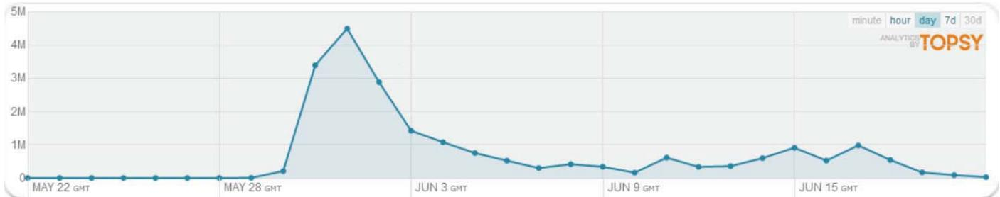
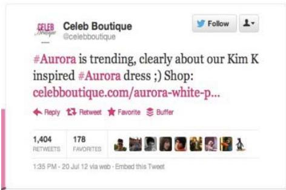
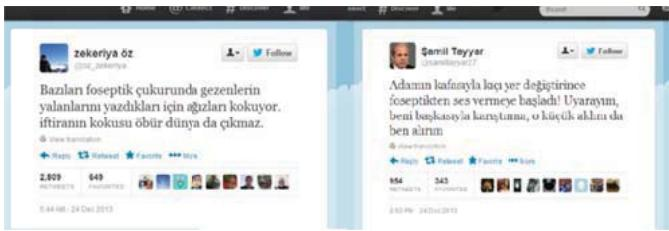
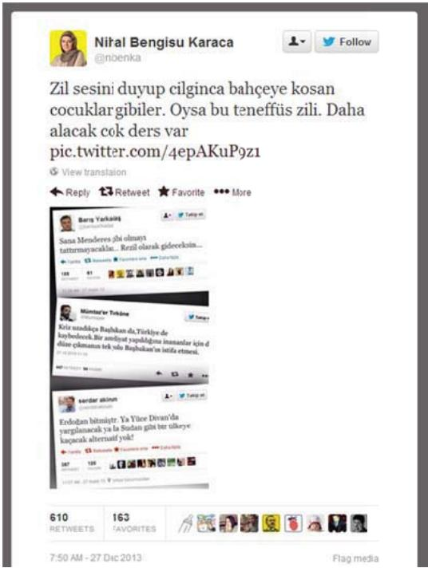
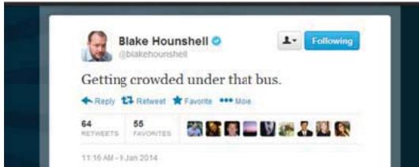
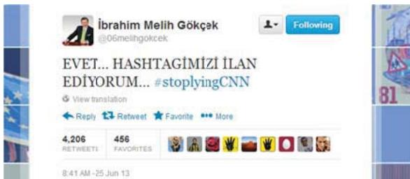

# Big Questions for Social Media Big Data: Representativeness, Validity and Other Methodological Pitfalls

Zeynep Tufekci

University of North Carolina, Chapel Hill

zeynep@unc.edu

# Abstract

Large-scale databases of human activity in social media have captured scientific and policy attention, producing a flood of research and discussion. This paper considers methodological and conceptual challenges for this emergent field, with special attention to the validity and representativeness of social media big data analyses. Persistent issues include the over-emphasis of a single platform, Twitter, sampling biases arising from selection by hashtags, and vague and unrepresentative sampling frames. The sociocultural complexity of user behavior aimed at algorithmic invisibility (such as subtweeting, mock-retweeting, use of “screen captures” for text, etc.) further complicate interpretation of big data social media. Other challenges include accounting for field effects, i.e. broadly consequential events that do not diffuse only through the network under study but affect the whole society. The application of network methods from other fields to the study of human social activity may not always be appropriate. The paper concludes with a call to action on practical steps to improve our analytic capacity in this promising, rapidly-growing field.

# Introduction

Very large datasets, commonly referred to as big data, have become common in the study of everything from genomes to galaxies, including, importantly, human behavior. Thanks to digital technologies, more and more human activities leave imprints whose collection, storage and aggregation can be readily automated. In particular, the use of social media results in the creation of datasets which may be obtained from platform providers or collected independently with relatively little effort as compared with traditional sociological methods.

Social media big data has been hailed as key to crucial insights into human behavior and extensively analyzed by scholars, corporations, politicians, journalists, and governments (Boyd and Crawford 2012; Lazer et al, 2009). Big data reveal fascinating insights into a variety of questions, and allow us to observe social phenomena at a previously unthinkable level, such as the mood oscillations of millions of people in 84 countries (Golder et al., 2011), or in cases where there is arguably no other feasible method

of data collection, as with the study of ideological polarization on Syrian Twitter (Lynch, Freelon and Aday, 2014). The emergence of big data from social media has had impacts in the study of human behavior similar to the introduction of the microscope or the telescope in the fields of biology and astronomy: it has produced a qualitative shift in the scale, scope and depth of possible analysis. Such a dramatic leap requires a careful and systematic examination of its methodological implications, including tradeoffs, biases, strengths and weaknesses.

This paper examines methodological issues and questions of inference from social media big data. Methodological issues including the following: 1. The model organism problem, in which a few platforms are frequently used to generate datasets without adequate consideration of their structural biases. 2. Selecting on dependent variables without requisite precautions; many hashtag analyses, for example, fall in this category. 3. The denominator problem created by vague, unclear or unrepresentative sampling. 4. The prevalence of single platform studies which overlook the wider social ecology of interaction and diffusion.

There are also important questions regarding what we can legitimately infer from online imprints, which are but one aspect of human behavior. Issues include the following: 1. Online actions such as clicks, links, and retweets are complex social interactions with varying meanings, logics and implications, yet they may be aggregated together. 2. Users engage in practices that may be unintelligible to algorithms, such as subtweets (tweets referencing an unnamed but implicitly identifiable individual), quoting text via screen captures, and “hate-linking”—linking to denounce rather than endorse. 3. Network methods from other fields are often used to study human behavior without evaluating their appropriateness. 4. Social media data almost solely captures “node-to-node” interactions, while “field” effects—events that affect a society or a group in a wholesale fashion either through shared experience or through broadcast media—may often account for observed phenomena. 5. Human self-awareness needs to be taken into account; humans will alter behavior because they know they are being observed, and this change in behavior may correlate with big data metrics.

# Methodological Considerations

# 1. Model Organisms and Research: Twitter as the Field’s Drosophila Melanogaster.

While there are many social media platforms, big data research focuses disproportionately on Twitter. For example, ICWSM, perhaps the leading selective conference in the field of social media, had 72 full papers last year (2013), almost half of which presented data that was primarily or solely drawn from Twitter. (Disclosure: I’ve long been involved in this conference in multiple capacities and think highly of it. The point isn’t about any one paper’s worth or quality but rather about the prevalence of attention to a single platform).

This preponderance of Twitter studies is mostly due to availability of data, tools and ease of analysis. Very large data sets, millions or billions of points, are available from this source. In contrast to Facebook, the largest social media platform, almost all Twitter activity, other than direct messages and private profiles, is visible on the public Internet. More Facebook users (estimated to be more than $50 \%$ ) have made their profiles “private”, i.e. not accessible on the public Internet, as compared with Twitter users (estimated as less than $10 \%$ ). While Twitter has been closing some of the easier means of access, the bulk of Facebook is largely inaccessible except by Facebook’s own data scientists. (Though Facebook public pages are available through its API). Unsurprisingly, only about $5 \%$ of the papers presented in ICWSM 2013 were about Facebook, and nearly all of them were co-authored with Facebook data scientists.

Twitter data also has a simple and clean structure. In contrast to the finer-grained privacy settings on other social media platforms, Twitter profiles are either “all public” or “all private.” With only a few basic functions (retweet, mention, and hashtags) to map, and a maximum of 140 characters per tweet, the datasets generated by Twitter are relatively easy to structure, process and analyze as compared with most other platforms. Consequently, Twitter has emerged as a “model organism” of big data.

In biology, “model organisms” refer to species which have been selected for intensive examination by the research community in order to shed light on key biological processes such as fundamental properties of living cells. Focusing on model organisms is conducive to progress in basic questions underlying the entire field, and this approach has been spectacularly successful in molecular biology (Fields and Johnson, 2007; Geddes, 1990). However, this investigative path is not without tradeoffs.

Biases in “model-organism” research programs are not the same as sample bias in survey research, which also impact social media big data studies. The focus on just a few

platforms introduces non-representativeness at the level of mechanisms, not just at the level of samples. Thus, drawing a Twitter sample that is representative of adults in the target population would not solve the problem.

To explain the issue, consider that all dominant biological model organisms – such as the fruit fly Drosophila melanogaster, the bacterium Escherichia coli, the nematode worm Caenorhabditis elegans, and the mouse Mus musculus – were selected for rapid life cycles (quick results), ease of breeding in artificial settings and small adult size (lab-friendliness), “rapid and stereotypical” development (making experimental comparisons easier), and “early separation of germ line and soma,” (reducing certain kinds of variability) (Bolker, 1995; Jenner and Wills, 2007). However, the very characteristics that make them useful for studying certain biological mechanisms come at the expense of illuminating others (Gilbert, 2001, Jenner and Wills, 2007). Being easy to handle in the laboratory, in effect, implies “relative insensitivity to environmental influences” (Bolker, 1995, p:451–2) and thus unsuitability for the study of environmental interactions. The rapid development cycle depresses mechanisms present in slowergrowing species, and small adult size can imply “simplification or loss of structures, the evolution of morphological novelties, and increased morphological variability” (Bolker, 1995, p:451).

In other words, model organisms can be unrepresentative of their taxa, and more importantly, may be skewed with regard to the importance of mechanisms in their taxa. They are chosen because they don’t die easily in confinement and therefore encapsulate mechanisms specific to surviving in captivity—a trait that may not be shared with species not chosen as model organisms. The fruit fly, which breeds easily and with relative insensitivity to the environment, may lead to an emphasis on genetic factors over environmental influences. In fact, this appears to be a bias common to most model organisms used in biology.

Barbara McClintock’s discovery of transposable genes, though much later awarded the Nobel prize, was initially disbelieved and disregarded partly because the organism she used, maize, was not a model organism at the time (Pray and Zhaurova, 2008). Yet the novel mechanisms which she discovered were not as visible in the more accepted model organisms, and would not have been found had she kept to those. Consequently, biologists interested in the roles of ecology and development have widened the range of organisms studied in order to uncover a wider range of mechanisms.

The dominance of Twitter as the “model organism” for social media big data analyses similarly skews analyses of mechanisms. Each social media platform carries with it a suite of affordances - things that it allows and makes easy

versus things that are not possible or difficult - which help structure behavior on the platform. For Twitter, the key characteristics are short message length, rapid turnover, public visibility, and a directed network graph (“follow” relationships do not need to be mutual.) It lacks some of the characteristics that blogs, LiveJournal communities, or Facebook possess, such as longer texts, lengthier reaction times, stronger integration of visuals with text, the mutual nature of “friending” and the evolution of conversations over longer periods of time.

Twitter’s affordances and the mechanisms it engenders interact in multiple ways. Its lightweight interface, suitable to mobile devices and accessible via texting, means that it is often the platform of choice when on the move, in lowbandwidth environments or in high-tension events such as demonstrations. The retweet mechanism also generates its own complex set of status-related behaviors and norms that do not necessarily translate to other platforms. Also, crucially, Twitter is a directed graph in that one person can “follow” another without mutuality. In contrast, Facebook’s backbone is mostly an undirected graph in which “friending” is a two-way relationship and requires mutual consent. Similarly, Livejournal’s core interactions tend to occur within “friends lists”. Consequently, Twitter is more likely than other platforms to sustain bridge mechanisms between communities and support connections between densely interconnected clusters that are otherwise sparsely connected to each other.

To see the implications for analysis and interpretation of big data, let’s look at bridging as a mechanism and consider a study which shows that bit.ly shortened links, distributed on Twitter using revolutionary hashtags during the Arab Spring, played a key role as an information conduit from within the Arab uprisings to the outside world—in other words, as bridges (Aday et al, 2012). Given its dependence on Twitter’s affordances, this finding should not be generalized to mean that social media as a whole also acted as a bridge, that social media was primarily useful as a bridging mechanism, nor that Twitter was solely a bridge mechanism (since this analyzed only of tweets containing bitl.ly links). Rather, this finding speaks to a convergence of user needs and certain affordances in a subset of cases which fueled one mechanism: in this case, bridging.

Finally, there is indeed a sample bias problem. Twitter is used by less than $20 \%$ of the US population (Mitchell and Hitlin, 2014), and that is not a randomly selected group. While Facebook has wider diffusion, its use is also structured by race, gender, class and other factors (Hargittai, 2008). Thus, the use of a few online platforms as “big data” model organisms raises important questions of representation and visibility, as different demographic or social groups may have different behavior—online and offline—

and may not be fully represented or even sampled via current methods.

All this is not to say that Twitter is an inappropriate platform to study. Research in the model organism paradigm allows a large community to coalesce around shared datasets, tools and problems, and can produce illuminating results. However, the specifics of the “model organism” and biases that may result should not be overlooked.

# 2. Hashtag Analyses, Selecting on the Dependent Variable, Selection Effects and User Choices.

The inclusion of hashtags in tweets is a Twitter convention for marking a tweet as part of a particular conversation or topic, and many social media studies rely on them for sample extraction. For example, the Tunisian uprising was associated with the hashtag #sidibouzid while the initial Egyptian protests of January 25, 2011, with #jan25. Facebook’s adoption of hashtags makes the methodological specifics of this convention even more important. While hashtag studies can be a powerful for examining network structure & information flows, all hashtag analyses, by definition, select on a dependent variable, and hence display the concomitant features and weaknesses of this methodological path.

“Selecting on the dependent variable” occurs when inclusion of a case in a sample depends on the very variable being examined. Such samples have specific limits to their analytic power. For example, analyses that only examine revolutions or wars that have occurred will overlook cases where the causes and correlates of revolution and war have been present but in which there have been no resulting wars or revolutions (Geddes, 2010). Thus, selecting on the dependent variable (the occurrence of war or revolution) can help identify necessary conditions, but those may not be sufficient. Selecting on the dependent variable can introduce a range of errors specifics of which depend on the characteristics of the uncorrelated sample.

In hashtag datasets, a tweet is included because the user chose to use it, a clear act of self-selection. Self-selected samples often will not only have different overall characteristics than the general population, they may also exhibit significantly different correlational tendencies which create thorny issues of confounding variables. Famous examples include the hormone replacement therapy (HRT) controversy in which researchers had, erroneously, believed that HRT conferred health benefits to post-menopausal women based on observational studies of women who self-selected to take HRT. In reality, HRT therapy was adopted by healthier women. Later randomized double-blind studies showed that HRT was, in fact, harmful—so harmful that the researchers stopped the study in its tracks to reverse advice that had been given to women for a decade.

  
Figure 1: The frequency of top 20 hashtags associated with Gezi Protests. (Banko and Babacan, 2013)

Samples drawn using different hashtags can differ in important dimensions, as hashtags are embedded in particular cultural and socio-political frameworks. In some cases, the hashtag is a declaration of particular sympathy. In other cases, there may be warring messages as the hashtag emerges as a contested cultural space. For example, two years of regular monitoring of activity—checking at least for an hour once a week—on the hashtags #jan25 and #Bahrain show their divergent nature. Those who choose to use #jan25 are almost certain to be sympathetic to the Egyptian revolution while #Bahrain tends to be used both by supporters and opponents of the uprising in Bahrain. Data I systematically sampled on three occasions showed that only about 1 in 100 #jan25 tweets were neutral while the rest were all supporting the revolution. Only about 5 out of 100 #Bahrain tweets were neutral, and 15 out of 100 were strongly opposed to the uprising, while the rest, 80 out of 100 were supportive. In contrast, #cairotraffic did not exhibit any overt signs of political preference. Consequently, since the hashtag users are a particular community, thus prone to selection biases, it would be difficult to generalize from their behavior to other samples. Political users may be more prone to retweeting, say, graphic content, whereas non-political users may react with aversion. Hence, questions such as “does graphic content spread quickly on Twitter” or “do angry messages diffuse more quickly” might have quite different answers if the sample is drawn through different hashtags.

Hashtag analyses can also be affected by user activity patterns. An analysis of twenty hashtags used during the height of Turkey’s Gezi Park protests in June 2013 (#occupygezi, #occupygeziparki, #direngeziparki, #direnankara, #direngaziparki, etc.) shows a steep rise in activity on May 30th when the protests began, dropping off by June 3rd (Figure 1). Looking at this graph, one might conclude that either the protests had died down, or that people had stopped talking about the protests on Twitter. Both conclusions would be very mistaken, as revealed by the author’s interviews with hundreds of protesters on-the-ground during the protests, online ethnography that followed hundreds of people active in the protests (some of them also interviewed offline), monitoring of Twitter, trending topics, news coverage and the protests themselves.

What had happened was that as soon as the protest became the dominant story, large numbers of people continued to discuss them heavily – almost to the point that no other discussion took place on their Twitter feeds – but stopped using the hashtags except to draw attention to a new phenomenon or to engage in “trending topic wars” with ideologically-opposing groups. While the protests continued, and even intensified, the hashtags died down. Interviews revealed two reasons for this. First, once everyone knew the topic, the hashtag was at once superfluous and wasteful on the character-limited Twitter platform. Second, hashtags were seen only as useful for attracting attention to a particular topic, not for talking about it.

In August, 2013, a set of stairs near Gezi Park which had been painted in rainbow colors were painted over in drab gray by the local municipality. This sparked outrage as a symbolic moment, and many people took to Twitter under the hashtag #direnmerdiven (roughly “#occupystairs”). The hashtag quickly and briefly trended and then disappeared from the trending list as well as users’ Twitter streams. However, this would be a misleading measure of activity on the painting of the stairs, as monitoring a group who had been using the hashtag showed that almost all of them continued to talk about the topic intensively on Twitter, but without the hashtag. Over the next week, hundreds, maybe thousands of stairs in Turkey were painted in rainbow colors as a form of protest, a phenomenon not at all visible in any data drawn from the hashtag.

Finally, most hashtags used to build big datasets are successful hashtags - ones that got well-known, distributed widely and generated large amount of interest. It is likely that the dynamics of such events differ significantly from those of less successful ones. In sum, hashtag datasets should be seen as self-selected samples with data “missing not at random” and interpreted accordingly (Allison, 2001; Meiman and Freund, 2012; Outhwaite et al, 2007)

All this is not to argue that hashtag datasets are not useful. In contrast, they can provide illuminating glimpses into specific cultural and socio-political conversations. However, hashtag dataset analyses need to be accompanied by a thorough discussion of the culture surrounding the specific hashtag, and analyzed with careful consideration of selection and sampling biases.

There might be ways to structure the sampling of Twitter datasets so that the hashtag is not the sole criterion. For example, Freelon, Lynch and Aday (2014) extracted a dataset first based on the use of the word “Syria” in Arabic or English, and then extracted hashtags from that dataset while also performing analyses on the wider dataset. Another method might be to use the hashtag to identify a sample of users and then collect tweets of those users (who will likely drop using the hashtag) rather than collecting the tweets via the hashtag.

Above all, hashtag analyses should start from the principle of understanding user behavior first, and should follow the user rather than following the hashtag.

# 3. The Missing Denominator: We Know Who Clicked But We Don’t Know Who Saw Or Could:

One of the biggest methodological dangers of big data analyses is insufficient understanding of the denominator. It’s not enough to know how many people have “liked” a Facebook status update, clicked on a link, or “retweeted” a message without knowing how many people saw the item and chose not to take any action. We rarely know the characteristics of the sub-population that sees the content even though that is the group, and not the entire population, from which we are sampling. Normalization is rarely done, or may even be actively decided against because the results start appearing more complex or more trivial (Cha, 2008).

While the denominator is often not calculable, it may be possible to estimate. One measure might be “potential exposure,” corresponding to the maximum number of people who may have seen a message. However, this highlights another key issue: the data is often proprietary (Boyd and Crawford, 2012). It might be possible to work with the platforms to get estimates of visibility, click-through and availability. For example, Facebook researchers have disclosed that the mean and median fraction of a user’s friends that see status update posts is about 34 to $3 5 \%$ though the distribution of the variable seems to have a large spread (Bernstein et al., 2013).

With some disclosure from proprietary platforms, it may be possible to calculate “likely” exposure numbers based on “potential” exposure - similar to the way election polls model “likely” voters or TV ratings try to measure people watching a show rather than just being in the room where the TV is on. Steps in this direction are likely to be complex and difficult, but without such efforts, our ability to interpret raw numbers will remain limited. The academic community should ask for more disclosure and access from the commercial platforms.

It’s also important to normalize underlying populations when comparing “clicks,” “links,” or tweets. For example, Aday et al. (2012) compares numbers of clicks on bit.ly links in tweets containing hashtags associated with the Ar-

ab uprisings and concludes that “new media outlets that that use bit.ly are more likely to spread information outside the region than inside it.” This is an important finding. However, interpretation of this finding should take into account the respective populations of Twitter users in the countries in question. Egypt’s population is about 80 million, about 1 percent of the global population. Any topic of global interest about Egypt could very easily generate more absolute number of clicks outside the country even if the activity within the country remained much more concentrated in relative proportions. Finally, the size of these datasets makes traditional measures like statistical significance less valuable (Meiman and Freund, 2012), a problem exacerbated by lack of information about the denominator.

# 4. Missing the Ecology for the Platform:

Most existing big data analyses of social media are confined to a single platform (often Twitter, as discussed.) However, most of the topics of interest in such studies, such as influence or information flow, can rarely be confined to the Internet, let alone to a single platform. The difficulty in obtaining high-quality multi-platform data does not mean that we can treat a single platform as a closed and insular system. Information in human affairs flows through all available channels.

The emergent media ecology is a mix of old and new media which is not strictly segregated by platform or even by device. Many “viral” videos take off on social media only after being featured on broadcast media, which often follows their being highlighted on intermediary sites such as Reddit or Buzzfeed. Political news flowing out of Arab Spring uprisings to broadcast media was often curated by sites such as Nawaat.org that had emerged as trusted local information brokers. Analysis from Syria shows a similar pattern (Aday et al. 2014). As these examples show, the object of analysis should be this integrated ecology, and there will be significant shortcomings in analyses which consider only a single platform.

Link analyses on hashtags datasets for the Arab uprisings show that the most common links from social media are to the websites of broadcast media (Aday et al. 2012). The most common pattern was that users alternate between Facebook, Twitter, broadcast media, cell-phone conversations, texting, face-to-face and other methods of interaction and information sharing (Tufekci & Wilson, 2012).

These challenges do not mean single-platform analyses are not valuable. However, all such analyses must take into account that they are not examining a closed system and that there may be effects which are not visible because the relevant information is not contained within that platform. Methodologically, single-platform studies can be akin to looking for our keys under the light. More research, admittedly much more difficult and expensive than scraping data

from one platform, is needed to understand broader patterns of connectivity. Sometimes, the only way to study people is to study people.

# Inferences and Interpretations

The question of inference from analyses of social media big data remains underconceptualized and underexamined. What’s a click? What does a retweet mean? In what context? By whom? How do different communities interpret these interactions? As with all human activities, interpreting online imprints engages layers of complexity.

# 1. What’s in a Retweet? Understanding our Data:

The same act can have multiple, even contradictory meanings. In many studies, for example, retweets or mentions are used as proxies for influence or agreement. This may hold in some contexts; however, there are many conceptual steps and implicit assumptions embedded in this analysis. It is clear that a retweet is information exposure and/or reaction; however, after that, its meaning could range from affirmation to denunciation to sarcasm to approval to disgust. In fact, many social media acts which are designed as “positive” interactions by the platform engineers, ranging from Retweets on Twitter to even “Likes” on Facebook can carry a range of meanings, some quite negative.

  
Figure 2: Retweeted widely, but mostly in disgust

As an example, take the recent case of the twitter account of fashion store @celebboutique. On July, 2012, the account tweeted with glee that the word “#aurora” was trending and attributed this to the popularity of a dress named #aurora in its shop. The hashtag was trending, however, because Aurora, Colorado was the site of a movie theatre massacre on that day. There was an expansive backlash against @celebboutique’s crass and insensitive tweet. There were more than 200 mentions and many hundreds of retweets with angry messages in as little as sixty seconds. The tweet itself, too, was retweeted thousands of times (See Figure 2). After about an hour, the company realized its mistake and stepped in. This was followed by more condemnation—a few hundred mentions per minute at a minimum. (For more analysis: (Gilad, 2012)) Hence,

without understanding the context, the spike in @celebboutique mentions could easily be misunderstood.

Polarized situations provide other examples of “negative retweets.” For example, during the Gezi protests in Turkey, the mayor of Ankara tweeted personally from his account, often until late hours of the night, engaging Gezi protesters individually in his idiosyncratic style, which involved the use of “ALL CAPS” and colorful language. He became highly visible among supporters as well as opponents of these protests. His visibility, combined with his style, meant that his tweets were widely retweeted—but not always by supporters. Gezi protestors would retweet his messages and then follow the retweet with a negative or mocking message. His messages were also retweeted without comment by people whose own Twitter timelines made clear that their intent was to “expose” or ridicule, rather than agree. A simple aggregation would find that thousands of people were retweeting his tweets, which might be interpreted as influence or agreement.

One of the most cited Twitter studies (Kwak et al.) grapples with how to measure influence, and asks whether the number of followers or the number of retweets is a better measure. That paper settles on retweets, stating that “The number of retweets for a certain tweet is a measure of the tweet’s popularity and in turn of the tweet writer’s popularity.” The paper then proceeds to rank users by the total number of retweets, and refers to this ranking alternatively as influence or popularity. Another important social media study, based on Twitter, speaks of in-degree (number of followers) as a user’s popularity, and retweets as influence (Cha et al., 2010). Both are excellent studies of retweet and following behavior, but in light of the factors discussed above, “influence” and “popularity” are may not be the best term to use for the variables they are measuring. Some portion of retweets and follows are, in fact, negative or mocking, and do not represent “influence” in the way it is ordinarily understood. The scale of such behavior remains an important, unanswered question (Freelon, 2014).

# 2. Engagement Invisible to Machines: Subtweets, Hate-Links, Screen Captures and Other Methods:

Social media users engage in practices that alter their visibility to machine algorithms, including subtweeting, discussing a person’s tweets via “screen captures,” and hatelinking. All these practices can blind big data analyses to this mode of activity and engagement.

Subtweeting is the practice of making a tweet referring to a person algorithmically invisible to that person—and consequently to automated data collection—even as the reference remains clear to those “in the know.” This manipulation of visibility can be achieved by referring to a person who has a twitter handle without either “mentioning” this handle, or by inserting a space between the $@$

ssign and the hhandle, or by uusing their reggular name or  a nnickname ratheer than the hanndle, or even soometimes delibbeerately misspellling the name . In some casees, the referencce ccan only be unnderstood in coontext, as theree is no mentioon oof the target inn any form. Thhese many formms of subtwee tinng come with ddifferent impli cations for bigg data analyticss.

For examplle, a controvversial article  by Egyptiann-AAmerican Monna El Eltahawyy sparked a masssive discussioon inn Egypt’s sociial media. In aa valuable anallysis of this dissccussion, socioloogists Alex Haanna and Marcc Smith extrac teed the tweets wwhich mentioneed her or linkeed to the articlee. TTheir network  analysis reveaaled great pol arization in thhe ddiscussion, wit h two distinctlly clustered gr oups. Howeveer, wwhile watchingg this discussioon online, I nooticed that manny oof the high-proofile bloggers  and young Eggyptian activistts ddiscussing the  article - and g reatly influenccing the converrssation - were iindeed subtweeeting. Later ddiscussions witth thhis communityy revealed thatt this was a deeliberate choicce thhat had been mmade because  many people  did not want tto ggive Eltahawy  attention,” evven as they waanted to discusss thhe topic and hher work.

  
FFigure 3: Two peeople “subtweetting” each other  without mentionning names. Thee exchange was cclear enough, hoowever, to be re-- ported in nnewspapers.

In another exxample drawn  from my primmary research oon TTurkey, figure  3 shows a subbtweet exchangge between twwo pprominent indi viduals that wwould be uninteelligible to anyyoone who did nnot already follow the broadder conversatioon aand was not inntimately familiar with the context. Whille eeach person is  referring to thhe other, theree are no name s, nnicknames, or hhandles. In adddition, neither follows the othheer on Twitter.  It is, howeverr, clearly a dirrect engagemennt aand conversatioon, if a negativve one. A broaad discussion oof thhis “Twitter sppat” on Turkis h Twitter provved people werre aaware of this ass a two-way coonversation. It  was so well unndderstood that it  was even repoorted in newspaapers.

While the truue prevalence  of this behavioor is hard to esstaablish, exactlyy because the aactivity is hiddden from largeesscale, machine--led analyses,  observations oof Turkish Twiitter during the GGezi protests off June 2013 revvealed that succh ssubtweets weree common. Inn order to gett a sense of itts sscale, I underttook an onlinee ethnographyy in Decembeer, 22013, during wwhich two hunndred Twitter uusers from Turrkkey, assembledd as a purposivve sample inc luding ordinarry uusers as well a s journalists annd pundits, weere followed foor

an houur at a time inn, totaling at leeast 10 hours oof observation deedicated to cattching subtweeets. This resulteed in a collectionn of 100 unmmistakable subttweets; many mmore were undouubtedly missedd because theyy are not alwayys obvious to obsservers. In fact,, the subtweetss were widely uunderstood and reetweeted, whiich increases  the importancce of such practicces. Overall, thhe practice apppears commonn enough to be desscribed as routiine, at least in  Turkey.

  
Figuree 4: Algorithmiccally Invisible Enngagement: A coolumnist responds  to critics by screeen captures.

Usiing screen capttures rather thaan quotes is an other practice thhat adds to thhe invisibility  of engagemennt to algorithmss. A “caps” is ddone when Twwitter users refeerence each other’s tweets throuugh screen caaptures rather than links, mentioons or quotes . An examplee is shown onn Figure 4. This ppractice is so wwidespread thaat a single hourr following the saame purposive  sample resultted in more thhan 300 instancees in which useers employed suuch “caps.”

Yett another praactice, colloquuially known  as “hatelinkingg,” limits the  algorithmic vvisibility of enngagement, althouugh this one i s potentially ttraceable. “Haate-linking” occurss when a user llinks to anotheer user’s tweet rather than mentiooning or quotiing the user. TThis practice, ttoo, would skew  analyses baseed on mention s or retweets,  though in this caase, it is at leasst possible to loook for such linnks.

Subbtweeters, “capps” users, and  hate-linkers arre obviously a smmaller commuunity than tweeeters as a wholle. While it is uncclear how wideespread these ppractices truly  are, studying Tuurkish Twitter  shows that theey are not unccommon, at least iin that contextt. Other counttries might havve specific

ssocial media p ractices that c onfound big ddata analytics iin ddifferent ways.. Overall, a ssimple “scrapiing” of Turkissh TTwitter might pproduce a polaarized map of ggroups not talkkinng to each othher, whereas thhe reality is a  polarized situaatiion in which ccontentious grooups are engagging each otheer bbut without thee conventionall means that mmake such connvversations visibble to algorithmms and to reseaarchers.

# 33. Limits of MMethodologiccal Analogiess and Importti ng Network  Methods froom Other Fieelds:

DDo social mediia networks opperate through similar mechaannisms as netwoorks of airliness? Does informmation work thhe wway germs doo? Such questiions are rarelyy explicitly addddressed even tthough many  papers importt methods fromm oother fields on  the implicit asssumption that  the answer is  a yyes. Studies thaat do look at tthis question, ssuch as Romerro eet al. (2011) annd Lerman et aal. (2010), are  often limited tto ssingle, or few , platforms, wwhich limit thheir explanatorry ppower becausee information aamong humanns does not difffuse in a singlee platform whhereas viruses  do, indeed, di fffuse in a well-defined manneer. To step bacck further, eveen rrepresenting soocial media innteractions as  a network reeqquires a whole  host of impliccit and importaant assumptionns thhat should be  considered exxplicitly ratherr than assumeed aaway (Butts, 20009).

Epidemiologgical or contaagion-inspired  analyses ofteen trreat connectedd edges in sociial media netwworks as if theey wwere “neighborrs” in physicall proximity. Inn epidemiologyy, itt is reasonablee to treat “physsical proximityy” as a key varriaable, assuming  that adjacent nnodes are “suscceptible” to disseease transmiss ion for very  good reason:  the underlyinng mmodel is a wwell-developedd, empirically--verified germmthheory of diseaase in which smmall microbes  travel in actuaal sspace (where ddistance matter s) to infect thee next person bby eentering their  body. This  physical proccess has wellluunderstood prooperties, and unnderlying probbabilities can o ft en be calculateed with precisioon.

Creating an analogy fromm social mediaa interactions tto pphysical proximmity may be a  reasonable andd justified undeer ccertain conditioons and assummptions, but th is step is rarelly ssubjected to ccritical examinnation (Salathéé et al, 2013 ). TThere are signnificant differeences between  germs and innfformation traveeling in social  media networrks. Adjacenccy inn social meddia is multi-faaceted; it cannnot always bbe mmapped to physsical proximityy; and human ““nodes” are subbj ect to informaation from a wwide range of ssources, not ju st thhose they are  connected to  in a particulaar social mediia pplatform. Finallly, whether thhere is a straigghtforward relaatiion between innformation expposure and thee rate of “influueence,” as there  often is for exxposure to a diisease agent annd thhe rate of infecction, is sometthing that shou ld be empiricaallyy investigated,, not assumed.

Theere are clearly  similar dynammics in differennt types of netwoorks, human annd otherwise, and the diffeerent fields can leearn much fromm each other.  However, impportation of methoods needs to reely on more th an some putatiive universal, coontext-indepenndent property  of networked  interaction simplyy by virtue of tthe existence oof a network.

# 4. Fieeld Effects: NNon-Networkks Interactionns

Anothher difference  between spaatial or epideemiological netwoorks and humann social netwoorks is that humman social informmation flows ddo not occur onnly through noode-to-node netwoorks but also thhrough field efffects, large-scaale societal eventss which impacct a large grouup of actors coontemporaneouslly. Big events,, weather occuurrences, etc. aall have society-wwide field efffects and ofteen do not difffuse solely througgh interpersonnal interaction  (although theey also do greatlyy impact interrpersonal inte raction by afffecting the agendda, mood and ddisposition of inndividuals).

Forr example, moost studies agrree that Egypptian social mediaa networks playyed a role in tthe uprising whhich began in Egyypt in January  2011 and weree a key condui t of protest informmation (Lynch,, 2012; Aday  et al, 2012; TTufekci and Wilsoon, 2012). Howwever, there waas almost certa inly another impportant informaation diffusionn dynamic. Thee influence of the e Tunisian revoolution itself o n the expectattions of the Egypttian populace was a major  turning pointt (Ghonim, 2012;  Lynch, 2012) . While analyysis of networkks in Egypt might not have revvealed a majorr difference beetween the secondd and third weeek of Januaryy of 2011, sommething major haad changed in tthe field. To trranslate it into epidemiologicaal language, duue to the Tunnisian revolutioon and the exampple it presentedd, all the “noddes” in the netwwork had a differeent “susceptibiility” and “recceptivity” to innformation about  an uprising. TThe downfall oof the Tunisiann president, whichh showed that eeven an enduriing autocracy iin the Middle Eaast was suscepptible to streeet protests, eneergized the oppossition and channged the politiical calculationn in Egypt. This iinformation wwas diffused thhrough multiplle methods and brroadcast mediaa played a keyy role. Thus, thhe communicatioon of the Tuniisia effect to thhe Egyptian neetwork was not neecessarily depeendent on the  network struccture of social mmedia.

  
Figure 5: Cleaar meaning onlyy in context and ttime.

Soccial media itseelf is often inncomprehensibble without referennce to field evvents outside iit. For examplle, take the tweet  in Figure 5. The tweets  merely statess: “Getting

ccrowded underr that bus.” Sttrangely, it haas been tweeteed mmore than sixtty times and  favorited morre than 50. Foor thhose followingg in real time,  this was an obbvious referencce too New Jersey  Governor Chrris Christie’s ppress conferencce inn which he bblamed multiplle aides for thhe closing of  a bbridge which caaused massive  traffic jams, aallegedly to punnish a mayor whho did not endoorse him. Withhout understanddinng the Chris CChristie press cconference, neeither the tweeet, nnor many retweeets of it are innterpretable.

The turn to nnetworks as a kkey metaphor iin social scienccees, while fruitfful, should not  diminish our attention to thhe mmulti-scale natuure of human ssocial interactioon

# 55. You Namee It, Humans  Will Game iit: Reflexivityy aand Humans :

UUnlike disease  vectors or gasses in a chambber, humans unndderstand, evaluuate and responnd to the same  metrics that biig ddata researcherrs are measurinng. For exampple, political acctiivists, especiallly in countriees such as Bahhrain, where thhe uunrest and reprression have re ceived less maainstream globaal mmedia attentio n, often undeertake deliberaate attempts tto mmake a hashtagg “trend.” Indeeed, “to trend”” is increasinglly uused as a transsitive verb ammong these useers, as in: “let’s trrend #Hungry44BH”. These eefforts are not mmere blind stabbs aat massive tweeeting; they ofteen display a finne-tuned underrsstanding of Twwitter’s trendiing topics alggorithm, whichh, wwhile not publiic, is widely unnderstood throough reverse ennggineering (Lotaan, 2012). In  coordinated caampaigns, Bahhrrain activistss have tre nded hashtaags such aas ##100strikedays , #Bloodyf1,  #KillingKhaw aja, #StopTearr-GGasBahrain, annd #F1DontRacceBahrain, amoong others.

  
Figure 6: Ankkara Mayor leadsds a hashtag campmpaign that will eeventually trendd worldwide. [Tr anslation: Yes…… I’m announcingg ur hashtag. #sstoplyingCNN]

Campaigns tto trend hashtaags are not limmited to grasssrroots activists.  In Figure 6,  drawn from mmy primary reessearch in Turkeey, you can seee AKP’s Ankarra mayor, an acctiive figure in TTurkish Twitterr discussed befofore, announcinng thhe hashtag thaat will be “trennded”: #cnnis lying. This waas rretweeted moree than 4000 timmes. He had b een announcinng thhe campaign aand had asked  people to be iin front of theeir ddevices at a  set time; in  these campaiggns, the actuaal hhashtag is ofte n withheld unntil a pre-agreeed time so as tto pproduce a maxximum spike  which Twitterr’s algorithm  is

sensitiive to. That haashtag indeed trrended worldwwide. Similar cooordinated cammpaigns are commmon in Turkkey and occurredd almost everyy day during thhe contentious  protests of June, 22013.

Succh behaviors, aaimed at avoidiing detection,  amplifying a signnal, or other go als, by deliberrate gaming of  algorithms and mmetrics, should d be expected iin all analysess of human social  media. Currenntly, many studdies do take innto account “gamiing” behaviorss such as spamm and bots; hoowever, coordinaated or active aattempts by acctual people too alter metrics orr results, whichh often can onnly be discoverred through qualitaative research,  are rarely takeen into accountt.

# Connclusion: Praactical Stepps—a Call too Action

Sociall media big daata is a powerfful addition too the scientific ttoolkit. Howevver, this emerrgent field neeeds to be placedd on firmer mmethodological  and conceptuual footing. Meaniing of social mmedia imprints , context of huuman communiccations, and naature of socio -cultural interaactions are multi--faceted and ccomplex. Peopple’s behavior differs in signifificant dimensioons from other objects of nettwork analyses suuch as germs oor airline flightts.

Thee challenges ouutlined in this  paper are resuults of systematiic qualitative aand quantitativ e inquiry over  two years; howevver, this paper  cannot be connclusive in idenntifying the scale  and the scope  these issues——in fact, the chhallenge is exactlly that such isssues are resiistant to large -scale machine--analyses that  allows us to exactly pinppoint them. Whilee the challengees are thorny,  there are manny practical steps.  These includee:

1- Taarget non-soccial dependeent variables.. No data sourcee is perfect, annd every dataseet is imperfect  in its own ways.  Most big dataa analyses remmains within thhe confines the daataset, with litttle means to  probe validityy. Seeking depenndent variabless outside big ddata, especiallyy those for whichh there are otheer measures obbtained using  traditional, tested  and fairly rreliable methoods, and lookiing at the conveergent and diveergent points, wwill provide muuch needed clarityy to strengths aand weaknessees of these dataasets. Such depenndent variables  could range ffrom , election s results to unempployment numbbers.   
2- Q ualitative puull-outs. Reseearchers can  include a “qualiitative pull-ouut” from theeir sample too examine variatiions in behavvior. For exaample, what ppercent of retweeets are “hate-rretweets”? A ssmall random  subsample can prrovide a checkk. This may invvolve asking qquestions to peoplee. For examplee: did the somme people hear of X from TV ass well as fromm Twitter? Thhese qualitativee pull-outs need nnot be huge to  help interpretaation.   
2. Basseline panels. Establishing aa panel to studdy peoples’ digitall behavior, simmilar to panel sstudies in sociaal sciences, could  develop “baseelines” and “gguidelines” for  the whole

community. Data sought could include those in this paper.   
3. Industry Outreach. The field should solicit cooperation from the industry for data such as “denominators”, similar to Facebook’s recent release of what percent of a Facebook network sees status updates. Industry scientists who participate in the research community can be conduits.   
4. Convergent answers and complimentary methods. Multi-method, multi-platform analyses should be sought and rewarded. As things stand, these exist (Adar et al., 2007 or Kairam, 2013) but are rare. Whenever possible, social media big data studies should be paired with surveys, interviews, ethnographies, and other methods so that biases and short-comings of each method can be used to balance each other to arrive at richer answers.   
5. Multi-disciplinary teams. Scholars from fields where network methods are shared should cooperate to study the scope, differences and utility of common methods.   
6. Methodological awareness in review. These issues should be incorporated into the review process and go beyond soliciting “limitations” sections.   
A future study that recruited a panel of ordinary users, from multiple countries, and examined their behavior online and offline, and across multiple platforms to detect the frequency of behaviors outlined here, and those not detected yet, would be a path-breaking next step for understanding and grounding our social media big data.

# References

Adar, Eytan, Daniel S. Weld, Brian N. Bershad, and Steven S. Gribble. 2007. “Why We Search: Visualizing and Predicting User Behavior.” In Proceedings of the 16th International Conference on World Wide Web, 161–70. WWW ’07. New York, NY, USA: ACM.   
Aday, S.; Farrell, H.; Lynch, M.; Sides, J.; and Freelon, D. 2012. Blogs and Bullets II: New Media and Conflict after the Arab Spring. United States Institute of Peace.   
Lynch, M.; Freelon, D and Aday, S. 2014. Syria’s Socially Mediated Civil War. United States Institute of Peace.   
Allison, P.D. 2001. Missing data. Thousand Oaks, CA: SAGE.   
Banko, M.; and Babao-lan, A.R. 2013. Gezi Park- Sürecine Dijital Vatanda’-n Etkisi. Ali Riza Babaoglan.   
Bernstein, M.S. 2013. Quantifying the Invisible Audience in Social Networks. In Proceedings of the SIGCHI Conference on Human Factors in Computing Systems, 21-30. New York: Association for Computing Machinery.   
Bolker, J.A. 1995. Model systems in developmental biology. BioEssays 17(5): 451–455.   
boyd, d., and Crawford, K. 2012. Critical Questions for Big Data. Information, Communication & Society 15 (5): 662–679.   
Butts, C.T. 2009. Revisiting the foundations of network analysis. Science 325(5939): 414.   
Cha, M.; Haddadi, H.; Benevenuto, F.; and Gummadi, K. 2010. Measuring user influence in twitter: The million follower fallacy. ICWSM, 10: 10-17.   
Fields, S., and Johnston, M. 2005. Whither Model Organism Research? Science 307(5717): 1885–1886.

Freelon, D. (2014). On the interpretation of digital trace data in communication and social computing research. Journal of Broadcasting & Electronic Media, 58(1), 59–75.   
Geddes, B. 1990. How the Cases You Choose Affect the Answers You Get: Selection Bias in Comparative Politics. Pol. Analysis 2(1): 131–150.   
Ghonim, W. 2012. Revolution 2:0: A Memoir and Call to Action. New York: Houghton Mifflin Harcourt, 2012.   
Gilbert, S.F. 2001. Ecological Developmental Biology: Developmental Biology Meets the Real World. Developmental Biology 233(1): 1–12.   
Golder, S.A. and Macy, M.W. 2011. Diurnal and seasonal mood vary with work, sleep, and daylength across diverse cultures. Science 333(6051): 1878–1881.   
Hargittai, E. 2008. Whose Space? Differences Among Users and Non-Users of Social Network Sites. Journal of Computer-Mediated Communication 13(1): 276–297.   
Jenner, R.A., and Wills, M.A. 2007. The choice of model organisms in evo–devo. Nature Reviews Genetics 8(4): 311–314.   
Kairam, Sanjay Ram, Meredith Ringel Morris, Jaime Teevan, Dan Liebling, and Susan Dumais. 2013. “Towards Supporting Search over Trending Events with Social Media.” In Seventh International AAAI Conference on Weblogs and Social Media.   
Kwak, Haewoon, Changhyun Lee, Hosung Park, and Sue Moon. 2010. “What Is Twitter, a Social Network or a News Media?” In Proceedings of the 19th International Conference on World Wide Web, 591–600. WWW ’10. New York, NY, USA: ACM.   
Lazer, D.; Pentland, A.; Adamic, L.; et al. 2009. Computational Social Science. Science 323(5915): 721–723.   
Lerman, Kristina, and Rumi Ghosh. "Information Contagion: An Empirical Study of the Spread of News on Digg and Twitter Social Networks." ICWSM 10 (2010): 90-97.   
Lotan, G. October 12, 2011. Data Reveals That “Occupying” Twitter Trending Topics is Harder than it Looks. SocialFlow. Accessed at: http://blog.socialflow.com/post/7120244374/data-reveals-that-occupyingtwitter-trending-topics-is-harder-than-it-looks.   
Lynch, M. 2012. The Arab uprising: the unfinished revolutions of the new Middle East. New York: PublicAffairs.   
Mitchell, A., and Hitlin, P. March 4, 2014. Twitter Reaction to Events Often at Odds with Overall Public Opinion. Pew Research Center. Accessed at: http://www.pewresearch.org/2013/03/04/twitter-reaction-toevents-often-at-odds-with-overall-public-opinion/.   
Meiman, Jon, and Jeff E. Freund. 2012. “Large Data Sets in Primary Care Research.” The Annals of Family Medicine 10 (5): 473–74.   
Outhwaite, W.; Turner, S.; Dunning, T.; and Freedman, D.A., eds. 2007. Modeling Selection Effects. In The SAGE handbook of social science methodology. Thousand Oaks, CA: SAGE Publications.   
Pray, L. & Zhaurova, K. (2008) Barbara McClintock and the discovery of jumping genes (transposons). Nature Education 1(1):169   
Romero, Daniel M., Brendan Meeder, and Jon Kleinberg. "Differences in the mechanics of information diffusion across topics: idioms, political hashtags, and complex contagion on twitter." Proceedings of the 20th international conference on World wide web. ACM, 2011.   
Salathé, Marcel, Duy Q. Vu, Shashank Khandelwal, and David R. Hunter. 2013. “The Dynamics of Health Behavior Sentiments on a Large Online Social Network.” EPJ Data Science 2 (1): 4. doi:10.1140/epjds16.   
Tufekci, Z. and Wilson, C. 2012. Social Media and the Decision to Participate in Political Protest: Observations From Tahrir Square. Journal of Communication 62(2): 363–379.