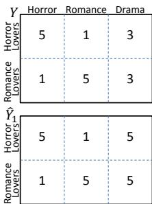
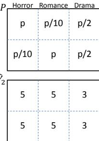
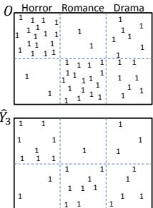
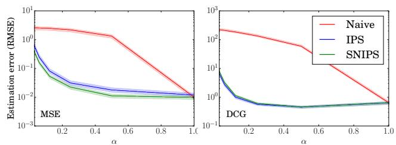
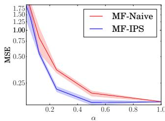
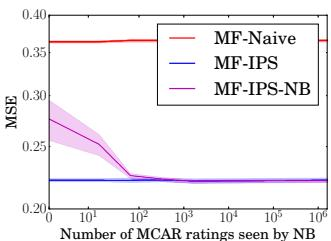
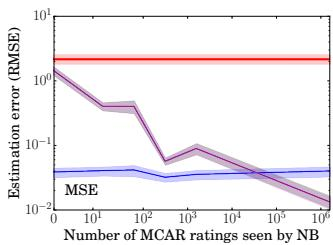
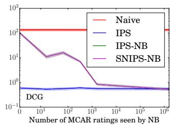

# Recommendations as Treatments: Debiasing Learning and Evaluation

Tobias Schnabel, Adith Swaminathan, Ashudeep Singh, Navin Chandak, Thorsten Joachims

Cornell University, Ithaca, NY, USA

{TBS49, FA234, AS3354, NC475, TJ36}@CORNELL.EDU

# Abstract

Most data for evaluating and training recommender systems is subject to selection biases, either through self-selection by the users or through the actions of the recommendation system itself. In this paper, we provide a principled approach to handle selection biases by adapting models and estimation techniques from causal inference. The approach leads to unbiased performance estimators despite biased data, and to a matrix factorization method that provides substantially improved prediction performance on real-world data. We theoretically and empirically characterize the robustness of the approach, and find that it is highly practical and scalable.

# 1. Introduction

Virtually all data for training recommender systems is subject to selection biases. For example, in a movie recommendation system users typically watch and rate those movies that they like, and rarely rate movies that they do not like (Pradel et al., 2012). Similarly, when an adplacement system recommends ads, it shows ads that it believes to be of interest to the user, but will less frequently display other ads. Having observations be conditioned on the effect we would like to optimize (e.g. the star rating, the probability of a click, etc.) leads to data that is Missing Not At Random (MNAR) (Little & Rubin, 2002). This creates a widely-recognized challenge for evaluating recommender systems (Marlin & Zemel, 2009; Myttenaere et al., 2014).

We develop an approach to evaluate and train recommender systems that remedies selection biases in a principled, practical, and highly effective way. Viewing recommendation from a causal inference perspective, we argue that exposing a user to an item in a recommendation system is an intervention analogous to exposing a patient to a treatment in a medical study. In both cases, the goal is to accurately esti-

mate the effect of new interventions (e.g. a new treatment policy or a new set of recommendations) despite incomplete and biased data due to self-selection or experimenterbias. By connecting recommendation to causal inference from experimental and observational data, we derive a principled framework for unbiased evaluation and learning of recommender systems under selection biases.

The main contribution of this paper is four-fold. First, we show how estimating the quality of a recommendation system can be approached with propensity-weighting techniques commonly used in causal inference (Imbens & Rubin, 2015), complete-cases analysis (Little & Rubin, 2002), and other problems (Cortes et al., 2008; Bickel et al., 2009; Sugiyama & Kawanabe, 2012). In particular, we derive unbiased estimators for a wide range of performance measures (e.g. MSE, MAE, DCG). Second, with these estimators in hand, we propose an Empirical Risk Minimization (ERM) framework for learning recommendation systems under selection bias, for which we derive generalization error bounds. Third, we use the ERM framework to derive a matrix factorization method that can account for selection bias while remaining conceptually simple and highly scalable. Fourth, we explore methods to estimate propensities in observational settings where selection bias is due to selfselection by the users, and we characterize the robustness of the framework against mis-specified propensities.

Our conceptual and theoretical contributions are validated in an extensive empirical evaluation. For the task of evaluating recommender systems, we show that our performance estimators can be orders-of-magnitude more accurate than standard estimators commonly used in the past (Bell et al., 2007). For the task of learning recommender systems, we show that our new matrix factorization method substantially outperforms methods that ignore selection bias, as well as existing state-of-the-art methods that perform jointlikelihood inference under MNAR data (Hernandez-Lobato ´ et al., 2014). This is especially promising given the conceptual simplicity and scalability of our approach compared to joint-likelihood inference. We provide an implemention of our method, as well as a new benchmark dataset, online1.

# 2. Related Work

Past work that explicitly dealt with the MNAR nature of recommendation data approached the problem as missingdata imputation based on the joint likelihood of the missing data model and the rating model (Marlin et al., 2007; Marlin & Zemel, 2009; Hernandez-Lobato et al. ´ , 2014). This has led to sophisticated and highly complex methods. We take a fundamentally different approach that treats both models separately, making our approach modular and scalable. Furthermore, our approach is robust to mis-specification of the rating model, and we characterize how the overall learning process degrades gracefully under a mis-specified missing-data model. We empirically compare against the state-of-the-art joint likelihood model (Hernandez-Lobato et al. ´ , 2014) in this paper.

Related but different from the problem we consider is recommendation from positive feedback alone (Hu et al., 2008; Liang et al., 2016). Related to this setting are also alternative approaches to learning with MNAR data (Steck, 2010; 2011; Lim et al., 2015), which aim to avoid the problem by considering performance measures less affected by selection bias under mild assumptions. Of these works, the approach of Steck (2011) is most closely related to ours, since it defines a recall estimator that uses item popularity as a proxy for propensity. Similar to our work, Steck (2010; 2011) and Hu et al. (2008) also derive weighted matrix factorization methods, but with weighting schemes that are either heuristic or need to be tuned via cross validation. In contrast, our weighted matrix factorization method enjoys rigorous learning guarantees in an ERM framework.

Propensity-based approaches have been widely used in causal inference from observational studies (Imbens & Rubin, 2015), as well as in complete-case analysis for missing data (Little & Rubin, 2002; Seaman & White, 2013) and in survey sampling (Thompson, 2012). However, their use in matrix completion is new to our knowledge. Weighting approaches are also widely used in domain adaptation and covariate shift, where data from one source is used to train for a different problem (e.g., Huang et al., 2006; Bickel et al., 2009; Sugiyama & Kawanabe, 2012). We will draw upon this work, especially the learning theory of weighting approaches in (Cortes et al., 2008; 2010).

# 3. Unbiased Performance Estimation for Recommendation

Consider a toy example adapted from Steck (2010) to illustrate the disastrous effect that selection bias can have on conventional evaluation using a test set of held-out ratings. Denote with $u ~ \in ~ \{ 1 , . . . , U \}$ the users and with $i \in \{ 1 , . . . , I \}$ the movies. Figure 1 shows the matrix of true ratings $\dot { Y } \in \mathfrak { R } ^ { U \times I }$ for our toy example, where a sub-

  
Figure 1. Movie-Lovers toy example. Top row: true rating matrix $Y$ , propensity matrix $P$ , observation indicator matrix $O$ . Bottom row: two rating prediction matrices $\hat { Y _ { 1 } }$ and $\hat { Y } _ { 2 }$ , and intervention indicator matrix $\hat { Y } _ { 3 }$ .

set of users are “horror lovers” who rate all horror movies 5 and all romance movies 1. Similarly, there is a subset of “romance lovers” who rate just the opposite way. However, both groups rate dramas as 3. The binary matrix ${ \cal O } \in \{ 0 , 1 \} ^ { \bar { U } \times \bar { I } }$ in Figure 1 shows for which movies the users provided their rating to the system, $\left[ O _ { u , i } \right. = 1 ] \Leftrightarrow$ $[ Y _ { u , i }$ observed]. Our toy example shows a strong correlation between liking and rating a movie, and the matrix $P$ describes the marginal probabilities $P _ { u , i } = P ( O _ { u , i } = 1 )$ with which each rating is revealed. For this data, consider the following two evaluation tasks.

# 3.1. Task 1: Estimating Rating Prediction Accuracy

For the first task, we want to evaluate how well a predicted rating matrix $\hat { Y }$ reflects the true ratings in $Y$ . Standard evaluation measures like Mean Absolute Error (MAE) or Mean Squared Error (MSE) can be written as:

$$
R (\hat {Y}) = \frac {1}{U \cdot I} \sum_ {u = 1} ^ {U} \sum_ {i = 1} ^ {I} \delta_ {u, i} (Y, \hat {Y}), \tag {1}
$$

for an appropriately chosen $\delta _ { u , i } ( Y , \hat { Y } )$ .

MAE: (2)

MSE: (3)

Accuracy: (4)

Since $Y$ is only partially known, the conventional practice is to estimate $\dot { R ( Y ) }$ using the average over only the observed entries,

$$
\hat {R} _ {n a i v e} (\hat {Y}) = \frac {1}{| \{(u , i) : O _ {u , i} = 1 \} |} \sum_ {(u, i): O _ {u, i} = 1} \delta_ {u, i} (Y, \hat {Y}). \tag {5}
$$

We call this the naive estimator, and its naivety leads to a gross misjudgment for the $\hat { Y } _ { 1 }$ and $\hat { Y } _ { 2 }$ given in Figure 1. Even though $\hat { Y _ { 1 } }$ is clearly better than $\hat { Y } _ { 2 }$ by any reasonable measure of performance, $\hat { R } _ { n a i v e } ( \hat { Y } )$ will reliably claim that $\hat { Y } _ { 2 }$ has better MAE than $\hat { Y } _ { 1 }$ . This error is due to selection bias, since 1-star ratings are under-represented in the

observed data and $\delta _ { u , i } ( Y , \hat { Y } )$ is correlated with $Y _ { u , i }$ . More generally, under selection bias, $\hat { R } _ { n a i v e } ( \hat { Y } )$ is not an unbiased estimate of the true performance $R ( { \hat { Y } } )$ (Steck, 2013):

$$
\mathbb {E} _ {O} \left[ \hat {R} _ {\text {n a i v e}} (\hat {Y}) \right] \neq R (\hat {Y}). \tag {6}
$$

Before we design an improved estimator to replace $\hat { R } _ { n a i v e } ( \hat { Y } )$ , let’s turn to a related evaluation task.

# 3.2. Task 2: Estimating Recommendation Quality

Instead of evaluating the accuracy of predicted ratings, we may want to more directly evaluate the quality of a particular recommendation. To this effect, let’s redefine $\hat { Y }$ to now encode recommendations as a binary matrix analogous to $O$ , where $[ \hat { Y } _ { u , i } = 1 ] \Leftrightarrow [ i$ is recommended to $u ]$ , limited to a budget of $k$ recommendations per user. An example is $\hat { Y } _ { 3 }$ in Figure 1. A reasonable way to measure the quality of a recommendation is the Cumulative Gain (CG) that the user derives from the recommended movies, which we define as the average star-rating of the recommended movies in our toy example2. CG can again be written in the form of Eq. (1) with

$$
\mathrm {C G}: \quad \delta_ {u, i} (Y, \hat {Y}) = (I / k) \hat {Y} _ {u, i} \cdot Y _ {u, i}. \tag {7}
$$

However, unless users have watched all movies in $\hat { Y }$ , we cannot compute CG directly via Eq. (1). Hence, we are faced with the counterfactual question: how well would our users have enjoyed themselves (in terms of CG), if they had followed our recommendations $\hat { Y }$ instead of watching the movies indicated in $O ?$ Note that rankings of recommendations are similar to the set-based recommendation described above, and measures like Discounted Cumulative Gain (DCG), DCG@k, Precision at k (PREC $@ \mathbf { k }$ ), and others (Aslam et al., 2006; Yilmaz et al., 2008) also fit in this setting. For those, let the values of $\hat { Y }$ in each row define the predicted ranking, then

$$
\mathrm {D C G}: \delta_ {u, i} (Y, \hat {Y}) = \left(I / \log \left(\operatorname {r a n k} \left(\hat {Y} _ {u, i}\right)\right)\right) Y _ {u, i}, \tag {8}
$$

$$
\operatorname {P R E C} @ k: \delta_ {u, i} (Y, \hat {Y}) = (I / k) Y _ {u, i} \cdot \mathbf {1} \left\{\operatorname {r a n k} (\hat {Y} _ {u, i}) \leq k \right\}. \tag {9}
$$

One approach, similar in spirit to condensed DCG (Sakai, 2007), is to again use the naive estimator from Eq. (5). However, this and similar estimators are generally biased for $R ( { \hat { Y } } )$ (Pradel et al., 2012; Steck, 2013).

To get unbiased estimates of recommendation quality despite missing observations, consider the following connection to estimating average treatment effects of a given policy in causal inference, that was already explored in the contextual bandit setting (Li et al., 2011; Dud´ık et al., 2011). If we think of a recommendation as an intervention

analogous to treating a patient with a specific drug, in both settings we want to estimate the effect of a new treatment policy (e.g. give drug A to women and drug B to men, or new recommendations $\hat { Y }$ ). The challenge in both cases is that we have only partial knowledge of how much certain patients (users) benefited from certain treatments (movies) (i.e., $Y _ { u , i }$ with $O _ { u , i } = 1 $ ), while the vast majority of potential outcomes in $Y$ is unobserved.

# 3.3. Propensity-Scored Performance Estimators

The key to handling selection bias in both of the abovementioned evaluation tasks lies in understanding the process that generates the observation pattern in $O$ . This process is typically called the Assignment Mechanism in causal inference (Imbens & Rubin, 2015) or the Missing Data Mechanism in missing data analysis (Little & Rubin, 2002). We differentiate the following two settings:

Experimental Setting. In this setting, the assignment mechanism is under the control of the recommendation system. An example is an ad-placement system that controls which ads to show to which user.

Observational Setting. In this setting, the users are part of the assignment mechanism that generates $O$ . An example is an online streaming service for movies, where users self-select the movies they watch and rate.

In this paper, we assume that the assignment mechanism is probabilistic, meaning that the marginal probability $P _ { u , i } =$ $P ( O _ { u , i } = 1 )$ of observing an entry $Y _ { u , i }$ is non-zero for all user/item pairs. This ensures that, in principle, every element of $Y$ could be observed, even though any particular $O$ reveals only a small subset. We refer to $P _ { u , i }$ as the propensity of observing $Y _ { u , i }$ . In the experimental setting, we know the matrix $P$ of all propensities, since we have implemented the assignment mechanism. In the observational setting, we will need to estimate $P$ from the observed matrix $O$ . We defer the discussion of propensity estimation to Section 5, and focus on the experimental setting first.

IPS Estimator The Inverse-Propensity-Scoring (IPS) estimator (Thompson, 2012; Little & Rubin, 2002; Imbens & Rubin, 2015), which applies equally to the task of rating prediction evaluation as to the task of recommendation quality estimation, is defined as,

$$
\hat {R} _ {I P S} (\hat {Y} | P) = \frac {1}{U \cdot I} \sum_ {(u, i): O _ {u, i} = 1} \frac {\delta_ {u , i} (Y , \hat {Y})}{P _ {u , i}}. \tag {10}
$$

Unlike the naive estimator $\hat { R } _ { n a i v e } ( \hat { Y } )$ , the IPS estimator is unbiased for any probabilistic assignment mechanism. Note that the IPS estimator only requires the marginal probabilities $P _ { u , i }$ and unbiased-ness is not affected by dependencies within $O$ :

Table 1. Mean and standard deviation of the Naive, IPS, and SNIPS estimators compared to true MAE and DCG@50 on ML100K.   

<table><tr><td rowspan="2"></td><td colspan="4">MAE</td><td colspan="4">DCG@50</td></tr><tr><td>True</td><td>IPS</td><td>SNIPS</td><td>Naive</td><td>True</td><td>IPS</td><td>SNIPS</td><td>Naive</td></tr><tr><td>REC.ONES</td><td>0.102</td><td>0.102 ± 0.007</td><td>0.102 ± 0.007</td><td>0.011 ± 0.001</td><td>30.76</td><td>30.64 ± 0.75</td><td>30.66 ± 0.74</td><td>153.07 ± 2.13</td></tr><tr><td>REC.FOURS</td><td>0.026</td><td>0.026 ± 0.000</td><td>0.026 ± 0.000</td><td>0.173 ± 0.001</td><td>52.00</td><td>51.98 ± 0.41</td><td>52.08 ± 0.58</td><td>313.48 ± 2.36</td></tr><tr><td>ROTATE</td><td>2.579</td><td>2.581 ± 0.031</td><td>2.579 ± 0.012</td><td>1.168 ± 0.003</td><td>12.90</td><td>13.00 ± 0.85</td><td>12.99 ± 0.83</td><td>1.38 ± 0.09</td></tr><tr><td>SKEWED</td><td>1.306</td><td>1.304 ± 0.012</td><td>1.304 ± 0.009</td><td>0.912 ± 0.002</td><td>24.59</td><td>24.55 ± 0.92</td><td>24.58 ± 0.93</td><td>54.87 ± 1.03</td></tr><tr><td>COARSEND</td><td>1.320</td><td>1.314 ± 0.015</td><td>1.318 ± 0.005</td><td>0.387 ± 0.002</td><td>46.45</td><td>46.45 ± 0.53</td><td>46.44 ± 0.70</td><td>293.27 ± 1.99</td></tr></table>

$$
\begin{array}{l} \mathbb {E} _ {O} \Big [ \hat {R} _ {I P S} (\hat {Y} | P) \Big ] = \frac {1}{U \cdot I} \sum_ {u} \sum_ {i} \mathbb {E} _ {O _ {u, i}} \bigg [ \frac {\delta_ {u , i} (Y , \hat {Y})}{P _ {u , i}} O _ {u, i} \bigg ] \\ = \frac {1}{U \cdot I} \sum_ {u} \sum_ {i} \delta_ {u, i} (Y, \hat {Y}) = R (\hat {Y}). \\ \end{array}
$$

To characterize the variability of the IPS estimator, however, we assume that observations are independent given $P$ , which corresponds to a multivariate Bernoulli model where each $O _ { u , i }$ is a biased coin flip with probability $P _ { u , i }$ . The following proposition (proof in appendix) provides some intuition about how the accuracy of the IPS estimator changes as the propensities become more “non-uniform”.

Proposition 3.1 (Tail Bound for IPS Estimator). Let P be the independent Bernoulli probabilities of observing each entry. For any given $\hat { Y }$ and $Y$ , with probability $1 - \eta ,$ , the IPS estimator $\check { \hat { R } } _ { I P S } ( \hat { Y } | P )$ does not deviate from the true $R ( { \hat { Y } } )$ by more than:

$$
\left| \hat {R} _ {I P S} (\hat {Y} | P) - R (\hat {Y}) \right| \leq \frac {1}{U \cdot I} \sqrt {\frac {\log \frac {2}{\eta}}{2} \sum_ {u , i} \rho_ {u , i} ^ {2}},
$$

where $\begin{array} { r } { \rho _ { u , i } = \frac { \delta _ { u , i } ( Y , \hat { Y } ) } { P _ { u , i } } \ : i f P _ { u , i } < 1 _ { \mathrm { ~ } } } \end{array}$ Pu,i , and $\rho _ { u , i } = 0$ otherwise.

To illustrate this bound, consider the case of uniform propensities $P _ { u , i } = p$ . This means that $n = p U I$ elements of $Y$ are revealed in expectation. In this case, the bound is $O ( 1 / ( p \sqrt { U } I ) )$ . If the $P _ { u , i }$ are non-uniform, the bound can be much larger even if the expected number of revealed elements, $\sum P _ { u , i }$ is $n$ . We are paying for the unbiased-ness of IPS in terms of variability, and we will evaluate whether this price is well spent throughout the paper.

SNIPS Estimator. One technique that can reduce variability is the use of control variates (Owen, 2013). Applied to the IPS estimator, we know that $\begin{array} { r } { \mathbb { E } _ { O } \left[ \sum _ { ( u , i ) : O _ { u , i } = 1 } \frac { 1 } { P _ { u , i } } \right] \ = \ U \cdot I } \end{array}$ hP(u,i):Ou,i=1 1Pu,i i . This yields the Self-Normalized Inverse Propensity Scoring (SNIPS) estimator (Trotter & Tukey, 1956; Swaminathan & Joachims, 2015)

$$
\hat {R} _ {S N I P S} (\hat {Y} | P) = \frac {\sum_ {(u , i) : O _ {u , i} = 1} \frac {\delta_ {u , i} (Y , \hat {Y})}{P _ {u , i}}}{\sum_ {(u , i) : O _ {u , i} = 1} \frac {1}{P _ {u , i}}} \tag {11}
$$

The SNIPS estimator often has lower variance than the IPS estimator but has a small bias (Hesterberg, 1995).

# 3.4. Empirical Illustration of Estimators

To illustrate the effectiveness of the proposed estimators we conducted an experiment on the semi-synthetic ML100K dataset described in Section 6.2. For this dataset, $Y$ is completely known so that we can compute true performance via Eq. (1). The probability $P _ { u , i }$ of observing a rating $Y _ { u , i }$ was chosen to mimic the observed marginal rating distribution in the original ML100K dataset (see Section 6.2) such that, on average, $5 \%$ of the $Y$ matrix was revealed.

Table 1 shows the results for estimating rating prediction accuracy via MAE and recommendation quality via $\operatorname { D C G } @ 5 0$ for the following five prediction matrices $\hat { Y _ { i } }$ . Let $| Y = r |$ be the number of $r$ -star ratings in $Y$ .

REC ONES: The prediction matrix $\hat { Y }$ is identical to the true rating matrix $Y$ , except that $\left| \left\{ \left( u , i \right) : Y _ { u , i } = 5 \right\} \right|$ randomly selected true ratings of 1 are flipped to 5. This means half of the predicted fives are true fives, and half are true ones.

REC FOURS: Same as REC ONES, but flipping 4-star ratings instead.

ROTATE: For each predicted rating $\hat { Y } _ { u , i } = Y _ { u , i } - 1$ when $Y _ { u , i } \geq 2$ , and $\hat { Y } _ { u , i } = 5$ when $Y _ { u , i } = 1$ .

SKEWED: Predictions Yˆu,i $\hat { Y } _ { u , i }$ are sampled from $\begin{array} { r } { \mathcal { N } ( \hat { Y } _ { u , i } ^ { r a w } | \mu ~ = ~ Y _ { u , i } , \sigma ~ = ~ \frac { 6 - Y _ { u , i } } { 2 } ) } \end{array}$ 6−Yu,i2 ) and clipped to 2 the interval $[ 0 , 6 ]$ .

COARSENED: If the true rating $Y _ { u , i } \le 3$ , then $\hat { Y } _ { u , i } = 3$ Otherwise $\hat { Y } _ { u , i } = 4$ .

Rankings for $\operatorname { D C G } @ 5 0$ were created by sorting items according to $\hat { Y _ { i } }$ for each user. In Table 1, we report the average and standard deviation of estimates over 50 samples of $O$ from $P$ . We see that the mean IPS estimate perfectly matches the true performance for both MAE and DCG as expected. The bias of SNIPS is negligible as well. The naive estimator is severely biased and its estimated MAE incorrectly ranks the prediction matrices $\hat { Y } _ { i }$ (e.g. it ranks the performance of REC ONES higher than REC FOURS). The standard deviation of IPS and SNIPS is substantially smaller than the bias that Naive incurs. Furthermore, SNIPS manages to reduce the standard deviation of IPS for MAE but not for DCG. We will empirically study these estimators more comprehensively in Section 6.

# 4. Propensity-Scored Recommendation Learning

We will now use the unbiased estimators from the previous section in an Empirical Risk Minimization (ERM) framework for learning, prove generalization error bounds, and derive a matrix factorization method for rating prediction.

# 4.1. ERM for Recommendation with Propensities

Empirical Risk Minimization underlies many successful learning algorithms like SVMs (Cortes & Vapnik, 1995), Boosting (Schapire, 1990), and Deep Networks (Bengio, 2009). Weighted ERM approaches have been effective for cost-sensitive classification, domain adaptation and covariate shift (Zadrozny et al., 2003; Bickel et al., 2009; Sugiyama & Kawanabe, 2012). We adapt ERM to our setting by realizing that Eq. (1) corresponds to an expected loss (i.e. risk) over the data generating process $P ( O | P )$ . Given a sample from $P ( O | P )$ , we can think of the IPS estimator from Eq. (10) as the Empirical Risk $\hat { R } ( \hat { Y } )$ that estimates $R ( { \hat { Y } } )$ for any $\hat { Y }$ .

Definition 4.1 (Propensity-Scored ERM for Recommendation). Given training observations O from Y with marginal propensities $P$ , given a hypothesis space $\mathcal { H }$ of predictions $\hat { Y }$ , and given a loss function $\delta _ { u , i } ( \bar { Y } , \hat { Y } )$ , ERM selects the $\hat { Y } \in \mathcal { H }$ that optimizes:

$$
\hat {Y} ^ {E R M} = \underset {\hat {Y} \in \mathcal {H}} {\operatorname {a r g m i n}} \left\{\hat {R} _ {I P S} (\hat {Y} | P) \right\}. \tag {12}
$$

Using the SNIPS estimator does not change the argmax. To illustrate the validity of the propensity-scored ERM approach, we state the following generalization error bound (proof in appendix) similar to Cortes et al. (2010). We consider only finite $\mathcal { H }$ for the sake of conciseness.

Theorem 4.2 (Propensity-Scored ERM Generalization Error Bound). For any finite hypothesis space of predictions $\mathcal { H } = \{ \hat { Y } _ { 1 } , . . . , \hat { Y } _ { | \mathcal { H } | } \}$ and loss $\dot { 0 } \le \delta _ { u , i } ( \dot { Y } , \hat { Y } ) \le \mathrm { \hat { \Delta } } $ , the true risk $R ( { \hat { Y } } )$ of the empirical risk minimizer $\hat { Y } ^ { E R M }$ from $\mathcal { H }$ using the IPS estimator, given training observations O from $Y$ with independent Bernoulli propensities $P$ , is bounded with probability $1 - \eta$ by:

$$
\begin{array}{l} R (\hat {Y} ^ {E R M}) \leq \hat {R} _ {I P S} (\hat {Y} ^ {E R M} | P) + \\ \frac {\Delta}{U \cdot I} \sqrt {\frac {\log (2 | \mathcal {H} | / \eta)}{2}} \sqrt {\sum_ {u , i} \frac {1}{P _ {u , i} ^ {2}}} \tag {13} \\ \end{array}
$$

# 4.2. Propensity-Scored Matrix Factorization

We now use propensity-scored ERM to derive a matrix factorization method for the problem of rating prediction. Assume a standard rank- $d$ -restricted and $L _ { 2 }$ -regularized matrix factorization model $\begin{array} { r } { \hat { Y } _ { u , i } = v _ { u } ^ { T } w _ { i } + a _ { u } + b _ { i } + c } \end{array}$ with user, item, and global offsets as our hypothesis space $\mathcal { H }$ . Under

this model, propensity-scored ERM leads to the following training objective:

$$
\underset {V, W, A} {\operatorname {a r g m i n}} \left[ \sum_ {O _ {u, i} = 1} \frac {\delta_ {u , i} (Y , V ^ {T} W + A)}{P _ {u , i}} + \lambda \left(\left| \left| V \right| \right| _ {F} ^ {2} + \left| \left| W \right| \right| _ {F} ^ {2}\right) \right] \tag {14}
$$

where $A$ encodes the offset terms and $\hat { Y } ^ { E R M } = V ^ { T } W + A$ . Except for the propensities $P _ { u , i }$ that act like weights for each loss term, the training objective is identical to the standard incomplete matrix factorization objective (Koren, 2008; Steck, 2010; Hu et al., 2008) with MSE (using Eq. (3)) or MAE (using Eq. (2)). So, we can readily draw upon existing optimization algorithms (i.e., Gemulla et al., 2011; Yu et al., 2012) that can efficiently solve the training problem at scale. For the experiments reported in this paper, we use Limited-memory BFGS (Byrd et al., 1995). Our implementation is available online3.

Conventional incomplete matrix factorization is a special case of Eq. (14) for MCAR (Missing Completely At Random) data, i.e., all propensities $P _ { u , i }$ are equal. Solving this training objective for other $\delta _ { u , i } ( Y , \hat { Y } )$ that are nondifferentiable is more challenging, but possible avenues exist (Joachims, 2005; Chapelle & Wu, 2010). Finally, note that other recommendation methods (e.g., Weimer et al., 2007; Lin, 2007) can in principle be adapted to propensity scoring as well.

# 5. Propensity Estimation for Observational Data

We now turn to the Observational Setting where propensities need to be estimated. One might be worried that we need to perfectly reconstruct all propensities for effective learning. However, as we will show, we merely need estimated propensities that are “better” than the naive assumption of observations being revealed uniformly, i.e., $P = | \{ ( u , i ) : O _ { u , i } = 1 \} | / ( U \cdot I )$ for all users and items. The following characterizes “better” propensities in terms of the bias they induce and their effect on the variability of the learning process.

Lemma 5.1 (Bias of IPS Estimator under Inaccurate Propensities). Let $P$ be the marginal probabilities of observing an entry of the rating matrix $Y$ , and let $\hat { P }$ be the estimated propensities such that $\hat { P } _ { u , i } > 0$ for all $u , i$ . The bias of the IPS estimator Eq. (10) using $\hat { P }$ is:

$$
\operatorname {b i a s} \left(\hat {R} _ {I P S} (\hat {Y} | \hat {P})\right) = \sum_ {u, i} \frac {\delta_ {u , i} (Y , \hat {Y})}{U \cdot I} \left[ 1 - \frac {P _ {u , i}}{\hat {P} _ {u , i}} \right]. \tag {15}
$$

In addition to bias, the following generalization error bound (proof in appendix) characterizes the overall impact of the estimated propensities on the learning process.

Theorem 5.2 (Propensity-Scored ERM Generalization Error Bound under Inaccurate Propensities). For any finite hypothesis space of predictions $\mathcal { H } = \{ \hat { Y } _ { 1 } , . . . , \hat { Y } _ { | \mathcal { H } | } \}$ , the transductive prediction error of the empirical risk minimizer $\hat { Y } ^ { E R \hat { M } }$ , using the IPS estimator with estimated propensities $\hat { P } ( \hat { P } _ { u , i } > 0 )$ $\hat { P }$ ) and given training observations $O$ from $Y$ with independent Bernoulli propensities $P$ , is bounded by:

$$
\begin{array}{l} R (\hat {Y} ^ {E R M}) \leq \hat {R} _ {I P S} (\hat {Y} ^ {E R M} | \hat {P}) + \frac {\Delta}{U \cdot I} \sum_ {u, i} \left| 1 - \frac {P _ {u , i}}{\hat {P} _ {u , i}} \right| \\ + \frac {\Delta}{U \cdot I} \sqrt {\frac {\log (2 | \mathcal {H} | / \eta)}{2}} \sqrt {\sum_ {u , i} \frac {1}{\hat {P} _ {u , i} ^ {2}}} \tag {16} \\ \end{array}
$$

The bound shows a bias-variance trade-off that does not occur in conventional ERM. In particular, the bound suggests that it may be beneficial to overestimate small propensities, if this reduces the variability more than it increases the bias.

# 5.1. Propensity Estimation Models.

Recall that our goal is to estimate the probabilities $P _ { u , i }$ with which ratings for user $u$ and item $i$ will be observed. In general, the propensities

$$
P _ {u, i} = P \left(O _ {u, i} = 1 \mid X, X ^ {h i d}, Y\right) \tag {17}
$$

can depend on some observable features $X$ (e.g., the predicted rating displayed to the user), unobservable features $X ^ { h i d }$ (e.g., whether the item was recommended by a friend), and the ratings $Y$ . It is reasonable to assume that $O _ { u , i }$ is independent of the new predictions $\hat { Y }$ (and therefore independent of $\delta _ { u , i } ( Y , \hat { Y } ) )$ once the observable features are taken into account. The following outlines two simple propensity estimation methods, but there is a wide range of other techniques available (e.g., McCaffrey et al., 2004) that can cater to domain-specific needs.

Propensity Estimation via Naive Bayes. The first approach estimates $P ( O _ { u , i } | X , X ^ { h i d } , Y )$ by assuming that dependencies between covariates $X$ , $X ^ { h i d }$ and other ratings are negligible. Eq. (17) then reduces to $P ( O _ { u , i } | Y _ { u , i } )$ similar to Marlin & Zemel (2009). We can treat $Y _ { u , i }$ as observed, since we only need the propensities for observed entries to compute IPS and SNIPS. This yields the Naive Bayes propensity estimator:

$$
P \left(O _ {u, i} = 1 \mid Y _ {u, i} = r\right) = \frac {P (Y = r \mid O = 1) P (O = 1)}{P (Y = r)}. \tag {18}
$$

We dropped the subscripts to reflect that parameters are tied across all $u$ and $i$ . Maximum likelihood estimates for $P ( Y = r \mid O = 1 )$ and $P ( O = 1 )$ can be obtained by counting observed ratings in MNAR data. However, to estimate $P ( \boldsymbol { Y } = \boldsymbol { r } )$ , we need a small sample of MCAR data.

Propensity Estimation via Logistic Regression The second propensity estimation approach we explore (which does not require a sample of MCAR data) is based on logistic regression and is commonly used in causal inference (Rosenbaum, 2002). It also starts from Eq. (17), but aims to find model parameters $\phi$ such that $O$ becomes independent of unobserved $X ^ { h i d }$ and $Y$ , i.e., $P ( O _ { u , i } | X , X ^ { h i d } , Y ) = P ( O _ { u , i } | X , \phi )$ . The main modeling assumption is that there exists a $\phi ~ = ~ ( w , \beta , \gamma )$ such that $P _ { u , i } \stackrel { - } { = } \sigma \left( w ^ { T } X _ { u , i } + \beta _ { i } + \gamma _ { u } \right)$ . Here, $X _ { u , i }$ is a vector encoding all observable information about a user-item pair (e.g., user demographics, whether an item was promoted, etc.), and $\sigma ( \cdot )$ is the sigmoid function. $\beta _ { i }$ and $\gamma _ { u }$ are peritem and per-user offsets.

# 6. Empirical Evaluation

We conduct semi-synthetic experiments to explore the empirical performance and robustness of the proposed methods in both the experimental and the observational setting. Furthermore, we compare against the state-of-theart joint-likelihood method for MNAR data (Hernandez- ´ Lobato et al., 2014) on real-world datasets.

# 6.1. Experiment Setup

In all experiments, we perform model selection for the regularization parameter $\lambda$ and/or the rank of the factorization $d$ via cross-validation as follows. We randomly split the observed MNAR ratings into $k$ folds $k = 4$ in all experiments), training on $k - 1$ and evaluating on the remaining one using the IPS estimator. Reflecting this additional split requires scaling the propensities in the training folds by $\textstyle { \frac { k - 1 } { k } }$ and those in the validation fold by $\frac { 1 } { k }$ . The parameters with the best validation set performance are then used to retrain on all MNAR data. We finally report performance on the MCAR test set for the real-world datasets, or using Eq. (1) for our semi-synthetic dataset.

# 6.2. How does sampling bias severity affect evaluation?

First, we evaluate how different observation models impact the accuracy of performance estimates. We compare the Naive estimator of Eq. (5) for MSE, MAE and DCG with their propensity-weighted analogues, IPS using Eq. (10) and SNIPS using Eq. (11) respectively. Since this experiment requires experimental control of sampling bias, we created a semi-synthetic dataset and observation model.

ML100K Dataset. The ML100K dataset4 provides 100K MNAR ratings for 1683 movies by 944 users. To allow ground-truth evaluation against a fully known rating matrix, we complete these partial ratings using standard matrix factorization. The completed matrix, however, gives

  
Figure 2. RMSE of the estimators in the experimental setting as the observed ratings exhibit varying degrees of selection bias.

unrealistically high ratings to almost all movies. We therefore adjust ratings for the final $Y$ to match a more realistic rating distribution $[ p _ { 1 } , p _ { 2 } , p _ { 3 } , p _ { 4 } , p _ { 5 } ]$ for ratings 1 to 5 as given in Marlin & Zemel (2009) as follows: we assign the bottom $p _ { 1 }$ fraction of the entries by value in the completed matrix a rating of 1, and the next $p _ { 2 }$ fraction of entries by value a rating of 2, and so on. Hyper-parameters (rank $d$ and L2 regularization $\lambda$ ) were chosen by using a 90-10 train-test split of the 100K ratings, and maximizing the 0/1 accuracy of the completed matrix on the test set.

ML100K Observation Model. If the underlying rating is 4 or 5, the propensity for observing the rating is equal to $k$ . For ratings $r \ < \ 4$ , the corresponding propensity is $k \alpha ^ { 4 - r }$ . For each $\alpha$ , $k$ is set so that the expected number of ratings we observe is $5 \%$ of the entire matrix. By varying $\alpha \ > \ 0$ , we vary the MNAR effect: $\alpha \ = \ 1$ is missing uniformly at random (MCAR), while $\alpha  0$ only reveals 4 and 5 rated items. Note that $\alpha \ = \ 0 . 2 5$ gives a marginal distribution of observed ratings that reasonably matches the observed MNAR rating marginals on ML100K ([0.06, 0.11, 0.27, 0.35, 0.21] in the real data vs. $[ 0 . 0 6 , 0 . 1 0 , 0 . 2 5 , 0 . 4 2 , 0 . 1 7 ]$ in our model).

Results. Table 1, described in Section 3.4, shows the estimated MAE and DCG@50 when $\alpha = 0 . 2 5$ . Next, we vary the severity of the sampling bias by changing $\alpha \in ( 0 , 1 ]$ . Figure 2 reports how accurately (in terms of root mean squared estimation error (RMSE)) each estimator predicts the true MSE and DCG respectively. These results are for the Experimental Setting where propensities are known. They are averages over the five prediction matrices $\hat { Y _ { i } }$ given in Section 3.4 and across 50 trials. Shaded regions indicate a $9 5 \%$ confidence interval.

Over most of the range of $\alpha$ , in particular for the realistic value of $\alpha = 0 . 2 5$ , the IPS and SNIPS estimators are orders-of-magnitude more accurate than the Naive estimator. Even for severely low choices of $\alpha$ , the gain due to bias reduction of IPS and SNIPS still outweighs the added variability compared to Naive. When $\alpha = 1$ (MCAR), SNIPS is algebraically equivalent to Naive, while IPS pays a small penalty due to increased variability from propensity weighting. For MSE, SNIPS consistently reduces estimation error over IPS while both are tied for DCG.

  
Figure 3. Prediction error (MSE) of matrix factorization methods as the observed ratings exhibit varying degrees of selection bias (left) and as propensity estimation quality degrades (right).

# 6.3. How does sampling bias severity affect learning?

Now we explore whether these gains in risk estimation accuracy translate into improved learning via ERM, again in the Experimental Setting. Using the same semi-synthetic ML100K dataset and observation model as above, we compare our matrix factorization MF-IPS with the traditional unweighted matrix factorization MF-Naive. Both methods use the same factorization model with separate $\lambda$ selected via cross-validation and $d = 2 0$ . The results are plotted in Figure 3 (left), where shaded regions indicate $9 5 \%$ confidence intervals over 30 trials. The propensity-weighted matrix factorization MF-IPS consistently outperforms conventional matrix factorization in terms of MSE. We also conducted experiments for MAE, with similar results.

# 6.4. How robust is evaluation and learning to inaccurately learned propensities?

We now switch from the Experimental Setting to the Observational Setting, where propensities need to be estimated. To explore robustness to propensity estimates of varying accuracy, we use the ML100K data and observation model with $\alpha = 0 . 2 5$ . To generate increasingly bad propensity estimates, we use the Naive Bayes model from Section 5.1, but vary the size of the MCAR sample for estimating the marginal ratings $P ( Y = r )$ via the Laplace estimator.

Figure 4 shows how the quality of the propensity estimates impacts evaluation using the same setup as in Section 6.2. Under no condition do the IPS and SNIPS estimator perform worse than Naive. Interestingly, IPS-NB with estimated propensities can perform even better than IPS-KNOWN with known propensities, as can be seen for MSE. This is a known effect, partly because the estimated propensities can provide an effect akin to stratification (Hirano et al., 2003; Wooldridge, 2007).

Figure 3 (right) shows how learning performance is affected by inaccurate propensities using the same setup as in Section 6.3. We compare the MSE prediction error of MF-IPS-NB with estimated propensities to that of MF-Naive and MF-IPS with known propensities. The shaded area shows the $9 5 \%$ confidence interval over 30 trials. Again, we see that MF-IPS-NB outperforms MF-Naive even for

  
Figure 4. RMSE of IPS and SNIPS as propensity estimates degrade. IPS with true propensities and Naive are given as reference.

severely degraded propensity estimates, demonstrating the robustness of the approach.

# 6.5. Performance on Real-World Data

Our final experiment studies performance on real-world datasets. We use the following two datasets, which both have a separate test set where users were asked to rate a uniformly drawn sample of items.

Yahoo! R3 Dataset. This dataset5 (Marlin & Zemel, 2009) contains user-song ratings. The MNAR training set provides over 300K ratings for songs that were selfselected by 15400 users. The test set contains ratings by a subset of 5400 users who were asked to rate 10 randomly chosen songs. For this data, we estimate propensities via Naive Bayes. As a MCAR sample for eliciting the marginal rating distribution, we set aside $5 \%$ of the test set and only report results on the remaining $9 5 \%$ of the test set.

Coat Shopping Dataset. We collected a new dataset6 simulating MNAR data of customers shopping for a coat in an online store. The training data was generated by giving Amazon Mechanical Turkers a simple web-shop interface with facets and paging. They were asked to find the coat in the store that they wanted to buy the most. Afterwards, they had to rate 24 of the coats they explored (self-selected) and 16 randomly picked ones on a five-point scale. The dataset contains ratings from 290 Turkers on an inventory of 300 items. The self-selected ratings are the training set and the uniformly selected ratings are the test set. We learn propensities via logistic regression based on user covariates (gender, age group, location, and fashion-awareness) and item covariates (gender, coat type, color, and was it promoted). A standard regularized logistic regression (Pedregosa et al., 2011) was trained using all pairs of user and item covariates as features and cross-validated to optimize log-likelihood of the self-selected observations.

Results. Table 2 shows that our propensity-scored matrix factorization MF-IPS with learnt propensities substantially and significantly outperforms the conventional matrix factorization approach, as well as the Bayesian imputation

Table 2. Test set MAE and MSE on the Yahoo and Coat datasets.   

<table><tr><td></td><td colspan="2">YAHOO</td><td colspan="2">COAT</td></tr><tr><td></td><td>MAE</td><td>MSE</td><td>MAE</td><td>MSE</td></tr><tr><td>MF-IPS</td><td>0.810</td><td>0.989</td><td>0.860</td><td>1.093</td></tr><tr><td>MF-Naive</td><td>1.154</td><td>1.891</td><td>0.920</td><td>1.202</td></tr><tr><td>HL MNAR</td><td>1.177</td><td>2.175</td><td>0.884</td><td>1.214</td></tr><tr><td>HL MAR</td><td>1.179</td><td>2.166</td><td>0.892</td><td>1.220</td></tr></table>

models from (Hernandez-Lobato et al. ´ , 2014), abbreviated as HL-MNAR and HL-MAR (paired t-test, $p < 0 . 0 0 1$ for all). This holds for both MAE and MSE. Furthermore, the performance of MF-IPS beats the best published results for Yahoo in terms of MSE (1.115) and is close in terms of MAE (0.770) (the CTP-v model of (Marlin & Zemel, 2009) as reported in the supplementary material of Hernandez- ´ Lobato et al. (2014)). For MF-IPS and MF-Naive all hyperparameters (i.e., $\lambda \in \{ 1 0 ^ { - 6 } , . . . , 1 \}$ and $d \in \{ 5 , 1 0 , 2 0 , 4 0 \} )$ were chosen by cross-validation. For the HL baselines, we explored $d \in \{ 5 , 1 0 , 2 0 , 4 0 \}$ using software provided by the authors7 and report the best performance on the test set for efficiency reasons. Note that our performance numbers for HL on Yahoo closely match the values reported in (Hernandez-Lobato et al.´ , 2014).

Compared to the complex generative HL models, we conclude that our discriminative MF-IPS performs robustly and efficiently on real-world data. We conjecture that this strength is a result of not requiring any generative assumptions about the validity of the rating model. Furthermore, note that there are several promising directions for further improving performance, like propensity clipping (Strehl et al., 2010), doubly-robust estimation (Dud´ık et al., 2011), and the use of improved methods for propensity estimation (McCaffrey et al., 2004).

# 7. Conclusions

We proposed an effective and robust approach to handle selection bias in the evaluation and training of recommender systems based on propensity scoring. The approach is a discriminative alternative to existing joint-likelihood methods which are generative. It therefore inherits many of the advantages (e.g., efficiency, predictive performance, no need for latent variables, fewer modeling assumptions) of discriminative methods. The modularity of the approach— separating the estimation of the assignment model from the rating model—also makes it very practical. In particular, any conditional probability estimation method can be plugged in as the propensity estimator, and we conjecture that many existing rating models can be retrofit with propensity weighting without sacrificing scalability.

# Acknowledgments

This research was funded in part under NSF Awards IIS-1247637, IIS-1217686, and IIS-1513692, and a gift from Bloomberg.

# References

Aslam, J. A., Pavlu, V., and Yilmaz, E. A statistical method for system evaluation using incomplete judgments. In SIGIR, pp. 541–548, 2006.   
Bell, R., Koren, Y., and Volinsky, C. Chasing $\$ 1,000,000$ . how we won the netflix progress prize. Statistical Computing and Graphics, 18(2):4–12, 2007.   
Bengio, Y. Learning deep architectures for ai. Foundations and Trends in Machine Learning, 2(1):1–127, 2009.   
Bickel, S., Bruckner, M., and Scheffer, T. Discrimina- ¨ tive learning under covariate shift. Journal of Machine Learning Research, 10:2137–2155, 2009.   
Byrd, R. H., Lu, P., Nocedal, J., and Zhu, C. A limited memory algorithm for bound constrained optimization. SIAM Journal on Scientific Computing, 16(5): 1190–1208, 1995.   
Chapelle, O. and Wu, M. Gradient descent optimization of smoothed information retrieval metrics. Information retrieval, 13(3):216–235, 2010.   
Cortes, C. and Vapnik, V. N. Support–vector networks. Machine Learning, 20:273–297, 1995.   
Cortes, C., Mohri, M., Riley, M., and Rostamizadeh, A. Sample selection bias correction theory. In ALT, pp. 38– 53, 2008.   
Cortes, C., Mansour, Y., and Mohri, M. Learning bounds for importance weighting. In NIPS, pp. 442–450, 2010.   
Dud´ık, M., Langford, J., and Li, L. Doubly robust policy evaluation and learning. In ICML, pp. 1097–1104, 2011.   
Gemulla, R., Nijkamp, E., Haas, P. J., and Sismanis, Y. Large-scale matrix factorization with distributed stochastic gradient descent. In KDD, pp. 69–77, 2011.   
Hernandez-Lobato, J. M., Houlsby, N., and Ghahramani, ´ Z. Probabilistic matrix factorization with non-random missing data. In ICML, pp. 1512–1520, 2014.   
Hesterberg, T. Weighted average importance sampling and defensive mixture distributions. Technometrics, 37:185– 194, 1995.   
Hirano, K., Imbens, G., and Ridder, G. Efficient estimation of average treatment effects using the estimated propensity score. Econometrica, 71(4):1161–1189, 2003.

Hu, Y., Koren, Y., and Volinsky, C. Collaborative filtering for implicit feedback datasets. In ICDM, pp. 263–272, 2008.   
Huang, J., Smola, A. J., Gretton, A., Borgwardt, K. M., and Scholkopf, B. Correcting sample selection bias by ¨ unlabeled data. In NIPS, pp. 601–608, 2006.   
Imbens, G. and Rubin, D. Causal Inference for Statistics, Social, and Biomedical Sciences. Cambridge University Press, 2015.   
Joachims, T. A support vector method for multivariate performance measures. In ICML, pp. 377–384, 2005.   
Koren, Y. Factorization meets the neighborhood: A multifaceted collaborative filtering model. In KDD, pp. 426– 434, 2008.   
Li, L., Chu, W., Langford, J., and Wang, X. Unbiased offline evaluation of contextual-bandit-based news article recommendation algorithms. In WSDM, pp. 297–306, 2011.   
Liang, D., Charlin, L., McInerney, J., and Blei, D. Modeling user exposure in recommendation. In WWW, 2016.   
Lim, D., McAuley, J., and Lanckriet, G. Top-n recommendation with missing implicit feedback. In RecSys, pp. 309–312, 2015.   
Lin, C. Projected gradient methods for nonnegative matrix factorization. Neural computation, 19(10):2756–2779, 2007.   
Little, R. J. A. and Rubin, D. B. Statistical Analysis with Missing Data. John Wiley, 2002.   
Marlin, B. M. and Zemel, R. S. Collaborative prediction and ranking with non-random missing data. In RecSys, pp. 5–12, 2009.   
Marlin, B. M., Zemel, R. S., Roweis, S., and Slaney, M. Collaborative filtering and the missing at random assumption. In UAI, pp. 267–275, 2007.   
McCaffrey, D. F., Ridgeway, G., and Morral, A. R. Propensity score estimation with boosted regression for evaluating causal effects in observational studies. Psychological Methods, 9:403–425, 2004.   
Myttenaere, A. D., Grand, B. L., Golden, B., and Rossi, F. Reducing offline evaluation bias in recommendation systems. In Benelearn, pp. 55–62, 2014.   
Owen, Art B. Monte Carlo theory, methods and examples. 2013.

Pedregosa, F., Varoquaux, G., Gramfort, A., Michel, V., Thirion, B., Grisel, O., Blondel, M., Prettenhofer, P., Weiss, R., Dubourg, V., Vanderplas, J., Passos, A., Cournapeau, D., Brucher, M., Perrot, M., and Duchesnay, E. Scikit-learn: Machine learning in Python. Journal of Machine Learning Research, 12:2825–2830, 2011.   
Pradel, B., Usunier, N., and Gallinari, P. Ranking with non-random missing ratings: influence of popularity and positivity on evaluation metrics. In RecSys, pp. 147–154, 2012.   
Rosenbaum, P. R. Observational Studies. Springer New York, 2002.   
Sakai, T. Alternatives to bpref. In SIGIR, pp. 71–78, 2007.   
Schapire, R. E. The strength of weak learnability. Machine Learning, 5(2):197–227, 1990.   
Seaman, S. R. and White, I. R. Review of inverse probability weighting for dealing with missing data. Statistical methods in medical research, 22(3):278–295, 2013.   
Steck, H. Training and testing of recommender systems on data missing not at random. In KDD, pp. 713–722, 2010.   
Steck, H. Item popularity and recommendation accuracy. In RecSys, pp. 125–132, 2011.   
Steck, Harald. Evaluation of recommendations: ratingprediction and ranking. In RecSys, pp. 213–220, 2013.   
Strehl, A. L., Langford, J., Li, L., and Kakade, S. Learning from logged implicit exploration data. In NIPS, pp. 2217–2225, 2010.

Sugiyama, M. and Kawanabe, M. Machine Learning in Non-Stationary Environments - Introduction to Covariate Shift Adaptation. MIT Press, 2012.   
Swaminathan, A. and Joachims, T. The self-normalized estimator for counterfactual learning. In NIPS, pp. 3231– 3239, 2015.   
Thompson, S. K. Sampling. John Wiley & Sons, 2012.   
Trotter, H. F. and Tukey, J. W. Conditional monte carlo for normal samples. In Symposium on Monte Carlo Methods, pp. 64–79, 1956.   
Weimer, M., Karatzoglou, A., Le, Q. V., and Smola, A. COFI RANK - maximum margin matrix factorization for collaborative ranking. In NIPS, pp. 1593–1600, 2007.   
Wooldridge, J. Inverse probability weighted estimation for general missing data problems. Journal of Econometrics, 141(2):1281–1301, 2007.   
Yilmaz, E., Kanoulas, E., and Aslam, J.A. A simple and efficient sampling method for estimating AP and NDCG. In SIGIR, pp. 603–610, 2008.   
Yu, H., Hsieh, C., Si, S., and Dhillon, I. Scalable coordinate descent approaches to parallel matrix factorization for recommender systems. In ICDM, pp. 765–774, 2012.   
Zadrozny, B., Langford, J., and Abe, N. Cost-sensitive learning by cost-proportionate example weighting. In ICDM, pp. 435–, 2003.