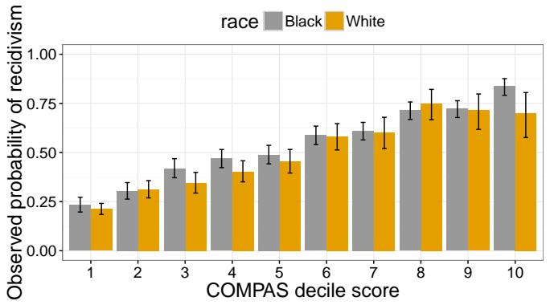
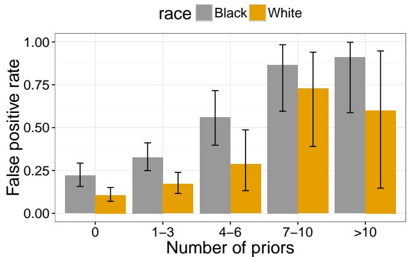
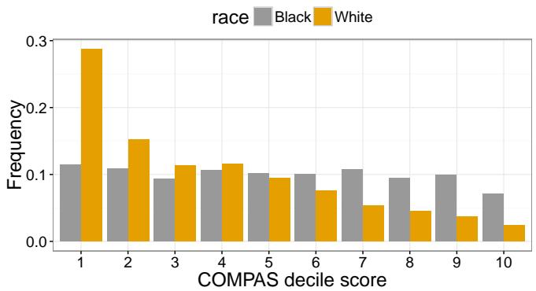

# Fair prediction with disparate impact: A study of bias in recidivism prediction instruments

Alexandra Chouldechova

Heinz College, Carnegie Mellon University

5000 Forbes Avenue, Pittsburgh, PA, USA

achould@cmu.edu

# Abstract

Recidivism prediction instruments (RPI’s) provide decision makers with an assessment of the likelihood that a criminal defendant will reoffend at a future point in time. While such instruments are gaining increasing popularity across the country, their use is attracting tremendous controversy. Much of the controversy concerns potential discriminatory bias in the risk assessments that are produced. This paper discusses a fairness criterion originating in the field of educational and psychological testing that has recently been applied to assess the fairness of recidivism prediction instruments. We demonstrate how adherence to the criterion may lead to considerable disparate impact when recidivism prevalence differs across groups.

# 1 Introduction

Risk assessment instruments are gaining increasing popularity within the criminal justice system, with versions of such instruments being used or considered for use in pre-trial decision-making, parole decisions, and in some states even sentencing [1, 2]. In each of these cases, a high-risk classification— particularly a high-risk misclassification—may have a direct adverse impact on a criminal defendant’s outcome. If RPI’s are to continue to be used, it is important to ensure that they do not result in unethical practices that disparately affect different groups.

Within the psychometrics literature, there exist widely accepted and adopted standards for assessing whether an instrument is fair in the sense of being free of predictive bias. These standards have recently been applied to the COMPAS [3] and PCRA [4] instruments, with initial findings suggesting that there

is evidence of predictive bias when it comes to gender, but not when it comes to race [5, 6, 7].

In a recent widely popularized investigation of the COMPAS RPI conducted by a team at ProPublica, a different approach to assessing instrument bias told what appears to be a contradictory story [8]. The authors found that the likelihood of a non-recidivating Black defendant being assessed as high-risk is nearly twice that of White defendants. While this analysis has met with much criticism, it has also made headlines. There is no doubt that it is now embedded in the national conversation on the use of RPI’s.

In this paper we show that the differences in false positive and false negative rates cited as evidence of racial bias in the ProPublica article are a direct consequence of applying an instrument that is free from predictive bias1 to a population in which recidivism prevalence differs across groups. Our main contribution is twofold. (1) First, we make precise the connection between the psychometric notion of test fairness and error rates in classification. (2) Next, we demonstrate how using an RPI that has different false postive and false negative rates between groups can lead to disparate impact when individuals assessed as high risk receive stricter penalties. Throughout our discussion we use the term disparate impact to refer to settings where a penalty policy has unintended disproportionate adverse impact on a particular group.

It is important to bear in mind that fairness itself—along with the notion of disparate impact— is a social and ethical concept, not a statistical one. An instrument that is free from predictive bias may nevertheless result in disparate impact depending on how and where it is used. In this paper we consider

hypothetical use cases in which we are able to directly connect statistically quantifiable features of RPI’s to a measure of disparate impact.

# 1.1 Data description and setup

The empirical results in this paper are based on the Broward County data made publicly available by ProPublica [9]. This data set contains COM-PAS recidivism risk decile scores, 2-year recidivism outcomes, and a number of demographic and crime-related variables. We restrict our attention to the subset of defendants whose race is recorded as African-American (b) or Caucasian (w).

# 2 Assessing fairness

We begin by with some notation. Let $S \ = \ S ( x )$ denote the risk score based on covariates $X ~ = ~ x$ , with higher values of $S$ corresponding to higher levels of assessed risk. Let $R \in \{ b , w \}$ denote the group that the individual belongs to, which may be one of the components of $X$ . Lastly, let $Y \in \{ 0 , 1 \}$ be the outcome indicator, with 1 denoting that the given individual recidivates. In this notation, we can think of the psychometric test fairness condition roughly as follows.

Definition 2.1 (Test fairness). A score $S = S ( x )$ is test-fair (well-calibrated)2 if it reflects the same likelihood of recidivism irrespective of the individual’s group membership, $R$ . That is, if for all values of $s$ ,

$$
\begin{array}{l} \mathbb {P} (Y = 1 \mid S = s, R = b) = \mathbb {P} (Y = 1 \mid S = s, R = w). \\ \end{array} \tag {2.1}
$$

Figure 1 shows a plot of the observed recidivism rates across all possible values of the COMPAS score. We can see that the COMPAS RPI appears to adhere well to the test fairness condition. In their response to the ProPublica investigation, Flores et al. [10] further verify this adherence using logistic regression.

# 2.1 Implied constraints on the false positive and false negative rates

To facilitate a simpler discussion of error rates, we introduce the coarsened score $S _ { c }$ , which is obtained

  
Figure 1: Plot shows $\mathbb { P } ( Y = 1 \mid S = s , R )$ for the COM-PAS decile score, with $R \in \{ \mathrm { B l a c k } , \mathrm { W h i t e } \}$ . Error bars represent 95% confidence intervals.

by thresholding $S$ at some cutoff $s H R$

$$
S _ {c} (x) \equiv \left\{ \begin{array}{l l} \mathrm {H R} & \text {i f} S (x) > s _ {H R} \\ \mathrm {L R} & \text {i f} S (x) \leq s _ {H R} \end{array} \right. \tag {2.2}
$$

The coarsened score simply assesses each defendant as being at high-risk or low-risk of recidivism. For the purpose of our discussion, we will think of $S _ { c }$ as a classifier used to predict the binary outcome $Y$ . This allows us to summarize $S _ { c }$ in terms of a confusion matrix, as shown below.

<table><tr><td></td><td>Sc=Low-Risk</td><td>Sc=High-Risk</td></tr><tr><td>Y=0</td><td>TN</td><td>FP</td></tr><tr><td>Y=1</td><td>FN</td><td>TP</td></tr></table>

It is easily verified that test fairness of $S$ implies that the positive predictive value of the coarsened score $S _ { c }$ does not depend on $R$ . More precisely, it implies that that the quantity

$$
\operatorname {P P V} \left(S _ {c} \mid R = r\right) \equiv \mathbb {P} (Y = 1 \mid S _ {c} = \mathrm {H R}, R = r) \tag {2.3}
$$

does not depend on $r$ . Equation (2.3) thus forms a necessary condition for the test fairness of $S$ . We can think of this as a constraint on the values of the confusion matrix. A second constraint—one that we have no direct control over—is the recidivism prevalence within groups, which we denote here by $p _ { r } \equiv \mathbb { P } ( Y = 1 \mid R = r )$ .

Given values of the $\mathrm { P P V } \in ( 0 , 1 )$ and prevalence $p \in ( 0 , 1 )$ , it is straightforward to show that the false negative rate $\mathrm { F N R } = \mathbb { P } ( S _ { c } = \mathrm { L R } \mid Y = 1 )$ and false positive rate $\mathrm { F P R } = \mathbb { P } ( S _ { c } = \mathrm { H R } \mid Y = 0 )$ are related

via the equation

$$
\mathrm {F P R} = \frac {p}{1 - p} \frac {1 - \mathrm {P P V}}{\mathrm {P P V}} (1 - \mathrm {F N R}). \tag {2.4}
$$

A direct implication of this simple expression is that when the recidivism prevalence differs between two groups, a test-fair score $S _ { c }$ cannot have equal false positive and negative rates across those groups.3

This observation enables us to better understand why the ProPublica authors observed large discrepancies in FPR and FNR between Black and White defendants.4 The recidivism rate among back defendants in the data is $5 1 \%$ , compared to $3 9 \%$ for White defendants. Since the COMPAS RPI approximately satisfies test fairness, we know that some level of imbalance in the error rates must exist.

# 3 Assessing impact

In this section we show how differences in false positive and false negative rates can result in disparate impact under policies where a high-risk assessment results in a stricter penalty for the defendant. Such situations may arise when risk assessments are used to inform bail, parole, or sentencing decisions. In the state of Pennsylvania, for instance, statutes permit the use of RPI’s in sentencing, provided that the sentence ultimately falls within accepted guidelines. We use the term “penalty” somewhat loosely in this discussion to refer to outcomes both in the pre-trial and post-conviction phase of legal proceedings. Even though pre-trial outcomes such as the amount at which bail is set are not punitive in a legal sense, we nevertheless refer to bail amount as a “penalty” for the purpose of our discussion.

There are notable cases where RPI’s are used for the express purpose of informing risk reduction efforts. In such settings, individuals assessed as high risk receive what may be viewed as a benefit rather than a penalty. The PCRA score, for instance, is intended to support precisely this type of decisionmaking at the federal courts level. Our analysis in this section specifically addresses use cases where high-risk individuals receive stricter penalties.

To begin, consider a setting in which guidelines indicate that a defendant is to receive a penalty $t _ { L } \leq$ $T \leq t _ { H }$ . A very simple risk-based approach, which we will refer to as the MinMax policy, would be to assign penalties as follows:

$$
T _ {\mathrm {M i n M a x}} = \left\{ \begin{array}{l l} t _ {L} & \text {i f S _ {c} = L o w - r i s k} \\ t _ {H} & \text {i f S _ {c} = H i g h - r i s k} \end{array} . \right. \tag {3.1}
$$

In this simple setting, we can precisely characterize the extent of disparate impact in terms of recognizable quantities. Define $T _ { r , y }$ to be the penalty given to a defendant in group $R = r$ with observed outcome $Y = y \in \{ 0 , 1 \}$ , and let $\Delta = \Delta ( y _ { 1 } , y _ { 2 } ) =$ $\mathbb { E } ( T _ { b , y _ { 1 } } - T _ { w , y _ { 2 } } )$ be expected difference in sentence between defendants in different groups. $\Delta$ is a measure of disparate impact.

Proposition 3.1. The expected difference in penalty under the MinMax policy is given by

$$
\begin{array}{l} \Delta \equiv \mathbb {E} _ {\text {M i n M a x}} \left(T _ {b, y _ {1}} - T _ {w, y _ {2}}\right) \\ = \left(t _ {H} - t _ {L}\right) \left[ \mathbb {P} \left(S _ {c} = H R \mid R = b, Y = y _ {1}\right) \right. \\ \left. - \mathbb {P} \left(S _ {c} = H R \mid R = w, Y = y _ {2}\right) \right] \\ \end{array}
$$

We will discuss two immediate Corollaries of this result.

Corollary 3.1 (Non-recidivators). Among individuals who do not recidivate, the difference in average penalty under the MinMax policy is

$$
\Delta = \left(t _ {H} - t _ {L}\right) \left(\mathrm {F P R} _ {b} - \mathrm {F P R} _ {w}\right) \tag {3.2}
$$

Corollary 3.2 (Recidivators). Among individuals who recidivate, the difference in average penalty under the MinMax policy is

$$
\Delta = \left(t _ {H} - t _ {L}\right) \left(\mathrm {F N R} _ {w} - \mathrm {F N R} _ {b}\right) \tag {3.3}
$$

When using a test-fair RPI in populations where recidivism prevalence differs across groups, it will generally be the case that the higher recidivism prevalence group will have a higher FPR and lower FNR. From equations (3.2) and (3.3), we can see that this would result in greater penalties for defendants in the higher prevalence group, both among recidivating and non-recidivating offenders.

An interesting special case to consider is one where $t _ { L } = 0$ . This could arise in sentencing decisions for

offenders convicted of low-severity crimes who have good prior records. In such cases, so-called restorative sanctions may be imposed as an alternative to a period of incarceration. If we further take $t _ { H } = 1$ , then $\mathbb { E } T = \mathbb { P } ( T \neq 0 )$ , which can be interpreted as the probability that a defendant receives a sentence imposing some period of incarceration.

It’s easy to see that in such settings a nonrecidivating defendant in group $b$ is FPRb/FPRw times more likely to be incarcerated compared to a non-recidivating defendant in group $w$ .5 This naturally raises the question of whether overall differences in error rates are observed to persist across more granular subgroups.

One might expect that differences in false positive rates are largely attributable to the subset of defendants who are charged with more serious offenses and who have a larger number of prior arrests/convictions. While it is true that the false positive rates within both racial groups are higher for defendants with worse criminal histories, considerable between-group differences in these error rates persist across low prior count subgroups. Figure 2 shows a plot of false positive rates across different ranges of prior count for defendants charged with a misdemeanor offense, which is the lowest severity criminal offense category. As one can see, differences in false positive rates between Black defendants and White defendants persist across prior record subgroups.

# 3.1 Connections to measures of effect size

A natural question to ask is whether the level of disparate impact, $\Delta$ , is related to some measures of effect size commonly used in scientific reporting. With a small generalization of the $\%$ non-overlap measure, we can answer this question in the affirmative.

The $\%$ non-overlap of two distributions is generally calculated assuming both distributions are normal, and thus has a one-to-one correspondence to Cohen’s $d$ [12].6 Figure 3 shows that the COMPAS decile score is far from being normally distributed. A more reasonable way to calculate $\%$ non-overlap is to note that in the Gaussian case $\%$ non-overlap

  
Figure 2: False positive rates across prior record count for defendants charged with a Misdemeanor offense. Plot is based on assessing a defendant as “high-risk” if their COMPAS decile score is $> 4$ . Error bars represent 95% confidence intervals.   
Figure 3: COMPAS decile score histograms for Black and White defendants. Cohen’s $d = 0 . 6 0$ , non-overlap $d _ { \mathrm { T V } } ( f _ { b } , f _ { w } ) = 2 4 . 5 \%$ .

is equivalent to the total variation distance. Letting $f _ { r , y } ( s )$ denote the score distribution for race $r$ and recidivism outcome $y$ , one can establish the following sharp bound on $\Delta$ .

Proposition 3.2 (Percent overlap bound). Under the MinMax policy,

$$
\Delta \leq (t _ {H} - t _ {L}) d _ {\mathrm {T V}} (f _ {b, y}, f _ {w, y}).
$$

# 4 Discussion

The primary contribution of this paper was to show how disparate impact can result from the use of a recidivism prediction instrument that is known to be free from predictive bias. Our analysis focussed on the simple setting where a binary risk assessment

was used to inform a binary penalty policy. While all of the formulas have natural analogs in the nonbinary score and penalty setting, we find that all of the salient features are already present in the analysis of the simpler binary-binary problem.

Our analysis indicates that there are risk assessment use cases in which it is desirable to balance error rates across different groups, even though this will generally result in risk assessments that are not free from predictive bias. However, balancing error rates overall may not be sufficient, as this does not guarantee balance at finer levels of granularity. That is, even if $\mathrm { F P R } _ { b } = \mathrm { F P R } _ { w }$ , we may still see differences in error rates within prior record score categories (see e.g., Figure 2). One needs to decide the level of granularity at which error rate balance is desirable to achieve.

In closing, we would like to note that there is a large body of literature showing that data-driven risk assessment instruments tend to be more accurate than professional human judgements [13, 14], and investigating whether human-driven decisions are themselves prone to exhibiting racial bias [15, 16]. We should not abandon the data-driven approach on the basis of negative headlines. Rather, we need to work to ensure that the instruments we use are demonstrably free from the kinds of quantifiable biases that could lead to disparate impact in the specific contexts in which they are to be applied.

# References

[1] Thomas Blomberg, William Bales, Karen Mann, Ryan Meldrum, and Joe Nedelec. Validation of the compas risk assessment classification instrument. 2010.   
[2] Ben Casselman Anna Maria Barry-Jester and Dana Goldstein. Should prison sentences be based on crimes that haven’t been committed yet?   
[3] Northpointe. Compas risk & need assessment system: Selected questions posed by inquiring agencies.   
[4] Administrative Office of the United States Courts. An overview of the federal post conviction risk assessment, September 2011.   
[5] Jay P Singh. Predictive validity performance indicators in violence risk assessment: A methodological primer. Behavioral Sciences & the Law, 31(1):8–22, 2013.   
[6] Jennifer L Skeem and Christopher T Lowenkamp. Risk, race, & recidivism: Predictive bias and disparate impact. Available at SSRN, 2015.   
[7] Jennifer L Skeem, John Monahan, and Christopher T Lowenkamp. Gender, risk assessment, and sanctioning: The cost of treating women like men. Available at SSRN 2718460, 2016.   
[8] Julia Angwin, Jeff Larson, Surya Mattu, and Lauren Kirchner. Machine bias: There’s software used across the country to predict future criminals. and it’s biased against blacks. 2016. URL https://www.propublica.org/article/ machine-bias-risk-assessments-in-criminal-senten   
[9] Julia Angwin, Jeff Larson, Surya Mattu, and Lauren Kirchner. How we analyzed the compas recidivism algorithm. 2016. URL https://www.propublica.org/article/ how-we-analyzed-the-compas-recidivism-algorithm.

[10] Anthony W Flores, Kristin Bechtel, and Christopher T Lowenkamp. False positives, false negatives, and false analyses: A rejoinder to “machine bias: There’s software used across the country to predict future criminals. and it’s biased against blacks.”. Unpublished manuscript, 2016.   
[11] Jon Kleinberg, Sendhil Mullainathan, and Manish Raghavan. Inherent trade-offs in the fair determination of risk scores. arXiv preprint arXiv:1609.05807, 2016.   
[12] Jacob Cohen. Statistical Power Analysis for the Behavioral Sciences (2nd Edition). Lawrence Erlbaum Associates, 1988.   
[13] Paul E Meehl. Clinical versus statistical prediction: A theoretical analysis and a review of the evidence. University of Minnesota Press, 1954.   
[14] William M Grove, David H Zald, Boyd S Lebow, Beth E Snitz, and Chad Nelson. Clinical versus mechanical prediction: a meta-analysis. Psychological assessment, 12(1):19, 2000.   
[15] Shamena Anwar and Hanming Fang. Testing for racial prejudice in the parole board release process: Theory and evidence. Technical report, National Bureau of Economic Research, 2012.   
[16] Laura T Sweeney and Craig Haney. The influence of race on sentencing: A meta-analytic review of experimental studies. Behavioral Sciences & the Law, 10(2):179–195, 1992.