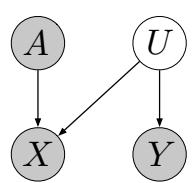
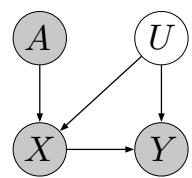
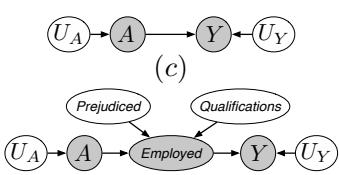
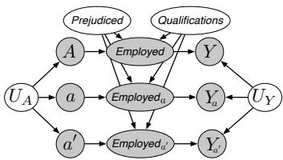
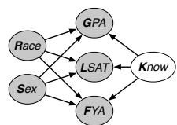
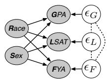
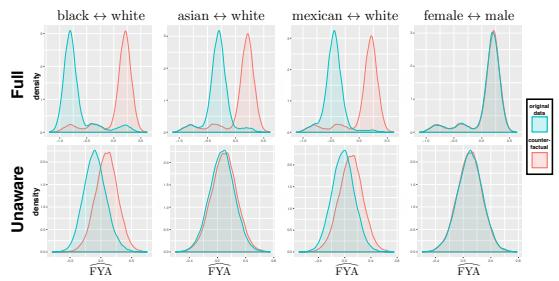
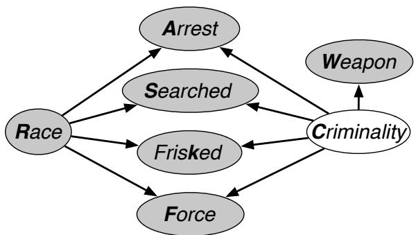
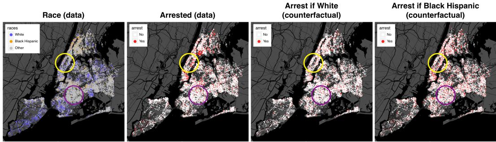

# Counterfactual Fairness

# Matt Kusner ∗

The Alan Turing Institute and

University of Warwick

mkusner@turing.ac.uk

# Joshua Loftus ∗

New York University

loftus@nyu.edu

# Chris Russell ∗

The Alan Turing Institute and

University of Surrey

crussell@turing.ac.uk

# Ricardo Silva

The Alan Turing Institute and

University College London

ricardo@stats.ucl.ac.uk

# Abstract

Machine learning can impact people with legal or ethical consequences when it is used to automate decisions in areas such as insurance, lending, hiring, and predictive policing. In many of these scenarios, previous decisions have been made that are unfairly biased against certain subpopulations, for example those of a particular race, gender, or sexual orientation. Since this past data may be biased, machine learning predictors must account for this to avoid perpetuating or creating discriminatory practices. In this paper, we develop a framework for modeling fairness using tools from causal inference. Our definition of counterfactual fairness captures the intuition that a decision is fair towards an individual if it is the same in (a) the actual world and (b) a counterfactual world where the individual belonged to a different demographic group. We demonstrate our framework on a real-world problem of fair prediction of success in law school.

# 1 Contribution

Machine learning has spread to fields as diverse as credit scoring [20], crime prediction [5], and loan assessment [25]. Decisions in these areas may have ethical or legal implications, so it is necessary for the modeler to think beyond the objective of maximizing prediction accuracy and consider the societal impact of their work. For many of these applications, it is crucial to ask if the predictions of a model are fair. Training data can contain unfairness for reasons having to do with historical prejudices or other factors outside an individual’s control. In 2016, the Obama administration released a report2 which urged data scientists to analyze “how technologies can deliberately or inadvertently perpetuate, exacerbate, or mask discrimination."

There has been much recent interest in designing algorithms that make fair predictions [4, 6, 10, 12, 14, 16–19, 22, 24, 36–39]. In large part, the literature has focused on formalizing fairness into quantitative definitions and using them to solve a discrimination problem in a certain dataset. Unfortunately, for a practitioner, law-maker, judge, or anyone else who is interested in implementing algorithms that control for discrimination, it can be difficult to decide which definition of fairness to choose for the task at hand. Indeed, we demonstrate that depending on the relationship between a protected attribute and the data, certain definitions of fairness can actually increase discrimination.

In this paper, we introduce the first explicitly causal approach to address fairness. Specifically, we leverage the causal framework of Pearl [30] to model the relationship between protected attributes and data. We describe how techniques from causal inference can be effective tools for designing fair algorithms and argue, as in DeDeo [9], that it is essential to properly address causality in fairness. In perhaps the most closely related prior work, Johnson et al. [15] make similar arguments but from a non-causal perspective. An alternative use of causal modeling in the context of fairness is introduced independently by [21].

In Section 2, we provide a summary of basic concepts in fairness and causal modeling. In Section 3, we provide the formal definition of counterfactual fairness, which enforces that a distribution over possible predictions for an individual should remain unchanged in a world where an individual’s protected attributes had been different in a causal sense. In Section 4, we describe an algorithm to implement this definition, while distinguishing it from existing approaches. In Section 5, we illustrate the algorithm with a case of fair assessment of law school success.

# 2 Background

This section provides a basic account of two separate areas of research in machine learning, which are formally unified in this paper. We suggest Berk et al. [1] and Pearl et al. [29] as references. Throughout this paper, we will use the following notation. Let $A$ denote the set of protected attributes of an individual, variables that must not be discriminated against in a formal sense defined differently by each notion of fairness discussed. The decision of whether an attribute is protected or not is taken as a primitive in any given problem, regardless of the definition of fairness adopted. Moreover, let $X$ denote the other observable attributes of any particular individual, $U$ the set of relevant latent attributes which are not observed, and let $Y$ denote the outcome to be predicted, which itself might be contaminated with historical biases. Finally, $\hat { Y }$ is the predictor, a random variable that depends on $A , X$ and $U$ , and which is produced by a machine learning algorithm as a prediction of $Y$ .

# 2.1 Fairness

There has been much recent work on fair algorithms. These include fairness through unawareness [12], individual fairness [10, 16, 24, 38], demographic parity/disparate impact [36], and equality of opportunity [14, 37]. For simplicity we often assume $A$ is encoded as a binary attribute, but this can be generalized.

Definition 1 (Fairness Through Unawareness (FTU)). An algorithm is fair so long as any protected attributes $A$ are not explicitly used in the decision-making process.

Any mapping ${ \hat { Y } } : X  Y$ that excludes $A$ satisfies this. Initially proposed as a baseline, the approach has found favor recently with more general approaches such as Grgic-Hlaca et al. [12]. Despite its compelling simplicity, FTU has a clear shortcoming as elements of $X$ can contain discriminatory information analogous to $A$ that may not be obvious at first. The need for expert knowledge in assessing the relationship between $A$ and $X$ was highlighted in the work on individual fairness:

Definition 2 (Individual Fairness (IF)). An algorithm is fair if it gives similar predictions to similar individuals. Formally, given a metric $d ( \cdot , \cdot )$ , if individuals i and $j$ are similar under this metric (i.e., $d ( i , j )$ is small) then their predictions should be similar: $\hat { Y } ( X ^ { ( i ) } , A ^ { ( i ) } ) \approx \hat { Y } ( X ^ { ( j ) } , A ^ { ( j ) } )$ .

As described in [10], the metric $d ( \cdot , \cdot )$ must be carefully chosen, requiring an understanding of the domain at hand beyond black-box statistical modeling. This can also be contrasted against population level criteria such as

Definition 3 (Demographic Parity (DP)). A predictor $\hat { Y }$ satisfies demographic parity if $P ( { \hat { Y } } | A =$ $0 ) = P ( \hat { Y } | A = 1 )$ .

Definition 4 (Equality of Opportunity (EO)). A predictor $\hat { Y }$ satisfies equality of opportunity if $P ( \hat { Y } = 1 | A = 0 , Y = 1 ) = P ( \hat { Y } = 1 | A = 1 , Y = 1 )$ .

These criteria can be incompatible in general, as discussed in [1, 7, 22]. Following the motivation of IF and [15], we propose that knowledge about relationships between all attributes should be taken into consideration, even if strong assumptions are necessary. Moreover, it is not immediately clear

for any of these approaches in which ways historical biases can be tackled. We approach such issues from an explicit causal modeling perspective.

# 2.2 Causal Models and Counterfactuals

We follow Pearl [28], and define a causal model as a triple $( U , V , F )$ of sets such that

• $U$ is a set of latent background variables,which are factors not caused by any variable in the set $V$ of observable variables;   
• $F$ is a set of functions $\{ f _ { 1 } , \ldots , f _ { n } \}$ , one for each $V _ { i } \in V$ , such that $V _ { i } = f _ { i } ( p a _ { i } , U _ { p a _ { i } } )$ , $p a _ { i } \subseteq V \backslash \{ V _ { i } \}$ and $U _ { p a _ { i } } \subseteq U$ . Such equations are also known as structural equations [2].

The notation $^ { \bullet } p a _ { i }$ ” refers to the “parents” of $V _ { i }$ and is motivated by the assumption that the model factorizes as a directed graph, here assumed to be a directed acyclic graph (DAG). The model is causal in that, given a distribution $P ( U )$ over the background variables $U$ , we can derive the distribution of a subset $Z \subseteq V$ following an intervention on $V \setminus Z$ . An intervention on variable $V _ { i }$ is the substitution of equation $V _ { i } = f _ { i } ( p a _ { i } , U _ { p a _ { i } } )$ with the equation $V _ { i } = v$ for some $v$ . This captures the idea of an agent, external to the system, modifying it by forcefully assigning value $v$ to $V _ { i }$ , for example as in a randomized experiment.

The specification of $F$ is a strong assumption but allows for the calculation of counterfactual quantities. In brief, consider the following counterfactual statement, “the value of $Y$ if $Z$ had taken value $z ^ { \prime \prime }$ , for two observable variables $Z$ and $Y$ . By assumption, the state of any observable variable is fully determined by the background variables and structural equations. The counterfactual is modeled as the solution for $Y$ for a given $U = u$ where the equations for $Z$ are replaced with $Z = z$ . We denote it by $Y _ { Z  z } ( u )$ [28], and sometimes as $Y _ { z }$ if the context of the notation is clear.

Counterfactual inference, as specified by a causal model $( U , V , F )$ given evidence $W$ , is the computation of probabilities $P ( Y _ { Z  z } ( U ) \mid W \dot { = } w )$ , where $W$ , $Z$ and $Y$ are subsets of $V$ . Inference proceeds in three steps, as explained in more detail in Chapter 4 of Pearl et al. [29]: 1. Abduction: for a given prior on $U$ , compute the posterior distribution of $U$ given the evidence $W = w$ ; 2. Action: substitute the equations for $Z$ with the interventional values $z$ , resulting in the modified set of equations $F _ { z }$ ; 3. Prediction: compute the implied distribution on the remaining elements of $V$ using $F _ { z }$ and the posterior $P ( U \mid W = w )$ .

# 3 Counterfactual Fairness

Given a predictive problem with fairness considerations, where $A$ , $X$ and $Y$ represent the protected attributes, remaining attributes, and output of interest respectively, let us assume that we are given a causal model $( U , V , F )$ , where $V \equiv A \cup X$ . We postulate the following criterion for predictors of $Y$ .

Definition 5 (Counterfactual fairness). Predictor $\hat { Y }$ is counterfactually fair if under any context $X = x$ and $A = a$ ,

$$
P \left(\hat {Y} _ {A \leftarrow a} (U) = y \mid X = x, A = a\right) = P \left(\hat {Y} _ {A \leftarrow a ^ {\prime}} (U) = y \mid X = x, A = a\right), \tag {1}
$$

for all y and for any value $a ^ { \prime }$ attainable by $A$ .

This notion is closely related to actual causes [13], or token causality in the sense that, to be fair, $A$ should not be a cause of $\hat { Y }$ in any individual instance. In other words, changing $A$ while holding things which are not causally dependent on $A$ constant will not change the distribution of $\hat { Y }$ . We also emphasize that counterfactual fairness is an individual-level definition. This is substantially different from comparing different individuals that happen to share the same “treatment” $A = a$ and coincide on the values of $X$ , as discussed in Section 4.3.1 of [29] and the Supplementary Material. Differences between $X _ { a }$ and $X _ { a ^ { \prime } }$ must be caused by variations on $A$ only. Notice also that this definition is agnostic with respect to how good a predictor $\hat { Y }$ is, which we discuss in Section 4.

Relation to individual fairness. IF is agnostic with respect to its notion of similarity metric, which is both a strength (generality) and a weakness (no unified way of defining similarity). Counterfactuals and similarities are related, as in the classical notion of distances between “worlds” corresponding to different counterfactuals [23]. If $\hat { Y }$ is a deterministic function of $W \subset A \cup X \cup U$ , as in several of

  
(a)

  
(b)

  
(e)   
Figure 1: (a), (b) Two causal models for different real-world fair prediction scenarios. See Section 3.1 for discussion. (c) The graph corresponding to a causal model with $A$ being the protected attribute and $Y$ some outcome of interest, with background variables assumed to be independent. (d) Expanding the model to include an intermediate variable indicating whether the individual is employed with two (latent) background variables Prejudiced (if the person offering the job is prejudiced) and Qualifications (a measure of the individual’s qualifications). (e) A twin network representation of this system [28] under two different counterfactual levels for $A$ . This is created by copying nodes descending from $A$ , which inherit unaffected parents from the factual world.

our examples to follow, then IF can be defined by treating equally two individuals with the same $W$ in a way that is also counterfactually fair.

Relation to Pearl et al. [29]. In Example 4.4.4 of [29], the authors condition instead on $X , A$ , and the observed realization of $\hat { Y }$ , and calculate the probability of the counterfactual realization $\hat { Y } _ { A  a ^ { \prime } }$ differing from the factual. This example conflates the predictor $\hat { Y }$ with the outcome $Y$ , of which we remain agnostic in our definition but which is used in the construction of $\hat { Y }$ as in Section 4. Our framing makes the connection to machine learning more explicit.

# 3.1 Examples

To provide an intuition for counterfactual fairness, we will consider two real-world fair prediction scenarios: insurance pricing and crime prediction. Each of these correspond to one of the two causal graphs in Figure 1(a),(b). The Supplementary Material provides a more mathematical discussion of these examples with more detailed insights.

Scenario 1: The Red Car. A car insurance company wishes to price insurance for car owners by predicting their accident rate $Y$ . They assume there is an unobserved factor corresponding to aggressive driving $U$ , that (a) causes drivers to be more likely have an accident, and (b) causes individuals to prefer red cars (the observed variable $X$ ). Moreover, individuals belonging to a certain race $A$ are more likely to drive red cars. However, these individuals are no more likely to be aggressive or to get in accidents than any one else. We show this in Figure 1(a). Thus, using the red car feature $X$ to predict accident rate $Y$ would seem to be an unfair prediction because it may charge individuals of a certain race more than others, even though no race is more likely to have an accident. Counterfactual fairness agrees with this notion: changing $A$ while holding $U$ fixed will also change $X$ and, consequently, $\hat { Y }$ . Interestingly, we can show (Supplementary Material) that in a linear model, regressing $Y$ on $A$ and $X$ is equivalent to regressing on $U$ , so off-the-shelf regression here is counterfactually fair. Regressing $Y$ on $X$ alone obeys the FTU criterion but is not counterfactually fair, so omitting A (FTU) may introduce unfairness into an otherwise fair world.

Scenario 2: High Crime Regions. A city government wants to estimate crime rates by neighborhood to allocate policing resources. Its analyst constructed training data by merging (1) a registry of residents containing their neighborhood $X$ and race $A$ , with (2) police records of arrests, giving each resident a binary label with $Y = 1$ indicating a criminal arrest record. Due to historically segregated housing, the location $X$ depends on $A$ . Locations $X$ with more police resources have larger numbers of arrests $Y$ . And finally, $U$ represents the totality of socioeconomic factors and policing practices that both influence where an individual may live and how likely they are to be arrested and charged. This can all be seen in Figure 1(b).

In this example, higher observed arrest rates in some neighborhoods are due to greater policing there, not because people of different races are any more or less likely to break the law. The label $Y = 0$

does not mean someone has never committed a crime, but rather that they have not been caught. If individuals in the training data have not already had equal opportunity, algorithms enforcing EO will not remedy such unfairness. In contrast, a counterfactually fair approach would model differential enforcement rates using $U$ and base predictions on this information rather than on $X$ directly.

In general, we need a multistage procedure in which we first derive latent variables $U$ , and then based on them we minimize some loss with respect to $Y$ . This is the core of the algorithm discussed next.

# 3.2 Implications

One simple but important implication of the definition of counterfactual fairness is the following:

Lemma 1. Let G be the causal graph of the given model $( U , V , F )$ . Then $\hat { Y }$ will be counterfactually fair if it is a function of the non-descendants of $A$ .

Proof. Let W be any non-descendant of $A$ in $\mathcal { G }$ . Then $W _ { A  a } ( U )$ and $W _ { A  a ^ { \prime } } ( U )$ have the same distribution by the three inferential steps in Section 2.2. Hence, the distribution of any function $\hat { Y }$ of the non-descendants of $A$ is invariant with respect to the counterfactual values of $A$ . □

This does not exclude using a descendant $W$ of $A$ as a possible input to $\hat { Y }$ . However, this will only be possible in the case where the overall dependence of $\hat { Y }$ on $A$ disappears, which will not happen in general. Hence, Lemma 1 provides the most straightforward way to achieve counterfactual fairness. In some scenarios, it is desirable to define path-specific variations of counterfactual fairness that allow for the inclusion of some descendants of $A$ , as discussed by [21, 27] and the Supplementary Material.

Ancestral closure of protected attributes. Suppose that a parent of a member of $A$ is not in $A$ . Counterfactual fairness allows for the use of it in the definition of $\hat { Y }$ . If this seems counterintuitive, then we argue that the fault should be at the postulated set of protected attributes rather than with the definition of counterfactual fairness, and that typically we should expect set $A$ to be closed under ancestral relationships given by the causal graph. For instance, if Race is a protected attribute, and Mother’s race is a parent of Race, then it should also be in $A$ .

Dealing with historical biases and an existing fairness paradox. The explicit difference between $\hat { Y }$ and $Y$ allows us to tackle historical biases. For instance, let $Y$ be an indicator of whether a client defaults on a loan, while $\hat { Y }$ is the actual decision of giving the loan. Consider the DAG $A  Y$ , shown in Figure 1(c) with the explicit inclusion of set $U$ of independent background variables. $Y$ is the objectively ideal measure for decision making, the binary indicator of the event that the individual defaults on a loan. If $A$ is postulated to be a protected attribute, then the predictor $\hat { Y } = Y = f _ { Y } ( A , U )$ is not counterfactually fair, with the arrow $A  Y$ being (for instance) the result of a world that punishes individuals in a way that is out of their control. Figure 1(d) shows a finer-grained model, where the path is mediated by a measure of whether the person is employed, which is itself caused by two background factors: one representing whether the person hiring is prejudiced, and the other the employee’s qualifications. In this world, $A$ is a cause of defaulting, even if mediated by other variables3. The counterfactual fairness principle however forbids us from using $Y$ : using the twin network 4 of Pearl [28], we see in Figure 1(e) that $Y _ { a }$ and $Y _ { a ^ { \prime } }$ need not be identically distributed given the background variables.

In contrast, any function of variables not descendants of $A$ can be used a basis for fair decision making. This means that any variable $\hat { Y }$ defined by ${ \hat { Y } } = g ( U )$ will be counterfactually fair for any function $g ( \cdot )$ . Hence, given a causal model, the functional defined by the function $g ( \cdot )$ minimizing some predictive error for $Y$ will satisfy the criterion, as proposed in Section 4.1. We are essentially learning a projection of $Y$ into the space of fair decisions, removing historical biases as a by-product.

Counterfactual fairness also provides an answer to some problems on the incompatibility of fairness criteria. In particular, consider the following problem raised independently by different authors (e.g.,

[7, 22]), illustrated below for the binary case: ideally, we would like our predictors to obey both Equality of Opportunity and the predictive parity criterion defined by satisfying

$$
P (Y = 1 \mid \hat {Y} = 1, A = 1) = P (Y = 1 \mid \hat {Y} = 1, A = 0),
$$

as well as the corresponding equation for $\hat { Y } = 0$ . It has been shown that if $Y$ and $A$ are marginally associated (e.g., recidivism and race are associated) and $Y$ is not a deterministic function of $\hat { Y }$ , then the two criteria cannot be reconciled. Counterfactual fairness throws a light in this scenario, suggesting that both EO and predictive parity may be insufficient if $Y$ and $A$ are associated: assuming that $A$ and $Y$ are unconfounded (as expected for demographic attributes), this is the result of $A$ being a cause of $Y$ . By counterfactual fairness, we should not want to use $Y$ as a basis for our decisions, instead aiming at some function $Y _ { \perp _ { A } }$ of variables which are not caused by $A$ but are predictive of $Y$ . $\hat { Y }$ is defined in such a way that is an estimate of the “closest” $Y _ { \perp _ { A } }$ to $Y$ according to some preferred risk function. This makes the incompatibility between EO and predictive parity irrelevant, as $A$ and $Y _ { \perp _ { A } }$ will be independent by construction given the model assumptions.

# 4 Implementing Counterfactual Fairness

As discussed in the previous Section, we need to relate $\hat { Y }$ to $Y$ if the predictor is to be useful, and we restrict $\hat { Y }$ to be a (parameterized) function of the non-descendants of $A$ in the causal graph following Lemma 1. We next introduce an algorithm, then discuss assumptions that can be used to express counterfactuals.

# 4.1 Algorithm

Let $\hat { Y } \equiv g _ { \theta } ( U , X _ { \forall A } )$ be a predictor parameterized by $\theta$ , such as a logistic regression or a neural network, and where $X _ { \forall A } \subseteq X$ are non-descendants of $A$ . Given a loss function $l ( \cdot , \cdot )$ such as squared loss or log-likelihood, and training data $\mathcal { D } \equiv \{ ( A ^ { ( i ) } , X ^ { ( i ) } , Y ^ { ( i ) } ) \}$ for $i = 1 , 2 , \ldots , n$ , we define $\begin{array} { r } { L ( \theta ) \equiv \sum _ { i = 1 } ^ { n } \mathbb { E } [ l ( y ^ { ( i ) } , g _ { \theta } ( U ^ { ( i ) } , x _ { \check { \neq } A } ^ { ( i ) } ) ) \mid x ^ { ( i ) } , a ^ { ( i ) } ] / n } \end{array}$ as the empirical loss to be minimized with respect to $\theta$ . Each expectation is with respect to random variable $U ^ { ( i ) } \sim P _ { \mathcal { M } } ( U \mid x ^ { ( i ) } , a ^ { ( i ) } )$ where $P _ { \mathcal { M } } ( U \mid x , a )$ is the conditional distribution of the background variables as given by a causal model $\mathcal { M }$ that is available by assumption. If this expectation cannot be calculated analytically, Markov chain Monte Carlo (MCMC) can be used to approximate it as in the following algorithm.

1: procedure FAIRLEARNING $( \mathcal { D } , \mathcal { M } )$   
. Learned parameters $\hat { \theta }$   
2: For each data point $i \in \mathcal { D }$ , sample $m$ MCMC samples $U _ { 1 } ^ { ( i ) } , \dots , U _ { m } ^ { ( i ) } \sim P _ { \mathcal { M } } ( U \mid x ^ { ( i ) } , a ^ { ( i ) } )$   
3: Let $\mathcal { D } ^ { \prime }$ be the augmented dataset where each point $( a ^ { ( i ) } , x ^ { ( i ) } , y ^ { ( i ) } )$ in $\mathcal { D }$ is replaced with the corresponding $m$ points $\{ ( a ^ { ( i ) } , x ^ { ( i ) } , y ^ { ( i ) } , u _ { j } ^ { ( i ) } ) \}$ .   
4: $\begin{array} { r } { \hat { \theta } \gets \mathrm { a r g m i n } _ { \theta } \sum _ { i ^ { \prime } \in \mathcal { D } ^ { \prime } } l ( y ^ { ( i ^ { \prime } ) } , g _ { \theta } ( U ^ { ( i ^ { \prime } ) } , x _ { \check { \mathcal { H } } A } ^ { ( i ^ { \prime } ) } ) ) . } \end{array}$   
5: end procedure

At prediction time, we report $\tilde { Y } \equiv \mathbb { E } [ \hat { Y } ( U ^ { \star } , x _ { \forall A } ^ { \star } ) \mid x ^ { \star } , a ^ { \star } ]$ for a new data point $( a ^ { \star } , x ^ { \star } )$ .

Deconvolution perspective. The algorithm can be understood as a deconvolution approach that, given observables $A \cup X$ , extracts its latent sources and pipelines them into a predictive model. We advocate that counterfactual assumptions must underlie all approaches that claim to extract the sources of variation of the data as “fair” latent components. As an example, Louizos et al. [24] start from the DAG $A \to X  U$ to extract $P ( U \mid X , A )$ . As $U$ and $A$ are not independent given $X$ in this representation, a type of penalization is enforced to create a posterior $P _ { f a i r } ( U | A , X )$ that is close to the model posterior $P ( U \mid A , X )$ while satisfying $P _ { f a i r } ( U | A = a , \dot { X } ) \approx P _ { f a i r } ( U | A = a ^ { \prime } , X )$ . But this is neither necessary nor sufficient for counterfactual fairness. The model for $X$ given $A$ and $U$ must be justified by a causal mechanism, and that being the case, $P ( U \mid A , X )$ requires no postprocessing. As a matter of fact, model $\mathcal { M }$ can be learned by penalizing empirical dependence measures between $U$ and $p a _ { i }$ for a given $V _ { i }$ (e.g. Mooij et al. [26]), but this concerns $\mathcal { M }$ and not $\hat { Y }$ , and is motivated by explicit assumptions about structural equations, as described next.

# 4.2 Designing the Input Causal Model

Model $\mathcal { M }$ must be provided to algorithm FAIRLEARNING. Although this is well understood, it is worthwhile remembering that causal models always require strong assumptions, even more so when making counterfactual claims [8]. Counterfactuals assumptions such as structural equations are in general unfalsifiable even if interventional data for all variables is available. This is because there are infinitely many structural equations compatible with the same observable distribution [28], be it observational or interventional. Having passed testable implications, the remaining components of a counterfactual model should be understood as conjectures formulated according to the best of our knowledge. Such models should be deemed provisional and prone to modifications if, for example, new data containing measurement of variables previously hidden contradict the current model.

We point out that we do not need to specify a fully deterministic model, and structural equations can be relaxed as conditional distributions. In particular, the concept of counterfactual fairness holds under three levels of assumptions of increasing strength:

Level 1. Build $\hat { Y }$ using only the observable non-descendants of $A$ . This only requires partial causal ordering and no further causal assumptions, but in many problems there will be few, if any, observables which are not descendants of protected demographic factors.   
Level 2. Postulate background latent variables that act as non-deterministic causes of observable variables, based on explicit domain knowledge and learning algorithms5. Information about $X$ is passed to $\hat { Y }$ via $P ( U \mid x , a )$ .   
Level 3. Postulate a fully deterministic model with latent variables. For instance, the distribution $P ( V _ { i } \mid p a _ { i } )$ can be treated as an additive error model, $V _ { i } = f _ { i } \left( p a _ { i } \right) + e _ { i }$ [31]. The error term $e _ { i }$ then becomes an input to $\hat { Y }$ as calculated from the observed variables. This maximizes the information extracted by the fair predictor $\hat { Y }$ .

# 4.3 Further Considerations on Designing the Input Causal Model

One might ask what we can lose by defining causal fairness measures involving only noncounterfactual causal quantities, such as enforcing $P ( \hat { Y } = 1 | d o ( A = a ) ) = P ( \hat { Y } = 1 | \overset { \cdot } { d o } ( \dot { A } = a ^ { \prime } ) )$ instead of our counterfactual criterion. The reason is that the above equation is only a constraint on an average effect. Obeying this criterion provides no guarantees against, for example, having half of the individuals being strongly “negatively” discriminated and half of the individuals strongly “positively” discriminated. We advocate that, for fairness, society should not be satisfied in pursuing only counterfactually-free guarantees. While one may be willing to claim posthoc that the equation above masks no balancing effect so that individuals receive approximately the same distribution of outcomes, that itself is just a counterfactual claim in disguise. Our approach is to make counterfactual assumptions explicit. When unfairness is judged to follow only some “pathways” in the causal graph (in a sense that can be made formal, see [21, 27]), nonparametric assumptions about the independence of counterfactuals may suffice, as discussed by [27]. In general, nonparametric assumptions may not provide identifiable adjustments even in this case, as also discussed in our Supplementary Material. If competing models with different untestable assumptions are available, there are ways of simultaneously enforcing a notion of approximate counterfactual fairness in all of them, as introduced by us in [32]. Other alternatives include exploiting bounds on the contribution of hidden variables [29, 33].

Another issue is the interpretation of causal claims involving demographic variables such as race and sex. Our view is that such constructs are the result of translating complex events into random variables and, despite some controversy, we consider counterproductive to claim that e.g. race and sex cannot be causes. An idealized intervention on some $A$ at a particular time can be seen as a notational shortcut to express a conjunction of more specific interventions, which may be individually doable but jointly impossible in practice. It is the plausibility of complex, even if impossible to practically manipulate, causal chains from $A$ to $Y$ that allows us to claim that unfairness is real [11]. Experiments for constructs exist, such as randomizing names in job applications to make them race-blind. They do not contradict the notion of race as a cause, and can be interpreted as an intervention on a particular aspect of the construct “race,” such as “race perception” (e.g. Section 4.4.4 of [29]).

# 5 Illustration: Law School Success

We illustrate our approach on a practical problem that requires fairness, the prediction of success in law school. A second problem, understanding the contribution of race to police stops, is described in the Supplementary Material. Following closely the usual framework for assessing causal models in the machine learning literature, the goal of this experiment is to quantify how our algorithm behaves with finite sample sizes while assuming ground truth compatible with a synthetic model.

# Problem definition: Law school success

The Law School Admission Council conducted a survey across 163 law schools in the United States [35]. It contains information on 21,790 law students such as their entrance exam scores (LSAT), their grade-point average (GPA) collected prior to law school, and their first year average grade (FYA).

Given this data, a school may wish to predict if an applicant will have a high FYA. The school would also like to make sure these predictions are not biased by an individual’s race and sex. However, the LSAT, GPA, and FYA scores, may be biased due to social factors. We compare our framework with two unfair baselines: 1. Full: the standard technique of using all features, including sensitive features such as race and sex to make predictions; 2. Unaware: fairness through unawareness, where we do not use race and sex as features. For comparison, we generate predictors $\hat { Y }$ for all models using logistic regression.

Fair prediction. As described in Section 4.2, there are three ways in which we can model a counterfactually fair predictor of FYA. Level 1 uses any features which are not descendants of race and sex for prediction. Level 2 models latent ‘fair’ variables which are parents of observed variables. These variables are independent of both race and sex. Level 3 models the data using an additive error model, and uses the independent error terms to make predictions. These models make increasingly strong assumptions corresponding to increased predictive power. We split the dataset 80/20 into a train/test set, preserving label balance, to evaluate the models.

As we believe LSAT, GPA, and FYA are all biased by race and sex, we cannot use any observed features to construct a counterfactually fair predictor as described in Level 1.

In Level 2, we postulate that a latent variable: a student’s knowledge (K), affects GPA, LSAT, and FYA scores. The causal graph corresponding to this model is shown in Figure 2, (Level 2). This is a short-hand for the distributions:

$$
\mathbf {G P A} \sim \mathcal {N} \left(b _ {G} + w _ {G} ^ {K} K + w _ {G} ^ {R} R + w _ {G} ^ {S} S, \sigma_ {G}\right),
$$

$$
\mathrm {L S A T} \sim \operatorname {P o i s s o n} \left(\exp \left(b _ {L} + w _ {L} ^ {K} K + w _ {L} ^ {R} R + w _ {L} ^ {S} S\right)\right),
$$

$$
\mathrm {F Y A} \sim \mathcal {N} \left(w _ {F} ^ {K} K + w _ {F} ^ {R} R + w _ {F} ^ {S} S, 1\right),
$$

$$
\mathrm {K} \sim \mathcal {N} (0, 1)
$$

We perform inference on this model using an observed training set to estimate the posterior distribution of $K$ . We use the probabilistic programming language Stan [34] to learn $K$ . We call the predictor constructed using $K$ , Fair $K$ .

  
Level 2

  
Level 3

  
Figure 2: Left: A causal model for the problem of predicting law school success fairly. Right: Density plots of predicted $\mathrm { F Y A } _ { a }$ and $\mathrm { F Y A } _ { a ^ { \prime } }$ .

In Level 3, we model GPA, LSAT, and FYA as continuous variables with additive error terms independent of race and sex (that may in turn be correlated with one-another). This model is shown

Table 1: Prediction results using logistic regression. Note that we must sacrifice a small amount of accuracy to ensuring counterfactually fair prediction (Fair $K$ , Fair Add), versus the models that use unfair features: GPA, LSAT, race, sex (Full, Unaware).   

<table><tr><td></td><td>Full</td><td>Unaware</td><td>Fair K</td><td>Fair Add</td></tr><tr><td>RMSE</td><td>0.873</td><td>0.894</td><td>0.929</td><td>0.918</td></tr></table>

in Figure 2, (Level 3), and is expressed by:

$$
\mathbf {G P A} = b _ {G} + w _ {G} ^ {R} R + w _ {G} ^ {S} S + \epsilon_ {G}, \epsilon_ {G} \sim p (\epsilon_ {G})
$$

$$
\mathrm {L S A T} = b _ {L} + w _ {L} ^ {R} R + w _ {L} ^ {S} S + \epsilon_ {L}, \quad \epsilon_ {L} \sim p (\epsilon_ {L})
$$

$$
\mathrm {F Y A} = b _ {F} + w _ {F} ^ {R} R + w _ {F} ^ {S} S + \epsilon_ {F}, \quad \epsilon_ {F} \sim p (\epsilon_ {F})
$$

We estimate the error terms $\epsilon _ { G } , \epsilon _ { L }$ by first fitting two models that each use race and sex to individually predict GPA and LSAT. We then compute the residuals of each model (e.g., $\epsilon _ { G } = \mathrm { G P A } - \hat { Y } _ { \mathrm { G P A } } ( R , S ) )$ . We use these residual estimates of $\epsilon _ { G } , \epsilon _ { L }$ to predict FYA. We call this Fair Add.

Accuracy. We compare the RMSE achieved by logistic regression for each of the models on the test set in Table 1. The Full model achieves the lowest RMSE as it uses race and sex to more accurately reconstruct FYA. Note that in this case, this model is not fair even if the data was generated by one of the models shown in Figure 2 as it corresponds to Scenario 3. The (also unfair) Unaware model still uses the unfair variables GPA and LSAT, but because it does not use race and sex it cannot match the RMSE of the Full model. As our models satisfy counterfactual fairness, they trade off some accuracy. Our first model Fair $K$ uses weaker assumptions and thus the RMSE is highest. Using the Level 3 assumptions, as in Fair Add we produce a counterfactually fair model that trades slightly stronger assumptions for lower RMSE.

Counterfactual fairness. We would like to empirically test whether the baseline methods are counterfactually fair. To do so we will assume the true model of the world is given by Figure 2, (Level 2). We can fit the parameters of this model using the observed data and evaluate counterfactual fairness by sampling from it. Specifically, we will generate samples from the model given either the observed race and sex, or counterfactual race and sex variables. We will fit models to both the original and counterfactual sampled data and plot how the distribution of predicted FYA changes for both baseline models. Figure 2 shows this, where each row corresponds to a baseline predictor and each column corresponds to the counterfactual change. In each plot, the blue distribution is density of predicted FYA for the original data and the red distribution is this density for the counterfactual data. If a model is counterfactually fair we would expect these distributions to lie exactly on top of each other. Instead, we note that the Full model exhibits counterfactual unfairness for all counterfactuals except sex. We see a similar trend for the Unaware model, although it is closer to being counterfactually fair. To see why these models seem to be fair w.r.t. to sex we can look at weights of the DAG which generates the counterfactual data. Specifically the DAG weights from (male,female) to GPA are (0.93,1.06) and from (male,female) to LSAT are (1.1,1.1). Thus, these models are fair w.r.t. to sex simply because of a very weak causal link between sex and GPA/LSAT.

# 6 Conclusion

We have presented a new model of fairness we refer to as counterfactual fairness. It allows us to propose algorithms that, rather than simply ignoring protected attributes, are able to take into account the different social biases that may arise towards individuals based on ethically sensitive attributes and compensate for these biases effectively. We experimentally contrasted our approach with previous fairness approaches and show that our explicit causal models capture these social biases and make clear the implicit trade-off between prediction accuracy and fairness in an unfair world. We propose that fairness should be regulated by explicitly modeling the causal structure of the world. Criteria based purely on probabilistic independence cannot satisfy this and are unable to address how unfairness is occurring in the task at hand. By providing such causal tools for addressing fairness questions we hope we can provide practitioners with customized techniques for solving a wide array of fairness modeling problems.

# Acknowledgments

This work was supported by the Alan Turing Institute under the EPSRC grant EP/N510129/1. CR acknowledges additional support under the EPSRC Platform Grant EP/P022529/1. We thank Adrian Weller for insightful feedback, and the anonymous reviewers for helpful comments.

# References

[1] Berk, R., Heidari, H., Jabbari, S., Kearns, M., and Roth, A. Fairness in criminal justice risk assessments: The state of the art. arXiv:1703.09207v1, 2017.   
[2] Bollen, K. Structural Equations with Latent Variables. John Wiley & Sons, 1989.   
[3] Bollen, K. and (eds.), J. Long. Testing Structural Equation Models. SAGE Publications, 1993.   
[4] Bolukbasi, Tolga, Chang, Kai-Wei, Zou, James Y, Saligrama, Venkatesh, and Kalai, Adam T. Man is to computer programmer as woman is to homemaker? debiasing word embeddings. In Advances in Neural Information Processing Systems, pp. 4349–4357, 2016.   
[5] Brennan, Tim, Dieterich, William, and Ehret, Beate. Evaluating the predictive validity of the compas risk and needs assessment system. Criminal Justice and Behavior, 36(1):21–40, 2009.   
[6] Calders, Toon and Verwer, Sicco. Three naive bayes approaches for discrimination-free classification. Data Mining and Knowledge Discovery, 21(2):277–292, 2010.   
[7] Chouldechova, A. Fair prediction with disparate impact: a study of bias in recidivism prediction instruments. Big Data, 2:153–163, 2017.   
[8] Dawid, A. P. Causal inference without counterfactuals. Journal of the American Statistical Association, pp. 407–448, 2000.   
[9] DeDeo, Simon. Wrong side of the tracks: Big data and protected categories. arXiv preprint arXiv:1412.4643, 2014.   
[10] Dwork, Cynthia, Hardt, Moritz, Pitassi, Toniann, Reingold, Omer, and Zemel, Richard. Fairness through awareness. In Proceedings of the 3rd Innovations in Theoretical Computer Science Conference, pp. 214–226. ACM, 2012.   
[11] Glymour, C. and Glymour, M. R. Commentary: Race and sex are causes. Epidemiology, 25(4): 488–490, 2014.   
[12] Grgic-Hlaca, Nina, Zafar, Muhammad Bilal, Gummadi, Krishna P, and Weller, Adrian. The case for process fairness in learning: Feature selection for fair decision making. NIPS Symposium on Machine Learning and the Law, 2016.   
[13] Halpern, J. Actual Causality. MIT Press, 2016.   
[14] Hardt, Moritz, Price, Eric, Srebro, Nati, et al. Equality of opportunity in supervised learning. In Advances in Neural Information Processing Systems, pp. 3315–3323, 2016.   
[15] Johnson, Kory D, Foster, Dean P, and Stine, Robert A. Impartial predictive modeling: Ensuring fairness in arbitrary models. arXiv preprint arXiv:1608.00528, 2016.   
[16] Joseph, Matthew, Kearns, Michael, Morgenstern, Jamie, Neel, Seth, and Roth, Aaron. Rawlsian fairness for machine learning. arXiv preprint arXiv:1610.09559, 2016.   
[17] Kamiran, Faisal and Calders, Toon. Classifying without discriminating. In Computer, Control and Communication, 2009. IC4 2009. 2nd International Conference on, pp. 1–6. IEEE, 2009.   
[18] Kamiran, Faisal and Calders, Toon. Data preprocessing techniques for classification without discrimination. Knowledge and Information Systems, 33(1):1–33, 2012.   
[19] Kamishima, Toshihiro, Akaho, Shotaro, and Sakuma, Jun. Fairness-aware learning through regularization approach. In Data Mining Workshops (ICDMW), 2011 IEEE 11th International Conference on, pp. 643–650. IEEE, 2011.

[20] Khandani, Amir E, Kim, Adlar J, and Lo, Andrew W. Consumer credit-risk models via machine-learning algorithms. Journal of Banking & Finance, 34(11):2767–2787, 2010.   
[21] Kilbertus, N., Carulla, M. R., Parascandolo, G., Hardt, M., Janzing, D., and Schölkopf, B. Avoiding discrimination through causal reasoning. Advances in Neural Information Processing Systems 30, 2017.   
[22] Kleinberg, J., Mullainathan, S., and Raghavan, M. Inherent trade-offs in the fair determination of risk scores. Proceedings of The 8th Innovations in Theoretical Computer Science Conference (ITCS 2017), 2017.   
[23] Lewis, D. Counterfactuals. Harvard University Press, 1973.   
[24] Louizos, Christos, Swersky, Kevin, Li, Yujia, Welling, Max, and Zemel, Richard. The variational fair autoencoder. arXiv preprint arXiv:1511.00830, 2015.   
[25] Mahoney, John F and Mohen, James M. Method and system for loan origination and underwriting, October 23 2007. US Patent 7,287,008.   
[26] Mooij, J., Janzing, D., Peters, J., and Scholkopf, B. Regression by dependence minimization and its application to causal inference in additive noise models. In Proceedings of the 26th Annual International Conference on Machine Learning, pp. 745–752, 2009.   
[27] Nabi, R. and Shpitser, I. Fair inference on outcomes. arXiv:1705.10378v1, 2017.   
[28] Pearl, J. Causality: Models, Reasoning and Inference. Cambridge University Press, 2000.   
[29] Pearl, J., Glymour, M., and Jewell, N. Causal Inference in Statistics: a Primer. Wiley, 2016.   
[30] Pearl, Judea. Causal inference in statistics: An overview. Statistics Surveys, 3:96–146, 2009.   
[31] Peters, J., Mooij, J. M., Janzing, D., and Schölkopf, B. Causal discovery with continuous additive noise models. Journal of Machine Learning Research, 15:2009–2053, 2014. URL http://jmlr.org/papers/v15/peters14a.html.   
[32] Russell, C., Kusner, M., Loftus, J., and Silva, R. When worlds collide: integrating different counterfactual assumptions in fairness. Advances in Neural Information Processing Systems, 31, 2017.   
[33] Silva, R. and Evans, R. Causal inference through a witness protection program. Journal of Machine Learning Research, 17(56):1–53, 2016.   
[34] Stan Development Team. Rstan: the r interface to stan, 2016. R package version 2.14.1.   
[35] Wightman, Linda F. Lsac national longitudinal bar passage study. lsac research report series. 1998.   
[36] Zafar, Muhammad Bilal, Valera, Isabel, Rodriguez, Manuel Gomez, and Gummadi, Krishna P. Learning fair classifiers. arXiv preprint arXiv:1507.05259, 2015.   
[37] Zafar, Muhammad Bilal, Valera, Isabel, Rodriguez, Manuel Gomez, and Gummadi, Krishna P. Fairness beyond disparate treatment & disparate impact: Learning classification without disparate mistreatment. arXiv preprint arXiv:1610.08452, 2016.   
[38] Zemel, Richard S, Wu, Yu, Swersky, Kevin, Pitassi, Toniann, and Dwork, Cynthia. Learning fair representations. ICML (3), 28:325–333, 2013.   
[39] Zliobaite, Indre. A survey on measuring indirect discrimination in machine learning. arXiv preprint arXiv:1511.00148, 2015.

# S1 Population Level vs Individual Level Causal Effects

As discussed in Section 3, counterfactual fairness is an individual-level definition. This is fundamentally different from comparing different units that happen to share the same “treatment” $A = a$ and coincide on the values of $X$ . To see in detail what this means, consider the following thought experiment.

Let us assess the causal effect of $A$ on $\hat { Y }$ by controlling $A$ at two levels, $a$ and $a ^ { \prime }$ . In Pearl’s notation, where ${ \bf \cdot } _ { d o } ( A = a ) ^ { \bf \cdot }$ expresses an intervention on $A$ at level $a$ , we have that

$$
\mathbb {E} [ \hat {Y} \mid d o (A = a), X = x ] - \mathbb {E} [ \hat {Y} \mid d o (A = a ^ {\prime}), X = x ], \tag {2}
$$

is a measure of causal effect, sometimes called the average causal effect (ACE). It expresses the change that is expected when we intervene on $A$ while observing the attribute set $X = x$ , under two levels of treatment. If this effect is non-zero, $A$ is considered to be a cause of $\hat { Y }$ .

This raises a subtlety that needs to be addressed: in general, this effect will be non-zero even $i f { \hat { Y } }$ is counterfactually fair. This may sound counter-intuitive: protected attributes such as race and gender are causes of our counterfactually fair decisions.

In fact, this is not a contradiction, as the ACE in Equation (2) is different from counterfactual effects. The ACE contrasts two independent exchangeable units of the population, and it is a perfectly valid way of performing decision analysis. However, the value of $X = x$ is affected by different background variables corresponding to different individuals. That is, the causal effect (2) contrasts two units that receive different treatments but which happen to coincide on $X = x$ . To give a synthetic example, imagine the simple structural equation

$$
X = A + U.
$$

The ACE quantifies what happens among people with $U = x - a$ against people with $U ^ { \prime } = x - a ^ { \prime }$ . If, for instance, $\hat { Y } = \lambda U$ for $\lambda \neq 0$ , then the effect (2) is $\lambda ( a - a ^ { \prime } ) \neq 0$ .

Contrary to that, the counterfactual difference is zero. That is,

$$
\mathbb {E} [ \hat {Y} _ {A \leftarrow a} (U) \mid A = a, X = x ] - \mathbb {E} [ \hat {Y} _ {A \leftarrow a ^ {\prime}} (U) \mid A = a, X = x ] = \lambda U - \lambda U = 0.
$$

In another perspective, we can interpret the above just as if we had measured $U$ from the beginning rather than performing abduction. We then generate $\hat { Y }$ from some $g ( U )$ , so $U$ is the within-unit cause of $\hat { Y }$ and not $A$ .

If $U$ cannot be deterministically derived from $\{ A = a , X = x \}$ , the reasoning is similar. By abduction, the distribution of $U$ will typically depend on $A$ , and hence so will $\hat { Y }$ when marginalizing over $U$ . Again, this seems to disagree with the intuition that our predictor should be not be caused by $A$ . However, this once again is a comparison across individuals, not within an individual.

It is this balance among $( A , X , U )$ that explains, in the examples of Section 3.1, why some predictors are counterfactually fair even though they are functions of the same variables $\{ A , X \}$ used by unfair predictors: such functions must correspond to particular ways of balancing the observables that, by way of the causal assumptions, cancel out the effect of $A$ .

More on conditioning and alternative definitions. As discussed in Example 4.4.4 of Pearl et al. [29], a different proposal for assessing fairness can be defined via the following concept:

Definition 6 (Probability of sufficiency). We define the probability of event $\{ A = a \}$ being a sufficient cause for our decision $\hat { Y }$ , contrasted against $\{ A = a ^ { \prime } \}$ , as

$$
P \left(\hat {Y} _ {A \leftarrow a ^ {\prime}} (U) \neq y \mid X = x, A = a, \hat {Y} = y\right). \tag {3}
$$

We can then, for instance, claim that $\hat { Y }$ is a fair predictor if this probability is below some pre-specified bound for all $( x , a , a ^ { \prime } )$ . The shortcomings of this definition come from its original motivation: to explain the behavior of an existing decision protocol, where $\hat { Y }$ is the current practice and which in a unclear way is conflated with $Y$ . The implication is that if $\hat { Y }$ is to be designed instead of being a natural measure of existing behaviour, then we are using $\hat { Y }$ itself as evidence for the background

variables $U$ . This does not make sense if $\hat { Y }$ is yet to be designed by us. If $\hat { Y }$ is to be interpreted as $Y$ then this does not provide a clear recipe on how to build $\hat { Y }$ : while we can use $Y$ to learn a causal model, we cannot use it to collect training data evidence for $U$ as the outcome $Y$ will not be available to us at prediction time. For this reason, we claim that while probability of sufficiency is useful as a way of assessing an existing decision making process, it is not as natural as counterfactual fairness in the context of machine learning.

Approximate fairness and model validation. The notion of probability of sufficiency raises the question on how to define approximate, or high probability, counterfactual fairness. This is an important question that we address in [32]. Before defining an approximation, it is important to first expose in detail what the exact definition is, which is the goal of this paper.

We also do not address the validation of the causal assumptions used by the input causal model of the FAIRLEARNING algorithm in Section 4.1. The reason is straightforward: this validation is an entirely self-contained step of the implementation of counterfactual fairness. An extensive literature already exists in this topic which the practitioner can refer to (a classic account for instance is [3]), and which can be used as-is in our context.

The experiments performed in Section 5 can be criticized by the fact that they rely on a model that obeys our assumptions, and “obviously” our approach should work better than alternatives. This criticism is not warranted: in machine learning, causal inference is typically assessed through simulations which assume that the true model lies in the family covered by the algorithm. Algorithms, including FAIRLEARNING, are justified in the population sense. How different competitors behave with finite sample sizes is the primary question to be studied in an empirical study of a new concept, where we control for the correctness of the assumptions. Although sensitivity analysis is important, there are many degrees of freedom on how this can be done. Robustness issues are better addressed by extensions focusing on approximate versions of counterfactual fairness. This will be covered in later work.

Stricter version. For completeness of exposition, notice that the definition of counterfactual fairness could be strengthened to

$$
P \left(\hat {Y} _ {A \leftarrow a} (U) = \hat {Y} _ {A \leftarrow a ^ {\prime}} (U) \mid X = x, A = a\right) = 1. \tag {4}
$$

This is different from the original definition in the case where $\hat { Y } ( U )$ is a random variable with a different source of randomness for different counterfactuals (for instance, if $\hat { Y }$ is given by some black-box function of $U$ with added noise that is independent across each countefactual value of $A$ ). In such a situation, the event $\{ \hat { Y } _ { A  a } ( U ) = \hat { Y } _ { A  a ^ { \prime } } ( U ) \}$ will itself have probability zero even if $P ( \hat { Y } _ { A  a } ( U ) = y \mid X = x , A = a ) = P ( \hat { Y } _ { A  a ^ { \prime } } ( U ) = y \mid X = x , A = a )$ for all $y$ . We do not consider version (4) as in our view it does not feel as elegant as the original, and it is also unclear whether adding an independent source of randomness fed to $\hat { Y }$ would itself be considered unfair. Moreover, if $\hat { Y } ( U )$ is assumed to be a deterministic function of $U$ and $X$ , as in FAIRLEARNING, then the two definitions are the same6. Informally, this stricter definition corresponds to a notion of “almost surely equality” as opposed to “equality in distribution.” Without assuming that $\hat { Y }$ is a deterministic function of $U$ and $X$ , even the stricter version does not protect us against measure zero events where the counterfactuals are different. The definition of counterfactual fairness concisely emphasizes that $U$ can be a random variable, and clarifies which conditional distribution it follows. Hence, it is our preferred way of introducing the concept even though it does not explicit suggests whether ${ \hat { Y } } ( U )$ has random inputs besides $U$ .

# S2 Relation to Demographic Parity

Consider the graph $A \to X \to Y$ . In general, if $\hat { Y }$ is a function of $X$ only, then $\hat { Y }$ need not obey demographic parity, i.e.

$$
P (\hat {Y} \mid A = a) \neq P (\hat {Y} \mid A = a ^ {\prime}),
$$

where, since $\hat { Y }$ is a function of $X$ , the probabilities are obtained by marginalizing over $P ( X \mid A = a )$ and $P ( X \mid A = a ^ { \prime } )$ , respectively.

If we postulate a structural equation $X = \alpha A + e _ { X }$ , then given $A$ and $X$ we can deduce $e _ { X }$ . If $\hat { Y }$ is a function of $e _ { X }$ only and, by assumption, $e _ { X }$ is marginally independent of $A$ , then $\hat { Y }$ is marginally independent of $A$ : this follows the interpretation given in the previous section, where we interpret $e _ { X }$ as “known” despite being mathematically deduced from the observation $( A = a , X = x )$ . Therefore, the assumptions imply that $\hat { Y }$ will satisfy demographic parity, and that can be falsified. By way of contrast, if $e _ { X }$ is not uniquely identifiable from the structural equation and $( A , X )$ , then the distribution of $\hat { Y }$ depends on the value of $A$ as we marginalize $e _ { X }$ , and demographic parity will not follow. This leads to the following:

Lemma 2. If all background variables $U ^ { \prime } \subseteq U$ in the definition of $\hat { Y }$ are determined from $A$ and $X$ , and all observable variables in the definition of $\hat { Y }$ are independent of $A$ given $U ^ { \prime }$ , then $\hat { Y }$ satisfies demographic parity.

Thus, counterfactual fairness can be thought of as a counterfactual analog of demographic parity, as present in the Red Car example further discussed in the next section.

# S3 Examples Revisited

In Section 3.1, we discussed two examples. We reintroduce them here briefly, add a third example, and explain some consequences of their causal structure to the design of counterfactually fair predictors.

Scenario 1: The Red Car Revisited. In that scenario, the structure $A \to X  U \to Y$ implies that $\hat { Y }$ should not use either $X$ or $A$ . On the other hand, it is acceptable to use $U$ . It is interesting to realize, however, that since $U$ is related to $A$ and $X$ , there will be some association between $Y$ and $\{ A , X \}$ as discussed in Section S1. In particular, if the structural equation for $X$ is linear, then $U$ is a linear function of $A$ and $X$ , and as such $\hat { Y }$ will also be a function of both $A$ and $X$ . This is not a problem, as it is still the case that the model implies that this is merely a functional dependence that disappears by conditioning on a postulated latent attribute $U$ . Surprisingly, we must make $\hat { Y }$ a indirect function of $A$ if we want a counterfactually fair predictor, as shown in the following Lemma.

Lemma 3. Consider a linear model with the structure in Figure 1(a). Fitting a linear predictor to $X$ only is not counterfactually fair, while the same algorithm will produce a fair predictor using both $A$ and $X$ .

Proof. As in the definition, we will consider the population case, where the joint distribution is known. Consider the case where the equations described by the model in Figure 1(a) are deterministic and linear:

$$
X = \alpha A + \beta U, \quad Y = \gamma U.
$$

Denote the variance of $U$ as $v _ { U }$ , the variance of $A$ as $v _ { A }$ , and assume all coefficients are non-zero. The predictor ${ \hat { Y } } ( X )$ defined by least-squares regression of $Y$ on only $X$ is given by ${ \hat { Y } } ( X ) \equiv \lambda X$ , where $\lambda = C o v ( X , Y ) / V a r ( \dot { X } ) = \beta \gamma \dot { v _ { U } } / ( \alpha ^ { 2 } v _ { A } + \beta ^ { 2 } v _ { U } ) \neq 0$ . This predictor follows the concept of fairness through unawareness.

We can test whether a predictor $\hat { Y }$ is counterfactually fair by using the procedure described in Section 2.2:

(i) Compute $U$ given observations of $X , Y , A$ ; (ii) Substitute the equations involving $A$ with an interventional value $a ^ { \prime }$ ; (iii) Compute the variables $X , Y$ with the interventional value $a ^ { \prime }$ . It is clear here that $\hat { Y } _ { a } ( U ) = \lambda ( \alpha a + \beta U ) \neq \hat { Y } _ { a ^ { \prime } } ( U )$ . This predictor is not counterfactually fair. Thus, in this case fairness through unawareness actually perpetuates unfairness.

Consider instead doing least-squares regression of $Y$ on $X$ and $A$ . Note that ${ \hat { Y } } ( X , A ) \equiv \lambda _ { X } X + \lambda _ { A } A$ where $\lambda _ { X } , \lambda _ { A }$ can be derived as follows:

$$
\begin{array}{l} \left( \begin{array}{c} \lambda_ {X} \\ \lambda_ {A} \end{array} \right) = \left( \begin{array}{c c} V a r (X) & C o v (A, X) \\ C o v (X, A) & V a r (A) \end{array} \right) ^ {- 1} \left( \begin{array}{c} C o v (X, Y) \\ C o v (A, Y) \end{array} \right) \\ = \frac {1}{\beta^ {2} v _ {U} v _ {A}} \left( \begin{array}{c c} v _ {A} & - \alpha v _ {A} \\ - \alpha v _ {A} & \alpha^ {2} v _ {A} + \beta^ {2} v _ {U} \end{array} \right) \left( \begin{array}{c} \beta \gamma v _ {U} \\ 0 \end{array} \right) \\ = \left( \begin{array}{c} \frac {\gamma}{\beta} \\ \frac {- \alpha \gamma}{\beta} \end{array} \right) \tag {5} \\ \end{array}
$$

Now imagine we have observed $A = a$ . This implies that $X = \alpha a + \beta U$ and our predictor is $\begin{array} { r } { \hat { Y } ( X , a ) = \frac { \gamma } { \beta } ( \alpha a + \beta U ) + \frac { - \alpha \gamma } { \beta } a = \gamma U . } \end{array}$ . Thus, if we substitute $a$ with a counterfactual $a ^ { \prime }$ (the action step described in Section 2.2) the predictor ${ \hat { Y } } ( X , A )$ is unchanged. This is because our predictor is constructed in such a way that any change in $X$ caused by a change in $A$ is cancelled out by the $\lambda _ { A }$ . Thus this predictor is counterfactually fair. □

Note that if Figure 1(a) is the true model for the real world then ${ \hat { Y } } ( X , A )$ will also satisfy demographic parity and equality of opportunity as $\hat { Y }$ will be unaffected by $A$ .

The above lemma holds in a more general case for the structure given in Figure 1(a): any non-constant estimator that depends only on $X$ is not counterfactually fair as changing $A$ always alters $X$ .

Scenario 2: High Crime Regions Revisited. The causal structure differs from the previous example by the extra edge $X  Y$ . For illustration purposes, assume again that the model is linear. Unlike the previous case, a predictor $\hat { Y }$ trained using $X$ and $A$ is not counterfactually fair. The only change from Scenario 1 is that now $Y$ depends on $X$ as follows: $Y = \gamma U + \theta X$ . Now if we solve for $\lambda _ { X } , \lambda _ { A }$ it can be shown that $\begin{array} { r } { \hat { Y } ( X , a ) = \bar { ( \gamma } - \frac { \alpha ^ { 2 } \theta v _ { A } } { \beta v _ { U } } ) U + \alpha \theta a } \end{array}$ . As this predictor depends on the values of $A$ that are not explained by $U$ , then $\hat { Y } ( X , a ) \neq \hat { Y } ( X , a ^ { \prime } )$ and thus ${ \hat { Y } } ( X , A )$ is not counterfactually fair. The following extra example complements the previous two examples.

Scenario 3: University Success. A university wants to know if students will be successful postgraduation $Y$ . They have information such as: grade point average (GPA), advanced placement (AP) exams results, and other academic features $X$ . The university believes however, that an individual’s gender $A$ may influence these features and their post-graduation success $Y$ due to social discrimination. They also believe that independently, an individual’s latent talent $U$ causes $X$ and $Y$ . The structure is similar to Figure 1(a), with the extra edge $A  Y$ . We can again ask, is the predictor ${ \hat { Y } } ( X , A )$ counterfactually fair? In this case, the different between this and Scenario 1 is that $Y$ is a function of $U$ and $A$ as follows: $Y = \gamma U + \eta A$ . We can again solve for $\lambda _ { X } , \lambda _ { A }$ and show that $\begin{array} { r } { \hat { Y } ( X , a ) = ( \gamma - \frac { \alpha \eta v _ { A } } { \beta v _ { U } } ) U + \eta a } \end{array}$ . Again ${ \hat { Y } } ( X , A )$ is a function of $A$ not explained by $U$ , so it cannot be counterfactually fair.

# S4 Analysis of Individual Pathways

By way of an example, consider the following adaptation of the scenario concerning claims of gender bias in UC Berkeley’s admission process in the 1970s, commonly used a textbook example of Simpson’s Paradox. For each candidate student’s application, we have $A$ as a binary indicator of whether the applicant is female, $X$ as the choice of course to apply for, and $Y$ a binary indicator of whether the application was successful or not. Let us postulate the causal graph that includes the edges $A  X$ and $X  Y$ only. We observe that $A$ and $Y$ are negatively associated, which in first instance might suggest discrimination, as gender is commonly accepted here as a protected attribute for college admission. However, in the postulated model it turns out that $A$ and $Y$ are causally independent given $X$ . More specifically, women tend to choose more competitive courses (those with higher rejection rate) than men when applying. Our judgment is that the higher rejection among female than male applicants is acceptable, if the mechanism $A  X$ is interpreted as a choice which is under the control of the applicant. That is, free-will overrides whatever possible cultural background conditions that led to this discrepancy. In the framework of counterfactual fairness, we

could claim that $A$ is not a protected attribute to begin with once we understand how the world works, and that including $A$ in the predictor of success is irrelevant anyway once we include $X$ in the classifier.

However, consider the situation where there is an edge $A  Y$ , interpreted purely as the effect of discrimination after causally controlling for $X$ . While it is now reasonable to postulate $A$ to be a protected attribute, we can still judge that $X$ is not an unfair outcome: there is no need to “deconvolve” $A$ out of $X$ to obtain an estimate of the other causes $U _ { X }$ in the $A  X$ mechanism. This suggests a simple modification of the definition of counterfactual fairness. First, given the causal graph $\mathcal { G }$ assumed to encode the causal relationships in our system, define $\mathcal { P } _ { \mathcal { G } _ { A } }$ as the set of all directed paths from $A$ to $Y$ in $\mathcal { G }$ which are postulated to correspond to all unfair chains of events where $A$ causes $Y$ . Let $X _ { { \mathcal { P } } _ { { \mathcal { G } } _ { A } } ^ { c } } \subseteq X$ be the subset of covariates not present in any path in $\mathcal { P } _ { \mathcal { G } _ { A } }$ . Also, for any vector $x$ , let G $x _ { s }$ represent the corresponding subvector indexed by $S$ . The corresponding uppercase version $X _ { S }$ is used for random vectors.

Definition 7 ((Path-dependent) counterfactual fairness). Predictor $\hat { Y }$ is (path-dependent) counterfactually fair with respect to path set $\mathcal { P } _ { \mathcal { G } _ { A } }$ if under any context $X = x$ and $A = a$ ,

$$
P (\hat {Y} _ A \leftarrow a, X _ {\mathcal {P} _ {\mathcal {G} _ {A}} ^ {c}} \leftarrow x _ {\mathcal {P} _ {\mathcal {G} _ {A}} ^ {c}} (U) = y \mid X = x, A = a) =
$$

$$
P \left(\hat {Y} _ A \leftarrow a ^ {\prime}, X _ {\mathcal {P} _ {\mathcal {G} _ {A}} ^ {c}} \leftarrow x _ {\mathcal {P} _ {\mathcal {G} _ {A}} ^ {c}} (U) = y \mid X = x, A = a\right), \tag {6}
$$

for all y and for any value $a ^ { \prime }$ attainable by A.

This notion is related to controlled direct effects [29], where we intervene on some paths from $A$ to $Y$ , but not others. Paths in $\mathcal { P } _ { \mathcal { G } _ { A } }$ are considered here to be the “direct” paths, and we condition on $X$ and $A$ similarly to the definition of probability of sufficiency (3). This definition is the same as the original counterfactual fairness definition for the case where $\mathcal { P } _ { \mathcal { G } _ { A } } ^ { c } = \emptyset$ . Its interpretation is analogous to the original, indicating that for any $X _ { 0 } \in X _ { \mathcal { P } _ { \mathcal { G } _ { A } } ^ { c } }$ we are allowed to propagate information from the factual assigment $A = a$ , along with what we learned about the background causes $U _ { X _ { 0 } }$ , in order to reconstruct $X _ { 0 }$ . The contribution of $A$ is considered acceptable in this case and does not need to be “deconvolved.” The implication is that any member of $X _ { { \mathcal P } _ { \mathcal G _ { A } } ^ { c } }$ can be included in the definition of $\hat { Y }$ . In the example of college applications, we are allowed to use the choice of course $X$ even though $A$ is a confounder for $X$ and $Y$ . We are still not allowed to use $A$ directly, bypassing the background variables.

As discussed by [27], there are some counterfactual manipulations usable in a causal definition of fairness that can be performed by exploiting only independence constraints among the counterfactuals: that is, without requiring the explicit description of structural equations or other models for latent variables. A contrast between the two approaches is left for future work, although we stress that they are in some sense complementary: we are motivated mostly by problems such as the one in Figure 1(d), where many of the mediators themselves are considered to be unfairly affected by the protected attribute, and independence constraints among counterfactuals alone are less likely to be useful in identifying constraints for the fitting of a fair predictor.

# S5 The Multifaceted Dynamics of Fairness

One particularly interesting question was raised by one of the reviewers: what is the effect of continuing discrimination after fair decisions are made? For instance, consider the case where banks enforce a fair allocation of loans for business owners regardless of, say, gender. This does not mean such businesses will thrive at a balanced rate if customers continue to avoid female owned business at a disproportionate rate for unfair reasons. Is there anything useful that can be said about this issue from a causal perspective?

The work here proposed regards only what we can influence by changing how machine learningaided decision making takes place at specific problems. It cannot change directly how society as a whole carry on with their biases. Ironically, it may sound unfair to banks to enforce the allocation of resources to businesses at a rate that does not correspond to the probability of their respective success, even if the owners of the corresponding businesses are not to be blamed by that. One way of conciliating the different perspectives is by modeling how a fair allocation of loans, even if it does not come without a cost, can nevertheless increase the proportion of successful female businesses

  
Figure 3: A causal model for the stop and frisk dataset.

compared to the current baseline. This change can by itself have an indirect effect on the culture and behavior of a society, leading to diminishing continuing discrimination by a feedback mechanism, as in affirmative action. We believe that in the long run isolated acts of fairness are beneficial even if we do not have direct control on all sources of unfairness in any specific problem. Causal modeling can help on creating arguments about the long run impact of individual contributions as e.g. a type of macroeconomic assessment. There are many challenges, and we should not pretend that precise answers can be obtained, but in theory we should aim at educated quantitative assessments validating how a systemic improvement in society can emerge from localized ways of addressing fairness.

# S6 Case Study: NYC Stop-and-Frisk Data

Since 2002, the New York Police Department (NYPD) has recorded information about every time a police officer has stopped someone. The officer records information such as if the person was searched or frisked, if a weapon was found, their appearance, whether an arrest was made or a summons issued, if force was used, etc. We consider the data collected on males stopped during 2014 which constitutes 38,609 records. We limit our analysis to looking at just males stopped as this accounts for more than $9 0 \%$ of the data. We fit a model which postulates that police interactions is caused by race and a single latent factor labeled Criminality that is meant to index other aspects of the individual that have been used by the police and which are independent of race. We do not claim that this model has a solid theoretical basis, we use it below as an illustration on how to carry on an analysis of counterfactually fair decisions. We also describe a spatial analysis of the estimated latent factors.

Model. We model this stop-and-frisk data using the graph in Figure 3. Specifically, we posit main causes for the observations: Arrest (if an individual was arrested), Force (some sort of force was used during the stop), Frisked, and Searched. The first cause of these observations is some measure of an individual’s latent Criminality, which we do not observe. We believe that Criminality also directly affects Weapon (an individual was found to be carrying a weapon). For all of the features previously mentioned we believe there is an additional cause, an individual’s Race which we do observe. This factor is introduced as we believe that these observations may be biased based on an officer’s perception of whether an individual is likely a criminal or not, affected by an individual’s Race. Thus note that, in this model, Criminality is counterfactually fair for the prediction of any characteristic of the individual for problems where Race is a protected attribute.

Visualization on a map of New York City. Each of the stops can be mapped to longitude and latitude points for where the stop occurred7. This allows us to visualize the distribution of two distinct populations: the stops of White and Black Hispanic individuals, shown in Figure 4. We note that there are more White individuals stopped (4492) than Black Hispanic individuals (2414). However, if we look at the arrest distribution (visualized geographically in the second plot) the rate of arrest for White individuals is lower $( 1 2 . 1 \% )$ than for Black Hispanic individuals $( 1 9 . 8 \%$ , the highest rate for any race in the dataset). Given our model we can ask: “If every individual had been White,

  
Figure 4: How race affects arrest. The above maps show how altering one’s race affects whether or not they will be arrested, according to the model. The left-most plot shows the distribution of White and Black Hispanic populations in the stop-and-frisk dataset. The second plot shows the true arrests for all of the stops. Given our model we can compute whether or not every individual in the dataset would be arrest had they been white. We show this counterfactual in the third plot. Similarly, we can compute this counterfactual if everyone had been Black Hispanic, as shown in the fourth plot.

would they have been arrested?”. The answer to this is in the third plot. We see that the overall number of arrests decreases (from 5659 to 3722). What if every individual had been Black Hispanic? The fourth plot shows an increase in the number of arrests had individuals been Black Hispanic, according to the model (from 5659 to 6439). The yellow and purple circles show two regions where the difference in counterfactual arrest rates is particularly striking. Thus, the model indicates that, even when everything else in the model is held constant, race has a differential affect on arrest rate under the (strong) assumptions of the model.