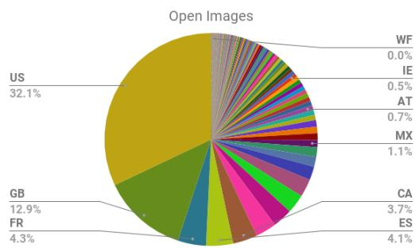
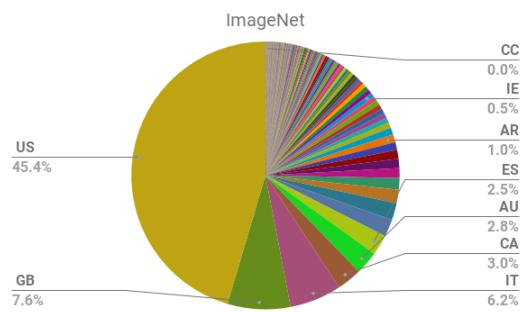
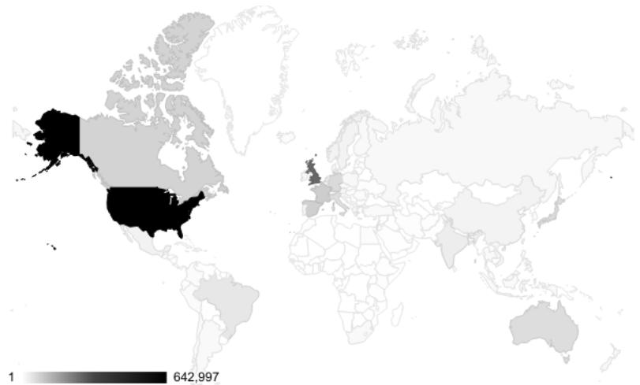
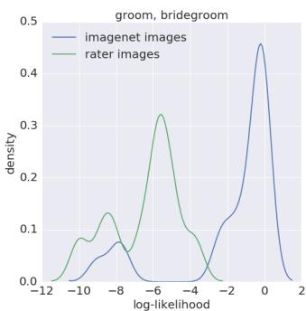
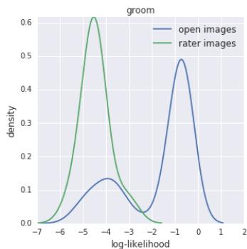
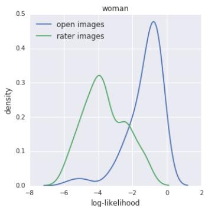
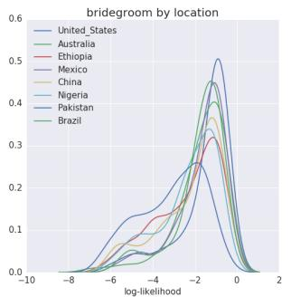
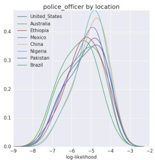
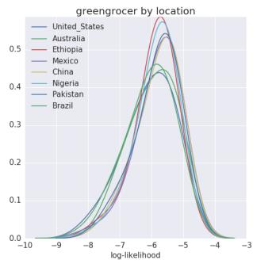
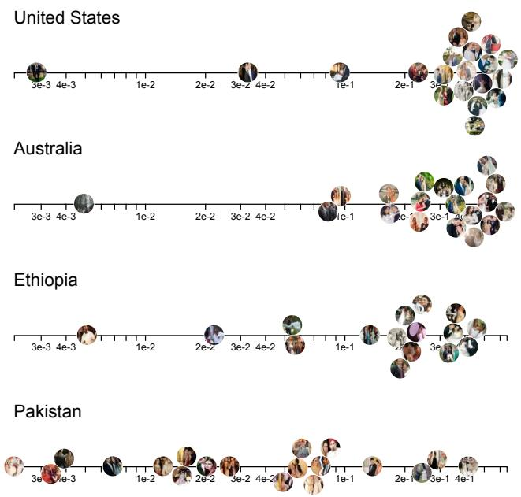

# No Classification without Representation: Assessing Geodiversity Issues in Open Data Sets for the Developing World

Shreya Shankar, Yoni Halpern, Eric Breck, James Atwood, Jimbo Wilson, D. Sculley {shankarshreya, yhalpern, ebreck, atwoodj, jimbo, dsculley}@google.com Google Brain Team

# Abstract

Modern machine learning systems such as image classifiers rely heavily on large scale data sets for training. Such data sets are costly to create, thus in practice a small number of freely available, open source data sets are widely used. We suggest that examining the geo-diversity of open data sets is critical before adopting a data set for use cases in the developing world. We analyze two large, publicly available image data sets to assess geo-diversity and find that these data sets appear to exhibit an observable amerocentric and eurocentric representation bias. Further, we analyze classifiers trained on these data sets to assess the impact of these training distributions and find strong differences in the relative performance on images from different locales. These results emphasize the need to ensure geo-representation when constructing data sets for use in the developing world.

# 1 Introduction: Data and the Developing World

Creating large data sets from scratch can be costly. As such, it is common for practitioners to use freely available open source data sets such as ImageNet [4] and Open Images [3] to train vision models. This is particularly desirable when using ML for the developing world, where resources for creating new data sets may be limited. However, if these data sets are not representative of the locations of interest, predictive performance of models may suffer.

In this paper, we assess the geo-diversity of large data sets and the differences that models trained on them exhibit when classifying images from varying geographical locations. We find an observable amerocentric and eurocentric bias shown in both forms of assessement. This is the case despite these data sets’ creators efforts to encourage diversity. We present these findings not as a criticism but as a case study in the difficulties in creating a geographically balanced data set.

# 2 Background: ImageNet and Open Images

In this work, we analyze two popular public data sets: ImageNet [4] and Open Images [3]. These two data sets are generally considered academic benchmarks and are not necessarily constructed to cover every possible use case. However, in the absence of a robust data source for a particular application, it is quite common to fall back to these standard data sets.

The first version of the ImageNet data set was released in 2009 by Deng et al. [2]. An updated 2012 release [4], used to train the model in this paper, consisted of approximately 1.2 million image thumbnails and URLs from 1000 categories. Each image in the data set is associated with a humanverified single label. The Open Images data set, released in 2016 by Krasin et al. [3], contains about 9 million URLs to Creative Commons licensed images. There are 6012 image-level human-verified labels, and each image can be associated with multiple labels.

  
Figure 1: Fraction of Open Images and ImageNet images from each country. In both data sets, top represented locations include the US and Great Britain. Countries are represented by their two-letter ISO country codes.   
Figure 2: Distribution of the geographically identifiable images in the Open Images data set, by country. Almost a third of the data in our sample was US-based, and $60 \%$ of the data was from the six most represented countries across North America and Europe.

Pretrained image classification models trained on both ImageNet and Open Images are publicly available on the Tensorflow [1] $\mathrm { S l i m } ^ { 1 }$ and Open Images Github2 pages, respectively. For each data set, we use publicly released pretrained models with the Inception V3 [6] architecture, which gives competitive performance across standard benchmarks.

# 3 Analyzing Geo-Diversity

Our first goal was to assess the geo-diversity of the images in the open source data sets. It is naturally difficult to identify the geo-location of every image in previously released open source image data sets. However, proxy information such as textual / contextual information and URL metadata provided by a service allowed us to recover reasonably reliable location information at the country level for a large number of images in each data set.

For the purposes of this study, we take this country identification, accepting the possibility of noise in the coverage and accuracy of the country-level geo-location as unlikely to qualitatively impact the larger trends shown.

Geo-Diversity of Open Images. Of the 9 million images in the Open Images data set, we were able to acquire country-level geo-location for roughly 2 million. This is a large (but potentially non-uniform) subset of the overall data. Geo-location data is shown in Figures 1 and 2. Overall, more than $32 \%$ of the sample data was US-based and $60 \%$ of the data was from the six most represented

  
Figure 3: Density plots of log-likelihood attributed for groom, bridegroom images crowdsourced by raters in Hyderabad, India, as scored by a model trained on ImageNet (left) and Open Images (center), as compared to images in the standard test sets. In both cases, the images provided by Hyderabad-located crowdsourcing are dramatically less likely to be recognized correctly by these models. The plot on right shows a similar trend for the woman class in OpenImages which has no corresponding class in ImageNet.

countries across North America and Europe. Meanwhile, China and India – the two most populous countries in the world – were represented with only $1 \%$ and $2 \%$ of the images, respectively. Despite our expectation that there would be some skew, we were surprised to find this level of imbalance.

Geo-Diversity of ImageNet. For the 14 million images in the fall 2011 release of the ImageNet data set,3 we similarly acquired country-level geo-location data. We had lower coverage for ImageNet, but the distribution was similarly dominated by a small number of countries, as shown in Figure 1. Around $45 \%$ of the data in our sample was US-based. Here, China and India were represented with $1 \%$ and $2 . 1 \%$ of the images, respectively.

# 4 Analyzing Classification Behavior Based on Geo-Location

We examined how lack of geo-diversity in training data impacts classification performance on images drawn from a broader set of locations. We collected image data for specific geographical regions using two separate methods.

Crowdsourced Data. Our first method of collecting stress-test data was to ask crowdsourced raters located in Hyderabad to find and return URLs of images on the internet that matched particular labels, specifically from a community that they identified with in an effort to avoid amerocentric or eurocentric bias.

Spot checking the results of this collection showed that images for labels such as groom, bridegroom did appear to represent traditions commonly associated with India. In other cases the human raters found it difficult to find an image from a community that they belonged to. Some of these cases were for US-centric classes, (e.g., an “infielder” baseball player or “Captain America”).

Geo-located web images. While the raters in Hyderabad gave us one source of location-specific image data, we needed another approach to find data from a wider range of countries. To this end, we first identified 15 countries to target and joined the per-country location proxy described above with inferred labels from a classifier similar to Google Cloud Vision API, across a large data store of images from the web. For analysis, we focused on labels related to “people”, such as bridegroom, police officer, and greengrocer.

One limitation of this work is that even our geographically diverse images were collected from the internet using tools that rely (at least partially) on image classifiers themselves. The human raters used web search to find images that depicted people from their communities. Similarly, when building a data set from underrepresented countries using geo-located web images to stress-test a classifier, an image classifier was used to filter for relevant images.

  
Figure 4: Density plots of log-likelihood attributed by the models trained on Open Images for images drawn from the groom, bridegroom, butcher, greengrocer, and police officer categories. Groom images with non-US location tags tend to have lower likelihoods than the groom images from the US.

Geo-Dependent Mis-Classifications. Looking over groom, bridegroom images supplied by the Hyderabad raters, we found that the classifier trained on ImageNet data was likely to misclassify these images as chain mail, a kind of armor. Other images were misclassified as focusing on cloth, academic gown, or vestment. Using a method similar to SmoothGrad [5], we looked at saliency maps to determine which parts of the images were most depended on by the model when making these classifications. Surprisingly, in all cases that we looked at, the human face in the image was highlighted rather than the attire, despite the fact that the majority of misclassifications assigned an attire-based label.

Classifier performance on localized data. We use two pretrained models, one trained on ImageNet and another trained on Open Images to test the difference in classifiers’ performances between data drawn from the standard evaluation data split in ImageNet and Open Images and rater-supplied images.

Figure 3 shows some categories that showed noticeable differences in performance. These differences appear in both classifiers, suggesting that this problem is not particular to a single data set. Using the geolocated images from the web, we compare performance between countries (Figure 4). Some classes of images have similar distributions of predictions across countries, indicating that the training data set is better-represented in such classes.

Figure 5 plots images of groom, bridegroom images from different countries by log likelihood. The US-based images are clustered to the far right, showing high confidence, while images from Ethiopia and Pakistan are much more uniformly distributed, showing poorer classifier performance. We confirmed this trend across several other countries in different regions of the world.

We focused on labels relating to humans in this work, but noticeable distributional differences between developed and developing countries can occur other areas as well, including sports, transportation, and wildlife.

# 5 Discussion

It is clear that standard open source data sets such as ImageNet or Open Images may not have sufficient geo-diversity for broad representation across the developing world. This is not too surprising, as these data sets were designed for specific purposes, and it is only the practice of later adoption for other purposes that may introduce problems.

This study highlights the importance of assessing the appropriateness of a given data set before using it to learn models for use in the developing world. Equally, this work emphasizes the importance of creating new data sets that prioritize broad geo-representation as first class goals, in order to aid ML in the developing world.

  
Figure 5: Photos of bridegrooms from different countries aligned by the log-likelihood that the classifier trained on Open Images assigns to the bridegroom class. Images from Ethiopia and Pakistan are not classified as consistently as images from the United States and Australia.

# References

[1] M. Abadi, A. Agarwal, P. Barham, E. Brevdo, Z. Chen, C. Citro, G. Corrado, A. Davis, J. Dean, M. Devin, S. Ghemawat, I. Goodfellow, A. Harp, G. Irving, M. Isard, Y. Jia, R. Jozefowicz, L. Kaiser, M. Kudlur, J. Levenberg, D. Mané, R. Monga, S. Moore, D. Murray, C. Olah, M. Schuster, J. Shlens, B. Steiner, I. Sutskever, K. Talwar, P. Tucker, V. Vanhoucke, V. Vasudevan, F. Viégas, O. Vinyals, P. Warden, M. Wattenberg, M. Wicke, Y. Yu, and X. Zheng. Tensorflow: Large-scale machine learning on heterogeneous distributed systems, 2015.   
[2] J. Deng, W. Dong, R. Socher, L.-J. Li, K. Li, and L. Fei-Fei. ImageNet: A Large-Scale Hierarchical Image Database. In CVPR09, 2009.   
[3] I. Krasin, T. Duerig, N. Alldrin, V. Ferrari, S. Abu-El-Haija, A. Kuznetsova, H. Rom, J. Uijlings, S. Popov, A. Veit, S. Belongie, V. Gomes, A. Gupta, C. Sun, G. Chechik, D. Cai, Z. Feng, D. Narayanan, and K. Murphy. Openimages: A public dataset for large-scale multi-label and multi-class image classification. Dataset available from https://github.com/openimages, 2017.   
[4] O. Russakovsky, J. Deng, H. Su, J. Krause, S. Satheesh, S. Ma, Z. Huang, A. Karpathy, A. Khosla, M. Bernstein, A. C. Berg, and L. Fei-Fei. ImageNet Large Scale Visual Recognition Challenge. International Journal of Computer Vision (IJCV), 115(3):211–252, 2015.   
[5] D. Smilkov, N. Thorat, B. Kim, F. B. Viégas, and M. Wattenberg. Smoothgrad: removing noise by adding noise. CoRR, abs/1706.03825, 2017.   
[6] C. Szegedy, V. Vanhoucke, S. Ioffe, J. Shlens, and Z. Wojna. Rethinking the inception architecture for computer vision. CoRR, abs/1512.00567, 2015.