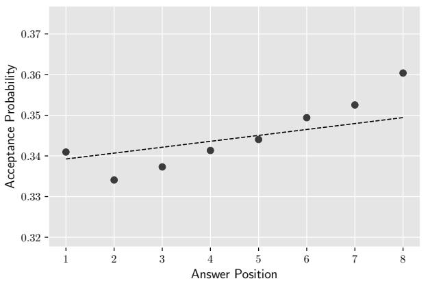
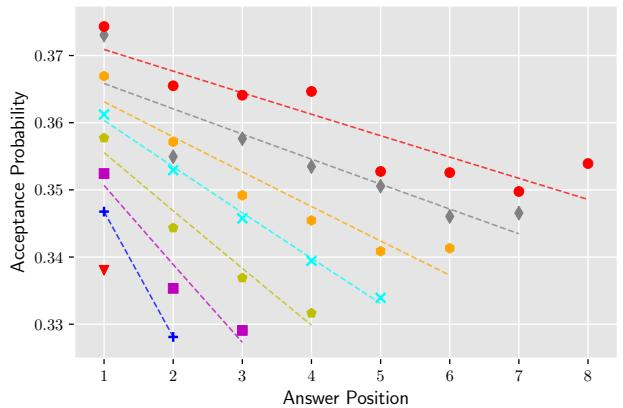
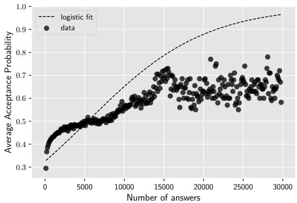
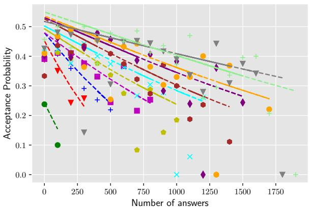
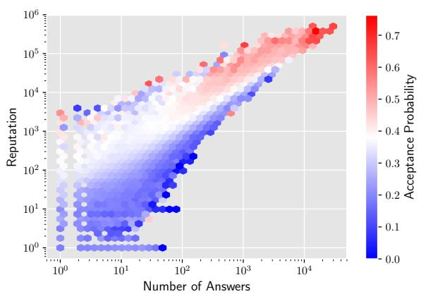
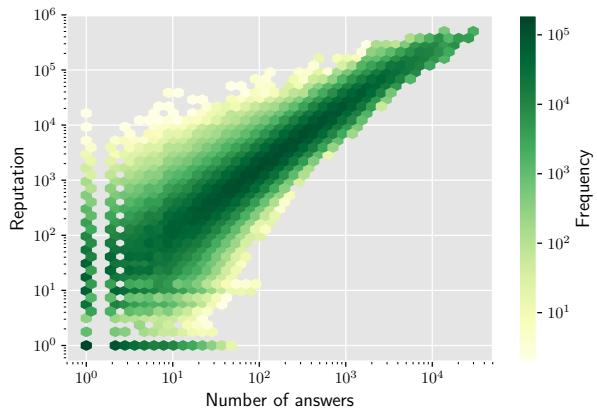
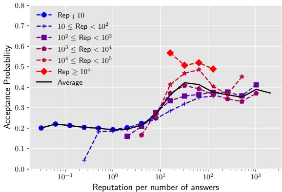
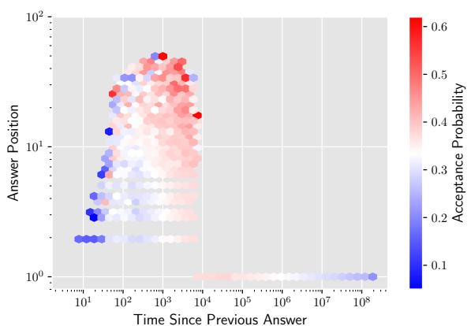
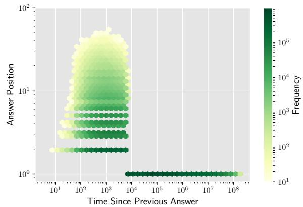

# Can you Trust the Trend? Discovering Simpson’s Paradoxes in Social Data

Nazanin Alipourfard∗

USC/ISI

4676 Admiralty Way, Marina Del Rey

Los Angeles, California 90292

nazanina@isi.edu

Peter G. Fennell

USC/ISI

4676 Admiralty Way, Marina Del Rey

Los Angeles, California 90292

pfennell@isi.edu

Kristina Lerman

USC/ISI

4676 Admiralty Way, Marina Del Rey

Los Angeles, California 90292

lerman@isi.edu

# ABSTRACT

We investigate how Simpson’s paradox a‚ects analysis of trends in social data. According to the paradox, the trends observed in data that has been aggregated over an entire population may be di‚erent from, and even opposite to, those of the underlying subgroups. Failure to take this e‚ect into account can lead analysis to wrong conclusions. We present a statistical method to automatically identify Simpson’s paradox in data by comparing statistical trends in the aggregate data to those in the disaggregated subgroups. We apply the approach to data from Stack Exchange, a popular question-answering platform, to analyze factors a‚ecting answerer performance, speci€cally, the likelihood that an answer wriŠen by a user will be accepted by the asker as the best answer to his or her question. Our analysis con€rms a known Simpson’s paradox and identi€es several new instances. Œese paradoxes provide novel insights into user behavior on Stack Exchange.

# CCS CONCEPTS

•Mathematics of computing Statistical paradigms; Exploratory data analysis; Regression analysis; •Information systems Data mining; Collaborative and social computing systems and tools; Clustering;

# KEYWORDS

Simpson’s Paradox, Trend Analysis

# ACM Reference format:

Nazanin Alipourfard, Peter G. Fennell, and Kristina Lerman. 2018. Can you Trust the Trend? Discovering Simpson’s

Paradoxes in Social Data. In Proceedings of WSDM 2018: Še Eleventh ACM International Conference on Web Search and Data Mining , Marina Del Rey, CA, USA, February 5–9, 2018 (WSDM 2018), 9 pages.

DOI: 10.1145/3159652.3159684

# 1 INTRODUCTION

Digital traces of human activity have exposed social behavior to web and data mining algorithms. Researchers have analyzed the

growing social data to understand, among other things, how information spreads in social networks [18], and the factors a‚ecting user engagement [2] and performance [19] in online platforms. Yet social data analysis presents multi-faceted challenges that existing data mining approaches are not well-equipped to handle. Real-world data is noisy and sparse. To uncover hidden paŠerns, scientists aggregate data over the population, which tends to improve statistics and signal-to-noise ratio. However, real-world data is also heterogeneous, i.e., composed of subgroups that vary widely in size and behavior. Œis heterogeneity can severely bias analysis of social data.

One example of such bias is Simpson’s paradox. According to the paradox, an association observed in data that has been aggregated over an entire population may be quite di‚erent from, and even opposite to, those of the underlying subgroups. Failure to take this e‚ect into account can distort conclusions drawn from data. One of the beŠer known examples of Simpson’s paradox comes from a study of gender bias in graduate admissions [4]. In the aggregate admissions data there appears to be a statistically signi€cant bias against women: a smaller fraction of female applicants is admiŠed for graduate studies. However, when admissions data is disaggregated by department, women have parity and even a slight advantage over men in some departments. Œe paradox arises because departments preferred by female applicants have lower admissions rates for both genders.

Simpson’s paradox also a‚ects analysis of trends. When measuring how an outcome changes as a function of an independent variable, the characteristics of the population over which the trend is measured may change as a function of the independent variable due to survivor bias. As a result, the data may appear to exhibit a trend, which disappears or reverses when the data is disaggregated. For example, it may appear that repeated exposures to information or hashtags on social media make an individual less likely to share it with his or her followers [18]. In fact, the opposite is true: the more people are exposed to information, the more likely they are to share it with followers [16]. However, those who follow many others (and are likely to be exposed to a meme or a hashtag multiple times) are less responsive overall, due to the high volume of information they receive [12]. Œeir reduced susceptibility to exposures biases the aggregate response, leading to wrong conclusions about behavior. Once disaggregated based on the volume of information received, a clearer paŠern of exposure response emerges, one that is more predictive of the actual response [13]. However, despite accumulating evidence that Simpson’s paradox a‚ects inference of trends in social and behavioral data [1, 2, 15, 19], researchers do not routinely test for it in their studies.

We describe a method to identify Simpson’s paradoxes in the analysis of trends in social data. Our statistical approach €nds pairs of variables—that we call Simpson’s pairs—such that a trend in some outcome as a function of the €rst independent variable observed in the aggregate data disappears or reverses itself when the data is disaggregated into distinct subgroups on the second conditioning variable. We perform mathematical analysis, which identi€es two necessary conditions for the paradox to occur: (1) the independent and conditioning variables are correlated and (2) the value of the outcome variable di‚ers within conditioning subgroups.

We apply the proposed approach to data collected from Stack Exchange, a popular question-answering platform. Speci€cally, we analyze factors a‚ecting answerer performance, measured as the likelihood the answer provided by the answerer will be accepted by the asker as the best answer to his or her question. We construct a variety of features to describe answers and answerers, and study how the outcome—in this case answer acceptance—depends on these features. We compare results of statistical trends found in aggregated and disaggregated data to identify Simpsons’s pairs. Our analysis discovers several cases of Simpson’s paradox in Stack Exchange data. In addition to a known e‚ect that describes deterioration of answerer performance over the course of a session, our method identi€es several new cases of Simpson’s paradox. Œese paradoxes yield new insights into answerer performance on Stack Exchange. For example, creating a new feature to describe answerers, which combines variables of a Simpson’s pair, leads to a more robust proxy of answerer performance.

Presence of a Simpson’s paradox in social data can indicate interesting paŠerns [8], including important behavioral di‚erences. Œe paradox suggests that subgroups within the population under study systematically di‚er in their behavior, and these di‚erences are large enough to a‚ect aggregate trends. In such cases the trends discovered in disaggregated data are more likely to describe—and predict—individual behavior than the trends found in aggregated data. Œus, to build more robust models of behavior, data scientists need to identify the subgroups within their data or risk drawing wrong conclusions. Œe method presented in this paper provides a simple framework for identifying such interesting subgroups by systematically searching for Simpson’s paradox in trend data.

Œe rest of the paper is organized as follows. First, we present background, including multiple observations of Simpson’s paradox in a variety of disciplies (Sec. 2). Œen we describe our methodology for detecting Simpson’s paradox by identifying covariates in data, and analyze the paradox mathematically to gain more insight into its origins (Sec. 3). Finally, we apply our method to real-world data from the question-answering site Stack Exchange, and demonstrate its ability to automatically identify novel cases of Simpson’s paradox (Sec. 4). We conclude with the discussion of implications.

# 2 BACKGROUND AND RELATED WORK

Œe goal of data analysis is to identify important associations between features, or variables, in data. However, hidden correlations between variables can lead analysis to wrong conclusions. One important manifestation of this e‚ect is Simpson’s paradox, according to which an association that appears in di‚erent subgroups of data may disappear, and even reverse itself, when data is aggregated

across subgroups. Instances of the paradox have been documented across a variety of disciplines, including demographics, economics, political science, and clinical research, and it has been argued that the presence of Simpson’s paradox implies that interesting paŠerns exist in data [8]. A notorious example of Simpson’s paradox arose during a gender bias lawsuit against UC Berkeley. Analysis of graduate school admissions data revealed a statistically signi€cant bias against women. However, the paŠern of discrimination observed in this aggregate data disappeared when admissions data was disaggregated by department. Bickel et al. [4] aŠributed this e‚ect to Simpson’s paradox. Œey argued that the subtle correlations between the popularity of departments among the genders and their selectivity resulted in women applying to departments that were hardest to get into, which skewed analysis.

Simpson’s paradox must also be considered in the analysis of trends. Vaupel and Yashin [20] give a compelling illustration of how survivor bias can shi‰ the composition of data, distorting the conclusions drawn from it. Analysis of recidivism among convicts released from prison shows that the rate at which they return to prison declines over time. From this, policy makers may conclude that age has a pacifying e‚ect on crime: older convicts are less likely to commit crimes. In reality, this conclusion is false. Instead, we can think of the population of ex-convicts as composed of two subgroups with constant, but very di‚erent recidivism rates. Œe €rst subgroup, let’s call them “reformed,” will never commit a crime once released from prison. Œe other subgroup, the “incorrigibles,” will always commit a crime. Over time, as “incorrigibles” commit o‚enses and return to prison, there are fewer of them le‰ in the population. Œe survivor bias changes the composition of the population under study, creating an illusion of an overall decline in recidivism rates. As Vaupel and Yashin warn, “unsuspecting researchers who are not wary of heterogeneity’s ruses may fallaciously assume that observed paŠerns for the population as a whole also hold on the sub-population or individual level.” Œeir paper gives numerous other examples of such ecological fallacies.

Similar illusions crop up in many studies of social behavior. For example, when examining how social media users respond to information from their friends (other users that they follow), it may appear that if more of a user’s friends use a hashtag then the user will be less likely to use it himself or herself [18]. Similarly, the more friends share some information, the less likely the user is to share it with his or her followers [10]. From this, one may conclude the additional exposures to information in a sense “innoculate” the user and act to suppress the sharing of information. In fact, this is not the case, and instead, additional exposures monotonically increase the user’s likelihood to share information with followers [16]. However, those users who follow many others, and are likely to be exposed to information or a hashtag multiple times, are less responsive overall, because they are overloaded with information they receive from all the friends they follow [12]. Calculating response as a function of the number of exposures in the aggregate data falls prey to survivor bias: the more responsive users (with fewer friends) quickly drop out of the average (since they are generally exposed fewer times), leaving the highly connected, but less responsive, users behind. Œe reduced susceptibility of these highly connected users biases aggregate response, leading to wrong conclusions about individual

behavior. Once data is disaggregated based on the volume of information individuals receive, a clearer paŠern of response emerges, one that is more predictive of behavior [13]. Multiple examples of Simpson’s paradox have been identi€ed in empirical studies of online behavior. A study [2] of Reddit found that while it may appear that average comment length on decreases over any €xed period of time, when data is disaggregated into groups based on the year user joined Reddit, comment length within each group increases during the same time period. It is only because users who joined early tend to write longer comments that the Simpson’s paradox appears.

Data heterogeneity also impacts statistical analysis of data [7] and causal inference [21]. However, no general framework to recognize and mitigate Simpson’s paradox exist. Current methods require that the structure of data be explicitly speci€ed [3] or at best be guided by subject maŠer knowledge [11].

Despite accumulating evidence that Simpson’s paradox a‚ects inference from data [7, 21], scientists do not routinely test for the presence of this paradox in heterogeneous data. Our work addresses this knowledge gap by proposing a statistical method to systematically uncover instances of Simpson’s paradox in data.

# 3 METHODS

We propose a method to systematically uncover Simpson’s paradox for trends in data. We denote as  the dependent variable in the data Yset, i.e., an outcome being measured, and as $\mathbf { X } = \{ X _ { 1 } , X _ { 2 } , \ldots \ldots , X _ { m } \}$ the set of $m$ mindependent variables or features. Œe goal of the mmethod is to identify pairs of variables $( X _ { p } , X _ { c } )$ —Simpson’s pairs— such that a trend in  as a function of $X _ { p }$ , Xcdisappears or reverses Y Xpwhen the data is disaggregated by conditioning on $X _ { c }$ . More specif-Xically, our method searches for pairs of variables $( X _ { p } , X _ { c } )$ such that

$$
\frac {d}{d x _ {p}} \mathbb {E} [ Y | X _ {p} = x _ {p} ] > 0 \quad \forall x _ {p}, \tag {1}
$$

$$
\frac {d}{d x _ {p}} \mathbb {E} [ Y | X _ {p} = x _ {p}, X _ {c} = x _ {c} ] \leq 0 \quad \forall x _ {p}, x _ {c}. \tag {2}
$$

and vice versa (i.e., $d \mathbb { E } [ Y | X _ { \mathcal { P } } = x _ { \mathcal { P } } ] / d x _ { \mathcal { P } } < 0$ , $d \mathbb { E } [ Y | X _ { \mathcal { P } } = x _ { \mathcal { P } } , X _ { c } = \mathbf { \Phi } _ { 1 1 }$ xc dxpof  is a monotonically increasing (or decreasing) function of $x _ { c } ] / d x _ { p } \ \geq \ 0 )$ d Y Xp xp dxp < d Y Xp xp, Xc. Equations (1) and (2) hold if the expected value $X _ { p }$ 12 13 Yalone, but conditioned on $X _ { c }$ Xpis a monotonically decreasing (resp. increasing) function of $X _ { p }$ c, or is constant. 14

# 3.1 Finding Simpson’s Pairs

With this goal in mind, we employ linear models to quantify the relationship between , an independent variable $X _ { p }$ , and a conditioning variable $X _ { c }$ Y Xpupon which the data is disaggregated. Firstly, Xcon the aggregate level, we model the relationship between  and $X _ { p }$ as a linear model of the form

$$
\mathbb {E} [ Y | X _ {p} = x _ {p} ] = f _ {p} (\alpha + \beta x _ {p}), \tag {3}
$$

where $f _ { p } ( \alpha + \beta x _ { p } )$ is a monotonically increasing function of its fpargument $\alpha + \beta x _ { p }$ . Œe parameter $\alpha$ in Eq. (3) is the intercept of pthe regression function, while the trend parameter $\beta$ quanti€es the e‚ect of $X _ { p }$ βon . Secondly, for the disaggregation, we €t Xp Ylinear models of the form of Eq. (3) but with di‚erent values of the

parameters $\alpha$ and $\beta$ depending on the value of $X _ { c }$ :

$$
\mathbb {E} [ Y | X _ {p} = x _ {p}, X _ {c} = x _ {c} ] = f _ {p, c} \left(\alpha \left(x _ {c}\right) + \beta \left(x _ {c}\right) x _ {p}\right), \tag {4}
$$

When €Šing linear models $f ( \alpha + \beta X )$ we have not only a €Šed trend parameter $\beta$ but also a $\mathcal { P }$ α βX-value which gives the probability βof €nding an intercept $\beta$ pat least as extreme as the €Šed value βunder the null hypothesis $H _ { 0 } : \beta = 0$ . From this, we have three possibilities:

• $\beta$ is not statistically di‚erent from zero $( \operatorname { s g n } ( \beta ) = 0 )$ ),   
• $\beta$ βis statistically di‚erent from zero and positive $\left( \operatorname { s g n } ( \beta ) = \right.$ β1),   
• $\beta$ is statistically di‚erent from zero and negative $\left( \operatorname { s g n } ( \beta ) = \right.$ β-1).

Œis mechanism allows us to test for Simpson’s paradox by comparing the sign of $\beta$ from the aggregated €t (Eq. (3)) with the signs of the $\beta$ β’s from the disaggregated €ts (Eq. (4)). Although Eqs. (3) βand (4) state that the signs from the disaggregated curves should all be di‚erent from the aggregated curve, in practice this is too strict, especially as human behavioral data is noisy. Œus, we compare the sign of the €t to aggregated data to the simple average of the signs of €ts to disaggregated data— if the signs are di‚erent then we have uncovered an instance of Simpson’s paradox. Œe summary of the algorithm is the following:

Trend Simpson’s Paradox Algorithm   
1 def trend_simpsonsPair(X, Y):   
2 paradox_pairs = []   
3 for paradox_var in vars:   
4 beta, pvalue =   
5 trend_analysis(X[paradox_var], Y)   
6 agg = sgn(beta, pvalue)   
7 for condition_var in vars:   
8 if paradox_var != condition_var:   
9 dagg = []   
10 for con_gr in bins_of(condition_var):   
11 beta, pvalue =   
12 trend_analysis(X[paradox_var | con_gr], Y)   
13 dagg.append(sgn(beta, pvalue))   
14 if agg != sgn(mean(dagg)):   
15 paradox_pairs.append([paradox_var, condition_var])   
16 return paradox_pairs   
17 def sgn.beta, pvalue = 0.0):   
18 return (0 if (beta == 0 or pvalue > 0.05) else (1 if beta > 0 else -1))

Data Disaggregation. A critical step in our method is disaggregating data by conditioning on variable $X _ { c }$ . Œe idea behind disag-Xcgregation is to segment data into more homogeneous subgroups of similar elements. For multinomial variables $X _ { c }$ , disaggregation step Xcsimply involves grouping data by unique values of $X _ { c }$ . However, for continuous $X _ { c }$ Xcor discrete variables with large range, this step is Xcmore complex. We can bin the elements according to their values of $X _ { c }$ , but the decision has to be made how large each bin is, whether cbin sizes scale linearly or logarithmically, etc. If the bin is too small,

it may not contain enough samples for a statistically signi€cant measurement, but if it is too large, the samples may be too heterogeneous for a robust trend. In our experiments described below, bins of €xed size successfully identify Simpson’s pairs, though we realize that more sophisticated binning techniques can allow us to isolate more pairs or reduce the number of false positives.

# 3.2 Mathematical Analysis of the Paradox

We have presented a mathematical formulation of Simpson’s paradox in terms of the derivatives of conditional expectations as given by Eqs. (1) and (2), and we now examine these equations to get a beŠer insight into the origins and causes of this paradox.

Œe expectation in Eq. (1) can be related to that of Eq. (2) as

$$
\mathbb {E} [ Y | X _ {p} = x _ {p} ] = \tag {5}
$$

$$
\int_ {X _ {c}} \mathbb {E} [ Y | X _ {p} = x _ {p}, X _ {c} = x _ {c} ] \Pr (X _ {c} = x _ {c} | X _ {p} = x _ {p}) d x _ {c},
$$

and di‚erentiating this expectation w.r.t. $x _ { p }$ allows us to compare xpthe trends of Eqs. (1) and (2). Œe derivative of the right hand side of Eq. (5) with respect to $x _ { p }$ is

$$
\int_ {X _ {c}} \left(\frac {d}{d x _ {p}} \mathbb {E} [ Y | X _ {p} = x _ {p}, X _ {c} = x _ {c} ]\right) \operatorname * {P r} (X _ {c} = x _ {c} | X _ {p} = x _ {p}) d x _ {c} +
$$

$$
\int_ {X _ {c}} \mathbb {E} [ Y | X _ {p} = x _ {p}, X _ {c} = x _ {c} ] \left(\frac {d}{d x _ {p}} \Pr (X _ {c} = x _ {c} | X _ {p} = x _ {p})\right) d x _ {c}. \tag {6}
$$

If $\Xi [ Y | X _ { j } = x _ { j } , X _ { c } = x _ { c } ]$ is a non-increasing function of $x _ { p } - \mathrm { a } s$ in Y Xp xp , Xc xc xpEq. (2)—then the €rst integral in Eq. (6) will be non-positive. Œus for $\mathbb { E } [ Y | X _ { \boldsymbol { \mathscr { p } } } = x _ { \boldsymbol { \mathscr { p } } } ]$ to be an increasing function of $x _ { p }$ , i.e., for Eq. (6) Y Xp xp xpto be positive, the second integral must be positive.

Œis inequality condition leads to two necessary conditions for the occurrence of Simpson’s paradox. Œe €rst condition is that

$$
\frac {d}{d x _ {p}} \Pr \left(X _ {c} = x _ {c} \mid X _ {p} = x _ {p}\right) \neq 0, \tag {7}
$$

i.e., the distribution of the conditioning variable $X _ { c }$ is not independent of $X _ { p }$ Xcand so the two variables are correlated. As $X _ { p }$ Xpchanges, the distribution of the values of $X _ { c }$ Xpmust also change. In the case that the distribution of $X _ { c }$ Xcis independent of $X _ { p }$ , then $d \operatorname* { P r } ( X _ { c } = x _ { c } | X _ { p } = x _ { p } ) / d x = 0$ Xc Xp and so the second integral of Eq. (6) c c p pwill be zero resulting in no Simpson’s paradox.

Œe second necessary condition for the occurrence of Simpson’s paradox is that the expectation of , conditioned on $X _ { p }$ , must not be independent of $X _ { c }$ , i.e.,

$$
\mathbb {E} [ Y | X _ {p} = x _ {p}, X _ {c} = x _ {c} ] \neq \mathbb {E} [ Y | X _ {p} = x _ {p} ]. \tag {8}
$$

For any given value of $X _ { p }$ , the expectation of  must vary as a function of $X _ { c }$ Xp Y. If the condition of Eq. (8) is not met then the second Xcintegral in Eq. (6) becomes

$$
\begin{array}{l} \int_ {X _ {c}} \mathbb {E} [ Y | X _ {p} = x _ {p} ] \left(\frac {d}{d x _ {p}} \Pr (X _ {c} = x _ {c} | X _ {p} = x _ {p})\right) d x _ {c} \tag {9} \\ = \mathbb {E} [ Y | X _ {p} = x _ {p} ] \frac {d}{d x _ {p}} \left(\int_ {X _ {c}} \operatorname * {P r} (X _ {c} = x _ {c} | X _ {p} = x _ {p}) d x _ {c}\right) = 0, \\ \end{array}
$$

and so Simpson’s paradox will not occur.

Œus, this mathematical analysis has given us an insight into causes for Simpson’s paradox in data —correlations between independent variables and the fact that the distribution of the conditioning variable $X _ { c }$ changes at a faster rate with respect to the Xcindependent paradox variable $X _ { p }$ than does the expectation of . XpŒis point will be covered in greater detail in the next section.

# 4 RESULTS

We explore our approach using data from the question-answering platform called Stack Exchange. Œis platform, launched in 2008 to provide a forum for people to ask computer programming questions, grew over the years as a forum asking questions on a variety of technical and non-technical topics. Œe premise behind Stack Exchange is simple: any user can ask a question, which others may answer. Users can also vote for answers they €nd helpful, and the asker can accept one of the answers as the best answer to the question. In this way, the Stack Exchange community collectively curates knowledge.

# 4.1 Stack Exchange Data

We used anonymized data representing all questions and answers from August 2008 until September 2014.1 Œe data includes 9.6M questions, of which approximately half had an accepted answer. Only the questions that received two or more answers were included [5]. Previous studies of Stack Exchange [9] and other online platforms [1, 19], identi€ed user sessions as an important variable in understanding performance. User actions, i.e., answering questions, can be segmented into sessions—periods of activity without a prolonged break. Following [9] we use 100 minutes as minimum break length to de€ne sessions. A time interval longer than 100 minutes between two answers constitutes the end of one session and the start of a new one. Note that the exact value of this threshold does not change results, but simply merge a small fraction of sessions into longer sessions.

To understand factors a‚ecting user performance on Stack Exchange, we study the relationship between user aŠributes and the probability that the answer the user produces is accepted by the asker as best answer to his or her question. To this end, for each answer in the data set, we create a list of features describing the answer, as well as features of describing the user writing the answer:

Reputation: Answerer’s reputation at the time he or she posted the answer. Œis score summarizes the user’s cumulative contributions to Stack Exchange.

Number of answers: Cumulative number of answers written by the user at the time the current answer was posted.

Tenure: Age of the user’s account (in seconds) at the time the user posted the answer.

Percentile: User’s percentile rank based on tenure.

Time since previous answer: Time interval (in seconds) since user’s previous answer.

Session length: Œe length of the session (in number of answers posted) during which the answer was posted.

Answer position: Index of the answer within a session.

Words: Number of words in the answer.

Lines of codes: Number of lines of codes in the answer.

Table 1: Examples of Simpson’s paradox in Stack Exchange data. For these variables, the trend in the outcome variable (answer acceptance) as a function of $X _ { p }$ in the aggregate data Xpreverses when the data disaggregated on $X _ { c }$ .   

<table><tr><td>Xp: Independent Variable</td><td>Xc: Conditioning Variable</td></tr><tr><td>Tenure</td><td>Number of answers</td></tr><tr><td>Session length</td><td>Reputation</td></tr><tr><td>Answer position</td><td>Reputation</td></tr><tr><td>Answer position</td><td>Session length</td></tr><tr><td>Number of answers</td><td>Reputation</td></tr><tr><td>Time since previous answer</td><td>Answer position</td></tr><tr><td>Percentile</td><td>Number of answers</td></tr></table>

URLs: Number of hyperlinks in the answer.

Readability: Answer’s Flesch Reading Ease [14] score.

# 4.2 Simpson’s Paradoxes on Stack Exchange

We apply the method described above to Stack Exchange data. Here, our dependent variable  is binary, denoting whether or not a speci€c answer to a question was accepted as the best answer. In this case of binary outcomes we use the logistic regression linear model of the form

$$
f (\alpha + \beta x) = \frac {1}{1 + e ^ {- (\alpha + \beta x)}}. \tag {10}
$$

Œe parameters $\alpha$ and $\beta$ are €Šed using Maximum likelihood, while α βtest of the null hypothesis $H _ { 0 } : \beta = 0$ is performed using the Likelihood Ratio Test [6].

Œe eleven variables in Stack Exchange data, result in 110 possible Simpson’s pairs. Among these, our method identi€es seven as instance of paradox. Œese are listed in Table 1.

Our approach reveals that the previously reported €nding that acceptance probability decreases with answer position [9] is an instance of Simpson’s paradox and would not have been observed had the data not been disaggregated by session length. More interestingly, our approach also identi€es previously unknown instances of Simpson’s paradox. We explore these in greater detail below, illustrating how it can lead to deeper insights into online behavior.

4.2.1 Answer Position & Session Length. We measure session length by the number of answers a user posts before taking an extended break. Session length was shown to be an important confounding variable in online activity. Analysis of the quality of comments posted on a social news platform Reddit showed that, once disaggregated by the length of session, the quality of comments declines over the course of a session, with each successive comment wriŠen by a user becoming shorter, less textually complex, receiving fewer responses and a lower score from others [19]. Similarly, each successive answer posted during a session by a user on Stack Exchange is shorter, less well documented with external links and code, and less likely to be accepted by the asker as the best answer [9].

Our approach automatically identi€es this example as Simpson’s paradox, as illustrated in Fig. 1. Œe €gure shows average acceptance probability for an answer as a function of its position (or

index) within a session. According to Fig. 1a, which reports aggregate acceptance probability, answers wriŠen later in a session are more likely to be accepted than earlier answers. However, once the same data is disaggregated by session length, the trend reverses (Fig. 1b): each successive answer within the same session is less likely to be accepted than the previous answer. For example, for sessions during which €ve answers were wriŠen, the €rst answer is more likely to be accepted than the second answer, which is more likely to be accepted than the third answer, etc., which is more likely to be accepted than the €‰h answer. Œe lines in Fig. 1 represent €ts to data using logistic regression.

Œis example highlights the necessity to properly disaggregate data to identify the subgroups for analysis. Unless data is disaggregated, wrong conclusions may be drawn, in this case, for example, that user performance improves during a session.

4.2.2 Number of Answers & Reputation. Experience plays an important role in the quality of answers wriŠen by users. Stack Exchange veterans, i.e., users who have been active on Stack Exchange for more than six months, post longer, beŠer documented answers, that are also more likely to be accepted as best answers by askers [9]. Œere are several ways to measure experience on Stack Exchange. Reputation, according to Stack Exchange, gauges how much the community trusts a user to post good questions and provide useful answers. While reputation can be gained or lost with di‚erent actions, a more straightforward measure of experience is user tenure, which measures time since the user became active on Stack Exchange, or Percentile, normalized rank of a user’s tenure. Alternately, experience can be measured by the Number of Answers a user posted during his or her tenure before writing the current answer.

Our method uncovers a novel Simpson’s paradox for user experience variables Reputation and Number of Answers. In the aggregate data, acceptance probability increases as a function of the Number of Answers (Fig. 2a). Œis is consistent with our expectations that the more experienced users—who have wriŠen more answers over their tenure on Stack Exchange—produce higher quality answers. However, when data is conditioned on Reputation, the trend reverses (Fig. 2b). In other words, focusing on groups of users with the same reputation, those who have wriŠen more answers over their tenure are less likely to have a new answer accepted than the less active answerers.

# 4.3 ‡e Origins of Simpson’s paradox

To understand why Simpson’s paradox occurs in Stack Exchange data, we illustrate the mathematical explanation of Section 3.2 with examples from our study. Consider the paradox for Answer Position–Session Length Simpson’s pair, illustrated in Fig. 1a. In the disaggregated data, trend lines of acceptance probability for sessions of di‚erent length are stacked (Fig. 1b): answers produced during longer sessions are more likely to be accepted than answers

Table 2: Number of data points in each group   

<table><tr><td>Session Length</td><td>1</td><td>2</td><td>3</td><td>4</td><td>5</td><td>6</td><td>7</td><td>8</td></tr><tr><td>Data points</td><td>7.2M</td><td>2.6M</td><td>1.3M</td><td>0.7M</td><td>0.4M</td><td>0.3M</td><td>0.2M</td><td>0.1M</td></tr></table>

  
(a) Aggregated Data

  
(b) Disaggregated Data

  
Figure 1: Simpson’s paradox in Stack Exchange data. Both plots show the probability an answer is accepted as the best answer to a question as a function of its position within user’s activity session. (a) Acceptance probability calculated over aggregated data has an upward trend, suggesting that answers written later in a session are more likely to be accepted as best answers. However, when data is disaggregated by session length (b), the trend reverses. Among answers produced during sessions of the same length (di‚erent colors represent di‚erent-length sessions), later answers are less likely to be accepted as best answers.   
(a) Aggregated Data

  
(b) Disaggregated Data   
Figure 2: Novel Simpson’s paradox discovered in Stack Exchange data. Plots show the probability an answer is accepted as best answer as a function of the number of lifetime answers written by user over his or her tenure. (a) Acceptance probability calculated over aggregated data has an upward trend, with answers written by more experienced users (who have already posted more answers) more likely to be accepted as best answers. However, when data is disaggregated by reputation (b), the trend reverses. Among answers written by users with the same reputation (di‚erent colors represent reputation bins), those posted by users who had already written more answers are less likely to be accepted as best answers.

produced during shorter sessions. In addition, there are many more shorter sessions than longer ones. Table 2 reports the number of sessions of di‚erent length. By far, the most common session has length one: users write only one answer during these sessions. Each longer session is about half as common as a session that is one answer shorter.

What happens to the trend in the aggregated data? When calculating acceptance probability as a function of answer position, all sessions contribute to acceptance probability for the €rst answer of a session. Sessions of length one dominate the average. When calculating acceptance probability for answers in the second position, sessions of length one do not contribute, and acceptance probability

  
(a) Disaggregated data

  
(b) Joint distribution of $X _ { c }$ and $X _ { p }$   
Figure 3: Analysis of the Simpson’s paradox Reputation – Number of Answers variable pair. (a) Average acceptance probability as a function of two variables. (b) ‡e distribution of the number of data points contributing to the value of the outcome variable for each pair of variable values.

is dominated by data from sessions of length two. Similarly, acceptance probability of answers in the third position is dominated by sessions of length three. Survivor bias excludes data from shorter sessions, which also have lower acceptance probability, creating an upward trend in acceptance probability.

We back up this intuitive explanation with mathematical analysis of Section 3.2. Although acceptance probability is decreasing as a function of Answer Position for each value of Session Length (Fig. 1b), the probability mass of Session Length is constantly moving towards larger values as Answer Position increases. Notice that as Answer Position increments from  to $a + 1$ , sessions of length $a$ are no a alonger included (as the minimum session length is now $a + 1$ ). Œus, while Session Length has probability mass $\mathrm { P r } ( X _ { c } = a | X _ { \mathcal { P } } = a )$ when $X _ { p } = a$ , it has probability $\operatorname* { P r } ( X _ { c } = a | X _ { p } = a + 1 ) = 0$ Xp at $X _ { p } = a + 1$ :

$$
\frac {d}{d x _ {p}} \Pr (X _ {c} = a | X _ {p} = x _ {p}) \| _ {x _ {p} = a} = - \Pr (X _ {c} = a | X _ {p} = a). \tag {11}
$$

Meanwhile, for all other values of $X _ { c }$ greater than $a$ , the probability mass at $X _ { p } ~ = ~ a + 1$ c is the same as that at $X _ { p } \ = \ a$ (as the num-Xp a Xp aber of data points is constant along sessions of same length) but normalized to account for the sessions of length $a$ , i.e.,

$$
\Pr \left(X _ {c} = x _ {c} \mid X _ {p} = a + 1\right) = \frac {\Pr \left(X _ {c} = x _ {c} \mid X _ {p} = a\right)}{1 - \Pr \left(X _ {c} = a \mid X _ {p} = a\right)}. \tag {12}
$$

Œe rate of change of these probability masses with respect to $X _ { p }$ is

$$
\begin{array}{l} \frac {d}{d x _ {p}} \Pr (X _ {c} = x _ {c} | X _ {p} = x _ {p}) \| _ {x _ {p} = a} = \\ \left(\frac {1}{1 - \Pr \left(X _ {c} = a \mid X _ {p} = a\right)} - 1\right) \Pr \left(X _ {c} = x _ {c} \mid X _ {p} = a\right). \tag {13} \\ \end{array}
$$

Œe probability mass function $\mathrm { P r } ( X _ { c } = x _ { c } | X _ { p } = a )$ decreases for $X _ { c } = a$ c c pcorresponding to the smallest value of acceptance proba-Xc ability, while increasing for all other values $X _ { c } > a$ . Moreover, the crate of increase of this probability mass is greater than the rate at

which the acceptance probability decreases, resulting in an upward trend when the data is aggregated.

A similar e‚ect plays out in the Number of Answers–Reputation Simpson’s pair. Figure 3a shows the heatmap of acceptance probability for di‚erent values of the Number of Answers wriŠen over a user’s tenure and user Reputation, while Fig. 3b shows the correlated joint distribution of the two variables. Œe €gures illustrate the €rst condition of Simpson’s paradox (Eq. (7)): as $X _ { p }$ changes, the distribution of the values of $X _ { c }$ Xpmust also change. Œis dependency can Xcbe clearly seen in Fig. 3b—as $X _ { p } =$ increases Xp Number o f Answersthen the distribution of =  shi‰s to increasing values, Xcwhich produces the paradox.

In the real world this means that users, who have wriŠen more answers are not more likely to have a new answer they write accepted. In fact, among users with same Reputation, those who earned this reputation with fewer answers are more likely to have a new answer they write accepted as best answer. Œis suggests that such users are simply beŠer at answering questions, and that this can be detected early in their tenure on Stack Exchange (while they still have low reputation). Note, however, that an exception to the trend reversal occurs for users with very high reputation. In Stack Exchange, users can gain reputation by “Answer is marked accepted”, “Answer is voted up”, “‹estion is voted up”, etc. It seems that, high reputation users and low reputation users are di‚erent: for high reputation users, experience (number of wriŠen answers) is important, while for low reputation users the quality of answers, which may lead to votes, is more important. Analysis of this behavior is beyond the scope of this paper.

# 4.4 Discussion and Implications

Presence of a Simpson’s paradox in data can indicate interesting or surprising paŠerns [8], and for trends in social data, important behavioral di‚erences within a population. Since social data is o‰en generated by a mixture of subgroups, existence of Simpson’s

  
Figure 4: Relationship between acceptance probability and Reputation Rate, a new measure of user performance de-€ned as reputation per number of answers users wrote over their entire tenure. Each line represents a subgroup with a di‚erent reputation score. ‡e much smaller variance compared to Fig. 2b suggests that the new feature is a good proxy of answerer performance.

paradox suggests that these subgroups di‚er systematically and signi€cantly in their behavior. By isolating important subgroups in social data, our method can yield insights into their behaviors.

For example, our method identi€es Session Length as a conditioning variable for disaggregating data when studying trends in acceptance probability as a function of answer’s position within a session. In fact, prior work has identi€ed session length as an important parameter in studies of online performance [1, 9, 15, 19]. Unless activity data is disaggregated into individual sessions—sequences of activity without an extended break—important paŠerns are obscured. A pervasive paŠern in online platforms is user performance deterioration, whereby the quality of a user’s contribution decreases over the course of a single session. Œis deterioration was observed for the quality of answers wriŠen on Stack Exchange [9], comments posted on Reddit [19], and the time spent reading posts on Facebook [15]. Our method automatically identi€es position of an action within a session and session length as an important pair of variables describing Stack Exchange.

We examine in detail one novel paradox discovered by our method for the Reputation–Number of Answers variables. Œe trends in Fig. 2b suggest that both variables jointly a‚ect acceptance probability. Inspired by this observation, we construct a new variable— Reputation / Number of Answers—i.e., Reputation Rate. Figure 4 shows how acceptance probability changes with respect to Reputation Rate for di‚erent groups of users. Œere is an strong upward trend, suggesting that answers provided by users with higher Reputation Rate are more likely to be accepted. Moreover, while the lines span reputations of an extremely broad range—from one to $^ { 1 0 0 , 0 0 0 - }$ they collapse onto a single curve. Œis suggests that Reputation Rate is a good proxy of user performance. Œe remaining paradoxes uncovered by our method could yield similarly interesting insights into user behavior on Stack Exchange.

We also illustrate the di‚erence between our method and linear models that model the outcome variable as a function of both $X _ { p }$ and $X _ { c }$ Xp. For such multivariate linear models [17], we can €t a model $f _ { p , c } ( \alpha + \beta X _ { \mathscr P } + \beta _ { c } X _ { c } )$ to the disaggregated data, and compare the fp,c α βXp βcXcsign of the coecient $\beta$ to the sign of the linear coecient of the “aggregated” model $f _ { p } ( \alpha + \beta X _ { p } )$ . In our method, we bin the values of $X _ { c }$ fp α βXpand €t separate linear models of the form of Eq. (4) in each bin of $X _ { c }$ , aggregating by averaging the linear coecient signs of each Xcmodel. We claim that our approach has bene€ts over multivariate linear models which allow it to €nd Simpson’s pairs where multivariate linear models can not. First, in multivariate linear models, all subgroups have the same coecient $\beta$ , and intercepts $\alpha + \beta _ { c } X _ { c }$ , which vary linearly with $X _ { c }$ β α βcXc. In our method, however, each group Xccan have di‚erent intercept and coecient, which makes €nding paradox pairs in heterogeneous data more ƒexible. Indeed this ƒexibility is necessary — from our results (Figs. 1b and 2b) it is clear that the trend parameters $\beta ( x _ { c } )$ of the €Šed lines vary signi€cantly depending on $x _ { c }$ .

xcSecondly, our method of aggregating by simple averaging of the linear coecient signs of the subgroups means that trends within each subgroup are weighted equally regardless of how many datapoints are in that subgroup. Œis is contrary to multivariate linear models, which €t the model parameters based on each datapoint (and so weigh heavily towards values of $X _ { c }$ with many datapoints). XcTo illustrate, we show that our algorithm €nds Time Since Previous Answer - Answer Position as a Simpson’s pair, which a multivariate logistic regression does not. Œe variable Answer Position is the index of the answer a user has completed without an extended $( { \romannumeral 1 0 0 }$ minute) break, and so Answer $= 1$ if Time Since Previous Answer $\geq 1 0 0$ minutes and Answer $> 1$ if Time Since Previous Answer $< 1 0 0$ Position > minutes. Fig. (5a) shows that, for Answer Position $= 1$ <, the acceptance probability decreases as a function Positionof Time Since Previous Answer, possibly because beŠer users take shorter breaks. On the other hand, for other Answer Positions the trend is reversed, and acceptance probability increases with Time Since Previous Answer, suggesting that in short term, users who take more time to answer questions or take short breaks between questions write answers of higher quality.

Clearly, Time Since Previous Answer - Answer Position is an important Simpson’s pair, illustrating that time has a bene€cial e‚ect on answer quality ar short time scales. even though it is detrimental on the aggregate level. Multivariate logistic regression does not capture this behaviour, as $6 5 \%$ of the probability mass of Time Since Previous Answer is for values larger than 100 minutes, so when €Šing $f _ { p , c } ( \alpha + \beta X _ { p } + \beta _ { c } X _ { c } )$ to the data, it tries to €t a hyperplane, p,c p c cwhich describes the majority of the data as best as possible, in this case the decreasing trend corresponding to Answer $= 1$ .

# 5 CONCLUSION

We presented a method for systematically uncovering instances of Simpson’s paradox in data. Œe method identi€es pairs of variables, such that a trend in an outcome as a function of one variable disappears or reverses itself when the same data is disaggregated by conditioning it on the second variable. Œe disaggregated data corresponds to subgroups within the population generating the data. Our mathematical analysis suggests that Simspon’s paradox

  
(a) Disaggregated data

  
(b) Joint distribution of $X _ { c }$ and $X _ { p }$   
Figure 5: A pair which multivariate logistic regression cannot €nd in the data. (a) Average acceptance probability as a function of Answer Position and Time Since Previous Answer. (b) ‡e distribution of the number of data points contributing to the value of the outcome variable for each pair of variable values.

is caused by both correlations between independent variables in data (Figs. 3b and 5b), as well as di‚ering behaviour of the outcome variable within subgroups, illustrated here by the stacked curves of Figs. 1b and 2b. Failure to account for this e‚ect can lead analysis to wrong conclusions about typical behavior of individuals.

We applied our method to real-world data from the questionanswering site Stack Exchange. We were speci€cally interested in uncovering features a‚ecting the probability that an answer wriŠen by a user will be accepted by the asker as the best answer to his or her question. We identi€ed eleven relevant features of answers and users. Not only did the method con€rm an existing paradox, but it also uncovered new instances of Simpson’s paradox.

Our work opens several directions for future work. Œe proposed algorithm could bene€t from a more principled method to bin continuous data and more sophisticated techniques for re-aggregating the intercepts of the curves €Šed to disaggregated data. Also, while it appears that conditioning on $X _ { c }$ disaggregates the population into Xcmore homogeneous subgroups, we have not used formal methods, such as goodness of €t, to test for beŠer €t of regression models to data. Goodness of €t may also be used to guide data disaggregation strategies. In addition, our method applies to explicitly declared variables, and not to latent variables that may a‚ect data. While these and similar questions remain, our proposed method o‚ers a promising tool for the analysis of heterogeneous social data.

# Acknowledgments

We acknowledge funding support from the James S. McDonnell Foundation, Air Force Oce of Scienti€c Research (FA9550-17-1- 0327), and by the Army Research Oce (W911NF-15-1-0142).

# REFERENCES

[1] Tushar Agarwal, Keith Burghardt, and Kristina Lerman. 2017. On ‹iŠing: Performance and Practice in Online Game Play. In Proceedings of 11th AAAI International Conference on Web and Social Media. AAAI.   
[2] Samuel Barbosa, Dan Cosley, Amit Sharma, and Roberto M. Cesar-Jr. 2016. Averaging Gone Wrong: Using Time-Aware Analyses to BeŠer Understand

Behavior. In WWW. 829–841.   
[3] Elias Bareinboim and Judea Pearl. 2016. Causal inference and the data-fusion problem. PNAS 113, 27 (2016), 7345–7352.   
[4] P. J. Bickel, E. A. Hammel, and O’connell J.W. 1975. Sex bias in graduate admissions: Data from Berkeley. Science 187, 4175 (1975), 398–404.   
[5] Keith Burghardt, Emanuel F. Alsina, Michelle Girvan, William Rand, and Kristina Lerman. 2017. Œe myopia of crowds: Cognitive load and collective evaluation of answers on Stack Exchange. PLOS ONE 12, 3 (16 March 2017), e0173610+.   
[6] George Casella and Roger L Berger. 2002. Statistical inference. Vol. 2. Duxbury Paci€c Grove, CA.   
[7] William K. Estes. 1956. Œe problem of inference from curves based on group data. Psychological bulletin 53, 2 (1956), 134.   
[8] Carem C Fabris and Alex A Freitas. 2000. Discovering surprising paŠerns by detecting occurrences of Simpson€s paradox. In Research and Development in Intelligent Systems XVI. Springer, 148–160.   
[9] Emilio Ferrara, Nazanin Alipoufard, Keith Burghardt, Chiranth Gopal, and Kristina Lerman. 2017. Dynamics of Content ‹ality in Collaborative Knowledge Production. In ICWSM. AAAI.   
[10] Greg Ver Steeg, Rumi Ghosh, and Kristina Lerman. 2011. What stops social epidemics?. In ICWSM.   
[11] Miguel A. Hernan, David Clayton, and Niels Keiding. 2011. Simpson’s paradox unraveled. Int J Epidemiology 40, 3 (2011), 780–785.   
[12] Nathan O. Hodas and Kristina Lerman. 2012. How Limited Visibility and Divided AŠention Constrain Social Contagion. In SocialCom.   
[13] Nathan O. Hodas and Kristina Lerman. 2014. Œe Simple Rules of Social Contagion. Scienti€c Reports 4 (2014).   
[14] J. P. Kincaid, Jr R. P. Fishburnea, R. L. Rogers, and B. S. Chissom. 1975. Derivation of new readability formulas (automated readability index, fog count and ƒesch reading ease formula) for navy enlisted personnel. Technical Report. U.S. Navy.   
[15] Farshad Kooti, Karthik Subbian, Winter Mason, Lada Adamic, and Kristina Lerman. 2017. Understanding Short-term Changes in Online Activity Sessions. In Companion WWW2017.   
[16] Kristina Lerman. 2016. Information Is Not a Virus, and Other Consequences of Human Cognitive Limits. Future Internet 8, 2 (May 2016), 21+.   
[17] H. James Norton and George Divine. 2015. Simpson’s paradox € and how to avoid it. Signi€cance 12, 4 (1 Aug. 2015), 40–43.   
[18] Daniel M. Romero, Brendan Meeder, and Jon Kleinberg. 2011. Di‚erences in the Mechanics of Information Di‚usion Across Topics: Idioms, Political Hashtags, and Complex Contagion on TwiŠer. In WWW.   
[19] Philipp Singer, Emilio Ferrara, Farshad Kooti, Markus Strohmaier, and Kristina Lerman. 2016. Evidence of Online Performance Deterioration in User Sessions on Reddit. PLoS ONE 11, 8 (2016), e0161636+.   
[20] J. W. Vaupel and A. I. Yashin. 1985. Heterogeneity’s ruses: some surprising e‚ects of selection on population dynamics. Am. Stat. 39, 3 (1985), 176–185.   
[21] Yu Xie. 2013. Population heterogeneity and causal inference. PNAS 110, 16 (2013), 6262–6268.