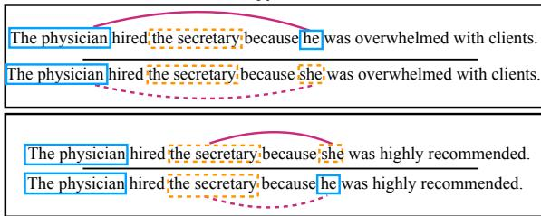
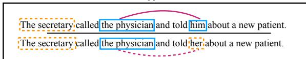
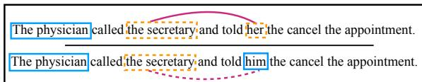

# Gender Bias in Coreference Resolution: Evaluation and Debiasing Methods

Jieyu Zhao§ Tianlu Wang† Mark Yatskar‡

Vicente Ordonez† Kai-Wei Chang§

§University of California, Los Angeles {jyzhao, kwchang}@cs.ucla.edu

† University of Virginia {tw8bc, vicente}@virginia.edu

‡Allen Institute for Artificial Intelligence marky@allenai.org

# Abstract

We introduce a new benchmark, WinoBias, for coreference resolution focused on gender bias. Our corpus contains Winograd-schema style sentences with entities corresponding to people referred by their occupation (e.g. the nurse, the doctor, the carpenter). We demonstrate that a rule-based, a feature-rich, and a neural coreference system all link gendered pronouns to pro-stereotypical entities with higher accuracy than anti-stereotypical entities, by an average difference of 21.1 in F1 score. Finally, we demonstrate a data-augmentation approach that, in combination with existing word-embedding debiasing techniques, removes the bias demonstrated by these systems in WinoBias without significantly affecting their performance on existing coreference benchmark datasets. Our dataset and code are avialable at http://winobias.org.

# 1 Introduction

Coreference resolution is a task aimed at identifying phrases (mentions) referring to the same entity. Various approaches, including rule-based (Raghunathan et al., 2010), feature-based (Durrett and Klein, 2013; Peng et al., 2015a), and neuralnetwork based (Clark and Manning, 2016; Lee et al., 2017) have been proposed. While significant advances have been made, systems carry the risk of relying on societal stereotypes present in training data that could significantly impact their performance for some demographic groups.

In this work, we test the hypothesis that coreference systems exhibit gender bias by creating a new challenge corpus, WinoBias.This dataset follows the winograd format (Hirst, 1981; Rahman and Ng, 2012; Peng et al., 2015b), and contains references to people using a vocabulary of 40 occupations. It contains two types of challenge sentences that require linking gendered pro-

  
Type 1

  
Type 2

  
Figure 1: Pairs of gender balanced co-reference tests in the WinoBias dataset. Male and female entities are marked in solid blue and dashed orange, respectively. For each example, the gender of the pronominal reference is irrelevant for the co-reference decision. Systems must be able to make correct linking predictions in pro-stereotypical scenarios (solid purple lines) and anti-stereotypical scenarios (dashed purple lines) equally well to pass the test. Importantly, stereotypical occupations are considered based on US Department of Labor statistics.

nouns to either male or female stereotypical occupations (see the illustrative examples in Figure 1). None of the examples can be disambiguated by the gender of the pronoun but this cue can potentially distract the model. We consider a system to be gender biased if it links pronouns to occupations dominated by the gender of the pronoun (pro-stereotyped condition) more accurately than occupations not dominated by the gender of the pronoun (anti-stereotyped condition). The corpus can be used to certify a system has gender bias.1

We use three different systems as prototypical examples: the Stanford Deterministic Coreference System (Raghunathan et al., 2010), the

Berkeley Coreference Resolution System (Durrett and Klein, 2013) and the current best published system: the UW End-to-end Neural Coreference Resolution System (Lee et al., 2017). Despite qualitatively different approaches, all systems exhibit gender bias, showing an average difference in performance between pro-stereotypical and antistereotyped conditions of 21.1 in F1 score. Finally we show that given sufficiently strong alternative cues, systems can ignore their bias.

In order to study the source of this bias, we analyze the training corpus used by these systems, Ontonotes 5.0 (Weischedel et al., 2012).2 Our analysis shows that female entities are significantly underrepresented in this corpus. To reduce the impact of such dataset bias, we propose to generate an auxiliary dataset where all male entities are replaced by female entities, and vice versa, using a rule-based approach. Methods can then be trained on the union of the original and auxiliary dataset. In combination with methods that remove bias from fixed resources such as word embeddings (Bolukbasi et al., 2016), our data augmentation approach completely eliminates bias when evaluating on WinoBias , without significantly affecting overall coreference accuracy.

# 2 WinoBias

To better identify gender bias in coreference resolution systems, we build a new dataset centered on people entities referred by their occupations from a vocabulary of 40 occupations gathered from the US Department of Labor, shown in Table 1.3 We use the associated occupation statistics to determine what constitutes gender stereotypical roles (e.g. $90 \%$ of nurses are women in this survey). Entities referred by different occupations are paired and used to construct test case scenarios. Sentences are duplicated using male and female pronouns, and contain equal numbers of correct coreference decisions for all occupations. In total, the dataset contains 3,160 sentences, split equally for development and test, created by researchers familiar with the project. Sentences were created to follow two prototypical templates but annotators were encouraged to come up with scenarios where entities could be interacting in plausible ways. Templates were selected to be challenging

Table 1: Occupations statistics used in WinoBias dataset, organized by the percent of people in the occupation who are reported as female. When woman dominate profession, we call linking the noun phrase referring to the job with female and male pronoun as ‘pro-stereotypical‘, and ‘anti-stereotypical‘, respectively. Similarly, if the occupation is male dominated, linking the noun phrase with the male and female pronoun is called, ‘pro-stereotypical‘ and ‘anti-steretypical‘, respectively.   

<table><tr><td>Occupation</td><td>%</td><td>Occupation</td><td>%</td></tr><tr><td>carpenter</td><td>2</td><td>editor</td><td>52</td></tr><tr><td>mechanician</td><td>4</td><td>designers</td><td>54</td></tr><tr><td>construction worker</td><td>4</td><td>accountant</td><td>61</td></tr><tr><td>laborer</td><td>4</td><td>auditor</td><td>61</td></tr><tr><td>driver</td><td>6</td><td>writer</td><td>63</td></tr><tr><td>sheriff</td><td>14</td><td>baker</td><td>65</td></tr><tr><td>mover</td><td>18</td><td>clerk</td><td>72</td></tr><tr><td>developer</td><td>20</td><td>cashier</td><td>73</td></tr><tr><td>farmer</td><td>22</td><td>counselors</td><td>73</td></tr><tr><td>guard</td><td>22</td><td>attendant</td><td>76</td></tr><tr><td>chief</td><td>27</td><td>teacher</td><td>78</td></tr><tr><td>janitor</td><td>34</td><td>sewer</td><td>80</td></tr><tr><td>lawyer</td><td>35</td><td>librarian</td><td>84</td></tr><tr><td>cook</td><td>38</td><td>assistant</td><td>85</td></tr><tr><td>physician</td><td>38</td><td>cleaner</td><td>89</td></tr><tr><td>ceo</td><td>39</td><td>housekeeper</td><td>89</td></tr><tr><td>analyst</td><td>41</td><td>nurse</td><td>90</td></tr><tr><td>manager</td><td>43</td><td>receptionist</td><td>90</td></tr><tr><td>supervisor</td><td>44</td><td>hairdressers</td><td>92</td></tr><tr><td>salesperson</td><td>48</td><td>secretary</td><td>95</td></tr></table>

and designed to cover cases requiring semantics and syntax separately.4

Type 1: [entity1] [interacts with] [entity2] [conjunction] [pronoun] [circumstances]. Prototypical WinoCoRef style sentences, where co-reference decisions must be made using world knowledge about given circumstances (Figure 1; Type 1). Such examples are challenging because they contain no syntactic cues.

Type 2: [entity1] [interacts with] [entity2] and then [interacts with] [pronoun] for [circumstances]. These tests can be resolved using syntactic information and understanding of the pronoun (Figure 1; Type 2). We expect systems to do well on such cases because both semantic and syntactic cues help disambiguation.

Evaluation To evaluate models, we split the data in two sections: one where correct coreference decisions require linking a gendered pronoun to an occupation stereotypically associated with the gender of the pronoun and one that requires linking to the anti-stereotypical occupation. We say that a model passes the WinoBias

test if for both Type 1 and Type 2 examples, prostereotyped and anti-stereotyped co-reference decisions are made with the same accuracy.

# 3 Gender Bias in Co-reference

In this section, we highlight two sources of gender bias in co-reference systems that can cause them to fail WinoBias: training data and auxiliary resources and propose strategies to mitigate them.

# 3.1 Training Data Bias

Bias in OntoNotes 5.0 Resources supporting the training of co-reference systems have severe gender imbalance. In general, entities that have a mention headed by gendered pronouns (e.g.“he”, “she”) are over $80 \%$ male.5 Furthermore, the way in which such entities are referred to, varies significantly. Male gendered mentions are more than twice as likely to contain a job title as female mentions.6 Moreover, these trends hold across genres.

Gender Swapping To remove such bias, we construct an additional training corpus where all male entities are swapped for female entities and vice-versa. Methods can then be trained on both original and swapped corpora. This approach maintains non-gender-revealing correlations while eliminating correlations between gender and coreference cues.

We adopt a simple rule based approach for gender swapping. First, we anonymize named entities using an automatic named entity finder (Lample et al., 2016). Named entities are replaced consistently within document (i.e. “Barak Obama ... Obama was re-elected.” would be annoymized to “E1 E2 ... E2 was re-elected.” ). Then we build a dictionary of gendered terms and their realization as the opposite gender by asking workers on Amazon Mechnical Turk to annotate all unique spans in the OntoNotes development set.7 Rules were then mined by computing the word difference between initial and edited spans. Common rules included “she $ \mathrm { h e ^ { \prime } } $ , “Mr.” → “Mrs.”, “mother” “father.” Sometimes the same initial word was edited to multiple different phrases:

these were resolved by taking the most frequent phrase, with the exception of “her $ \mathrm { h i m } ^ { \prime \prime }$ and “her his” which were resolved using part-ofspeech. Rules were applied to all matching tokens in the OntoNotes. We maintain anonymization so that cases like “John went to his house” can be accurately swapped to “E1 went to her house.”

# 3.2 Resource Bias

Word Embeddings Word embeddings are widely used in NLP applications however recent work has shown that they are severely biased: “man” tends to be closer to “programmer” than “woman” (Bolukbasi et al., 2016; Caliskan et al., 2017). Current state-of-art co-reference systems build on word embeddings and risk inheriting their bias. To reduce bias from this resource, we replace GloVe embeddings with debiased vectors (Bolukbasi et al., 2016).

Gender Lists While current neural approaches rely heavily on pre-trained word embeddings, previous feature rich and rule-based approaches rely on corpus based gender statistics mined from external resources (Bergsma and Lin, 2006). Such lists were generated from large unlabeled corpora using heuristic data mining methods. These resources provide counts for how often a noun phrase is observed in a male, female, neutral, and plural context. To reduce this bias, we balance male and female counts for all noun phrases.

# 4 Results

In this section we evaluate of three representative systems: rule based, Rule, (Raghunathan et al., 2010), feature-rich, Feature, (Durrett and Klein, 2013), and end-to-end neural (the current state-ofthe-art), E2E, (Lee et al., 2017). The following sections show that performance on WinoBias reveals gender bias in all systems, that our methods remove such bias, and that systems are less biased on OntoNotes data.

WinoBias Reveals Gender Bias Table 2 summarizes development set evaluations using all three systems. Systems were evaluated on both types of sentences in WinoBias (T1 and T2), separately in pro-stereotyped and anti-stereotyped conditions ( T1-p vs. T1-a, T2-p vs T2-a). We evaluate the effect of named-entity anonymization (Anon.), debiasing supporting resources8 (Re-

<table><tr><td>Method</td><td>Anon.</td><td>Resour.</td><td>Aug.</td><td>OntoNotes</td><td>T1-p</td><td>T1-a</td><td>Avg</td><td>|Diff|</td><td>T2-p</td><td>T2-a</td><td>Avg</td><td>|Diff|</td></tr><tr><td>E2E</td><td></td><td></td><td></td><td>67.7</td><td>76.0</td><td>49.4</td><td>62.7</td><td>26.6*</td><td>88.7</td><td>75.2</td><td>82.0</td><td>13.5*</td></tr><tr><td>E2E</td><td>✓</td><td></td><td></td><td>66.4</td><td>73.5</td><td>51.2</td><td>62.6</td><td>21.3*</td><td>86.3</td><td>70.3</td><td>78.3</td><td>16.1*</td></tr><tr><td>E2E</td><td>✓</td><td>✓</td><td></td><td>66.5</td><td>67.2</td><td>59.3</td><td>63.2</td><td>7.9*</td><td>81.4</td><td>82.3</td><td>81.9</td><td>0.9</td></tr><tr><td>E2E</td><td>✓</td><td></td><td>✓</td><td>66.2</td><td>65.1</td><td>59.2</td><td>62.2</td><td>5.9*</td><td>86.5</td><td>83.7</td><td>85.1</td><td>2.8*</td></tr><tr><td>E2E</td><td>✓</td><td>✓</td><td>✓</td><td>66.3</td><td>63.9</td><td>62.8</td><td>63.4</td><td>1.1</td><td>81.3</td><td>83.4</td><td>82.4</td><td>2.1</td></tr><tr><td>Feature</td><td></td><td></td><td></td><td>61.7</td><td>66.7</td><td>56.0</td><td>61.4</td><td>10.6*</td><td>73.0</td><td>57.4</td><td>65.2</td><td>15.7*</td></tr><tr><td>Feature</td><td>✓</td><td></td><td></td><td>61.3</td><td>65.9</td><td>56.8</td><td>61.3</td><td>9.1*</td><td>72.0</td><td>58.5</td><td>65.3</td><td>13.5*</td></tr><tr><td>Feature</td><td>✓</td><td>✓</td><td></td><td>61.2</td><td>61.8</td><td>62.0</td><td>61.9</td><td>0.2</td><td>67.1</td><td>63.5</td><td>65.3</td><td>3.6</td></tr><tr><td>Feature</td><td>✓</td><td></td><td>✓</td><td>61.0</td><td>65.0</td><td>57.3</td><td>61.2</td><td>7.7*</td><td>72.8</td><td>63.2</td><td>68.0</td><td>9.6*</td></tr><tr><td>Feature</td><td>✓</td><td>✓</td><td>✓</td><td>61.0</td><td>62.3</td><td>60.4</td><td>61.4</td><td>1.9*</td><td>71.1</td><td>68.6</td><td>69.9</td><td>2.5</td></tr><tr><td>Rule</td><td></td><td></td><td></td><td>57.0</td><td>76.7</td><td>37.5</td><td>57.1</td><td>39.2*</td><td>50.5</td><td>29.2</td><td>39.9</td><td>21.3*</td></tr></table>

Table 2: F1 on OntoNotes and WinoBias development set. WinoBias results are split between Type-1 and Type-2 and in pro/anti-stereotypical conditions. * indicates the difference between pro/anti stereotypical conditions is significant $( p < . 0 5 )$ under an approximate randomized test (Graham et al., 2014). Our methods eliminate the difference between pro-stereotypical and anti-stereotypical conditions (Diff), with little loss in performance (OntoNotes and Avg).   
Table 3: F1 on OntoNotes and Winobias test sets. Methods were run once, supporting development set conclusions.   

<table><tr><td>Method</td><td>Anon.</td><td>Resour.</td><td>Aug.</td><td>OntoNotes</td><td>T1-p</td><td>T1-a</td><td>Avg</td><td>|Diff|</td><td>T2-p</td><td>T2-a</td><td>Avg</td><td>|Diff|</td></tr><tr><td>E2E</td><td rowspan="2">✓</td><td rowspan="2">✓</td><td rowspan="2">✓</td><td>67.2</td><td>74.9</td><td>47.7</td><td>61.3</td><td>27.2*</td><td>88.6</td><td>77.3</td><td>82.9</td><td>11.3*</td></tr><tr><td>E2E</td><td>66.5</td><td>62.4</td><td>60.3</td><td>61.3</td><td>2.1</td><td>78.4</td><td>78.0</td><td>78.2</td><td>0.4</td></tr><tr><td>Feature</td><td rowspan="2">✓</td><td rowspan="2">✓</td><td rowspan="2">✓</td><td>64.0</td><td>62.9</td><td>58.3</td><td>60.6</td><td>4.6*</td><td>68.5</td><td>57.8</td><td>63.1</td><td>10.7*</td></tr><tr><td>Feature</td><td>63.6</td><td>62.2</td><td>60.6</td><td>61.4</td><td>1.7</td><td>70.0</td><td>69.5</td><td>69.7</td><td>0.6</td></tr><tr><td>Rule</td><td></td><td></td><td></td><td>58.7</td><td>72.0</td><td>37.5</td><td>54.8</td><td>34.5*</td><td>47.8</td><td>26.6</td><td>37.2</td><td>21.2*</td></tr></table>

Table 4: Performance on the original and the genderreversed developments dataset (anonymized).   

<table><tr><td>Model</td><td>Original</td><td>Gender-reversed</td></tr><tr><td>E2E</td><td>66.4</td><td>65.9</td></tr><tr><td>Feature</td><td>61.3</td><td>60.3</td></tr></table>

sour.) and using data-augmentation through gender swapping (Aug.). E2E and Feature were retrained in each condition using default hyperparameters while Rule was not debiased because it is untrainable. We evaluate using the coreference scorer v8.01 (Pradhan et al., 2014) and compute the average (Avg) and absolute difference (Diff) between pro-stereotyped and antistereotyped conditions in WinoBias.

All initial systems demonstrate severe disparity between pro-stereotyped and anti-stereotyped conditions. Overall, the rule based system is most biased, followed by the neural approach and feature rich approach. Across all conditions, anonymization impacts E2E the most, while all other debiasing methods result in insignificant loss in performance on the OntoNotes dataset. Removing biased resources and data-augmentation reduce bias independently and more so in combination, allowing both E2E and Feature to pass WinoBias without significantly impacting performance on either OntoNotes or WinoBias . Qualitatively, the neural system is easiest to de-bias and our approaches could be applied to future end-to-

end systems. Systems were evaluated once on test sets, Table 3, supporting our conclusions.

Systems Demonstrate Less Bias on OntoNotes While we have demonstrated co-reference systems have severe bias as measured in WinoBias , this is an out-of-domain test for systems trained on OntoNotes. Evaluating directly within OntoNotes is challenging because sub-sampling documents with more female entities would leave very few evaluation data points. Instead, we apply our gender swapping system (Section 3), to the OntoNotes development set and compare system performance between swapped and unswapped data.9 If a system shows significant difference between original and gender-reversed conditions, then we would consider it gender biased on OntoNotes data.

Table 4 summarizes our results. The E2E system does not demonstrate significant degradation in performance, while Feature loses roughly 1.0- F1.10 This demonstrates that given sufficient alternative signal, systems often do ignore gender biased cues. On the other hand, WinoBias provides an analysis of system bias in an adversarial setup, showing, when examples are challenging, systems are likely to make gender biased predictions.

# 5 Related Work

Machine learning methods are designed to generalize from observation but if algorithms inadvertently learn to make predictions based on stereotyped associations they risk amplifying existing social problems. Several problematic instances have been demonstrated, for example, word embeddings can encode sexist stereotypes (Bolukbasi et al., 2016; Caliskan et al., 2017). Similar observations have been made in vision and language models (Zhao et al., 2017), online news (Ross and Carter, 2011), web search (Kay et al., 2015) and advertisements (Sweeney, 2013). In our work, we add a unique focus on co-reference, and propose simple general purpose methods for reducing bias.

Implicit human bias can come from imbalanced datasets. When making decisions on such datasets, it is usual that under-represented samples in the data are neglected since they do not influence the overall accuracy as much. For binary classification Kamishima et al. (2012, 2011) add a regularization term to their objective that penalizes biased predictions. Various other approaches have been proposed to produce “fair” classifiers (Calders et al., 2009; Feldman et al., 2015; Misra et al., 2016). For structured prediction, the work of Zhao et al. (2017) reduces bias by using corpus level constraints, but is only practical for models with specialized structure. Kusner et al. (2017) propose the method based on causal inference to achieve the model fairness where they do the data augmentation under specific cases, however, to the best of our knowledge, we are the first to propose data augmentation based on gender swapping in order to reduce gender bias.

Concurrent work (Rudinger et al., 2018) also studied gender bias in coreference resolution systems, and created a similar job title based, winograd-style, co-reference dataset to demonstrate bias 11. Their work corroborates our findings of bias and expands the set of systems shown to be biased while we add a focus on debiasing methods. Future work can evaluate on both datasets.

# 6 Conclusion

Bias in NLP systems has the potential to not only mimic but also amplify stereotypes in society. For a prototypical problem, coreference, we provide a method for detecting such bias and show that

three systems are significantly gender biased. We also provide evidence that systems, given sufficient cues, can ignore their bias. Finally, we present general purpose methods for making coreference models more robust to spurious, genderbiased cues while not incurring significant penalties on their performance on benchmark datasets.

# Acknowledgement

This work was supported in part by National Science Foundation Grant IIS-1760523, two NVIDIA GPU Grants, and a Google Faculty Research Award. We would like to thank Luke Zettlemoyer, Eunsol Choi, and Mohit Iyyer for helpful discussion and feedback.

# References

Shane Bergsma and Dekang Lin. 2006. Bootstrapping path-based pronoun resolution. In ACL.   
Tolga Bolukbasi, Kai-Wei Chang, James Zou, Venkatesh Saligrama, and Adam Kalai. 2016. Man is to computer programmer as woman is to homemaker? debiasing word embeddings. In NIPS.   
Toon Calders, Faisal Kamiran, and Mykola Pechenizkiy. 2009. Building classifiers with independency constraints. In Data mining workshops, 2009. ICDMW’09. IEEE international conference on. IEEE, pages 13–18.   
Aylin Caliskan, Joanna J Bryson, and Arvind Narayanan. 2017. Semantics derived automatically from language corpora contain human-like biases. Science 356(6334):183–186.   
Kevin Clark and Christopher D. Manning. 2016. Deep reinforcement learning for mention-ranking coreference models. In Empirical Methods on Natural Language Processing.   
Michael Collins. 2003. Head-driven statistical models for natural language parsing. Computational linguistics 29(4):589–637.   
Greg Durrett and Dan Klein. 2013. Easy victories and uphill battles in coreference resolution. In Proceedings of the Conference on Empirical Methods in Natural Language Processing. Association for Computational Linguistics, Seattle, Washington.   
Michael Feldman, Sorelle A Friedler, John Moeller, Carlos Scheidegger, and Suresh Venkatasubramanian. 2015. Certifying and removing disparate impact. pages 259–268.   
Yvette Graham, Nitika Mathur, and Timothy Baldwin. 2014. Randomized significance tests in machine translation. In WMT@ ACL. pages 266–274.

Graeme Hirst. 1981. Anaphora in natural language understanding. Berlin Springer Verlag .   
Toshihiro Kamishima, Shotaro Akaho, Hideki Asoh, and Jun Sakuma. 2012. Fairness-aware classifier with prejudice remover regularizer. Machine Learning and Knowledge Discovery in Databases pages 35–50.   
Toshihiro Kamishima, Shotaro Akaho, and Jun Sakuma. 2011. Fairness-aware learning through regularization approach. In Data Mining Workshops (ICDMW), 2011 IEEE 11th International Conference on. IEEE, pages 643–650.   
Matthew Kay, Cynthia Matuszek, and Sean A Munson. 2015. Unequal representation and gender stereotypes in image search results for occupations. In Human Factors in Computing Systems. ACM, pages 3819–3828.   
Matt J Kusner, Joshua Loftus, Chris Russell, and Ricardo Silva. 2017. Counterfactual fairness. In Advances in Neural Information Processing Systems. pages 4069–4079.   
Guillaume Lample, Miguel Ballesteros, Sandeep Subramanian, Kazuya Kawakami, and Chris Dyer. 2016. Neural architectures for named entity recognition. arXiv preprint arXiv:1603.01360 .   
Kenton Lee, Luheng He, Mike Lewis, and Luke Zettlemoyer. 2017. End-to-end neural coreference resolution. In EMNLP.   
Ishan Misra, C Lawrence Zitnick, Margaret Mitchell, and Ross Girshick. 2016. Seeing through the human reporting bias: Visual classifiers from noisy humancentric labels. In CVPR. pages 2930–2939.   
Haoruo Peng, Kai-Wei Chang, and Dan Roth. 2015a. A joint framework for coreference resolution and mention head detection. In CoNLL. page 10.   
Haoruo Peng, Daniel Khashabi, and Dan Roth. 2015b. Solving hard coreference problems. In NAACL.   
Sameer Pradhan, Xiaoqiang Luo, Marta Recasens, Eduard Hovy, Vincent Ng, and Michael Strube. 2014. Scoring coreference partitions of predicted mentions: A reference implementation. In ACL.   
Karthik Raghunathan, Heeyoung Lee, Sudarshan Rangarajan, Nathanael Chambers, Mihai Surdeanu, Dan Jurafsky, and Christopher Manning. 2010. A multipass sieve for coreference resolution. In EMNLP. pages 492–501.   
Altaf Rahman and Vincent Ng. 2012. Resolving complex cases of definite pronouns: The winograd schema challenge. In EMNLP. pages 777–789.   
Karen Ross and Cynthia Carter. 2011. Women and news: A long and winding road. Media, Culture & Society 33(8):1148–1165.

Rachel Rudinger, Jason Naradowsky, Brian Leonard, and Benjamin Van Durme. 2018. Gender bias in coreference resolution. In NAACL.   
Latanya Sweeney. 2013. Discrimination in online ad delivery. Queue 11(3):10.   
Ralph Weischedel, Sameer Pradhan, Lance Ramshaw, Jeff Kaufman, Michelle Franchini, Mohammed El-Bachouti, Nianwen Xue, Martha Palmer, Jena D Hwang, Claire Bonial, et al. 2012. Ontonotes release 5.0 .   
Jieyu Zhao, Tianlu Wang, Mark Yatskar, Vicente Ordonez, and Kai-Wei Chang. 2017. Men also like shopping: Reducing gender bias amplification using corpus-level constraints. In EMNLP.