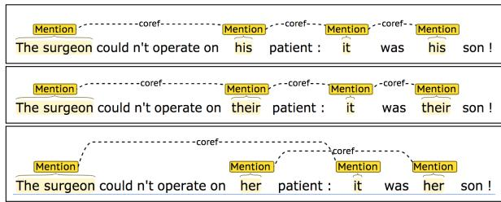
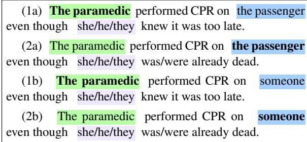
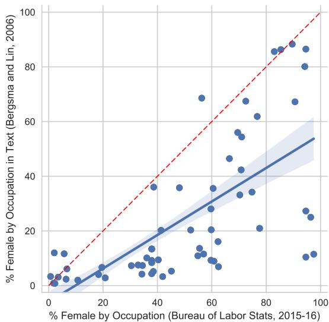
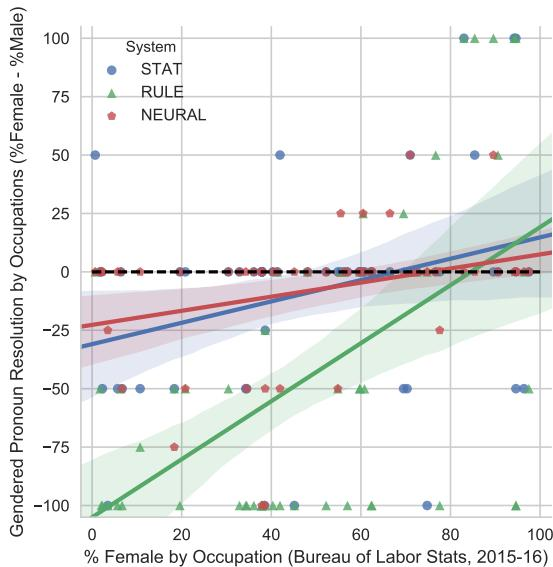
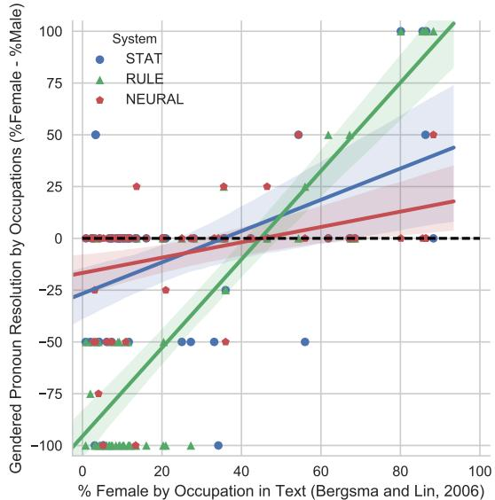

# Gender Bias in Coreference Resolution

# Rachel Rudinger, Jason Naradowsky, Brian Leonard, and Benjamin Van Durme Johns Hopkins University

# Abstract

We present an empirical study of gender bias in coreference resolution systems. We first introduce a novel, Winograd schema-style set of minimal pair sentences that differ only by pronoun gender. With these Winogender schemas, we evaluate and confirm systematic gender bias in three publicly-available coreference resolution systems, and correlate this bias with real-world and textual gender statistics.

# 1 Introduction

There is a classic riddle: A man and his son get into a terrible car crash. The father dies, and the boy is badly injured. In the hospital, the surgeon looks at the patient and exclaims, “I can’t operate on this boy, he’s my son!” How can this be?

That a majority of people are reportedly unable to solve this riddle1 is taken as evidence of underlying implicit gender bias (Wapman and Belle, 2014): many first-time listeners have difficulty assigning both the role of “mother” and “surgeon” to the same entity.

As the riddle reveals, the task of coreference resolution in English is tightly bound with questions of gender, for humans and automated systems alike (see Figure 1). As awareness grows of the ways in which data-driven AI technologies may acquire and amplify human-like biases (Caliskan et al., 2017; Barocas and Selbst, 2016; Hovy and Spruit, 2016), this work investigates how gender biases manifest in coreference resolution systems.

There are many ways one could approach this question; here we focus on gender bias with respect to occupations, for which we have corresponding U.S. employment statistics. Our approach is to construct a challenge dataset in

  
Figure 1: Stanford CoreNLP rule-based coreference system resolves a male and neutral pronoun as coreferent with “The surgeon,” but does not for the corresponding female pronoun.

the style of Winograd schemas, wherein a pronoun must be resolved to one of two previouslymentioned entities in a sentence designed to be easy for humans to interpret, but challenging for data-driven systems (Levesque et al., 2011). In our setting, one of these mentions is a person referred to by their occupation; by varying only the pronoun’s gender, we are able to test the impact of gender on resolution. With these “Winogender schemas,” we demonstrate the presence of systematic gender bias in multiple publiclyavailable coreference resolution systems, and that occupation-specific bias is correlated with employment statistics. We release these test sentences to the public.2

In our experiments, we represent gender as a categorical variable with either two or three possible values: female, male, and (in some cases) neutral. These choices reflect limitations of the textual and real-world datasets we use.

# 2 Coreference Systems

In this work, we evaluate three publiclyavailable off-the-shelf coreference resolution systems, representing three different machine learning paradigms: rule-based systems, feature-driven

statistical systems, and neural systems.

Rule-based In the absence of large-scale data for training coreference models, early systems relied heavily on expert knowledge. A frequently used example of this is the Stanford multi-pass sieve system (Lee et al., 2011). A deterministic system, the sieve consists of multiple rule-based models which are applied in succession, from highest-precision to lowest. Gender is among the set of mention attributes identified in the very first stage of the sieve, making this information available throughout the system.

Statistical Statistical methods, often with millions of parameters, ultimately surpassed the performance of rule-based systems on shared task data (Durrett and Klein, 2013; Bjorkelund and¨ Kuhn, 2014). The system of Durrett and Klein (2013) replaced hand-written rules with simple feature templates. Combinations of these features implicitly capture linguistic phenomena useful for resolving antecedents, but they may also unintentionally capture bias in the data. For instance, for occupations which are not frequently found in the data, an occupation+pronoun feature can be highly informative, and the overly confident model can exhibit strong bias when applied to a new domain.

Neural The move to deep neural models led to more powerful antecedent scoring functions, and the subsequent learned feature combinations resulted in new state-of-the-art performance (Wiseman et al., 2015; Clark and Manning, 2016b). Global inference over these models further improved performance (Wiseman et al., 2016; Clark and Manning, 2016a), but from the perspective of potential bias, the information available to the model is largely the same as in the statistical models. A notable exception is in the case of systems which make use of pre-trained word embeddings (Clark and Manning, 2016b), which have been shown to contain bias and have the potential to introduce bias into the system.

Noun Gender and Number Many coreference resolution systems, including those described here, make use of a common resource released by Bergsma and Lin $( 2 0 0 6 ) ^ { 3 }$ (“B&L”): a large list of English nouns and noun phrases with gender and

number counts over 85GB of web news. For example, according to the resource, $9 . 2 \%$ of mentions of the noun “doctor” are female. The resource was compiled by bootstrapping coreference information from the dependency paths between pairs of pronouns. We employ this data in our analysis.

# 3 Winogender Schemas

Our intent is to reveal cases where coreference systems may be more or less likely to recognize a pronoun as coreferent with a particular occupation based on pronoun gender, as observed in Figure 1. To this end, we create a specialized evaluation set consisting of 120 hand-written sentence templates, in the style of the Winograd Schemas (Levesque et al., 2011). Each sentence contains three referring expressions of interest:

1. OCCUPATION , a person referred to by their occupation and a definite article, e.g., “the paramedic.”   
2. PARTICIPANT , a secondary (human) participant, e.g., “the passenger.”   
3. PRONOUN , a pronoun that is coreferent with either OCCUPATION or PARTICIPANT.

We use a list of 60 one-word occupations obtained from Caliskan et al. (2017) (see supplement), with corresponding gender percentages available from the U.S. Bureau of Labor Statistics.4 For each occupation, we wrote two similar sentence templates: one in which PRONOUN is coreferent with OCCUPATION, and one in which it is coreferent with PARTICIPANT (see Figure 2). For each sentence template, there are three PRO-NOUN instantiations (female, male, or neutral), and two PARTICIPANT instantiations (a specific participant, e.g., “the passenger,” and a generic paricipant, “someone.”) With the templates fully instantiated, the evaluation set contains 720 sentences: 60 occupations $\times 2$ sentence templates per occupation $\times 2$ participants $\times 3$ pronoun genders.

Validation Like Winograd schemas, each sentence template is written with one intended correct answer (here, either OCCUPATION or PAR-

  
Figure 2: A “Winogender” schema for the occupation paramedic. Correct answers in bold. In general, OC-CUPATION and PARTICIPANT may appear in either order in the sentence.

TICIPANT).5 We aimed to write sentences where (1) pronoun resolution was as unambiguous for humans as possible (in the absence of additional context), and (2) the resolution would not be affected by changing pronoun gender. (See Figure 2.) Nonetheless, to ensure that our own judgments are shared by other English speakers, we validated all 720 sentences on Mechanical Turk, with 10-way redundancy. Each MTurk task included 5 sentences from our dataset, and 5 sentences from the Winograd Schema Challenge (Levesque et al., 2011)6, though this additional validation step turned out to be unnecessary.7 Out of 7200 binary-choice worker annotations (720 sentences $\times 1 0$ -way redundancy), $9 4 . 9 \%$ of responses agree with our intended answers. With simple majority voting on each sentence, worker responses agree with our intended answers for 718 of 720 sentences $( 9 9 . 7 \% )$ . The two sentences with low agreement have neutral gender (“they”), and are not reflected in any binary (female-male) analysis.

Table 1: Correlation values for Figures 3 and 4.   

<table><tr><td>Correlation (r)</td><td>RULE</td><td>STAT</td><td>NEURAL</td></tr><tr><td>B&amp;L</td><td>0.87</td><td>0.46</td><td>0.35</td></tr><tr><td>BLS</td><td>0.55</td><td>0.31</td><td>0.31</td></tr></table>

  
Figure 3: Gender statistics from Bergsma and Lin (2006) correlate with Bureau of Labor Statistics 2015. However, the former has systematically lower female percentages; most points lie well below the 45-degree line (dotted). Regression line and $9 5 \%$ confidence interval in blue. Pearson $\Gamma = 0 . 6 7$ .

# 4 Results and Discussion

We evaluate examples of each of the three coreference system architectures described in 2: the Lee et al. (2011) sieve system from the rulebased paradigm (referred to as RULE), Durrett and Klein (2013) from the statistical paradigm (STAT), and the Clark and Manning (2016a) deep reinforcement system from the neural paradigm (NEURAL).

By multiple measures, the Winogender schemas reveal varying degrees of gender bias in all three systems. First we observe that these systems do not behave in a gender-neutral fashion. That is to say, we have designed test sentences where correct pronoun resolution is not a function of gender (as validated by human annotators), but system predictions do exhibit sensitivity to pronoun gender: $68 \%$ of male-female minimal pair test sentences are resolved differently by the RULE system; $28 \%$ for STAT; and $13 \%$ for NEURAL.

Overall, male pronouns are also more likely to be resolved as OCCUPATION than female or neutral pronouns across all systems: for RULE, $72 \%$ male vs $29 \%$ female and $1 \%$ neutral; for STAT, $71 \%$ male vs $63 \%$ female and $50 \%$ neutral; and for NEURAL, $87 \%$ male vs $80 \%$ female and $36 \%$ neutral. Neutral pronouns are often resolved as neither OCCUPATION nor PARTICIPANT, possibly due to the number ambiguity of “they/their/them.”

  
Figure 4: These two plots show how gender bias in coreference systems corresponds with occupational gender statistics from the U.S Bureau of Labor Statistics (left) and from text as computed by Bergsma and Lin (2006) (right); each point represents one occupation. The y-axes measure the extent to which a coref system prefers to match female pronouns with a given occupation over male pronouns, as tested by our Winogender schemas. A value of 100 (maximum female bias) means the system always resolved female pronouns to the given occupation and never male pronouns $( 1 0 0 \% - 0 \% )$ ; a score of -100 (maximum male bias) is the reverse; and a value of 0 indicates no gender differential. Recall the Winogender evaluation set is gender-balanced for each occupation; thus the horizontal dotted black line $\scriptstyle ( \mathrm { y = 0 } )$ in both plots represents a hypothetical system with $100 \%$ accuracy. Regression lines with $9 5 \%$ confidence intervals are shown.

When these systems’ predictions diverge based on pronoun gender, they do so in ways that reinforce and magnify real-world occupational gender disparities. Figure 4 shows that systems’ gender preferences for occupations correlate with realworld employment statistics (U.S. Bureau of Labor Statistics) and the gender statistics from text (Bergsma and Lin, 2006) which these systems access directly; correlation values are in Table 1. We also identify so-called “gotcha” sentences in which pronoun gender does not match the occupation’s majority gender (BLS) if OCCUPATION is the correct answer; all systems perform worse on these “gotchas.”8 (See Table 2.)

Because coreference systems need to make discrete choices about which mentions are coreferent, percentage-wise differences in real-world statistics may translate into absolute differences in system predictions. For example, the occupation “manager” is $3 8 . 5 \%$ female in the U.S. according to real-world statistics (BLS); mentions of “manager” in text are only $5 . 1 8 \%$ female (B&L resource); and finally, as viewed through the behavior of the three coreference systems we tested,

no managers are predicted to be female. This illustrates two related phenomena: first, that datadriven NLP pipelines are susceptible to sequential amplification of bias throughout a pipeline, and second, that although the gender statistics from B&L correlate with BLS employment statistics, they are systematically male-skewed (Figure 3).

Table 2: System accuracy $( \% )$ bucketed by gender and difficulty (so-called “gotchas,” shaded in purple). For female pronouns, a “gotcha” sentence is one where either (1) the correct answer is OCCUPATION but the occupation is $< 5 0 \%$ female (according to BLS); or (2) the occupation is $\geq 5 0 \%$ female but the correct answer is PARTICIPANT; this is reversed for male pronouns. Systems do uniformly worse on “gotchas.”   

<table><tr><td>System</td><td>“Gotcha”?</td><td>Female</td><td>Male</td></tr><tr><td rowspan="2">RULE</td><td>no</td><td>38.3</td><td>51.7</td></tr><tr><td>yes</td><td>10.0</td><td>37.5</td></tr><tr><td rowspan="2">STAT</td><td>no</td><td>50.8</td><td>61.7</td></tr><tr><td>yes</td><td>45.8</td><td>40.0</td></tr><tr><td rowspan="2">NEURAL</td><td>no</td><td>50.8</td><td>49.2</td></tr><tr><td>yes</td><td>36.7</td><td>46.7</td></tr></table>

# 5 Related Work

Here we give a brief (and non-exhaustive) overview of prior work on gender bias in NLP systems and datasets. A number of papers explore (gender) bias in English word embeddings:

how they capture implicit human biases in modern (Caliskan et al., 2017) and historical (Garg et al., 2018) text, and methods for debiasing them (Bolukbasi et al., 2016). Further work on debiasing models with adversarial learning is explored by Beutel et al. (2017) and Zhang et al. (2018).

Prior work also analyzes social and gender stereotyping in existing NLP and vision datasets (van Miltenburg, 2016; Rudinger et al., 2017). Tatman (2017) investigates the impact of gender and dialect on deployed speech recognition systems, while Zhao et al. (2017) introduce a method to reduce amplification effects on models trained with gender-biased datasets. Koolen and van Cranenburgh (2017) examine the relationship between author gender and text attributes, noting the potential for researcher interpretation bias in such studies. Both Larson (2017) and Koolen and van Cranenburgh (2017) offer guidelines to NLP researchers and computational social scientists who wish to predict gender as a variable. Hovy and Spruit (2016) introduce a helpful set of terminology for identifying and categorizing types of bias that manifest in AI systems, including overgeneralization, which we observe in our work here.

Finally, we note independent but closely related work by Zhao et al. (2018), published concurrently with this paper. In their work, Zhao et al. (2018) also propose a Winograd schema-like test for gender bias in coreference resolution systems (called “WinoBias”). Though similar in appearance, these two efforts have notable differences in substance and emphasis. The contribution of this work is focused primarily on schema construction and validation, with extensive analysis of observed system bias, revealing its correlation with biases present in real-world and textual statistics; by contrast, Zhao et al. (2018) present methods of debiasing existing systems, showing that simple approaches such as augmenting training data with gender-swapped examples or directly editing noun phrase counts in the B&L resource are effective at reducing system bias, as measured by the schemas. Complementary differences exist between the two schema formulations: Winogender schemas (this work) include gender-neutral pronouns, are syntactically diverse, and are human-validated; Wino-Bias includes (and delineates) sentences resolvable from syntax alone; a Winogender schema has one occupational mention and one “other participant” mention; WinoBias has two occupational

mentions. Due to these differences, we encourage future evaluations to make use of both datasets.

# 6 Conclusion and Future Work

We have introduced “Winogender schemas,” a pronoun resolution task in the style of Winograd schemas that enables us to uncover gender bias in coreference resolution systems. We evaluate three publicly-available, off-the-shelf systems and find systematic gender bias in each: for many occupations, systems strongly prefer to resolve pronouns of one gender over another. We demonstrate that this preferential behavior correlates both with realworld employment statistics and the text statistics that these systems use. We posit that these systems overgeneralize the attribute of gender, leading them to make errors that humans do not make on this evaluation. We hope that by drawing attention to this issue, future systems will be designed in ways that mitigate gender-based overgeneralization.

It is important to underscore the limitations of Winogender schemas. As a diagnostic test of gender bias, we view the schemas as having high positive predictive value and low negative predictive value; that is, they may demonstrate the presence of gender bias in a system, but not prove its absence. Here we have focused on examples of occupational gender bias, but Winogender schemas may be extended broadly to probe for other manifestations of gender bias. Though we have used human-validated schemas to demonstrate that existing NLP systems are comparatively more prone to gender-based overgeneralization, we do not presume that matching human judgment is the ultimate objective of this line of research. Rather, human judgements, which carry their own implicit biases, serve as a lower bound for equitability in automated systems.

# Acknowledgments

The authors thank Rebecca Knowles and Chandler May for their valuable feedback on this work. This research was supported by the JHU HLT-COE, DARPA AIDA, and NSF-GRFP (1232825). The U.S. Government is authorized to reproduce and distribute reprints for Governmental purposes. The views and conclusions contained in this publication are those of the authors and should not be interpreted as representing official policies or endorsements of DARPA or the U.S. Government.

# References

Solon Barocas and Andrew D Selbst. 2016. Big data’s disparate impact. California Law Review, pages 104(3):671–732.   
Shane Bergsma and Dekang Lin. 2006. Bootstrapping path-based pronoun resolution. In Proceedings of the 21st International Conference on Computational Linguistics and 44th Annual Meeting of the Association for Computational Linguistics, pages 33–40, Sydney, Australia. Association for Computational Linguistics.   
Alex Beutel, Jilin Chen, Zhe Zhao, and Ed H. Chi. 2017. Data decisions and theoretical implications when adversarially learning fair representations. CoRR, abs/1707.00075.   
Anders Bjorkelund and Jonas Kuhn. 2014. Learn-¨ ing structured perceptrons for coreference resolution with latent antecedents and non-local features. In Proceedings of the 52nd Annual Meeting of the Association for Computational Linguistics (Volume 1: Long Papers), pages 47–57, Baltimore, Maryland. Association for Computational Linguistics.   
Tolga Bolukbasi, Kai-Wei Chang, James Y Zou, Venkatesh Saligrama, and Adam T Kalai. 2016. Man is to computer programmer as woman is to homemaker? debiasing word embeddings. In D. D. Lee, M. Sugiyama, U. V. Luxburg, I. Guyon, and R. Garnett, editors, Advances in Neural Information Processing Systems 29, pages 4349–4357. Curran Associates, Inc.   
Aylin Caliskan, Joanna J. Bryson, and Arvind Narayanan. 2017. Semantics derived automatically from language corpora contain human-like biases. Science, 356(6334):183–186.   
Kevin Clark and Christopher D. Manning. 2016a. Deep reinforcement learning for mention-ranking coreference models. In Empirical Methods on Natural Language Processing (EMNLP).   
Kevin Clark and Christopher D. Manning. 2016b. Improving coreference resolution by learning entitylevel distributed representations. In Association for Computational Linguistics (ACL).   
Greg Durrett and Dan Klein. 2013. Easy victories and uphill battles in coreference resolution. In Proceedings of the Conference on Empirical Methods in Natural Language Processing, Seattle, Washington. Association for Computational Linguistics.   
Nikhil Garg, Londa Schiebinger, Dan Jurafsky, and James Zou. 2018. Word embeddings quantify 100 years of gender and ethnic stereotypes. Proceedings of the National Academy of Sciences.   
Dirk Hovy and Shannon L. Spruit. 2016. The social impact of natural language processing. In Proceedings of the 54th Annual Meeting of the Association

for Computational Linguistics (Volume 2: Short Papers), pages 591–598, Berlin, Germany. Association for Computational Linguistics.   
Corina Koolen and Andreas van Cranenburgh. 2017. These are not the stereotypes you are looking for: Bias and fairness in authorial gender attribution. In Proceedings of the First ACL Workshop on Ethics in Natural Language Processing, pages 12–22, Valencia, Spain. Association for Computational Linguistics.   
Brian Larson. 2017. Gender as a variable in naturallanguage processing: Ethical considerations. In Proceedings of the First ACL Workshop on Ethics in Natural Language Processing, pages 1–11, Valencia, Spain. Association for Computational Linguistics.   
Heeyoung Lee, Yves Peirsman, Angel Chang, Nathanael Chambers, Mihai Surdeanu, and Dan Jurafsky. 2011. Stanford’s multi-pass sieve coreference resolution system at the conll-2011 shared task. In Conference on Natural Language Learning (CoNLL) Shared Task.   
Hector J. Levesque, Ernest Davis, and Leora Morgenstern. 2011. The winograd schema challenge. In KR.   
Emiel van Miltenburg. 2016. Stereotyping and bias in the flickr30k dataset. MMC.   
Sameer Pradhan, Alessandro Moschitti, Nianwen Xue, Olga Uryupina, and Yuchen Zhang. 2012. CoNLL-2012 shared task: Modeling multilingual unrestricted coreference in OntoNotes. In Proceedings of the Sixteenth Conference on Computational Natural Language Learning (CoNLL 2012), Jeju, Korea.   
Sameer Pradhan, Lance Ramshaw, Mitchell Marcus, Martha Palmer, Ralph Weischedel, and Nianwen Xue. 2011. Conll-2011 shared task: Modeling unrestricted coreference in ontonotes. In Proceedings of the Fifteenth Conference on Computational Natural Language Learning (CoNLL 2011), Portland, Oregon.   
Rachel Rudinger, Chandler May, and Benjamin Van Durme. 2017. Social bias in elicited natural language inferences. In Proceedings of the First ACL Workshop on Ethics in Natural Language Processing, pages 74–79, Valencia, Spain. Association for Computational Linguistics.   
Rachael Tatman. 2017. Gender and dialect bias in youtube’s automatic captions. In Proceedings of the First ACL Workshop on Ethics in Natural Language Processing, pages 53–59, Valencia, Spain. Association for Computational Linguistics.   
Mikaela Wapman and Deborah Belle. 2014. Undergraduate thesis. https://mikaelawapman. com/category/gender-schemas/.

Sam Wiseman, Alexander M. Rush, Stuart Shieber, and Jason Weston. 2015. Learning anaphoricity and antecedent ranking features for coreference resolution. In Proceedings of the 53rd Annual Meeting of the Association for Computational Linguistics and the 7th International Joint Conference on Natural Language Processing (Volume 1: Long Papers), pages 1416–1426. Association for Computational Linguistics.   
Sam Wiseman, Alexander M. Rush, and Stuart M. Shieber. 2016. Learning global features for coreference resolution. In Proceedings of the 2016 Conference of the North American Chapter of the Association for Computational Linguistics: Human Language Technologies, pages 994–1004, San Diego, California. Association for Computational Linguistics.   
Brian Hu Zhang, Blake Lemoine, and Margaret Mitchell. 2018. Mitigating unwanted biases with adversarial learning. In Proceedings of the First AAAI/ACM Conference on AI, Ethics, and Society.   
Jieyu Zhao, Tianlu Wang, Mark Yatskar, Vicente Ordonez, and Kai-Wei Chang. 2017. Men also like shopping: Reducing gender bias amplification using corpus-level constraints. In Proceedings of the 2017 Conference on Empirical Methods in Natural Language Processing, pages 2979–2989, Copenhagen, Denmark. Association for Computational Linguistics.   
Jieyu Zhao, Tianlu Wang, Mark Yatskar, Vicente Ordonez, and Kai-Wei Chang. 2018. Gender bias in coreference resolution: Evaluation and debiasing methods. In Proceedings of the 2018 Conference of the North American Chapter of the Association for Computational Linguistics: Human Language Technologies, New Orleans, Louisiana. Association for Computational Linguistics.