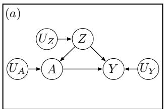
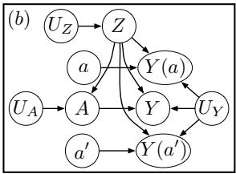
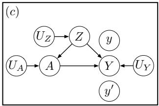
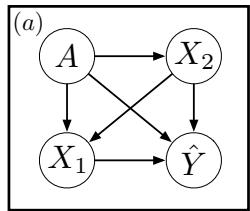
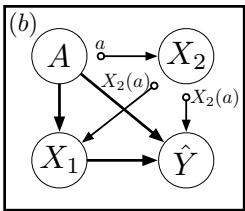

# Causal Reasoning for Algorithmic Fairness

Joshua R. Loftus1, Chris Russell $^ { 2 , 5 }$ , Matt J. Kusner $^ { 3 , 5 }$ , and Ricardo Silva $^ { 4 , 5 }$

$^ { 1 }$ New York University $2$ University of Surrey $^ 3$ University of Warwick

$^ 4$ University College London 5Alan Turing Institute

# Abstract

In this work, we argue for the importance of causal reasoning in creating fair algorithms for decision making. We give a review of existing approaches to fairness, describe work in causality necessary for the understanding of causal approaches, argue why causality is necessary for any approach that wishes to be fair, and give a detailed analysis of the many recent approaches to causality-based fairness.

# 1 Introduction

The success of machine learning algorithms has created a wave of excitement about the problems they could be used to solve. Already we have algorithms that match or outperform humans in non-trivial tasks such as image classification [18], the game of Go [37], and skin cancer classification [15]. This has spurred the use of machine learning algorithms in predictive policing [25], in loan lending [17], and to predict whether released people from jail will re-offend [9]. In these life-changing settings however, it has quickly become clear that machine learning algorithms can unwittingly perpetuate or create discriminatory decisions that are biased against certain individuals (for example, against a particular race, gender, sexual orientation, or other protected attributes). Specifically, such biases have already been demonstrated in natural language processing systems [5] (where algorithms associate men with technical occupations like ‘computer programmer’ and women with domestic occupations like ‘homemaker’), and in online advertising [41] (where Google showed advertisements suggesting that a person had been arrested when that person had a name more often associated with black individuals).

As machine learning is deployed in an increasingly wide range of human scenarios, it is more important than ever to understand what biases are present in a decision making system, and what constraints we can put in place to guarantee that a learnt system never exhibits such biases. Research into these problems is referred to as algorithmic fairness. It is a particularly challenging area of research for two reasons: many different features are intrinsically linked to protected classes such as race or gender. For example, in many scenarios, knowledge

of someone’s address makes it easy to predict their race with relatively high accuracy; while their choice of vocabulary might reveal much about their upbringing or gender. As such it is to easy to accidentally create algorithms that make decisions without knowledge of a persons race or gender, but still exhibit a racial or gender bias. The second issue is more challenging still, there is fundamental disagreement in the field as to what algorithmic fairness really means. Should algorithms be fair if they always make similar decisions for similar individuals? Should we instead call algorithms that make beneficial decisions for all genders at roughly the same rate fair? Or should we use a third different criteria? This question is of fundamental importance as many of these different criteria can not be satisfied at the same time [22].

In this work we argue that it is important to understand where these sources of bias come from in order to rectify them, and that causal reasoning is a powerful tool for doing this. We review existing notions of fairness in prediction problems; the tools of causal reasoning; and show how these can be combined together using techniques such as counterfactual fairness [23].

# 2 Current Work in Algorithmic Fairness

To discuss the existing measures of fairness, we use capital letters to refer to variables and lower case letters to refer to a value a variable takes. For example, we will always use $A$ for a protected attribute such as gender, and $a$ or $a ^ { \prime }$ to refer to the different values the attribute can take such as man or woman. We use $Y$ to refer to the true state of a variable we wish to predict, for example the variable might denote whether a person defaults on a loan or if they will violate parole conditions. We will use $\hat { Y }$ to denote our prediction of the true variable $Y$ . The majority of definitions of fairness in prediction problems are statements about probability of a particular prediction occurring given that some prior conditions hold. In what follows, we will use $P ( \cdot \mid \cdot )$ to represent either conditional probability of events, probability mass functions or density functions, as required by the context.

# 2.0.1 Equalised Odds

Two definitions of fairness that have received much attention are equalised odds and calibration. Both were heavily used in the ProPublica investigation into Northpointe’s COMPAS score, designed to gauge the propensity of a prisoner to re-offend upon release [16]. The first measure is equalised odds, which says that if a person truly has state $y$ , the classifier will predict this at the same rate regardless of the value of their protected attribute. This can be written as an equation in the following form:

$$
P (\hat {Y} = y \mid A = a, Y = y) = P (\hat {Y} = y \mid A = a ^ {\prime}, Y = y) \tag {1}
$$

for all $y , a , a ^ { \prime }$ . Another way of stating this property is by saying that $\hat { Y }$ is independent of $A$ given $Y$ , which we will denote by $\hat { Y } \perp \perp A \mid Y$ .

# 2.0.2 Calibration

The second condition is referred to as calibration (or ‘test fairness’ in [9]). This reverses the previous condition of equalised odds, and says that if the classifier predicts that a person has state $y$ , their probability of actually having state $y$ should be the same for all choices of attribute.

$$
P (Y = y \mid A = a, \hat {Y} = y) = P (Y = y \mid A = a ^ {\prime}, \hat {Y} = y) \tag {2}
$$

for all choices of $y , a$ , and $a ^ { \prime }$ , that is, $Y \perp \perp A \mid \hat { Y }$ .

Although the two measures sound very similar, they are fundamentally incompatible. These two measures achieved some notoriety when Propublica showed that Northpointe’s COMPAS score violated equalised odds, accusing them of racial discrimination. In response, Northpointe claimed that their COMPAS score satisfied calibration and that they did not discriminate. Kleinberg et al. [22] and Chouldechova [8] showed that both conditions cannot be satisfied at the same time except in special cases such as zero prediction error or if $Y \perp \perp A$ .

The use of calibration and equalised odds has another major limitation. If $Y$ 6⊥⊥ $A$ , the true scores $Y$ typically have some inherent bias. This happens, for example, if the police are more likely to unfairly decide that minorities are violating their parole. The definitions of calibration or equalised odds do not explicitly forbid the classifier from preserving an existing bias.

# 2.0.3 Demographic Parity/Disparate Impact

Perhaps the most common non-causal notion of fairness is demographic parity, defined as follows:

$$
P (\hat {Y} = y \mid A = a) = P (\hat {Y} = y \mid A = a ^ {\prime}), \tag {3}
$$

for all $y , a , a ^ { \prime }$ , that is, $\hat { Y } \perp \perp A$ . If unsatisfied, this notion is also referred to as disparate impact. Demographic parity has been used, for several purposes, in the following works: [14, 19, 20, 24, 42, 43].

Satisfying demographic parity can often require positive discrimination, where certain individuals who are otherwise very similar are treated differently due to having different protected attributes. Such disparate treatment can violate other intuitive notions of fairness or equality, contradict equalised odds or calibration, and in some cases is prohibited by law.

# 2.0.4 Individual Fairness

Dwork et al. [12] proposed the concept of individual fairness as follows.

$$
P \left(\hat {Y} ^ {(i)} = y \mid X ^ {(i)}, A ^ {(i)}\right) \approx P \left(\hat {Y} ^ {(j)} = y \mid X ^ {(j)}, A ^ {(j)}\right), \text {i f} d (i, j) \approx 0, \tag {4}
$$

where $i , j$ refer to two different individuals and the superscripts $( i ) , ( j )$ are their associated data. The function $d ( \cdot , \cdot )$ is a ‘task-specific’ metric that describes

how any pair of individuals should be treated similarly in a fair world. The work suggests that this metric could be defined by ‘a regulatory body, or . . . a civil rights organization’. While this notion mitigates the issues with individual predictions that arose from demographic parity, it replaces the problem of defining fairness with defining a fair metric $d ( \cdot , \cdot )$ . As we observed in the introduction, many variables vary along with protected attributes such as race or gender, making it challenging to find a distance measure that will not allow some implicit discrimination.

# 2.0.5 Causal Notions of Fairness

A number of recent works use causal approaches to address fairness [1, 7, 21, 23, 35, 44], which we review in more detail in Section 5. We describe selected background on causal reasoning in Section 3. These works depart from the previous approaches in that they are not wholly data-driven but require additional knowledge of the structure of the world, in the form of a causal model. This additional knowledge is particularly valuable as it informs us how changes in variables propagate in a system, be it natural, engineered or social. Explicit causal assumptions remove ambiguity from methods that just depend upon statistical correlations. For instance, causal methods provide a recipe to express assumptions on how to recover from sampling biases in the data (Section 4) or how to describe mixed scenarios where we may believe that certain forms of discrimination should be allowed while others should not (e.g., how gender influences one’s field of study in college, as in Section 5).

# 3 Causal Models

We now review causality in sufficient detail for our analysis of causal fairness in Section 5. It is challenging to give a self-contained definition of causality, as many working definitions reveal circularities on close inspection. For two random variables $X$ and $Y$ , informally we say that $X$ causes $Y$ when there exist at least two different interventions on $X$ that result in two different probability distributions of $Y$ . This does not mean we will be able to define what an “intervention” is without using causal concepts, hence circularities appear.

Nevertheless, it is possible to formally express causal assumptions and to compute the consequences of such assumptions if one is willing to treat some concepts, such as interventions, as primitives. This is just an instance of the traditional axiomatic framework of mathematical modelling, dating back to Euclid. In particular, in this paper we will make use primarily of the structural causal model (SCM) framework advocated by [29], which shares much in common with the approaches by [33] and [39].

# 3.1 Structural Causal Models

We define a causal model as a triplet $( U , V , F )$ of sets such that:

• $V$ is a set of observed random variables that form the causal system of our interest;   
• $U$ is a set of latent (that is, unobservable) background variables that will represent all possible causes of $V$ and which jointly follow some distribution $P ( U )$ ;   
• $F ^ { \prime }$ is a set of functions $\{ f _ { 1 } , \ldots , f _ { n } \}$ , one for each $V _ { i } \in V$ , such that $V _ { i } =$ $f _ { i } ( p a _ { i } , U _ { p a _ { i } } )$ , $p a _ { i } \subseteq V \backslash \{ V _ { i } \}$ and $U _ { p a _ { i } } \subseteq U$ . Such equations are also known as structural equations [4].

The notation $p a _ { i }$ is meant to capture the notion that a directed graph $\vec { \mathcal { G } }$ can be used to represent the input-output relationship encoded in the structural equations: each vertex $X$ in $\vec { \mathcal { G } }$ corresponds to one random variable in $V \cup U$ , with the same symbol used to represent both the vertex and the random variable; an edge $X  V _ { i }$ is added to $\mathcal { G }$ if $X$ is one of the arguments of $V _ { i } = f _ { i } ( \cdot )$ . Hence, $X$ is said to be a parent of $V _ { i }$ in $\mathcal { G }$ . In what follows, we will assume without loss of generality that vertices in $U$ have no parents in $\vec { \mathcal { G } }$ . We will also assume that $\mathcal { G }$ is acyclic, meaning that it is not possible to start from a vertex $X$ and return to it following the direction of the edges.

A SCM is causal in the sense it allows us to predict effects of causes and to infer counterfactuals, as discussed below.

# 3.2 Interventions, Counterfactuals and Predictions

The effect of a cause follows from an operational notion of intervention. This notion says that a perfect intervention on a variable $V _ { i }$ , at value $v$ , corresponds to overriding $f _ { i } ( \cdot )$ with the equation $V _ { i } ~ = ~ v$ . Once this is done, the joint distribution of the remaining variables $V _ { \backslash i } \equiv V \backslash \{ V _ { i } \}$ is given by the causal model. Following [29], we will denote this operation as $P ( V _ { \setminus i } \mid d o ( V _ { i } = v _ { i } ) )$ . This notion is immediately extendable to a set of simultaneous interventions on multiple variables.

The introduction of the $d o ( \cdot )$ operator emphasises the difference between $P ( V _ { \setminus i } \mid d o ( V _ { i } = v _ { i } ) )$ and $P ( V _ { \backslash i } \mid V _ { i } = v _ { i } )$ . As an example, consider the following structural equations:

$$
Z = U _ {Z}, \tag {5}
$$

$$
A = \lambda_ {a z} Z + U _ {A}, \tag {6}
$$

$$
Y = \lambda_ {y a} A + \lambda_ {y z} Z + U _ {Y}. \tag {7}
$$

The corresponding graph is shown in Figure 1(a). Assuming that the background variables follow a standard Gaussian with diagonal covariance matrix, standard algebraic manipulations allows us to calculate that $P ( Y = y ~ \vert ~ A = a )$ has a Gaussian density with a mean that depends on $\lambda _ { a z } , \lambda _ { y a }$ and $\lambda _ { y z }$ . In contrast, $\mathsf E [ Y \mid d o ( A = a ) ] = \lambda _ { y a } a$ , which can be obtained by first erasing (6) and replacing $A$ with $a$ on the right-hand side of (7) followed by marginalizing the

  
Figure 1: (a) A causal graph for three observed variables $A , Y , Z$ . (b) A joint representation with explicit background variables, and two counterfactual alternatives where $A$ is intervened at two different levels. (c) Similar to (b), where the interventions take place on $Y$ .

remaining variables. The difference illustrates the dictum “causation is not correlation”: $Z$ acts as a confounder (common cause) of exposure $A$ and outcome $Y$ . In a randomised controlled trial (RCT), $A$ is set by design, which breaks its link with $Z$ . In an observational study, data is generated by the system above, and standard measures of correlation between $A$ and $Y$ will not provide the correct interventional distribution: $P ( Y \mid d o ( A = a ) )$ . The $d o ( \cdot )$ operator captures the notion of effect of a cause, typically reported in terms of a contrast such as $\mathsf { E } [ Y \mid d o ( A = a ) ] - \mathsf { E } [ Y \mid d o ( A = a ^ { \prime } ) ]$ for two different intervention levels $a , a ^ { \prime }$ .

Another causal inference task is the computation of counterfactuals implied from causal assumptions and observations: informally, these are outcomes following from alternative interventions on the same unit. A “unit” is the snapshot of a system at a specific context, such as a person at a particular instant in time. Operationally, a unit can be understood as a particular instantiation of the background variable set $U$ , which determine all variables in $V$ except for those being intervened upon. Lower-case $u$ will be used to represent such realisations, with $U$ interpreted as a random unit. The name “counterfactual” comes from the understanding that, if the corresponding exposure already took place, then any such alternative outcomes would be (in general) contrary to the realised facts. Another commonly used term is potential outcomes [34], a terminology reflecting that strictly speaking such outcomes are not truly counterfactual until an exposure effectively takes place.

For any possible intervention $V _ { j } = v _ { j }$ for unit $u$ , we denote the counterfactual of $V _ { i }$ under this intervention as $V _ { i } ( v _ { j } , u )$ . This notation also accommodates the simultaneous hypothetical interventions on the corresponding set of background variables $U$ at level $u$ . The factual realisation of a random variable $V _ { i }$ for unit $u$ is still denoted by $V _ { i } ( u )$ . The random counterfactual corresponding to intervention $V _ { j } = v _ { j }$ for an unspecified unit $U$ is denoted as $V _ { i } ( v _ { j } , U )$ or, equivalently, $V _ { i } ( v _ { j } )$ for notational simplicity.

By treating $U$ as a set of random variables, this implies that factuals and counterfactuals have a joint distribution. One way of understanding it is via Figure 1(b), which represents a factual world and two parallel worlds where $A$

is set to intervention levels $a$ and $a ^ { \prime }$ . A joint distribution for $Y ( a )$ and $Y ( a ^ { \prime } )$ is implied by the model. Conditional distributions, such as $P ( Y ( a ) = y _ { a } , Y ( a ^ { \prime } ) =$ $y _ { a ^ { \prime } } \mid A = a , Y = y , Z = z )$ are also defined. Figure 1(c) shows the case for interventions on $Y$ . It is not difficult to show, as $Y$ is not an ancestor of $A$ in the graph, that $A ( y , u ) = A ( y ^ { \prime } , u ) = A ( u )$ for all $u , y , y ^ { \prime }$ . This captures the notion the $Y$ does not cause $A$ .

# 3.3 Counterfactuals Require Untestable Assumptions

Unless structural equations depend on observed variables only, they cannot be tested for correctness (unless other untestable assumptions are imposed). We can illustrate this problem by noting that a conditional density function $P ( V _ { j } \mid V _ { i } = v )$ can be written as an equation $V _ { j } = f _ { 1 } ( v , U ) \equiv F _ { V _ { i } = v } ^ { - 1 } ( U ) =$ $F _ { V _ { i } = v } ^ { - 1 } ( g ^ { - 1 } ( g ( U ) ) ) \equiv f _ { 2 } ( v , U ^ { \prime } )$ , where $F _ { V _ { i } = V } ^ { - 1 } ( \cdot )$ is the inverse cumulative distribution function corresponding to $P ( V _ { j } \mid V _ { i } = v )$ , $U$ is an uniformly distributed random variable on $[ 0 , 1 ]$ , $g ( \cdot )$ is some arbitrary invertible function on $[ 0 , 1 ]$ , and $U ^ { \prime } \equiv g ( U )$ . While this is not fundamental for effects of causes, which depend solely on predictive distributions that at least in theory can be estimated from RCTs, different structural equations with the same interventional distributions will imply different joint distributions over the counterfactuals.

The traditional approach for causal inference in statistics tries to avoid any estimand that cannot be expressed by the marginal distributions of the counterfactuals (i.e., all estimands in which marginals $P ( Y ( a ) = y _ { a } )$ and $P ( Y ( a ^ { \prime } ) = y _ { a ^ { \prime } } )$ would provide enough information, such as the average causal effect $\mathsf E [ Y ( a ) -$ $Y ( a ^ { \prime } ) ] = \mathsf E [ Y \mid d o ( A = a ) ] - \mathsf E [ Y \mid d o ( A = a ^ { \prime } ) ] )$ . Models that follow this approach and specify solely the univariate marginals of a counterfactual joint distribution are sometimes called single-world models [32]. However, as we will see, crossworld models seem a natural fit to algorithmic fairness. In particular, they are required for non-trivial statements that concern fairness at an individual level as opposed to fairness measures averaged over groups of individuals.

# 4 Why Causality is Critical For Fairness

Ethicists and social choice theorists recognise the importance of causality in defining and reasoning about fairness. Terminology varies, but many of their central questions and ideas, such as the role of agency in justice, responsibilitysensitive egalitarianism, and luck egalitarianism [10, 13, 31] involve causal reasoning. Intuitively, it is unfair for individuals to experience different outcomes caused by factors outside of their control. Empirical studies of attitudes about distributive justice [6, 26] have found that most participants prefer redistribution to create fairer outcomes, and do so in ways that depend on how much control individuals have on their outcomes. Hence, when choosing policies and designing systems that will impact people, we should minimise or eliminate the causal dependence on factors outside an individual’s control, such as their perceived race or where they were born. Since such factors have influences on other

aspects of peoples’ lives that may also be considered relevant for determining what is fair, applying this intuitive notion of fairness requires careful causal modelling as we describe here.

Is it necessary that models attempting to remove such factors be causal? Many other notions of algorithmic fairness have also attempted to control or adjust for covariates. While it is possible to produce identical predictions or decisions with a model that is equivalent mathematically but without overt causal assumptions or interpretations, the design decisions underlying a covariate adjustment are often based on implicit causal reasoning. There is a fundamental benefit from an explicit statement of these assumptions. To illustrate this, we consider a classic example of bias in graduate admissions.

# 4.1 Revisiting Gender Bias In Berkeley Admissions

The Berkeley admissions example [3] is often used to explain Simpson’s paradox [38] and highlight the importance of adjusting for covariates. In the fall of 1973, about $3 4 . 6 \%$ of women and $4 4 . 3 \%$ of men who applied to graduate studies at Berkeley were admitted. However, this was not evidence that the admissions decisions were biased against women. Decisions were made on a departmental basis, and each department admitted proportions of men and women at approximately the same rate. However, a greater proportion of women applied to the most selective departments, resulting in a lower overall acceptance rate for women.

While the overall outcome is seemingly unfair, after controlling for choice of department it appears to be fair, at least in some sense. In fact, while the presentation of this example to illustrate Simpson’s paradox often ends there, the authors in [3] conclude, ”Women are shunted by their socialisation and education toward fields of graduate study that are generally more crowded, less productive of completed degrees, and less well funded, and that frequently offer poorer professional employment prospects.” The outcome can still be judged to be unfair, not due to biased admissions decisions, but rather to the causes of differences in choice of department, such as socialisation. Achieving or defining fairness requires addressing those root causes and applying value judgements. Applicants certainly have some agency over which department they apply to, but that decision is not made free of outside influences. They had no control over what kind of society they had been born into, what sort of gender norms that society had during their lifetime, or the scarcity of professional role models, and so on.

The quote above suggests that the authors in [3] were reasoning about causes even if they did not make explicit use of causal modelling. Indeed, conditioning on the choice of the department only makes sense because we understand it has a causal relationship with the outcome of interest and is not just a spurious correlation. Pearl [29] provides a detailed account of the causal basis of Simpson’s paradox.

# 4.2 Selection Bias and Causality

Unfairness can also arise from bias in how data is collected or sampled. For instance, if the police stop individuals on the street to check for the possession of illegal drugs, and if the stopping protocol is the result of discrimination that targets individuals of a particular race, this can create a feedback loop that justifies discriminatory practice. Namely, if data gathered by the police suggests that $P ( D r u g s = y e s \mid R a c e = a ) > P ( D r u g s = y e s \mid R a c e = a ^ { \prime } )$ , this can be exploited to justify an unbalanced stopping process when police resources are limited. How then can we assess its fairness? It is possible to postulate structures analogous to the Berkeley example, where a mechanism such as $R a c e  E c o n o m i c s t a t u s  D r u q s$ explains the pathway. Debate would focus on the level of agency of an individual on finding himself or herself at an economic level that leads to increased drug consumption.

But selection bias cuts deeper than that, and more recently causal knowledge has been formally brought in to understand the role of such biases [2, 40]. This is achieved by representing a selection variable Selected as part of our model, and carrying out inference by acknowledging that, in the data, all individuals are such that “ $S e l e c t e d = t r u e "$ . The association between race and drug is expressed as $P ( D r u g s ~ = y e s ~ \vert ~ R a c e ~ = ~ a , S e l e c t e d ~ = t r u e ) ~ > ~ P ( D r u g s ~ =$ $y e s \ | \ R a c e = a ^ { \prime } , S e l e c t e d = t r u e _ { . }$ ), which may or may not be representative of the hypothetical population in which everyone has been examined. The data cannot directly tell whether P (Drugs = yes | Race = a, do(Selected = true)) > P (Drugs = yes | Race = a0, do(Selected = true)). As an example, it is possible to postulate the two following causal structures that cannot be distinguished on the basis of data already contaminated with selection bias: (i) the structure $R a c e  D r u g s$ , with Selected being a disconnected vertex; (ii) the structure $R a c e  S e l e c t e d  H  D r u q s$ , where $H$ represents hidden variables not formally logged in police records.

In the latter case, we can check that drugs and race and unrelated. However, $P ( D r u g s \ = y e s \ | \ R a c e \ = \ a , S e l e c t e d = t r u e ) \ \neq \ P ( D r u g s \ = y e s \ | \ R a c e \ = y e r u e ) \ .$ $a ^ { \prime } , S e l e c t e d = t r u e .$ ), as conditioning on Selected means that both of its causes Race and $H$ “compete” to explain the selection. This induces an association between $R a c e$ and $H$ , which carries over the association between Race and Drugs. At the same time, $P ( D r u g s = y e s \mid R a c e = a , d o ( S e l e c t e d = t r u e ) ) =$ $P ( D r u g s \ = y e s \ \mid \ R a c e \ = \ a ^ { \prime } , d o ( S e l e c t e d \ = t r u e )$ )), a conclusion that cannot be reached without knowledge of the causal graph or a controlled experiment making use of interventions. Moreover, if the actual structure is a combination of (i) and (ii), standard statistical adjustments that remove the association between Race and Drugs cannot disentangle effects due to selection bias from those due to the causal link $R a c e  D r u g s$ , harming any arguments that can be constructed around the agency behind the direct link.

# 4.3 Fairness Requires Intervention

Approaches to algorithmic fairness usually involve imposing some kind of constraints on the algorithm (such as those formula given by Section 2). We can view this as an intervention on the predicted outcome $\hat { Y }$ . And, as argued in [1], we can also try to understand the causal implications for the system we are intervening on. That is, we can use an SCM to model the causal relationships between variables in the data, between those and the predictor $\hat { Y }$ that we are intervening on, and between $\hat { Y }$ and other aspects of the system that will be impacted by decisions made based on the output of the algorithm.

To say that fairness is an intervention is not a strong statement considering that any decision can be considered to be an intervention. Collecting data, using models and algorithms with that data to predict some outcome variable, and making decisions based on those predictions are all intentional acts motivated by a causal hypothesis about the consequences of that course of action. In particular, not imposing fairness can also be a deliberate intervention, albeit one of inaction.

We should be clear that prediction problems do not tell the whole story. Breaking the causal links between $A$ and a prediction $\hat { Y }$ is a way of avoiding some unfairness in the world, but it is only one aspect of the problem. Ideally, we would like that no paths from $A$ to $Y$ existed, and the provision of fair predictions is predicated on the belief that it will be a contributing factor for the eventual change in the generation of $Y$ . We are not, however, making any formal claims of modelling how predictive algorithmic fairness will lead to this ideal stage where causal paths from $A$ to $Y$ themselves disappear.

# 5 Causal Notions of Fairness

In this section we discuss some of the emerging notions of fairness formulated in terms of SCMs, focusing in particular on a notion introduced by us in [23], counterfactual fairness. We explain how counterfactual fairness relates to some of the more well-known notions of statistical fairness and in which ways a causal perspective contributes to their interpretation. The remainder of the section will discuss alternative causal notions of fairness and how they relate to counterfactual fairness.

# 5.1 Counterfactual Fairness

A predictor $\hat { Y }$ is said to satisfy counterfactual fairness if

$$
P (\hat {Y} (a, U) = y \mid X = x, A = a) = P (\hat {Y} (a ^ {\prime}, U) = y \mid X = x, A = a), \tag {8}
$$

for all $y , x , a , a ^ { \prime }$ in the domain of the respective variables [23]. The randomness here is on $U$ (recall that background variables $U$ can be thought of as describing a particular individual person at some point in time). In practice, this means we can build $\hat { Y }$ from any variable $Z$ in the system which is not caused by $A$

(meaning there is no directed path from $A$ to $Z$ in the corresponding graph). This includes the background variables $U$ which, if explicitly modelled, allows us to use as much information from the existing observed variables as possible1.

This notion captures the intuition by which, “other things being equal” (i.e., the background variables), our prediction would not have changed in the parallel world where only $A$ would have changed. Structural equations provide an operational meaning for counterfactuals such as “what if the race of the individual had been different”. This can be interpreted solely as comparing two hypothetical individuals which are identical in background variables $U$ but which differ in the way $A$ is set. As described in Section 33.3, in most cases we will not be able to verify that the proposed structural equations perfectly describe the unfairness in the data at hand. Instead, they are means to describe explicit assumptions made about the mechanisms of unfairness, and to expose these assumptions openly to criticism.

The application of counterfactual fairness requires a causal model $\mathcal { M }$ to be formulated, and training data for the observed variables $X$ , $A$ and the target outcome $Y$ . Unlike other approaches discussed in the sequel, we purposely avoid making use of any information concerning the structural equation for $Y$ in model $\mathcal { M } ^ { 2 }$ . This is motivated by the fact that $\hat { Y }$ must not make use of $Y$ at test time. At training time, the only thing that matters for any prediction algorithm of interest is to reconstruct $Y$ directly, which can be done via the data. Note that the data could also be Monte Carlo samples drawn from a theoretical model.

As an example, consider the simple causal model $A  X  Y$ , $U _ { X } \to X$ , with the structural equation $X = f _ { X } ( A , U _ { X } )$ . $\hat { Y }$ must not be a function of $A$ or $X$ except via $U _ { X }$ , or otherwise $\hat { Y } ( a , u _ { X } ) \neq \hat { Y } ( a ^ { \prime } , u _ { X } )$ will be different since in general $f _ { X } ( a , u _ { X } ) \neq f _ { X } ( a ^ { \prime } , u _ { X } )$ . For any ${ \hat { Y } } \equiv g ( U _ { X } )$ , marginalising $U _ { X }$ via $P ( U _ { X } \mid X = x , A = a )$ guarantees (8). We can use any statistical method to fit $g ( \cdot )$ , e.g., by minimising some loss function with respect to the distribution of $Y$ directly.

# 5.2 Counterfactual Fairness and Common Statistical Notions

We now relate counterfactual fairness to the non-causal, statistical notions of fairness introduced in Section 2.

# 5.2.1 Demographic Parity

Note that if the background variables $U$ are uniquely determined by observed data $\{ X = a , A = a \}$ , and $\hat { Y }$ is a function only of background variables $U$ and observed variables which are independent of $A$ , then a counterfactually

fair predictor will satisfy eq. (3). In this sense, counterfactual fairness can be understood to be a counterfactual analogue of demographic parity.

# 5.2.2 Individual Fairness

If we think of the two different individuals defined in eq. (4) as matched by a statistical matching procedure [27], then they can be thought of as counterfactual versions of each other. Specifically, in such a procedure the counterfactual version of individual $i$ that is used to estimate a causal effect is in reality an observed case $j$ in a sample of controls, such that $_ i$ and $j$ are close in some space of pre-treatment variables (that is, variables not descendant of $A$ ) [27]. This “closeness” can be directly specified by the distance metric in eq. (4). Interpreted this way the individual fairness condition is similar to a particular instantiation of counterfactual fairness (i.e., via matching). One notable difference is that in [12] the fairness condition holds for all pairs of individuals, not just for the closest pairs as in matching. Unlike matching, the predictor is encouraged to be different for individuals that are not close.

# 5.2.3 Equalised Odds and Calibration

A sufficient condition for $Y$ $Y ~ \bot \bot ~ A$ is that there are no causal paths between $Y$ and $A$ (this condition is also necessary under the assumption of faithfulness discussed by [39]). In this case, it not hard to show graphically that a counterfactually fair $\hat { Y }$ built by just using non-descendants of $A$ in the graph will respect both equalised odds $( \hat { Y } \perp \perp A \mid Y )$ and calibration $( Y \perp \perp A \mid \hat { Y } )$ . Likewise, if there exists a $\hat { Y }$ such that ${ \hat { Y } } = Y$ for all units (zero prediction error), this can be recovered by a causal model that postulates all the inputs to the structural equation of $Y$ , and where such inputs can be recovered from the observed covariates.

We can also argue that if $Y \not \perp A$ , then neither equalised odds, eq. (1), nor calibration, eq. (2), may be desirable. For instance, if $A$ is an ancestor of $Y$ , then we should not try to reproduce $Y$ as it is a variable that carries bias according our counterfactual definition (using ${ \hat { Y } } = Y$ ). It becomes unclear why we should strive to achieve (e.g.) calibration when our target should be “fair” components that explain the variability of $Y$ (like the non-descendants of $A$ ) instead of all sources of variability that generate $Y$ .

# 5.3 A Framework to Categorise Causal Reasoning in Fairness

Counterfactual fairness was originally proposed as a particular trade-off linking strength of assumptions and practicalities. In parallel, other notions have emerged which propose different trade-offs. In what follows, we provide a critical appraisal of alternatives and a common framework to understand the dimensions in which causal reasoning plays a role in algorithmic fairness. The dimensions are:

• individual vs. group level causal effects. As discussed in Section 3, counterfactual reasoning takes place at the individual level, while distributions indexed by the $d o ( \cdot )$ operator are meant to capture the effects of actions in groups. There is a clear advantage on targeting group effects, since they do not require postulating an unobservable joint distribution of two or more outcomes which can never be observed together, where even the existence of counterfactuals can justifiably be treated as a metaphysical concept [11]. However, fairness is commonly understood at an individual level, where unit-level assumptions are required in many scenarios;   
• explicit vs. implicit structural equations. Although counterfactual models require untestable assumptions, not all assumptions are created equal. In some scenarios, it is possible to obtain some degree of fairness by postulating independence constraints among counterfactuals without committing to any particular interpretation of latent variables. This is however not always possible without losing significant information;   
• prediction vs. explanation. Sometimes the task is not to create a new fair predictor, but to quantify in which ways an existing decision-making process is discriminatory;

Counterfactual fairness, for instance, is a notion that (i) operates at the individual level, (ii) has explicit structural equations and, (iii) targets prediction problems. Besides using this framework to categorise existing notions, we will provide a discussion on path-specific effects and how they relate to algorithmic fairness.

# 5.3.1 Purely Interventional Notions

Due to the ultimately untestable nature of counterfactuals, it is desirable to avoid several of its assumptions whenever possible. One way to do this is by defining constraints on the interventional distributions $P ( \hat { Y } \mid d o ( A = a ) , X = x )$ only. The work by [21] emphasises this aspect, while making explicit particular notions of path-specific effects which we will discuss in a latter section. The interventional notion advanced by [21] is the constraint:

$$
P (\hat {Y} \mid d o (A = a)) = P (\hat {Y} \mid d o (A = a ^ {\prime})).
$$

A predictor $\hat { Y }$ is constructed starting from the causal model $\mathcal { M }$ for the system. A family of models is constructed by modifications to $\mathcal { M }$ so that the total effect of $A$ on $\hat { Y }$ is cancelled. The family of models itself can be parameterised so that minimising error with respect to $Y$ is possible within this constrained space.

To understand this via an example, consider a variation of equations (5)- (7) where now we have four variables, $Z , A , X , { \hat { Y } }$ . Variable $A$ is the protected attribute, $X = \lambda _ { x a } A + \lambda _ { x z } Z + U _ { X }$ and $Y = \lambda _ { \hat { y } a } A + \lambda _ { \hat { y } z } Z + \lambda _ { \hat { y } x } X + U _ { Y }$ . Parameters $\boldsymbol { \Lambda } \equiv \{ \lambda _ { \hat { y } a } , \lambda _ { \hat { y } z } , \lambda _ { \hat { y } x } \}$ are free parameters, while those remaining are assumed to be part of the given causal model. However, such free parameters

will be constrained. This can be seen by substituting the equation for $X$ into that for $\hat { Y }$ as follows: $Y = \lambda _ { \hat { y } a } A + \lambda _ { \hat { y } z } Z + \lambda _ { \hat { y } x } ( \lambda _ { x a } A + \lambda _ { z x } Z + U _ { X } ) + U _ { Y }$ . As $U _ { X }$ and $U _ { Y }$ are assumed to be independent of $A$ by construction, it is enough to consider the sub-models where $\lambda _ { \hat { y } a } + \lambda _ { \hat { y } x } \lambda _ { x a } = 0$ (i.e, the total contribution of $A$ to $\hat { Y }$ is $0$ ), optimising $\Lambda$ to minimise the prediction error of $Y$ under this constraint.

Although it seems strange that this example and other examples in [21] use equations, they do not need to be interpreted as structural in order to verify that $P ( \hat { Y } \mid d o ( A = a ) ) = P ( \hat { Y } \mid d o ( A = a ^ { \prime } ) )$ . The equations are just means of parameterising the model, with latent variables $U$ being calculation devices rather than having a real interpretation. If we assume that equations are structural we would revert back to counterfactual fairness, where the procedure above is just an indirect way of regressing on hidden variables $U _ { X }$ . However, there are important issues with the interventional approach as it represents group-level rather than individual-level causal effects. This means it is perfectly possible that $\hat { Y }$ is highly discriminatory in a counterfactual sense and yet satisfies the purely interventional criterion: consider the case where the structural equation $Y = f ( A , U _ { Y } )$ is such that $P ( U _ { Y } = 0 ) = P ( U _ { Y } = 1 ) = 1 / 2$ and $f ( a , 1 ) = a$ , $f ( a , 0 ) = 1 - a$ , for $a \in \{ 0 , 1 \}$ . Then P (Y $= 1 ~ | ~ d o ( A = 1 ) ) = P ( Y = 1 ~ | ~ d o ( A = 0 ) ) = 1 / 2$ , even though for every single individual we have that $Y ( a , u _ { Y } ) = 1 - Y ( 1 - a , u _ { Y } )$ (i.e., we get exactly the opposite prediction for a fixed individual $u _ { Y }$ if their race $a$ changes). Conditioning on other attributes does not help: the expression $P ( Y \mid d o ( A = a ) , X = x ) - P ( Y \mid d o ( A = a ^ { \prime } ) , X = x ) ) = 0$ is not realistic if $X$ is a descendant of $A$ in the causal graph, since in this case no single individual will keep $X$ at a fixed level as $A$ hypothetically varies. This is a comparison among different individuals who are assigned different $A$ and yet happen to coincide on $X$ . Thus we argue that it is less obvious how to motivate this notion of conditioning. This is not an issue if $X$ is not a descendant of $A$ , but then again, in this case, we do not need to know the structural equation for $X$ in order to use it according to counterfactual fairness.

# 5.3.2 Counterfactuals without Explicit Structural Equations

When the goal is to minimise the number of untestable assumptions, one direction is to avoid making any explicit assumptions about the structural equations of the causal model. In this line of work, assumptions about the directed edges in the causal graph and a parametric formulation for the observed distributions are allowed, as well as independence constraints among counterfactuals. However, no explicit structural equations are allowed.

The work by [28] presents such ideas by making a direct connection to the long tradition in graphical causal models of providing algorithms for identifying causal estimands. That is, without assuming any particular parametric contribution from latent variables, such approaches either provide a function of $P ( V )$ (recall that $V$ is the set of all observed variables) that is equal to a causal effect of interest, or report whether such a transformation is not at all possible (that is, the causal effect of interest is unidentifiable from $P ( V )$ and a causal graph)

[29]. The main idea of [28] is to first identify which causal effects of protected attribute $A$ on outcome $Y$ should be (close to) zero (i.e., those we wish to make fair). For instance, similar to counterfactual fairness, we may require that $\mathsf E [ Y ( a ) ] = \mathsf E [ Y ( a ^ { \prime } ) ]$ . In some models, we can express $\mathsf E [ Y ( a ) ] - \mathsf E [ Y ( a ^ { \prime } ) ] = 0$ as a constraint on $P ( V )$ . The model can then be fit subject to such a constraint. Predictor $\hat { Y }$ is what the constrained model predicts as $Y$ .

Despite its desirable features, there are major prices to be paid by avoiding structural equations. For technical reasons, enforcing such constraints require throwing away information from any descendant of $A$ that is judged to be on an “unfair path” from $A$ to $Y$ . Further, in many cases, the causal effect of interest is not identifiable. Even if it is, the constrained fitting procedure can be both computationally challenging and not necessarily have a clear relationship to the actual loss function of interest in predicting $Y$ . This is because it first requires assuming a model for $Y$ and fitting a projection of the model to the space of constrained distributions. And while explicit claims about structural equations are avoided, the approach still relies on cross-world assumptions of independences among counterfactuals.

A different take with a similar motivation was recently introduced by [44]. It focuses on decomposing counterfactual measures of causal effects across different paths to explain discrimination. For example, the association between $A$ and $Y$ can be decomposed by the causal effect of $A$ on $Y$ that is due to directed paths from $A$ to $Y$ and due to a common cause of $A$ and $Y$ . Although no particular way of building a fair predictor $\hat { Y }$ is provided, [44] explicitly discuss how modifications to particular parts of the causal model can lead to changes in the counterfactual measures of discrimination, an important and complementary goal of the problem of fair predictions. This work also illustrates alternative interpretations of causal unfairness: in our work, we would not consider $\hat { Y }$ to be unfair if the causal graph is $A \left. X \right. { \hat { Y } }$ , as $A$ is not a cause of $\hat { Y }$ , while [44] would label it as a type of “spurious” discrimination. Our take is that if $\hat { Y }$ is deemed unfair, it must be so by considering $X$ as yet another protected attribute.

Regarding the challenges posed by causal modelling, we advocate that assumptions about structural equations are still useful if interpreted as claims about how latent variables with a clear domain-specific meaning contribute to the pathways of interest. Even if imperfect, this direction is a way of increasing transparency about the motivation for labelling particular variables and paths as “unfair”. It still offers a chance of falsification and improvement when thenlatent variables are measured in subsequent studies. If there are substantive disagreements about the functional form of structural equations, multiple models can be integrated in the same predictive framework as introduced by [35].

# 5.3.3 Path-specific Variations

A common theme of the alternatives to counterfactual fairness [21, 28, 44] is the focus on path-specific effects, which was only briefly mentioned in our formulation. One example for understanding path-specificity and its relation to fairness

is the previously discussed case study of gender bias in the admissions to the University of California at Berkeley in the 1970s: gender ( $A$ ) and admission ( $Y$ ) were found to be associated in the data, which lead to questions about fairness of the admission process. One explanation found was that this was due to the choice of department each individual was applying to ( $X$ ). By postulating the causal structure $A  X  Y$ , we could claim that, even though $A$ is a cause of $Y$ , the mechanism by which it changes $Y$ is “fair” in the sense that we assume free-will in the choice of department made by each applicant. This is of course a judgement call that leaves unexplained why there is an interaction between $A$ and other causes of $X$ , but one that many analysts would agree with. The problem gets more complicated if edge $A  Y$ is also present.

The approach by [28] can tap directly from existing methods for deriving path-specific effects as functions of $P ( V )$ (see [36] for a review). The method by [21] and the recent variation of counterfactual fairness by [7] consist of adding “corrections” to a causal model to deactivate particular causal contributions to $Y$ . This is done by defining a particular fairness difference we want to minimise, typically the expected difference of the outcomes $Y$ under different levels of $A$ . [7] suggest doing this without parameterising a family of $\hat { Y }$ to be optimised. At its most basic formulation, if we define $P S E ( V )$ as the particular path-specific effect from $A$ to $Y$ for a particular set of observed variables $V$ , by taking expectations under $Y$ we have that a fair $\hat { Y }$ can be simply defined as $\mathsf { E } [ Y \mid V \backslash \{ Y \} ] - P S E ( V )$ . Like in [28], it is however not obvious which optimally is being achieved for the prediction of $Y$ as it is unclear how such a transformation would translate in terms of projecting $Y$ into a constrained space when using a particular loss function.

Our own suggestion for path-specific counterfactual fairness builds directly on the original: just extract latent fair variables from observed variables that are known to be (path-specifically) fair and build a black-box predictor around them. For interpretation, it is easier to include $\hat { Y }$ in the causal graph (removing $Y$ , which plays no role as an input to $\hat { Y }$ ), adding edges from all other vertices into $\hat { Y }$ . Figure 2(a) shows an example with three variables $A , X _ { 1 } , X _ { 2 }$ and the predictor $\hat { Y }$ . Assume that, similar to the Berkeley case, we forbid path $A $ $X _ { 1 }  { \hat { Y } }$ as an unfair contribution to $\hat { Y }$ , while allowing contributions via $X _ { 2 }$ (that is, paths $A  X _ { 2 }  { \hat { Y } }$ and $A \to X _ { 2 } \to X _ { 1 } \to { \hat { Y } }$ . This generalises the Berkeley example, where $X _ { 2 }$ would correspond to department choice and $X _ { 1 }$ to, say, some source of funding that for some reason is also affected by the gender of the applicant). Moreover, we also want to exclude the direct contribution $A  { \hat { Y } }$ . Assuming that a unit would be set to a factual baseline value $a$ for $A$ , the “unfair propagation” of a counterfactual value $a ^ { \prime }$ of $A$ could be understood as passing it only through $A \to X _ { 1 } \to { \hat { Y } }$ and $A  { \hat { Y } }$ in Figure 2(b), leaving the inputs “through the other edges” at the baseline [30, 36]. The relevant counterfactual for $\hat { Y }$ is the nested counterfactual $\hat { Y } ( a ^ { \prime } , X _ { 1 } ( a ^ { \prime } , X _ { 2 } ( a ) ) , X _ { 2 } ( a ) )$ . A direct extension of the definition of counterfactual fairness applies to this

  
Figure 2: (a) A causal graph linking protected attribute $A$ to predictor $\hat { Y }$ , where only a subset of edges will “carry” counterfactual values of $A$ in order to represent the constraints of path-specific counterfactual fairness. (b) This diagram, inspired by [30], is a representation of how counterfactuals are propagated only through some edges. For other edges, inputs are based on the baseline value $a$ of an individual.

path-specific scenario: we require

$$
\begin{array}{l} P (\hat {Y} (a ^ {\prime}, X _ {1} (a ^ {\prime}, X _ {2} (a)), X _ {2} (a)) \mid X _ {1} = x _ {1}, X _ {2} = x _ {2}, A = a) = \\ P (\hat {Y} / \left. \left(\mathbf {X} _ {1} - \mathbf {X} _ {2} (\cdot)\right), \mathbf {X} _ {2} (\cdot)\right) \mid \mathbf {X} _ {1} = \mathbf {X} _ {2} = A, \end{array} \tag {9}
$$

$$
P (\tilde {Y} (a, X _ {1} (a, X _ {2} (a)), X _ {2} (a)) \mid X _ {1} = x _ {1}, X _ {2} = x _ {2}, A = a).
$$

To enforce the constraint in (9), the input to $\hat { Y }$ can be made to depend only on the factuals which will not violate the above. For instance, $\hat { Y } \equiv X _ { 1 }$ will violate the above, as $\dot { Y } ( a , X _ { 1 } ( a , X _ { 2 } ( a ) ) , X _ { 2 } ( a ) ) = X _ { 1 } ( a , X _ { 2 } ( a ) ) = x _ { 1 }$ while $\hat { Y } ( a ^ { \prime } , X _ { 1 } ( a , X _ { 2 } ( a ^ { \prime } ) ) , X _ { 2 } ( a ^ { \prime } ) ) = X _ { 1 } ( a ^ { \prime } , X _ { 2 } ( a ) ) \neq x _ { 1 }$ (in general). $\dot { Y } \equiv X _ { 2 }$ is acceptable, as $Y ( a , X _ { 1 } ( a , X _ { 2 } ( a ) ) , X _ { 2 } ( a ) ) = Y ( a ^ { \prime } , X _ { 1 } ( a ^ { \prime } , X _ { 2 } ( a ) ) , X _ { 2 } ( a ) ) = X _ { 2 } ( a ) =$ $x _ { 2 }$ .

We need a definition of $\hat { Y }$ that is invariant as in (9) to any counterfactual world we choose. Assume that, in our example, $A \in \{ a _ { 1 } , \ldots , a _ { K } \}$ and the structural equation for $X _ { 1 }$ is $X _ { 1 } = f _ { X _ { 1 } } ( A , X _ { 2 } , U _ { X _ { 1 } } )$ for some background variable $U _ { X _ { 1 } }$ . We can simply set

$$
\hat {Y} \equiv g \left(f _ {X _ {1}} \left(a _ {1}, X _ {2}, U _ {X _ {1}}\right), \dots , f _ {X _ {1}} \left(a _ {K}, X _ {2}, U _ {X _ {1}}\right), X _ {2}, U _ {X _ {1}}\right)
$$

for some arbitrary function $g ( \cdot )$ . The only descendant of $A$ in this case is $X _ { 2 }$ , which we know we can use. Overall, this provides more predictive information than what would be allowed by using $U _ { X _ { 1 } }$ and $U _ { X _ { 2 } }$ only. One important point: we know that $f _ { X _ { 1 } } ( a , x _ { 2 } , U _ { X _ { 1 } } ) = x _ { 1 }$ when conditioning on $A = a$ and $X _ { 2 } = x _ { 2 }$ , which means that $\ddot { Y }$ is a function of $X _ { 1 }$ . This seems to contradict (9). In fact it does not, because $g ( \cdot )$ is defined without a priori knowledge of which values of $A$ will be factual for which units.

For instance, if $K = 2$ and $\dot { Y } \equiv \alpha _ { 1 } f _ { X _ { 1 } } ( a _ { 1 } , X _ { 2 } , U _ { X _ { 1 } } ) + \alpha _ { 2 } f _ { X _ { 1 } } ( a _ { 2 } , X _ { 2 } , U _ { X _ { 1 } } ) + \nonumber$ $\beta _ { 2 } X _ { 2 } + \beta _ { 1 } U _ { X _ { 1 } }$ , then for a unit with $\begin{array} { r } { A = a _ { 1 } , X _ { 2 } = x _ { 2 } , U _ { X _ { 1 } } = u _ { X _ { 1 } } , X _ { 1 } = x _ { 1 } = } \end{array}$ $f _ { X _ { 1 } } ( a _ { 1 } , x _ { 2 } , u _ { X _ { 1 } } ) )$ we have

$$
\hat {Y} = \alpha_ {1} x _ {1} + \alpha_ {2} f _ {X _ {1}} \left(a _ {2}, x _ {2}, U _ {X _ {1}}\right) + \beta_ {2} x _ {2} + \beta_ {1} u _ {X _ {1}}.
$$

For a unit with $\begin{array} { r } { \stackrel { \prime } { A } = a _ { 2 } , X _ { 2 } = x _ { 2 } , U _ { X _ { 1 } } = u _ { X _ { 1 } } , X _ { 1 } = x _ { 1 } ^ { \prime } = f _ { X _ { 1 } } ( a _ { 2 } , x _ { 2 } , u _ { X _ { 1 } } ) ) . } \end{array}$

$$
\hat {Y} = \alpha_ {1} f _ {X _ {1}} \left(a _ {1}, x _ {2}, U _ {X _ {1}}\right) + \alpha_ {2} x _ {1} ^ {\prime} + \beta_ {2} x _ {2} + \beta_ {1} u _ {X _ {1}}.
$$

That is, the interaction between the factual value of $X _ { 1 }$ and particular parameters of the predictor will depend on the value of the factual exposure $A$ , not only on the functional form of $g ( \cdot )$ , even if the other inputs to $\hat { Y }$ remain the same. This is a more general setup than [7] which focuses on particular effects, such as expected values, and this is a direct extension of our original definition of counterfactual fairness.

# 6 Conclusion

Counterfactual fairness is a formal definition of fairness based on causal reasoning directly, but any mathematical formalisation of fairness can be studied within a causal framework as we have described. This approach provides tools for making the assumptions that underlie intuitive notions of fairness explicit. This is important, since notions of fairness that are discordant with the actual causal relationships in the data can lead to misleading and undesirable outcomes. Only by understanding and accurately modelling the mechanisms that propagate unfairness through society can we make informed decisions as to what should be done.

# References

[1] Chelsea Barabas, Madars Virza, Karthik Dinakar, Joichi Ito, and Jonathan Zittrain. Interventions over predictions: Reframing the ethical debate for actuarial risk assessment. In Sorelle A. Friedler and Christo Wilson, editors, Proceedings of the 1st Conference on Fairness, Accountability and Transparency, volume 81 of Proceedings of Machine Learning Research, pages 62–76, New York, NY, USA, 23–24 Feb 2018. PMLR.   
[2] E. Bareinboim and J. Pearl. Causal inference and the data-fusion problem. Proceedings of the National Academy of Sciences, 113:7345–7352, 2016.   
[3] Peter J Bickel, Eugene A Hammel, and J William O’Connell. Sex bias in graduate admissions: Data from berkeley. Science, 187(4175):398–404, 1975.   
[4] K. Bollen. Structural Equations with Latent Variables. John Wiley & Sons, 1989.   
[5] Tolga Bolukbasi, Kai-Wei Chang, James Y Zou, Venkatesh Saligrama, and Adam T Kalai. Man is to computer programmer as woman is to homemaker? debiasing word embeddings. In Advances in Neural Information Processing Systems, pages 4349–4357, 2016.   
[6] Alexander W Cappelen, James Konow, Erik Ø Sørensen, and Bertil Tungodden. Just luck: An experimental study of risk-taking and fairness. American Economic Review, 103(4):1398–1413, 2013.

[7] S. Chiappa and T. Gillam. Path-specific counterfactual fairness. arXiv:1802.08139, 2018.   
[8] A. Chouldechova. Fair prediction with disparate impact: a study of bias in recidivism prediction instruments. Big Data, 2:153–163, 2017.   
[9] Alexandra Chouldechova. Fair prediction with disparate impact: A study of bias in recidivism prediction instruments. Big data, 5(2):153–163, 2017.   
[10] Gerald A Cohen. On the currency of egalitarian justice. Ethics, 99(4):906– 944, 1989.   
[11] A. P. Dawid. Causal inference without counterfactuals. Journal of the American Statistical Association, 95:407–424, 2000.   
[12] Cynthia Dwork, Moritz Hardt, Toniann Pitassi, Omer Reingold, and Richard Zemel. Fairness through awareness. In Proceedings of the 3rd innovations in theoretical computer science conference, pages 214–226. ACM, 2012.   
[13] Ronald Dworkin. Sovereign virtue: The theory and practice of equality. Harvard university press, 2002.   
[14] Harrison Edwards and Amos Storkey. Censoring representations with an adversary. arXiv preprint arXiv:1511.05897, 2015.   
[15] Andre Esteva, Brett Kuprel, Roberto A Novoa, Justin Ko, Susan M Swetter, Helen M Blau, and Sebastian Thrun. Dermatologist-level classification of skin cancer with deep neural networks. Nature, 542(7639):115, 2017.   
[16] Anthony W Flores, Kristin Bechtel, and Christopher T Lowenkamp. False positives, false negatives, and false analyses: A rejoinder to machine bias: There’s software used across the country to predict future criminals. and it’s biased against blacks. Fed. Probation, 80:38, 2016.   
[17] Moritz Hardt, Eric Price, Nati Srebro, et al. Equality of opportunity in supervised learning. In Advances in neural information processing systems, pages 3315–3323, 2016.   
[18] Kaiming He, Xiangyu Zhang, Shaoqing Ren, and Jian Sun. Delving deep into rectifiers: Surpassing human-level performance on imagenet classification. In Proceedings of the IEEE international conference on computer vision, pages 1026–1034, 2015.   
[19] Faisal Kamiran and Toon Calders. Classifying without discriminating. In Computer, Control and Communication, 2009. IC4 2009. 2nd International Conference on, pages 1–6. IEEE, 2009.

[20] Toshihiro Kamishima, Shotaro Akaho, Hideki Asoh, and Jun Sakuma. Fairness-aware classifier with prejudice remover regularizer. In Joint European Conference on Machine Learning and Knowledge Discovery in Databases, pages 35–50. Springer, 2012.   
[21] N. Kilbertus, M. R. Carulla, G. Parascandolo, M. Hardt, D. Janzing, and B. Sch¨olkopf. Avoiding discrimination through causal reasoning. Advances in Neural Information Processing Systems, 30:656–666, 2017.   
[22] Jon Kleinberg, Sendhil Mullainathan, and Manish Raghavan. Inherent trade-offs in the fair determination of risk scores. arXiv preprint:1609.05807, 2016.   
[23] M. Kusner, J. Loftus, C. Russell, and R. Silva. Counterfactual fairness. Advances in Neural Information Processing Systems, 30:4066–4076, 2017.   
[24] Christos Louizos, Kevin Swersky, Yujia Li, Max Welling, and Richard Zemel. The variational fair autoencoder. arXiv preprint arXiv:1511.00830, 2015.   
[25] Kristian Lum and William Isaac. To predict and serve? Significance, 13(5):14–19, 2016.   
[26] Johanna Mollerstrom, Bjørn-Atle Reme, and Erik Ø Sørensen. Luck, choice and responsibilityan experimental study of fairness views. Journal of Public Economics, 131:33–40, 2015.   
[27] S. Morgan and C. Winship. Counterfactuals and Causal Inference: Methods and Principles for Social Research. Cambridge University Press, 2015.   
[28] R. Nabi and I. Shpitser. Fair inference on outcomes. 32nd AAAI Conference on Artificial Intelligence, 2018.   
[29] J. Pearl. Causality: Models, Reasoning and Inference. Cambridge University Press, 2000.   
[30] J. Pearl. Direct and indirect effects. Proceedings of the 17th Conference on Uncertainty in Artificial Intelligence, pages 411–420, 2001.   
[31] J Arneson Richard. Equality and equal opportunity for welfare. In Theories of Justice, pages 75–91. Routledge, 1988.   
[32] T.S. Richardson and J. Robins. Single world intervention graphs (SWIGs): A unification of the counterfactual and graphical approaches to causality. Working Paper Number 128, Center for Statistics and the Social Sciences, University of Washington, 2013.   
[33] J. Robins. A new approach to causal inference in mortality studies with a sustained exposure period-application to control of the healthy worker survivor effect. Mathematical Modelling, 7:1395–1512, 1986.

[34] D. Rubin. Estimating causal effects of treatments in randomized and nonrandomized studies. Journal of Educational Psychology, 66:688–701, 1974.   
[35] C. Russell, M. Kusner, J. Loftus, and R. Silva. When worlds collide: integrating different counterfactual assumptons in fairness. Advances in Neural Information Processing Systems, 30:6417–6426, 2017.   
[36] I. Shpitser. Counterfactual graphical models for longitudinal mediation analysis with unobserved confounding. Cognitive Science, 32:1011–1035, 2013.   
[37] David Silver, Aja Huang, Chris J Maddison, Arthur Guez, Laurent Sifre, George Van Den Driessche, Julian Schrittwieser, Ioannis Antonoglou, Veda Panneershelvam, Marc Lanctot, et al. Mastering the game of go with deep neural networks and tree search. nature, 529(7587):484–489, 2016.   
[38] Edward H Simpson. The interpretation of interaction in contingency tables. Journal of the Royal Statistical Society. Series B (Methodological), pages 238–241, 1951.   
[39] P. Spirtes, C. Glymour, and R. Scheines. Causation, Prediction and Search. Lecture Notes in Statistics 81. Springer, 1993.   
[40] P. Spirtes, C. Meek, and T. Richardson. Causal inference in the presence of latent variables and selection bias. Proceedings of the 11th International Conference on Uncertainty in Artificial Intelligence (UAI 1995), pages 499– 506, 1995.   
[41] Latanya Sweeney. Discrimination in online ad delivery. Queue, 11(3):10, 2013.   
[42] Muhammad Bilal Zafar, Isabel Valera, Manuel Gomez Rodriguez, and Krishna P Gummadi. Fairness constraints: Mechanisms for fair classification. arXiv preprint arXiv:1507.05259, 2017.   
[43] Rich Zemel, Yu Wu, Kevin Swersky, Toni Pitassi, and Cynthia Dwork. Learning fair representations. In International Conference on Machine Learning, pages 325–333, 2013.   
[44] J. Zhang and E. Bareinboim. Fairness in decision-making: the causal explanation formula. 32nd AAAI Conference on Artificial Intelligence, 2018.