# An Empirical Study of Rich Subgroup Fairness for Machine Learning

Michael Kearns1, Seth Neel1, Aaron Roth1, and Zhiwei Steven Wu2

$^ { 1 }$ University of Pennsylvania

2University of Minnesota

August 27, 2018

# Abstract

Kearns et al. [2018] recently proposed a notion of rich subgroup fairness intended to bridge the gap between statistical and individual notions of fairness. Rich subgroup fairness picks a statistical fairness constraint (say, equalizing false positive rates across protected groups), but then asks that this constraint hold over an exponentially or infinitely large collection of subgroups defined by a class of functions with bounded VC dimension. They give an algorithm guaranteed to learn subject to this constraint, under the condition that it has access to oracles for perfectly learning absent a fairness constraint. In this paper, we undertake an extensive empirical evaluation of the algorithm of Kearns et al. On four real datasets for which fairness is a concern, we investigate the basic convergence of the algorithm when instantiated with fast heuristics in place of learning oracles, measure the tradeoffs between fairness and accuracy, and compare this approach with the recent algorithm of Agarwal et al. [2018], which implements weaker and more traditional marginal fairness constraints defined by individual protected attributes. We find that in general, the Kearns et al. algorithm converges quickly, large gains in fairness can be obtained with mild costs to accuracy, and that optimizing accuracy subject only to marginal fairness leads to classifiers with substantial subgroup unfairness. We also provide a number of analyses and visualizations of the dynamics and behavior of the Kearns et al. algorithm. Overall we find this algorithm to be effective on real data, and rich subgroup fairness to be a viable notion in practice.

# 1 Introduction

The most common definitions of fairness in machine learning are statistical in nature. They proceed by fixing a small number of “protected subgroups” (such as racial or gender groups), and then ask that some statistic of interest be approximately equalized across groups. Standard choices for these statistics include positive classification rates [Calders and Verwer, 2010], false positive or false negative rates [Hardt et al., 2016, Kleinberg et al., 2017, Chouldechova, 2017] and positive predictive value [Chouldechova, 2017, Kleinberg et al., 2017] — see Berk et al. [2018] for more examples. These definitions are pervasive in large part because they are easy to check, although there are interesting computational challenges in learning subject to these constraints in the worst case — see e.g. Woodworth et al. [2017].

Unfortunately, these statistical definitions are not very meaningful to individuals: because they are constraints only over averages taken over large populations, they promise essentially nothing about how an individual person will be treated. Dwork et al. [2012] enumerate a “catalogue of evils” which show how definitions of this sort can fail to provide meaningful guarantees. Kearns et al. [2018] identify a particularly troubling failure of standard statistical definitions of fairness, which can arise naturally without malicious intent, called “fairness gerrymandering”. They illustrate the idea with the following toy example shown in Figure 1, described as follows.

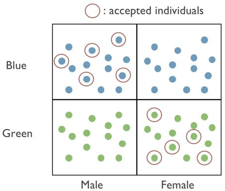  
Figure 1: Fairness Gerrymandering: A Toy Example [Kearns et al., 2018]

Suppose individuals each have two sensitive attributes: race (say blue and green) and gender (say male and female). Suppose that these two attributes are distributed independently and uniformly at random, and are uncorrelated with a binary label that is also distributed uniformly at random. If we view gender and race as defining classes of people that we wish to protect, we could take a standard statistical fairness definition from the literature — say the equal odds condition of Hardt et al. [2016], which asks to equalize false positive rates across protected groups, and instantiate it with the four protected groups: “Men”, “Women”, “blue people”, and “green people”. The following classifier satisfies this condition, although only by “cheating” and packing its unfairness into structured subgroups of the protected populations: it labels a person as positive only if they are a blue man or a green woman. This equalizes false positive rates across the four specified groups, but of course not over the finer-grained subgroups defined by the intersections of the two protected attributes.

Kearns et al. [2018] also proposed an approach to the problem of fairness gerrymandering: rather than asking for statistical definitions of fairness that hold over a small number of coarsely defined groups, ask for them to hold over a combinatorially or infinitely large collection of subgroups defined by a set of functions $\vec { \mathcal { G } }$ of the protected attributes (H´ebert-Johnson et al. [2018] independently made a similar proposal). For example, we could ask to equalize false positive rates across every subgroup that can be defined as the intersection or conjunction of $d$ protected attributes, for which there are $2 ^ { d }$ such groups. Kearns et al. [2018] showed that as long as the class of functions defining these subgroups has bounded VC dimension, the statistical learning problem of finding the best (distribution over) classifiers in $\mathcal { H }$ subject to the constraint of equalizing the positive classification rate, the false positive rate, or the false negative rate over every subgroup defined over $\vec { \mathcal { G } }$ is solvable whenever the dataset size is sufficiently large relative to the VC dimension of $\mathcal { G }$ and $\mathcal { H }$ . Taking inspiration from the technique of Agarwal et al. [2018], they were able to show that even with combinatorially many subgroup fairness constraints, the computational problem of learning the optimal fair classifier is once again solvable efficiently whenever the learner has access to a black-box classifier (oracle) which can solve the unconstrained learning problems over $\vec { \mathcal { G } }$ and $\mathcal { H }$ respectively. Similarly, given access to an oracle for $\mathcal { G }$ , they were able to efficiently solve the problem of auditing for rich subgroup fairness: finding the $g \in { \mathcal { G } }$ that corresponds to the subgroup for whom the statistical fairness constraint was most violated.

While the work of Kearns et al. [2018] is satisfying from a theocratical point of view, it leaves open a number of pressing empirical questions. For example, their theory is built for an idealized setting with perfect learning oracles — in practice heuristic oracles may fail. Moreover, perhaps rich subgroup fairness is asking for too much in practice — maybe enforcing combinatorially many constraints leads to an untenable tradeoff with error. Finally, perhaps enforcing combinatorially many constraints is not necessary — perhaps on real data, it is enough to call upon the algorithm of Agarwal et al. [2018] for enforcing statistical fairness constraints on the small number of groups defined by the marginal protected attributes, and rich subgroup fairness will follow incidentally. Put another way: Is the so-called fairness gerrymandering problem only a theoretical curiosity, or does it arise organically when standard classifiers are optimized subject to marginal

statistical fairness constraints?

In this paper, we conduct an extensive set of experiments to answer these questions. We study the algorithm from Kearns et al. [2018] — instantiated with fast heuristic learning oracles — when used to train a linear classifier subject to approximately equalizing false positive rates across a rich set of subgroups defined by linear threshold functions. On four real datasets, we characterize:

1. The basic convergence properties of the algorithm — although this algorithm has provable guarantees when instantiated with learning oracles for $\mathcal { G }$ and $\mathcal { H }$ , when these oracles are (necessarily) replaced with heuristics, the guarantees of the algorithm become heuristic as well. We find that the algorithm typically converges (Subsection 3.2), and provides a controllable trade-off between fairness and accuracy despite its heuristic guarantees (Subsection 3.3). We visualize the optimization trajectory of the algorithm (Subsection 3.5), and discrimination heatmaps showing the evolution of the subgroup discrimination of the algorithm over time (Subsection 3.4).   
2. The trade-off between subgroup fairness and accuracy. We find that for each dataset, there are appealing compromises between error and subgroup fairness. Thus achieving rich subgroup fairness may be possible in practice without a severe loss in predictive accuracy (Subsection 3.3).   
3. The subgroup (unfairness) that can result when one applies more standard approaches, that either ignore fairness constraints all together, or equalize false positive rates only across a small number of subgroups defined by individual protected attributes. By auditing the models produced by these standard approaches with the rich subgroup auditor of Kearns et al. [2018], we find that often subgroup fairness constraints are violated, even by algorithms which are explicitly equalizing false positive rates across the groups defined on the marginal protected attributes.

In light of these findings, we submit that rich subgroup fairness constraints are both important, and can be satisfied at reasonable cost: both in terms of computation, and in terms of accuracy. We hope that algorithms like that of Kearns et al. [2018] which can be used to satisfy rich subgroup fairness become part of the standard toolkit for fair machine learning.

# 1.1 Further Related Work

While Kearns et al. [2018] propose and study rich sub-group fairness for false positive and negative constraints, H´ebert-Johnson et al. [2018] study the analogous notion for calibration constraints, which they call multi-calibration. Kim et al. [2018a] extend this style of analysis to accuracy constraints (asking that a classifier be equally accurate on a combinatorially large collection of subgroups). Kim et al. [2018b] also extend it to metric fairness constraints, converting the individual metric fairness constraint of Dwork et al. [2012] into a statistical constraint that asks that on average, individuals in (combinatorially many) subgroups should be treated differently only in proportion to the average difference between individuals in the subgroups, as measured with respect to some similarity metric.

# 2 Definitions

We begin with some definitions, following the notation in Kearns et al. [2018]. We study the classification of individuals defined by a tuple $( ( x , x ^ { \prime } ) , y )$ , where $x \in \mathcal { X }$ denotes a vector of protected attributes, $x ^ { \prime } \in \mathcal { X } ^ { \prime }$ denotes a vector of unprotected attributes, and $y \in \{ 0 , 1 \}$ denotes a label. We will write $X = \left( x , x ^ { \prime } \right)$ to denote the joint feature vector. We assume that points $( X , y )$ are drawn i.i.d. from an unknown distribution $\mathcal { P }$ . Let $D$ be a binary classifier, and let $D ( X ) \in \{ 0 , 1 \}$ denote the (possibly randomized) classification induced by $D$ on individual $( X , y )$ .

We will be concerned with learning and auditing classifiers $D$ satisfying a common statistical fairness constraint: equality of false positive rates (also known as equal opportunity). The techniques in Agarwal

et al. [2018] and Kearns et al. [2018] also apply equally well to equality of false negative rates and equality of classification rates (also known as statistical parity).1

Each fairness constraint is defined with respect to a set of protected groups. We define sets of protected groups via a family of indicator functions $\mathcal { G }$ for those groups, defined over protected attributes. Each $g : \mathcal { X }  \{ 0 , 1 \} \in \mathcal { G }$ has the semantics that $g ( x ) = 1$ indicates that an individual with protected features $x$ is in group $g$ . We now formally define false positive subgroup fairness.

Definition 2.1 (False Positive Subgroup Fairness). Fix any classifier $D$ , distribution $\mathcal { P }$ , collection of group indicators $\vec { \mathcal { G } }$ , and parameter $\gamma \in \left[ 0 , 1 \right]$ . For each $g \in { \mathcal { G } }$ , define

$$
\alpha_ {F P} (g, \mathcal {P}) = \operatorname * {P r} _ {\mathcal {P}} [ g (x) = 1, y = 0 ],
$$

$$
\beta_ {F P} (g, D, \mathcal {P}) = | \mathrm {F P} (D) - \mathrm {F P} (D, g) |
$$

where $\mathrm { F P } ( D ) = \operatorname* { P r } _ { D , \mathcal { P } } [ D ( X ) = 1 \ | \ y = 0 ]$ and $\operatorname { F P } ( D , g ) = \operatorname* { P r } _ { D , \mathcal { P } } [ D ( X ) = 1 \mid g ( x ) = 1 , y = 0 ]$ ] denote the overall false-positive rate of $D$ and the false-positive rate of $D$ on group $g$ respectively.

We say $D$ satisfies $\gamma$ -False Positive (FP) Fairness with respect to $\mathcal { P }$ and $\mathcal { G }$ if for every $g \in { \mathcal { G } }$

$$
\alpha_ {F P} (g, \mathcal {P}) \cdot \beta_ {F P} (g, D, \mathcal {P}) \leq \gamma .
$$

We will sometimes refer to $\mathrm { F P } ( D )$ FP-base rate.

Since we do not consider other measures in this paper, we refer to this notion as simply “subgroup fairness.” Given a fixed subgroup $g \in { \mathcal { G } }$ we will refer to the quantity $\alpha _ { F P } ( g , \mathcal { P } ) \cdot \beta _ { F P } ( g , D , \mathcal { P } )$ as the subgroup fairness wrt $g$ , or alternately the $\gamma$ -unfairness of $g$ . The notion of subgroup fairness imposes a statistical constraint on combinatorially many groups definable by the protected attributes. This is in contrast to more common statistical fairness definitions, defined on coarse groups definable by a single protected attribute. Given a protected attribute $x _ { i }$ and a value for that attribute $a$ , define the function $g _ { i , a } ( x ) = \mathbf { 1 } \{ x _ { i } = a \}$ denoting the set of individuals who have that particular value of their protected attribute. In contrast to subgroup fairness, we refer to a classifier $D$ as marginally fair if it satisfies false positive subgroup fairness with respect to the functions $\{ g _ { i , a } \}$ for each protected attribute $x _ { i }$ and realization $a$ .

If the algorithm $D$ fails to satisfy the $\gamma$ -subgroup fairness condition, then we say that $D$ is $\gamma$ -unfair with respect to $\mathcal { P }$ and $\mathcal { G }$ . We call any subgroup $g$ which witnesses this unfairness a $\gamma$ -unfair certificate for $( D , { \mathcal { P } } )$

An auditing algorithm for a notion of fairness is given sample access to points from the underlying distribution, as well as the classification outcomes provided by $D$ . It will either deem $D$ to be fair with respect to $\mathcal { P }$ , or else produces a certificate of unfairness.

The algorithms of Agarwal et al. [2018] and Kearns et al. [2018] studied in this paper both assume access to oracles which can solve cost-sensitive classification (CSC) problems. Formally, an instance of a CSC problem for the class $\mathcal { H }$ is given by a set of $n$ tuples $\{ ( X _ { i } , c _ { i } ^ { 0 } , c _ { i } ^ { 1 } ) \} _ { i = 1 } ^ { n }$ such that $c _ { i } ^ { \ell }$ corresponds to the cost for predicting label $\ell$ on point $X _ { i }$ . Given such an instance as input, a CSC oracle finds a hypothesis $\hat { h } \in \mathcal { H }$ that minimizes the total cost across all points:

$$
\hat {h} \in \underset {h \in \mathcal {H}} {\operatorname {a r g m i n}} \sum_ {i = 1} ^ {n} \left[ h \left(X _ {i}\right) c _ {i} ^ {1} + \left(1 - h \left(X _ {i}\right)\right) c _ {i} ^ {0} \right] \tag {1}
$$

Following both Agarwal et al. [2018] and Kearns et al. [2018], in all of the experiments in this paper we take the classes $\mathcal { H }$ and $\mathcal { G }$ to be linear threshold functions, and we use a linear regression heuristic for both auditing and learning. The heuristic finds a linear threshold function as follows:

Table 1: Description of Data Sets.   

<table><tr><td>Dataset</td><td>Size</td><td>Prediction</td><td>#Features</td><td>#Protected</td><td>Protected Feature Types</td><td>Baseline</td></tr><tr><td>Communities and Crime</td><td>1994</td><td>High Violent Crime ?</td><td>128</td><td>18</td><td>Race</td><td>0.3</td></tr><tr><td>Law School</td><td>2053</td><td>Pass Bar Exam ?</td><td>10</td><td>4</td><td>Race, Income, Age, Gender</td><td>0.49</td></tr><tr><td>Student</td><td>396</td><td>Course Performance ?</td><td>30</td><td>5</td><td>Age, Gender, Relationship, Alcohol Use</td><td>0.47</td></tr><tr><td>Adult</td><td>2021</td><td>Income &gt;= $50K ?</td><td>14</td><td>3</td><td>Age, Race, Gender</td><td>0.50</td></tr></table>

• Train two linear regression models $r _ { 0 }$ , $r _ { 1 }$ to predict $c _ { 0 }$ and $c _ { 1 }$ respectively.   
• Given a new point $x$ , predict the cost of classifying $x$ as 0 and 1 using our regression models: these are $r _ { 0 } ( x )$ and $r _ { 1 } ( x )$ respectively.   
• Output the prediction $\hat { y }$ corresponding to lower predicted cost: $\begin{array} { r } { \hat { y } = \mathrm { a r g m i n } _ { i \in \{ 0 , 1 \} } r _ { i } ( x ) } \end{array}$

We leave the precise descriptions of the algorithm from Kearns et al. [2018] — which we will refer to as the SUBGROUP algorithm — to the appendix. We refer the reader to Kearns et al. [2018] for details about its derivation and guarantees.2 At this point we remark only that the algorithm operates by expressing the optimization problem to be solved (minimize error, subject to subgroup fairness constraints) as solving for the equilibrium in a two player zero-sum game, between a Learner and an Auditor. The Learner has the set of hypothesis $\mathcal { H }$ as its action (pure strategy) space, and the Auditor has the set of subgroups $\mathcal { G }$ as its action space. The best response problem for the Auditor corresponds to the auditing problem: finding the subgroup $g \in { \mathcal { G } }$ for which the strategy of the learner violates the fairness constraints the most. The best response problem for the Learner corresponds to solving a weighted (but unconstrained) empirical risk minimization problem. The best response problem for both players can be expressed as solving a cost sensitive classification problem. The algorithm SUBGROUP essentially simulates the fictitious play of this game, which proceeds over rounds, and in each round $t$ both players best respond to their opponent’s empirical history of play:

• Learner plays $h _ { t }$ in $\mathcal { H }$ that minimizes objective function balancing error and unfairness on subgroups $g _ { 1 } , \ldots , g _ { t - 1 }$ found by Auditor so far;   
• Auditor finds subgroup $g _ { t }$ in $\mathcal { G }$ on which the uniform distribution over $h _ { 1 } , \ldots , h _ { t }$ violates $\gamma$ -fairness the most.

This can be done efficiently assuming access to oracles which solve the cost sensitive classification problem over $\mathcal { G }$ and $\mathcal { H }$ respectively.

# 3 Empirical Evaluation

In this section, we describe an extensive empirical investigation of the SUBGROUP algorithm on four datasets in which fairness is a potential concern. Among the questions of primary interest are the following:

• Does the SUBGROUP algorithm work in practice, despite the use of imperfect heuristics for the Learner and Auditor?   
• Is the notion of subgroup fairness interesting empirically, in that there are palatable trade-offs between accuracy and subgroup fairness (as opposed to it being too strong a constraint, and thus resulting in a very steep error increase for even weak subgroup fairness)?

We will answer these questions strongly in the affirmative, which is perhaps the overarching message of our results. We also carefully compare subgroup fairness to standard marginal fairness, and show that

optimizing for the latter in general does poorly on the former — thus something like the SUBGROUP algorithm is actually necessary to achieve subgroup fairness.

More generally, aside from performance, we provide a number of empirical analyses that elucidate the underlying behavior and convergence properties of the SUBGROUP algorithm, and discuss its strengths and weaknesses.

# 3.1 Datasets

We ran experiments on 3 datasets from the UCI Machine Learning Repository Dheeru and Karra Taniskidou [2017]: Communities and Crime [Redmond and Baveja, 2002], Adult, and Student [Cortez and Silva, 2008], and the Law School dataset from the Law School Admission Council’s National Longitudinal Bar Passage Study [Wightman, 1998]. These datasets were selected due to their potential fairness concerns, including:

• Data points representing individual people (or in the case of Communities and Crimes, small U.S. communities of people);   
• The presence of features capturing properties often associated with possible discrimination, including race, gender, and age;   
• Potential sensitivity of the predictions being made, such as violent crime, income, or performance in school.

The properties of these datasets are summarized in Table 1, including the number of instances, the prediction being made, the overall number of features (which varies from 10 to 128), the number of protected features in the subgroup class (which varies from 3 to 18), the nature of the protected features, and the baseline (majority class) error rate.

Some methodological notes:

• We note that two of the datasets (Law School and Adult) were initially much larger but were extremely imbalanced with respect to the predicted label, making sensible error comparisons numerically difficult. We thus randomly downsampled these two datasets to obtain approximately balanced prediction problems on each.   
• All categorical variables have been preprocessed with a one-hot encoding.   
• The SUBGROUP algorithm has two input parameters: the maximum allowed subgroup fairness violation. , and a tuning parameter $C$ which represents (in the theoretical derivation in Kearns et al. $\gamma$ [2018]) an upper bound on the magnitude of the dual variables needed to express the fairness constrained empirical risk minimization problem. We view $\gamma$ as an important control variable allowing us to explore the tradeoff between fairness and accuracy, and thus will vary it in our experiments. On the other hand, $C$ is more of a nuisance parameter, and thus for consistency and simplicity we set $C = 1 0$ in all experiments. Experimentation with larger values of $C$ did not reveal qualitatively different findings on the datasets investigated.   
• We emphasize that all results are reported in-sample on the datasets, and thus we are treating the empirical distributions of the datasets as the “true” distributions of interest. We do this because our primary interest is simply in examining the performance and behavior of the SUBGROUP algorithm on the actual data or distributions, and not in generalization per se. As noted in Kearns et al. [2018], theoretical generalization bounds for both error and subgroup fairness can be obtained by standard methods, and will depend on (e.g.) the VC dimension of the Learner’s model class $\mathcal { H }$ and the Auditor’s subgroup class $\mathcal { G }$ . As usual, we would expect empirical generalization to often be considerably better than the worst-case theory.

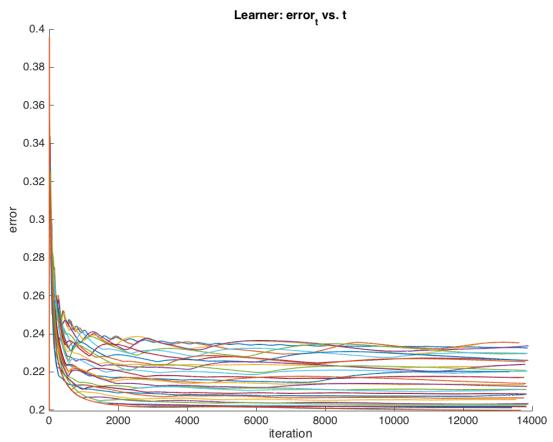  
(a)

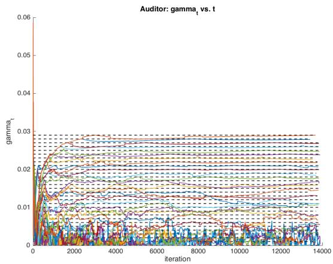  
(b)

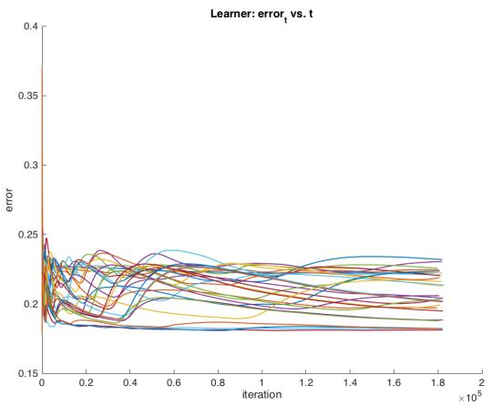  
(c)

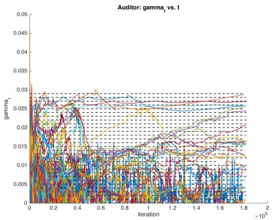  
(d)   
Figure 2: Error $\varepsilon _ { t }$ and fairness violation $\gamma _ { t }$ for Law School dataset (panels (a) and (b)) and Adult data set (panels (c) and (d)), for values of input $\gamma$ ranging from 0 to 0.03. Dashed horizontal lines on $\gamma _ { t }$ plots correspond to varying values of $\gamma$ .

# 3.2 Empirical Convergence of SUBGROUP

We begin with an examination of the convergence properties of the SUBGROUP algorithm on the four datasets. Kearns et al. [2018] had already reported preliminary convergence results for the Communities and Crime dataset, showing that their algorithm converges quickly, and that varying the input $\gamma$ provides an appealing trade-off between error and fairness. In addition to replicating those findings for Communities and Crime, we also find that they are not an optimistic anomaly. For example, for the Law School dataset, in Figure 2 we plot both the error $\varepsilon _ { t }$ (panel (a)) and the fairness violation $\gamma _ { t }$ (panel (b)) as a function of the iteration $t$ , for values of the input $\gamma$ ranging from 0 to 0.03. We see that the algorithm converges relatively quickly (on the order of thousands of iterations), and that increasing the input $\gamma$ generally yields decreasing error and increasing fairness violation (typically saturating the input $\gamma$ ), as suggested by the idealized theory.

But on other datasets the empirical convergence does not match the idealized theory as cleanly, presumably due to the use of imperfect Learner and Auditor heuristics. In panels (c) and (d) of Figure 2 we again

plot $\varepsilon _ { t }$ and $\gamma _ { t }$ , but now for the Adult dataset. Even after approximately 180,000 iterations, the algorithm does not appear to have converged, with $\varepsilon _ { t }$ still showing long-term oscillatory behavior, $\gamma _ { t }$ exhibiting extremely noisy dynamics (especially at smaller input $\gamma$ values), and there being no clear systematic, monotonic relationship between the input $\gamma$ and error acheived. But despite this departure from the theory, it remains the case that varying $\gamma$ still yields a diverse set of $\langle \varepsilon _ { t } , \gamma _ { t } \rangle$ pairs, as we will see in the next section. In this sense, even in the absence of convergence the algorithm can be viewed as a valuable search tool for models trading off accuracy and fairness.

Overall, we found rather similar convergent behavior on the Communities and Crime and Law School datasets, and less convergent behavior on the Adult and Student datasets.

# 3.3 Subgroup Pareto Frontiers and Comparison to Marginal Fairness

Regardless of convergence, for plots such as those in Figure 2, it is natural to take the $\langle \varepsilon _ { t } , \gamma _ { t } \rangle$ pairs across all $t$ and all input $\gamma$ , and compute the undominated or Pareto frontier of these pairs. This frontier represents the accuracy-fairness tradeoff achieved by the SUBGROUP algorithm on a given data set, which is arguably its most important output. The choice of where one wants to be on the frontier is a policy question that should be made by domain experts and stakeholders, and dependent on the stakes involved (e.g. online advertising vs. criminal sentencing).

It is also of interest to compare the subgroup fairness achieved by the SUBGROUP algorithm (which is explicitly optimizing under a subgroup fairness constraint) with an algorithm only optimizing under weaker and more traditional marginal fairness constraints. To this end, we also implemented a version of the algorithm from Agarwal et al. [2018] — which we will refer to as the MARGINAL algorithm — for marginal fairness.3 From a theoretical perspective, a priori we would expect models trained for marginal fairness to fare poorly on subgroup fairness. But it is an empirical question — perhaps on some datasets, demanding marginal fairness already suffices to enforce subgroup fairness as well. Thus the high-level question is whether the SUBGROUP framework and algorithm are worth the added analytical and computational overhead.

In the left column of Figure 3, we show the SUBGROUP algorithm Pareto frontiers for subgroup fairness on all four datasets, and also the pairs achieved by the MARGINAL algorithm. In the right column, we also separately show the marginal fairness frontier achieved by the MARGINAL algorithm. Before discussing the particulars of each dataset, we first make the following general observations:

• For most datasets, the SUBGROUP algorithm yields a Pareto curve that frequently lies well below the straight line connecting its endpoints (which we can think of as an empirical form of strong convexity), and thus there are non-trivial tradeoffs between accuracy and fairness to consider. On some of these curves there are regions of steep descent where subgroup unfairness can be reduced significantly with negligible increase in error.   
• While the MARGINAL algorithm performs well with respect to marginal fairness (right column) as expected, it fares much worse than the SUBGROUP algorithm on subgroup fairness for three of the datasets. Thus marginal fairness is not just theoretically, but also empirically a weaker notion, and generally will not imply subgroup fairness “for free”.   
• Nevertheless, there are a handful of points in which the MARGINAL algorithm produces models that actually lie below (and thus dominate) the SUBGROUP Pareto curve by a small amount. While this is not possible under the idealized theory — subgroup fairness is a strictly stronger notion than marginal fairness — it can again be explained by the use of imperfect learning heuristics by both algorithms.   
• Focusing just on the MARGINAL marginal fairness curves in the right column, we see that each of them begins with a steep drop, meaning that in every case, the marginal unfairness of the unconstrained error-optimal model can be significantly improved with little or no increase in error.

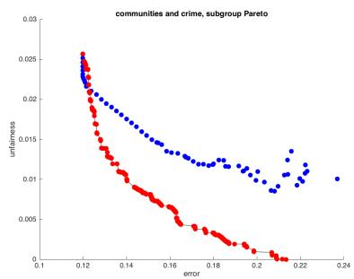  
(a)

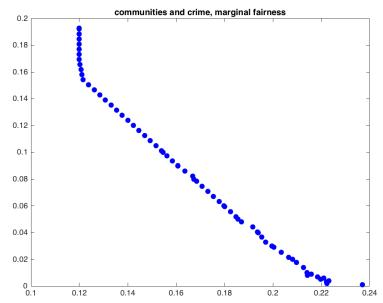  
(b)

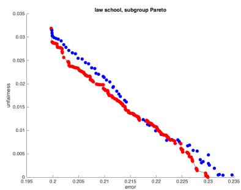  
(c)

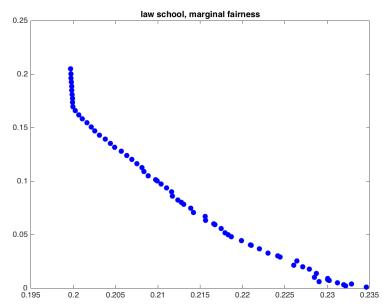  
(d)

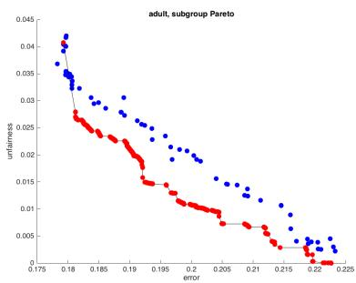  
(e)

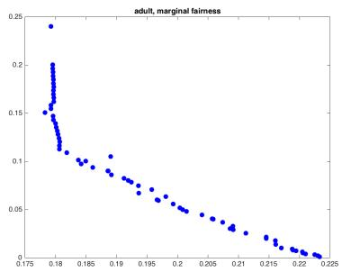  
(f)

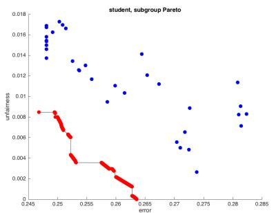  
(g)

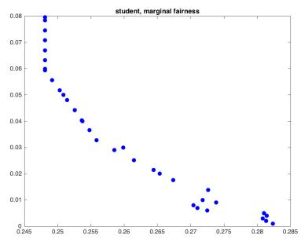  
(h)   
Figure 3: Left column: The red points show the Pareto frontier of error (x axis) and subgroup fairness violation (y axis) for the SUBGROUP algorithm across all four data sets, while the blue points show the error and subgroup fairness violation for the models achieved by the MARGINAL algorithm. Right column: The error and marginal fairness violation for the MARGINAL algorithm across all four data sets. Ordering of datasets is Communities and Crime, Law School, Adult, and Student.

• By matching points between the MARGINAL marginal and subgroup fairness plots, we find that with the exception of the Student data set, there is a systematic relationship between marginal and subgroup unfairness: asking the MARGINAL algorithm to reduce marginal unfairness also causes it to reduce subgroup unfairness — but not by as much as the SUBGROUP algorithm achieves.

Together these observations let us conclude that subgroup fairness is a strong but achievable notion in practice (at least on these datasets), and that the SUBGROUP algorithm appears to be an effective tool for its investigation.

It is also worth commenting on the differences across datasets, and focusing not just on the qualitative shapes of the Pareto curves but their actual numerical specifics — especially since in real applications, these will matter to stakeholders. For instance, the actual range of error values spanned by the SUBGROUP Pareto curves ranges from nearly 10% (Communities and Crime) to less than 2% (Student). So perhaps for Communities and Crime, the tradeoff is starker from an accuracy perspective. We now provide some brief commentary on each dataset.

Communities and Crime (panels (a) and (b)): This is the dataset with perhaps the cleanest and most convex SUBGROUP Pareto curve, with steep drops in subgroup unfairness possible for minimal error increase at the beginning. In particular are able to reduce the initial $\gamma$ -unfairness from 0.026 to less than 0.005 while only increasing the error from 0.12 to 0.16. This is a meaningful reduction in unfairness – e.g. reducing a 26% percent difference in false positive rate on a subgroup comprising 10% of the population, to a less than 5% false positive rate disparity on a subgroup of the same size. Eventually the Pareto curve flattens out, resulting in increasing accuracy costs for reduced unfairness. While the MARGINAL subgroup unfairness curve matches the SUBGROUP Pareto curve on the far left (for all datasets), since this corresponds to minimizing error unconstrained by any fairness notion, the outperformance by SUBGROUP grows rapidly as we make stronger fairness demands.

Law School (panels (c) and (d)): Here the SUBGROUP Pareto curve appears to be approximately linear, thus providing a constant tradeoff between accuracy and subgroup fairness. Interestingly, this is the one dataset in which asking for marginal fairness appears to also yield subgroup fairness for free, as the MARGINAL curve lies very close to the SUBGROUP curve. Since this dataset has the fewest number of features overall and the second fewest number of protected features, one might be tempted to conjecture that when the number of protected features is small, guaranteeing marginal fairness approximately guarantees rich subgroup fairness. This claim is falsified by the fact that on the Adult dataset which has similar dimensionality (see below), there is a large gap between the SUBGROUP and MARGINAL subgroup fairness curves.

Adult (panels (e) and (f)): Here we see a less smooth SUBGROUP curve, possibly corresponding to the poorer convergence properties on this dataset mentioned earlier. Nevertheless, the numerical tradeoff exhibits regions of both steep, inexpensive reduction in unfairness and flat, costly reduction. MARGINAL is again considerably worse when evaluated on subgroup fairness, but still shows a systematic relationship to marginal fairness.

Student (panels (g) and (h)): Similar to Adult, a varied SUBGROUP curve with multiple tradeoff regimes. This is also the lone dataset in which reducing marginal fairness appears to have no relationship to subgroup fairness — while the MARGINAL marginal pareto curve in panel (h) remains relatively smooth, the subgroup fairness of the corresponding models in panel (d) is now not only worse than for SUBGROUP, but shows no monotonicity. SUBGROUP is able to decrease $\gamma$ -unfairness to 0 with only a 2% increase in error, while the MARGINAL algorithm only drives the subgroup unfairness to 0.002 at its best, with an over 3% increase in error from the unconstrained classifier.

Having established the efficacy of subgroup fairness and the SUBGROUP algorithm on the four datasets, we now turn to experiments and visualizations allowing us to better understand the behavior and dynamics

of the algorithm.

# 3.4 Flattening the Discrimination Surface

Recall that in the various analyses and plots above, we rely on the Auditor of SUBGROUP to detect unfairness. This Auditor is in turn a heuristic, relying on an optimization procedure without any theoretical guarantees, which could potentially fail in practice. This means that while any detected unfairness is a lower bound on the true subgroup unfairness, it could be the case that the heuristic Auditor is simply failing to detect a larger disparity, and that the models learned by SUBGROUP look more fair than they really are.

We explore this possibility on the Communities & Crime dataset by implementing a brute force Auditor that runs alongside the SUBGROUP algorithm. To make brute force auditing computationally tractable, we designate only two attributes as protected; pctwhite and pctblack, the percentage of each community that consists of white and black people respectively. While the SUBGROUP algorithm uses the same heuristic Auditor it always does, at each round we also perform a brute force audit as follows. Subgroups $g _ { \theta }$ are defined by a linear threshold function $\theta$ over the 2 sensitive attributes, e.g. $( x _ { 1 } , x _ { 2 } ) \in g _ { \theta }$ iff $\langle \theta , ( x _ { 1 } , x _ { 2 } ) \rangle \geq 0$ . We discretize $\theta \in [ - 1 , 1 ] ^ { 2 }$ in increments of 0.1, and for the subgroup defined by each $\theta$ in the discretization we compute the $\gamma$ -unfairness. Hence at each round we can take the current classifier of the Learner, and plot for each group $g _ { \theta }$ the point $( \theta _ { 1 } , \theta _ { 2 } , \gamma )$ .

Note that in addition to making brute force auditing tractable, restricting to two dimensions permits direct visualization of discrimination. In Figure 4, we show a sequence of “discrimination surfaces” for the SUBGROUP algorithm over the 2 protected features, with input $\gamma = 0$ . The $x \mathrm { ~ - ~ } y$ axes are the coefficients of $\theta$ corresponding to whitepct and blackpct respectively, and the $z$ -axis is the $\gamma$ -unfairness of the corresponding subgroup. This is our first non-heuristic view of $\gamma$ -unfairness, and also shows us the entire surface of $\gamma$ -unfairness, rather than just the most violated subgroup. Note that perfect subgroup fairness would correspond to an entirely flat discrimination surface at $z = 0$ .

We observe first that the unconstrained classifier in $t \ = \ 1$ (panel (a)) shows a very systematic bias along the lines of our sensitive attributes. In particular groups with whitepct $> 0$ and blackpct $< 0$ , e.g. communities with large numbers of white residents and relatively fewer black residents have a much higher false positive rate for being classified as violent. Conversely, majority black communities are less likely to be incorrectly labeled as violent. The mean $\gamma$ -unfairness (base rate - community rate) for whitepct $> 0$ blackpct $< 0$ communities is $- 0 . 0 2 4 2$ , whereas the mean for whitepct $< 0$ , blackpct > 0 groups is 0.0247. The maximum $\gamma$ -unfairness in $t = 1$ is 0.028, and 61.25% of the 400 subgroups have $\gamma$ -unfairness $> 0 . 0 2$ . Recall that this corresponds to e.g. a 20% disparity of the false positive rate from the base rate, for groups as large as $1 0 \%$ of the population. We are thus far from perfect subgroup fairness.

As the algorithm proceeds, we see this discrimination flip by $t = 7$ (panel (b)), into a regime with a higher false positive rate for predominantly black communities, and then revert again by $t = 1 3$ . Over the early iterations these oscillations continue, growing less drastic as the $\gamma$ -unfairness surface starts to flatten out noticeably by $t = 3 7$ (panel (g)). In panel (h) we plot $t = 1 3 0 1$ and see that the surface has almost completely flattened, with maximum $\gamma$ -unfairness below .0028. So over the course of the first 1300 iterations of SUBGROUP we’ve reduced the $\gamma$ -unfairness from over 0.02 in most of the subgroups, to less than 0.0028 in every subgroup. Recall again that this corresponds to false positive rate disparities of at most 2.8% in subgroups that represent 10% of the population — a reduction from false positive rate disparities of 20% many similarly sized subgroups. This represents an order of magnitude improvement that results from using the classifier learned by SUBGROUP.

# 3.5 Understanding the Dynamics

We conclude by examining the dynamics of the SUBGROUP algorithm on the Communities and Crime dataset in greater detail. More specifically, since the algorithm is formulated as a game between a Learner who at each iteration $t$ is trying to minimize the error $\varepsilon _ { t }$ , and an Auditor who is trying to minimize subgroup unfairness $\gamma _ { t }$ , we visualize the trajectories traced in $\langle \varepsilon _ { t } , \gamma _ { t } \rangle$ space as $t$ increases.

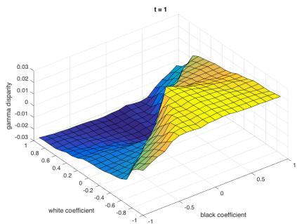  
(a)

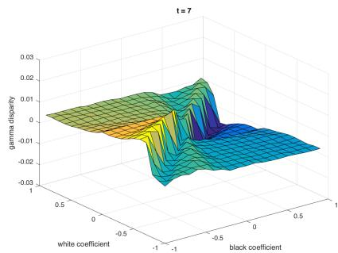  
(b)

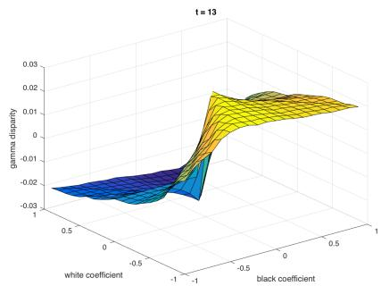  
(c)

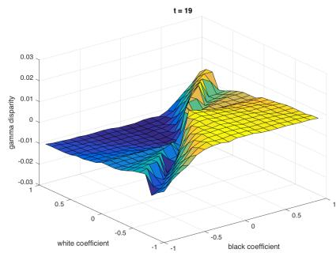  
(d)

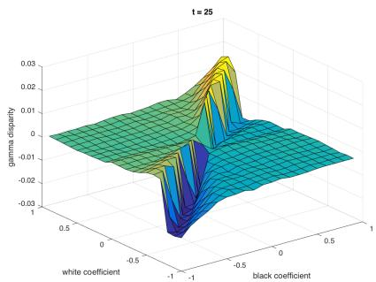  
(e)

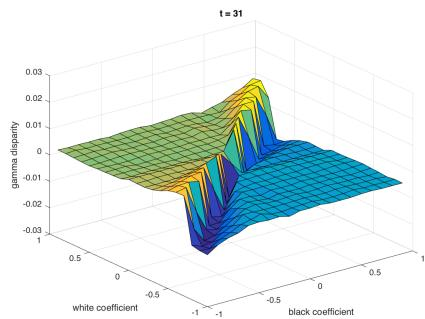  
(f)

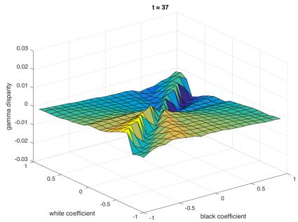  
(g)

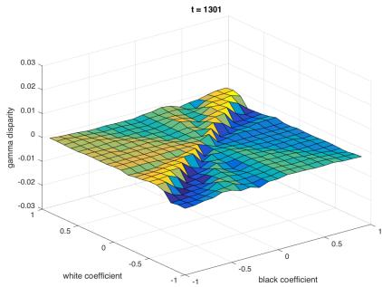  
(h)   
Figure 4: Evolution of discrimination surface for the SUBGROUP algorithm from $t = 1 \ldots 1 3 0 1$ . Each point in the plane corresponds to a different subgroup over two protected attributes, and the corresponding $z$ value is the current false positive discrepancy for the subgroup. 12

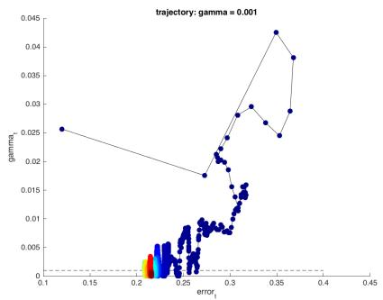  
(a)

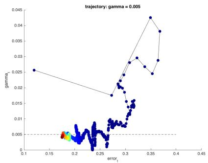  
(b)

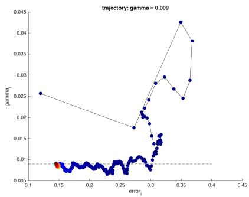  
(c)

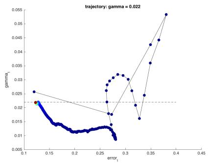  
(d)   
Figure 5: $\langle \varepsilon _ { t } , \gamma _ { t } \rangle$ trajectories for Communities and Crime, for $\gamma \in \{ 0 . 0 0 1 , 0 . 0 0 5 , 0 . 0 0 9 , 0 . 0 2 2 \}$ .

The plots in Figure 5 correspond to such trajectories for input $\gamma$ values of $0 . 0 0 1 , 0 . 0 0 5 , 0 . 0 0 9$ , and 0.022 (panels (a), (b), (c) and (d) respectively), which are denoted by the dashed lines on the $\gamma _ { t }$ axis of each figure. The 0.001 and $0 . 0 0 5 , 0 . 0 0 9$ values correspond to small and intermediate $\gamma$ regimes, whereas 0.022 is close to (but slightly below) the subgroup unfairness of the unconstrained classifier. The trajectories are color coded from colder to warmer colors according to their iteration number to give a sense of speed of convergence.

The first plot in all four trajectories corresponds to the $\left. \varepsilon _ { 0 } , \gamma _ { 0 } \right.$ of the unconstrained classifier. Furthermore, as long as the current $\gamma _ { t }$ values remain above the horizontal dashed line representing the input $\gamma$ , the trajectories remain identical, as the same subgroups are being presented to the learner in each trajectory. But when $\gamma _ { t }$ falls below a given input $\gamma$ , that trajectory will follow its own path going forward.

We first observe that the dynamics exhibit a fair amount of complexity and subtlety. They all begin with low error and large unfairness, and quickly follow a brief but large increase in $\varepsilon _ { t }$ as fairness starts to be enforced. There are steps in which both $\varepsilon _ { t }$ and $\gamma _ { t }$ increase, and a large early loop in trajectory space is observed. But the first three trajectories (panels (a), (b) and (c), corresponding to the three smaller values of $\gamma$ ) quickly settle near the input $\gamma$ line, at which point begins a long, oscillatory “border war” around this line, as the Learner tries to minimize error, but is pushed back below the line by the Auditor anytime $\gamma$ -fairness is violated. The idealized theory predicts that each trajectory should end at the input $\gamma$ line (subgroup fairness constraint saturated), and with larger input $\gamma$ (weaker fairness constraint) resulting in lower error. The empirical trajectories indeed conform nicely to the theory, with the final (red) points near the dashed lines, and further left for larger $\gamma$ .

Panel (d), corresponding to a much larger input $\gamma$ , diverges much earlier from the other three (on its second step), and early on sees unfairness driven far below the specified value. The dynamics then see a slow, gradual decrease of error and increase of unfairness back to the input value, with the trajectory ending up near where it began, but just slightly more fair, as specified by $\gamma$ .

# 4 Conclusions

In this work we have established the empirical efficacy of the notion of rich subgroup fairness and the algorithm of Kearns et al. [2018] on four fairness-sensitive datasets, and the necessity of explicitly enforcing subgroup (as opposed to only marginal) fairness. There are a number of interesting directions for further experimental work we plan to pursue, including:

• Experiments with richer Learner model classes $\mathcal { H }$ , while keeping the Auditor subgroup class $\mathcal { G }$ relatively simple and fixed. One conjecture is that by making the hypothesis space richer, more appealing Pareto curves may be achieved. There is also some rationale for keeping $\vec { \mathcal { G } }$ simple, since we would like to have some intuitive interpretation of what the subgroups represent, while the same constraint may not hold for $\mathcal { H }$ .   
• Implementation and experimentation with the no-regret algorithm of Kearns et al. [2018], which may have superior convergence and other properties due to its stronger theoretical guarantees.   
• Experiments on the generalization performance of subgroup fairness in the form of test-set Pareto curves. While as mentioned, standard VC theory can be applied to obtain worst-case bounds, one might expect even better empirical generalization.

# References

Alekh Agarwal, Alina Beygelzimer, Miroslav Dud´ık, John Langford, and Hanna M. Wallach. A reductions approach to fair classification. In Jennifer G. Dy and Andreas Krause, editors, Proceedings of the 35th International Conference on Machine Learning, ICML 2018, Stockholmsm¨assan, Stockholm, Sweden, July 10-15, 2018, volume 80 of JMLR Workshop and Conference Proceedings, pages 60–69. JMLR.org, 2018.   
Richard Berk, Hoda Heidari, Shahin Jabbari, Michael Kearns, and Aaron Roth. Fairness in criminal justice risk assessments: The state of the art. Sociological Methods & Research, page 0049124118782533, 2018.   
Toon Calders and Sicco Verwer. Three naive bayes approaches for discrimination-free classification. Data Mining and Knowledge Discovery, 21(2):277–292, 2010.   
Alexandra Chouldechova. Fair prediction with disparate impact: A study of bias in recidivism prediction instruments. Big data, 5(2):153–163, 2017.   
P. Cortez and A. Silva. Using data mining to predict secondary school student performance. Proceedings of 5th Future Business Technology Conference, 2008.   
Dua Dheeru and Efi Karra Taniskidou. UCI machine learning repository, 2017.   
Cynthia Dwork, Moritz Hardt, Toniann Pitassi, Omer Reingold, and Richard Zemel. Fairness through awareness. In Proceedings of the 3rd innovations in theoretical computer science conference, pages 214– 226. ACM, 2012.   
Moritz Hardt, Eric Price, and Nati Srebro. Equality of opportunity in supervised learning. In Advances in neural information processing systems, pages 3315–3323, 2016.   
Ursula H´ebert-Johnson, Michael P. Kim, Omer Reingold, and Guy N. Rothblum. ´ Multicalibration: Calibration for the (computationally-identifiable) masses. In Proceedings of the 35th International Conference on Machine Learning, ICML 2018, Stockholmsm¨assan, Stockholm, Sweden, July 10-15, 2018, pages 1944– 1953, 2018.

Michael J. Kearns, Seth Neel, Aaron Roth, and Zhiwei Steven Wu. Preventing fairness gerrymandering: Auditing and learning for subgroup fairness. In Jennifer G. Dy and Andreas Krause, editors, Proceedings of the 35th International Conference on Machine Learning, ICML 2018, Stockholmsm¨assan, Stockholm, Sweden, July 10-15, 2018, volume 80 of JMLR Workshop and Conference Proceedings, pages 2569–2577. JMLR.org, 2018.   
Michael P Kim, Amirata Ghorbani, and James Zou. Multiaccuracy: Black-box post-processing for fairness in classification. arXiv preprint arXiv:1805.12317, 2018a.   
Michael P Kim, Omer Reingold, and Guy N Rothblum. Fairness through computationally-bounded awareness. arXiv preprint arXiv:1803.03239, 2018b.   
Jon M. Kleinberg, Sendhil Mullainathan, and Manish Raghavan. Inherent trade-offs in the fair determination of risk scores. In 8th Innovations in Theoretical Computer Science Conference, ITCS, 2017.   
M.A. Redmond and A. Baveja. A data-driven software tool for enabling cooperative information sharing among police departments. European Journal of Operational Research 14, 2002.   
L. Wightman. Lsac national longitudinal bar passage study. 1998.   
Blake Woodworth, Suriya Gunasekar, Mesrob I Ohannessian, and Nathan Srebro. Learning nondiscriminatory predictors. In Conference on Learning Theory, pages 1920–1953, 2017.

# A Details of the SUBGROUP algorithm

We here recall the main results of Kearns et al. [2018]. Let $S$ denote a set of $n$ labeled examples $\{ z _ { i } =$ $( x _ { i } , x _ { i } ^ { \prime } ) , y _ { i } ) \} _ { i = 1 } ^ { n }$ , and let $\mathcal { P }$ denote the empirical distribution over this set of examples. Let $D$ denote a probability distribution over $\mathcal { H }$ . Consider the following Fair ERM (Empirical Risk Minimization) problem:

$$
\min  _ {D \in \Delta_ {\mathcal {H}}} \underset {h \sim D} {\mathbb {E}} [ \operatorname {e r r} (h, \mathcal {P}) ] \tag {2}
$$

$$
\text {s u c h} \forall g \in \mathcal {G} \quad \alpha_ {F P} (g, \mathcal {P}) \cdot \beta_ {F P} (g, D, \mathcal {P}) \leq \gamma . \tag {3}
$$

where $e r r ( h , \mathcal { P } ) = \mathrm { P r } _ { \mathcal { P } } [ h ( x , x ^ { \prime } ) \neq y ]$ , and the quantities $\alpha _ { F P }$ and $\beta _ { F P }$ are defined in Definition 2.1. We will write OPT to denote the objective value at the optimum for the Fair ERM problem, that is the minimum error achieved by a $\gamma$ -fair distribution over the class $\mathcal { H }$ . This is the fair learning problem that we want to solve. We assume our algorithm has access to the cost-sensitive classication oracles CSC(H) and CSC(G) over the classes $\mathcal { H }$ and $\vec { \mathcal { G } }$ respectively.

Kearns et al. Kearns et al. [2018] prove the existence of an oracle-efficient algorithm for solving the Fair ERM problem:

Theorem A.1 (Kearns et al. [2018]). Fix any $\nu , \delta \in ( 0 , 1 )$ . Then given an input of n data points and accuracy parameters $\nu , \delta$ and access to oracles CSC(H) and CSC(G), there exists an algorithm that runs in polynomial time, and with probability at least $1 - \delta$ , outputs a randomized classifier $\hat { D }$ such that $e r r ( \hat { D } , \mathcal { P } ) \leq \mathrm { O P T } + \nu$ , and for any $g \in { \mathcal { G } }$ , the fairness constraint violations satisfies

$$
\alpha_ {F P} (g, \mathcal {P}) \cdot \beta_ {F P} (g, \hat {D}, \mathcal {P}) \leq \gamma + O (\nu).
$$

The algorithm corresponding to Theorem A is randomized, however, and hence less amenable to the sort of empirical investigation that we undertake in this paper. Fortunately, Kearns et al. [2018] also give another algorithm, with somewhat weaker guarantees. It has the same guarantees as Theorem , except the convergence guarantees hold only after an exponential, rather than a polynomial number of steps. However, it has the virtue of very simple per-step dynamics, and is the algorithm that we investigate in this paper. Its pseudo-code follows:

# Algorithm 1 FairFictPlay: Fair Fictitious Play

Input: distribution $\mathcal { P }$ over the labelled data points, CSC oracles $\mathrm { C S C } ( \mathscr { H } )$ and $\operatorname { C S C } ( { \mathcal { G } } )$ for the classes $\mathcal { H } ( S )$ and $\mathcal { G } ( S )$ respectively, dual bound $C$ , and number of rounds $T$   
Initialize: set $h ^ { 0 }$ to be some classifier in $\mathcal { H }$ , set $\lambda ^ { 0 }$ to be the zero vector. Let $\overline { { D } }$ and $\bar { \lambda }$ be the point distributions that put all their mass on $h ^ { 0 }$ and $\lambda ^ { 0 }$ respectively.   
For $t = 1 , \dots , T$ :

Compute the empirical play distributions:

Let $\overline { { D } }$ be the uniform distribution over the set of classifiers $\{ h ^ { 0 } , \ldots , h ^ { t - 1 } \}$

Let λ = Pt0<t λt0 $\begin{array} { r } { \overline { { \lambda } } = \frac { \sum _ { t ^ { \prime } < t } { \lambda ^ { t ^ { \prime } } } } { t } } \end{array}$ be the auditor’s empirical dual vector

Learner best responds: Use the oracle CSC(H) to compute $h ^ { t } = \operatorname { a r g m i n } _ { h \in \mathcal { H } ( S ) } \langle \mathrm { L C } ( \overline { { \lambda } } ) , h \rangle$

Auditor best responds: Use the oracle CSC(G) to compute $\lambda ^ { t } = \operatorname { a r g m a x } _ { \lambda } \mathbb { E } _ { h \sim \overline { { D } } } \left[ U ( h , \lambda ) \right]$

Output: the final empirical distribution $\overline { { D } }$ over classifiers

To briefly introduce the notations in the description above, we first note that we can rewrite the set of constraints in the Fair ERM problem as follows: for each $g \in { \mathcal { G } } ( S )$ ,

$$
\Phi_ {+} (h, g) \equiv \alpha_ {F P} (g, P) (\operatorname {F P} (h) - \operatorname {F P} (h, g)) - \gamma \leq 0 \tag {4}
$$

$$
\Phi_ {-} (h, g) \equiv \alpha_ {F P} (g, \mathcal {P}) (\operatorname {F P} (h, g) - \operatorname {F P} (h)) - \gamma \leq 0 \tag {5}
$$

Here $\mathcal { G } ( S )$ and $\mathcal { H } ( S )$ denote the set of all labellings on $S$ that are induced by $\vec { \mathcal { G } }$ and $\mathcal { H }$ respectively, that is

$$
\mathcal {G} (S) = \left\{\left(g \left(x _ {1}\right), \dots , g \left(x _ {n}\right)\right) \mid g \in \mathcal {G} \right\} \quad \text {a n d}, \tag {6}
$$

$$
\mathcal {H} (S) = \left\{\left(h \left(X _ {1}\right), \dots , h \left(X _ {n}\right)\right) \mid h \in \mathcal {H} \right\} \tag {7}
$$

Then, $\lambda$ is a vector with a coordinate ${ \lambda } _ { g } ^ { + }$ and $\lambda _ { g } ^ { - }$ for every subgroup $g \in { \mathcal { G } }$ such that ${ \lambda } _ { g } ^ { + }$ and $\lambda _ { g } ^ { - }$ are dual variables that corresponds the pair of constraints (4) and (5). The partial Lagrangian of the linear program is the following:

$$
\mathcal {L} (D, \lambda) = \underset {h \sim D} {\mathbb {E}} [ e r r (h, \mathcal {P}) ] + \sum_ {g \in \mathcal {G} (S)} \left(\lambda_ {g} ^ {+} \Phi_ {+} (D, g) + \lambda_ {g} ^ {-} \Phi_ {-} (D, g)\right)
$$

Similarly, the payoff function for the zero-sum game is then defined as: for any pair of actions $( h , \lambda ) \in$ $\mathcal { H } \times \Lambda _ { \mathrm { p u r e } }$ ,

$$
U (h, \lambda) = e r r (h, \mathcal {P}) + \sum_ {g \in \mathcal {G} (S)} \left(\lambda_ {g} ^ {+} \Phi_ {+} (h, g) + \lambda_ {g} ^ {-} \Phi_ {-} (h, g)\right).
$$

Given a fixed set of dual variables $\lambda$ , we will write $\operatorname { L C } ( \lambda ) \in \mathbb { R } ^ { n }$ to denote the vector of costs for labelling each datapoint as 1. That is, $\mathrm { L C } ( \lambda )$ is the vector such that for any $i \in [ n ]$ , $\mathrm { L C } ( \lambda ) _ { i } = c _ { i } ^ { 1 }$ .

We can find a best response for the Learner by making a call to the cost-sensitive classification oracle. In particular, we assign costs to each example $( X _ { i } , y _ { i } )$ as follows:

• if $y _ { i } = 1$ , then $c _ { i } ^ { 0 } = 0$ and $\begin{array} { r } { c _ { i } ^ { 1 } = - \frac { 1 } { n } } \end{array}$   
• otherwise, $c _ { i } ^ { 0 } = 0$ and

$$
c _ {i} ^ {1} = \frac {1}{n} + \frac {1}{n} \sum_ {g \in \mathcal {G} (S)} \left(\lambda_ {g} ^ {+} - \lambda_ {g} ^ {-}\right) (\Pr [ g (x) = 1 \mid y = 0 ] - \mathbf {1} [ g \left(x _ {i}\right) = 1 ]) \tag {8}
$$

Then given a fixed set of dual variables $\lambda$ , we will write $\operatorname { L C } ( \lambda ) \in \mathbb { R } ^ { n }$ to denote the vector of costs for labelling each datapoint as 1. That is, $\mathrm { L C } ( \lambda )$ is the vector such that for any $i \in [ n ]$ , $\mathrm { L C } ( \lambda ) _ { i } = c _ { i } ^ { 1 }$ .