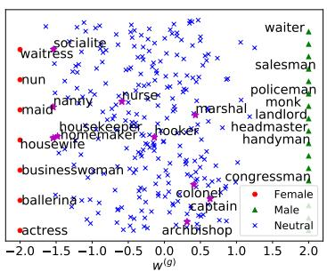
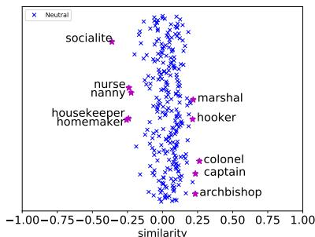
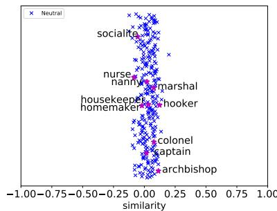

# Learning Gender-Neutral Word Embeddings

Jieyu Zhao

Yichao Zhou

Zeyu Li

Wei Wang

Kai-Wei Chang

University of California, Los Angeles

{jyzhao, yz, zyli, weiwang, kwchang}@cs.ucla.edu

# Abstract

Word embedding models have become a fundamental component in a wide range of Natural Language Processing (NLP) applications. However, embeddings trained on human-generated corpora have been demonstrated to inherit strong gender stereotypes that reflect social constructs. To address this concern, in this paper, we propose a novel training procedure for learning gender-neutral word embeddings. Our approach aims to preserve gender information in certain dimensions of word vectors while compelling other dimensions to be free of gender influence. Based on the proposed method, we generate a Gender-Neutral variant of GloVe (GN-GloVe). Quantitative and qualitative experiments demonstrate that GN-GloVe successfully isolates gender information without sacrificing the functionality of the embedding model.

# 1 Introduction

Word embedding models have been designed for representing the meaning of words in a vector space. These models have become a fundamental NLP technique and have been widely used in various applications. However, prior studies show that such models learned from humangenerated corpora are often prone to exhibit social biases, such as gender stereotypes (Bolukbasi et al., 2016; Caliskan et al., 2017). For example, the word “programmer” is neutral to gender by its definition, but an embedding model trained on a news corpus associates “programmer” closer with “male” than “female”.

Such a bias substantially affects downstream applications. Zhao et al. (2018) show that a coreference resolution system is sexist due to the word embedding component used in the system. This concerns the practitioners who use the embedding model to build gender-sensitive applications such

as a resume filtering system or a job recommendation system as the automated system may discriminate candidates based on their gender, as reflected by their name. Besides, biased embeddings may implicitly affect downstream applications used in our daily lives. For example, when searching for “computer scientist” using a search engine, as this phrase is closer to male names than female names in the embedding space, a search algorithm using an embedding model in the backbone tends to rank male scientists higher than females’, hindering women from being recognized and further exacerbating the gender inequality in the community.

To alleviate gender stereotype in word embeddings, Bolukbasi et al. (2016) propose a postprocessing method that projects gender-neutral words to a subspace which is perpendicular to the gender dimension defined by a set of genderdefinition words.1 However, their approach has two limitations. First, the method is essentially a pipeline approach and requires the gender-neutral words to be identified by a classifier before employing the projection. If the classifier makes a mistake, the error will be propagated and affect the performance of the model. Second, their method completely removes gender information from those words which are essential in some domains such as medicine and social science (Back et al., 2010; McFadden et al., 1992).

To overcome these limitations, we propose a learning scheme, Gender-Neutral Global Vectors (GN-GloVe) for training word embedding models with protected attributes (e.g., gender) based on GloVe (Pennington et al., 2014).2 GN-GloVe represents protected attributes in certain dimen-

sions while neutralizing the others during training. As the information of the protected attribute is restricted in certain dimensions, it can be removed from the embedding easily. By jointly identifying gender-neutral words while learning word vectors, GN-GloVe does not require a separate classifier to identify gender-neutral words; therefore, the error propagation issue is eliminated. The proposed approach is generic and can be incorporated with other word embedding models and be applied in reducing other societal stereotypes.

Our contributions are summarized as follows: 1) To our best knowledge, GN-GloVe is the first method to learn word embeddings with protected attributes; 2) By capturing protected attributes in certain dimensions, our approach ameliorates the interpretability of word representations; 3) Qualitative and quantitative experiments demonstrate that GN-GloVe effectively isolates the protected attributes and preserves the word proximity.

# 2 Related Work

Word Embeddings Word embeddings serve as a fundamental building block for a broad range of NLP applications (dos Santos and Gatti, 2014; Bahdanau et al., 2014; Zeng et al., 2015) and various approaches (Mikolov et al., 2013b; Pennington et al., 2014; Levy et al., 2015) have been proposed for training the word vectors. Improvements have been made by leveraging semantic lexicons and morphology (Luong et al., 2013; Faruqui et al., 2014), disambiguating multiple senses (Suster et al.ˇ , 2016; Arora et al., 2018; Upadhyay et al., 2017), and modeling contextualized information by deep neural networks (Peters et al., 2018). However, none of these works attempts to tackle the problem of stereotypes exhibited in embeddings.

Stereotype Analysis Implicit stereotypes have been observed in applications such as online advertising systems (Sweeney, 2013), web search (Kay et al., 2015), and online reviews (Wallace and Paul, 2016). Besides, Zhao et al. (2017) and Rudinger et al. (2018) show that coreference resolution systems are gender biased. The systems can successfully predict the link between “the president” with male pronoun but fail with the female one. Rudinger et al. (2017) use pointwise mutual information to test the SNLI (Bowman et al., 2015) corpus and demonstrate gender stereotypes as well as varying degrees of racial, re-

ligious, and age-based stereotypes in the corpus. A temporal analysis about word embeddings (Garg et al., 2018) captures changes in gender and ethnic stereotypes over time. Researchers attributed such problem partly to the biases in the datasets (Zhao et al., 2017; Yao and Huang, 2017) and word embeddings (Garg et al., 2017; Caliskan et al., 2017) but did not provide constructive solutions.

# 3 Methodology

In this paper, we take GloVe (Pennington et al., 2014) as the base embedding model and gender as the protected attribute. It is worth noting that our approach is general and can be applied to other embedding models and attributes. Following GloVe (Pennington et al., 2014), we construct a word-to-word co-occurrence matrix $X$ , denoting the frequency of the $j$ -th word appearing in the context of the $i$ -th word as $X _ { i , j }$ . $w , \tilde { w } \in \mathbb R ^ { d }$ stand for the embeddings of a center and a context word, respectively, where $d$ is the dimension.

In our embedding model, a word vector $w$ consists of two parts w = [w(a); w(g)]. w(a) ∈ Rd−k $\boldsymbol { w } = [ w ^ { ( a ) } ; w ^ { ( g ) } ]$ $\boldsymbol { w } ^ { ( a ) } \in \mathbb { R } ^ { d - k }$ and $w ^ { ( g ) } \in \bar { \mathbb { R } } ^ { k }$ stand for neutralized and gendered components respectively, where $k$ is the number of dimensions reserved for gender information.3 Our proposed gender neutralizing scheme is to reserve the gender feature, known as “protected attribute” into $w ^ { ( g ) }$ . Therefore, the information encoded in $w ^ { ( a ) }$ is independent of gender influence. We use $v _ { g } ~ \in ~ \mathbb { R } ^ { d - k }$ to denote the direction of gender in the embedding space. We categorize all the vocabulary words into three subsets: male-definition $\Omega _ { M }$ , female-definition $\Omega _ { F }$ , and gender-neutral $\Omega _ { N }$ , based on their definition in WordNet (Miller and Fellbaum, 1998).

Gender Neutral Word Embedding Our minimization objective is designed in accordance with above insights. It contains three components:

$$
J = J _ {G} + \lambda_ {d} J _ {D} + \lambda_ {e} J _ {E}, \tag {1}
$$

where $\lambda _ { d }$ and $\lambda _ { e }$ are hyper-parameters.

The first component $J _ { G }$ is originated from GloVe (Pennington et al., 2014), which captures the word proximity:

$$
J _ {G} = \sum_ {i, j = 1} ^ {V} f (X _ {i, j}) \left(w _ {i} ^ {T} \tilde {w} _ {j} + b _ {i} + \tilde {b} _ {j} - \log X _ {i, j}\right) ^ {2}.
$$

Here $f ( X _ { i , j } )$ is a weighting function to reduce the influence of extremely large co-occurrence frequencies. $b$ and $\tilde { b }$ are the respective linear biases for $w$ and $\tilde { w }$ .

The other two terms are aimed to restrict gender information in $w ^ { ( g ) }$ , such that $w ^ { ( a ) }$ is neutral. Given male- and female-definition seed words $\Omega _ { M }$ and $\Omega _ { F }$ , we consider two distant metrics and form two types of objective functions.

In $J _ { D } ^ { L 1 }$ , we directly minimizing the negative distances between words in the two groups:

$$
J _ {D} ^ {L 1} = - \left\| \sum_ {w \in \Omega_ {M}} w ^ {(g)} - \sum_ {w \in \Omega_ {F}} w ^ {(g)} \right\| _ {1}.
$$

In $J _ { D } ^ { L 2 }$ , we restrict the values of word vectors in $[ \beta _ { 1 } , \beta _ { 2 } ]$ and push $w ^ { ( g ) }$ into one of the extremes:

$$
J _ {D} ^ {L 2} = \sum_ {w \in \Omega_ {M}} \left\| \beta_ {1} \boldsymbol {e} - w ^ {(g)} \right\| _ {2} ^ {2} + \sum_ {w \in \Omega_ {F}} \left\| \beta_ {2} \boldsymbol {e} - w ^ {(g)} \right\| _ {2} ^ {2},
$$

where $e \in \mathcal { R } ^ { k }$ is a vector of all ones. $\beta _ { 1 }$ and $\beta _ { 2 }$ can be arbitrary values, and we set them to be 1 and $^ { - 1 }$ , respectively.

Finally, for words in $\Omega _ { N }$ , the last term encourages their $w ^ { ( a ) }$ to be retained in the null space of the gender direction $v _ { g }$ :

$$
J _ {E} = \sum_ {w \in \Omega_ {N}} \left(v _ {g} ^ {T} w ^ {(a)}\right) ^ {2},
$$

where $v _ { g }$ is estimating on the fly by averaging the differences between female words and their male counterparts in a predefined set,

$$
v _ {g} = \frac {1}{| \Omega^ {\prime} |} \sum_ {(w _ {m}, w _ {f}) \in \Omega^ {\prime}} (w _ {m} ^ {(a)} - w _ {f} ^ {(a)}),
$$

where $\Omega ^ { \prime }$ is a set of predefined gender word pairs.

We use stochastic gradient descent to optimize Eq. (1). To reduce the computational complexity in training the wording embedding, we assume $v _ { g }$ is a fixed vector (i.e., we do not derive gradient w.r.t $v _ { g }$ in updating $w ^ { ( a ) } , \forall w \in \Omega ^ { \prime } )$ and estimate $v _ { g }$ only at the beginning of each epoch.

# 4 Experiments

In this section, we conduct the following qualitative and quantitative studies: 1) We visualize the embedding space and show that GN-GloVe separates the protected gender attribute from other latent aspects; 2) We measure the ability of GN-GloVe to distinguish between gender-definition

words and gender-stereotype words on a newly annotated dataset; 3) We evaluate GN-GloVe on standard word embedding benchmark datasets and show that it performs well in estimating word proximity; 4) We demonstrate that GN-Glove reduces gender bias on a downstream application, coreference resolution.

We compare GN-GloVe with two embedding models, GloVe and Hard-GloVe. GloVe is a widely-used model (Pennington et al., 2014), and we apply the post-processing step introduced in (Bolukbasi et al., 2016) to reduce gender bias in GloVe and name it after Hard-GloVe. All the embeddings are trained on 2017 English Wikipedia dump with the default hyper-parameters decribed in (Pennington et al., 2014). When training GN-GloVe, we constrain the value of each dimension within $[ - 1 , 1 ]$ to avoid numerical difficulty. We set $\lambda _ { d }$ and $\lambda _ { e }$ both to be 0.8. In our preliminary study on development data, we observe that the model is not sensitive to these parameters. Unless other stated, we use $J _ { D } ^ { L 1 }$ in the GN-GloVe model.

Separate protected attribute First, we demonstrate that GN-GloVe preserves the gender association (either definitional or stereotypical associations) in $w ^ { ( g ) 4 }$ . To illustrate the distribution of gender information of different words, we plot Fig. 1a using $w ^ { ( g ) }$ for the $\mathbf { X }$ -axis and a random value for the y-axis to spread out words in the plot. As shown in the figure, the gender-definition words, e.g. “waiter” and “waitress”, fall far away from each other in $w ^ { ( g ) }$ . In addition, words such as “housekeeper” and “doctor” are inclined to different genders and their $w ^ { ( g ) }$ preserves such information.

Next, we demonstrate that GN-GloVe reduces gender stereotype using a list of profession titles from (Bolukbasi et al., 2016). All these profession titles are neutral to gender by definition. In Fig. 1b and Fig. 1c, we plot the cosine similarity between each word vector $w ^ { ( a ) }$ and the gender direction $v _ { g }$ (i.e., kwkkvg $\frac { w ^ { T } v _ { g } } { \| w \| \| v _ { g } \| } )$ wT vg . Result shows that words, such as “doctor” and “nurse”, possess no gender association by definition, but their GloVe word vectors exhibit strong gender stereotype. In contrast, the gender projects of GN-GloVe word vectors $w ^ { ( a ) }$ are closer to zero. This demonstrates

  
(a) $w ^ { ( g ) }$ dimension for all the professions

  
(b) Gender-neutral profession words projected to gender direction in GloVe

  
(c) Gender-neutral profession words projected to gender direction in GN-GloVe   
Figure 1: Cosine similarity between the gender direction and the embeddings of gender-neutral words. In each figure, negative values represent a bias towards female, otherwise male.

the gender information has been substantially diminished from $w ^ { ( a ) }$ in the GN-GloVe embedding.

We further quantify the gender information exhibited in the embedding models. For each model, we project the word vectors of occupational words into the gender sub-space defined by “he-she” and compute their average size. A larger projection indicates an embedding model is more biased. Results show that the average projection of GloVe is 0.080, the projection of Hard-GloVe is 0.019, and the projection of Gn-Glove is 0.052. Comparing with GloVe, GN-GloVe reduces the bias by $3 5 \%$ . Although Hard-GloVe contains less gender information, we will show later GN-GloVe can tell difference between gender-stereotype and genderdefinition words better.

Gender Relational Analogy To study the quality of the gender information present in each model, we follow SemEval 2012 Task2 (Jurgens et al., 2012) to create an analogy dataset, SemBias, with the goal to identify the correct analogy of “he - she” from four pairs of words. Each instance in the dataset consists of four word pairs: a genderdefinition word pair (Definition; e.g., “waiter - waitress”), a gender-stereotype word pair (Stereotyp; e.g., “doctor - nurse”) and two other pairs of words that have similar meanings (None; e.g., “dog - cat”, “cup - lid”)5. We consider 20 genderstereotype word pairs and 22 gender-definition word pairs and use their Cartesian product to generate 440 instances. Among the 22 genderdefinition word pairs, there are 2 word pairs that

Table 1: Percentage of predictions for each category on gender relational analogy task.   

<table><tr><td>Dataset</td><td>Embeddings</td><td>Definition</td><td>Stereotype</td><td>None</td></tr><tr><td rowspan="3">SemBias</td><td>GloVe</td><td>80.2</td><td>10.9</td><td>8.9</td></tr><tr><td>Hard-Glove</td><td>84.1</td><td>6.4</td><td>9.5</td></tr><tr><td>GN-GloVe</td><td>97.7</td><td>1.4</td><td>0.9</td></tr><tr><td rowspan="3">SemBias (subset)</td><td>GloVe</td><td>57.5</td><td>20</td><td>22.5</td></tr><tr><td>Hard-Glove</td><td>25</td><td>27.5</td><td>47.5</td></tr><tr><td>GN-GloVe</td><td>75</td><td>15</td><td>10</td></tr></table>

are not used as a seed word during the training. To test the generalization ability of the model, we generate a subset of data (SemBias (subset)) of 40 instances associated with these 2 pairs.

Table 1 lists the percentage of times that each class of pair is on the top based on a word embedding model (Mikolov et al., 2013c). GN-GloVe achieves $9 7 . 7 \%$ accuracy in identifying genderdefinition word pairs as an analogy to “he - she”. In contrast, GloVe and Hard-GloVe makes significantly more mistakes. On the subset, GN-GloVe also achieves significantly better performance than Hard-Glove and GloVe, indicating that it can generalize the gender pairs on the training set to identify other gender-definition word pairs.

Word Similarity and Analogy In addition, we evaluate the word embeddings on the benchmark tasks to ensure their quality. The word similarity tasks measure how well a word embedding model captures the similarity between words comparing to human annotated rating scores. Embeddings are tested on multiple datasets: WS353-ALL (Finkelstein et al., 2001), RG-65 (Rubenstein and Goodenough, 1965), MTurk-287 (Radinsky et al., 2011), MTurk-771 (Halawi et al., 2012), RW (Luong et al., 2013), and MEN-TR-3k (Bruni et al., 2012)

Table 2: Results on the benchmark datasets. Performance is measured in accuracy and in Spearman rank correlation for word analogy and word similarity tasks, respectively.   

<table><tr><td rowspan="2">Embeddings</td><td colspan="2">Analogy</td><td colspan="6">Similarity</td></tr><tr><td>Google</td><td>MSR</td><td>WS353-ALL</td><td>RG-65</td><td>MTurk-287</td><td>MTurk-771</td><td>RW</td><td>MEN-TR-3k</td></tr><tr><td>GloVe</td><td>70.8</td><td>45.8</td><td>62.0</td><td>75.3</td><td>64.8</td><td>64.9</td><td>37.3</td><td>72.2</td></tr><tr><td>Hard-GloVe</td><td>70.8</td><td>45.8</td><td>61.2</td><td>74.8</td><td>64.4</td><td>64.8</td><td>37.3</td><td>72.2</td></tr><tr><td>GN-GloVe-L1</td><td>68.9</td><td>43.7</td><td>62.8</td><td>74.1</td><td>66.2</td><td>66.2</td><td>40.0</td><td>74.5</td></tr><tr><td>GN-GloVe-L2</td><td>68.8</td><td>43.6</td><td>62.5</td><td>76.4</td><td>66.8</td><td>65.6</td><td>39.3</td><td>74.4</td></tr></table>

datasets. The analogy tasks are to answer the question $^ { 6 6 } A$ is to $B$ as $C$ is to ?” by finding a word vector $w$ that is closest to $w _ { A } - w _ { B } + w _ { C }$ in the embedding space. Google (Mikolov et al., 2013a) and MSR (Mikolov et al., 2013c) datasets are utilized for this evaluation. The results are shown in Table 2, where the suffix “-L1” and “-L2” of GN-GloVe stand for the GN-GloVe using $J _ { D } ^ { L 1 }$ and $J _ { D } ^ { L 2 }$ , respectively. Compared with others, GN-GloVe achieves a higher accuracy in the similarity tasks and its analogy score slightly drops indicating that GN-GloVe is capable of preserving proximity among words.

Coreference Resolution Finally, we investigate how the gender bias in word embeddings affects a downstream application, such as coreference resolution. Coreference resolution aims at clustering the denotative noun phrases referring to the same entity in the given text. We evaluate our models on the Ontonotes 5.0 (Weischedel et al., 2012) benchmark dataset and the WinoBias dataset (Zhao et al., 2018).6 In particular, the WinoBias dataset is composed of pro-stereotype (PRO) and antistereotype (ANTI) subsets. The PRO subset consists of sentences where a gender pronoun refers to a profession, which is dominated by the same gender. Example sentences include “The CEO raised the salary of the receptionist because he is generous.” In this sentence, the pronoun “he” refers to “CEO” and this reference is consistent with societal stereotype. The ANTI subset contains the same set of sentences, but the gender pronoun in each sentence is replaced by the opposite gender. For instance, the gender pronoun “he” is replaced by “she” in the aforementioned example. Despite the sentence is almost identical, the gender pronoun now refers to a profession that is less represented by the gender. Details about the dataset are in (Zhao et al., 2018).

Table 3: F1 score $( \% )$ on the coreference system.   

<table><tr><td>Embeddings</td><td>OntoNotes-test</td><td>PRO</td><td>ANTI</td><td>Avg</td><td>Diff</td></tr><tr><td>GloVe</td><td>66.5</td><td>76.2</td><td>46.0</td><td>61.1</td><td>30.2</td></tr><tr><td>Hard-Glove</td><td>66.2</td><td>70.6</td><td>54.9</td><td>62.8</td><td>15.7</td></tr><tr><td>GN-GloVe</td><td>66.2</td><td>72.4</td><td>51.9</td><td>62.2</td><td>20.5</td></tr><tr><td>GN-GloVe(wa)</td><td>65.9</td><td>70.0</td><td>53.9</td><td>62.0</td><td>16.1</td></tr></table>

We train the end-to-end coreference resolution model (Lee et al., 2017) with different word embeddings on OntoNote and report their performance in Table 3. For the WinoBias dataset, we also report the average (Avg) and absolute difference (Diff) of F1 scores on two subsets. A smaller Diff value indicates less bias in a system. Results show that GN-GloVe achieves comparable performance as Glove and Hard-GloVe on the OntoNotes dataset while distinctly reducing the bias on the WinoBias dataset. When only the $\mathbf { \chi } _ { w } ( a )$ potion of the embedding is used in representing words, ${ \mathrm { G N - G l o V e } } ( w ^ { ( a ) } )$ further reduces the bias in coreference resolution.

# 5 Conclusion and Discussion

In this paper, we introduced an algorithm for training gender-neutral word embedding. Our method is general and can be applied in any language as long as a list of gender definitional words is provided as seed words (e.g., gender pronouns). Future directions include extending the proposed approach to model other properties of words such as sentiment and generalizing our analysis beyond binary gender.

# Acknowledgement

This work was supported by National Science Foundation Grant IIS-1760523. We would like to thank James Zou, Adam Kalai, Tolga Bolukbasi, and Venkatesh Saligrama for helpful discussion, and anonymous reviewers for their feedback.

# References

Sanjeev Arora, Yuanzhi Li, Yingyu Liang, Tengyu Ma, and Andrej Risteski. 2018. Linear algebraic structure of word senses, with applications to polysemy. Transactions of the Association of Computational Linguistics, 6:483–495.   
Sudie E Back, Rebecca L Payne, Annie N Simpson, and Kathleen T Brady. 2010. Gender and prescription opioids: Findings from the national survey on drug use and health. Addictive behaviors, 35(11):1001–1007.   
Dzmitry Bahdanau, Kyunghyun Cho, and Yoshua Bengio. 2014. Neural machine translation by jointly learning to align and translate. arXiv preprint arXiv:1409.0473.   
Tolga Bolukbasi, Kai-Wei Chang, James Y Zou, Venkatesh Saligrama, and Adam T Kalai. 2016. Man is to computer programmer as woman is to homemaker? debiasing word embeddings. In Advances in Neural Information Processing Systems, pages 4349–4357.   
Samuel R. Bowman, Gabor Angeli, Christopher Potts, and Christopher D. Manning. 2015. A large annotated corpus for learning natural language inference. In Proceedings of the 2015 Conference on Empirical Methods in Natural Language Processing (EMNLP). Association for Computational Linguistics.   
Elia Bruni, Gemma Boleda, Marco Baroni, and Nam-Khanh Tran. 2012. Distributional semantics in technicolor. In Proceedings of the 50th Annual Meeting of the Association for Computational Linguistics: Long Papers-Volume 1, pages 136–145.   
Aylin Caliskan, Joanna J Bryson, and Arvind Narayanan. 2017. Semantics derived automatically from language corpora contain human-like biases. Science, 356(6334):183–186.   
Manaal Faruqui, Jesse Dodge, Sujay K Jauhar, Chris Dyer, Eduard Hovy, and Noah A Smith. 2014. Retrofitting word vectors to semantic lexicons. arXiv preprint arXiv:1411.4166.   
Lev Finkelstein, Evgeniy Gabrilovich, Yossi Matias, Ehud Rivlin, Zach Solan, Gadi Wolfman, and Eytan Ruppin. 2001. Placing search in context: The concept revisited. In Proceedings of the 10th international conference on World Wide Web, pages 406– 414.   
Nikhil Garg, Londa Schiebinger, Dan Jurafsky, and James Zou. 2017. Word embeddings quantify 100 years of gender and ethnic stereotypes. arXiv preprint arXiv:1711.08412.   
Nikhil Garg, Londa Schiebinger, Dan Jurafsky, and James Zou. 2018. Word embeddings quantify 100 years of gender and ethnic stereotypes. Proceedings of the National Academy of Sciences, 115(16):E3635–E3644.

Guy Halawi, Gideon Dror, Evgeniy Gabrilovich, and Yehuda Koren. 2012. Large-scale learning of word relatedness with constraints. In Proceedings of the 18th ACM SIGKDD international conference on Knowledge discovery and data mining, pages 1406– 1414. ACM.   
David A Jurgens, Peter D Turney, Saif M Mohammad, and Keith J Holyoak. 2012. Semeval-2012 task 2: Measuring degrees of relational similarity. In Proceedings of the First Joint Conference on Lexical and Computational Semantics-Volume 1: Proceedings of the main conference and the shared task, and Volume 2: Proceedings of the Sixth International Workshop on Semantic Evaluation, pages 356–364. Association for Computational Linguistics.   
Matthew Kay, Cynthia Matuszek, and Sean A Munson. 2015. Unequal representation and gender stereotypes in image search results for occupations. In Human Factors in Computing Systems, pages 3819– 3828.   
Kenton Lee, Luheng He, Mike Lewis, and Luke Zettlemoyer. 2017. End-to-end neural coreference resolution. EMNLP.   
Omer Levy, Yoav Goldberg, and Ido Dagan. 2015. Improving distributional similarity with lessons learned from word embeddings. Transactions of the Association for Computational Linguistics, 3:211–225.   
Thang Luong, Richard Socher, and Christopher Manning. 2013. Better word representations with recursive neural networks for morphology. In Proceedings of the Seventeenth Conference on Computational Natural Language Learning, pages 104–113.   
Anna C McFadden, George E Marsh, Barrie Jo Price, and Yunhan Hwang. 1992. A study of race and gender bias in the punishment of school children. Education and treatment of children, pages 140–146.   
Tomas Mikolov, Kai Chen, Greg Corrado, and Jeffrey Dean. 2013a. Efficient estimation of word representations in vector space. arXiv preprint arXiv:1301.3781.   
Tomas Mikolov, Ilya Sutskever, Kai Chen, Greg S Corrado, and Jeff Dean. 2013b. Distributed representations of words and phrases and their compositionality. In Advances in neural information processing systems, pages 3111–3119.   
Tomas Mikolov, Wen-tau Yih, and Geoffrey Zweig. 2013c. Linguistic regularities in continuous space word representations. In Proceedings of the 2013 Conference of the North American Chapter of the Association for Computational Linguistics: Human Language Technologies, pages 746–751.   
George Miller and Christiane Fellbaum. 1998. Wordnet: An electronic lexical database.

Jeffrey Pennington, Richard Socher, and Christopher Manning. 2014. Glove: Global vectors for word representation. In Proceedings of the 2014 conference on empirical methods in natural language processing (EMNLP), pages 1532–1543.   
Matthew E Peters, Mark Neumann, Mohit Iyyer, Matt Gardner, Christopher Clark, Kenton Lee, and Luke Zettlemoyer. 2018. Deep contextualized word representations. arXiv preprint arXiv:1802.05365.   
Kira Radinsky, Eugene Agichtein, Evgeniy Gabrilovich, and Shaul Markovitch. 2011. A word at a time: computing word relatedness using temporal semantic analysis. In Proceedings of the 20th international conference on World wide web, pages 337–346.   
Herbert Rubenstein and John B Goodenough. 1965. Contextual correlates of synonymy. Communications of the ACM, 8(10):627–633.   
Rachel Rudinger, Chandler May, and Benjamin Van Durme. 2017. Social bias in elicited natural language inferences. In Proceedings of the First ACL Workshop on Ethics in Natural Language Processing, pages 74–79.   
Rachel Rudinger, Jason Naradowsky, Brian Leonard, and Benjamin Van Durme. 2018. Gender bias in coreference resolution. In NAACL.   
Cicero dos Santos and Maira Gatti. 2014. Deep convolutional neural networks for sentiment analysis of short texts. In Proceedings of COLING 2014, the 25th International Conference on Computational Linguistics: Technical Papers, pages 69–78.   
Simon Suster, Ivan Titov, and Gertjan Van Noord. ˇ 2016. Bilingual learning of multi-sense embeddings with discrete autoencoders. arXiv preprint arXiv:1603.09128.   
Latanya Sweeney. 2013. Discrimination in online ad delivery. Queue, 11(3):10.   
Shyam Upadhyay, Kai-Wei Chang, Matt Taddy, Adam Kalai, and James Zou. 2017. Beyond bilingual: Multi-sense word embeddings using multilingual context. In Proceedings of the 2nd Workshop on Representation Learning for NLP, pages 101–110.   
Byron C Wallace and Michael J Paul. 2016. jerk or judgemental? patient perceptions of male versus female physicians in online reviews.   
Ralph Weischedel, Sameer Pradhan, Lance Ramshaw, Jeff Kaufman, Michelle Franchini, Mohammed El-Bachouti, Nianwen Xue, Martha Palmer, Jena D Hwang, Claire Bonial, et al. 2012. Ontonotes release 5.0.   
Sirui Yao and Bert Huang. 2017. Beyond parity: Fairness objectives for collaborative filtering. In Advances in Neural Information Processing Systems, pages 2925–2934.

Daojian Zeng, Kang Liu, Yubo Chen, and Jun Zhao. 2015. Distant supervision for relation extraction via piecewise convolutional neural networks. In Proceedings of the 2015 Conference on Empirical Methods in Natural Language Processing, pages 1753– 1762.   
Jieyu Zhao, Tianlu Wang, Mark Yatskar, Vicente Ordonez, and Kai-Wei Chang. 2017. Men also like shopping: Reducing gender bias amplification using corpus-level constraints. arXiv preprint arXiv:1707.09457.   
Jieyu Zhao, Tianlu Wang, Mark Yatskar, Vicente Ordonez, and Kai-Wei Chang. 2018. Gender bias in coreference resolution: Evaluation and debiasing methods. NAACL.