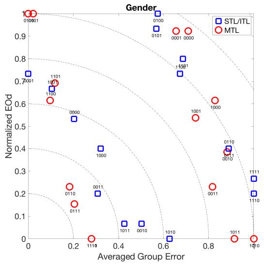
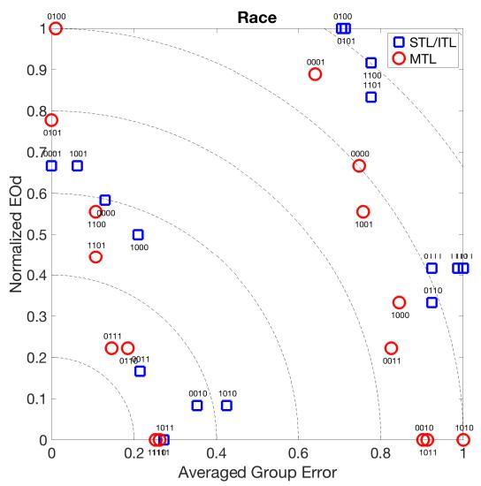
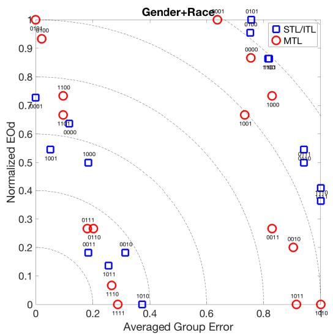
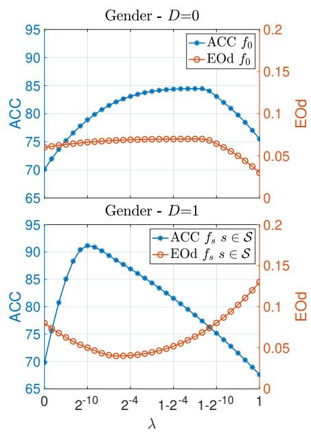
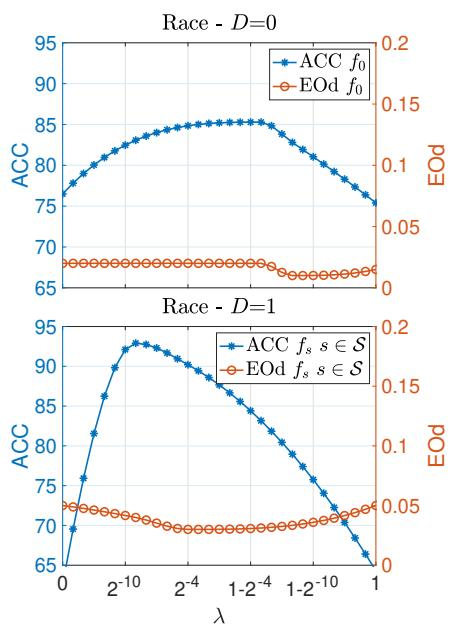
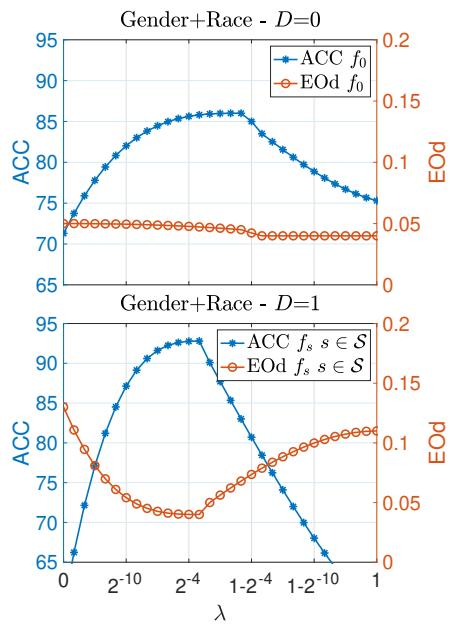

# Taking Advantage of Multitask Learning for Fair Classification

Luca Oneto

University of Genoa

Genoa, Italy

luca.oneto@unige.it

Amon Elders

Istituto Italiano di Tecnologia

Genoa, Italy

amonelders@gmail.com

Michele Donini

Istituto Italiano di Tecnologia

Genoa, Italy

michele.donini@iit.it

Massimiliano Pontil

Istituto Italiano di Tecnologia

Genoa, Italy

and

University College London

London, UK

massimiliano.pontil@iit.it

# ABSTRACT

A central goal of algorithmic fairness is to reduce bias in automated decision making. An unavoidable tension exists between accuracy gains obtained by using sensitive information (e.g., gender or ethnic group) as part of a statistical model, and any commitment to protect these characteristics. Often, due to biases present in the data, using the sensitive information in the functional form of a classifier improves classification accuracy. In this paper we show how it is possible to get the best of both worlds: optimize model accuracy and fairness without explicitly using the sensitive feature in the functional form of the model, thereby treating different individuals equally. Our method is based on two key ideas. On the one hand, we propose to use Multitask Learning (MTL), enhanced with fairness constraints, to jointly learn group specific classifiers that leverage information between sensitive groups. On the other hand, since learning group specific models might not be permitted, we propose to first predict the sensitive features by any learning method and then to use the predicted sensitive feature to train MTL with fairness constraints. This enables us to tackle fairness with a three-pronged approach, that is, by increasing accuracy on each group, enforcing measures of fairness during training, and protecting sensitive information during testing. Experimental results on two real datasets support our proposal, showing substantial improvements in both accuracy and fairness.

# 1 INTRODUCTION

In recent years there has been a lot of interest in the problem of enhancing learning methods with “fairness” requirements, see [1– 4 8–10 12 17 19 20 22–26 28 30 31 35–39] and references therein. The general aim is to ensure that sensitive information (e.g. knowledge about gender or ethnic group of an individual) does not “unfairly” influence the outcome of a learning algorithm. For example, if the learning problem is to predict what salary a person should earn based on her skills and previous employment records, we would like

to build a model which does not unfairly use additional sensitive information such as gender or race.

A central question is how sensitive information should be used during the training and testing phases of a model. From a statistical perspective, sensitive information can improve model performance: removing this information may result in a less accurate model, without necessarily improving the fairness of the solution, [17 29 36]. However, it is well known, that in some jurisdictions using different classifiers, either explicitly or implicitly, for members of different groups, may not be permitted, we refer to the remark at page 3 in [17] and references therein. These imply that we can access the sensitive information during the training phase of a model but not during the testing phase. Our principal objective is then to optimize model accuracy while still protecting sensitive information in the data.

As a first step towards not discriminating minority groups we focus on maximizing average accuracy with respect to each group as opposed to maximizing the overall accuracy [14]. For the underlying generic learning method, we consider both Single Task Learning (STL) and Independent Task Learning (ITL). While the latter independently learns a different function for each group, the former aims to learn a function that is common between all groups. A well-known weakness of these methods is that they tend to generalize poorly on smaller groups: while STL may learn a model which better represents the largest group, ITL may overfit minority groups [7]. A common approach to overcome such limitations is offered by Multitask Learning (MTL), see [5–7 13 18] and references therein. This methodology leverages information between the groups (tasks) to learn more accurate models. Surprisingly, to the best of our knowledge, MTL has received little attention in the algorithmic fairness domain. We are only aware of the work [17] which proposes to learn different classifiers per group, combined with MTL to ameliorate the issue of potentially having too little data on minority groups.

We build upon a particular instance of MTL which jointly learns a shared model between the groups as well as a specific model per group. We show how fairness constraints, measured with Equalized Odds or Equal Opportunities introduced in [20], can be built in MTL

directly during the training phase. This is in contrast to other approaches which impose the fairness constraint as a post-processing step [10 19 20 31] or by modifying the data representation before employing standard machine learning methods [1 12 22–24 39]. In many recent works $\left[ 2 \mathrm { - } 4 \ 8 \ 9 \ 1 6 \ 1 7 \ 1 7 \ 2 5 \ 2 6 \ 2 8 \ 3 0 \ 3 5 \mathrm { - } 3 8 \right]$ it has been shown how to enforce these constraints during the learning phase of a classifier. Here we opt for the approach proposed in [16] since it is convex, theoretically grounded, and performs favorably against state-of-the-art alternatives. We present experiments on two real-datasets which demonstrate that the shared classifier learned by MTL works better than STL and in turn MTL’s group specific classifiers perform better than both ITL as well as the shared MTL model. These results are in line with previous studies on MTL, which suggest the benefit offered by this methodology, see [15 18 27] and references therein. Moreover, we observe that the fairness constraint is effective in controlling the fairness measure.

Unfortunately, as remarked before, all the models which employ the sensitive feature in the testing phase may not be adoptable. Independent models cannot be employed since we are using different classifiers for members of different groups. Even the shared model may not be a feasible option, if the sensitive feature is used as a predictor (e.g. if the model is linear, including the sensitive feature entails using a group specific threshold). Therefore, the only feasible1 option would be to learn a shared model based on the non-sensitive features. This constraint may limit our ability to learn classifiers of high generalization ability. In order to over-

$$
\begin{array}{ccc}(\boldsymbol {x},s) & \longrightarrow & f_{s}(\boldsymbol {x})\\ \underset {\text{Algothm}}{\text{Any}}\Big{\downarrow}\\ (\boldsymbol {x},g(\boldsymbol {x})) & \stackrel {\text{Fair MTL}}{\longrightarrow} & f_{g(\boldsymbol {x})}(\boldsymbol {x}) \end{array} \checkmark
$$

Figure 1: Our proposal in a graphical abstract: rather than using the sensitive feature  as a predictor we propose to learn, with any learning algorithm, a function $g _ { \mathrm { . } }$ , which captures the relationship between $\pmb { x }$ and , and then use $g ( { \pmb x } ) _ { \pmb { \bot \chi } }$ , instead of , to learn group specific models via MTL.

come such limitations, we propose to first use the non-sensitive features to predict the value of the sensitive one and then use the predicted sensitive feature to learn group specific models via MTL. The proposal is depicted in the graphical abstract of Figure 1. We experimentally demonstrate that the proposed approach matches the classification accuracy of the best performing model which uses the sensitive information during testing, in addition to further improving upon measures of fairness.

The rest of the paper is organized as follows. Section 2 presents some preliminary definitions and notions concerning the fair classification framework. Section 3 outlines the central problem that we face in the paper: exploiting the sensitive feature while still treating different groups equally. Section 4 presents our proposal: predicting the sensitive feature based on the non-sensitive ones and

then exploiting MTL with fairness constraints in order to increase both accuracy and fairness measures (see Figure 1). In Section 5 we test the proposal on two well known fairness related datasets (Adult and COMPAS) demonstrating the potentiality of it. We conclude the paper with a brief discussion in Section 6.

# 2 PRELIMINARIES

We let $\mathcal { D } \mathrm { = } \{ ( \boldsymbol { x } _ { 1 } , \boldsymbol { s } _ { 1 } , \boldsymbol { y } _ { 1 } ) , \ . \ . \ , ( \boldsymbol { x } _ { n } , \boldsymbol { s } _ { n } , \boldsymbol { y } _ { n } ) \}$ be a training set formed by $n$ x , s ,y , . . . , xn, sn,ynsamples drawn independently from an unknown probability distribution $\mu$ over $\chi _ { \times S \times y }$ , where $y = \{ - 1 , + 1 \}$ is the set of binary output labels, $S { = } \{ 1 , \ldots , k \}$ represents group membership, and $\chi$ is the input space.

For every $t \in S$ and operator $\diamond \in \{ - , + \}$ , we define the subset of training points with sensitive feature equal to $t$ as $\mathcal { D } _ { t } \mathbf { = } \{ ( \boldsymbol { x } , \boldsymbol { s } , y ) :$ $( \boldsymbol { x } , \boldsymbol { s } , \boldsymbol { y } ) { \in } \mathcal { D } , \boldsymbol { s } { = } t \}$ tand the subset of training point negatively and x, s, y , s tpositively labeled with sensitive feature equal to $t$ as $\mathcal { D } _ { t } ^ { \circ } \mathbf { = } \{ ( \boldsymbol { { \mathbf { x } } } , s , y ) :$ $( \boldsymbol { x } , \boldsymbol { s } , \boldsymbol { y } ) { \in } \mathcal { D }$ = $\scriptstyle { y = \circ 1 } \}$ . We also let $n _ { t } = \lvert \mathcal { D } _ { t } \rvert$ tand for $\diamond \in \{ - , + \}$ , y, we x ,let $n _ { t } ^ { \circ } { = } | \mathcal { D } _ { t } ^ { \circ } |$ s.

nt tLet us consider a function (or model) $f : X { \times } S {  } \mathbb { R }$ chosen from a set $\mathcal { F }$ fof possible models. The error (risk) of $f$ is measured by a prescribed loss function $\ell : \mathbb { R } \times y \to \mathbb { R }$ f. The average accuracy with respect to each group of a model $L ( f )$ , together with its empirical counterparts $\widehat { L } ( \bar { f } )$ L f, are defined respectively as

$$
L (f) = \frac {1}{k} \sum_ {t \in \mathcal {S}} L _ {t} (f), \quad L _ {t} (f) = \mathbb {E} [ \ell (f (\boldsymbol {x}, s, y) \mid s = t ], t \in \mathcal {S},
$$

and

$$
\widehat {L} (f) = \frac {1}{k} \sum_ {t \in \mathcal {S}} \widehat {L} _ {t} (f), \quad \widehat {L} _ {t} (f) = \frac {1}{n _ {t}} \sum_ {(\boldsymbol {x}, s, y) \in \mathcal {D} _ {t}} \ell (f (\boldsymbol {x}, s), y), t \in \mathcal {S}.
$$

The fairness of the model can be measured w.r.t. many notions of fairness as mentioned in Section 1. In this work we choose to opt for the Equal Opportunity (EOp) and the Equal Odds (EOd). For $\diamond \in \{ - , + \}$ , the $\mathrm { E O p } ^ { \circ }$ constraint is defined as [20]

$$
\mathbb {P} \{f (\boldsymbol {x}, s) > 0 \mid s = 1, y = \diamond 1 \} = \dots = \mathbb {P} \{f (\boldsymbol {x}, s) > 0 \mid s = k, y = \diamond 1 \}, \tag {1}
$$

where $\diamond \in \{ - , + \}$ . The EOd, instead is just the concurrent verification of the $\mathrm { E O p ^ { + } }$ and $\mathrm { E O p ^ { - } }$ , then $\forall \diamond \in \{ - , + \}$

$$
\mathbb {P} \{f (\boldsymbol {x}, s) > 0 \mid s = 1, y = \diamond 1 \} = \dots = \mathbb {P} \{f (\boldsymbol {x}, s) > 0 \mid s = k, y = \diamond 1 \}. \tag {2}
$$

Since a model $f$ , in general, will not be able to exactly fulfill the $\mathrm { E O p ^ { + } }$ with $\diamond \in \{ - , + \}$ nor the EOd constraints we define the Difference of $\mathrm { E O p } ^ { \circ }$ , (DEOp⋄) with $\diamond \in \{ - , + \}$ as

$$
\mathrm {D E O p} ^ {\diamond} = \sum_ {t \in S} \left| \mathbb {P} \{\hat {y} = y | s = t, y = \diamond 1 \} - \frac {1}{| S |} \sum_ {t ^ {\prime} \in S} \mathbb {P} \{\hat {y} = y | s = t ^ {\prime}, y = \diamond 1 \} \right|,
$$

where ${ \hat { y } } = \operatorname { s i g n } ( f ( \mathbf { \boldsymbol { x } } , { \boldsymbol { s } } ) )$ . Finally, the Difference of EOd (DEOd) is ydefined as

$$
\mathrm {D E O d} = \frac {\mathrm {D E O p} ^ {+} + \mathrm {D E O p} ^ {-}}{2}.
$$

# 3 PARADIGM

A central problem, when learning a model $f$ from data under fairfness requirements, is that using a different classification method, or even using different weights on attributes for members of different groups may not be allowed for certain classification tasks [17]. In other words, it may not be permitted to use the sensitive feature

explicitly or implicitly in the functional form of the model2. This means that $f$ should be a function of $_ { x }$ only, that is, $f ( { \pmb x } , s ) = f ( { \pmb x } )$

fFor instance, if $\chi = \mathbb { R } ^ { d }$ x f x, s f xand the sensitive feature is encoded with a one-hot encoding, and we use a linear classifier then

$$
f (\boldsymbol {x}, s) = \boldsymbol {w} \cdot \boldsymbol {x} + b _ {s}, \quad \boldsymbol {w} \in \mathbb {R} ^ {d}, b _ {s} \in \mathbb {R},
$$

which is forbidden since the model involves a different bias for each of the sensitive groups. The problem is even more apparent when we use a different model per each group, namely we set

$$
f (\boldsymbol {x}, s) = \boldsymbol {w} _ {s} \cdot \boldsymbol {x} + b _ {s}, \quad \boldsymbol {w} _ {s} \in \mathbb {R} ^ {d}, b _ {s} \in \mathbb {R}. \tag {3}
$$

Unfortunately, the above requirement can be highly constraining, resulting in a model with poor accuracy. In practice, due to bias present in the data, learning a model which involves the sensitive feature in its functional form may substantially improve model accuracy.

Our proposal to overcome the above limitation is to use the input $\pmb { x }$ to predict the sensitive group . That is, we learn a function $g :$ $\chi \to S$ , such that ${ \hat { s } } = g ( { \pmb x } )$ s д is the prediction of the sensitive feature of $\pmb { x }$ s д x. Therefore, our method replaces the specific model $f ( { \pmb x } , s )$ with xthe composite model $h ( \boldsymbol { x } ) \equiv f ( \boldsymbol { x } , g ( \boldsymbol { x } ) )$ f x, s, thereby treating different h x findividuals equally. Indeed if $( x , t )$ x and $( x ^ { \prime } , t ^ { \prime } )$ are two instances, then $h ( x ) \approx h ( x ^ { \prime } )$ provided $x \approx x ^ { \prime }$ irrespective of the values of $t$ and $t ^ { \prime }$ . Hence, we can freely use $\hat { s }$ in the functional since, during the t stesting phase, we do not require any knowledge of . As we shall see, on the one hand, in the regions of the input space where the classifier $g$ predicts well, this approach allows us to exploit MTL to learn group specific models. On the other hand, when the prediction error is high, this approach acts as a randomization procedure3 which, as we will empirically show, improves the fairness measure of the overall model.

In this paper we investigate (i) the effect of having the sensitive feature as part of the functional form of the model, (ii) the effect of using a shared model between the groups or a different model per group, (iii) the effect of learning a shared model with STL or MTL and the effect of learning group specific models with ITL or MTL, and (iv) the effect of using the predicted sensitive feature instead of its actual value inside the functional form of the model. Then we will show that it is possible to take the best result of the different approaches with substantial benefits in terms of both model accuracy and fairness, while still treating different individuals equally.

# 4 METHODOLOGY

In this section, we describe our approach to learning fair and accurate models and highlight the connection to MTL [18]. We consider the following functional form

$$
f (\boldsymbol {x}, s) = \boldsymbol {w} \cdot \phi (\boldsymbol {x}, s), \quad (\boldsymbol {x}, s) \in \mathcal {X} \times \mathcal {S}, \tag {4}
$$

where “ · ” is the inner product between two vectors in a Hilbert space4 H, ${ \pmb w } \in \mathbb { H }$ is a vector of parameters, and $\phi : \mathcal { X } \times \mathcal { S }  \mathbb { H }$ is a wprescribed feature mapping5.

We can then learn the parameter vector $\pmb { w }$ by regularized emwpirical risk minimization, using the square Euclidean norm of the parameter vector $\| \pmb { w } \| ^ { 2 }$ as the regularizer. The generality of this wapproach comes from the general form of the feature mapping $\phi : \chi { \times } S {  } \mathbb { H }$ which may be implicitly defined by a kernel function, see e.g. [33 34] and references therein. In the following, first we will briefly discuss three approaches for learning the parameter vector which correspond to the three methods investigated in this paper. Then, we will explain how these methods can be enhanced with fairness constraints.

# 4.1 Single Task Learning

As we argued above, we may not be allowed to explicitly use the sensitive feature in the functional form of the model. A simple approach to overcome this problem, would be to train a shared model between the groups, that is, we choose $\phi ( { \pmb x } , s ) { = } \varphi ( { \pmb x } )$ and ${ \boldsymbol { w } } { = } { \boldsymbol { w } } _ { 0 }$ in Eq. (4), where $\varphi : { \mathcal { X } } \mathrm { \longrightarrow } \mathbb { H }$ and $\pmb { w } _ { 0 } \in \mathbb { H }$ ϕ x,, so that $f ( \pmb { x } , s ) { = } \pmb { w } _ { 0 } \cdot$ $\pmb { \varphi } ( \pmb { x } )$ φ w f x, s w (a potentially unregularized threshold may be built in the φ xfeature map to include a bias term). We learn the model parameters by solving the Tikhonov regularization problem6

$$
\min  _ {\boldsymbol {w} _ {0} \in \mathbb {H}} \quad \hat {L} (\boldsymbol {w} _ {0}) + \rho \| \boldsymbol {w} _ {0} \| ^ {2}, \tag {5}
$$

where $\rho { \in } [ 0 , \infty )$ is a regularization parameter. This method, which ρ ,we will call Single Task Learning (STL), searches for the linear separator which minimizes a trade-off between the empirical average risk per group and the complexity (smoothness) of the models.

As we shall see in our experiments below, STL performs poorly, because it does not capture variance across groups. A slight variation which may improve performance is to introduce group specific thresholds. However, we remark again that this approach may not be permitted. Specifically, we choose $\phi ( { \pmb x } , s ) { = } ( \varphi ( { \pmb x } ) , { \pmb e } _ { s } )$ and $\scriptstyle \pmb { w = } ( w _ { 0 } , \mathbf { b } )$ where $e _ { 1 } , \ldots , e _ { S }$ sare the canonical basis vectors in $\mathbb { R } ^ { k }$ wand $\mathbf { b } { = } ( b _ { 1 } , \ldots , b _ { k } ) { \in } \mathbb { R } ^ { k }$ . , eS, so that $f ( \pmb { x } , s ) = \pmb { w } _ { 0 } \cdot \pmb { \varphi } ( \pmb { x } ) + b _ { s }$ .

# 4.2 Independent Task Learning

An approach to overcome the potentially underfitting performance of STL is to learn different models for each of the groups, we refer to this approach as independent task learning (ITL). It corresponds to setting $\scriptstyle \phi ( { \pmb x } , s ) = ( { \bf 0 } _ { s - 1 } , \varphi ( { \pmb x } ) , { \bf 0 } _ { k - s } )$ and $\pmb { w } \mathbf { = } ( w _ { 1 } , \dots , w _ { k } )$ in Eq. (4), where $\varphi :  { \mathcal { X } } \to \mathbb { H }$ sand ${ \pmb w } _ { s } \in \mathbb { H } \ \forall s \in { \pmb S }$ w, so that $f ( \pmb { x } , s ) \mathbf { = } \pmb { w } _ { s } \cdot \pmb { \varphi } ( \pmb { x } )$ . As φ ws s f x, s ws φ xbefore, the feature map may account for a constant component to accommodate a threshold for each of the groups. To find the vectors $w _ { s }$ we solve $k$ independent Tikhonov regularization problems of wsthe form

$$
\min  _ {\boldsymbol {w} _ {s} \in \mathbb {H}} \quad \hat {L} _ {s} \left(\boldsymbol {w} _ {s}\right) + \rho \| \boldsymbol {w} _ {s} \| ^ {2}. \tag {6}
$$

Note that, similar to STL, if we substitute $\hat { s }$ to $s$ in this last functional s sform then the method treats members of different groups equally,

since , as we mentioned before, learning independent models may not be allowed. Furthermore, we remark that from a statistical point of view, minority groups (small sample sizes) will be prone to overfitting. Nevertheless, as we shall see, ITL works better than STL in our experiments, suggesting that there is a lot of bias in the data. Still one would expect that by leveraging similarities between the groups ITL can be further improved. We discuss this next.

# 4.3 Multitask Learning

Let us now discuss the multitask learning approach used in the paper, which is based on regularization around a common mean [18]. We choose $\phi ( { \pmb x } , s ) { = } ( \varphi ( { \pmb x } ) , \mathbf { 0 } _ { s - 1 } , \varphi ( { \pmb x } ) , \mathbf { 0 } _ { k - s } )$ and $\pmb { w } \mathrm { = } ( \pmb { w } _ { 0 } , \pmb { v } _ { 1 } , \dots , \pmb { v } _ { k } )$ ϕ x, sin Eq. (4), where $\pmb { w } _ { 0 } \in \mathbb { H }$ , sand ${ \pmb v } _ { s } \in \mathbb { H } \ \forall s \in S$ w, so that $f ( \pmb { x } , s ) = \pmb { w } _ { 0 } \ \cdot$ $\pmb { \varphi } ( \pmb { x } ) + \pmb { v } _ { t } \cdot \pmb { \varphi } ( \pmb { x } )$ w s s f x. MTL jointly learns a shared model $w _ { 0 }$ was well tas task specific models $\pmb { w } _ { s } = \pmb { w } _ { 0 } + \pmb { v } _ { s } \in \mathbb { H } \ \forall s \in \pmb { S }$ by encouraging the s sspecific models and the shared model to be close to each other. To this end, we solve the following Tikhonov regularization problem

$$
\begin{array}{l} \min  _ {\boldsymbol {w} _ {0}, \boldsymbol {w} _ {1}, \dots , \boldsymbol {w} _ {S} \in \mathbb {H}} \theta \hat {L} (\boldsymbol {w} _ {0}) + (1 - \theta) \frac {1}{k} \sum_ {s = 1} ^ {k} \hat {L} _ {s} (\boldsymbol {w} _ {s}) \\ + \rho \left[ \lambda \| \boldsymbol {w} _ {0} \| ^ {2} + (1 - \lambda) \frac {1}{k} \sum_ {s = 1} ^ {k} \| \boldsymbol {w} _ {s} \| ^ {2} \right], \tag {7} \\ \end{array}
$$

where the parameter $\lambda { \in } [ 0 , 1 ]$ forces the dependency between shared λ ,and specific models and the parameter $\theta \in [ 0 , 1 ]$ captures the relative θ ,importance of the loss of the shared model and the group-specific models. This MTL approach is general enough to include STL and ITL, which are recovered by setting $\lambda { = } \theta { = } 1$ and $\lambda { = } \theta { = } 0$ , respectively. λ θ λ θSimilar to STL and ITL, regularized group specific thresholds could be added in the shared model and in the group specific models.

Again, note that the group specific models trained by MTL may not be permitted. Likewise the shared model trained by MTL may not be permitted if we include the sensitive variable to the input. However if the sensitive variable is predicted from an external classifier and then MTL retrained with the predicted values, then this model treats different groups equally (see Figure 1).

# 4.4 Adding Fairness Constraints

Note that both STL, ITL and MTL problems are convex provided the the loss function used to measure the empirical errors $\hat { L }$ and $\hat { L } _ { s }$ in L LsEqns. (5), (6), and (7) are convex. Since we are dealing with binary classification problems, we will use the hinge loss (see e.g. [32]), which is defined as $\ell ( f ( x , s ) , y ) = \operatorname* { m a x } \left( 0 , 1 { - } y f ( x , s ) \right)$ .

ℓ f x,In many recent papers $\left[ 1 - 4 ~ 8 - 1 0 ~ 1 2 ~ 1 6 ~ 1 7 ~ 1 9 ~ 2 0 ~ 2 2 - 2 6 ~ 2 8 ~ 3 0 \right.$ 31 35–39] it has been shown how to enforce $\mathrm { E O p } ^ { \circ }$ constraints for $\diamond \in \{ - , + \}$ , during the learning phase of the model $f { \in } { \mathcal { F } }$ . Here , fwe build upon the approach proposed in [16] since it is convex, theoretically grounded, and showed to perform favorably against state-of-the-art alternatives. To this end, we first observe that

$$
\begin{array}{l} \mathbb {P} \{f (x, s) > 0 \mid s = t, y = \diamond 1 \} \\ = 1 - \mathbb {E} \left\{\ell_ {h} (f (\boldsymbol {x}, s), y) \mid s = t, y = \diamond 1 \right\} \\ = 1 - L _ {t} (f), \quad t \in \mathcal {S}, \tag {8} \\ \end{array}
$$

where $\ell _ { h } ( f ( x , s ) , y ) { = } [ y f ( { \pmb x } , s ) { \leq } 0 ]$ is the hard loss function. Then, hby substituting Eq. (8) in Eqs. (1) and (2), replacing the deterministic quantities with their empirical counterpart, and by approximating

the hard loss function $\ell _ { h }$ with the linear one $\ell _ { l } { = } ( 1 { - } y f ( \pmb { x } , s ) ) / 2$ we have that the convex $\mathrm { E O p } ^ { \circ }$ constraints with $\diamond \in \{ - , + \}$ x, sis defined as follows

$$
\frac {1}{n _ {1} ^ {\diamond}} \sum_ {(\boldsymbol {x}, s, y) \in \mathcal {D} _ {1} ^ {\diamond}} f (\boldsymbol {x}, s) = \dots = \frac {1}{n _ {k} ^ {\diamond}} \sum_ {(\boldsymbol {x}, s, y) \in \mathcal {D} _ {k} ^ {\diamond}} f (\boldsymbol {x}, s), \tag {9}
$$

while for the EOd we just have to enforce both the $\mathrm { E O p ^ { + } }$ and $\mathrm { E O p ^ { - } }$ constraints.

In order to plug the constraint of Eq. (9) inside STL, ITL and MTL we first define the quantities

$$
\boldsymbol {u} _ {t} ^ {\diamond} = \frac {1}{n _ {t} ^ {\diamond}} \sum_ {(\boldsymbol {x}, s) \in \mathcal {D} _ {t} ^ {\diamond}} \boldsymbol {\varphi} (\boldsymbol {x}), \quad t \in \mathcal {S}, \diamond \in \{-, + \}. \tag {10}
$$

It is then straightforward to show that if we wish to enforce the $\mathrm { E O p } ^ { \circ }$ constraint onto the shared model one has to add these $( k { - } 1 )$ constraints to the STL and MTL

$$
\boldsymbol {w} _ {0} \cdot (\boldsymbol {u} _ {1} ^ {\diamond} - \boldsymbol {u} _ {2} ^ {\diamond}) = 0 \wedge \dots \wedge \boldsymbol {w} _ {0} \cdot (\boldsymbol {u} _ {1} ^ {\diamond} - \boldsymbol {u} _ {k} ^ {\diamond}) = 0. \tag {11}
$$

We remark again that for the EOd constraints we just have to insert $\mathrm { E O p ^ { + } \land E O p ^ { - } }$ which means $2 ( k { - } 1 )$ constraints.

kIf, instead, we want to enforce the $\mathrm { E O p } ^ { \circ }$ constraint onto group specific models we have to add these $( k { - } 1 )$ constraints to the MTL and ITL

$$
\boldsymbol {w} _ {1} \cdot \boldsymbol {u} _ {1} ^ {\diamond} = \boldsymbol {w} _ {2} \cdot \boldsymbol {u} _ {2} ^ {\diamond} \wedge \dots \wedge \boldsymbol {w} _ {1} \cdot \boldsymbol {u} _ {1} ^ {\diamond} = \boldsymbol {w} _ {k} \cdot \boldsymbol {u} _ {k} ^ {\diamond}, \tag {12}
$$

while for the EOd we just have to insert $\mathrm { E O p ^ { + } \land E O p ^ { - } }$ .

Al last we note that by the representer theorem, as shown in [16], it is straightforward to derive the kernelized version of the fair STL, ITL, and MTL convex problems which can be solved with any solver, in our case CPLEX [21].

# 5 EXPERIMENTS

The aim of the experiments is to address the questions raised before. Namely, we wish to: (a) study the effect of using the sensitive feature as a way to bias the decision of a common model or to learn group specific models, (b) show the advantage of training either the shared or group specific models via MTL, and (c) show that MTL can be effectively used even when the sensitive feature is not available during testing by predicting the sensitive feature based on the non-sensitive ones.

# 5.1 Datasets and Setting

We employed the Adult dataset from the UCI repository7 and the Correctional Offender Management Profilingfor Alternative Sanctions (COMPAS) dataset8.

The Adult dataset contains 14 features concerning demographic characteristics of 45222 instances (32561 for training and 12661 for testing), 2 features, Gender (G) and Race (R), can be considered sensitive. The task is to predict if a person has an income per year that is more (or less) than 50 000$. Some statistics of the adult ,dataset with reference to the sensitive features are reported in Table 1.

The COMPAS dataset is constructed by the commercial algorithm COMPAS, which is used by judges and parole officers for scoring

Table 1: Adult dataset: statistics with reference to the sensitive features.   

<table><tr><td>Sens.</td><td>Group</td><td>%</td></tr><tr><td rowspan="2">G</td><td>Male (M)</td><td>66.9</td></tr><tr><td>Female(F)</td><td>33.2</td></tr><tr><td rowspan="5">R</td><td>White (W)</td><td>85.5</td></tr><tr><td>Black (B)</td><td>9.6</td></tr><tr><td>Asian-Pac-Islander (API)</td><td>3.1</td></tr><tr><td>Amer-Indian-Eskimo (AIE)</td><td>1.0</td></tr><tr><td>Other (O)</td><td>0.8</td></tr><tr><td rowspan="10">G+R</td><td>W&amp;M</td><td>58.8</td></tr><tr><td>W&amp;F</td><td>26.7</td></tr><tr><td>B&amp;M</td><td>4.9</td></tr><tr><td>B&amp;F</td><td>4.7</td></tr><tr><td>API&amp;M</td><td>2.1</td></tr><tr><td>API&amp;F</td><td>1.1</td></tr><tr><td>AIE&amp;M</td><td>0.6</td></tr><tr><td>AIE&amp;F</td><td>0.4</td></tr><tr><td>O&amp;M</td><td>0.5</td></tr><tr><td>O&amp;F</td><td>0.3</td></tr></table>

criminal defendants likelihood of reoffending (recidivism). It has been shown that the algorithm is biased in favor of white defendants based on a 2-years follow up study. This dataset contains variables used by the COMPAS algorithm in scoring defendants, along with their outcomes within two years of the decision, for over 10000 criminal defendants in Broward County, Florida. In the original data, 3 subsets are provided. We concentrate on the one that includes only violent recividism. Table 2, analogously to Table 1, reports the statistics with reference to the sensitive features.

In all the experiments, we compare STL, ITL, and MTL in different settings. Specifically we test each method in the following cases: when the models use the sensitive feature $\scriptstyle ( S = 1 )$ ) or not $( \mathsf { S } \mathrm { = } 0 )$ , when the fairness constraint is active $\left( \mathrm { F } { = } 1 \right)$ ) or not $( \mathrm { F } { = } 0 )$ , when we consider the group specific models $\mathrm { ( D } { = } 1 \mathrm { ) }$ ) or the shared model between groups $\mathrm { ( D = } 0 )$ ), and when we use the true sensitive feature $( \mathrm { P } { = } 1 )$ or the predicted one $( { \mathrm { P } } { = } 0 )$ . Note that when $\mathrm { D } { = } 0$ we can only compare STL with MTL, since only these two models produce a shared model between the groups, and furthermore, when $\mathrm { D } { = } 1$ we can only compare ITL with MTL, since these produce group specific models.

We collect statistics concerning the classification average accuracy per group in percentage (ACC) on the test set, difference of equal opportunities on both the positive and negative class (denoted as $\mathrm { D E O ^ { + } }$ and $\mathrm { D E O ^ { - } }$ , respectively), and the difference of equalized odds (DEOd) of the selected model - see Section 2 for a definition of these quantities.

We selected the best hyperparameters9 by the two steps 10-fold cross validation (CV) procedure described in [16]. In the first step, the value of the hyperparameters with highest accuracy is identified. In the second step, we shortlist all the hyperparameters with

<table><tr><td>Sens.</td><td>Group</td><td>%</td></tr><tr><td rowspan="2">G</td><td>Female (F)</td><td>19.34</td></tr><tr><td>Male (M)</td><td>80.66</td></tr><tr><td rowspan="6">R</td><td>African-American (AA)</td><td>51.23</td></tr><tr><td>Asian (A)</td><td>0.44</td></tr><tr><td>Caucasian (C)</td><td>34.02</td></tr><tr><td>Hispanic (H)</td><td>8.83</td></tr><tr><td>Native American (NA)</td><td>0.25</td></tr><tr><td>Other (O)</td><td>5.23</td></tr><tr><td rowspan="12">G+R</td><td>Female African-American</td><td>9.04</td></tr><tr><td>Female Asian</td><td>0.03</td></tr><tr><td>Female Caucasian</td><td>7.86</td></tr><tr><td>Female Hispanic</td><td>1.48</td></tr><tr><td>Female Native American</td><td>0.06</td></tr><tr><td>Female Other</td><td>0.93</td></tr><tr><td>Male African-American</td><td>42.20</td></tr><tr><td>Male Asian</td><td>0.45</td></tr><tr><td>Male Caucasian</td><td>26.16</td></tr><tr><td>Male Hispanic</td><td>7.40</td></tr><tr><td>Male Native American</td><td>0.19</td></tr><tr><td>Male Other</td><td>4.30</td></tr></table>

Table 2: COMPAS dataset: statistics with reference to the sensitive features.   
Table 3: Adult Dataset: confusion matrices in percentage (true class in columns and predicted classes in rows) obtained by predicting Gender and Race from the other nonsensitive features using Random Forests.   

<table><tr><td>R</td><td>W</td><td>B</td><td>API</td><td>AIE</td><td>O</td></tr><tr><td>G</td><td>M</td><td>F</td><td></td><td></td><td></td></tr><tr><td>M</td><td>58.2</td><td>3.8</td><td>78.5</td><td>1.7</td><td>0.5</td></tr><tr><td>B</td><td>4.6</td><td>7.8</td><td>0.1</td><td>0.0</td><td>0.0</td></tr><tr><td>API</td><td>0.5</td><td>0.0</td><td>0.8</td><td>0.0</td><td>0.0</td></tr><tr><td>AIE</td><td>1.5</td><td>0.1</td><td>0.0</td><td>2.6</td><td>0.0</td></tr><tr><td>O</td><td>0.4</td><td>0.0</td><td>0.0</td><td>0.0</td><td>0.7</td></tr></table>

accuracy close to the best one (in our case, above $9 7 \%$ of the best accuracy). Finally, from this list, we select the hyperparameters with the lowest fairness measure. This validation procedure, ensures that fairness cannot be achieved by a mere modification of hyperparameter selection procedure.

# 5.2 Results

The results for all possible combinations described above, are reported in Table 5. In Figures 2, 3, and 4, we present a visualization of Table 5 for the Adult dataset (results are analogous for the COMPAS one). Where both the error (i.e., 1-ACC), and the EOd are normalized to be between 0 and 1, column-wise. The closer a point is to the origin, the better the result.

Table 4: COMPAS Dataset: confusion matrices in percentage (true class in columns and predicted classes in rows) obtained by predicting Gender and Race from the other nonsensitive features using Random Forests.   

<table><tr><td>R</td><td>AA</td><td>A</td><td>C</td><td>H</td><td>NA</td><td>O</td></tr><tr><td>AA</td><td>44.8</td><td>0.0</td><td>3.4</td><td>0.6</td><td>0.0</td><td>0.3</td></tr><tr><td>A</td><td>0.1</td><td>0.3</td><td>0.0</td><td>0.0</td><td>0.0</td><td>0.0</td></tr><tr><td>C</td><td>4.4</td><td>0.0</td><td>29.6</td><td>0.4</td><td>0.0</td><td>0.2</td></tr><tr><td>H</td><td>1.2</td><td>0.0</td><td>0.6</td><td>7.7</td><td>0.0</td><td>0.1</td></tr><tr><td>NA</td><td>0.0</td><td>0.0</td><td>0.0</td><td>0.0</td><td>0.2</td><td>0.0</td></tr><tr><td>O</td><td>0.7</td><td>0.0</td><td>0.4</td><td>0.1</td><td>0.0</td><td>4.6</td></tr></table>

  
Figure 2: Adult dataset: complete results set for Gender (text close to the symbols in plot are P, D, F, and S).

Table 6 presents the performance of the shared model trained with STL or MTL, with or without the sensitive feature as a predictor, and with or without the fairness constraint. From Table 6 it is possible to see that MTL reaches higher accuracies compared to STL while the fairness measure is mostly comparable, this means that there is a relation between the tasks which can be captured with MTL. This hypothesis is also supported by the results of Figure 5, in which we check how the accuracy and fairness, as measured with the EOd, varies by varying . Figure 5 shows that there are λcommonalities between the groups which increase by increasing the number of groups: the optimal parameter $\lambda$ it is smaller than one when we consider the shared model $( D { = } 0 )$ λ) and it is larger than Dzeros when we consider group specific models $\left( D { = } 1 \right)$ ). Moreover, as

  
Figure 3: Adult dataset: complete results set for Race (text close to the symbols in plot are P, D, F, and S).

  
Figure 4: Adult dataset: complete results set for Gender+Race (text close to the symbols in plot are P, D, F, and S).

expected the fairness constraint has a negative impact on the accuracy (less strong for MTL) whilst having a highly positive impact on fairness. Having the sensitive feature as a predictor increases the accuracy, but decreases the fairness measure, as expected.

Table 7 reports the case when the group specific models are trained with ITL or MTL, the same setting as Table 6. MTL notably improves both accuracy and fairness. The fairness constraints do

<table><tr><td rowspan="3" colspan="2"></td><td colspan="101">Adult Dataset</td></tr><tr><td>-1</td><td>01</td><td>-1-</td><td>-1</td><td colspan="3">STLITL</td><td colspan="3">MTL</td><td colspan="3">STLITL</td><td colspan="3">MTL</td><td colspan="3">STLITL</td><td colspan="3">MTL</td><td colspan="3">STLITL</td><td colspan="3">MTL</td><td colspan="3">STLITL</td><td colspan="3">MTL</td><td colspan="3">STLITL</td><td colspan="3">MTL</td><td colspan="3">STLITL</td><td colspan="3">MTL</td><td colspan="3">STLITL</td><td colspan="3">MTL</td><td colspan="3">STLITL</td><td colspan="3">MTL</td><td></td><td></td><td></td><td></td><td></td><td></td><td></td><td></td><td></td><td></td><td></td><td></td><td></td><td></td><td></td><td></td><td></td><td></td><td></td><td></td><td></td><td></td><td></td><td></td><td></td><td></td><td></td><td></td><td></td><td></td><td></td><td></td><td></td><td></td><td></td><td></td><td></td><td></td><td></td><td></td><td></td><td></td><td></td></tr><tr><td>P</td><td>D</td><td>F</td><td>S</td><td colspan="3">ACC</td><td colspan="2">DEOp+</td><td>ACC</td><td colspan="3">DEOp+</td><td>ACC</td><td colspan="3">DEOp-</td><td>ACC</td><td colspan="2">DEOp+</td><td>ACC</td><td colspan="2">DEOp+</td><td>ACC</td><td colspan="3">DEOp+</td><td>ACC</td><td colspan="3">DEOp+</td><td>ACC</td><td colspan="3">DEOp-</td><td>ACC</td><td colspan="2">DEOp-</td><td>ACC</td><td colspan="2">DEOp-</td><td>ACC</td><td colspan="2">DEOp-</td><td>ACC</td><td colspan="2">DEOp-</td><td>ACC</td><td colspan="2">DEOp-</td><td>ACC</td><td colspan="2">DEOp-</td><td>ACC</td><td colspan="2">DEOp-</td><td></td><td></td><td></td><td></td><td></td><td></td><td></td><td></td><td></td><td></td><td></td><td></td><td></td><td></td><td></td><td></td><td></td><td></td><td></td><td></td><td></td><td></td><td></td><td></td><td></td><td></td><td></td><td></td><td></td><td></td><td></td><td></td><td></td><td></td><td></td><td></td><td></td><td></td><td></td><td></td><td></td><td></td><td></td><td></td><td></td></tr><tr><td rowspan="16">G</td><td>0</td><td>0</td><td>0</td><td>0</td><td>80.2</td><td colspan="3">0.11</td><td>83.4</td><td>0.13</td><td>80.4</td><td colspan="3">0.09</td><td>84.3</td><td colspan="3">0.12</td><td>80.3</td><td colspan="2">0.10</td><td>83.6</td><td>0.13</td><td>76.1</td><td colspan="3">0.15</td><td>78.1</td><td colspan="3">0.12</td><td>76.3</td><td colspan="3">0.14</td><td>78.0</td><td colspan="3">0.11</td><td>76.2</td><td colspan="3">0.13</td><td>77.3</td><td colspan="2">0.10</td><td></td><td></td><td></td><td></td><td></td><td></td><td></td><td></td><td></td><td></td><td></td><td></td><td></td><td></td><td></td><td></td><td></td><td></td><td></td><td></td><td></td><td></td><td></td><td></td><td></td><td></td><td></td><td></td><td></td><td></td><td></td><td></td><td></td><td></td><td></td><td></td><td></td><td></td><td></td><td></td><td></td><td></td><td></td><td></td><td></td><td></td><td></td><td></td><td></td><td></td><td></td><td></td><td></td><td></td><td></td><td></td></tr><tr><td>0</td><td>0</td><td>0</td><td>1</td><td>83.3</td><td colspan="3">0.14</td><td>83.9</td><td>0.13</td><td>83.5</td><td colspan="3">0.12</td><td>84.8</td><td colspan="3">0.12</td><td>83.4</td><td colspan="2">0.13</td><td>84.1</td><td>0.13</td><td>79.3</td><td colspan="3">0.15</td><td>79.2</td><td colspan="3">0.13</td><td>79.5</td><td colspan="3">0.14</td><td>79.1</td><td colspan="3">0.12</td><td>79.4</td><td colspan="3">0.13</td><td>78.4</td><td colspan="2">0.11</td><td></td><td></td><td></td><td></td><td></td><td></td><td></td><td></td><td></td><td></td><td></td><td></td><td></td><td></td><td></td><td></td><td></td><td></td><td></td><td></td><td></td><td></td><td></td><td></td><td></td><td></td><td></td><td></td><td></td><td></td><td></td><td></td><td></td><td></td><td></td><td></td><td></td><td></td><td></td><td></td><td></td><td></td><td></td><td></td><td></td><td></td><td></td><td></td><td></td><td></td><td></td><td></td><td></td><td></td><td></td><td></td></tr><tr><td>0</td><td>0</td><td>1</td><td>0</td><td>75.7</td><td colspan="3">0.03</td><td>81.8</td><td>0.06</td><td>75.8</td><td colspan="3">0.02</td><td>82.7</td><td colspan="3">0.05</td><td>75.7</td><td colspan="2">0.03</td><td>82.0</td><td>0.06</td><td>71.5</td><td colspan="3">0.03</td><td>76.5</td><td colspan="3">0.03</td><td>71.7</td><td colspan="3">0.03</td><td>76.4</td><td colspan="3">0.03</td><td>71.6</td><td colspan="3">0.03</td><td>75.7</td><td colspan="2">0.03</td><td></td><td></td><td></td><td></td><td></td><td></td><td></td><td></td><td></td><td></td><td></td><td></td><td></td><td></td><td></td><td></td><td></td><td></td><td></td><td></td><td></td><td></td><td></td><td></td><td></td><td></td><td></td><td></td><td></td><td></td><td></td><td></td><td></td><td></td><td></td><td></td><td></td><td></td><td></td><td></td><td></td><td></td><td></td><td></td><td></td><td></td><td></td><td></td><td></td><td></td><td></td><td></td><td></td><td></td><td></td><td></td></tr><tr><td>0</td><td>0</td><td>1</td><td>1</td><td>78.6</td><td colspan="3">0.06</td><td>82.4</td><td>0.04</td><td>78.8</td><td colspan="3">0.05</td><td>83.3</td><td colspan="3">0.04</td><td>78.7</td><td colspan="2">0.05</td><td>82.6</td><td>0.04</td><td>74.4</td><td colspan="3">0.05</td><td>77.4</td><td colspan="3">0.05</td><td>74.6</td><td colspan="3">0.05</td><td>77.3</td><td colspan="3">0.04</td><td>74.5</td><td colspan="3">0.05</td><td>76.6</td><td colspan="2">0.04</td><td></td><td></td><td></td><td></td><td></td><td></td><td></td><td></td><td></td><td></td><td></td><td></td><td></td><td></td><td></td><td></td><td></td><td></td><td></td><td></td><td></td><td></td><td></td><td></td><td></td><td></td><td></td><td></td><td></td><td></td><td></td><td></td><td></td><td></td><td></td><td></td><td></td><td></td><td></td><td></td><td></td><td></td><td></td><td></td><td></td><td></td><td></td><td></td><td></td><td></td><td></td><td></td><td></td><td></td><td></td><td></td></tr><tr><td>0</td><td>1</td><td>0</td><td>0</td><td>74.5</td><td colspan="3">0.18</td><td>90.0</td><td>0.14</td><td>74.7</td><td colspan="3">0.15</td><td>91.0</td><td colspan="3">0.13</td><td>74.6</td><td colspan="2">0.17</td><td>90.2</td><td>0.14</td><td>70.7</td><td colspan="3">0.19</td><td>84.5</td><td colspan="3">0.15</td><td>70.9</td><td colspan="3">0.17</td><td>84.4</td><td colspan="3">0.14</td><td>70.8</td><td colspan="3">0.16</td><td>83.6</td><td colspan="2">0.13</td><td></td><td></td><td></td><td></td><td></td><td></td><td></td><td></td><td></td><td></td><td></td><td></td><td></td><td></td><td></td><td></td><td></td><td></td><td></td><td></td><td></td><td></td><td></td><td></td><td></td><td></td><td></td><td></td><td></td><td></td><td></td><td></td><td></td><td></td><td></td><td></td><td></td><td></td><td></td><td></td><td></td><td></td><td></td><td></td><td></td><td></td><td></td><td></td><td></td><td></td><td></td><td></td><td></td><td></td><td></td><td></td></tr><tr><td>0</td><td>1</td><td>0</td><td>1</td><td>74.6</td><td colspan="3">0.17</td><td>89.7</td><td>0.14</td><td>74.7</td><td colspan="3">0.15</td><td>90.7</td><td colspan="3">0.13</td><td>74.7</td><td colspan="2">0.16</td><td>90.0</td><td>0.14</td><td>70.9</td><td colspan="3">0.19</td><td>84.5</td><td colspan="3">0.14</td><td>71.1</td><td colspan="3">0.18</td><td>84.4</td><td colspan="3">0.13</td><td>71.0</td><td colspan="3">0.16</td><td>83.6</td><td colspan="2">0.12</td><td></td><td></td><td></td><td></td><td></td><td></td><td></td><td></td><td></td><td></td><td></td><td></td><td></td><td></td><td></td><td></td><td></td><td></td><td></td><td></td><td></td><td></td><td></td><td></td><td></td><td></td><td></td><td></td><td></td><td></td><td></td><td></td><td></td><td></td><td></td><td></td><td></td><td></td><td></td><td></td><td></td><td></td><td></td><td></td><td></td><td></td><td></td><td></td><td></td><td></td><td></td><td></td><td></td><td></td><td></td><td></td></tr><tr><td>0</td><td>1</td><td>1</td><td>0</td><td>69.7</td><td colspan="3">0.08</td><td>88.3</td><td>0.04</td><td>69.9</td><td colspan="3">0.07</td><td>89.2</td><td colspan="3">0.04</td><td>69.8</td><td colspan="2">0.08</td><td>88.5</td><td>0.04</td><td>66.1</td><td colspan="3">0.08</td><td>83.0</td><td colspan="3">0.04</td><td>66.3</td><td colspan="3">0.08</td><td>82.8</td><td colspan="3">0.04</td><td>66.2</td><td colspan="3">0.07</td><td>82.1</td><td colspan="2">0.04</td><td></td><td></td><td></td><td></td><td></td><td></td><td></td><td></td><td></td><td></td><td></td><td></td><td></td><td></td><td></td><td></td><td></td><td></td><td></td><td></td><td></td><td></td><td></td><td></td><td></td><td></td><td></td><td></td><td></td><td></td><td></td><td></td><td></td><td></td><td></td><td></td><td></td><td></td><td></td><td></td><td></td><td></td><td></td><td></td><td></td><td></td><td></td><td></td><td></td><td></td><td></td><td></td><td></td><td></td><td></td><td></td></tr><tr><td>0</td><td>1</td><td>1</td><td>1</td><td>69.7</td><td colspan="3">0.08</td><td>88.1</td><td>0.03</td><td>69.9</td><td colspan="3">0.07</td><td>89.1</td><td colspan="3">0.03</td><td>69.8</td><td colspan="2">0.08</td><td>88.3</td><td>0.03</td><td>66.1</td><td colspan="3">0.09</td><td>82.9</td><td colspan="3">0.07</td><td>66.3</td><td colspan="3">0.08</td><td>82.8</td><td colspan="3">0.06</td><td>66.2</td><td colspan="3">0.08</td><td>82.1</td><td colspan="2">0.06</td><td></td><td></td><td></td><td></td><td></td><td></td><td></td><td></td><td></td><td></td><td></td><td></td><td></td><td></td><td></td><td></td><td></td><td></td><td></td><td></td><td></td><td></td><td></td><td></td><td></td><td></td><td></td><td></td><td></td><td></td><td></td><td></td><td></td><td></td><td></td><td></td><td></td><td></td><td></td><td></td><td></td><td></td><td></td><td></td><td></td><td></td><td></td><td></td><td></td><td></td><td></td><td></td><td></td><td></td><td></td><td></td></tr><tr><td>1</td><td>0</td><td>0</td><td>0</td><td>78.4</td><td colspan="3">0.09</td><td>82.3</td><td>0.09</td><td>78.6</td><td colspan="3">0.07</td><td>83.2</td><td colspan="3">0.09</td><td>78.5</td><td colspan="2">0.08</td><td>82.5</td><td>0.09</td><td>74.6</td><td colspan="3">0.12</td><td>77.3</td><td colspan="3">0.10</td><td>74.8</td><td colspan="3">0.11</td><td>77.2</td><td colspan="3">0.09</td><td>74.7</td><td colspan="3">0.10</td><td>76.5</td><td colspan="2">0.09</td><td></td><td></td><td></td><td></td><td></td><td></td><td></td><td></td><td></td><td></td><td></td><td></td><td></td><td></td><td></td><td></td><td></td><td></td><td></td><td></td><td></td><td></td><td></td><td></td><td></td><td></td><td></td><td></td><td></td><td></td><td></td><td></td><td></td><td></td><td></td><td></td><td></td><td></td><td></td><td></td><td></td><td></td><td></td><td></td><td></td><td></td><td></td><td></td><td></td><td></td><td></td><td></td><td></td><td></td><td></td><td></td></tr><tr><td>1</td><td>0</td><td>0</td><td>1</td><td>81.7</td><td colspan="3">0.13</td><td>83.1</td><td>0.08</td><td>81.9</td><td colspan="3">0.11</td><td>84.0</td><td colspan="3">0.07</td><td>81.8</td><td colspan="2">0.12</td><td>83.3</td><td>0.08</td><td>77.6</td><td colspan="3">0.13</td><td>78.1</td><td colspan="3">0.09</td><td>77.8</td><td colspan="3">0.12</td><td>78.0</td><td colspan="3">0.09</td><td>77.7</td><td colspan="3">0.11</td><td>77.3</td><td colspan="2">0.08</td><td></td><td></td><td></td><td></td><td></td><td></td><td></td><td></td><td></td><td></td><td></td><td></td><td></td><td></td><td></td><td></td><td></td><td></td><td></td><td></td><td></td><td></td><td></td><td></td><td></td><td></td><td></td><td></td><td></td><td></td><td></td><td></td><td></td><td></td><td></td><td></td><td></td><td></td><td></td><td></td><td></td><td></td><td></td><td></td><td></td><td></td><td></td><td></td><td></td><td></td><td></td><td></td><td></td><td></td><td></td><td></td></tr><tr><td>1</td><td>0</td><td>1</td><td>0</td><td>73.7</td><td colspan="3">0.02</td><td>80.7</td><td>0.01</td><td>73.9</td><td colspan="3">0.02</td><td>81.6</td><td colspan="3">0.01</td><td>73.8</td><td colspan="2">0.02</td><td>80.9</td><td>0.01</td><td>70.1</td><td colspan="3">0.03</td><td>75.9</td><td colspan="3">0.01</td><td>70.3</td><td colspan="3">0.03</td><td>75.8</td><td colspan="3">0.01</td><td>70.2</td><td colspan="3">0.03</td><td>75.1</td><td colspan="2">0.01</td><td></td><td></td><td></td><td></td><td></td><td></td><td></td><td></td><td></td><td></td><td></td><td></td><td></td><td></td><td></td><td></td><td></td><td></td><td></td><td></td><td></td><td></td><td></td><td></td><td></td><td></td><td></td><td></td><td></td><td></td><td></td><td></td><td></td><td></td><td></td><td></td><td></td><td></td><td></td><td></td><td></td><td></td><td></td><td></td><td></td><td></td><td></td><td></td><td></td><td></td><td></td><td></td><td></td><td></td><td></td><td></td></tr><tr><td>1</td><td>0</td><td>1</td><td>1</td><td>76.8</td><td colspan="3">0.03</td><td>81.5</td><td>0.01</td><td>77.0</td><td colspan="3">0.03</td><td>82.4</td><td colspan="3">0.01</td><td>76.9</td><td colspan="2">0.03</td><td>81.7</td><td>0.01</td><td>73.1</td><td colspan="3">0.05</td><td>76.7</td><td colspan="3">0.01</td><td>73.3</td><td colspan="3">0.05</td><td>76.6</td><td colspan="3">0.01</td><td>73.2</td><td colspan="3">0.04</td><td>75.9</td><td colspan="2">0.01</td><td></td><td></td><td></td><td></td><td></td><td></td><td></td><td></td><td></td><td></td><td></td><td></td><td></td><td></td><td></td><td></td><td></td><td></td><td></td><td></td><td></td><td></td><td></td><td></td><td></td><td></td><td></td><td></td><td></td><td></td><td></td><td></td><td></td><td></td><td></td><td></td><td></td><td></td><td></td><td></td><td></td><td></td><td></td><td></td><td></td><td></td><td></td><td></td><td></td><td></td><td></td><td></td><td></td><td></td><td></td><td></td></tr><tr><td>1</td><td>1</td><td>0</td><td>0</td><td>73.0</td><td colspan="3">0.14</td><td>89.1</td><td>0.09</td><td>73.2</td><td colspan="3">0.12</td><td>90.1</td><td colspan="3">0.08</td><td>73.1</td><td colspan="2">0.13</td><td>89.3</td><td>0.09</td><td>69.3</td><td colspan="3">0.17</td><td>83.7</td><td colspan="3">0.09</td><td>69.5</td><td colspan="3">0.15</td><td>83.6</td><td colspan="3">0.08</td><td>69.4</td><td colspan="3">0.14</td><td>82.8</td><td colspan="2">0.08</td><td></td><td></td><td></td><td></td><td></td><td></td><td></td><td></td><td></td><td></td><td></td><td></td><td></td><td></td><td></td><td></td><td></td><td></td><td></td><td></td><td></td><td></td><td></td><td></td><td></td><td></td><td></td><td></td><td></td><td></td><td></td><td></td><td></td><td></td><td></td><td></td><td></td><td></td><td></td><td></td><td></td><td></td><td></td><td></td><td></td><td></td><td></td><td></td><td></td><td></td><td></td><td></td><td></td><td></td><td></td><td></td></tr><tr><td>1</td><td>1</td><td>1</td><td>0</td><td>72.8</td><td colspan="3">0.15</td><td>88.9</td><td>0.10</td><td>73.0</td><td colspan="3">0.13</td><td>89.9</td><td colspan="3">0.09</td><td>72.9</td><td colspan="2">0.14</td><td>89.1</td><td>0.10</td><td>69.3</td><td colspan="3">0.15</td><td>83.7</td><td colspan="3">0.10</td><td>69.5</td><td colspan="3">0.14</td><td>83.6</td><td colspan="3">0.09</td><td>69.4</td><td colspan="3">0.13</td><td>82.9</td><td colspan="2">0.09</td><td></td><td></td><td></td><td></td><td></td><td></td><td></td><td></td><td></td><td></td><td></td><td></td><td></td><td></td><td></td><td></td><td></td><td></td><td></td><td></td><td></td><td></td><td></td><td></td><td></td><td></td><td></td><td></td><td></td><td></td><td></td><td></td><td></td><td></td><td></td><td></td><td></td><td></td><td></td><td></td><td></td><td></td><td></td><td></td><td></td><td></td><td></td><td></td><td></td><td></td><td></td><td></td><td></td><td></td><td></td><td></td></tr><tr><td>1</td><td>1</td><td>1</td><td>1</td><td>68.0</td><td colspan="3">0.06</td><td>87.4</td><td>0.01</td><td>68.2</td><td colspan="3">0.05</td><td>88.3</td><td colspan="3">0.01</td><td>68.1</td><td colspan="2">0.05</td><td>87.6</td><td>0.01</td><td>64.7</td><td colspan="3">0.06</td><td>82.3</td><td colspan="3">0.01</td><td>64.9</td><td colspan="3">0.05</td><td>82.1</td><td colspan="3">0.01</td><td>64.8</td><td colspan="3">0.05</td><td>81.4</td><td colspan="2">0.01</td><td></td><td></td><td></td><td></td><td></td><td></td><td></td><td></td><td></td><td></td><td></td><td></td><td></td><td></td><td></td><td></td><td></td><td></td><td></td><td></td><td></td><td></td><td></td><td></td><td></td><td></td><td></td><td></td><td></td><td></td><td></td><td></td><td></td><td></td><td></td><td></td><td></td><td></td><td></td><td></td><td></td><td></td><td></td><td></td><td></td><td></td><td></td><td></td><td></td><td></td><td></td><td></td><td></td><td></td><td></td><td></td></tr><tr><td>1</td><td>1</td><td>1</td><td>1</td><td>68.0</td><td colspan="3">0.06</td><td>87.4</td><td>0.01</td><td>68.1</td><td colspan="3">0.05</td><td>88.3</td><td colspan="3">0.01</td><td>68.1</td><td colspan="2">0.06</td><td>87.6</td><td>0.01</td><td>64.6</td><td colspan="3">0.06</td><td>82.1</td><td colspan="3">0.01</td><td>64.8</td><td colspan="3">0.06</td><td>82.0</td><td colspan="3">0.01</td><td>64.7</td><td colspan="3">0.05</td><td>81.3</td><td colspan="2">0.01</td><td></td><td></td><td></td><td></td><td></td><td></td><td></td><td></td><td></td><td></td><td></td><td></td><td></td><td></td><td></td><td></td><td></td><td></td><td></td><td></td><td></td><td></td><td></td><td></td><td></td><td></td><td></td><td></td><td></td><td></td><td></td><td></td><td></td><td></td><td></td><td></td><td></td><td></td><td></td><td></td><td></td><td></td><td></td><td></td><td></td><td></td><td></td><td></td><td></td><td></td><td></td><td></td><td></td><td></td><td></td><td></td></tr><tr><td rowspan="14">R</td><td>0</td><td>0</td><td>0</td><td>0</td><td>80.3</td><td colspan="3">0.08</td><td>84.2</td><td>0.07</td><td>80.5</td><td colspan="3">0.07</td><td>85.1</td><td colspan="3">0.06</td><td>80.4</td><td colspan="2">0.08</td><td>84.4</td><td>0.07</td><td>80.2</td><td colspan="3">0.09</td><td>84.2</td><td colspan="3">0.08</td><td>80.4</td><td colspan="3">0.08</td><td>85.1</td><td colspan="3">0.07</td><td>80.3</td><td colspan="3">0.09</td><td>84.4</td><td colspan="2">0.08</td><td></td><td></td><td></td><td></td><td></td><td></td><td></td><td></td><td></td><td></td><td></td><td></td><td></td><td></td><td></td><td></td><td></td><td></td><td></td><td></td><td></td><td></td><td></td><td></td><td></td><td></td><td></td><td></td><td></td><td></td><td></td><td></td><td></td><td></td><td></td><td></td><td></td><td></td><td></td><td></td><td></td><td></td><td></td><td></td><td></td><td></td><td></td><td></td><td></td><td></td><td></td><td></td><td></td><td></td><td></td><td></td></tr><tr><td>0</td><td>0</td><td>0</td><td>1</td><td>83.2</td><td colspan="3">0.09</td><td>85.3</td><td>0.09</td><td>83.4</td><td colspan="3">0.08</td><td>86.2</td><td colspan="3">0.08</td><td>83.3</td><td colspan="2">0.09</td><td>85.5</td><td>0.09</td><td>83.2</td><td colspan="3">0.10</td><td>84.9</td><td colspan="3">0.08</td><td>83.4</td><td colspan="3">0.09</td><td>85.8</td><td colspan="3">0.07</td><td>83.3</td><td colspan="3">0.10</td><td>85.1</td><td>0.08</td><td></td><td></td><td></td><td></td><td></td><td></td><td></td><td></td><td></td><td></td><td></td><td></td><td></td><td></td><td></td><td></td><td></td><td></td><td></td><td></td><td></td><td></td><td></td><td></td><td></td><td></td><td></td><td></td><td></td><td></td><td></td><td></td><td></td><td></td><td></td><td></td><td></td><td></td><td></td><td></td><td></td><td></td><td></td><td></td><td></td><td></td><td></td><td></td><td></td><td></td><td></td><td></td><td></td><td></td><td></td><td></td><td></td></tr><tr><td>0</td><td>0</td><td>1</td><td>0</td><td>75.3</td><td colspan="3">0.02</td><td>82.6</td><td>0.01</td><td>75.5</td><td colspan="3">0.02</td><td>83.5</td><td colspan="3">0.01</td><td>75.4</td><td colspan="2">0.02</td><td>82.8</td><td>0.01</td><td>75.5</td><td colspan="3">0.04</td><td>82.4</td><td colspan="3">0.03</td><td>75.7</td><td colspan="3">0.04</td><td>83.3</td><td colspan="3">0.03</td><td>75.6</td><td colspan="3">0.04</td><td>82.6</td><td>0.03</td><td></td><td></td><td></td><td></td><td></td><td></td><td></td><td></td><td></td><td></td><td></td><td></td><td></td><td></td><td></td><td></td><td></td><td></td><td></td><td></td><td></td><td></td><td></td><td></td><td></td><td></td><td></td><td></td><td></td><td></td><td></td><td></td><td></td><td></td><td></td><td></td><td></td><td></td><td></td><td></td><td></td><td></td><td></td><td></td><td></td><td></td><td></td><td></td><td></td><td></td><td></td><td></td><td></td><td></td><td></td><td></td><td></td></tr><tr><td>0</td><td>0</td><td>1</td><td>1</td><td>78.4</td><td colspan="3">0.03</td><td>83.4</td><td>0.03</td><td>78.6</td><td colspan="3">0.03</td><td>84.3</td><td colspan="3">0.02</td><td>78.5</td><td colspan="2">0.03</td><td>83.6</td><td>0.03</td><td>78.5</td><td colspan="3">0.05</td><td>83.5</td><td colspan="3">0.02</td><td>78.7</td><td colspan="3">0.04</td><td>84.4</td><td colspan="3">0.02</td><td>78.6</td><td colspan="3">0.05</td><td>83.7</td><td>0.02</td><td></td><td></td><td></td><td></td><td></td><td></td><td></td><td></td><td></td><td></td><td></td><td></td><td></td><td></td><td></td><td></td><td></td><td></td><td></td><td></td><td></td><td></td><td></td><td></td><td></td><td></td><td></td><td></td><td></td><td></td><td></td><td></td><td></td><td></td><td></td><td></td><td></td><td></td><td></td><td></td><td></td><td></td><td></td><td></td><td></td><td></td><td></td><td></td><td></td><td></td><td></td><td></td><td></td><td></td><td></td><td></td><td></td></tr><tr><td>0</td><td>1</td><td>0</td><td>0</td><td>67.4</td><td colspan="3">0.13</td><td>91.8</td><td>0.10</td><td>67.6</td><td colspan="3">0.11</td><td>92.8</td><td colspan="3">0.08</td><td>67.5</td><td colspan="2">0.13</td><td>92.0</td><td>0.10</td><td>67.3</td><td colspan="3">0.12</td><td>91.7</td><td colspan="3">0.08</td><td>67.5</td><td colspan="3">0.11</td><td>92.7</td><td colspan="3">0.07</td><td>67.4</td><td colspan="3">0.12</td><td>92.0</td><td>0.08</td><td></td><td></td><td></td><td></td><td></td><td></td><td></td><td></td><td></td><td></td><td></td><td></td><td></td><td></td><td></td><td></td><td></td><td></td><td></td><td></td><td></td><td></td><td></td><td></td><td></td><td></td><td></td><td></td><td></td><td></td><td></td><td></td><td></td><td></td><td></td><td></td><td></td><td></td><td></td><td></td><td></td><td></td><td></td><td></td><td></td><td></td><td></td><td></td><td></td><td></td><td></td><td></td><td></td><td></td><td></td><td></td><td></td></tr><tr><td>0</td><td>1</td><td>0</td><td>1</td><td>67.2</td><td colspan="3">0.13</td><td>91.8</td><td>0.08</td><td>67.4</td><td colspan="3">0.12</td><td>92.8</td><td colspan="3">0.07</td><td>67.3</td><td colspan="2">0.13</td><td>92.1</td><td>0.08</td><td>67.4</td><td colspan="3">0.13</td><td>91.8</td><td colspan="3">0.09</td><td>67.5</td><td colspan="3">0.11</td><td>92.8</td><td colspan="3">0.08</td><td>67.4</td><td colspan="3">0.13</td><td>92.0</td><td>0.09</td><td></td><td></td><td></td><td></td><td></td><td></td><td></td><td></td><td></td><td></td><td></td><td></td><td></td><td></td><td></td><td></td><td></td><td></td><td></td><td></td><td></td><td></td><td></td><td></td><td></td><td></td><td></td><td></td><td></td><td></td><td></td><td></td><td></td><td></td><td></td><td></td><td></td><td></td><td></td><td></td><td></td><td></td><td></td><td></td><td></td><td></td><td></td><td></td><td></td><td></td><td></td><td></td><td></td><td></td><td></td><td></td><td></td></tr><tr><td>1</td><td>1</td><td>0</td><td>1</td><td>62.5</td><td colspan="3">0.05</td><td>90.0</td><td>0.03</td><td>62.7</td><td colspan="3">0.05</td><td>90.9</td><td colspan="3">0.03</td><td>62.6</td><td colspan="2">0.05</td><td>90.2</td><td>0.03</td><td>62.4</td><td colspan="3">0.07</td><td>90.1</td><td colspan="3">0.02</td><td>62.6</td><td colspan="3">0.06</td><td>91.0</td><td colspan="3">0.02</td><td>62.5</td><td>0.07</td><td></td><td></td><td></td><td></td><td></td><td></td><td></td><td></td><td></td><td></td><td></td><td></td><td></td><td></td><td></td><td></td><td></td><td></td><td></td><td></td><td></td><td></td><td></td><td></td><td></td><td></td><td></td><td></td><td></td><td></td><td></td><td></td><td></td><td></td><td></td><td></td><td></td><td></td><td></td><td></td><td></td><td></td><td></td><td></td><td></td><td></td><td></td><td></td><td></td><td></td><td></td><td></td><td></td><td></td><td></td><td></td><td></td><td></td><td></td><td></td><td></td></tr><tr><td>1</td><td>1</td><td>1</td><td>1</td><td>62.6</td><td colspan="3">0.06</td><td>90.4</td><td>0.03</td><td>62.7</td><td colspan="3">0.05</td><td>91.3</td><td colspan="3">0.03</td><td>62.6</td><td colspan="2">0.06</td><td>90.6</td><td>0.03</td><td>62.4</td><td colspan="3">0.07</td><td>90.0</td><td colspan="3">0.03</td><td>62.5</td><td colspan="3">0.07</td><td>91.0</td><td colspan="3">0.03</td><td>62.4</td><td>0.07</td><td></td><td></td><td></td><td></td><td></td><td></td><td></td><td></td><td></td><td></td><td></td><td></td><td></td><td></td><td></td><td></td><td></td><td></td><td></td><td></td><td></td><td></td><td></td><td></td><td></td><td></td><td></td><td></td><td></td><td></td><td></td><td></td><td></td><td></td><td></td><td></td><td></td><td></td><td></td><td></td><td></td><td></td><td></td><td></td><td></td><td></td><td></td><td></td><td></td><td></td><td></td><td></td><td></td><td></td><td></td><td></td><td></td><td></td><td></td><td></td><td></td></tr><tr><td>1</td><td>1</td><td>0</td><td>0</td><td>78.5</td><td colspan="3">0.07</td><td>83.2</td><td>0.04</td><td>78.7</td><td colspan="3">0.06</td><td>84.1</td><td colspan="3">0.04</td><td>78.6</td><td colspan="2">0.07</td><td>83.4</td><td>0.04</td><td>78.4</td><td colspan="3">0.08</td><td>83.3</td><td colspan="3">0.06</td><td>78.6</td><td colspan="3">0.07</td><td>84.2</td><td colspan="3">0.05</td><td>78.5</td><td>0.08</td><td></td><td></td><td></td><td></td><td></td><td></td><td></td><td></td><td></td><td></td><td></td><td></td><td></td><td></td><td></td><td></td><td></td><td></td><td></td><td></td><td></td><td></td><td></td><td></td><td></td><td></td><td></td><td></td><td></td><td></td><td></td><td></td><td></td><td></td><td></td><td></td><td></td><td></td><td></td><td></td><td></td><td></td><td></td><td></td><td></td><td></td><td></td><td></td><td></td><td></td><td></td><td></td><td></td><td></td><td></td><td></td><td></td><td></td><td></td><td></td><td></td></tr><tr><td>1</td><td>1</td><td>1</td><td>1</td><td>67.1</td><td colspan="3">0.01</td><td>82.5</td><td>0.01</td><td>77.3</td><td colspan="3">0.01</td><td>83.4</td><td colspan="3">0.01</td><td>77.2</td><td colspan="2">0.01</td><td>82.7</td><td>0.01</td><td>77.0</td><td colspan="3">0.02</td><td>82.4</td><td colspan="3">0.01</td><td>77.2</td><td colspan="3">0.01</td><td>83.2</td><td colspan="3">0.01</td><td>82.5</td><td>0.01</td><td></td><td></td><td></td><td></td><td></td><td></td><td></td><td></td><td></td><td></td><td></td><td></td><td></td><td></td><td></td><td></td><td></td><td></td><td></td><td></td><td></td><td></td><td></td><td></td><td></td><td></td><td></td><td></td><td></td><td></td><td></td><td></td><td></td><td></td><td></td><td></td><td></td><td></td><td></td><td></td><td></td><td></td><td></td><td></td><td></td><td></td><td></td><td></td><td></td><td></td><td></td><td></td><td></td><td></td><td></td><td></td><td></td><td></td><td></td><td></td><td></td></tr><tr><td>1</td><td>1</td><td>1</td><td>1</td><td>77.1</td><td colspan="3">0.01</td><td>82.5</td><td>0.01</td><td>77.3</td><td colspan="3">0.01</td><td>83.4</td><td colspan="3">0.01</td><td>77.2</td><td colspan="2">0.01</td><td>82.7</td><td>0.01</td><td>75.5</td><td colspan="3">0.12</td><td>90.8</td><td colspan="3">0.05</td><td>65.7</td><td colspan="3">0.11</td><td>91.8</td><td colspan="3">0.05</td><td>65.6</td><td>0.12</td><td></td><td></td><td></td><td></td><td></td><td></td><td></td><td></td><td></td><td></td><td></td><td></td><td></td><td></td><td></td><td></td><td></td><td></td><td></td><td></td><td></td><td></td><td></td><td></td><td></td><td></td><td></td><td></td><td></td><td></td><td></td><td></td><td></td><td></td><td></td><td></td><td></td><td></td><td></td><td></td><td></td><td></td><td></td><td></td><td></td><td></td><td></td><td></td><td></td><td></td><td></td><td></td><td></td><td></td><td></td><td></td><td></td><td></td><td></td><td></td><td></td></tr><tr><td>1</td><td>1</td><td>1</td><td>1</td><td>65.8</td><td colspan="3">0.12</td><td>90.8</td><td>0.06</td><td>66.0</td><td colspan="3">0.11</td><td>91.8</td><td colspan="3">0.05</td><td>65.9</td><td colspan="2">0.12</td><td>91.0</td><td>0.06</td><td>65.7</td><td colspan="3">0.12</td><td>90.8</td><td colspan="3">0.07</td><td>65.8</td><td colspan="3">0.11</td><td>91.7</td><td colspan="3">0.07</td><td>65.7</td><td>0.12</td><td></td><td></td><td></td><td></td><td></td><td></td><td></td><td></td><td></td><td></td><td></td><td></td><td></td><td></td><td></td><td></td><td></td><td></td><td></td><td></td><td></td><td></td><td></td><td></td><td></td><td></td><td></td><td></td><td></td><td></td><td></td><td></td><td></td><td></td><td></td><td></td><td></td><td></td><td></td><td></td><td></td><td></td><td></td><td></td><td></td><td></td><td></td><td></td><td></td><td></td><td></td><td></td><td></td><td></td><td></td><td></td><td></td><td></td><td></td><td></td><td></td></tr><tr><td>1</td><td>1</td><td>1</td><td>1</td><td>61.2</td><td colspan="3">0.06</td><td>89.3</td><td>0.01</td><td>61.3</td><td colspan="3">0.05</td><td>90.3</td><td colspan="3">0.01</td><td>61.2</td><td colspan="2">0.06</td><td>89.5</td><td>0.01</td><td>60.8</td><td colspan="3">0.05</td><td>89.2</td><td colspan="3">0.01</td><td>61.0</td><td colspan="3">0.05</td><td>60.9</td><td colspan="3">0.01</td><td>60.9</td><td>0.05</td><td></td><td></td><td></td><td></td><td></td><td></td><td></td><td></td><td></td><td></td><td></td><td></td><td></td><td></td><td></td><td></td><td></td><td></td><td></td><td></td><td></td><td></td><td></td><td></td><td></td><td></td><td></td><td></td><td></td><td></td><td></td><td></td><td></td><td></td><td></td><td></td><td></td><td></td><td></td><td></td><td></td><td></td><td></td><td></td><td></td><td></td><td></td><td></td><td></td><td></td><td></td><td></td><td></td><td></td><td></td><td></td><td></td><td></td><td></td><td></td><td></td></tr><tr><td>1</td><td>1</td><td>1</td><td>1</td><td>60.8</td><td colspan="3">0.06</td><td>89.2</td><td>0.01</td><td>61.0</td><td colspan="3">0.05</td><td>90.2</td><td colspan="3">0.01</td><td>60.9</td><td colspan="2">0.06</td><td>89.4</td><td>0.01</td><td>60.9</td><td colspan="3">0.04</td><td>89.0</td><td colspan="3">0.01</td><td>61.1</td><td colspan="3">0.04</td><td>89.9</td><td colspan="3">0.01</td><td>61.0</td><td>0.04</td><td></td><td></td><td></td><td></td><td></td><td></td><td></td><td></td><td></td><td></td><td></td><td></td><td></td><td></td><td></td><td></td><td></td><td></td><td></td><td></td><td></td><td></td><td></td><td></td><td></td><td></td><td></td><td></td><td></td><td></td><td></td><td></td><td></td><td></td><td></td><td></td><td></td><td></td><td></td><td></td><td></td><td></td><td></td><td></td><td></td><td></td><td></td><td></td><td></td><td></td><td></td><td></td><td></td><td></td><td></td><td></td><td></td><td></td><td></td><td></td><td></td></tr><tr><td rowspan="14">G-R</td><td>0</td><td>0</td><td>0</td><td>0</td><td>80.2</td><td colspan="3">0.16</td><td>84.6</td><td>0.14</td><td>80.4</td><td colspan="3">0.14</td><td>85.3</td><td colspan="3">0.14</td><td>80.3</td><td colspan="2">0.15</td><td>84.9</td><td>0.14</td><td>80.2</td><td colspan="3">0.16</td><td>84.8</td><td colspan="3">0.14</td><td>80.4</td><td colspan="3">0.14</td><td>85.5</td><td colspan="3">0.14</td><td>80.3</td><td>0.15</td><td></td><td></td><td></td><td></td><td></td><td></td><td></td><td></td><td></td><td></td><td></td><td></td><td></td><td></td><td></td><td></td><td></td><td></td><td></td><td></td><td></td><td></td><td></td><td></td><td></td><td></td><td></td><td></td><td></td><td></td><td></td><td></td><td></td><td></td><td></td><td></td><td></td><td></td><td></td><td></td><td></td><td></td><td></td><td></td><td></td><td></td><td></td><td></td><td></td><td></td><td></td><td></td><td></td><td></td><td></td><td></td><td></td><td></td><td></td><td></td><td></td></tr><tr><td>0</td><td>0</td><td>0</td><td>1</td><td>83.1</td><td colspan="3">0.18</td><td>85.7</td><td>0.16</td><td>83.4</td><td colspan="3">0.16</td><td>86.4</td><td colspan="3">0.16</td><td>83.3</td><td colspan="2">0.17</td><td>86.0</td><td>0.16</td><td>83.3</td><td colspan="3">0.18</td><td>85.5</td><td colspan="3">0.16</td><td>83.5</td><td colspan="3">0.15</td><td>86.2</td><td colspan="3">0.16</td><td>83.4</td><td>0.16</td><td></td><td></td><td></td><td></td><td></td><td></td><td></td><td></td><td></td><td></td><td></td><td></td><td></td><td></td><td></td><td></td><td></td><td></td><td></td><td></td><td></td><td></td><td></td><td></td><td></td><td></td><td></td><td></td><td></td><td></td><td></td><td></td><td></td><td></td><td></td><td></td><td></td><td></td><td></td><td></td><td></td><td></td><td></td><td></td><td></td><td></td><td></td><td></td><td></td><td></td><td></td><td></td><td></td><td></td><td></td><td></td><td></td><td></td><td></td><td></td><td></td></tr><tr><td>0</td><td>0</td><td>1</td><td>0</td><td>75.2</td><td colspan="3">0.05</td><td>83.2</td><td>0.04</td><td>75.3</td><td colspan="3">0.04</td><td>83.9</td><td colspan="3">0.04</td><td>75.3</td><td colspan="2">0.05</td><td>83.5</td><td>0.04</td><td>75.3</td><td colspan="3">0.05</td><td>83.1</td><td colspan="3">0.05</td><td>75.5</td><td colspan="3">0.04</td><td>83.8</td><td colspan="3">0.05</td><td>75.4</td><td>0.05</td><td></td><td></td><td></td><td></td><td></td><td></td><td></td><td></td><td></td><td></td><td></td><td></td><td></td><td></td><td></td><td></td><td></td><td></td><td></td><td></td><td></td><td></td><td></td><td></td><td></td><td></td><td></td><td></td><td></td><td></td><td></td><td></td><td></td><td></td><td></td><td></td><td></td><td></td><td></td><td></td><td></td><td></td><td></td><td></td><td></td><td></td><td></td><td></td><td></td><td></td><td></td><td></td><td></td><td></td><td></td><td></td><td></td><td></td><td></td><td></td><td></td></tr><tr><td>0</td><td>1</td><td>1</td><td>1</td><td>78.5</td><td colspan="3">0.05</td><td>83.9</td><td>0.05</td><td>78.7</td><td colspan="3">0.04</td><td>84.6</td><td colspan="3">0.05</td><td>78.6</td><td colspan="2">0.05</td><td>84.2</td><td>0.05</td><td>78.6</td><td colspan="3">0.06</td><td>84.1</td><td colspan="3">0.04</td><td>78.8</td><td colspan="3">0.05</td><td>84.7</td><td colspan="3">0.04</td><td>78.7</td><td>0.06</td><td></td><td></td><td></td><td></td><td></td><td></td><td></td><td></td><td></td><td></td><td></td><td></td><td></td><td></td><td></td><td></td><td></td><td></td><td></td><td></td><td></td><td></td><td></td><td></td><td></td><td></td><td></td><td></td><td></td><td></td><td></td><td></td><td></td><td></td><td></td><td></td><td></td><td></td><td></td><td></td><td></td><td></td><td></td><td></td><td></td><td></td><td></td><td></td><td></td><td></td><td></td><td></td><td></td><td></td><td></td><td></td><td></td><td></td><td></td><td></td><td></td></tr><tr><td>1</td><td>1</td><td>0</td><td>0</td><td>64.0</td><td colspan="3">0.23</td><td>91.5</td><td>0.15</td><td>64.2</td><td colspan="3">0.20</td><td>92.2</td><td colspan="3">0.15</td><td>64.1</td><td colspan="2">0.22</td><td>91.8</td><td>0.15</td><td>64.2</td><td colspan="3">0.24</td><td>91.4</td><td colspan="3">0.16</td><td>64.3</td><td colspan="3">0.21</td><td>92.2</td><td colspan="3">0.16</td><td>64.3</td><td>0.22</td><td></td><td></td><td></td><td></td><td></td><td></td><td></td><td></td><td></td><td></td><td></td><td></td><td></td><td></td><td></td><td></td><td></td><td></td><td></td><td></td><td></td><td></td><td></td><td></td><td></td><td></td><td></td><td></td><td></td><td></td><td></td><td></td><td></td><td></td><td></td><td></td><td></td><td></td><td></td><td></td><td></td><td></td><td></td><td></td><td></td><td></td><td></td><td></td><td></td><td></td><td></td><td></td><td></td><td></td><td></td><td></td><td></td><td></td><td></td><td></td><td></td></tr><tr><td>1</td><td>1</td><td>1</td><td>1</td><td>63.9</td><td colspan="3">0.24</td><td>91.7</td><td>0.16</td><td>64.0</td><td colspan="3">0.21</td><td>92.4</td><td colspan="3">0.16</td><td>64.0</td><td colspan="2">0.23</td><td>92.0</td><td>0.16</td><td>64.1</td><td colspan="3">0.23</td><td>91.5</td><td colspan="3">0.15</td><td>64.3</td><td colspan="3">0.20</td><td>92.2</td><td colspan="3">0.15</td><td>64.2</td><td>0.22</td><td></td><td></td><td></td><td></td><td></td><td></td><td></td><td></td><td></td><td></td><td></td><td></td><td></td><td></td><td></td><td></td><td></td><td></td><td></td><td></td><td></td><td></td><td></td><td></td><td></td><td></td><td></td><td></td><td></td><td></td><td></td><td></td><td></td><td></td><td></td><td></td><td></td><td></td><td></td><td></td><td></td><td></td><td></td><td></td><td></td><td></td><td></td><td></td><td></td><td></td><td></td><td></td><td></td><td></td><td></td><td></td><td></td><td></td><td></td><td></td><td></td></tr><tr><td>1</td><td>1</td><td>1</td><td>1</td><td>59.3</td><td colspan="3">0.14</td><td>89.8</td><td>0.05</td><td>59.4</td><td colspan="3">0.12</td><td>90.6</td><td colspan="3">0.12</td><td>59.3</td><td colspan="2">0.13</td><td>90.1</td><td>0.05</td><td>59.2</td><td colspan="3">0.13</td><td>89.9</td><td colspan="3">0.05</td><td>59.5</td><td colspan="3">0.11</td><td>90.8</td><td colspan="3">0.05</td><td>59.5</td><td>0.12</td><td></td><td></td><td></td><td></td><td></td><td></td><td></td><td></td><td></td><td></td><td></td><td></td><td></td><td></td><td></td><td></td><td></td><td></td><td></td><td></td><td></td><td></td><td></td><td></td><td></td><td></td><td></td><td></td><td></td><td></td><td></td><td></td><td></td><td></td><td></td><td></td><td></td><td></td><td></td><td></td><td></td><td></td><td></td><td></td><td></td><td></td><td></td><td></td><td></td><td></td><td></td><td></td><td></td><td></td><td></td><td></td><td></td><td></td><td></td><td></td><td></td></tr><tr><td>1</td><td>1</td><td>1</td><td>1</td><td>59.2</td><td colspan="3">0.13</td><td>90.0</td><td>0.15</td><td>59.4</td><td colspan="3">0.11</td><td>90.8</td><td colspan="3">0.15</td><td>59.3</td><td colspan="2">0.12</td><td>90.3</td><td>0.05</td><td>59.2</td><td colspan="3">0.13</td><td>83.8</td><td colspan="3">0.09</td><td>78.6</td><td colspan="3">0.12</td><td>84.5</td><td>0.09</td><td></td><td></td><td></td><td></td><td></td><td></td><td></td><td></td><td></td><td></td><td></td><td></td><td></td><td></td><td></td><td></td><td></td><td></td><td></td><td></td><td></td><td></td><td></td><td></td><td></td><td></td><td></td><td></td><td></td><td></td><td></td><td></td><td></td><td></td><td></td><td></td><td></td><td></td><td></td><td></td><td></td><td></td><td></td><td></td><td></td><td></td><td></td><td></td><td></td><td></td><td></td><td></td><td></td><td></td><td></td><td></td><td></td><td></td><td></td><td></td><td></td><td></td><td></td><td></td><td></td></tr><tr><td>1</td><td>1</td><td>1</td><td>1</td><td>58.5</td><td colspan="3">0.14</td><td>89.8</td><td>0.11</td><td>58.7</td><td colspan="3">0.11</td><td>84.6</td><td colspan="3">0.12</td><td>78.6</td><td colspan="2">0.12</td><td>84.2</td><td>0.12</td><td>78.4</td><td colspan="3">0.13</td><td>82.5</td><td colspan="3">0.11</td><td>78.9</td><td colspan="3">0.12</td><td>83.4</td><td>0.12</td><td></td><td></td><td></td><td></td><td></td><td></td><td></td><td></td><td></td><td></td><td></td><td></td><td></td><td></td><td></td><td></td><td></td><td></td><td></td><td></td><td></td><td></td><td></td><td></td><td></td><td></td><td></td><td></td><td></td><td></td><td></td><td></td><td></td><td></td><td></td><td></td><td></td><td></td><td></td><td></td><td></td><td></td><td></td><td></td><td></td><td></td><td></td><td></td><td></td><td></td><td></td><td></td><td></td><td></td><td></td><td></td><td></td><td></td><td></td><td></td><td></td><td></td><td></td><td></td><td></td></tr><tr><td>1</td><td>1</td><td>1</td><td>1</td><td>57.9</td><td colspan="3">0.14</td><td>82.3</td><td>0.01</td><td>73.9</td><td colspan="3">0.01</td><td>83.0</td><td colspan="3">0.11</td><td>73.8</td><td colspan="2">0.11</td><td>82.6</td><td>0.01</td><td>73.6</td><td colspan="3">0.02</td><td>82.5</td><td colspan="3">0.01</td><td>73.8</td><td colspan="3">0.02</td><td>83.1</td><td>0.11</td><td></td><td></td><td></td><td></td><td></td><td></td><td></td><td></td><td></td><td></td><td></td><td></td><td></td><td></td><td></td><td></td><td></td><td></td><td></td><td></td><td></td><td></td><td></td><td></td><td></td><td></td><td></td><td></td><td></td><td></td><td></td><td></td><td></td><td></td><td></td><td></td><td></td><td></td><td></td><td></td><td></td><td></td><td></td><td></td><td></td><td></td><td></td><td></td><td></td><td></td><td></td><td></td><td></td><td></td><td></td><td></td><td></td><td></td><td></td><td></td><td></td><td></td><td></td><td></td><td></td></tr><tr><td>1</td><td>1</td><td>1</td><td>1</td><td>56.8</td><td colspan="3">0.04</td><td>83.1</td><td>0.01</td><td>76.9</td><td colspan="3">0.04</td><td>83.8</td><td colspan="3">0.01</td><td>76.8</td><td colspan="2">0.04</td><td>83.4</td><td>0.01</td><td>76.8</td><td colspan="3">0.04</td><td>83.2</td><td colspan="3">0.01</td><td>77.0</td><td colspan="3">0.04</td><td>76.8</td><td>0.04</td><td></td><td></td><td></td><td></td><td></td><td></td><td></td><td></td><td></td><td></td><td></td><td></td><td></td><td></td><td></td><td></td><td></td><td></td><td></td><td></td><td></td><td></td><td></td><td></td><td></td><td></td><td></td><td></td><td></td><td></td><td></td><td></td><td></td><td></td><td></td><td></td><td></td><td></td><td></td><td></td><td></td><td></td><td></td><td></td><td></td><td></td><td></td><td></td><td></td><td></td><td></td><td></td><td></td><td></td><td></td><td></td><td></td><td></td><td></td><td></td><td></td><td></td><td></td><td></td><td></td></tr><tr><td>1</td><td>1</td><td>1</td><td>1</td><td>62.5</td><td colspan="3">0.13</td><td>89.8</td><td>0.11</td><td>59.4</td><td colspan="3">0.11</td><td>90.8</td><td colspan="3">0.12</td><td>59.3</td><td colspan="2">0.12</td><td>90.3</td><td>0.12</td><td>59.2</td><td colspan="3">0.13</td><td>89.9</td><td colspan="3">0.11</td><td>59.5</td><td colspan="3">0.11</td><td></td><td></td><td></td><td></td><td></td><td></td><td></td><td></td><td></td><td></td><td></td><td></td><td></td><td></td><td></td><td></td><td></td><td></td><td></td><td></td><td></td><td></td><td></td><td></td><td></td><td></td><td></td><td></td><td></td><td></td><td></td><td></td><td></td><td></td><td></td><td></td><td></td><td></td><td></td><td></td><td></td><td></td><td></td><td></td><td></td><td></td><td></td><td></td><td></td><td></td><td></td><td></td><td></td><td></td><td></td><td></td><td></td><td></td><td></td><td></td><td></td><td></td><td></td><td></td><td></td><td></td><td></td></tr><tr><td>1</td><td>1</td><td>1</td><td>1</td><td>57.9</td><td colspan="3">0.14</td><td>89.8</td><td>0.11</td><td>57.9</td><td colspan="3">0.18</td><td>89.9</td><td colspan="3">0.12</td><td>57.8</td><td colspan="2">0.19</td><td>89.9</td><td>0.12</td><td>57.7</td><td colspan="3">0.10</td><td>89.9</td><td colspan="3">0.11</td><td>57.8</td><td colspan="3">0.19</td><td></td><td></td><td></td><td></td><td></td><td></td><td></td><td></td><td></td><td></td><td></td><td></td><td></td><td></td><td></td><td></td><td></td><td></td><td></td><td></td><td></td><td></td><td></td><td></td><td></td><td></td><td></td><td></td><td></td><td></td><td></td><td></td><td></td><td></td><td></td><td></td><td></td><td></td><td></td><td></td><td></td><td></td><td></td><td></td><td></td><td></td><td></td><td></td><td></td><td></td><td></td><td></td><td></td><td></td><td></td><td></td><td></td><td></td><td></td><td></td><td></td><td></td><td></td><td></td><td></td><td></td><td></td></tr><tr><td>1</td><td>1</td><td>1</td><td>1</td><td>57.7</td><td colspan="3">0.10</td><td>89.9</td><td>0.12</td><td>57.9</td><td colspan="3">0.19</td><td>89.8</td><td colspan="3">0.11</td><td>57.8</td><td colspan="2">0.19</td><td>89.9</td><td>0.12</td><td>57.7</td><td colspan="3">0.10</td><td>89.9</td><td colspan="3">0.11</td><td></td><td></td><td></td><td></td><td></td><td></td><td></td><td></td><td></td><td></td><td></td><td></td><td></td><td></td><td></td><td></td><td></td><td></td><td></td><td></td><td></td><td></td><td></td><td></td><td></td><td></td><td></td><td></td><td></td><td></td><td></td><td></td><td></td><td></td><td></td><td></td><td></td><td></td><td></td><td></td><td></td><td></td><td></td><td></td><td></td><td></td><td></td><td></td><td></td><td></td><td></td><td></td><td></td><td></td><td></td><td></td><td></td><td></td><td></td><td></td><td></td><td></td><td></td><td></td><td></td><td></td><td></td><td></td><td></td><td></td><td></td></tr></table>

Table 5: Complete results set.   
Table 6: Results for a shared model trained with STL and MTL, with or without the sensitive feature as predictor, and with or without the fairness constraint.   

<table><tr><td rowspan="3" colspan="5"></td><td colspan="14">Adult Dataset</td><td colspan="10">COMPAS Dataset</td></tr><tr><td colspan="2">STL ITL</td><td colspan="2">MTL</td><td colspan="2">STL ITL</td><td colspan="2">MTL</td><td colspan="2">STL ITL</td><td colspan="2">MTL</td><td colspan="2">STL ITL</td><td colspan="2">MTL</td><td colspan="2">STL ITL</td><td colspan="2">MTL</td><td colspan="2">STL ITL</td><td colspan="2">MTL</td></tr><tr><td>ACC</td><td>DEOp+</td><td>ACC</td><td>DEOp+</td><td>ACC</td><td>DEOp-</td><td>ACC</td><td>DEOp-</td><td>ACC</td><td>DEOd</td><td>ACC</td><td>DEOd</td><td>ACC</td><td>DEOp+</td><td>ACC</td><td>DEOp+</td><td>ACC</td><td>DEOp-</td><td>ACC</td><td>DEOp-</td><td>ACC</td><td>DEOd</td><td>ACC</td><td>DEOd</td></tr><tr><td rowspan="3">G</td><td>0</td><td>0</td><td>0</td><td>0</td><td>80.2</td><td>0.11</td><td>83.4</td><td>0.13</td><td>80.4</td><td>0.09</td><td>84.3</td><td>0.12</td><td>80.3</td><td>0.10</td><td>83.6</td><td>0.13</td><td>76.1</td><td>0.15</td><td>78.1</td><td>0.12</td><td>76.3</td><td>0.14</td><td>78.0</td><td>0.11</td><td>76.2</td><td>0.13</td><td>77.3</td><td>0.10</td></tr><tr><td>0</td><td>0</td><td>1</td><td>0</td><td>75.7</td><td>0.03</td><td>81.8</td><td>0.06</td><td>75.8</td><td>0.02</td><td>82.7</td><td>0.05</td><td>75.7</td><td>0.03</td><td>82.0</td><td>0.06</td><td>71.5</td><td>0.03</td><td>76.5</td><td>0.03</td><td>71.7</td><td>0.03</td><td>76.4</td><td>0.03</td><td>71.6</td><td>0.03</td><td>75.7</td><td>0.03</td></tr><tr><td>0</td><td>0</td><td>1</td><td>1</td><td>78.6</td><td>0.06</td><td>82.4</td><td>0.04</td><td>78.8</td><td>0.05</td><td>83.3</td><td>0.04</td><td>78.7</td><td>0.05</td><td>82.6</td><td>0.04</td><td>74.4</td><td>0.05</td><td>77.4</td><td>0.05</td><td>74.6</td><td>0.05</td><td>77.3</td><td>0.04</td><td>74.5</td><td>0.05</td><td>76.6</td><td>0.04</td></tr><tr><td rowspan="3">R</td><td>0</td><td>0</td><td>0</td><td>0</td><td>80.3</td><td>0.08</td><td>84.2</td><td>0.07</td><td>80.5</td><td>0.07</td><td>85.1</td><td>0.06</td><td>80.4</td><td>0.08</td><td>84.4</td><td>0.07</td><td>80.2</td><td>0.09</td><td>84.2</td><td>0.08</td><td>80.4</td><td>0.08</td><td>85.1</td><td>0.07</td><td>80.3</td><td>0.09</td><td>84.4</td><td>0.08</td></tr><tr><td>0</td><td>0</td><td>1</td><td>0</td><td>75.3</td><td>0.02</td><td>82.6</td><td>0.01</td><td>75.5</td><td>0.02</td><td>83.5</td><td>0.01</td><td>75.4</td><td>0.02</td><td>82.8</td><td>0.01</td><td>75.5</td><td>0.04</td><td>82.4</td><td>0.03</td><td>75.7</td><td>0.04</td><td>83.3</td><td>0.03</td><td>75.6</td><td>0.04</td><td>82.6</td><td>0.03</td></tr><tr><td>0</td><td>0</td><td>1</td><td>1</td><td>78.4</td><td>0.03</td><td>83.4</td><td>0.03</td><td>78.6</td><td>0.03</td><td>84.3</td><td>0.02</td><td>78.5</td><td>0.03</td><td>83.6</td><td>0.03</td><td>78.5</td><td>0.05</td><td>83.5</td><td>0.02</td><td>78.7</td><td>0.04</td><td>84.4</td><td>0.02</td><td>78.6</td><td>0.05</td><td>83.7</td><td>0.02</td></tr><tr><td rowspan="3">G+R</td><td>0</td><td>0</td><td>0</td><td>0</td><td>80.2</td><td>0.16</td><td>84.6</td><td>0.14</td><td>80.4</td><td>0.14</td><td>85.3</td><td>0.14</td><td>80.3</td><td>0.15</td><td>84.9</td><td>0.14</td><td>80.2</td><td>0.16</td><td>84.8</td><td>0.14</td><td>80.4</td><td>0.14</td><td>85.5</td><td>0.14</td><td>80.3</td><td>0.15</td><td>85.1</td><td>0.14</td></tr><tr><td>0</td><td>0</td><td>1</td><td>0</td><td>75.2</td><td>0.05</td><td>83.2</td><td>0.04</td><td>75.3</td><td>0.04</td><td>83.9</td><td>0.04</td><td>75.3</td><td>0.05</td><td>83.5</td><td>0.04</td><td>75.3</td><td>0.05</td><td>83.1</td><td>0.05</td><td>75.5</td><td>0.04</td><td>83.8</td><td>0.05</td><td>75.4</td><td>0.05</td><td>83.4</td><td>0.05</td></tr><tr><td>0</td><td>0</td><td>1</td><td>1</td><td>78.5</td><td>0.05</td><td>83.9</td><td>0.05</td><td>78.7</td><td>0.04</td><td>84.6</td><td>0.05</td><td>78.6</td><td>0.05</td><td>84.2</td><td>0.05</td><td>78.6</td><td>0.06</td><td>84.1</td><td>0.04</td><td>78.8</td><td>0.05</td><td>84.7</td><td>0.04</td><td>78.7</td><td>0.06</td><td>84.3</td><td>0.04</td></tr></table>

  
Figure 5: Adult Dataset: ACC and EOd of MTL, when we fix $\theta$ and $\rho$ to be the best values found during the validation procedure and we vary  with $P { = } 0$ , $F { = } 1$ , and $S { = } 0$ .

not affect the accuracy too much, while giving remarkable improvements in fairness. ITL and MTL are not affected by not including or including the sensitive feature predictor, as expected from the theory given that the models already have already different biases. Table 8 reports a comparison between STL, ITL, and MTL on the Adult dataset, showing the accuracy on each group for the different models for the case that $P { = } 0$ , $F { = } 0$ , and $S { = } 0$ . These results P F Sclearly demonstrate that STL and ITL tend to generalize poorly on smaller groups, whereas MTL generalizes better. Results on COMPAS datasets are analogous.

Table 9 reports the comparison between the most accurate, fair and legal10 model (the shared model trained with MTL, with fairness constraint, and no sensitive feature in the predictors) and the most accurate, fair and illegal model (the group specific models trained with MTL, with fairness constraint, the sensitive feature used as predictor). From the table one can note that the illegal model remarkably improves over the legal one in terms of accuracy and in some cases it is even better than the legal one in terms of fairness. Based on the result of Table 9 we would like to be able to use the ’illegal’ model’. In order to do so make use of the trick described in the previous sections, namely we use the predicted sensitive feature based on the non-sensitive features, instead of the true one. For this purpose we used a Random Forests model [11] where we weighted the errors differently based on the group membership. Table 3 and Table 4 report the confusion matrices computed on the test set.

Finally, in Table 10 we report a comparison between the best illegal model and the same model, but for which uses we used the predicted sensitive feature, instead of the true one, both in training and in testing. Notably, Table 10 shows that using the predicted

sensitive feature in place of the true one preserves the accuracy of the learned model, but with a notable improvement in fairness. In attempt to explain this phenomena, in Table 11 we report the average group accuracy for predicting the sensitive features gender and race, as a function of the distance from the group specific models separators trained with MTL on the Adult dataset. Table 11 shows that the accuracy in predicting the sensitive feature decreases as we get closer to the separator. This can be understood as allowing the group specific model to randomize which specific classifier to use, reducing overall unfairness of the decision. Results on COMPAS dataset are analogous.

# 6 DISCUSSION

We have presented two novel, but related, ideas in this work. Firstly, to resolve the tension between accuracy gains obtained by using a sensitive feature as part of the model, and the potential inapplicability of such an approach, we have suggested to first predict the sensitive feature based on the non-sensitive features, and then use the predicted value in the functional form of a model, allowing to treat people belonging to different groups, but having similar non-sensitive features, equally. Furthermore, we have demonstrated how the predicted sensitive feature can then used in a fairness constrained MTL framework. We confirmed the validity of the above approach empirically, giving us substantial improvements in both accuracy and fairness, compared to STL and ITL. We believe this to be a fruitful area of possible future research. Of course, a non-linear extension of the above framework would be interesting to study, although we did not notice any substantial improvements on the Adult and COMPAS datasets considered in this work. Moreover, it would be interesting to see if the above framework can be extended to include other fairness definitions, apart from the EOp and EOd

Table 7: Results when group specific models are trained with ITL and MTL with or without the sensitive feature as predictor and with or without the fairness constraint.   

<table><tr><td rowspan="3" colspan="2"></td><td colspan="31">Adult Dataset</td><td></td></tr><tr><td>-01</td><td>-1</td><td>-1</td><td>-1</td><td colspan="2">STLITL</td><td colspan="2">MTL</td><td colspan="2">STLITL</td><td colspan="2">MTL</td><td colspan="2">STLITL</td><td colspan="2">MTL</td><td colspan="2">STLITL</td><td colspan="2">MTL</td><td colspan="2">STLITL</td><td colspan="2">MTL</td><td colspan="2">STLITL</td><td colspan="4">MTL</td><td></td><td></td></tr><tr><td>P</td><td>D</td><td>F</td><td>S</td><td>ACC</td><td>DEOp+</td><td>ACC</td><td>DEOp+</td><td>ACC</td><td>DEOp-</td><td>ACC</td><td>DEOp-</td><td>ACC</td><td>DEOd</td><td>ACC</td><td>DEOd</td><td>ACC</td><td>DEOp+</td><td>ACC</td><td>DEOp+</td><td>ACC</td><td>DEOp-</td><td>ACC</td><td>DEOp-</td><td>ACC</td><td>DEOd</td><td>ACC</td><td>DEOd</td><td>ACC</td><td>DEOd</td><td>ACC</td><td></td></tr><tr><td rowspan="3">G</td><td>0</td><td>1</td><td>0</td><td>0</td><td></td><td>74.5</td><td>0.18</td><td>90.0</td><td>0.14</td><td></td><td>74.7</td><td>0.15</td><td>91.0</td><td>0.13</td><td></td><td>74.6</td><td>0.17</td><td>90.2</td><td>0.14</td><td></td><td>70.7</td><td>0.19</td><td>84.5</td><td>0.15</td><td>70.9</td><td>0.17</td><td>84.4</td><td>0.14</td><td>70.8</td><td>0.16</td><td>83.6</td><td>0.13</td><td></td></tr><tr><td>0</td><td>1</td><td>1</td><td>0</td><td></td><td>69.7</td><td>0.08</td><td>88.3</td><td>0.04</td><td></td><td>69.9</td><td>0.07</td><td>89.2</td><td>0.04</td><td></td><td>69.8</td><td>0.08</td><td>88.5</td><td>0.04</td><td></td><td>66.1</td><td>0.08</td><td>83.0</td><td>0.04</td><td>66.3</td><td>0.08</td><td>82.8</td><td>0.04</td><td>66.2</td><td>0.07</td><td>82.1</td><td>0.04</td><td></td></tr><tr><td>0</td><td>1</td><td>1</td><td>1</td><td></td><td>69.7</td><td>0.08</td><td>88.1</td><td>0.03</td><td></td><td>69.9</td><td>0.07</td><td>89.1</td><td>0.03</td><td></td><td>69.8</td><td>0.08</td><td>88.3</td><td>0.03</td><td></td><td>66.1</td><td>0.09</td><td>82.9</td><td>0.07</td><td>66.3</td><td>0.08</td><td>82.8</td><td>0.06</td><td>66.2</td><td>0.08</td><td>82.1</td><td>0.06</td><td></td></tr><tr><td rowspan="3">R</td><td>0</td><td>1</td><td>0</td><td>0</td><td></td><td>67.4</td><td>0.13</td><td>91.8</td><td>0.10</td><td></td><td>67.6</td><td>0.11</td><td>92.8</td><td>0.08</td><td></td><td>67.5</td><td>0.13</td><td>92.0</td><td>0.10</td><td></td><td>67.3</td><td>0.12</td><td>91.7</td><td>0.08</td><td>67.5</td><td>0.11</td><td>92.7</td><td>0.07</td><td>67.4</td><td>0.12</td><td>92.0</td><td>0.08</td><td></td></tr><tr><td>0</td><td>1</td><td>1</td><td>0</td><td></td><td>62.5</td><td>0.05</td><td>90.0</td><td>0.03</td><td></td><td>62.7</td><td>0.05</td><td>90.9</td><td>0.03</td><td></td><td>62.6</td><td>0.05</td><td>90.2</td><td>0.03</td><td></td><td>62.4</td><td>0.07</td><td>90.1</td><td>0.02</td><td>62.6</td><td>0.06</td><td>91.0</td><td>0.02</td><td>62.5</td><td>0.07</td><td>90.3</td><td>0.02</td><td></td></tr><tr><td>0</td><td>1</td><td>1</td><td>1</td><td></td><td>62.6</td><td>0.06</td><td>90.4</td><td>0.03</td><td></td><td>62.7</td><td>0.05</td><td>91.3</td><td>0.03</td><td></td><td>62.6</td><td>0.06</td><td>90.6</td><td>0.03</td><td></td><td>62.4</td><td>0.07</td><td>90.0</td><td>0.03</td><td>62.5</td><td>0.07</td><td>91.0</td><td>0.03</td><td>62.4</td><td>0.07</td><td>90.2</td><td>0.03</td><td></td></tr><tr><td rowspan="3">G+r</td><td>0</td><td>1</td><td>0</td><td>0</td><td></td><td>64.0</td><td>0.23</td><td>91.5</td><td>0.15</td><td></td><td>64.2</td><td>0.20</td><td>92.2</td><td>0.15</td><td></td><td>64.1</td><td>0.22</td><td>91.8</td><td>0.15</td><td></td><td>64.2</td><td>0.24</td><td>91.4</td><td>0.16</td><td>64.3</td><td>0.21</td><td>92.2</td><td>0.16</td><td>64.3</td><td>0.22</td><td>91.7</td><td>0.16</td><td></td></tr><tr><td>0</td><td>1</td><td>1</td><td>0</td><td></td><td>59.3</td><td>0.14</td><td>89.8</td><td>0.05</td><td></td><td>59.4</td><td>0.12</td><td>90.6</td><td>0.05</td><td></td><td>59.3</td><td>0.13</td><td>90.1</td><td>0.05</td><td></td><td>59.2</td><td>0.13</td><td>90.1</td><td>0.05</td><td>59.4</td><td>0.11</td><td>90.8</td><td>0.05</td><td>59.3</td><td>0.12</td><td>90.4</td><td>0.05</td><td></td></tr><tr><td>0</td><td>1</td><td>1</td><td>1</td><td></td><td>59.2</td><td>0.13</td><td>90.0</td><td>0.05</td><td></td><td>59.4</td><td>0.11</td><td>90.8</td><td>0.05</td><td></td><td>59.3</td><td>0.12</td><td>90.3</td><td>0.05</td><td></td><td>59.4</td><td>0.13</td><td>89.9</td><td>0.05</td><td>59.5</td><td>0.11</td><td>90.7</td><td>0.05</td><td>59.5</td><td>0.12</td><td>90.3</td><td>0.05</td><td></td></tr></table>

Table 8: Adult dataset: ACC of STL, ITL, and MTL when $P { = } 0$ , $F { = } 0$ , and $S { = } 0$ .   

<table><tr><td rowspan="2">Sens.</td><td rowspan="2">Group</td><td colspan="2">D=0</td><td colspan="2">D=1</td></tr><tr><td>STL</td><td>MTL</td><td>ITL</td><td>MTL</td></tr><tr><td rowspan="2">G</td><td>M</td><td>85.4</td><td>88.5</td><td>78.8</td><td>92.8</td></tr><tr><td>F</td><td>81.2</td><td>85.9</td><td>74.2</td><td>91.0</td></tr><tr><td rowspan="5">R</td><td>W</td><td>86.7</td><td>89.8</td><td>89.7</td><td>93.2</td></tr><tr><td>B</td><td>83.5</td><td>88.9</td><td>83.5</td><td>92.8</td></tr><tr><td>API</td><td>82.3</td><td>87.9</td><td>65.2</td><td>92.1</td></tr><tr><td>AIE</td><td>82.1</td><td>87.6</td><td>48.5</td><td>92.0</td></tr><tr><td>O</td><td>81.2</td><td>86.9</td><td>47.5</td><td>92.1</td></tr><tr><td rowspan="10">G+R</td><td>W&amp;M</td><td>87.8</td><td>92.8</td><td>85.8</td><td>94.7</td></tr><tr><td>W&amp;F</td><td>85.6</td><td>89.5</td><td>84.7</td><td>93.2</td></tr><tr><td>B&amp;M</td><td>84.4</td><td>89.9</td><td>66.3</td><td>93.2</td></tr><tr><td>B&amp;F</td><td>82.4</td><td>88.1</td><td>64.6</td><td>92.1</td></tr><tr><td>API&amp;M</td><td>83.6</td><td>89.2</td><td>67.3</td><td>93.0</td></tr><tr><td>API&amp;F</td><td>81.8</td><td>88.0</td><td>63.5</td><td>92.8</td></tr><tr><td>AIE&amp;M</td><td>83.0</td><td>88.8</td><td>50.2</td><td>92.7</td></tr><tr><td>AIE&amp;F</td><td>81.9</td><td>87.3</td><td>45.1</td><td>92.5</td></tr><tr><td>O&amp;M</td><td>81.7</td><td>88.3</td><td>50.7</td><td>93.1</td></tr><tr><td>O&amp;F</td><td>81.1</td><td>86.6</td><td>43.3</td><td>92.1</td></tr></table>

that we have tested. Finally, it would be valuable to provide theoretical conditions on the data distribution for which our approach provably works.

# ACKNOWLEDGMENTS

This work was supported by the Amazon AWS Machine Learning Research Award.

# REFERENCES

[1] J. Adebayo and L. Kagal. 2016. Iterative orthogonal feature projection for diagnosing bias in black-box models. In Conference on Fairness, Accountability, and Transparency in Machine Learning.   
[2] A. Agarwal, A. Beygelzimer, M. Dudík, and J. Langford. 2017. A Reductions Approach to Fair Classification. In Conference on Fairness, Accountability, and Transparency in Machine Learning.   
[3] A. Agarwal, A. Beygelzimer, M. Dudík, J. Langford, and H. Wallach. 2018. A reductions approach to fair classification. arXiv preprint arXiv:1803.02453 (2018).   
[4] D. Alabi, N. Immorlica, and A. T. Kalai. 2018. When optimizing nonlinear objectives is no harder than linear objectives. arXiv preprint arXiv:1804.04503 (2018).

Adult Dataset   

<table><tr><td rowspan="2"></td><td colspan="4">MTL</td><td colspan="4">MTL</td></tr><tr><td>P</td><td>D</td><td>F</td><td>S</td><td>ACC</td><td>DEOp+</td><td>ACC</td><td>DEOp-</td></tr></table>

<table><tr><td>G</td><td>0 0 1 1</td><td>0 1 1</td><td>81.8 88.1</td><td>0.06 0.03</td><td>82.7 89.1</td><td>0.05 0.03</td><td>82.0 88.3</td><td>0.06 0.03</td></tr><tr><td>R</td><td>0 0 1 1</td><td>0 1 1</td><td>82.6 90.4</td><td>0.01 0.03</td><td>83.5 91.3</td><td>0.01 0.03</td><td>82.8 90.6</td><td>0.01 0.03</td></tr><tr><td>G+R</td><td>0 0 1 1</td><td>0 1 1</td><td>83.2 90.0</td><td>0.04 0.05</td><td>83.9 90.8</td><td>0.04 0.05</td><td>83.5 90.3</td><td>0.04 0.05</td></tr></table>

COMPAS Dataset   

<table><tr><td rowspan="2">G</td><td>0</td><td>0</td><td>1</td><td>0</td><td>76.5</td><td>0.03</td><td>76.4</td><td>0.03</td><td>75.7</td><td>0.03</td></tr><tr><td>0</td><td>1</td><td>1</td><td>1</td><td>82.9</td><td>0.07</td><td>82.8</td><td>0.06</td><td>82.1</td><td>0.06</td></tr><tr><td rowspan="2">R</td><td>0</td><td>0</td><td>1</td><td>0</td><td>82.4</td><td>0.03</td><td>83.3</td><td>0.03</td><td>82.6</td><td>0.03</td></tr><tr><td>0</td><td>1</td><td>1</td><td>1</td><td>90.0</td><td>0.03</td><td>91.0</td><td>0.03</td><td>90.2</td><td>0.03</td></tr><tr><td rowspan="2">G+R</td><td>0</td><td>0</td><td>1</td><td>0</td><td>83.1</td><td>0.05</td><td>83.8</td><td>0.05</td><td>83.4</td><td>0.05</td></tr><tr><td>0</td><td>1</td><td>1</td><td>1</td><td>89.9</td><td>0.05</td><td>90.7</td><td>0.05</td><td>90.3</td><td>0.05</td></tr></table>

Table 9: Comparison between the most accurate, fair and legal model (the shared model trained with MTL, with fairness constraint, and no sensitive feature in the predictors) and the most accurate, fair and illegal model (the group specific models trained with MTL, with fairness constraint, the sensitive feature exploited as predictor).

[5] A. Argyriou, T. Evgeniou, and M. Pontil. 2008. Convex multi-task feature learning. Machine Learning 73, 3 (2008), 243–272.   
[6] B. Bakker and T. Heskes. 2003. Task clustering and gating for bayesian multitask learning. Journal of Machine Learning Research 4 (2003), 83–99.   
[7] J. Baxter. 2000. A model of inductive bias learning. Journal of artificial intelligence research 12 (2000), 149–198.   
[8] Y. Bechavod and K. Ligett. 2018. Penalizing Unfairness in Binary Classification. arXiv preprint arXiv:1707.00044v3 (2018).   
[9] R. Berk, H. Heidari, S. Jabbari, M. Joseph, M. Kearns, J. Morgenstern, S. Neel, and A. Roth. 2017. A convex framework for fair regression. arXiv preprint arXiv:1706.02409 (2017).   
[10] A. Beutel, J. Chen, Z. Zhao, and E. H. Chi. 2017. Data decisions and theoretical implications when adversarially learning fair representations. In Conference on Fairness, Accountability, and Transparency in Machine Learning.   
[11] L. Breiman. 2001. Random forests. Machine learning 45, 1 (2001), 5–32.   
[12] F. Calmon, D. Wei, B. Vinzamuri, K. Natesan Ramamurthy, and K. R. Varshney. 2017. Optimized Pre-Processing for Discrimination Prevention. In Advances in Neural Information Processing Systems.   
[13] R. Caruana. 1997. Multitask Learning. Machine Learning 28, 1 (1997), 41–75.

Adult Dataset   

<table><tr><td rowspan="2"></td><td rowspan="2">P</td><td rowspan="2">D</td><td rowspan="2">F</td><td rowspan="2">S</td><td colspan="2">MTL</td><td colspan="2">MTL</td><td colspan="2">MTL</td></tr><tr><td>ACC</td><td>DEOp+</td><td>ACC</td><td>DEOp-</td><td>ACC</td><td>DEOd</td></tr></table>

COMPAS Dataset   

<table><tr><td>G</td><td>0 1 1 1 1</td><td>1 1 1 1</td><td>1 1 1 1</td><td>88.1 87.4</td><td>0.03 0.01</td><td>89.1 88.3</td><td>0.03 0.01</td><td>88.3 87.6</td><td>0.03 0.01</td></tr><tr><td>R</td><td>0 1 1 1 1</td><td>1 1 1 1</td><td>1 1 1 1</td><td>90.4 89.2</td><td>0.03 0.01</td><td>91.3 90.2</td><td>0.03 0.01</td><td>90.6 89.4</td><td>0.03 0.01</td></tr><tr><td>G+R</td><td>0 1 1 1 1</td><td>1 1 1 1</td><td>1 1 1 1</td><td>90.0 89.0</td><td>0.05 0.01</td><td>90.8 89.8</td><td>0.05 0.01</td><td>90.3 89.3</td><td>0.05 0.01</td></tr></table>

Table 10: Comparison between the group specific models trained with MTL, with fairness constraint, and the true sensitive feature exploited as a predictor, against the same model when the predicted sensitive feature exploited as predictor.   

<table><tr><td>G</td><td>0 1</td><td>1 1</td><td>1 1</td><td>82.9 82.1</td><td>0.07 0.01</td><td>82.8 82.0</td><td>0.06 0.01</td><td>82.1 81.3</td><td>0.06 0.01</td></tr><tr><td>R</td><td>0 1</td><td>1 1</td><td>1 1</td><td>90.0 89.0</td><td>0.03 0.01</td><td>91.0 89.9</td><td>0.03 0.01</td><td>90.2 89.2</td><td>0.03 0.01</td></tr><tr><td>G+R</td><td>0 1</td><td>1 1</td><td>1 1</td><td>89.9 89.0</td><td>0.05 0.01</td><td>90.7 89.8</td><td>0.05 0.01</td><td>90.3 89.3</td><td>0.05 0.01</td></tr></table>

Table 11: Adult dataset: accuracy in percentage of prediction based on the distance from the MTL separator which uses the predicted sensitive feature (see Table 10).   

<table><tr><td></td><td colspan="3">Margin Distance</td></tr><tr><td></td><td>1/10</td><td>1</td><td>∞</td></tr><tr><td>G</td><td>75.4</td><td>83.3</td><td>87.3</td></tr><tr><td>R</td><td>69.9</td><td>80.7</td><td>84.7</td></tr></table>

[14] A. Chouldechova. 2017. Fair prediction with disparate impact: A study of bias in recidivism prediction instruments. Big data 5, 2 (2017), 153–163.   
[15] Michele Donini, David Martinez-Rego, Martin Goodson, John Shawe-Taylor, and Massimiliano Pontil. 2016. Distributed variance regularized multitask learning. In Neural Networks (IJCNN), 2016 International Joint Conference on. IEEE, 3101–3109.   
[16] M. Donini, L. Oneto, S. Ben-David, J. Shawe-Taylor, and M. Pontil. 2018. Empirical Risk Minimization under Fairness Constraints. arXiv preprint arXiv:1802.08626 (2018).

[17] C. Dwork, N. Immorlica, A. T. Kalai, and M. D. M. Leiserson. 2018. Decoupled Classifiers for Group-Fair and Efficient Machine Learning. In Conference on Fairness, Accountability and Transparency.   
[18] T. Evgeniou and M. Pontil. 2004. Regularized multi–task learning. In ACM SIGKDD international conference on Knowledge discovery and data mining.   
[19] M. Feldman, S. A. Friedler, J. Moeller, C. Scheidegger, and S. Venkatasubramanian. 2015. Certifying and removing disparate impact. In International Conference on Knowledge Discovery and Data Mining.   
[20] M. Hardt, E. Price, and N. Srebro. 2016. Equality of opportunity in supervised learning. In Advances in neural information processing systems.   
[21] IBM. 2018. User-Manual CPLEX 12.7.1. IBM Software Group.   
[22] F. Kamiran and T. Calders. 2009. Classifying without discriminating. In International Conference on Computer, Control and Communication.   
[23] F. Kamiran and T. Calders. 2010. Classification with no discrimination by preferential sampling. In Machine Learning Conference.   
[24] F. Kamiran and T. Calders. 2012. Data preprocessing techniques for classification without discrimination. Knowledge and Information Systems 33, 1 (2012), 1–33.   
[25] T. Kamishima, S. Akaho, and J. Sakuma. 2011. Fairness-aware learning through regularization approach. In International Conference on Data Mining Workshops.   
[26] M. Kearns, S. Neel, A. Roth, and Z. S. Wu. 2017. Preventing Fairness Gerrymandering: Auditing and Learning for Subgroup Fairness. arXiv preprint arXiv:1711.05144 (2017).   
[27] Aditya Khosla, Tinghui Zhou, Tomasz Malisiewicz, Alexei A Efros, and Antonio Torralba. 2012. Undoing the damage of dataset bias. In European Conference on Computer Vision. Springer, 158–171.   
[28] A. K. Menon and R. C. Williamson. 2018. The cost of fairness in binary classification. In Conference on Fairness, Accountability and Transparency.   
[29] D. Pedreshi, S. Ruggieri, and F. Turini. 2008. Discrimination-aware data mining. In ACM SIGKDD international conference on Knowledge discovery and data mining.   
[30] A. Pérez-Suay, V. Laparra, G. Mateo-García, J. Muñoz-Marí, L. Gómez-Chova, and G. Camps-Valls. 2017. Fair Kernel Learning. In Machine Learning and Knowledge Discovery in Databases.   
[31] G. Pleiss, M. Raghavan, F. Wu, J. Kleinberg, and K. Q. Weinberger. 2017. On fairness and calibration. In Advances in Neural Information Processing Systems.   
[32] S. Shalev-Shwartz and S. Ben-David. 2014. Understanding machine learning: From theory to algorithms. Cambridge University Press.   
[33] J. Shawe-Taylor and N. Cristianini. 2004. Kernel methods for pattern analysis. Cambridge University Press.   
[34] A. J. Smola and B. Schölkopf. 2001. Learning with Kernels. MIT Press.   
[35] B. Woodworth, S. Gunasekar, M. I. Ohannessian, and N. Srebro. 2017. Learning non-discriminatory predictors. In Computational Learning Theory.   
[36] M. B. Zafar, I. Valera, M. Gomez Rodriguez, and K. P. Gummadi. 2017. Fairness beyond disparate treatment & disparate impact: Learning classification without disparate mistreatment. In International Conference on World Wide Web.   
[37] M. B. Zafar, I. Valera, M. Gomez Rodriguez, and K. P. Gummadi. 2017. Fairness constraints: Mechanisms for fair classification. In International Conference on Artificial Intelligence and Statistics.   
[38] M. B. Zafar, I. Valera, M. Rodriguez, K. Gummadi, and A. Weller. 2017. From parity to preference-based notions of fairness in classification. In Advances in Neural Information Processing Systems.   
[39] R. Zemel, Y. Wu, K. Swersky, T. Pitassi, and C. Dwork. 2013. Learning fair representations. In International Conference on Machine Learning.