# How Do Fairness Definitions Fare? Examining Public Attitudes Towards Algorithmic Definitions of Fairness∗

Nripsuta Ani Saxena∗∗ University of Southern California

Karen Huang Harvard University

Evan DeFilippis Harvard University

Goran Radanovic Harvard University

David C. Parkes Harvard University

Yang Liu∗∗ University of California, Santa Cruz

# Abstract

What is the best way to define algorithmic fairness? While many definitions of fairness have been proposed in the computer science literature, there is no clear agreement over a particular definition. In this work, we investigate ordinary people’s perceptions of three of these fairness definitions. Across two online experiments, we test which definitions people perceive to be the fairest in the context of loan decisions, and whether fairness perceptions change with the addition of sensitive information (i.e., race of the loan applicants). Overall, one definition (calibrated fairness) tends to be more preferred than the others, and the results also provide support for the principle of affirmative action.

# Introduction

Algorithms are increasingly being used in high-impact domains of decision-making, such as loans, hiring, bail, and university admissions, with wide-ranging societal implications. However, issues have arisen regarding the fairness of these algorithmic decisions. For example, the risk assessment software, COMPAS, used by judicial systems in many states, predicts a score indicating the likelihood of a defendant committing a crime if given bail. ProPublica analyzed recidivism predictions from COMPAS for criminal defendants, and looked at false positive rates and false negative rates for defendants of different races. It argued that the tool is biased against black defendants (Angwin et al. 2016). Equivant (formerly called Northpointe), the company that developed the COMPAS tool, on the other hand, focused on positive predictive value, which is similar for whites and blacks (Dieterich, Mendoza, and Brennan 2016). That is, by some measures of fairness, the tool was found to be biased against blacks; meanwhile by other measures, it was not. Which measures are fair?

The above scenario is not a rare case. Given the increasing pervasiveness of automated decision-making systems, there’s a growing concern among both computer scientists and the public for how to ensure algorithms are fair. While

Copyright $\circledcirc$ 2019, Association for the Advancement of Artificial Intelligence (www.aaai.org). All rights reserved.

∗ Preconference version: Not final.

∗∗ Correspondence should be directed to: nsaxena@usc.edu and yangliu@ucsc.edu.

several definitions of fairness have recently been proposed in the computer science literature, there’s a lack of agreement among researchers about which definition is the most appropriate (Gajane and Pechenizkiy 2017). It is very unlikely that one definition of fairness will be sufficient. This is supported also by recent impossibility results that show some fairness definitions cannot coexist (Kleinberg, Mullainathan, and Raghavan 2016). Since the public is affected by these algorithmic systems, it is important to investigate public views of algorithmic fairness (Lee and Baykal 2017; Lee, Kim, and Lizarondo 2017; Lee 2018; Binns et al. 2018; Woodruff et al. 2018).

While substantial research has been done in moral psychology to understand people’s perceptions of fairness (e.g, Yaari and Bar-Hillel (1984), (Bazerman, White, and Loewenstein 1995) (1995)), relatively little work has been done to understand how the general public views fairness criteria in algorithmic decision making: Pierson (2017) investigated how two different factors influence views on algorithmic fairness, Plane et al. (2017) explored human perceptions of discrimination in targeted online advertising, Grgic-´ Hlaca et al. (2018), Grgi ˇ c-Hla ´ ca et al. (2018) studied human ˇ perceptions of features used in algorithmic decision making, Binns et al. (2018) examined people’s perception of justice in algorithmic decision making under different explanation styles. In contrast to this work, our goal is to understand how people perceive the fairness definitions proposed in the recent computer science literature, that is, the outcomes allowed by these definitions.

By testing people’s perception of different fairness definitions, we hope to spur more work on understanding definitions of fairness that are appropriate for particular contexts. In line with recent work examining public attitudes of the ethical programming of machines (Bonnefon, Shariff, and Rahwan 2016; Awad et al. 2018), we suggest that these public attitudes serve as a useful and important input in a conversation between technologists and ethicists. These findings can help technologists to develop decision-making algorithms with fairness principles aligned with those of the general public, to make sure that designs are sensitive to the prevailing notions of fairness in society. Crowdsourcing can also be used to understand how preferences vary across geographies and cultures.

# Definitions of Fairness

Broadly, we investigate a concept of fairness known as distributive justice, or fairness regarding the outcomes (Adams 1963; Adams 1965). However, which characteristics regarding the individual should be relevant and which should be irrelevant to fairness? We instantiate our study via investigating two characteristics: task-specific similarity (loan repayment rate) and a sensitive attribute (race), and collect data on attitudes toward the relevancy of these characteristics. In principle, fairness is the absence of any bias based on an individual’s inherent or acquired characteristics that are irrelevant in the particular context of decision-making (Chouldechova 2017). In many contexts, these inherent characteristics (referred to as ‘sensitive attributes’ or ‘protected attributes’ in the computer science literature), are gender, religion, race, skin color, age, or national origin.

We restrict our emphasis to three fairness definitions from the computer science literature. We choose to test these three definitions because these definitions can be easily operationalized as distinct decisions in the context of loan scenarios that are easily understandable by ordinary people. In our experiments, we map these definitions (or constrained versions of the definitions) to distinct loan allocation choices, and test people’s judgments of these choices. We summarize the three fairness definitions as follows:

Treating similar individuals similarly. Dwork et al. (2012) formulate fairness as treating similar individuals (with respect to certain attributes) similarly in receiving a favorable decision, where the similarity of any two individuals is determined on the basis of a similarity distance metric, specific to the task at hand, and that ideally represents a notion of ground truth in regard to the decision context. Given this similarity metric, an algorithm would be fair if its decisions satisfied the Lipschitz condition (a continuity and similarity measure) defined with respect to the metric. In our loan allocation scenario, individuals with similar repayment rates should receive similar amounts of money.

Never favor a worse individual over a better one. In the context of online learning, Joseph et al. (2016) define fairness, in a setting where a single individual is to be selected for a favorable decision, as always choosing a better individual (with higher expected value of some measure of inherent quality) with a probability greater than or equal to the probability of choosing a worse individual. This definition promotes meritocracy with respect to the candidate’s inherent quality. Joseph et al. (2016) apply this definition of fairness to the setting of contextual bandits, a classical sequential decision-making process, by utilizing the expected reward to determine the quality of an action (an arm as in the bandit setting). Each arm represents a different subpopulation, and each subpopulation may have its own function that maps decision context to expected payoff. In our loan allocation scenario, an individual with a higher repayment rate should obtain at least as much money as her peer.

Calibrated fairness. The third definition, that we refer to as ‘calibrated fairness’, is formulated by Liu et al. (2017) in the setting of sequential decision-making[1]. Calibrated fairness

selects individuals in proportion to their merit. In a multiarmed bandit setting, this means that an arm would be pulled with a probability that its pull would result the largest reward if all the arms are pulled. When the merit is known (underlying true quality), calibrated fairness implies the meritocratic fairness of Joseph et al. (2016). Furthermore, as argued by Liu et al. (2017), calibrated fairness implies Dwork et al. (2016) for a suitably chosen similarity metric. In our loan allocation scenario, we interpret calibrated fairness as requiring that two individuals with repayment rates $r _ { 1 }$ and $r _ { 2 }$ , respectively, should obtain $r _ { 1 } / ( r _ { 1 } + { \dot { r } } _ { 2 } )$ and $r _ { 2 } / ( r _ { 1 } + r _ { 2 } )$ amount of money, respectively[2].

# Overview of Present Research

In the present research, we ask: when do people endorse one fairness definition over another?

First, we want to understand how support for the three definitions of fairness depends on variation in the similarity of the target individuals. The three definitions differ in how this comparison between task-specific metrics should matter.

We are also interested to understand how information about the race of the two target individuals influences these fairness perceptions. Direct discrimination is the phenomenon of discriminating against an individual simply because of their membership, or perceived membership, in certain protected (or sensitive) attributes, such as age, disability, religion, gender, and race (Ellis and Watson 2012). All three definitions agree that, conditioned on the relevant taskspecific metric, an attribute such as race should not be relevant to decision-making.[3] Information about race may matter, however, since people may consider race to be an important factor for distributive justice. For example, in decisions promoting affirmative action, people may believe that considering race is important in order to address historical inequities. If that is the case, then definitions of algorithmic fairness may need to take into account such sensitive attributes.

Across two online experiments, we investigate how people perceive algorithmic fairness in the context of loans, which is a setting with a divisible good to allocate. We employ a scenario where a loan officer must decide how to allocate a limited amount of loan money to two individuals. In Study 1, we test how the individuals’ task-specific similarity (i.e., loan repayment rates) influences perceptions of fairness, in the absence of information about race. In Study 2, we test how the individuals’ race may, along with their loan repayment rates, influence perceptions of fairness. For

Chouldechova (2017) define ‘calibration’ in a different way, that includes the notion of a sensitive attribute.   
[2]This is a slightly different version of the formal definition in Liu et al. (2017), which would take the ratio in proportion to the rate at which one individual repays while the other does not, but we feel a more intuitive way to capture the idea of calibrated fairness in our setting.)   
[3]Here, we assume that the treating similar individuals similarly definition (Dwork et al. 2012) does not use race as a relevant dimension for judging individual similarity.

the purpose of the study, we need to interpret these fairness definitions, which are formalized for choosing a single individual for a favorable decision (or assigning an indivisible good) to this setting where the good is divisible. Across both experiments, we investigate fairness perceptions in the U.S. population.

# Study 1 (No Sensitive Information)

In this study, our motivation is to investigate how information on an individual task-specific feature (i.e., the candidates’ loan repayment rate) influences perceptions of fairness. We present participants with a scenario in which two individuals have each applied for a loan. The participants know no personal information about the two individuals except their loan repayment rates. We choose three allocation rules, described in the following paragraphs, that allow us to formulate qualitative judgments regarding the three fairness definitions.

# Procedure

We recruited 200 participants from Amazon Mechanical Turk (MTurk) on March 18-19, 2018. The majority of them identified themselves as white $(82 \% )$ , $8 \%$ as black, $6 \%$ as Asian or Asian-American, $2 \%$ as Hispanic, and the rest with multiple races. The average age was 39.43 $( \mathrm { S D } = 1 2 . 4 7 )$ ). Most $( 9 1 \% )$ had attended some college, while almost all other participants had a high school degree or GED. (All demographic information was self-reported.) All participants were U.S. residents, and each were paid $\$ 0.20$ for participating.

We presented participants with the scenario presented in Figure 4 in the appendix.

This experiment employed a between-subjects design with four conditions. We varied the individual candidates’ similarity (dissimilarity) in ability to pay back their loan (i.e., their loan repayment rate), as an operationalization of task-specific similarity (dissimilarity) relevant to the three fairness definitions. Participants were randomly shown one of four loan repayment rates: $55 \%$ and $50 \%$ (Treatment 1), $70 \%$ and $40 \%$ (Treatment 2), $90 \%$ and $10 \%$ (Treatment 3), and $100 \%$ and $20 \%$ (Treatment 4). One treatment had a very small difference between the loan repayment rates of the two candidates (Treatment 1). The next treatment had a larger difference between the loan repayment rates (Treatment 2), with the next two treatments (Treatments 3 and 4) having a much larger difference in their loan repayment rates. Each participant was only shown one Treatment.

We held all other information about the two candidates constant. We then presented participants with three possible decisions for how to allocate the money between the two individuals. The order of the three decisions was counterbalanced.

Each decision was designed to help us to untangle the three fairness definitions.

“All A” Decision. Give all the money to the candidate with the higher payback rate. This decision is allowed in all treatments under meritocratic fairness as defined Joseph et al. (2016), where a worse applicant is never favored over a

better one. It would also be allowed under the definition formulated by Dwork et al. (2012), in the more extreme treatments, and even in every treatment in the case that the similarity metric was very discerning. This decision would not be allowed in any treatment under the calibrated fairness definition (Liu et al. 2017).

“Equal” Decision. Split the money 50/50 between the candidates, giving $\$ 23,400$ to each. This decision is allowed in all treatments under Dwork et al. (2012) – treating similar people similarly. Moreover, under their definition, when two individuals are deemed to be similar to each other, then this is the textitonly allowable decision (in Treatment 1, for example). This decision is also allowed in all the treatments under the meritocratic definition (Joseph et al. 2016), as the candidate with the higher loan repayment rate is given at least as much as the other candidate, and, hence, is weakly favored. The decision, however, would not be allowed in any treatment under calibrated fairness (Liu et al. 2017), since the candidates are not being treated in proportion of their quality (loan repayment rate).

“Ratio” Decision. Split the money between two candidates in proportion of their loan repayment rates. This decision is allowed in all treatments under calibrated fairness, where resources are divided in proportion to the true quality of the candidates. Moreover, this is the only decision allowed under this definition. This decision could also align with the definition proposed by Dwork et al. (2012), but only for suitably defined similarity metrics that allow the distance between decisions implied by the ratio allocation. Finally, this decision would be allowed under meritocratic fairness (Joseph et al. 2016) for the same reasons as the “Equal” decision. Namely, the candidate with the higher loan repayment rate is weakly favored to the other candidate.

It is important to note that we are testing human perceptions regarding the outcomes that different fairness definition allow, not the definitions themselves. However, if a certain definition allows multiple decisions, then we would expect these decisions to receive similar support. Where the perception of the fairness of outcomes is inconsistent with the allowable decisions for a rule, this is worthwhile to understand.

If it is true that participants most prefer the treating similar people similarly definition, one would expect that they would prefer the “Equal” decision to the other two decisions for a wider range of similarity metrics and treatments. If it is true that participants most prefer the meritocratic definition, one would expect no significant difference in support for the three different decisions. If it is true that participants most prefer the calibrated fairness definition, one would expect that the “Ratio” decision is perceived as more fair than the other two decisions.

We formulated the following set of hypotheses:

Hypothesis 1A. Across all treatments, participants perceive the “Ratio” decision as more fair than the “Equal” decision.

Hypothesis 1B. Across all treatments, participants perceive the “Ratio” decision as more fair than the “All A” decision. Furthermore, we made the following predictions:

Hypothesis 2. Participants perceive the “Equal” decision as more fair than the “All A” decision in Treatment 1. That

is, participants may view the candidates in Treatment 1 as “similar enough” to be treated similarly.

Hypothesis 3. Participants perceive the “All A” decision as more fair than the “Equal” decision in Treatments 3 and 4.

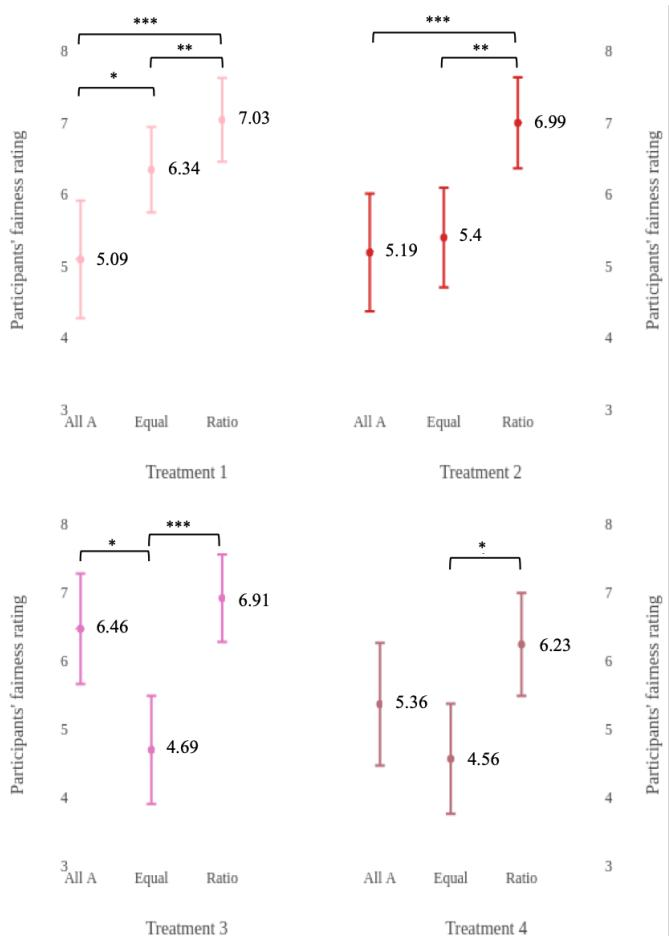  
Figure 1: Comparison of means (with $9 5 \%$ CI) for Study 1. Where * signifies p $< 0 . 0 5$ , $^ { \ast \ast } \mathrm { p } < 0 . 0 1$ , and ** $\mathfrak { i } \mathrm { p } < 0 . 0 0 1$ .

# Results

First, we tested hypotheses H1A and H1B, which conjecture that participants will consider the “Ratio” decision as the most fair. We found evidence in support of H1A in all treatments: participants consistently rated dividing the $\$ 50,000$ between the two individuals in proportion of their loan repayment rates (the “Ratio” decision) as more fair than splitting the $\$ 50,000$ equally (the “Equal” decision) (see Figure 1). We found partial support for H1B: participants rated the “Ratio” decision as more fair than the “All A” decision in Treatments 1 and 2 (see Figure 1).

Second, we found that participants in Treatment 1 rated the “Equal” decision as more fair than the “All A” definition (see Figure 1), supporting H2. We see that when the difference in the loan repayment rates of the individuals was small $( 5 \% )$ , participants perceived the decision to divide the money equally between the individuals as more fair than giving all the money to the individual with the higher loan repayment rate.

Third, we found that participants rated the “All A” decision as more fair than the “Equal” decision in Treatment 3, but not in Treatment 4 (see Figure 1).

# Discussion

We see that across all treatments, participants in Study 1 perceived the “Ratio” decision – the only decision that aligns with calibrated fairness – to be more fair than the “Equal” decision – the only decision that is always aligned with the treating people similarly definition. One possible explanation is that calibrated fairness implies treating people similarly for a similarity metric (Liu et al. 2017) that is based on a notion of merit.

In Treatments 1 and 2, participants rated the “Ratio” decision – the only decision that aligns with calibrated fairness – to be more fair than the “All A” decision. Note that the meritocratic definition is the only definition that always allows the “All A” decision. No significant difference was discovered for Treatments 3 and 4, where one candidate has a much higher repayment rate.

Furthermore, participants viewed individuals to be similar enough to be treated similarly only when the difference in the applicants’ loan repayment rates was very small (approximately $5 \%$ ).

# Study 2 (With Sensitive Information)

In this study, our motivation is to investigate how the addition of sensitive information to information on an individual task-specific feature (i.e., the candidates’ loan repayment rate) influences perceptions of fairness.

We employed the same experimental paradigm as in Study 1, presenting participants with the scenario of two individuals applying for a loan, and three possible ways of allocating the loan money. Importantly, in Study 2, in addition to providing information on the individuals’ loan repayment rates, we also provided information on the individuals’ race. We investigate how information on the candidates’ loan repayment rates and the candidates’ race influence people’s fairness judgments of the three allocation decisions.

# Procedure

We recruited a separate sample of 1800 participants from Amazon Mechanical Turk (MTurk) on April 20-21, 2018, none of whom had taken part in Study 1. Most of them identified as white $( 7 4 \% )$ , $9 \%$ as black, $7 \%$ as Asian or Asian-American, $5 \%$ as Hispanic, and the rest with multiple races. The average age was 36.97 $\mathrm { S D } = 1 2 . 5 4 ,$ ). Most $( 8 9 \% )$ had attended some college, while almost all other participants had a high school degree or GED. All participants were U.S. residents, and each was paid $\$ 0.20$ for participating. (All demographic information was self-reported.)

We presented participants with the same scenario as in Study 1, but this time also providing the candidates’ race and gender. We held the gender of the candidates constant (both were male), and randomized race (black or white). Thus, either the white candidate had the higher loan repayment rate, or the black candidate had the higher loan repayment rate.

The question presented to the participants in Study 2 can be found in Figure Figure 5 in the appendix.

We presented the same question and choices for loan allocations, and tested the same hypotheses, as in Study 1.

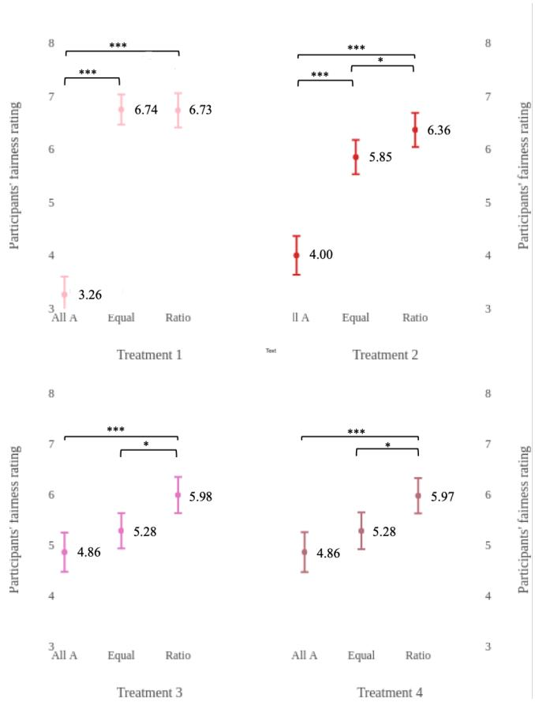  
Figure 2: Comparison of means (with $9 5 \%$ CI) for Study 2 (when the individual with the higher loan repayment rate is white). Where * signifies p $< 0 . 0 5$ , ** p $< 0 . 0 1$ , and $\ast \ast \ast _ { \mathrm { ~ p ~ } }$ ${ < } 0 . 0 0 1$ .

# Results

We found that participants viewed the “Ratio” decision as more fair than the “Equal” decision in Treatments 2, 3, and 4, regardless of race, in support of H1A. We also found that participants viewed the “Ratio” decision as more fair than the “All A” decision in all treatments, regardless of race, thus supporting H1B. (See Figures 2 and 3.) Thus, participants in Study 2 consistently gave most support to the decision to divide the $\$ 50,000$ between the two individuals in proportion to their loan repayment rates.

Furthermore, we found that participants viewed the “Equal” decision as more fair than the “All A” decision in Treatment 1, regardless of race, in support of H2 (see Figures 2 and 3). Participants also rated the “Equal” decision as more fair than the “All A” decision in Treatment 2, but only when the candidate with the higher repayment rate was white (see Figure 2).

When the difference between the two candidates’ repay-

ment rates was larger (Treatments 3 and 4), participants viewed the “All A” decision as more fair than the “Equal” decision but only when the candidate with the higher repayment rate was black (see Figure 3). By contrast, when the candidate with the higher loan repayment rate was white, participants did not rate the two decisions differently (see Figure 2).

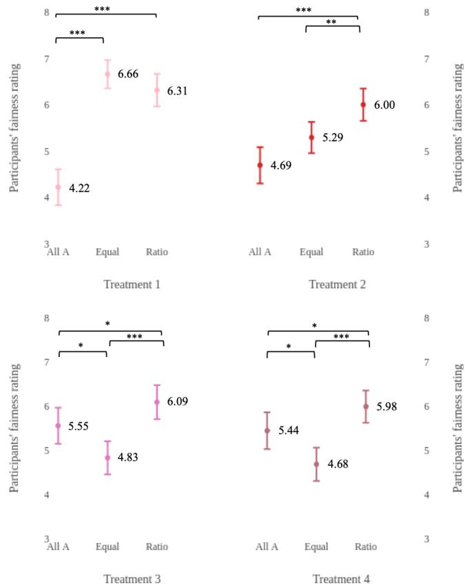  
Figure 3: Comparison of means (with $9 5 \%$ CI) for Study 2 (when the individual with the higher loan repayment rate is black). Where * signifies p $< 0 . 0 5$ , $^ { * * } \mathrm {  ~ p ~ } { < } 0 . 0 1$ , and $\ast \ast \ast _ { \mathrm { ~ p ~ } }$ ${ < } 0 . 0 0 1$ .

# Discussion

In Study 2, we tested whether participants’ perceptions of these three fairness definitions could be influenced by additional information regarding the candidates’ race.

Our results show that participants perceived the “Ratio” decision to be more fair than the other two, hence supporting the results from Study 1 and the related discussion. These results are not dependent on the race attribute. Furthermore, regardless of race, when the difference between the loan repayment rates was small (Treatment 1), participants preferred the “Equal” decision to the “All A” decision. This supports the corresponding results from Study 1, Treatment 1, which indicate that one should account for similarity of individuals when designing fair rules.

However, we also found evidence that race does affect participants’ perception of fairness. When the difference in

loan repayment rates was larger (Treatments 3 and 4), participants rated the “All A” decision as more fair than the “Equal” decision, but only when the candidate with the higher repayment rate was black. These results suggest a boundary condition of H3: people may support giving all the loan money to the candidate with the higher payback rate, compared to splitting the money equally, when the candidate with the higher payback rate is a member of a group that is historically disadvantaged.

Each definition, from meritocratic to similarity to calibrated fairness is successively stronger in our context, ruling out additional decisions. In this light, it is interesting that the ratio decision is most preferred, providing support for the calibrated fairness definition, even though this definition is the strongest of the three in the present context. When historically disadvantaged individuals have a higher repayment rate, participants are more supportive of more decisive allocations in favor of the stronger, and historically disadvantaged, individual.

# Conclusion

People broadly show a preference for the “Ratio” decision, which is indicative of their support for the calibrated fairness definition (Liu et al. 2017), as compared to the treating similar people similarly (Dwork et al. 2012) and meritocratic Joseph et al. definitions. We also find in Study 2 some support for the principle of affirmative action.

Through the use of crowdsourcing, we can elicit information on public attitudes towards different definitions of algorithmic fairness, and how individual characteristics, such as task-specific features (e.g., loan repayment rates) and sensitive attributes (e.g., race) could be relevant in fair decisionmaking. Understanding public attitudes can help to continue a dialogue between technologists and ethicists in the design of algorithms that make decisions of consequence to the public. For example, the three fairness definitions examined here agree that, conditioned on the task-specific metric, an attribute such as race should not be relevant to decisionmaking. Yet, we find some treatments under which people’s attitudes about loan decisions change when race is provided to the context.

This paper opens up several directions for future research. Beyond testing additional definitions, future experiments could in addition specify whether the decision was made by a human or an algorithm. Psychological theories of mind may influence people’s fairness judgments. Third, future work could investigate how people perceive fairness in other contexts, such as university admissions or bail decisions, where there is no divisible resource but rather a definite decision needs to be made, and in the university case in the context of a resource constraint. Fourth, further research could examine why the availability of additional personal or sensitive information influences perceptions of fairness. Why do people consider factors such as race important for their fairness ratings? And to what extent are people willing to endorse affirmative action in defining algorithmic fairness? Finally, it is important to consider how to incorporate the general public’s views into algorithmic decision-making.

These results are only the start of a research program on understanding ordinary people’s fairness judgments of definitions of algorithmic fairness. As the literature on moral psychology has shown, people often make inconsistent and unreasoned moral judgments (Greene 2014). Indeed, research on moral judgments in regard to the decisions made by autonomous vehicles (the “moral machine”) has shown that people approve of utilitarian autonomous vehicles, but are unwilling to purchase utilitarian autonomous vehicles for themselves (Bonnefon, Shariff, and Rahwan 2016). On the other hand, research in moral psychology shows that people can engage in sophisticated moral reasoning, thinking in an impartial, bias-free way, resulting in moral judgments that favor the greater good (Huang, Greene, and Bazerman 2019). Future research could investigate how moral reasoning interventions could influence people’s fairness judgments in the domain of algorithmic fairness.

# References

[Adams 1963] Adams, J. S. 1963. Towards an understanding of inequity. The Journal of Abnormal and Social Psychology 67(5):422.   
[Adams 1965] Adams, J. S. 1965. Inequity in social exchange. In Advances in experimental social psychology, volume 2. Elsevier. 267–299.   
[Angwin et al. 2016] Angwin, J.; Larson, J.; Mattu, S.; and Kirchner, L. 2016. Machine bias risk assessments in criminal sentencing. ProPublica https://www. propublica. org. Accessed: 2018-03-27.   
[Awad et al. 2018] Awad, E.; Dsouza, S.; Kim, R.; Schulz, J.; Henrich, J.; Shariff, A.; Bonnefon, J.-F.; and Rahwan, I. 2018. The moral machine experiment. Nature 563(7729):59.   
[Bazerman, White, and Loewenstein 1995] Bazerman, M. H.; White, S. B.; and Loewenstein, G. F. 1995. Perceptions of fairness in interpersonal and individual choice situations. Current Directions in Psychological Science 4(2):39–43.   
[Binns et al. 2018] Binns, R.; Van Kleek, M.; Veale, M.; Lyngs, U.; Zhao, J.; and Shadbolt, N. 2018. ’it’s reducing a human being to a percentage’: Perceptions of justice in algorithmic decisions. In Proceedings of the 2018 CHI Conference on Human Factors in Computing Systems, 377. ACM.   
[Bonnefon, Shariff, and Rahwan 2016] Bonnefon, J.-F.; Shariff, A.; and Rahwan, I. 2016. The social dilemma of autonomous vehicles. Science 352(6293):1573–1576.   
[Chouldechova 2017] Chouldechova, A. 2017. Fair prediction with disparate impact: A study of bias in recidivism prediction instruments. Big data 5(2):153–163.   
[Dieterich, Mendoza, and Brennan 2016] Dieterich, W.; Mendoza, C.; and Brennan, T. 2016. Compas risk scales: Demonstrating accuracy equity and predictive parity. Northpoint Inc. Accessed: 2018-10-24.   
[Dwork et al. 2012] Dwork, C.; Hardt, M.; Pitassi, T.; Reingold, O.; and Zemel, R. 2012. Fairness through awareness. In Proceedings of the 3rd innovations in theoretical computer science conference, 214–226. ACM.

[Ellis and Watson 2012] Ellis, E., and Watson, P. 2012. EU anti-discrimination law. Oxford University Press.   
[Gajane and Pechenizkiy 2017] Gajane, P., and Pechenizkiy, M. 2017. On formalizing fairness in prediction with machine learning. arXiv preprint arXiv:1710.03184.   
[Greene 2014] Greene, J. D. 2014. Moral tribes: Emotion, reason, and the gap between us and them. Penguin.   
[Grgic-Hla ´ ca et al. 2018a] Grgi ˇ c-Hla ´ ca, N.; Redmiles, ˇ E. M.; Gummadi, K. P.; and Weller, A. 2018a. Human perceptions of fairness in algorithmic decision making: A case study of criminal risk prediction. arXiv preprint arXiv:1802.09548.   
[Grgic-Hla ´ ca et al. 2018b] Grgi ˇ c-Hla ´ ca, N.; Zafar, M. B.; ˇ Gummadi, K. P.; and Weller, A. 2018b. Beyond distributive fairness in algorithmic decision making: Feature selection for procedurally fair learning. In Thirty-Second AAAI Conference on Artificial Intelligence.   
[Huang, Greene, and Bazerman 2019] Huang, K.; Greene, J. D.; and Bazerman, M. 2019. Veil-of-ignorance reasoning favors the greater good. Working paper.   
[Joseph et al. 2016] Joseph, M.; Kearns, M.; Morgenstern, J. H.; and Roth, A. 2016. Fairness in learning: Classic and contextual bandits. In Advances in Neural Information Processing Systems, 325–333.   
[Kleinberg, Mullainathan, and Raghavan 2016] Kleinberg, J.; Mullainathan, S.; and Raghavan, M. 2016. Inherent trade-offs in the fair determination of risk scores. arXiv preprint arXiv:1609.05807.   
[Lee and Baykal 2017] Lee, M. K., and Baykal, S. 2017. Algorithmic mediation in group decisions: Fairness perceptions of algorithmically mediated vs. discussion-based social division. In CSCW, 1035–1048.   
[Lee, Kim, and Lizarondo 2017] Lee, M. K.; Kim, J. T.; and Lizarondo, L. 2017. A human-centered approach to algorithmic services: Considerations for fair and motivating smart community service management that allocates donations to non-profit organizations. In Proceedings of the 2017 CHI Conference on Human Factors in Computing Systems, 3365–3376. ACM.   
[Lee 2018] Lee, M. K. 2018. Understanding perception of algorithmic decisions: Fairness, trust, and emotion in response to algorithmic management. Big Data & Society 5(1):2053951718756684.   
[Liu et al. 2017] Liu, Y.; Radanovic, G.; Dimitrakakis, C.; Mandal, D.; and Parkes, D. C. 2017. Calibrated fairness in bandits. arXiv preprint arXiv:1707.01875.   
[Pierson 2017] Pierson, E. 2017. Gender differences in beliefs about algorithmic fairness. arXiv preprint arXiv:1712.09124.   
[Plane et al. 2017] Plane, A. C.; Redmiles, E. M.; Mazurek, M. L.; and Tschantz, M. C. 2017. Exploring user perceptions of discrimination in online targeted advertising. In USENIX Security.   
[Woodruff et al. 2018] Woodruff, A.; Fox, S. E.; Rousso-Schindler, S.; and Warshaw, J. 2018. A qualitative exploration of perceptions of algorithmic fairness. In Proceedings

of the 2018 CHI Conference on Human Factors in Computing Systems, 656. ACM.   
[Yaari and Bar-Hillel 1984] Yaari, M. E., and Bar-Hillel, M. 1984. On dividing justly. Social choice and welfare 1(1):1– 24.

# Appendix

To be eligible to take our surveys, the Amazon Mechanical Turk workers had to be located in the United States of America. We stipulated this restriction via TurkPrime, which is a platform for performing crowdsourced research when using Amazon Mechanical Turk.

Amazon Mechanical Turk workers (’MTurker’) could only participate in on one of the two studies, and not both.

The first section contains all questions the workers were asked in the studies. The second section contains the demographics data for the respondents of both studies. The third section details how many participants in each study were shown the four treatments.

# Questions from the studies

The question asked in Study 1 is presented in Figure 4. The question asked in Study 2 is presented in Figure 5.

There are two candidates - Person A and Person B,they are identical in every way, except that Person A has a loan repayment rate of 100%,while Person B has a loan repayment rate of20%.Both of them have applied for a $5o,ooo loan to start a business,and the loan officer only has $50.000.

To what extent do you think the following decisions are fair? For each decision, please indicate how fair you think the decision is by dragging the slider bar to a point on the line,where 1 means "not fair at all,and 9 means "completely fair"

Not fair at all Completely fair 1 8 9 The loan officer has decided to give all the money (S5o,ooo) to Person A

The loan offcer has decided to split the money 50/50 between the two candidates,giving $25,000 to PersonAand$25,000 toPersonB.

The loan oficer has decided to give Person A $41,666, which is proportional to that person's payback rateof10o%,and give PersonBS,33,which isproportionaltothat person'spayback rateof 20%.

Figure 4: Question presented to the participants in Study 1.

There are two candidates - Person Aand Person B,they are identical in every way,except their race and loan repayment rates .Both of them have applied fora $5o,oo loan to start a business,and the loan offcer only has $50,000.

<table><tr><td></td><td>Person A</td><td>Person B</td></tr><tr><td>Gender</td><td>Male</td><td>Male</td></tr><tr><td>Race</td><td>White</td><td>Black</td></tr><tr><td>Individual loan repayment rate</td><td>70%</td><td>40%</td></tr><tr><td>Amount requested</td><td>$50,000</td><td>$50,000</td></tr></table>

To what extent do you think the following decisions are fair? For each decision, please indicate how fair you think the decision is by dragging the slider bar to a point on the line,where 1 means "not fair at all",and 9 means "completely fair".

Not fair at all Completely fair 1 2 3 4 5 6 7 8 9 The loan officer has decided to split the money 50/50 between the two candidates,giving $25,000 toPerson Aand$25,000toPersonB.

The loan officer has decided to give Person A $31,818,which is proportional to that person's payback rate of 70%,and give Person B $18,181, which is proportional to that person's payback rateof $4 0 \%$

The loan officer has decided to give all the money ($5o,ooo) to Person A

Figure 5: Question presented to the participants in Study 2.

Demographics questions Every Amazon Mechanical Turk worker in both the surveys was asked that study’s question. After they answered that, they were asked the following demographics questions that were voluntary to answer. Since they were voluntary to answer, not all respondents answered them, although most $( > 9 0 \% )$ answered some or all of them.

1. What state do you live in?   
2. Do you identify as:

$\bigcirc$ Male   
$\bigcirc$ Female   
$\bigcirc$ Other (please specify):

3. What is the highest level of school you have completed or the highest degree you have received?

$\bigcirc$ Less than high school degree   
$\bigcirc$ High school degree or equivalent   
$\bigcirc$ Some college but no degree   
$\bigcirc$ Associate degree   
$\bigcirc$ Bachelor degree   
$\bigcirc$ Graduate degree

4. Do you identify as:

Spanish, Hispanic, or Latino   
White   
Black or African-American   
American-Indian or Alaskan Native   
Asian   
Asian-American

Native Hawaiian or other Pacific Islander   
2 Other (please specify):

5. In what type of community do you live:

2 City or urban community   
Suburban community   
2 Rural community   
Other (please specify):

6. What is your age?

7. Which political party do you identify with?

Democratic Party   
2 Republican Party   
2 Green Party   
Libertarian Party   
2 Independent   
Other (please specify):

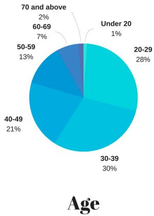  
Study 1: Demographic information of the participants   
Figure 6: Age distribution of the participants in Study 1.

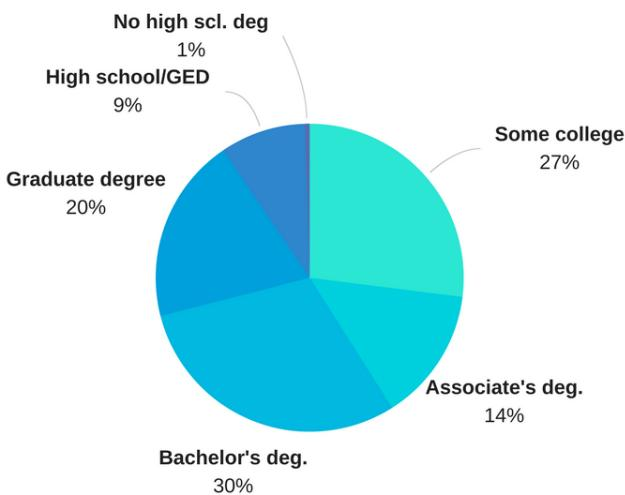  
Figure 7: Education of the participants in Study 1.

# Education

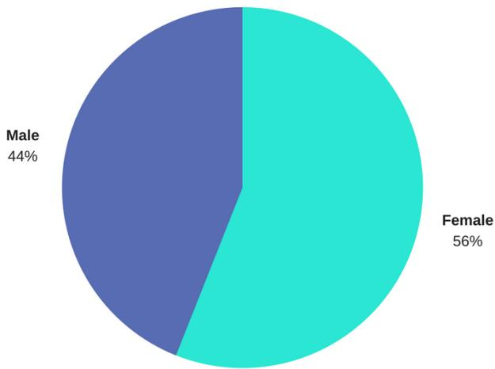  
Gender   
Figure 8: Gender breakdown of the participants in Study 1.

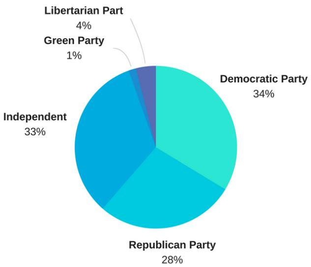  
Figure 9: Political Affiliation of the participants in Study 1.

# Political Affiliation

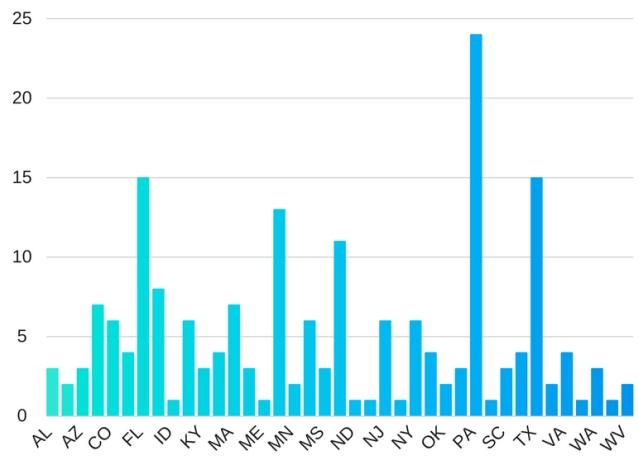  
State breakup   
Figure 11: Breakup by state of the participants in Study 1.

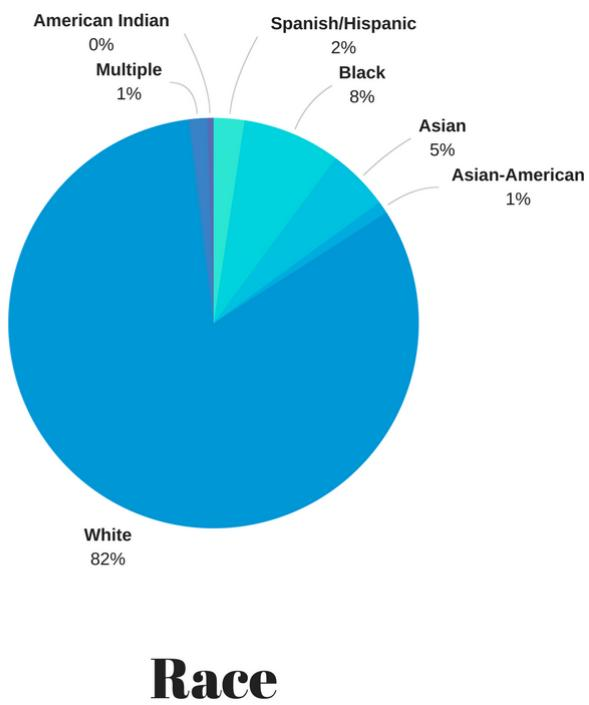  
Figure 10: Race of the participants in Study 1.

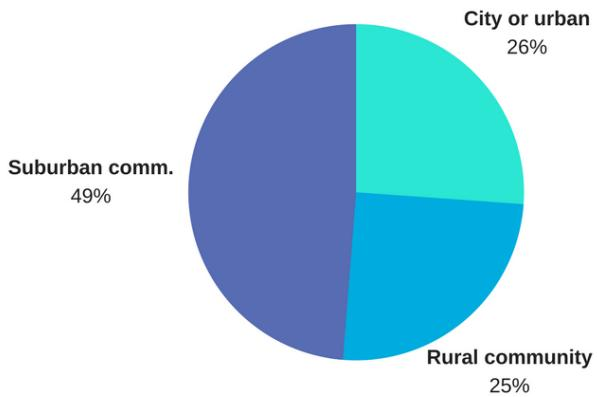  
Residential Community   
Figure 12: Residential breakdown of the participants in Study 1.

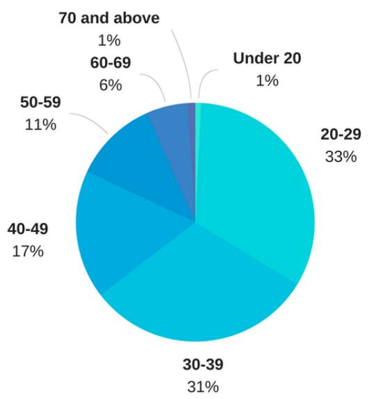  
Study 2: Demographic information of the participants   
Age

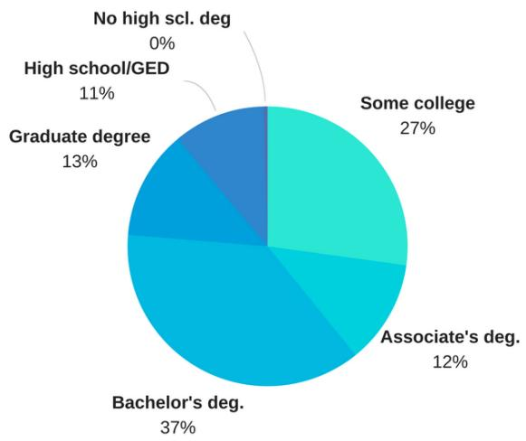  
Figure 13: Age distribution of the participants in Study 2.   
Education   
Figure 14: Education of the participants in Study 2.

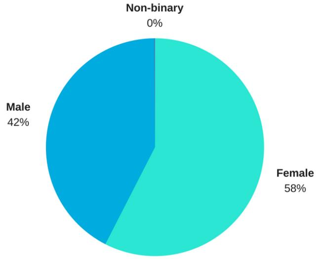  
Gender   
Figure 15: Gender breakdown of the participants in Study 2.

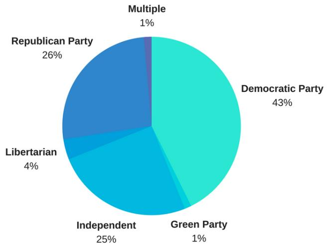  
Political Affiliation   
Figure 16: Political Affiliation of the participants in Study 2.

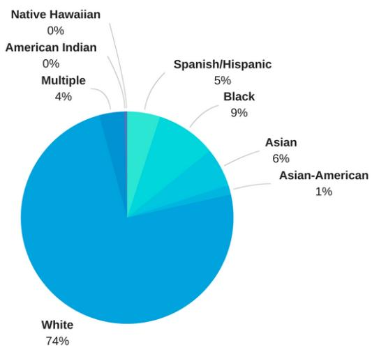

# Race

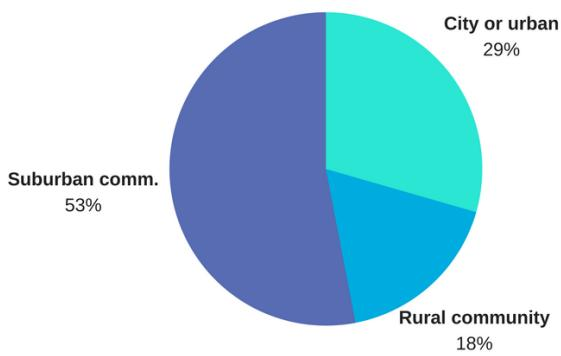  
Figure 17: Race of the participants in Study 2.   
Residential Community   
Figure 18: Residential breakdown of the participants in Study 2.