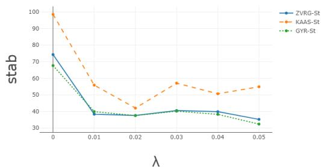
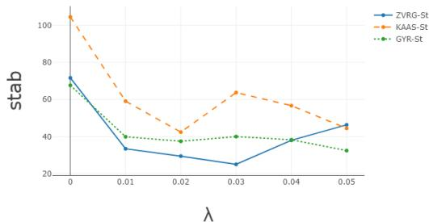

# Stable and Fair Classification

Lingxiao Huang∗and Nisheeth K. Vishnoi†

# Abstract

Fair classification has been a topic of intense study in machine learning, and several algorithms have been proposed towards this important task. However, in a recent study, Friedler et al. observed that fair classification algorithms may not be stable with respect to variations in the training dataset – a crucial consideration in several real-world applications. Motivated by their work, we study the problem of designing classification algorithms that are both fair and stable. We propose an extended framework based on fair classification algorithms that are formulated as optimization problems, by introducing a stability-focused regularization term. Theoretically, we prove a stability guarantee, that was lacking in fair classification algorithms, and also provide an accuracy guarantee for our extended framework. Our accuracy guarantee can be used to inform the selection of the regularization parameter in our framework. To the best of our knowledge, this is the first work that combines stability and fairness in automated decision-making tasks. We assess the benefits of our approach empirically by extending several fair classification algorithms that are shown to achieve the best balance between fairness and accuracy over the Adult dataset. Our empirical results show that our framework indeed improves the stability at only a slight sacrifice in accuracy.

# Contents

# 1 Introduction 3

1.1 Our contributions . 3   
1.2 Other related work 4

# 2 Our Model 5

2.1 Preliminaries 5   
2.2 Stability measure 5   
2.3 The stable and fair optimization problem 6

# 3 Theoretical Results 8

3.1 Main theorem for Program (Stable-Fair) 9   
3.2 Better stability guarantee for linear models 10   
3.3 Analysis of Our Framework in Specified Settings 11

# 4 Proof of Theorem 3.2 13

# 5 Empirical results 15

5.1 Empirical setting . 15   
5.2 Results . . 16

# 6 Conclusion and future directions 17

# A Proof of Theorem 3.6 24

# B Details of Remark 3.3 24

# 1 Introduction

Fair classification has fast become a central problem in machine learning due to concerns of bias with respect to sensitive attributes in automated decision making, e.g., against African-Americans while predicting future criminals [31, 5, 8], granting loans [22], or NYPD stop-and-frisk [35]. Consequently, a host of fair classification algorithms have been proposed; see [7].

In a recent study, [32] pointed out that several existing fair classification algorithms are not “stable”. In particular, they considered the standard deviation of a fairness metric (statistical rate, that measures the discrepancy between the positive proportions of two groups; see Eq. (8)) and accuracy over ten random training-testing splits with respect to race/sex attribute over the Adult dataset. They observed that the standard deviation of the fairness metric is 2.4% for the algorithm in [43] (KAAS) with respect to the race attribute, and is 4.1% for that in [78] (ZVRG) with respect to the sex attribute. These significant standard deviations imply that the classifier learnt from the respective fair classification algorithms might perform differently depending on the training dataset.

Stability is a crucial consideration in classification [10, 59, 12, 27], and has been investigated in several real-world applications, e.g., advice-giving agents [33, 71], recommendation systems [2, 1, 3], and judicial decision-making [68]. Stable classification algorithms can also provide defense for data poisoning attacks, whereby adversaries want to corrupt the learned model by injecting false training data [9, 55, 69].

There is a growing number of scenarios in which stable and fair classification algorithms are desired. One example is recommendation systems that rely on classification algorithms [62, 64]. Fairness is often desired in recommendation systems, e.g., to check gender inequality in recommending high-paying jobs [26, 21, 70]. Moreover, stability is also important for the reliability and acceptability of recommendation systems [2, 1, 3]. Another example is that of a judicial decision-making system, in which fair classification algorithms are being deployed to avoid human biases for specific sensitive attributes, e.g., against African-Americans [31, 5, 8]. The dataset, that incorporates collected personal information, may be noisy due to measurement errors, privacy issues, or even data poisoning attacks [48, 58, 61, 6] and, hence, it is desirable that the fair classifier also be stable against perturbations in the dataset.

# 1.1 Our contributions

In this paper, we initiate a study of stable and fair classifiers in automated decision-making tasks. In particular, we consider the class of fair classification algorithms that are formulated as optimization problems that minimize the empirical risk while being constrained to being fair. The collection $\mathcal { F }$ of possible classifiers is assumed to be a reproducing kernel Hilbert space (RKHS) (see Program (ConFair) for a definition); this includes many recent fair classifiers such as [77, 78, 34]. Our main contribution is an algorithmic framework that incorporates the notion of uniform stability [10] – the maximum $l _ { \infty }$ -distance between the risks of two classifiers learned from two training sets that differ in a single sample (see Definition 2.1). This allows us to address the stability issue observed by [32]. To achieve uniform stability, we introduce a stability-focused regularization term to the objective function of fair classifier

(Program (Stable-Fair)), which is motivated by the work of [10]. Although some existing fair classification algorithms [43, 34] use regularizers, they do not seem to realize that (and show how) the regularization term can also make the algorithm more stable. Under mild assumptions on the loss function (Definition 3.1), we prove that our extended framework indeed has an additional uniform stability guarantee $\tilde { O } ( \textstyle { \frac { 1 } { \lambda N } } )$ , where $\lambda$ is the regularization parameter and $N$ is the size of the training set (Theorems 3.2). Moreover, if $\mathcal { F }$ is a linear model, we can achieve a slightly better stability guarantee (Theorem 3.6). Our stability guarantee also implies an empirical risk guarantee that can be used to inform the selection of the regularization parameter in our framework. By letting $\begin{array} { r } { \lambda = \Theta ( \frac { 1 } { \sqrt { N } } ) } \end{array}$ , the increase in the empirical risk by introducing the regularization term can be bounded by $\scriptstyle { \tilde { O } } ( { \frac { 1 } { \sqrt { N } } } )$ (Theorems 3.2 and 3.6, Remark 3.3). As a consequence, our stability guarantee also implies a generalization bound – the expected difference between the expected risk and the empirical risk is $\scriptstyle { \tilde { O } } ( { \frac { 1 } { \lambda N } } )$ (Corollaries 3.5 and 3.7).

Further, we conduct an empirical evaluation over the Adult dataset and apply our framework to several fair classification algorithms, including KAAS [43], ZVRG [77] and GYF [34] (Section 5). Similar to [32], we evaluate the fairness metric and accuracy of these algorithms and our extended algorithms. Besides, we also compute the expected number of different predictions over the test dataset between classifiers learned from two random training sets as a stability measure stab (Eq. (7)). The empirical results show that our classification algorithms indeed achieve better stability guarantee, while being fair. For instance, with respect to the sex attribute, the standard deviation of the fairness metric of ZVRG improves from $4 . 1 \%$ ([32]) to about $1 \%$ using our extended algorithm, and the stability measure stab decreases from 70 ( $\lambda = 0$ ) to 25 ( $\lambda = 0 . 0 2$ ). Meanwhile, the loss in accuracy due to imposing stability-focused regularization term is small (at most 1.5%).

Overall, we provide the first extended framework for stable and fair classification, which makes it flexible and easy to use, slightly sacrifices accuracy, and performs well in practice.

# 1.2 Other related work

From a technical view, most relevant prior works formulated the fair classification problem as a constrained optimization problem, e.g., constrained to statistical parity [78, 57, 34, 14], or equalized odds [39, 77, 57, 14]. Our extended framework can be applied to this type of fair classification. Another approach for fair classification is to shift the decision boundary of a baseline classifier, e.g., [30, 39, 36, 63, 75, 24]. Finally, a different line of research pre-processes the training data with the goal of removing the bias for learning, e.g., [41, 53, 42, 79, 28, 46].

Several prior works [10, 67, 54, 56] study the stability property for empirical risk minimization. [40], [49] and [47] showed that the stochastic gradient descent method is stable. Moreover, several recent works studied stability in deep neural networks [65, 72]. Stability has been investigated in other automated decision-making tasks, e.g., feature selection [60] and structured prediction [51, 52, 50].

There exists a related notion to stability, called differential privacy, where the prediction for any sample should not change with high probability if the training set varies a single element. By [74], differential privacy implies a certain stability guarantee. Hence, it is possible to achieve stable and fair classifiers by designing algorithms that satisfy differential privacy and fairness simultaneously. Recent studies [37, 38, 44, 45, 66] have expanded the

application of methods to achieve both goals; see a recent paper [25] for more discussions. However, these methods are almost all heuristic and without theoretical guarantee. There also remains the open problem of characterizing under what circumstances and definitions, privacy and fairness are simultaneously achievable, and when they compete with each other.

# 2 Our Model

# 2.1 Preliminaries

We consider the Bayesian model for classification. Let $\Im$ denote a joint distribution over the domain $\mathcal { D } = \mathcal { X } \times [ p ] \times \{ - 1 , 1 \}$ where $\mathcal { X }$ is the feature space. Each sample $( X , Z , Y )$ is drawn from $\Im$ where $Z \in [ p ]$ represents a sensitive attribute,1 and $Y \in \{ - 1 , 1 \}$ is the label of $( X , Z )$ that we want to predict.

Let $\mathcal { F }$ denote the collection of all possible classifiers $f : \mathcal { X } \to \mathbb { R }$ . Given a loss function $L ( \cdot , \cdot )$ that takes a classifier $f$ and a distribution $\Im$ as arguments, the goal of fair classification is to learn a classifier $f \in \mathcal { F }$ that minimizes the expected risk $R ( f ) : = \mathbb { E } _ { s \sim \Im } \left[ L ( f , s ) \right] .$ . However, since $\Im$ is often unknown, we usually use the empirical risk to estimate the expected risk [10, 67, 54], i.e., given a training set $S = \{ s _ { i } = ( x _ { i } , z _ { i } , y _ { i } ) \} _ { i \in [ N ] }$ (where $( x _ { i } , z _ { i } , y _ { i } ) \in \mathcal { D } _ { , }$ ), the objective is to learn a classifier $f \in \mathcal F$ that minimizes the empirical risk $E ( f ) : =$ $\textstyle { \frac { 1 } { N } } \sum _ { i \in [ N ] } L ( f , s _ { i } )$ . Denote by $\mathrm { P r } _ { \mathfrak { I } } [ \cdot ]$ the probability with respect to $\Im$ . If $\Im$ is clear from context, we simply denote $\mathrm { P r } _ { \mathbb { S } } [ \cdot ]$ by $\mathrm { P r } [ \cdot ]$ . A fair classification algorithm $\mathcal { A }$ can be considered as a mapping $\mathcal { A } : \mathcal { D } ^ { * }  \mathcal { F }$ , which learns a classifier $A _ { S } \in { \mathcal { F } }$ from a training set $S \in { \mathcal { D } } ^ { * }$ .

# 2.2 Stability measure

In this paper, we consider the following stability measure introduced by [10], which was also used by [67, 54, 56]. This notion of stability measures whether the risk of the learnt classifier is stable under replacing one sample in the training dataset.

Definition 2.1 (Uniform stability [10]). Given an integer $N$ , a real-valued classification algorithm $\mathcal { A }$ is $\beta _ { N }$ -uniformly stable with respect to the loss function $L ( \cdot , \cdot )$ if the following holds: for all $i \in [ N ]$ and $S , S ^ { i } \in \mathcal { D } ^ { N }$ ,

$$
\| L (\mathcal {A} _ {S}, \cdot) - L (\mathcal {A} _ {S ^ {i}}, \cdot) \| _ {\infty} \leq \beta_ {N},
$$

i.e., for any training sets $S , S ^ { i } \in \mathcal { D } ^ { N }$ that differ by the $i$ -th sample, the $l _ { \infty }$ -distance between the risks of $A _ { S }$ and $\mathcal { A } _ { S ^ { i } }$ is at most $\beta _ { N }$ .

By definition, algorithm $\mathcal { A }$ is stable if $\beta _ { N }$ is small.

Since classification algorithms usually minimize the empirical risk, it is easier to bound to provide theoretcial bounds on the risk difference. This is the reason we consider the notion of uniform stability. Moreover, uniform stability might imply that the prediction variation is small with a slight perturbation on the training set. Given an algorithm $\mathcal { A }$ and a sample $x \in \mathcal { X }$ , we predict the label to be $+ 1$ if $\mathcal { A } ( x ) \geq 0$ and to be -1 if $\mathcal { A } ( x ) < 0$ . In the following, we summarize the stability property considered in [32].

Definition 2.2 (Prediction stability). Given an integer $N$ , a real-valued classification algorithm A is $\beta _ { N }$ -prediction stable if the following holds: for all $i \in \lfloor N \rfloor$ ,

$$
\operatorname * {P r} _ {S, S ^ {i} \in \mathcal {D} ^ {N}, X \sim \Im} \left[ \mathrm {I} \left[ \mathcal {A} _ {S} (X) \geq 0 \right] \neq \mathrm {I} \left[ \mathcal {A} _ {S ^ {i}} (X) \geq 0 \right] \right] \leq \beta_ {N},
$$

i.e., given two training sets $S , S ^ { i } \in \mathcal { D } ^ { N }$ that differ by the $i$ -th sample, the probability that $A _ { S }$ and $\mathcal { A } _ { S ^ { i } }$ predict differently is at most $\beta _ { N }$ .

The following lemma shows that uniform stability implies prediction stability.

Lemma 2.3 (Uniform stability implies prediction stability). Given an interger $N$ , if algorithm $\mathcal { A }$ is $\beta _ { N }$ -uniformly stable with respect to the loss function $L ( \cdot , \cdot )$ and the loss function satisfies that for any $f , f ^ { \prime } \in \mathcal { F }$ , $\boldsymbol { s } = ( x , z , y ) \in \mathcal { D }$ ,

$$
| f (x) - f ^ {\prime} (x) | \leq \tau \cdot \left| L (f, s) - L (f ^ {\prime}, s) \right|,
$$

then the prediction stability $\mathcal { A }$ is upper bounded by $\operatorname* { P r } _ { S , A } \left[ | A _ { S } ( X ) | \le \tau \beta _ { N } \right]$ .

Proof. For any $S , S ^ { i } \in \mathcal { D } ^ { N }$ and $\boldsymbol { s } = ( x , z , y )$ , we have

$$
| \mathcal {A} _ {S} (x) - \mathcal {A} _ {S ^ {i}} (x) | \leq \tau \cdot | L (\mathcal {A} _ {S}, s) - L (\mathcal {A} _ {S ^ {i}}, s) | \leq \tau \beta_ {N}.
$$

Hence, if $| \mathcal { A } _ { S } ( \cdot ) | > \tau \beta _ { N }$ , then we have

$$
\operatorname {I} \left[ \mathcal {A} _ {S} (x) \geq 0 \right] = \operatorname {I} \left[ \mathcal {A} _ {S ^ {i}} (x) \geq 0 \right].
$$

By Definition 2.2, this implies the lemma.

# 2.3 The stable and fair optimization problem

Our goal is to design fair classification algorithms that have a uniform stability guarantee. We focus on extending fair classification algorithms that are formulated as constrained empirical risk minimization problem over the collection $\mathcal { F }$ of classifiers that is a reproducing kernel Hilbert space (RKHS), e.g., [77, 78, 34]; see the following program.

$$
\min  _ {f \in \mathcal {F}} \frac {1}{N} \sum_ {i \in [ N ]} L (f, s _ {i}) \quad s. t.
$$

$$
\Omega_ {S} (f) \leq 0.
$$

Here, $\Omega _ { S } ( \cdot ) : \mathcal { F }  \mathbb { R } ^ { a }$ is a convex function given explicitly for a specific fairness requirement on the dataset $S$ . When $S$ is clear by the content, we may use $\Omega ( \cdot )$ for simplicity. For instance, if we consider the statistical rate $\gamma ( f )$ (Eq. (8)) as the fairness metric, then the fairness requirement can be $0 . 8 - \gamma ( f ) \leq 0$ . However, $0 . 8 - \gamma ( f )$ is non-convex with respect to $f$ . To address this problem, in the literature, one usually defines a convex function $\Omega ( f )$ to estimate $0 . 8 - \gamma ( f )$ , e.g., $\Omega ( f )$ is formulated as a covariance-type function which is the

average signed distance from the feature vectors to the decision boundary in [78], and is formulated as the weighted sum of the logs of the empirical estimate of favorable bias in [34]. In what follows, a fair classification algorithm is an algorithm that solves Program (ConFair).

Note that an empirical risk minimizer of Program (ConFair) might heavily depend on and even overfit the training set. Hence, replacing a sample from the training set might cause a significant change in the learnt fair classifier – the uniform stability guarantee might be large. To address this problem, a useful high-level idea is to introduce a regularization term to the objective function, which can penalize the “complexity” of the learned classifier. Intuitively, this can make the change in the learnt classifier smaller when a sample from the training set is replaced. This idea comes from [10] who considered stability for unconstrained empirical risk minimization.

Motivated by the above intuition, we consider the following constrained optimization problem which is an extension of Program (ConFair) by introducing a stability-focused regularization term $\lambda \| f \| _ { k } ^ { 2 }$ . Here, $\lambda > 0$ is a regularization parameter and $\| f \| _ { k } ^ { 2 }$ is the norm of $f$ in RKHS $\mathcal { F }$ where $k$ is the kernel function (defined later in Definition 2.5). We consider such a regularization term since it satisfies a nice property that relates $| f ( x ) |$ and $\| f \| _ { k }$ for any $x \in \mathcal { X }$ (Claim 2.6). This property is useful for proving making the intuition above concrete and providing a uniform stability guarantee.

$$
\min  _ {f \in \mathcal {F}} \frac {1}{N} \sum_ {i \in [ N ]} L (f, s _ {i}) + \lambda \| f \| _ {k} ^ {2} \quad s. t. \tag {Stable-Fair}
$$

$$
\Omega (f) \leq 0.
$$

Our extended algorithm $\mathcal { A }$ is to compute a minimizer $A _ { S }$ of Program (Stable-Fair) by classic methods, e.g., stochastic gradient descent [11].

Remark 2.4. We first discuss the motivation of considering fair classification algorithms formulated as Program (ConFair). The main reason is that such algorithms can achieve a good balance between fairness and accuracy, but might not be stable. For instance, [32] observed that ZVRG [78] achieves the best balance between fairness and accuracy with respect to race/sex attribute over the Adult dataset. However, as mentioned in Section 1, ZVRG is not stable depending on a random training set. Hence, we would like to improve the stability of ZVRG while keeping its balance between fairness and accuracy. Note that our extended framework can incorporate multiple sensitive attributes if the fairness constraint $\Omega ( f ) \leq 0$ deals with multiple sensitive attributes, e.g., [77, 78, 34].

It remains to define the regularization term $\| f \| _ { k }$ in RKHS.

Definition 2.5 (Regularization in RKHS). We call $T ( \cdot ) : \mathcal { F }  \mathbb { R } _ { \geq 0 }$ a regularization term in an RKHS $\mathcal { F }$ if, for any $f \in { \mathcal { F } }$ , $T ( f ) : = \| f \| _ { k } ^ { 2 }$ , where $k$ is a kernel function satisfying that 1) $\{ k ( x , \cdot ) : x \in \mathcal { X } \}$ is a span of $\mathcal { F }$ ; 2) for any $x \in \mathcal { X }$ and $f \in { \mathcal { F } }$ , $f ( x ) = \langle f , k ( x , \cdot ) \rangle$ .

Given a training set $\begin{array} { r } { S = \{ s _ { i } = ( x _ { i } , z _ { i } , y _ { i } ) \} _ { i \in [ N ] } } \end{array}$ and a kernel function $k : S \times S  \mathbb { R }$ , by definition, each classifier is a vector space by linear combinations of $k ( x _ { i } , \cdot )$ , i.e., $f ( \cdot ) =$

$\textstyle \sum _ { i \in [ N ] } \alpha _ { i } k ( x _ { i } , \cdot )$ . Then for any $x \in \mathcal { X }$

$$
f (x) = \left\langle \sum_ {i \in [ N ]} \alpha_ {i} k \left(x _ {i}, \cdot\right), k (x, \cdot) \right\rangle = \sum_ {i \in [ N ]} \alpha_ {i} k \left(x _ {i}, x\right). \tag {1}
$$

For instance, if $k ( x , y ) = \langle x , y \rangle$ , then each classifier $f$ can be represented by

$$
f (x) \stackrel {(1)} {=} \sum_ {i \in [ N ]} \alpha_ {i} k (x _ {i}, x) = \sum_ {i \in [ N ]} \alpha_ {i} \langle x _ {i}, x \rangle = \langle \sum_ {i \in [ N ]} \alpha_ {i} x _ {i}, x \rangle = \langle \beta , x \rangle ,
$$

where $\begin{array} { r } { \beta = \sum _ { i \in [ N ] } \alpha _ { i } x _ { i } } \end{array}$ . Thus, by the Cauchy-Schwarz inequality, we have the following useful property.

Claim 2.6. ([10]) Suppose $\mathcal { F }$ is a RKHS with a kernel k. For any $f \in { \mathcal { F } }$ and any $x \in \mathcal { X }$ , we have $| f ( x ) | \leq \| f \| _ { k } { \sqrt { k ( x , x ) } }$ .

Remark 2.7. There exists another class of fair classification algorithms, which introduce a fairness-focused regularization term $\mu \cdot \Omega ( \cdot )$ to the objective function; see the following program.

$$
\min  _ {f \in \mathcal {F}} \frac {1}{N} \sum_ {i \in [ N ]} L (f, s _ {i}) + \mu \cdot \Omega (f). \quad (\text {R e g F a i r})
$$

This approach is applied in several prior work, e.g., [43, 20, 34]. We can also extend this program by introducing a stability-focused regularization term $\lambda \| f \| _ { k } ^ { 2 }$ .

$$
\min _ {f \in \mathcal {F}} \frac {1}{N} \sum_ {i \in [ N ]} L (f, s _ {i}) + \mu \cdot \Omega (f) + \lambda \| f \| _ {k} ^ {2}.
$$

By Lagrangian principle, there exists a value $\mu \geq 0$ such that Program (RegFair) is equivalent to Program (ConFair). Thus, by solving the above program, we can obtain the same stability guarantee, empirical risk guarantee and generalization bound as for Program (Stable-Fair).

# 3 Theoretical Results

In this section, we analyze the performance of algorithm $\mathcal { A }$ that solves Program (Stable-Fair) (Theorem 3.2). Moreover, if $\mathcal { F }$ is a linear model, we can achieve a slightly better stability guarantee (Theorem 3.6).

Given a training set $S = \{ s _ { i } = ( x _ { i } , z _ { i } , y _ { i } ) \} _ { i \in [ N ] }$ , by replacing the $i$ -th element from $S$ , we denote

$$
S ^ {i} := \left\{s _ {1}, \ldots , s _ {i - 1}, s _ {i} ^ {\prime}, s _ {i + 1}, \ldots , s _ {N} \right\}.
$$

Before analyzing the performance of algorithm $\mathcal { A }$ , we give the following definition for a loss function.

Definition 3.1 ( $\sigma$ -admissible [10]). The loss function $L ( \cdot , \cdot )$ is called $\sigma$ -admissible with respect to $\mathcal { F }$ if for any $f \in { \mathcal { F } }$ , $x , x ^ { \prime } \in { \mathcal { X } }$ and $y \in \{ - 1 , 1 \}$ ,

$$
\left| L (f (x), y) - L (f (x ^ {\prime}), y) \right| \leq \sigma \left| f (x) - f (x ^ {\prime}) \right|.
$$

By definition, $L ( \cdot , \cdot )$ is $\sigma$ -admissible if $L ( f , y )$ is $\sigma$ -Lipschitz with respect to $f$ .

# 3.1 Main theorem for Program (Stable-Fair)

Now we can state our main theorem which indicates that under reasonable assumptions of the loss function and the kernel function, algorithm $\mathcal { A }$ is uniformly stable.

Theorem 3.2 (Stability and empirical risk guarantee by solving Program (Stable-Fair)). Let $\mathcal { F }$ be a RKHS with kernel $k$ such that $\forall x \in { \mathcal { X } }$ , $k ( x , x ) \leq \kappa ^ { 2 } < \infty$ . Let $L ( \cdot , \cdot )$ be a $\sigma$ - admissible differentiable convex function with respect to $\mathcal { F }$ . Suppose algorithm $\mathcal { A }$ computes a minimizer AS of Program (Stable-Fair). Then A is σ2κ2λN - $A _ { S }$ $\mathcal { A }$ $\frac { \sigma ^ { 2 } \kappa ^ { 2 } } { \lambda N }$ uniformly stable.

Moreover, denote $f ^ { \star }$ to be an optimal fair classifier that minimizes the expected risk and satisfies $\| f ^ { \star } \| _ { k } \leq B$ , i.e., $\begin{array} { r } { f ^ { \star } : = \arg \operatorname* { m i n } _ { f \in \mathcal { F } : \Omega ( f ) \le 0 } \mathbb { E } _ { s \in \mathfrak { T } } \left[ L ( f , s ) \right] } \end{array}$ . We have

$$
\mathbb {E} _ {S \sim \Im^ {N}} \left[ R (\mathcal {A} _ {S}) \right] - \mathbb {E} _ {s \sim \Im} \left[ L (f ^ {\star}, s) \right] \leq \frac {\sigma^ {2} \kappa^ {2}}{\lambda N} + \lambda B ^ {2}.
$$

Remark 3.3. We show that the assumptions of Theorem 3.2 are reasonable. We first give some examples of $L ( \cdot , \cdot )$ in which $\sigma$ is constant. In the main body of the paper, we directly give the constant. The details can be found in Appendix $B$ .

• Prediction error: Suppose $f ( x ) \in \{ - 1 , 1 \}$ for any pair $( f , x )$ . Then $L ( f ( x ) , y ) =$ $\operatorname { I } \left[ f ( x ) \neq y \right]$ is $\frac { 1 } { 2 }$ -admissible.   
• Soft margin SVM: $L ( f , s ) = ( 1 - y f ( x ) ) _ { + }$ ,3 is 1-admissible.   
• Least Squares regression: Suppose $f ( x ) \in [ - 1 , 1 ]$ for any $x \in \mathcal { X }$ . Then we have that $L ( f , s ) = ( f ( x ) - y ) ^ { 2 }$ is 4-admissible.   
• Logistic regression: $L ( f , s ) = \ln ( 1 + e ^ { - y f ( x ) } )$ is 1-admissible.

Then we give examples of kernel $k$ in which $\kappa ^ { 2 }$ is constant.

• Linear: $k ( x , y ) = \langle x , y \rangle$ . Then $k ( x , x ) = \| x \| _ { 2 } ^ { 2 }$ and we can let $\kappa ^ { 2 } = \operatorname* { m a x } _ { x \in \mathcal { X } } \| x \| _ { 2 } ^ { 2 }$   
• Gaussian RBF: $k ( x , y ) = e ^ { - \| x - y \| ^ { 2 } }$ . Then we can let $\kappa ^ { 2 } = k ( x , x ) = 1$ .   
• Multiquadric: $k ( x , y ) = \left( \| x - y \| ^ { 2 } + c ^ { 2 } \right) ^ { 1 / 2 }$ for some constant $c > 0$ . Then we can let $\kappa ^ { 2 } = k ( x , x ) = c$ .   
• Inverse Multiquadric: $k ( x , y ) = \left( \| x - y \| ^ { 2 } + c ^ { 2 } \right) ^ { - 1 / 2 }$ for some constant $c > 0$ . Then we can let $\kappa ^ { 2 } = k ( x , x ) = 1 / c$ .

Remark 3.4. The statement of Theorem 3.2 seems similar to Lemma 4.1 of [10], while the analysis should be different due to the additional fairness constraints. The critical difference is that the gradient of the objective function of Program 6 might not be 0 at the optimal point any more. Thus, we need to develop a new analysis by applying the convexity of $\Omega ( f )$ .

Theorem 3.2 can be used to inform the selection of the regularization parameter $\lambda$ . On the one hand, the stability guarantee is tighter as $\lambda$ increases. On the other hand, the bound for the increase of the empirical risk contains a term $\lambda B ^ { 2 }$ and hence λ should not increase to infinity. Hence, there exists a balance between achieving stability guarantee and utility guarantee. For instance, to minimize the increase of the empirical risk, we can set $\begin{array} { r } { \lambda = \frac { \sigma \kappa } { B \sqrt { N } } } \end{array}$ . Then the stability guarantee is upper bounded by $\textstyle { \frac { \sigma \kappa B } { \sqrt { N } } }$ and the increase of the empirical risk is upper bounded by $\frac { 2 \sigma \kappa B } { \sqrt { N } }$

The generalization bound, i.e., the quality of the estimation $| R ( \mathcal { A } _ { S } ) - E ( \mathcal { A } _ { S } ) |$ , depends on the number of samples $N$ and algorithm $\mathcal { A }$ , and has been well studied in the literature [1, 10, 73, 50]. Existing literature [10, 29] claimed that uniform stability implies a generalization bound. We have the following corollary.

Corollary 3.5 (Generalization bound from Theorem 3.2). Let A denote the $\frac { \sigma ^ { 2 } \kappa ^ { 2 } } { \lambda N }$ uniformly stable algorithm as stated in Theorem 3.2. We have

1. $\begin{array} { r } { \mathbb { E } _ { S \sim \mathfrak { I } ^ { N } } \left[ R ( \mathcal { A } _ { S } ) - E ( \mathcal { A } _ { S } ) \right] \le \frac { \sigma ^ { 2 } \kappa ^ { 2 } } { \lambda N } . } \end{array}$   
2. Suppose $S$ is a random draw of size $N$ from $\Im$ . With probability at least $1 - \delta$ ,

$$
R (\mathcal {A} _ {S}) \leq E (\mathcal {A} _ {S}) + 8 \sqrt {\left(\frac {2 \sigma^ {2} \kappa^ {2}}{\lambda N} + \frac {1}{N}\right) \cdot \ln (8 / \delta)}.
$$

Proof. The first generalization bound is directly implies by Lemma 7 of [10]. The second generalization bound is a direct corollary of Theorem 1.2 of [29]. □

# 3.2 Better stability guarantee for linear models

In this section, we consider the case that $k ( x , y ) = \langle \phi ( x ) , \phi ( y ) \rangle$ where $\phi : \mathcal { X }  \mathbb { R } ^ { d }$ is a feature map. It implies that $f ( x ) = \alpha ^ { \top } \phi ( x )$ for some $\boldsymbol { \alpha } \in \mathbb { R } ^ { d }$ , i.e., $\mathcal { F }$ is the family of all linear functions. In this case, we provide a stronger stability guarantee by the following theorem.

Theorem 3.6 (Stability and utility guarantee for linear models). Let $\mathcal { F }$ be the family of all linear classifiers $\{ f = \alpha ^ { \top } \phi ( \cdot ) \mid \alpha \in \mathbb { R } ^ { d } \}$ . Let

$$
G = \sup_{f = \alpha^{\top}\phi (\cdot)\in \mathcal{F}:\Omega (f)\leq 0}\sup_{s\in \mathcal{D}}\| \nabla_{\alpha}L(f,s)\|_{2}.
$$

Suppose algorithm $\mathcal { A }$ computes a minimizer $A _ { S }$ of Program (Stable-Fair). Then A is G2 $\frac { G ^ { 2 } } { \lambda N }$ uniformly stable.

Moreover, denote $f ^ { \star }$ to be an optimal fair classifier that minimizes the expected risk and satisfies $\| f ^ { \star } \| _ { k } \leq B$ , i.e., $\begin{array} { r } { f ^ { \star } : = \arg \operatorname* { m i n } _ { f \in \mathcal { F } : \Omega ( f ) \le 0 } \mathbb { E } _ { s \in \mathfrak { T } } \left[ L ( f , s ) \right] } \end{array}$ . We have

$$
\mathbb {E} _ {S \sim \Im^ {N}} \left[ R (\mathcal {A} _ {S}) \right] - \mathbb {E} _ {s \sim \Im} \left[ L (f ^ {\star}, s) \right] \leq \frac {G ^ {2}}{\lambda N} + \lambda B ^ {2}.
$$

Note that we only have an assumption for the gradient of the loss function. Given a sample $\boldsymbol { s } = ( x , z , y ) \in \mathcal { D }$ such that $\begin{array} { r } { G = \operatorname* { s u p } _ { f \in \mathcal { F } : \Omega ( f ) \le 0 } \| \nabla _ { \alpha } L ( f , s ) \| _ { 2 } } \end{array}$ , we have

$$
G = \| \nabla_ {\alpha} L (f, s) \| _ {2} = \| \nabla_ {f} L (f, s) \cdot \phi (x) \| _ {2}.
$$

Under the assumption of Theorem 3.2, we have 1) $| \nabla _ { f } L ( f , s ) | \leq \sigma$ since $L ( \cdot , \cdot )$ is $\sigma$ -admissible with respect to $\mathcal { F }$ ; 2) $\| \phi ( x ) \| _ { 2 } = \sqrt { k ( x , x ) } \le \kappa$ . Hence, $G \le \sigma \kappa$ which implies that Theorem 3.2 is stronger than Theorem 3.6 for linear models. The proof idea is similar to that of Theorem 3.2 and hence we defer the proof to Appendix A. Moreover, we directly have the following corollary similar to Corollary 3.5.

Corollary 3.7 (Generalization bound by Theorem 3.6). Let $\mathcal { A }$ denote the G2 $\frac { G ^ { 2 } } { \lambda N }$ -uniformly stable algorithm as stated in Theorem 3.6. We have

1. $\begin{array} { r } { \mathbb E _ { S \sim \mathfrak { I } ^ { N } } \left[ R ( \mathcal { A } _ { S } ) - E ( \mathcal { A } _ { S } ) \right] \le \frac { G ^ { 2 } } { \lambda N } . } \end{array}$ G2   
2. Suppose $S$ is a random draw of size $N$ from $\Im$ . With probability at least $1 - \delta$

$$
R (\mathcal {A} _ {S}) \leq E (\mathcal {A} _ {S}) + 8 \sqrt {\left(\frac {2 G ^ {2}}{\lambda N} + \frac {1}{N}\right) \cdot \ln (8 / \delta)}.
$$

# 3.3 Analysis of Our Framework in Specified Settings

Next, we show the stability guarantee of our framework in several specified models. We mainly analyze three commonly-used models: soft margin SVMs, least squares regression, and logistic regression.

Soft margin SVMs. Recall that $S = \{ s _ { i } = ( x _ { i } , z _ { i } , y _ { i } ) \} _ { i \in [ N ] }$ is the given training set. We first have a kernel function $k ( \cdot , \cdot )$ that defines values $k ( x _ { i } , x _ { j } )$ . Then each classifier $f$ is a linear combination of $k ( x _ { i } , \cdot )$ , i.e.,

$$
f (\cdot) = \sum_ {i \in [ N ]} \alpha_ {i} k (x _ {i}, \cdot)
$$

for some $\boldsymbol { \alpha } \in \mathbb { R } ^ { N }$ In the soft margin SVM model, we consider the following loss function

$$
L (f, s) = (1 - y f (x)) _ {+}
$$

which is 1-admissible. Then Program (Stable-Fair) can be rewritten as follows.

$$
\min  _ {\alpha \in \mathbb {R} ^ {N}} \sum_ {i \in [ N ]} \left(1 - y _ {i} \sum_ {j \in [ N ]} \alpha_ {j} k \left(x _ {j}, x _ {i}\right)\right) _ {+} + \lambda \| \sum_ {i, j \in [ N ]} \alpha_ {i} \alpha_ {j} k \left(x _ {i}, x _ {j}\right) \| _ {k} ^ {2} s. t. \tag {SVM}
$$

$$
\Omega (f) \leq 0.
$$

This model has been considered in [78, 77] that aims to avoid disparate impact/disparate mistreatment. Applying Theorems 3.2 and 3.6, and the fact that $L ( \cdot , \cdot )$ is 1-admissible (Remark 3.3), we directly have the following corollary.

Corollary 3.8. Suppose the learning algorithm $\mathcal { A }$ computes a minimizer $A _ { S }$ of Program (SVM).

• If $k ( x _ { i } , x _ { i } ) \leq \kappa ^ { 2 } < \infty$ for each $i \in [ N ]$ , then $\mathcal { A }$ is κ2λN -uniformly stable. K² $\frac { \kappa ^ { 2 } } { \lambda N }$   
• Let $\begin{array} { r } { G = \operatorname* { s u p } _ { f = \alpha ^ { \top } \phi ( \cdot ) \in \mathcal { F } : \Omega ( f ) \leq 0 } \operatorname* { s u p } _ { s \in \mathcal { D } } \| \nabla _ { \alpha } L ( f , s ) \| _ { 2 } } \end{array}$ . Then $\mathcal { A }$ is $\frac { G ^ { 2 } } { \lambda N }$ -uniformly stable.

Least square regression. The only difference from soft margin SVM is the loss function, which is defined as follows.

$$
L (f, s) = (f (x) - y) ^ {2}.
$$

Then Program (Stable-Fair) can be rewritten as follows.

$$
\min  _ {\alpha \in \mathbb {R} ^ {N}} \sum_ {i \in [ N ]} \left(y _ {i} - \sum_ {j \in [ N ]} \alpha_ {j} k \left(x _ {j}, x _ {i}\right)\right) ^ {2} + \lambda \| \sum_ {i, j \in [ N ]} \alpha_ {i} \alpha_ {j} k \left(x _ {i}, x _ {j}\right) \| _ {k} ^ {2} \quad s. t. \tag {LS}
$$

$$
\Omega (f) \leq 0.
$$

Applying Theorems 3.2 and 3.6, we have the following corollary.

Corollary 3.9. Suppose the learning algorithm $\mathcal { A }$ computes a minimizer $\mathcal { A } _ { S }$ of Program (LS).

• If $B = \operatorname* { m a x } _ { x \in { \mathcal { X } } } | f ( x ) |$ and $k ( x _ { i } , x _ { i } ) \leq \kappa ^ { 2 } < \infty$ for each $i \in [ N ]$ , then $\mathcal { A }$ is $\frac { ( 2 B + 2 ) ^ { 2 } \kappa ^ { 2 } } { \lambda N }$ - uniformly stable.   
• Let $\begin{array} { r } { G = \operatorname* { s u p } _ { f = \alpha ^ { \top } \phi ( \cdot ) \in \mathcal { F } : \Omega ( f ) \leq 0 } \operatorname* { s u p } _ { s \in \mathcal { D } } \| \nabla _ { \alpha } L ( f , s ) \| _ { 2 } } \end{array}$ . Then $\mathcal { A }$ is $\frac { G ^ { 2 } } { \lambda N }$ -uniformly stable.

Proof. We only need to verify that $L ( \cdot , \cdot )$ is $( 2 B + 2 )$ -admissible. For any $x , x ^ { \prime } \in { \mathcal { X } }$ and $y \in \{ - 1 , 1 \}$ , we have

$$
\begin{array}{l} \left| \left(f (x) - y\right) ^ {2} - \left(f \left(x ^ {\prime}\right) - y\right) ^ {2} \right| \\ = \left| (f (x) - f \left(x ^ {\prime}\right)) \cdot (f (x) + f \left(x ^ {\prime}\right) - 2 y) \right| \\ \leq (| f (x) | + | f \left(x ^ {\prime}\right) | + 2) \cdot \left| (f (x) - f \left(x ^ {\prime}\right)) \right| \\ \leq (2 B + 2) \left| \left(f (x) - f \left(x ^ {\prime}\right)\right) \right|. \\ \end{array}
$$

This completes the proof.

Logistic regression. Again, the only difference from soft margin SVM is the loss function, which is defined as follows.

$$
L (f, s) = \ln (1 + e ^ {- y f (x)}).
$$

This model has been widely used in the literature [78, 77, 34]. Then Program (Stable-Fair) can be rewritten as follows.

$$
\begin{array}{l} \min  _ {\alpha \in \mathbb {R} ^ {N}} \sum_ {i \in [ N ]} \ln \left(1 + y _ {i} \cdot e ^ {- \sum_ {j \in [ N ]} \alpha_ {j} k \left(x _ {j}, x _ {i}\right)}\right) + \lambda \| \sum_ {i, j \in [ N ]} \alpha_ {i} \alpha_ {j} k \left(x _ {i}, x _ {j}\right) \| _ {k} ^ {2} \quad s. t. \tag {LR} \\ \Omega (f) \leq 0. \\ \end{array}
$$

Applying Theorem 3.2 and 3.6, and the fact that $L ( \cdot , \cdot )$ is 1-admissible (Remark 3.3), we have the following corollary.

Corollary 3.10. Suppose the learning algorithm $\mathcal { A }$ computes a minimizer $A _ { S }$ of Program (LR).

• If $k ( x _ { i } , x _ { i } ) \leq \kappa ^ { 2 } < \infty$ for each $i \in [ N ]$ , then $\mathcal { A }$ is $\frac { \kappa ^ { 2 } } { \lambda N }$ -uniformly stable.   
• Let $\begin{array} { r } { G = \operatorname* { s u p } _ { f = \alpha ^ { \top } \phi ( \cdot ) \in \mathcal { F } : \Omega ( f ) \leq 0 } \operatorname* { s u p } _ { s \in \mathcal { D } } \| \nabla _ { \alpha } L ( f , s ) \| _ { 2 } } \end{array}$ . Then $\mathcal { A }$ is $\frac { G ^ { 2 } } { \lambda N }$ -uniformly stable.

# 4 Proof of Theorem 3.2

It remains to prove the main result – Theorem 3.2. For convenience, we define $g = A _ { S }$ and $g ^ { i } = \mathcal A _ { S ^ { i } }$ . We first give Lemma 4.1 for preparation. This lemma is the one of the places differences from the argument in [10] since our framework includes a fairness constraint. To prove the lemma, we use the fact that $| g - g ^ { i } | _ { k } ^ { 2 }$ is equivalent to the Bregman divergence between $g$ and $g ^ { i }$ . Then by the fact that $\Omega ( f )$ is convex, we can upper bound the Bregman divergence by the right side of the inequality. Combining Lemma 4.1 and Claim 2.6, we can upper bound $| g ( x ) - g ^ { i } ( x ) |$ for any $x \in \mathcal { X }$ . This implies a uniform stability guarantee by the assumption that $L ( \cdot , \cdot )$ is $\sigma$ -admissible.

Lemma 4.1. For any $i \in [ N ]$ , we have

$$
\| g - g ^ {i} \| _ {k} ^ {2} \leq \frac {\sigma}{2 \lambda N} \left(| g (x _ {i}) - g ^ {i} (x _ {i}) | + | g (x _ {i} ^ {\prime}) - g ^ {i} (x _ {i} ^ {\prime}) |\right).
$$

Proof. Given a differentiable convex function $F : \mathcal { F } \times \mathcal { F }  \mathbb { R }$ , we define the Bregman divergence by

$$
d _ {F} (f, f ^ {\prime}) = F (f) - F \left(f ^ {\prime}\right) - \langle f - f ^ {\prime}, \nabla F \left(f ^ {\prime}\right) \rangle , \forall f, f ^ {\prime} \in \mathcal {F}.
$$

Define $R : \mathcal { F }  \mathbb { R }$ by

$$
R (f) := \frac {1}{N} \sum_ {i \in [ N ]} L (f, s _ {i}) + \lambda \| f \| _ {k} ^ {2}, \forall f \in \mathcal {F}.
$$

Also define $R ^ { i } : \mathcal { F }  \mathbb { R }$ by

$$
R ^ {i} (f) := \frac {1}{N} \left(\sum_ {j \neq i} L (f, s _ {j}) + L (f, s _ {i} ^ {\prime})\right) + \lambda \| f \| _ {k} ^ {2}, \forall f \in \mathcal {F}.
$$

By definition of $g$ and $g ^ { i }$ , we have

$$
d _ {R} \left(g ^ {i}, g\right) = R \left(g ^ {i}\right) - R (g) - \langle g ^ {i} - g, \nabla R (g) \rangle \leq R \left(g ^ {i}\right) - R (g), \tag {2}
$$

and

$$
d _ {R ^ {i}} (g, g ^ {i}) = R ^ {i} (g) - R ^ {i} (g ^ {i}) - \langle g - g ^ {i}, \nabla R ^ {i} (g ^ {i}) \rangle \leq R ^ {i} (g) - R ^ {i} (g ^ {i}). \tag {3}
$$

By Inequalities (2) and (3), we have

$$
\begin{array}{l} d _ {R} (g ^ {i}, g) + d _ {R ^ {i}} (g, g ^ {i}) \\ \leq R \left(g ^ {i}\right) - R (g) + R ^ {i} (g) - R ^ {i} \left(g ^ {i}\right) \tag {4} \\ = \frac {1}{N} \left(L \left(g ^ {i}, s _ {i}\right) - L \left(g, s _ {i}\right) + L \left(g, s _ {i} ^ {\prime}\right) - L \left(g ^ {i}, s _ {i} ^ {\prime}\right)\right). \\ \end{array}
$$

Since $d _ { A + B } = d _ { A } + d _ { B }$ , we have

$$
\begin{array}{l} 2 \lambda \| g - g ^ {i} \| _ {k} ^ {2} \\ = \lambda d _ {\left\| \cdot \right\| _ {k} ^ {2}} \left(g, g ^ {i}\right) + \lambda d _ {\left\| \cdot \right\| _ {k} ^ {2}} \left(g ^ {i}, g\right) \quad \text {(D e f n . o f} \| \cdot \| _ {k} ^ {2}) \\ = d _ {R ^ {i}} (g, g ^ {i}) - d _ {\sum_ {j \neq i} L (\cdot , s _ {j})} (g, g ^ {i}) + d _ {R} (g ^ {i}, g) - d _ {\sum_ {i} L (\cdot , s _ {i})} (g ^ {i}, g) \quad \left(d _ {A + B} = d _ {A} + d _ {B}\right) \\ \leq d _ {R ^ {i}} \left(g, g ^ {i}\right) + d _ {R} \left(g ^ {i}, g\right) \quad \text {(n o n n e g a t i v i t y o f} d _ {F}) \tag {5} \\ \leq \frac {1}{N} \left(L \left(g ^ {i}, s _ {i}\right) - L (g, s _ {i}) + L \left(g, s _ {i} ^ {\prime}\right) - L \left(g ^ {i}, s _ {i} ^ {\prime}\right)\right) \\ \leq \frac {\sigma}{N} \left(| g (x _ {i}) - g ^ {i} (x _ {i}) | + | g (x _ {i} ^ {\prime}) - g ^ {i} (x _ {i} ^ {\prime}) |\right). \quad \left(L (\cdot , \cdot) \text {i s} \sigma \text {- a d m i s s i b l e}\right) \\ \end{array}
$$

This completes the proof.

Lemma 4.1 upper bounds $\| g - g ^ { i } \| _ { k } ^ { 2 }$ . Then combining Lemma 4.1 and Claim 2.6, we can upper bound $| g ( x ) - g ^ { i } ( x ) |$ for any $x \in \mathcal { X }$ . This implies a uniform stability guarantee by the assumption that $L ( \cdot , \cdot )$ is $\sigma$ -admissible.

Proof of Theorem 3.2. By Claim 2.6, we have

$$
\left| g \left(x _ {i}\right) - g ^ {i} \left(x _ {i}\right) \right| \leq \left\| g - g ^ {i} \right\| _ {k} \sqrt {k \left(x _ {i} , x _ {i}\right)} \leq \kappa \| g - g ^ {i} \| _ {k},
$$

$$
| g (x _ {i} ^ {\prime}) - g ^ {i} (x _ {i} ^ {\prime}) | \leq \| g - g ^ {i} \| _ {k} \sqrt {k (x _ {i} ^ {\prime} , x _ {i} ^ {\prime})} \leq \kappa \| g - g ^ {i} \| _ {k}.
$$

Combining the above inequalities with Lemma 4.1, we have $\begin{array} { r } { \| g - g ^ { i } \| _ { k } \le \frac { \sigma \kappa } { \lambda N } } \end{array}$ . Hence, for any sample $\boldsymbol { s } = ( x , z , y ) \in \mathcal { D }$ , we have $\begin{array} { r } { | g ( x ) - g ^ { i } ( x ) | \leq \kappa \| g - g ^ { i } \| _ { k } \leq \frac { \sigma \kappa ^ { 2 } } { \lambda N } } \end{array}$ . Moreover, since $L ( \cdot , \cdot )$ is $\sigma$ -admissible, we have

$$
\left| L (g, s) - L \left(g ^ {i}, s\right) \right| \leq \sigma \left| g (x) - g ^ {i} (x) \right| \leq \frac {\sigma^ {2} \kappa^ {2}}{\lambda N}.
$$

By definitions of $g$ and $g ^ { i }$ , the above inequality completes the proof of stability guarantee.

For the the increase of the empirical risk, let $\begin{array} { r } { F ( f ) : = \frac { 1 } { N } \sum _ { i \in [ N ] } { L ( f , s _ { i } ) } + \lambda \| \underline { { f } } \| _ { k } ^ { 2 } } \end{array}$ for any $f \in { \mathcal { F } }$ . By Theorem 8 of [67], we have the following claim: for any classifier $h \in { \mathcal { F } }$ satisfying that $\Omega ( h ) \leq 0$ , $\mathbb { E } _ { S \sim \mathfrak { T } ^ { N } } \left[ F ( g ) - F ( h ) \right]$ is consistent with the uniform stability guarantee of $\mathcal { A }$ , i.e.,

$$
\mathbb {E} _ {S \sim \Im^ {N}} [ F (g) - F (h) ] \leq \frac {\sigma^ {2} \kappa^ {2}}{\lambda N}. \tag {6}
$$

Let $h = f ^ { \star }$ , we have

$$
\begin{array}{l} \mathbb {E} _ {S \sim \Im^ {N}} \left[ R \left(\mathcal {A} _ {S}\right) \right] - \mathbb {E} _ {s \sim \Im} \left[ L \left(f ^ {\star}, s\right) \right] \\ = \mathbb {E} _ {S \sim \Im^ {N}} \left[ R (\mathcal {A} _ {S}) - \frac {1}{N} \sum_ {i \in [ N ]} L (f ^ {\star}, s _ {i}) \right] \\ = \mathbb {E} _ {S \sim \mathfrak {I} ^ {N}} \left[ F (g) - \lambda \| g \| _ {k} ^ {2} - F \left(f ^ {\star}\right) + \lambda \| f ^ {\star} \| _ {k} ^ {2} \right] \quad (\text {D e f n s . o f} g \text {a n d} F (\cdot)) \\ \leq \mathbb {E} _ {S \sim \mathfrak {I} ^ {N}} [ F (g) - F (f ^ {\star}) ] + \lambda \| f ^ {\star} \| _ {k} ^ {2} \quad (\| g \| _ {k} ^ {2} \geq 0) \\ \leq \frac {\sigma^ {2} \kappa^ {2}}{\lambda N} + \lambda B ^ {2} \quad \text {(I n e q . (6) a n d \| f ^ {\star} \| _ {k} \leq B)}. \\ \end{array}
$$

This completes the proof.

Table 1: The performance (mean and standard deviation in parenthesis), of KAAS-St and ZVRG-St with respect to accuracy and the fairness metrics $\gamma$ on the Adult dataset with race/sex attribute.   

<table><tr><td rowspan="2"></td><td rowspan="2"></td><td rowspan="2"></td><td colspan="6">λ</td></tr><tr><td>0</td><td>0.01</td><td>0.02</td><td>0.03</td><td>0.04</td><td>0.05</td></tr><tr><td rowspan="4">ZVRG-St</td><td rowspan="2">Race</td><td>Acc.</td><td>0.844(0.001)</td><td>0.842(0.001)</td><td>0.841(0.001)</td><td>0.840(0.001)</td><td>0.838(0.001)</td><td>0.838(0.001)</td></tr><tr><td>γ</td><td>0.577(0.031)</td><td>0.667(0.020)</td><td>0.686(0.015)</td><td>0.711(0.016)</td><td>0.743(0.013)</td><td>0.761(0.012)</td></tr><tr><td rowspan="2">Sex</td><td>Acc.</td><td>0.844(0.001)</td><td>0.840(0.001)</td><td>0.838(0.001)</td><td>0.838(0.001)</td><td>0.837(0.001)</td><td>0.836(0.001)</td></tr><tr><td>γ</td><td>0.331(0.041)</td><td>0.501(0.011)</td><td>0.495(0.009)</td><td>0.478(0.009)</td><td>0.463(0.009)</td><td>0.469(0.009)</td></tr><tr><td rowspan="4">KAAS-St</td><td rowspan="2">Race</td><td>Acc.</td><td>0.850(0.001)</td><td>0.844(0.001)</td><td>0.843(0.001)</td><td>0.839(0.001)</td><td>0.837(0.001)</td><td>0.835(0.001)</td></tr><tr><td>γ</td><td>0.571(0.019)</td><td>0.359(0.024)</td><td>0.302(0.011)</td><td>0.301(0.011)</td><td>0.300(0.015)</td><td>0.298(0.015)</td></tr><tr><td rowspan="2">Sex</td><td>Acc.</td><td>0.850(0.002)</td><td>0.848(0.001)</td><td>0.844(0.001)</td><td>0.839(0.001)</td><td>0.837(0.001)</td><td>0.835(0.001)</td></tr><tr><td>γ</td><td>0.266(0.011)</td><td>0.226(0.011)</td><td>0.165(0.008)</td><td>0.136(0.007)</td><td>0.128(0.006)</td><td>0.128(0.005)</td></tr><tr><td rowspan="4">GYF-St</td><td rowspan="2">Race</td><td>Acc.</td><td>0.849(0.001)</td><td>0.845(0.001)</td><td>0.844(0.001)</td><td>0.842(0.001)</td><td>0.840(0.001)</td><td>0.835(0.001)</td></tr><tr><td>γ</td><td>0.558(0.020)</td><td>0.679(0.013)</td><td>0.690(0.017)</td><td>0.710(0.018)</td><td>0.740(0.014)</td><td>0.753(0.013)</td></tr><tr><td rowspan="2">Sex</td><td>Acc.</td><td>0.850(0.002)</td><td>0.845(0.001)</td><td>0.844(0.001)</td><td>0.842(0.001)</td><td>0.840(0.001)</td><td>0.839(0.001)</td></tr><tr><td>γ</td><td>0.275(0.010)</td><td>0.245(0.004)</td><td>0.242(0.004)</td><td>0.241(0.005)</td><td>0.245(0.005)</td><td>0.234(0.008)</td></tr></table>

# 5 Empirical results

# 5.1 Empirical setting

Algorithms and baselines. We select three fair classification algorithms designed to ensure statistical parity that can be formulated in the convex optimization framework of Program (ConFair). We choose ZVRG [77] since it is reported to achieve the better fairness than, and comparable accuracy to, other algorithms [32]. We also select KAAS [43] and GYF [34] as representatives of algorithms that are formulated as Program (RegFair). Specifically, [34] showed that the performance of GYF is comparable to ZVRG over the Adult dataset. We extend them by introducing a stability-focused regularization term.4

• ZVRG [78]. Zafar et al. re-express fairness constraints (which can be nonconvex) via a convex relaxation. This allows them to maximize accuracy subject to fairness constraints.5 We denote the extended, stability included, algorithm by ZVRG-St.   
• KAAS [43]. Kamishima et al. introduce a fairness-focused regularization term and apply it to a logistic regression classifier. Their approach requires numerical input and a binary sensitive attribute. Let the extended algorithm be KAAS-St.   
• GYF [34]. Goel et al. introduce negative weighted sum of logs as fairness-focused regularization term and apply it to a logistic regression classifier. Let the extended algorithm be GYF-St.

Dataset. Our simulations are over an income dataset Adult [23], that records the demographics of 45222 individuals, along with a binary label indicating whether the income of an individual is greater than 50k USD or not. We use the pre-processed dataset as in [32]. We take race and sex to be the sensitive attributes, that are binary in the dataset.

Stability metrics. The following stability metric that measures the prediction difference between classifiers learnt from two random training sets. Given an integer $N$ , a testing set $T$ and algorithm $\mathcal { A }$ , we define stabT (A) as

$$
| T | \cdot \operatorname * {P r} _ {S, S ^ {\prime} \sim \mathfrak {S} ^ {N}, X \sim T, \mathcal {A}} \left[ \mathrm {I} \left[ \mathcal {A} _ {S} (X) \geq 0 \right] \neq \mathrm {I} \left[ \mathcal {A} _ {S ^ {\prime}} (X) \geq 0 \right] \right].
$$

  
Adult dataset,race attribute   
Figure 1: stab vs. $\lambda$ for race attribute.

  
Adult dataset, sex attribute   
Figure 2: stab vs. $\lambda$ for sex attribute.

$\mathrm { s t a b } _ { T } ( \mathcal { A } )$ indicates the expected number of different predictions of $A _ { S }$ and $\mathbf { \boldsymbol { A } } _ { S ^ { \prime } }$ over the testing set $T$ . Note that this metric is considered in [32], but is slightly different from prediction stability since $S$ and $S ^ { \prime }$ may differ by more than one training sample. We investigate $\mathrm { s t a b } _ { T } ( \mathcal { A } )$ instead of prediction stability so that we can distinguish the performances of prediction difference under different regularization parameters. Since $\Im$ is unknown, we generate $n$ training sets $S _ { 1 } , \ldots , S _ { n }$ and use the following metric to estimate $\mathrm { s t a b } _ { T } ( \mathcal { A } )$ :

$$
\operatorname {s t a b} _ {T, n} (\mathcal {A}) := \frac {1}{n (n - 1)} \sum_ {i, j \in [ n ]: i \neq j} \sum_ {s = (x, z, y) \in T} \tag {7}
$$

$$
\left| \operatorname {I} \left[ \mathcal {A} _ {S _ {i}} (x) \geq 0 \right] - \operatorname {I} \left[ \mathcal {A} _ {S _ {j}} (x) \geq 0 \right] \right|.
$$

Note that we have $\mathbb { E } _ { S _ { 1 } , . . . , S _ { n } } \left[ \mathrm { s t a b } _ { T , n } ( \mathcal { A } ) \right] = \mathrm { s t a b } _ { T } ( \mathcal { A } )$ .

Fairness metric. Let $D$ denote the empirical distribution over the testing set. Given a classifier $f$ , we consider a fairness metric for statistical rate, which has been applied in [57, 4]. Suppose the sensitive attribute is binary, i.e., $Z \in \{ 0 , 1 \}$ .

$$
\gamma (f) :=
$$

$$
\min  \left\{\frac {\Pr_ {D} [ f = 1 \mid Z = 0 ]}{\Pr_ {D} [ f = 1 \mid Z = 1 ]}, \frac {\Pr_ {D} [ f = 1 \mid Z = 1 ]}{\Pr_ {D} [ f = 1 \mid Z = 0 ]} \right\}. \tag {8}
$$

Our framework can be easily extended to other fairness metrics; see a summary in Table 1 of [14].

Implementation details. We first generate a common testing set (20%). Then we perform 50 repetitions, in which we uniformly sample a training set $( 7 5 \% )$ from the remaining data. For all three algorithms, we set the regularization parameter $\lambda$ to be 0, 0.01, 0.02, 0.03, 0.04, 0.05 and compute the resulting stability metric stab, average accuracy and average fairness. Note that $\lambda = 0$ is equivalent to the case without stability-focused regularization term.

# 5.2 Results

Our simulations indicate that introducing a stability-focused regularization term can make the algorithm more stable by slightly sacrificing accuracy. Table 1 summarizes the accuracy

and fairness metric under different regularization parameters $\lambda$ . As $\lambda$ increases, the average accuracy slightly decreases, by at most 1.5%, for all algorithms including ZVRG-St, KAAS-St and GYR-St. As for the fairness metric, as $\lambda$ increases, the mean of $\gamma$ decreases for KAAS-St and increases for ZVRG-St for both race and sex attribute. For GYF-St, the performance of fairness metric depends on the sensitive attribute: as $\lambda$ increases, the mean of $\gamma$ decreases for the sex attribute and increases for the race attribute. Note that the fairness metric $\gamma$ of KAAS-St and GYF-St is usually smaller than that of ZVRG-St with the same $\lambda$ . The results indicate that ZVRG-St achieves the better fairness than, and comparable accuracy to, other algorithms. Another observation is that the standard deviation of $\gamma$ decreases by introducing the regularization term. Specifically, considering the sex attribute, the standard deviation of $\gamma$ is 4.1% when $\lambda = 0$ and decreases to about 1% by introducing a stability-focused regularization term. This observation implies that our extended framework improves the stability.

Figures 1 and 2 summarize the stability metrics stab under different regularization parameters $\lambda$ . By introducing stability-focused regularization term, stab indeed decreases for both race and sex attributes. Observe that stab can decrease by a half by introducing the regularization term for all three algorithms. Note that stab of KAAS-St is always larger than that of ZVRG-St and GYF-St with the same $\lambda$ . The stability of ZVRG-St and GYF-St is comparable. Interestingly, stab does not monotonically decrease as $\lambda$ increases due to the fairness requirements. The reason might be as follows: as $\lambda$ increases, the model parameters of the learned classifiers should decrease monotonically. However, it is possible that a classifier with smaller model parameters is more sensitive to random training sets. In this case, if the effect of $\lambda$ to stab is less when compared to the effect of model parameters, stab might not decrease monotonically with $\lambda$ . Hence, selecting a suitable regularization parameter $\lambda$ is valuable in practice, e.g., considering ZVRG-St for sex attribute, letting $\lambda = 0 . 0 3$ achieves better performance of accuracy, fairness and stability than letting $\lambda = 0 . 0 5$ .

# 6 Conclusion and future directions

We propose an extended framework for fair classification algorithms that are formulated as optimization problems. Our framework comes with a stability guarantee and we also provide an analysis of the resulting accuracy. The analysis can be used to inform the selection of the regularization parameter. The empirical results show that our framework indeed improves stability by slightly sacrificing the accuracy.

There exist other fair classification algorithms that are not formulated as optimization problems, e.g., shifting the decision boundary of a baseline classifier [30, 39] or pre-processing the training data [28, 46]. It is interesting to investigate and improve the stability guarantee of those algorithms. Another potential direction is to combine stability and fairness for other automated decision-making tasks, e.g., ranking [18, 76], summarization [17], personalization [19, 16], multiwinner voting [15], and online advertising [13].

# References

[1] Gediminas Adomavicius and Jingjing Zhang. Maximizing stability of recommendation algorithms: A collective inference approach. In 21st Workshop on Information Technologies and Systems (WITS), pages 151–56. Citeseer, 2011.   
[2] Gediminas Adomavicius and Jingjing Zhang. Stability of recommendation algorithms. ACM Transactions on Information Systems (TOIS), 30(4):23, 2012.   
[3] Gediminas Adomavicius and Jingjing Zhang. Classification, ranking, and top-k stability of recommendation algorithms. INFORMS Journal on Computing, 28(1):129–147, 2016.   
[4] Alekh Agarwal, Alina Beygelzimer, Miroslav Dudík, John Langford, and Hanna M. Wallach. A reductions approach to fair classification. In Proceedings of the 35th International Conference on Machine Learning, ICML 2018, pages 60–69, 2018.   
[5] Julia Angwin, Jeff Larson, Surya Mattu, and Lauren Kirchner. Machine bias: There’s software used across the country to predict future criminals. and it’s biased against blacks. ProPublica, May, 2016.   
[6] Marco Barreno, Blaine Nelson, Anthony D Joseph, and J Doug Tygar. The security of machine learning. Machine Learning, 81(2):121–148, 2010.   
[7] Rachel KE Bellamy, Kuntal Dey, Michael Hind, Samuel C Hoffman, Stephanie Houde, Kalapriya Kannan, Pranay Lohia, Jacquelyn Martino, Sameep Mehta, Aleksandra Mojsilovic, et al. Ai fairness 360: An extensible toolkit for detecting, understanding, and mitigating unwanted algorithmic bias. arXiv preprint arXiv:1810.01943, 2018.   
[8] Richard Berk. The role of race in forecasts of violent crime. Race and social problems, 2009.   
[9] Battista Biggio, Blaine Nelson, and Pavel Laskov. Poisoning attacks against support vector machines. In Proceedings of the 29th International Conference on Machine Learning, ICML 2012, 2012.   
[10] Olivier Bousquet and André Elisseeff. Stability and generalization. In Journal of machine learning research, volume 2, pages 499–526, 2002.   
[11] Stephen Boyd and Almir Mutapcic. Stochastic subgradient methods. Lecture Notes for EE364b, Stanford University, 2008.   
[12] Bénédicte Briand, Gilles R Ducharme, Vanessa Parache, and Catherine Mercat-Rommens. A similarity measure to assess the stability of classification trees. Computational Statistics & Data Analysis, 53(4):1208–1217, 2009.   
[13] Elisa Celis, Anay Mehrotra, and Nisheeth Vishnoi. Towards controlling discrimination in online ad auctions. In International Conference on Machine Learning, 2019.   
[14] L Elisa Celis, Lingxiao Huang, Vijay Keswani, and Nisheeth K Vishnoi. Classification with fairness constraints: A meta-algorithm with provable guarantees. The second annual ACM FAT* Conference, 2019.

[15] L Elisa Celis, Lingxiao Huang, and Nisheeth K Vishnoi. Multiwinner voting with fairness constraints. In Proceedings of the Twenty-seventh International Joint Conference on Artificial Intelligence and the Twenty-third European Conference on Artificial Intelligence, IJCAI-ECAI, 2018.   
[16] L Elisa Celis, Sayash Kapoor, Farnood Salehi, and Nisheeth K Vishnoi. Controlling polarization in personalization: An algorithmic framework. In Fairness, Accountability, and Transparency in Machine Learning, 2019.   
[17] L. Elisa Celis, Vijay Keswani, Damian Straszak, Amit Deshpande, Tarun Kathuria, and Nisheeth K. Vishnoi. Fair and diverse dpp-based data summarization. In Proceedings of the 35th International Conference on Machine Learning, ICML 2018, pages 715–724, 2018.   
[18] L. Elisa Celis, Damian Straszak, and Nisheeth K. Vishnoi. Ranking with fairness constraints. In Proceedings of the fourty-fifth International Colloquium on Automata, Languages, and Programming ICALP, 2018.   
[19] L. Elisa Celis and Nisheeth K Vishnoi. Fair personalization. In Fairness, Accountability, and Transparency in Machine Learning, 2017.   
[20] Sam Corbett-Davies, Emma Pierson, Avi Feller, Sharad Goel, and Aziz Huq. Algorithmic decision making and the cost of fairness. In Proceedings of the 23rd ACM SIGKDD International Conference on Knowledge Discovery and Data Mining, pages 797–806, 2017.   
[21] Amit Datta, Michael Carl Tschantz, and Anupam Datta. Automated experiments on ad privacy settings. Proceedings on Privacy Enhancing Technologies, 2015.   
[22] Bill Dedman et al. The color of money. Atlanta Journal-Constitution, 1988.   
[23] Dua Dheeru and Efi Karra Taniskidou. UCI machine learning repository. http:// archive.ics.uci.edu/ml, 2017.   
[24] Cynthia Dwork, Nicole Immorlica, Adam Tauman Kalai, and Mark D. M. Leiserson. Decoupled classifiers for group-fair and efficient machine learning. In Fairness, Accountability, and Transparency in Machine Learning, pages 119–133, 2018.   
[25] Michael D Ekstrand, Rezvan Joshaghani, and Hoda Mehrpouyan. Privacy for all: Ensuring fair and equitable privacy protections. In Conference on Fairness, Accountability and Transparency, pages 35–47, 2018.   
[26] Ayman Farahat and Michael C Bailey. How effective is targeted advertising? In Proceedings of the 21st international conference on World Wide Web, pages 111–120. ACM, 2012.   
[27] Alhussein Fawzi, Omar Fawzi, and Pascal Frossard. Analysis of classifiers’ robustness to adversarial perturbations. In Machine Learning, volume 107, pages 481–508. Springer, 2018.

[28] Michael Feldman, Sorelle A Friedler, John Moeller, Carlos Scheidegger, and Suresh Venkatasubramanian. Certifying and removing disparate impact. In Proceedings of the 21th ACM SIGKDD International Conference on Knowledge Discovery and Data Mining, pages 259–268. ACM, 2015.   
[29] Vitaly Feldman and Jan Vondrak. Generalization bounds for uniformly stable algorithms. In Advances in Neural Information Processing Systems, pages 9769–9779, 2018.   
[30] Benjamin Fish, Jeremy Kun, and Ádám D Lelkes. A confidence-based approach for balancing fairness and accuracy. In Proceedings of the 2016 SIAM International Conference on Data Mining, 2016, pages 144–152. SIAM, 2016.   
[31] Anthony W Flores, Kristin Bechtel, and Christopher T Lowenkamp. False positives, false negatives, and false analyses: A rejoinder to machine bias: There’s software used across the country to predict future criminals. and it’s biased against blacks. Fed. Probation, 80:38, 2016.   
[32] Sorelle A Friedler, Carlos Scheidegger, Suresh Venkatasubramanian, Sonam Choudhary, Evan P Hamilton, and Derek Roth. A comparative study of fairness-enhancing interventions in machine learning. In Fairness, Accountability, and Transparency in Machine Learning, 2019.   
[33] Andrew D Gershoff, Ashesh Mukherjee, and Anirban Mukhopadhyay. Consumer acceptance of online agent advice: Extremity and positivity effects. Journal of Consumer Psychology, 13:161–170, 2003.   
[34] Naman Goel, Mohammad Yaghini, and Boi Faltings. Non-discriminatory machine learning through convex fairness criteria. In Proceedings of the Thirty-Second AAAI Conference on Artificial Intelligence, 2018.   
[35] Sharad Goel, Justin M Rao, Ravi Shroff, et al. Precinct or prejudice? understanding racial disparities in new york city’s stop-and-frisk policy. The Annals of Applied Statistics, 10(1):365–394, 2016.   
[36] Gabriel Goh, Andrew Cotter, Maya R. Gupta, and Michael P. Friedlander. Satisfying real-world goals with dataset constraints. In Advances in Neural Information Processing Systems 29: Annual Conference on Neural Information Processing Systems, pages 2415–2423, 2016.   
[37] Sara Hajian, Francesco Bonchi, and Carlos Castillo. Algorithmic bias: From discrimination discovery to fairness-aware data mining. In Proceedings of the 22nd ACM SIGKDD international conference on knowledge discovery and data mining, pages 2125–2126. ACM, 2016.   
[38] Sara Hajian, Josep Domingo-Ferrer, Anna Monreale, Dino Pedreschi, and Fosca Giannotti. Discrimination-and privacy-aware patterns. Data Mining and Knowledge Discovery, 29(6):1733–1782, 2015.

[39] Moritz Hardt, Eric Price, and Nati Srebro. Equality of opportunity in supervised learning. In Advances in Neural Information Processing Systems 29: Annual Conference on Neural Information Processing, pages 3315–3323, 2016.   
[40] Moritz Hardt, Ben Recht, and Yoram Singer. Train faster, generalize better: Stability of stochastic gradient descent. In Proceedings of the 33nd International Conference on Machine Learning, ICML 2016, pages 1225–1234, 2016.   
[41] Faisal Kamiran and Toon Calders. Classifying without discriminating. In Computer, Control and Communication, 2009. IC4 2009. 2nd International Conference on, pages 1–6. IEEE, 2009.   
[42] Faisal Kamiran and Toon Calders. Data preprocessing techniques for classification without discrimination. Knowledge and Information Systems, 33(1):1–33, 2012.   
[43] Toshihiro Kamishima, Shotaro Akaho, Hideki Asoh, and Jun Sakuma. Fairness-aware classifier with prejudice remover regularizer. In Joint European Conference on Machine Learning and Knowledge Discovery in Databases, pages 35–50. Springer, 2012.   
[44] Asmita Kashid, Vrushali Kulkarni, and Ruhi Patankar. Discrimination prevention using privacy preserving techniques. International Journal of Computer Applications, 120(1), 2015.   
[45] Asmita Kashid, Vrushali Kulkarni, and Ruhi Patankar. Discrimination-aware data mining: a survey. International Journal of Data Science, 2(1):70–84, 2017.   
[46] Emmanouil Krasanakis, Eleftherios Spyromitros-Xioufis, Symeon Papadopoulos, and Yiannis Kompatsiaris. Adaptive sensitive reweighting to mitigate bias in fairness-aware classification. In Proceedings of the 2018 World Wide Web Conference on World Wide Web, WWW 2018. International World Wide Web Conferences Steering Committee, 2018.   
[47] Ilja Kuzborskij and Christoph H. Lampert. Data-dependent stability of stochastic gradient descent. In Proceedings of the 35th International Conference on Machine Learning, ICML 2018, pages 2820–2829, 2018.   
[48] Shyong K Lam and John Riedl. Shilling recommender systems for fun and profit. In Proceedings of the 13th international conference on World Wide Web, pages 393–402. ACM, 2004.   
[49] Ben London. Generalization bounds for randomized learning with application to stochastic gradient descent. In NIPS Workshop on Optimizing the Optimizers, 2016.   
[50] Ben London, Bert Huang, and Lise Getoor. Stability and generalization in structured prediction. The Journal of Machine Learning Research, 17(1):7808–7859, 2016.   
[51] Ben London, Bert Huang, Ben Taskar, and Lise Getoor. Collective stability in structured prediction: Generalization from one example. In International Conference on Machine Learning, pages 828–836, 2013.

[52] Ben London, Bert Huang, Ben Taskar, and Lise Getoor. Pac-bayesian collective stability. In Artificial Intelligence and Statistics, pages 585–594, 2014.   
[53] Binh Thanh Luong, Salvatore Ruggieri, and Franco Turini. k-nn as an implementation of situation testing for discrimination discovery and prevention. In Proceedings of the 17th ACM SIGKDD International Conference on Knowledge Discovery and Data Mining, pages 502–510. ACM, 2011.   
[54] Andreas Maurer. A second-order look at stability and generalization. In Conference on Learning Theory, pages 1461–1475, 2017.   
[55] Shike Mei and Xiaojin Zhu. Using machine teaching to identify optimal training-set attacks on machine learners. In Proceedings of the Twenty-Ninth AAAI Conference on Artificial Intelligence, pages 2871–2877, 2015.   
[56] Qi Meng, Yue Wang, Wei Chen, Taifeng Wang, Zhiming Ma, and Tie-Yan Liu. Generalization error bounds for optimization algorithms via stability. In Proceedings of the Thirty-First AAAI Conference on Artificial Intelligence, pages 2336–2342, 2017.   
[57] Aditya Krishna Menon and Robert C. Williamson. The cost of fairness in binary classification. In Conference on Fairness, Accountability and Transparency, FAT, pages 107–118, 2018.   
[58] Bamshad Mobasher, Robin Burke, Runa Bhaumik, and Chad Williams. Toward trustworthy recommender systems: An analysis of attack models and algorithm robustness. ACM Transactions on Internet Technology (TOIT), 7(4):23, 2007.   
[59] Sayan Mukherjee, Partha Niyogi, Tomaso A. Poggio, and Ryan M. Rifkin. Learning theory: stability is sufficient for generalization and necessary and sufficient for consistency of empirical risk minimization. Adv. Comput. Math., 25(1-3):161–193, 2006.   
[60] Sarah Nogueira, Konstantinos Sechidis, and Gavin Brown. On the stability of feature selection algorithms. Journal of Machine Learning Research, 18(174):1–54, 2018.   
[61] Michael P O’mahony, Neil J Hurley, and Guenole CM Silvestre. An evaluation of neighbourhood formation on the performance of collaborative filtering. Artificial Intelligence Review, 21(3-4):215–228, 2004.   
[62] Deuk Hee Park, Hyea Kyeong Kim, Il Young Choi, and Jae Kyeong Kim. A literature review and classification of recommender systems research. Expert Syst. Appl., 39(11):10059–10072, 2012.   
[63] Geoff Pleiss, Manish Raghavan, Felix Wu, Jon M. Kleinberg, and Kilian Q. Weinberger. On fairness and calibration. In Advances in Neural Information Processing Systems 30: Annual Conference on Neural Information Processing Systems, pages 5684–5693, 2017.   
[64] Ivens Portugal, Paulo S. C. Alencar, and Donald D. Cowan. The use of machine learning algorithms in recommender systems: A systematic review. Expert Syst. Appl., 97:205–227, 2018.

[65] Maithra Raghu, Ben Poole, Jon M. Kleinberg, Surya Ganguli, and Jascha Sohl-Dickstein. On the expressive power of deep neural networks. In Proceedings of the 34th International Conference on Machine Learning, ICML 2017, pages 2847–2854, 2017.   
[66] Salvatore Ruggieri, Sara Hajian, Faisal Kamiran, and Xiangliang Zhang. Antidiscrimination analysis using privacy attack strategies. In Joint European Conference on Machine Learning and Knowledge Discovery in Databases, pages 694–710. Springer, 2014.   
[67] Shai Shalev-Shwartz, Ohad Shamir, Nathan Srebro, and Karthik Sridharan. Learnability, stability and uniform convergence. Journal of Machine Learning Research, 11(Oct):2635– 2670, 2010.   
[68] Martin Shapiro. Stability and change in judicial decision-making: Incre mentalism or stare decisis. In Law in Transition Quar terly, volume 2, pages 134–157, 1965.   
[69] Jacob Steinhardt, Pang Wei Koh, and Percy S. Liang. Certified defenses for data poisoning attacks. In Advances in Neural Information Processing Systems 30: Annual Conference on Neural Information Processing Systems, pages 3520–3532, 2017.   
[70] Latanya Sweeney. Discrimination in online ad delivery. Commun. ACM, 56(5):44–54, 2013.   
[71] Lyn M Van Swol and Janet A Sniezek. Factors affecting the acceptance of expert advice. British Journal of Social Psychology, 44(3):443–461, 2005.   
[72] Rene Vidal, Joan Bruna, Raja Giryes, and Stefano Soatto. Mathematics of deep learning. arXiv preprint arXiv:1712.04741, 2017.   
[73] Martin J Wainwright. Estimating the“wrong”graphical model: Benefits in the computation-limited setting. Journal of Machine Learning Research, 7(Sep):1829–1859, 2006.   
[74] Yu-Xiang Wang, Jing Lei, and Stephen E. Fienberg. Learning with differential privacy: Stability, learnability and the sufficiency and necessity of ERM principle. Journal of Machine Learning Research, 17:183:1–183:40, 2016.   
[75] Blake E. Woodworth, Suriya Gunasekar, Mesrob I. Ohannessian, and Nathan Srebro. Learning non-discriminatory predictors. In Proceedings of the 30th Conference on Learning Theory, COLT 2017, Amsterdam, The Netherlands, 7-10 July 2017, pages 1920–1953, 2017.   
[76] Ke Yang and Julia Stoyanovich. Measuring fairness in ranked outputs. In SSDBM, 2017.   
[77] Muhammad Bilal Zafar, Isabel Valera, Manuel Gomez-Rodriguez, and Krishna P. Gummadi. Fairness beyond disparate treatment & disparate impact: Learning classification without disparate mistreatment. In Proceedings of the 26th International Conference on World Wide Web, WWW 2017, pages 1171–1180, 2017.

[78] Muhammad Bilal Zafar, Isabel Valera, Manuel Gomez-Rodriguez, and Krishna P. Gummadi. Fairness constraints: Mechanisms for fair classification. In Proceedings of the 20th International Conference on Artificial Intelligence and Statistics, AISTATS 2017, 20-22 April 2017, Fort Lauderdale, FL, USA, pages 962–970, 2017.   
[79] Rich Zemel, Yu Wu, Kevin Swersky, Toni Pitassi, and Cynthia Dwork. Learning fair representations. In Proceedings of the 30th International Conference on Machine Learning, ICML 2013, pages 325–333, 2013.

# A Proof of Theorem 3.6

Proof. By Inequality (5) in the proof of Lemma 4.1, we have

$$
2 \lambda \| v - v ^ {i} \| _ {2} ^ {2} \leq \frac {1}{N} \left(L \left(g ^ {i}, s _ {i}\right) - L \left(g, s _ {i}\right) + L \left(g, s _ {i} ^ {\prime}\right) - L \left(g ^ {i}, s _ {i} ^ {\prime}\right)\right). \tag {9}
$$

Moreover, we have for any $f = \alpha \cdot \phi ( \cdot ) , f ^ { \prime } = \alpha ^ { \prime } \cdot \phi ( \cdot ) \in \mathcal { F }$ and $s \in \mathcal { D }$

$$
\begin{array}{l} L (f, s) - L \left(f ^ {\prime}, s\right) \leq \left\langle \nabla_ {\alpha} L (f, s), \alpha - \alpha^ {\prime} \right\rangle \quad (\text {C o n v e x i t y} L (\cdot , s)) \\ \leq \left\| \nabla_ {\alpha} L (\alpha , s) \right\| _ {2} \cdot \left\| \alpha - \alpha^ {\prime} \right\| _ {2} \tag {10} \\ \leq G \| \alpha - \alpha^ {\prime} \| _ {2} \quad (\text {D e f n . o f} G). \\ \end{array}
$$

Combining with Inequalities (9) and (3), we have

$$
\begin{array}{l} \left\| v - v ^ {i} \right\| _ {2} ^ {2} \leq \frac {1}{2 \lambda N} \left(L \left(g ^ {i}, s _ {i}\right) - L \left(g, s _ {i}\right) + L \left(g, s _ {i} ^ {\prime}\right) - L \left(g ^ {i}, s _ {i} ^ {\prime}\right)\right) \quad (\text {I n e q .} (9)) \\ \leq \frac {1}{2 \lambda N} \left(G \| v - v ^ {i} \| _ {2} + G \| v - v ^ {i} \| _ {2}\right) \quad \text {(I n e q . (1 0))} \\ = \frac {G}{\lambda N} \| v - v ^ {i} \| _ {2}. \\ \end{array}
$$

It implies that $\begin{array} { r } { \| v - v ^ { i } \| _ { 2 } \leq \frac { G } { \lambda N } } \end{array}$ . Combining with Inequality (3), we have for any $s \in \mathcal { D }$ ,

$$
L (g, s) - L (g ^ {i}, s) \leq G \| v - v ^ {i} \| _ {2} \leq \frac {G ^ {2}}{\lambda N}.
$$

This completes the proof for the stability guarantee. For the sacrifice in the empirical risk, the argument is the same as that of Theorem 3.2. □

# B Details of Remark 3.3

• Prediction error: $f ( x ) \in \{ - 1 , 1 \}$ for any pair $( f , x )$ and $L ( f ( x ) , y ) = \operatorname { I } \left[ f ( x ) \neq y \right]$ , 6 then we have that

$$
\begin{array}{l} \left| L (f (x), y) - L (f \left(x ^ {\prime}\right), y) \right| \\ = \left| \operatorname {I} [ f (x) \neq y ] - \operatorname {I} [ f (x ^ {\prime}) \neq y ] \right| \\ \end{array}
$$

$$
= \mathrm {I} [ f (x) \neq f \left(x ^ {\prime}\right) ] = \frac {1}{2} | f (x) - f \left(x ^ {\prime}\right) |.
$$

which is $\frac { 1 } { 2 }$ -admissible.

• Soft margin SVM: $L ( f , s ) = ( 1 - y f ( x ) ) _ { + }$ ,7 then we have that

$$
\begin{array}{l} \left| L (f (x), y) - L \left(f \left(x ^ {\prime}\right), y\right) \right| \\ = \left| (1 - y f (x)) _ {+} - (1 - y f \left(x ^ {\prime}\right)) _ {+} \right| \\ \leq \left| y f (x) - y f \left(x ^ {\prime}\right) \right| \\ = \left| f (x) - f \left(x ^ {\prime}\right) \right|, \\ \end{array}
$$

which is 1-admissible.

• Least Squares regression: $L ( f , s ) = ( f ( x ) - y ) ^ { 2 }$ . Suppose $f ( x ) \in [ - 1 , 1 ]$ for any $x \in \mathcal { X }$ , then we have that

$$
\begin{array}{l} \left| L (f (x), y) - L \left(f \left(x ^ {\prime}\right), y\right) \right| \\ = \left| (f (x) - y) ^ {2} - \left(f \left(x ^ {\prime}\right) - y\right) ^ {2} \right| \\ = \left| (f (x) + f \left(x ^ {\prime}\right) - 2 y) \left(f (x) - f \left(x ^ {\prime}\right)\right) \right| \\ \leq 4 \left| f (x) - f \left(x ^ {\prime}\right) \right|, \\ \end{array}
$$

which is 4-admissible.

• Logistic regression: $L ( f , s ) = \ln ( 1 + e ^ { - y f ( x ) } )$ . Note that we have for any $x \in \mathcal { X }$ and $y \in \{ - 1 , 1 \}$ ,

$$
\begin{array}{l} \left| \nabla_ {f (x)} \ln \left(1 + e ^ {- y f (x)}\right) \right| \\ = \left| \frac {- y e ^ {- y f (x)}}{1 + e ^ {- y f (x)}} \right| = \left| \frac {e ^ {- y f (x)}}{1 + e ^ {- y f (x)}} \right| \leq 1. \\ \end{array}
$$

Hence, the loss function $L ( f , s ) = \ln ( 1 + e ^ { - y f ( x ) } )$ is 1-admissible.