# Fair Regression: Quantitative Definitions and Reduction-based Algorithms

Alekh Agarwal 1 Miroslav Dud´ık 2 Zhiwei Steven Wu 3

# Abstract

In this paper, we study the prediction of a realvalued target, such as a risk score or recidivism rate, while guaranteeing a quantitative notion of fairness with respect to a protected attribute such as gender or race. We call this class of problems fair regression. We propose general schemes for fair regression under two notions of fairness: (1) statistical parity, which asks that the prediction be statistically independent of the protected attribute, and (2) bounded group loss, which asks that the prediction error restricted to any protected group remain below some pre-determined level. While we only study these two notions of fairness, our schemes are applicable to arbitrary Lipschitzcontinuous losses, and so they encompass leastsquares regression, logistic regression, quantile regression, and many other tasks. Our schemes only require access to standard risk minimization algorithms (such as standard classification or least-squares regression) while providing theoretical guarantees on the optimality and fairness of the obtained solutions. In addition to analyzing theoretical properties of our schemes, we empirically demonstrate their ability to uncover fairness– accuracy frontiers on several standard datasets.

# 1. Introduction

As machine learning touches increasingly critical aspects of our life, including education, healthcare, criminal justice and lending, there is a growing focus to ensure that the algorithms treat various subpopulations fairly (see, e.g., Barocas & Selbst, 2016; Podesta et al., 2014; Corbett-Davies & Goel, 2018; and references therein). These questions have been particularly extensively researched in the context of classification, where several quantitative measures of fairness

1Microsoft Research, Redmond, WA 2Microsoft Research, New York, NY 3University of Minnesota, Minneapolis, MN. Correspondence to: A. Agarwal <alekha@microsoft.com>, M. Dud´ık <mdudik@microsoft.com>, Z. S. Wu <zsw@umn.edu>.

Proceedings of the ${ 3 6 } ^ { t h }$ International Conference on Machine Learning, Long Beach, California, PMLR 97, 2019. Copyright 2019 by the author(s).

have been proposed (Berk et al., 2017; Chouldechova, 2017; Hardt et al., 2016; Kleinberg et al., 2017), leading to a variety of algorithms that aim to satisfy them (see, e.g., Corbett-Davies & Goel, 2018, for an overview of the literature).

These classifier-based formulations appear to fit the settings where the decision space is discrete and small, such as accept/reject decisions in hiring, school admissions, or lending. However, in practice, the decision makers work with tools that estimate a continuous quantity, such as success on the job, GPA in the first year of college, or risk of default on a loan. Predictions of these quantities are treated as scores, which are used by human decision makers, perhaps in the context of a partly automated workflow, to reach final decisions (see, e.g., Waters & Miikkulainen, 2014; US Federal Reserve, 2007; Northpointe, 2010; Lowenkamp et al., 2012). While, in principle, a fair classification tool could be used to recommend the yes/no decision directly, such tools are often resisted by practitioners, because they limit their autonomy, whereas ranking or scoring tools do not have this drawback (Veale et al., 2018). In such situations, it is desirable to work with real-valued scores that satisfy some notion of fairness. Yet, despite ample motivation and use cases, the prior work on designing fair continuous predictors is quite limited in its scope compared with the generality of methods for fair classification (e.g., Hardt et al., 2016; Agarwal et al., 2018).

This paper seeks to diminish this gap by developing efficient algorithms for a substantially broader set of regression tasks and model classes than done before, in many cases providing the first method with theoretical performance guarantees.

We consider the problem of predicting a real-valued target, where the prediction quality is measured by any Lipschitz-continuous loss function. Each example contains a protected attribute, such as race or gender, with respect to which we seek to guarantee fairness. We study two definitions of fairness from previous literature: statistical parity (SP), which asks that the prediction be statistically independent of the protected attribute, and bounded group loss (BGL), which asks that the prediction error restricted to any protected group stay below some pre-determined level. We define fair regression as the task of minimizing the expected loss of our real-valued predictions, subject to either of these fairness constraints. By choosing the appropriate loss, we

obtain a wide range of standard prediction tasks including least-squares, logistic, Poisson, and quantile regression (with labels and predictions restricted to a bounded set to obtain Lipschitz continuity). While we seek to solve the regression tasks under fairness constraints, our schemes only require access to standard risk minimization algorithms such as standard classification or least-squares regression.

Several prior works also seek predictors that exhibit some form of independence from the protected attribute similar to statistical parity. Calders et al. (2013), Johnson et al. (2016) and Komiyama et al. (2018) consider a more limited form of independence, expressed via a small number of moment constraints, such as lack of correlation, and design specific algorithms for linear least squares. Berk et al. (2017) study notions of individual and group fairness specialized to linear regression. Perez-Suay et al. ´ (2017) seek zero correlation in a reproducing kernel Hilbert space (RKHS), which can capture statistical independence, but it only yields predictors in the same RKHS and the loss is limited to least squares. Kamishima et al. (2012) and Fukuchi et al. (2013) seek to fit a probabilistic model that satisfies statistical independence, but they do not present efficient algorithms or statistical guarantees. In contrast, we consider full statistical independence, arbitrary model classes and Lipschitz losses, and our algorithms are efficient and come with statistical guarantees.

Our second fairness definition, bounded group loss, fits into the general framework of Alabi et al. (2018), whose goal is to minimize a general function of group-wise prediction losses, but their algorithm is less efficient (albeit still polynomial), and they do not provide statistical guarantees.

We design a separate algorithm for each of the two fairness definitions. For BGL, our insight is that the problem of loss minimization subject to a loss bound in each subpopulation can be algorithmically reduced to a weighted loss minimization problem for which standard approaches exist. For SP, the main obstacle is that the number of constraints is uncountable. Here, the main insight that allows us to design and analyze the algorithm is that if we discretize the real-valued prediction space, then the task of fair regression can be reduced to cost-sensitive classification under certain constraints. We build on the recent work of Agarwal et al. (2018), and use the special structure of our discretization scheme to develop several algorithms reducing to standard classification or regression problems without fairness constraints. We provide theoretical results to bound the computational cost, generalization error and fairness violation of the returned predictor for both of our fairness measures with arbitrary Lipschitz-continuous loss functions and with arbitrary regression-function classes of bounded complexity, again building on the analysis of Agarwal et al. (2018). Prior works in the regression setting lack such guarantees.

Empirically, we evaluate our method on several standard

datasets, on the tasks of least-squares and logistic regression under statistical parity, with linear and tree-ensemble learners, and compare it with the unconstrained baselines as well as the technique of Johnson et al. (2016). Our method uncovers fairness–accuracy frontiers and provides the first systematic scheme for enforcing fairness in a significantly broader class of learning problems than prior work.

Usage guidelines. We envision the use of our algorithms in uncovering fairness–accuracy frontiers in a variety of applications. Any substantial tradeoffs along the frontier need to be analyzed. They might point to data issues requiring nonalgorithmic interventions, such as gathering of additional (less biased) data or introduction of new features (Chen et al., 2018). As with other algorithmic fairness tools, in order to successfully use our algorithms in practice, it is essential to consider the societal context of the application (Selbst et al., 2018). In some contexts, the best fairness intervention might be to avoid a technological intervention altogether.

# 2. Problem Formulation

We consider a general prediction setting where the training examples consist of triples $( X , A , Y )$ , where $X \in { \mathfrak { X } }$ is a feature vector, $A \in { \mathcal { A } }$ is a protected attribute and $Y \in \ y \subseteq$ [0, 1] is the label. Throughout, we focus on the protected attribute taking a small number of discrete values, i.e., $\mathcal A$ is finite, but $\mathcal { X }$ is allowed to be continuous and high-dimensional. We make no specific assumptions about whether the protected attribute is included in the feature vector $X$ or not; also the set of labels $\mathcal { Y }$ can be discrete (but embedded in $[ 0 , 1 ] )$ or continuous. Given a set of predictors $\mathcal { F }$ containing functions $f : \mathcal { X }  [ 0 , 1 ]$ , our goal is to find $f \in { \mathcal { F } }$ which is accurate in predicting $Y$ given $X$ while satisfying some fairness condition such as statistical parity or bounded group loss (formally defined below). Note that the functions $f$ do not explicitly depend on $A$ unless it is included in $X$ .

The main departure from prior works on classification is that $Y$ as well as $f ( X )$ are allowed to be real-valued rather than just categorical. The accuracy of a prediction $f ( X )$ on a label $Y$ is measured by the loss $\ell ( Y , f ( X ) )$ . The loss function $\ell : \mathbb { Y } \times [ 0 , 1 ] \to [ 0 , 1 ]$ is required to be 1-Lipschitz under the $\ell _ { 1 }$ norm,1 that is:

$$
\left| \ell (y, u) - \ell \left(y ^ {\prime}, u ^ {\prime}\right) \right| \leq \left| y - y ^ {\prime} \right| + \left| u - u ^ {\prime} \right| \quad \text {f o r a l l} y, y ^ {\prime}, u, u ^ {\prime}.
$$

Example 1 (Least-squares regression). The prediction of GPA in the first year of college can be cast as a regression problem where the label $y$ is the normalized GPA so that $\ y = [ 0 , 1 ]$ , and the error is measured by the square loss $\ell ( y , f ( x ) ) = ( y - f ( x ) ) ^ { 2 } / 2$ . Since $y , f ( x ) \in [ 0 , 1 ] ,$ , the loss is bounded and $^ { l }$ -Lipschitz.

Example 2 (Logistic regression). Consider a system for screening job applicants based on the likelihood of an offer upon interview. We train this system using past data of interviewed candidates where $X$ describes their features and $Y \in \{ 0 , 1 \}$ the hiring decision. The scoring function $f$ can be chosen to maximize the likelihood for the logistic model $p _ { f } ( Y = 1 \mid x ) = 1 / ( 1 + e ^ { - f ( x ) } )$ . Since we require that $f ( x ) \in [ 0 , 1 ]$ , in order to approximate the full range of probabilities, we use a scaled and shifted version $p _ { f } { \big ( } Y = 1 \mid x { \big ) } = 1 / { \big ( } 1 + e ^ { - C ( 2 f ( x ) - 1 ) } { \big ) }$ with some $C > 1$ , giving probabilities in the range $[ 1 / ( 1 + e ^ { C } )$ , $1 / ( 1 + e ^ { - C } ) ]$ . The loss is a rescaled version of the negative log likelihood to ensure the boundedness and 1-Lipschitz conditions: $\ell ( y , f ( x ) ) = \log \left( 1 { + } e ^ { - C ( 2 y - 1 ) ( 2 f ( x ) - 1 ) } \right) / \left( 2 \log ( 1 { + } e ^ { C } ) \right)$ . Here the label is binary, but the prediction is real-valued.

# 2.1. Fairness Definitions

We consider two quantitative definitions of fairness appearing in prior work on fair classification and regression.

The first definition, called statistical (or demographic) parity, says that the prediction should be independent of the protected attribute. In classification, it corresponds to the practice of affirmative action (see, e.g., Holzer & Neumark, 2006, and references therein) and it is also invoked to address disparate impact under the US Equal Employment Opportunity Commission’s “four-fifths rule,” which requires that the “selection rate for any race, sex, or ethnic group [must be at least] four-fifths (4/5) (or eighty percent) of the rate for the group with the highest rate.”2

Definition 1 (Statistical parity—SP). A predictor $f$ satisfies statistical parity under a distribution over $( X , A , Y )$ if $f ( X )$ is independent of the protected attribute $A$ . Since $f ( X ) \in [ 0 , 1 ] \quad$ , this is equivalent to $\mathbb { P } [ f ( X ) \geq z \mid A = a ] =$ $\mathbb { P } [ f ( X ) \geq z ]$ for all $a \in { \mathcal { A } }$ and $z \in [ 0 , 1 ]$ . 3

The characterization through the properties of the CDF of $f ( X )$ is particularly useful when $f ( X )$ can take any real values in [0, 1], because it allows us to design efficient algorithms. It also makes it obvious that if $f$ satisfies SP, then any classifier induced by thresholding $f$ will also satisfy SP.

Our second fairness definition, called bounded group loss, formalizes the requirement that the predictor’s loss remain below some acceptable level for each protected group. In settings such as speech or face recognition, this corresponds to the requirement that all groups receive good

2See the Uniform Guidelines on Employment Selection Procedures, 29 C.F.R. §1607.4(D) (2015).

$^ 3 \mathrm { A }$ standard definition of statistical independence requires that $\mathbb { P } [ f ( X ) \ \in \ S \mid A \ = \ a ] \ = \ \mathbb { P } [ f ( X ) \ \in \ { \bar { S } } ]$ for all measurable sets $S$ . Since $f ( X )$ is a real-valued random variable under Borel $\sigma$ -algebra, it is fully characterized by its cumulative distribution function, and so it suffices to consider sets $S = [ 0 , z ]$ for $z \in [ 0 , 1 ]$ (see, e.g., Theorem 10.49 of Aliprantis & Border, 2006).

service (cf. Buolamwini & Gebru, 2018). In other settings, such as lending and hiring, it aims to prevent situations when the predictor has a high error on some of the groups (cf. Section 3.3 of Corbett-Davies & Goel, 2018).

Definition 2 (Bounded group loss—BGL). A predictor $f$ satisfies bounded group loss at level $\zeta$ under a distribution over $( X , A , Y ) i f \mathbb { E } [ \ell ( Y , f ( X ) ) | A = a ] \leq \zeta$ $( X , A , Y )$ for all $a \in { \mathcal { A } }$

Hence, fair regression with BGL minimizes the overall loss, while controlling the worst loss on any protected group. By Lagrangian duality, this is equivalent to minimizing the worst loss on any group while maintaining good overall loss (referred to as max-min fairness). Unlike overall accuracy equality in classification (Dieterich et al., 2016), which requires the losses on all groups to be equal, BGL does not force an artificial decrease in performance on every group just to match the hardest-to-predict group. BGL can be used as a diagnostic for the potential shortcomings of a chosen featurization or dataset. If it is not possible to achieve a loss below $\zeta$ on some group, then to achieve fairness we need to collect more data for that group, or develop more informative features for individuals in that group.

# 2.2. Fair Regression

We begin by defining the problem of fair regression as the minimization of the expected loss $\mathbb { E } [ \ell ( Y , f ( X ) ) ]$ over $f \in$ F, while guaranteeing SP or BGL. However, to achieve better fairness–accuracy tradeoffs we then generalize this to the case of randomized predictors.

Statistical parity. Similar to prior works on fair classification (Agarwal et al., 2018), it is frequently desirable to have a tunable knob for navigating the fairness-accuracy tradeoff, such as $\zeta$ in the definition of bounded group loss. To allow such a tradeoff in SP, we consider slack parameters $\varepsilon _ { a }$ for each attribute and define the fair regression task under SP as

$$
\min  _ {f \in \mathcal {F}} \mathbb {E} [ \ell (Y, f (X)) ] \quad \text {s u c h t h a t} \forall a \in \mathcal {A}, z \in [ 0, 1 ];
$$

$$
\left| \mathbb {P} [ f (X) \geq z \mid A = a ] - \mathbb {P} [ f (X) \geq z ] \right| \leq \varepsilon_ {a}. \tag {1}
$$

The slack $\varepsilon _ { a }$ bounds the allowed departure of the CDF of $f ( X )$ conditional on $A = a$ from the CDF of $f ( X )$ . The difference between CDFs is measured in the $\ell _ { \infty }$ norm corresponding to the Kolmogorov-Smirnov statistic (Lehmann & Romano, 2006). Choosing different $\varepsilon _ { a }$ allows us to vary the strength of constraint across different protected groups.

Bounded group loss. In this case, the constrained optimization formulation follows directly from the definition. For the sake of flexibility, we allow specifying a different bound $\zeta _ { a }$ for each attribute value, leading to the formulation

$$
\min  _ {f \in \mathcal {F}} \mathbb {E} \left[ \ell (Y, f (X)) \right]
$$

such th $\mathfrak { a } \forall a \in \mathcal { A } \colon \ \mathbb { E } \big [ \ell ( Y , f ( X ) ) \big | \ A = a \big ] \leq \zeta _ { a } .$ (2)

Randomized predictors. Similar to fair classification, in order to achieve better fairness–accuracy tradeoffs, we consider randomized predictors which first pick $f$ according to some distribution $Q$ and then predict according to $f$ . We first introduce additional notation for the objective and constraints appearing in (1) and (2):

$$
\begin{array}{l} \operatorname {l o s s} (f) := \mathbb {E} [ \ell (Y, f (X)) ], \\ \gamma_ {a, z} (f) := \mathbb {P} [ f (X) \geq z \mid A = a ] - \mathbb {P} [ f (X) \geq z ]. \\ \gamma_ {a} ^ {\mathrm {B G L}} (f) := \mathbb {E} \left[ \ell (Y, f (X)) \mid A = a \right]. \\ \end{array}
$$

For a randomized predictor represented by a distribution $Q$ , we have $\begin{array} { r } { \mathrm { l o s s } ( Q ) = \sum _ { f } Q ( f ) \mathrm { l o s s } ( f ) , \gamma _ { a , z } ( Q ) = } \end{array}$ $\gamma _ { a , z } ( Q ) =$ $\begin{array} { r } { \sum _ { f } Q ( f ) \gamma _ { a , z } ( f ) } \end{array}$ , and $\begin{array} { r } { \gamma _ { a } ^ { \mathrm { B G L } } ( Q ) = \sum _ { f } Q ( f ) \gamma _ { a } ^ { \mathrm { B G L } } ( f ) } \end{array}$ .

Thus, for SP we seek to solve

$$
\min  _ {Q \in \Delta (\mathcal {F})} \operatorname {l o s s} (Q) \text {s . t .} | \gamma_ {a, z} (Q) | \leq \varepsilon_ {a} \forall a \in \mathcal {A}, z \in [ 0, 1 ], \tag {3}
$$

where $\Delta ( \mathcal { F } )$ is the set of all probability distributions over $\mathcal { F }$ . For bounded group loss, we similarly seek to solve

$$
\min  _ {Q \in \Delta (\mathcal {F})} \operatorname {l o s s} (Q) \text {s . t .} \gamma_ {a} ^ {\mathrm {B G L}} (Q) \leq \zeta_ {a} \forall a \in \mathcal {A}. \tag {4}
$$

# 3. Supervised Learning Oracles

In this paper, we show how to transform the fair regression problem into three standard learning problems: costsensitive classification, weighted least-squares regression, or weighted risk minimization under $\ell$ (without fairness constraints). All of these learning problems allow different costs per example, which helps incorporate fairness. The specific algorithms to solve these tasks are termed supervised learning oracles. These oracles are typically available for representations where regression or classification without fairness constraints can be solved, and we show some typical examples in our empirical evaluation.

(1) Risk minimization under `. This is the most natural oracle as it implements loss minimization without fairness constraints. Given a dataset $\{ ( W _ { i } , X _ { i } , Y _ { i } ) \} _ { i = 1 } ^ { n }$ where $W _ { i }$ are non-negative weights, the oracle returns $f \in { \mathcal { F } }$ that minimizes the weighted empirical risk: $\textstyle \sum _ { i = 1 } ^ { n } W _ { i } \ell ( Y _ { i } , f ( X _ { i } ) )$ .   
(2) Square loss minimization. Even when the accuracy is measured by $\ell$ , we typically have access to a weighted leastsquares learner for the same class F. This oracle takes the data $\{ ( W _ { i } , X _ { i } , Y _ { i } ) \} _ { i = 1 } ^ { n }$ and returns $f \in { \mathcal { F } }$ that minimizes the weighted squared loss: $\textstyle \sum _ { i = 1 } ^ { n } W _ { i } { \bigl ( } Y _ { i } - f ( X _ { i } ) { \bigr ) } ^ { 2 }$ .   
(3) Cost-sensitive classification (CS). Our third type of oracle optimizes over classifiers $h : \mathcal { X } ^ { \prime }  \{ 0 , 1 \}$ from some class $\mathcal { H }$ . As input, we are given a dataset $\{ ( X _ { i } ^ { \prime } , C _ { i } ) \} _ { i = 1 } ^ { n }$ , where $X _ { i } ^ { \prime }$ is a feature vector and $C _ { i }$ indicates the difference between the cost (i.e., the loss) of predicting 1 versus 0; positive $C _ { i }$ means that 0 is favored, negative $C _ { i }$ means that 1 is favored. The goal is to find a classifier $h \in { \mathcal { H } }$ , which minimizes the empirical cost relative to the cost of

predicting all zeros: $\textstyle \sum _ { i = 1 } ^ { n } C _ { i } h ( X _ { i } ^ { \prime } )$

CS reduces to weighted binary classification on the data $\{ ( W _ { i } , X _ { i } ^ { \prime } , Y _ { i } ) \} _ { i = 1 } ^ { n }$ with $Y _ { i } = \mathbf { 1 } \{ C _ { i } \leq 0 \}$ and $W _ { i } = | C _ { i } |$ i i=1 where we minimize $\textstyle \sum _ { i = 1 } ^ { n } W _ { i } \mathbf { 1 } \{ h ( X _ { i } ^ { \prime } ) \neq Y _ { i } \}$ n . Weighted classification oracles exist for many classifier families $\mathcal { H }$ .

In this paper we consider classifiers obtained by thresholding regressors $f \in { \mathcal { F } }$ . We define $\mathcal { X } ^ { \prime } = \mathcal { X } \times \mathbb { R }$ where the new feature specifies a threshold. Our classifiers act on $x ^ { \prime } =$ $( x , z )$ and predict $h _ { f } ( x , z ) = \mathbf { 1 } \{ f ( x ) \geq z \}$ . This structure of classifiers naturally arises from the SP constraints. We assume access to a CS oracle for $\mathcal { H } = \{ h _ { f } : ~ f \in \mathcal { F } \}$ . While cost-sensitive learners for this representation might not be available off the shelf, learners based on optimization, such as (stochastic) gradient-based learners, can usually be adapted to this structure. In particular, it is easy to adapt learners for logistic regression, SVMs or neural nets.

# 4. Fair Regression under Statistical Parity

We next show how to solve the fair regression problem (3) using a CS oracle. We begin by recasting the problem (3) as a constrained (and cost-sensitive) classification problem, which we then solve via the reduction approach of Agarwal et al. (2018), by repeatedly invoking the CS oracle.

We proceed in two steps. First we discretize our prediction space and show that a loss function in the discretized space approximates our original loss well, owing to its Lipschitz continuity. We then show how the fair regression problem in this discretized space can be turned into a constrained classification problem, which we solve via reduction.

# 4.1. Discretization

We discretize both arguments of the loss function `. Let $N$ denote the size of the discretization grid for the second argument, let $\alpha = 1 / N$ denote its granularity, and let $\mathcal { Z } =$ $\{ j \alpha : ~ j = 1 , \ldots , N \}$ denote the grid itself. Let $\tilde { \ y }$ be the $\frac { \alpha } { 2 }$ -cover of $\mathcal { Y }$ , i.e., $\tilde { \ y } \subseteq \ y$ such that: (1) for any $y \in \mathcal Y$ there exists $\tilde { y } \in \tilde { \mathcal { Y } }$ such that $\begin{array} { r } { | y - \tilde { y } | \le \frac { \alpha } { 2 } } \end{array}$ , and (2) for any $\tilde { y } , \tilde { y } ^ { \prime } \in \tilde { y }$ , we have $\begin{array} { r } { | \tilde { y } - \tilde { y } ^ { \prime } | > \frac { \alpha } { 2 } } \end{array}$ . Proceeding left-to-right within $\mathcal { Y }$ , it is always possible to construct $\tilde { \ y }$ such that $| \tilde { \ y } | \leq$ $2 N$ . We define the discretized loss as a piece-wise constant approximation of $\ell$ :

$$
\ell_ {\alpha} (y, u) := \ell \left(\underline {{y}}, \lfloor u \rfloor_ {\alpha} + \frac {\alpha}{2}\right) \tag {5}
$$

where $\underline { { y } }$ is the smallest $\tilde { y } \in \tilde { \mathcal { Y } }$ such that $\begin{array} { r } { | y - \tilde { y } | \le \frac { \alpha } { 2 } } \end{array}$ , and $\lfloor u \rfloor _ { \alpha }$ ¯rounds down $u$ to the nearest integer multiple of $\alpha$ We use the convention $\ell ( y , u ) = \ell ( y , 1 )$ for $u \geq 1$ . Owing to the Lipschitz continuity of $\ell$ , it follows that

$$
\left| \ell (y, u) - \ell_ {\alpha} (y, u) \right| \leq \alpha . \tag {6}
$$

Thus, for suitably small $\alpha$ , or equivalently large N , `α provides a close approximation to the original loss function.

Let $\operatorname { l o s s } _ { \alpha } ( f ) : = \mathbb { E } [ \ell _ { \alpha } ( Y , f ( X ) ) ]$ denote the expected discretized loss. When optimizing this loss, it suffices to consider rounded-down variants of predictors. Specifically, for $f \in { \mathcal { F } }$ , let $\underline { { f } } ( x ) = \lfloor f ( x ) \rfloor _ { \alpha }$ denote its rounded-down ver-¯sion. Then, by the definition of $\ell _ { \alpha }$ , $\log _ { \alpha } ( f ) = \log _ { \alpha } ( \underline { { f } } )$ . ¯The advantage of rounded-down predictors is that to guarantee that they satisfy SP, it suffices to consider the fairness constraints $\gamma _ { a , z } ( \underline { { f } } ) \leq \varepsilon _ { a }$ across $z$ taken from the discretiza-¯tion grid Z. This is because for any $z \in [ 0 , 1 ]$ ,

$$
\begin{array}{l} \gamma_ {a, z} (\underline {{f}}) = \mathbb {P} [ \underline {{f}} (X) \geq z \mid A = a ] - \mathbb {P} [ \underline {{f}} (X) \geq z ] \\ = \mathbb {P} [ f (X) \geq \bar {z} \mid A = a ] - \mathbb {P} [ f (X) \geq \bar {z} ], \tag {7} \\ \end{array}
$$

where $\bar { z } = \lceil z \rceil _ { \alpha }$ is the value of $z$ rounded up to the nearest integer multiple of $\alpha$ . This allows us to replace the uncountable set of constraints indexed by $z \in [ 0 , 1 ]$ with the finite set indexed by $z \in { \mathcal { Z } }$ . Thus, denoting $\mathcal { F } = \{ \underline { { f } } : f \in \mathcal { F } \}$ , we ¯have argued that the solution of (3), can be approximated by

$$
\min  _ {Q \in \Delta (\mathfrak {F})} \operatorname {l o s s} _ {\alpha} (Q) \text {s . t .} | \gamma_ {a, z} (Q) | \leq \varepsilon_ {a} \forall a \in \mathcal {A}, z \in \mathcal {Z}. \tag {8}
$$

Theorem 1. Let $Q ^ { \star }$ be any feasible point of (3) and $\boldsymbol { \mathcal { Q } ^ { \star } }$ be the solution of (8). Then $\log ( Q ^ { \star } ) \leq \log ( Q ^ { \star } ) + \alpha$ and $| \gamma _ { a , z } ( Q ^ { \star } ) | \leq \varepsilon _ { a }$ for all $a \in { \mathcal { A } }$ , $z \in [ 0 , 1 ]$ .

# 4.2. Reduction to Constrained Classification

We next show that (8) can be rewritten as a constrained classification problem for the family of classifiers $\mathcal { H } =$ $\{ h _ { f } : f \in \mathscr { F } \}$ defined in Section 3.

To turn regression loss $\ell$ into a cost-sensitive loss, we introduce the function

$$
c (y, z) := N \left(\ell \left(y, z + \frac {\alpha}{2}\right) - \ell \left(y, z - \frac {\alpha}{2}\right)\right), \tag {9}
$$

which takes values in $[ - 1 , 1 ]$ , because $\ell$ is 1-Lipschitz and $\alpha = 1 / N$ . We also extend the $\gamma _ { a , z }$ notation to $h _ { f }$ :

$$
\gamma_ {a, z} (h _ {f}) = \mathbb {E} [ h _ {f} (X, z) | A = a ] - \mathbb {E} [ h _ {f} (X, z) ].
$$

Now given a distribution $D$ over $( X , A , Y )$ , we define a distribution $D ^ { \prime }$ over $( X ^ { \prime } , A , C )$ that additionally samples $Z \in { \mathfrak { Z } }$ uniformly at random and sets $X ^ { \prime } = ( X , Z )$ and $C = c ( \underline { { Y } } , Z )$ . Defining $\mathrm { c o s t } ( h _ { f } ) : = \mathbb { E } _ { D ^ { \prime } } [ C h _ { f } ( X ^ { \prime } ) ]$ , we have the following useful lemma.

Lemma 1. Given any distribution $D$ over $( X , A , Y )$ and any $f \in { \mathcal { F } }$ , the cost and constraints satisfy $\mathrm { c o s t } ( h _ { f } ) =$ $\log _ { \alpha } ( \underline { { f } } ) + c _ { 0 }$ , where $c _ { 0 }$ is independent of $f$ , and $\gamma _ { a , z } ( h _ { f } ) =$ $\gamma _ { a , z } ( f )$ for all $a \in { \mathcal { A } }$ , $z \in { \mathcal { Z } }$ .

By linearity of expectation, the lemma implies analogous equalities also for distributions over $f$ . Thus, in problem (8), we can replace the optimization over $Q \ \in \ \Delta ( \mathfrak { F } )$ with $Q \in \Delta ( { \mathcal { H } } )$ . Notice that while we started from discretized regressors in problem (8), Lemma 1 allows us to work with the full classifier family $\{ h _ { f } : f \in \mathcal { F } \}$ , which is important as we typically only have computational oracles for non-discretized classes $\mathcal { H }$ and $\mathcal { F }$ . We next show how to solve an empirical version of this classification problem.

# 4.3. Algorithm and Generalization Bounds

Let $\widehat { \mathbb { E } }$ denote the empirical distribution over the data $( X _ { i } , A _ { i } , Y _ { i } )$ and let $\mathbb { E } _ { Z }$ denote a uniform distribution among the values in Z. Then define the empirical versions of the cost and constraints:

$$
\widehat {\operatorname {c o s t}} \left(h _ {f}\right) = \widehat {\mathbb {E}} \left[ \mathbb {E} _ {Z} [ c (Y, Z) h _ {f} (X, Z) ] \right] \tag {10}
$$

$$
\widehat {\gamma} _ {a, z} (h _ {f}) = \widehat {\mathbb {E}} \left[ h _ {f} (X, z) \mid A = a \right] - \widehat {\mathbb {E}} \left[ h _ {f} (X, z) \right].
$$

We are interested in the following empirical optimization problem, which is, according to Lemma 1, an empirical approximation of the original problem (8):

$$
\min  _ {Q \in \Delta (\mathcal {H})} \widehat {\operatorname {c o s t}} (Q) \text {s . t .} \left| \widehat {\gamma} _ {a, z} (Q) \right| \leq \widehat {\varepsilon} _ {a} \forall a \in \mathcal {A}, z \in \mathcal {Z}. \tag {11}
$$

The slacks $\widehat { \varepsilon } _ { a }$ are slightly larger than $\varepsilon _ { a }$ to compensate for finite-sample errors in measuring constraint violations (more on that below). This problem is a special case of that studied by Agarwal et al. (2018) with a key difference. Since the distribution of $Z$ is known, we can take expectation according to $Z$ rather than a sample, which leads to substantially better estimates of constraint violations. Thus, our objective uses a product of an empirical distribution over $( X , A , Y )$ with the uniform distribution over $Z$ rather than an i.i.d. sample as assumed by Agarwal et al.. However, their algorithm and generalization bounds still apply (as we show in our proofs).

The algorithm begins by forming the Lagrangian with the primal variable $Q \in \Delta ( { \mathcal { H } } )$ and the dual variable $\boldsymbol { \lambda }$ with components $\lambda _ { a , z } ^ { + } , \lambda _ { a , z } ^ { - } \ \in \mathbb { R } _ { + }$ , corresponding to the constraints $\widehat { \gamma } _ { a , z } ( Q ) \mathop { \leq } \widehat { \varepsilon } _ { a }$ and $\widehat { \gamma } _ { a , z } ( Q ) \geq - \widehat { \varepsilon } _ { a }$ :

$$
\begin{array}{l} L (Q, \boldsymbol {\lambda}) = \widehat {\operatorname {c o s t}} (Q) + \sum \left[ \lambda_ {a, z} ^ {+} \left(\widehat {\gamma} _ {a, z} (Q) - \widehat {\varepsilon} _ {a}\right) \right. \\ \left. + \lambda_ {a, z} ^ {-} \left(- \widehat {\gamma} _ {a, z} (Q) - \widehat {\varepsilon} _ {a}\right) \right]. \\ \end{array}
$$

It solves the saddle-point problem $\operatorname* { m i n } _ { Q } \operatorname* { m a x } _ { \lambda } L ( Q , \lambda )$ $L ( Q , \lambda )$ over $Q \in \Delta ( { \mathcal { H } } )$ and $\lambda \geq 0$ , $\| \lambda \| _ { 1 } \leq B$ , by treating it as a two-player zero-sum game (see Algorithm 1 for details).

We bound the suboptimality and fairness of the returned solution largely following their analysis. Let $R _ { n } ( \mathcal { \mathrm { H } } )$ denote the Rademacher complexity of $\mathcal { H }$ (see Eq. 17 in Appendix C). To state the bounds, recall an assumption from their paper on the setting of the empirical slacks $\widehat { \varepsilon } _ { a }$ :

Assumption 1. There exist $C , C ^ { \prime } > 0$ and $\beta \leq 1 / 2$ such that $R _ { n } ( \mathcal { H } ) \leq C n ^ { - \beta }$ and $\widehat { \varepsilon } _ { a } = \varepsilon _ { a } + C ^ { \prime } n _ { a } ^ { - \beta }$ , where $n _ { a }$ is the number of samples with $A = a$ .

Under this assumption, we obtain the following guarantees.4

Theorem 2. Let Assumption 1 hold for $C ^ { \prime } \geq 2 C + 2 +$ $\sqrt { 2 \ln ( 4 | \mathcal { A } | N / \delta ) }$ , where $\delta > 0$ . Let $Q ^ { \star }$ be any feasible distribution for the fair regression problem (3). Then Algorithm 1 with $\nu \propto n ^ { - \beta }$ , $B \propto n ^ { \beta }$ , and $N \propto n ^ { \beta }$ terminates in $O \left( n ^ { 4 \beta } \ln ( n ^ { \beta } | \mathcal { A } | ) \right)$ iterations and returns $\widehat { Q }$ , which, when

Algorithm 1 Fair regression with statistical parity   
Input: training examples $\{(X_i,Y_i,A_i)\}_{i = 1}^n$ slacks $\widehat{\varepsilon}_a\in [0,1]$ , bound $B$ , threshold $\nu$

Define best-response functions:

$$
\begin{array}{l} \operatorname {B E S T} _ {h} (\boldsymbol {\lambda}) := \arg \min  _ {h _ {f} \in \mathcal {H}} L (h _ {f}, \boldsymbol {\lambda}) \\ \operatorname {B E S T} _ {\boldsymbol {\lambda}} (Q) := \arg \max  _ {\boldsymbol {\lambda} \geq 0, \| \boldsymbol {\lambda} \| _ {1} \leq B} L (Q, \boldsymbol {\lambda}) \\ \end{array}
$$

1: Set learning rate $\eta = \nu / ( 8 B )$   
2: Set ${ \pmb \theta } _ { 1 } ^ { + } = { \pmb \theta } _ { 1 } ^ { - } = { \pmb 0 } \in \mathbb { R } ^ { | \mathcal { A } | N }$

3: for $t = 1 , 2 , \ldots$ do

$$
/ / C o m p u t e \lambda_ {t} f r o m \theta_ {t} a n d f i n d t h e b e s t r o p s h e s o n g h _ {t}
$$

4: for all $a , z$ and $\sigma \in \{ + , - \}$ do   
5: $\begin{array} { r } { \lambda _ { t , a , z } ^ { \sigma }  B \frac { \exp \{ \theta _ { t , a , z } ^ { \sigma } \} } { 1 + \sum _ { a , z } [ \exp \{ \theta _ { t , a , z } ^ { + } \} + \exp \{ \theta _ { t , a , z } ^ { - } \} ] } } \end{array}$ df

6: 6   
7: ht ← BESTh(λt)

$$
/ / C a l c u l a t e \text {c h e t e r n a c t}
$$

8: $\begin{array} { r } { \widehat { Q } _ { t } \gets \frac { 1 } { t } \sum _ { t ^ { \prime } = 1 } ^ { t } h _ { t ^ { \prime } } , \quad \widehat { \lambda } _ { t } \gets \frac { 1 } { t } \sum _ { t ^ { \prime } = 1 } ^ { t } \lambda _ { t ^ { \prime } } } \end{array}$

$$
/ / C h e c t \left(\widehat {Q} _ {t}, \widehat {\lambda} _ {t}\right)
$$

9:

10:   
11:

$$
/ / A p p l y \text {t h e}
$$

12: Set $\pmb { \theta } _ { t + 1 } ^ { \sigma } = \pmb { \theta } _ { t } ^ { \sigma } + \sigma \eta \widehat { \gamma } ( h _ { t } ) - \eta \widehat { \varepsilon }$ , for $\sigma \in \{ + , - \}$   
13: end for

viewed as a distribution over $\mathcal { F }$ , satisfies with probability at least 1-δ,

$$
\begin{array}{l} \left. \operatorname {l o s s} (\widehat {Q}) \leq \operatorname {l o s s} (Q ^ {\star}) + \widetilde {O} (n ^ {- \beta}) \right. \\ \left| \gamma_ {a, z} (\widehat {Q}) \right| \leq \varepsilon_ {a} + \widetilde {O} \left(n _ {a} ^ {- \beta}\right) \quad f o r a l l a \in \mathcal {A}, z \in [ 0, 1 ]. \\ \end{array}
$$

Note that the bounds grow with the Rademacher complexity of $\mathcal { H }$ , rather than the complexity of the regressor class $\mathcal { F }$ . Since $\left| \mathbb { E } _ { Z } [ h _ { f } ( X , Z ) ] - f ( X ) \right| \le \alpha$ , it can be shown that $R _ { n } ( { \mathcal { H } } ) \geq R _ { n } ( { \mathcal { F } } ) - \alpha$ , meaning that the classifiers induce a more complex class. The bound on loss $( \widehat { Q } )$ in Theorem 2 can be stated in terms of the tighter $R _ { n } ( \mathcal { F } )$ , but the constraints still deviate by $R _ { n } ( \mathcal { \mathcal { H } } )$ , which we believe is unavoidable. However, if $\mathcal { F }$ has a bounded pseudo-dimension, which always equals the VC dimension of $\mathcal { H }$ (Anthony & Bartlett, 2009), then the pseudo-dimension can be used to bound $R _ { n } ( \mathcal { \mathcal { H } } )$ (see Theorem 6 of Bartlett & Mendelson, 2002).

# 4.4. Efficient Implementation of Algorithm 1

It is not too difficult to show that each iteration of Algorithm 1 can be implemented in time $O ( n \log n + | \mathcal { A } | N )$ plus the complexity of two calls to $\boldsymbol { \mathrm { B E S T } } _ { h }$ , on which we focus here, while deferring the remaining details to Appendix F.

Reduction to cost-sensitive classification. We first show $\boldsymbol { \mathrm { B E S T } } _ { h }$ using the CS oracle. Letting dropping terms independent $\lambda _ { a , j } ~ = ~ \lambda _ { a , j } ^ { + } - \lambda _ { a , j } ^ { - }$

of $h$ , the minimization over $h$ only needs to be over $\begin{array} { r } { \widehat { \mathrm { c o s t } } ( h ) + \sum _ { a , z } \lambda _ { a , z } \widehat { \gamma } _ { a , z } ( h ) } \end{array}$ . The first term is already defined as CS error with respect to $\widehat { \mathbb { E } }$ and $\mathbb { E } _ { Z }$ (see Eq. 10). Let $p _ { a } : = { \widehat { \mathbb { P } } } [ A = a ]$ . Then we show in Appendix F that the minimization over $L ( h , \lambda )$ is equivalent to minimizing

$$
\begin{array}{l} \widehat {\operatorname {c o s t}} (h) + \sum_ {a, z} \lambda_ {a, z} \widehat {\gamma} _ {a, z} (h) \tag {12} \\ = \widehat {\mathbb {E}} \left[ \mathbb {E} _ {Z} \left[ \underbrace {c (\underline {{Y}} , Z) + \frac {N \lambda_ {A , Z}}{p _ {A}} - \sum_ {a} N \lambda_ {a , Z}} _ {c _ {\lambda} (Y, A, Z)}\right) h (X, Z) \right]. \\ \end{array}
$$

This corresponds to a CS problem with $n N$ instances $\{ ( X _ { i , z } ^ { \prime } , C _ { i , z } ) \} _ { i \leq n , z \in \mathcal { Z } }$ defined as

$$
X _ {i, z} ^ {\prime} = \left(X _ {i}, z\right), \quad C _ {i, z} = c _ {\boldsymbol {\lambda}} \left(Y _ {i}, A _ {i}, z\right).
$$

The sum $\textstyle \sum _ { a } N \lambda _ { a , Z }$ in the definition of $c _ { \lambda }$ can be precalculated once for each value of $Z$ in the overall time $O ( N | { \mathcal { A } } | )$ . After that the construction of the dataset takes time $O ( n N )$ .

Based on Assumption 1 and Theorem 2, we expect $N \propto n ^ { \beta }$ , so this reduction to cost-sensitive classification takes time $\Omega ( n ^ { 1 + \beta } )$ and creates a dataset of size $\Omega ( n ^ { 1 + \beta } )$ . This is substantially larger than the original problem of size $n$ , given the typical value $\beta \approx 1 / 2$ . We next describe two alternatives that run faster and only create datasets of size $n$ .

Reduction to least-squares regression. The main overhead in the CS reduction above comes from the summation over $z \in { \mathcal { Z } }$ , implicit in the expectation over $Z$ in Eq. (12). In order to eliminate this overhead, suppose we have access to a function $g _ { \lambda }$ such that

$$
g _ {\lambda} (\tilde {Y}, A, f (X)) = \frac {1}{N} \sum_ {z \in \mathbb {Z}} c _ {\lambda} (\tilde {Y}, A, z) h _ {f} (X, z)
$$

for any $\tilde { Y } \in \tilde { \mathcal { Y } }$ , $A \in { \mathcal { A } }$ , $X \in { \mathcal { X } }$ and $f \in { \mathcal { F } }$ . In Appendix F.2, we show how to precalculate $g _ { \lambda } ( \cdot , \cdot , \cdot )$ in time $\overset { \bullet } { O } ( \lvert \mathcal { A } \rvert \lvert \tilde { \mathfrak { y } } \rvert N )$ . Then minimizing Eq. (12) over $h$ is equivalent to finding $\begin{array} { r } { \operatorname* { m i n } _ { f \in \mathcal { F } } \sum _ { i = 1 } ^ { n } g _ { \mathsf { \lambda } } ( \underline { { Y } } _ { i } , A _ { i } , f ( X _ { i } ) ) } \end{array}$ . We heuristically solve this problem by calling a least-squares oracle on a dataset of size $n$ . To this end, we replace $g _ { \lambda }$ by the square loss with respect to specific targets $U _ { i }$ (different from $Y _ { i }$ ). As targets, we choose the minima of $g _ { \lambda }$ for each fixed $\ Y _ { i }$ and $A _ { i }$ , that is, $\begin{array} { r } { U _ { i } \in \arg \operatorname* { m i n } _ { u \in [ 0 , 1 ] } g _ { \mathsf { \pmb { \lambda } } } ( \Sigma _ { i } , A _ { i } , u ) } \end{array}$ . We seek to solve

$$
\min  _ {f \in \mathcal {F}} \sum_ {i = 1} ^ {n} (U _ {i} - f (X _ {i})) ^ {2}.
$$

To obtain the values $U _ { i }$ we first calculate $c _ { \lambda } ( \tilde { y } , a , z )$ across all y˜, a, and $z$ in the overall time $O ( | \mathcal { A } | | \tilde { \mathcal { Y } } | N )$ . Then, using the definition of $g _ { \lambda }$ , the minimizer of $g _ { \lambda } ( \tilde { y } , a , u )$ over $u$ can be found in time $O ( N )$ for each pair of $\tilde { y }$ and $a$ , so all the minimizers can be precalculated in time $O ( | \mathcal { A } | | \tilde { \mathcal { Y } } | N )$ . Thus, preparing the dataset for the least-squares reduction takes time $O ( | \bar { \mathcal { A } } | | \tilde { \mathfrak { Y } } | N )$ and the resulting regression dataset is of size $n$ . Since $| \tilde { \mathcal { Y } } | = O ( N )$ , and $N \propto n ^ { \beta }$ . The running time of the reduction is $O ( n \log n + | \mathcal { A } | n ^ { 2 \beta } )$ , which is

substantially faster than $\Omega ( n ^ { 1 + \beta } )$ for typical $\beta \approx 1 / 2$

Reduction to risk minimization under `. A similar heuristic as in the least-squares reduction can be used to reduce $\mathrm { B E S T } _ { h }$ to risk minimization under any loss $\ell ( y , u )$ that is convex in $u$ . The complexity of this reduction is identical to that of the least-squares reduction, but the resulting risk minimization problem might be better aligned with the original problem, yielding a potentially superior oracle as we will see in the experiments. (See Appendix F.3 for details.)

# 5. Fair Regression with Bounded Group Loss

We now turn attention to our second notion of fairness. We show how to reduce fair regression with bounded group loss to loss minimization under $\ell$ without the fairness constraints.

The approach still follows the scheme of Agarwal et al. (2018), but thanks to the matched loss function between the objective and the constraints, fair regression can be reduced directly to regression, without the need for discretization. We first replace the problem (4) by its empirical version

$$
\min  _ {Q \in \Delta (\mathcal {F})} \widehat {\operatorname {l o s s}} (Q) \text {s . t .} \widehat {\gamma} _ {a} ^ {\mathrm {B G L}} (Q) \leq \widehat {\zeta} _ {a} \forall a \in \mathcal {A}. \tag {13}
$$

We then form the Lagrangian with the primal variable $Q$ and the dual variable $\boldsymbol { \lambda }$ with components $\lambda _ { a } \in \mathbb { R } _ { + }$ corresponding to the constraints ${ \widehat { \gamma } } _ { a } ^ { \mathrm { B G L } } ( Q ) \leq { \widehat { \zeta } } _ { a }$ :

$$
L ^ {\mathrm {B G L}} (Q, \boldsymbol {\lambda}) = \widehat {\operatorname {l o s s}} (Q) + \sum_ {a} \lambda_ {a} \left(\widehat {\gamma} _ {a} ^ {\mathrm {B G L}} (Q) - \widehat {\zeta} _ {a}\right).
$$

We give a detailed pseudocode for our approach in Algorithm 2 in Appendix D, and describe the main differences from Algorithm 1 here. As before, the algorithm alternates between exponentiated gradient updates on $\boldsymbol { \lambda }$ and best responses for $Q$ to compute an approximate saddle point:

$$
\min  _ {Q \in \Delta} \max  _ {\lambda \geq \mathbf {0}, \| \lambda \| _ {1} \leq B} L ^ {\mathrm {B G L}} (Q, \lambda). \tag {14}
$$

The saddle point always exists. However, unlike the fair regression problem under SP, the fair regression problem under BGL, i.e., Eq. (13), might be infeasible. Therefore, Algorithm 2 explicitly checks whether the distribution $\widehat { Q }$ that it finds satisfies constraints of Eq. (13).

The other main difference between Algorithms 1 and 2 is in the computation of the best response $f$ to any given $\lambda$ , which requires solving the problem

$$
\min  _ {f \in \mathcal {F}} \left[ \widehat {\operatorname {l o s s}} (f) + \sum_ {a} \lambda_ {a} \widehat {\gamma} _ {a} ^ {\mathrm {B G L}} (f) \right].
$$

Denoting by $n _ { a }$ the number of samples with $A _ { i } = a$ , this minimization can be written as

$$
\min _ {f \in \mathcal {F}} \left[ \frac {1}{n} \sum_ {i = 1} ^ {n} \ell (Y _ {i}, f (X _ {i})) + \sum_ {a} \frac {\lambda_ {a}}{n _ {a}} \sum_ {i: A _ {i} = a} \ell (Y _ {i}, f (X _ {i})) \right],
$$

which can be solved using one call to the weighted riskminimization oracle.

We finish this section with the optimality and fairness guarantees for $\widehat { Q }$ returned by Algorithm 2. We assume that $\widehat { \zeta } _ { a }$ are set according to the Rademacher complexity of $\mathcal { F }$ :

Assumption 2. There exist $C , C ^ { \prime } > 0$ and $\omega \leq 1 / 2$ such that $R _ { n } ( \mathcal { F } ) \leq C n ^ { - \omega }$ and $\widehat { \zeta _ { a } } = \zeta _ { a } + C ^ { \prime } n _ { a } ^ { - \omega }$ , where $n _ { a }$ is the number of samples where $A = a$ .

Theorem 3. Let Assumption 2 hold for $C ^ { \prime } \geq 4 C + 2 +$ $\sqrt { 2 \ln ( 4 | \mathcal { A } | / \delta ) }$ , where $\delta > 0$ . Then Algorithm 2 with $\nu \propto$ $n ^ { - \omega }$ and $B \propto n ^ { \omega }$ terminates in $O ( n ^ { 4 \omega } \ln { | \mathcal { A } | } )$ iterations and returns $\widehat { Q }$ such that, with probability at least 1-δ, one of the following holds:

1. $\widehat { Q } \neq$ null and, for any $Q ^ { \star }$ feasible in problem (4),

$$
\left. \operatorname {l o s s} (\widehat {Q}) \leq \operatorname {l o s s} (Q ^ {\star}) + \widetilde {O} \left(n ^ {- \omega}\right) \right.
$$

$$
\gamma_ {a} ^ {\mathrm {B G L}} (\widehat {Q}) \leq \zeta_ {a} + \widetilde {O} \left(n _ {a} ^ {- \omega}\right) \quad f o r a l l a \in \mathcal {A}.
$$

2. $\widehat { Q } =$ null and problem (4) is infeasible.

# 6. Experiments

We evaluate our method on the tasks of least-squares regression and logistic regression under statistical parity. We use the following three datasets:

Adult: The adult income dataset (Lichman, 2013) has 48,842 examples. The task is to predict the probability that an individual makes more than $\$ 50\mathbf { k }$ per year via logistic loss minimization, with gender as the protected attribute.

Law school: Law School Admissions Councils National Longitudinal Bar Passage Study (Wightman, 1998) has 20,649 examples. The task is to predict a students GPA (normalized to [0, 1]) via square loss minimization, with race as the protected attribute (white versus non-white).

Communities & crime: The dataset contains socio-economic, law enforcement, and crime data about communities in the US (Redmond & Baveja, 2002) with 1,994 examples. The task is to predict the number of violent crimes per 100,000 population (normalized to [0, 1]) via square loss minimization, with race as the protected attribute (whether the majority population of the community is white).

For the two larger datasets (adult and law school), we also created smaller (subsampled) versions by picking random 2,000 points. Thus we ended up with a total of five datasets, and split each into $50 \%$ for training and $50 \%$ for testing.

We ran Algorithm 1 on each training set over a range of constraint slack values $\hat { \varepsilon }$ , with a fixed discretization grid of size 40: $\mathcal { Z } = \{ 1 / 4 0 , 2 / 4 0 , \dots , 1 \}$ . Among the solutions for different $\hat { \varepsilon }$ , we selected the ones on the Pareto front based on their training losses and SP disparity $\operatorname* { m a x } _ { a , z } \left\{ \hat { \gamma } _ { a , z } \right\}$ . We then evaluated the selected predictors on the test set, and show the resulting Pareto front in Figure 1.

We ran our algorithm with the three types of reductions

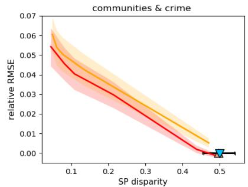

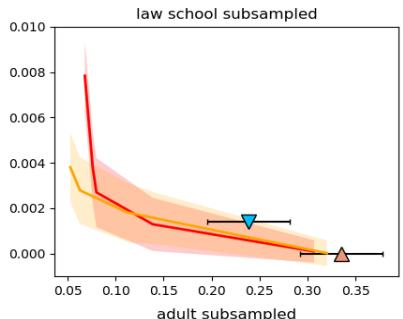

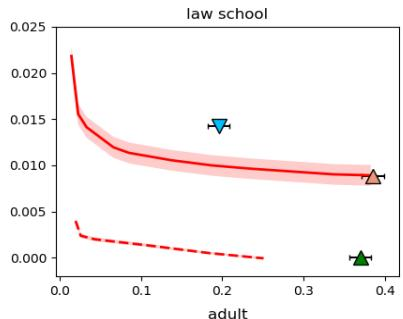

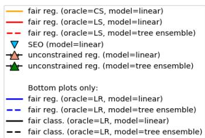

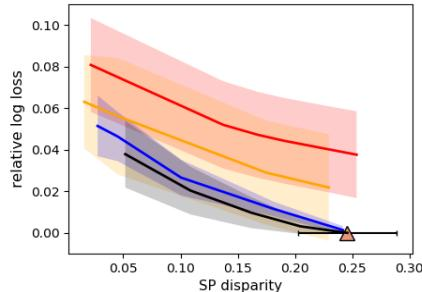

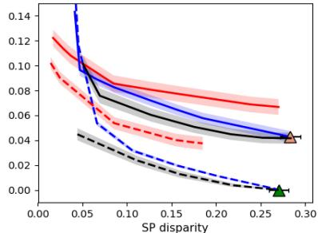  
Figure 1. Relative test loss versus the worst constraint violation with respect to SP. Relative losses are computed by subtracting the smallest baseline loss from the actual loss. For our algorithm and fair classification we plot the convex envelope of the predictors obtained on training data at various accuracy–fairness tradeoffs. We show $9 5 \%$ confidence bands for the relative loss of our method and fair classification, and also show $9 5 \%$ confidence intervals for constraint violation (the same for all methods). Our method dominates or matches the baselines up to statistical uncertainty on all datasets except adult, where fair classification is slightly better.

from Section 4.4: reductions to cost-sensitive (CS) oracles, least-squares (LS) oracles, and logistic-loss minimization (LR) oracles. Our CS oracle sought the linear model minimizing weighted hinge-loss (as a surrogate for weighted classification error). Because of unfavorable scaling of the cost-sensitive problem sizes (see Section 4.4), we only ran the CS oracle on the three small datasets. We considered two variants of LS and LR oracles: linear learners from scikit-learn (Pedregosa et al., 2011), and tree ensembles from XGBoost (Chen & Guestrin, 2016). Tree ensembles heavily overfitted smaller datasets, so we only show their performance on two larger datasets. We only used LR oracles when the target loss was logistic, whereas we used LS oracles across all datasets.

In addition to our algorithm, we also evaluated regression without any fairness constraints, and two baselines from the fair classification and fair regression literature.

On the three datasets where the task was least-squares regression, we evaluated the full substantive equality of opportunity (SEO) estimate of Johnson et al. (2016). It can be obtained in a closed form by solving for the linear model that minimizes least-squares error while having zero correlation with the protected attribute. In contrast, our method seeks to limit not just correlation, but statistical dependence.

On the two datasets where the task was logistic regression, we ran the fair classification (FC) reduction of Agarwal et al. (2018) with the same LR oracles as in our algorithm. For this choice of oracles, the classifiers returned by FC

are implemented by logistic models and return real-valued scores, which we evaluated. We ran FC across a range of trade-offs between classification accuracy and statistical parity (in the classification sense) and show the resulting Pareto front. Note that FC only enforces statistical parity (SP) when the scores are thresholded at zero, whereas our method enforces SP across all thresholds.

In Figure 1, we see that all of our reductions are able to significantly reduce disparity, without strongly impacting the overall loss. On communities & crime, there is a more substantial accuracy–fairness tradeoff, which can be used as a starting point to diagnose the data quality for the two racial subgroups. Our methods dominate SEO in leastsquares tasks, but are slightly worse than FC in logistic regression. The difference is statistically significant only on adult, where it points to the limitations of our LS and LR reduction heuristics. However, for the most part, LR and LS reductions achieve tradeoffs on par with the CS reduction, and are substantially faster to run (see Appendix G). The results on adult and adult subsampled suggest that reducing to a matching loss is preferable over reducing to another loss.

In summary, we have shown that our scheme efficiently handles a range of losses and regressor classes and, where possible, diminishes disparity while maintaining the overall accuracy. The emergence of FC as a strong baseline for logistic regression suggests that our regression-based reduction heuristics can be further improved, which we leave open for future research.

# Acknowledgements

ZSW is supported in part by a Google Faculty Research Award, a J.P. Morgan Faculty Award, and a Facebook Research Award. Part of this work was completed while ZSW was at Microsoft Research-New York City.

# References

Agarwal, A., Beygelzimer, A., Dud´ık, M., Langford, J., and Wallach, H. A reductions approach to fair classification. In ICML, 2018.   
Alabi, D., Immorlica, N., and Kalai, A. Unleashing linear optimizers for group-fair learning and optimization. In Conference on Learning Theory, 2018.   
Aliprantis, C. and Border, K. Infinite Dimensional Analysis: A Hitchhiker’s Guide. Springer Berlin Heidelberg, 2006.   
Anthony, M. and Bartlett, P. L. Neural network learning: Theoretical foundations. cambridge university press, 2009.   
Barocas, S. and Selbst, A. D. Big data’s disparate impact. California Law Review, 104:671–732, 2016.   
Bartlett, P. L. and Mendelson, S. Rademacher and gaussian complexities: Risk bounds and structural results. Journal of Machine Learning Research, 3:463–482, 2002.   
Berk, R., Heidari, H., Jabbari, S., Kearns, M., and Roth, A. Fairness in criminal justice risk assessments: The state of the art. arXiv:1703.09207, 2017.   
Boucheron, S., Bousquet, O., and Lugosi, G. Theory of classification: a survey of some recent advances. ESAIM: Probability and Statistics, 9:323–375, 2005.   
Buolamwini, J. and Gebru, T. Gender shades: Intersectional accuracy disparities in commercial gender classification. In Conference on Fairness, Accountability and Transparency, pp. 77–91, 2018.   
Calders, T., Karim, A., Kamiran, F., Ali, W., and Zhang, X. Controlling attribute effect in linear regression. In 2013 IEEE 13th International Conference on Data Mining, pp. 71–80, 2013.   
Chen, I., Johansson, F. D., and Sontag, D. Why is my classifier discriminatory? In NeurIPS, 2018.   
Chen, T. and Guestrin, C. XGBoost: A scalable tree boosting system. In Proceedings of the 22nd ACM SIGKDD International Conference on Knowledge Discovery and Data Mining, KDD ’16, pp. 785–794, 2016.

Chouldechova, A. Fair prediction with disparate impact: A study of bias in recidivism prediction instruments. Big Data, Special Issue on Social and Technical Trade-Offs, 2017.   
Corbett-Davies, S. and Goel, S. The measure and mismeasure of fairness: A critical review of fair machine learning. arXiv, 2018.   
Dieterich, W., Mendoza, C., and Brennan, T. Compas risk scales: Demonstrating accuracy equity and predictive parity. 2016.   
Fukuchi, K., Sakuma, J., and Kamishima, T. Prediction with model-based neutrality. In Machine Learning and Knowledge Discovery in Databases—European Conference, ECML PKDD 2013, pp. 499–514, 2013.   
Gurobi Optimization, L. Gurobi optimizer reference manual, 2018. URL http://www.gurobi.com.   
Hardt, M., Price, E., and Srebro, N. Equality of opportunity in supervised learning. In Neural Information Processing Systems (NIPS), 2016.   
Holzer, H. J. and Neumark, D. Affirmative action: What do we know? Journal of Policy Analysis and Management, 25(2):463–490, 2006.   
Johnson, K. D., Foster, D. P., and Stine, R. A. Impartial predictive modeling: Ensuring fairness in arbitrary models. arXiv:1608.00528, 2016.   
Kamishima, T., Akaho, S., Asoh, H., and Sakuma, J. Fairness-aware classifier with prejudice remover regularizer. In Machine Learning and Knowledge Discovery in Databases—European Conference, ECML PKDD 2012, pp. 35–50, 2012.   
Kleinberg, J., Mullainathan, S., and Raghavan, M. Inherent trade-offs in the fair determination of risk scores. In Proceedings of the 8th Innovations in Theoretical Computer Science Conference, 2017.   
Komiyama, J., Takeda, A., Honda, J., and Shimao, H. Nonconvex optimization for regression with fairness constraints. In International Conference on Machine Learning, pp. 2742–2751, 2018.   
Ledoux, M. and Talagrand, M. Probability in Banach Spaces: Isoperimetry and Processes. Springer, 1991.   
Lehmann, E. L. and Romano, J. P. Testing statistical hypotheses. Springer Science & Business Media, 2006.   
Lichman, M. UCI machine learning repository, 2013. URL http://archive.ics.uci.edu/ml.

Lowenkamp, C., L Johnson, J., Holsinger, A., Vanbenschoten, S., and R Robinson, C. The federal post conviction risk assessment (pcra): A construction and validation study. Psychological services, 10, 2012.   
Northpointe. Compas risk & need assessment system: Selected questions posed by inquiring agencies. 2010.   
Pedregosa, F., Varoquaux, G., Gramfort, A., Michel, V., Thirion, B., Grisel, O., Blondel, M., Prettenhofer, P., Weiss, R., Dubourg, V., Vanderplas, J., Passos, A., Cournapeau, D., Brucher, M., Perrot, M., and Duchesnay, E. Scikit-learn: Machine learning in Python. Journal of Machine Learning Research, 12:2825–2830, 2011.   
Perez-Suay, A., Laparra, V., Mateo-Garc ´ ´ıa, G., Munoz-Mar ˜ ´ı, J., Gomez-Chova, L., and Camps-Valls, G. Fair kernel´ learning. In Joint European Conference on Machine Learning and Knowledge Discovery in Databases, pp. 339–355. Springer, 2017.   
Podesta, J., Pritzker, P., Moniz, E. J., Holdren, J., and Zients, J. Big data: Seizing opportunities and preserving values. 2014.   
Redmond, M. and Baveja, A. A data-driven software tool for enabling cooperative information sharing among police departments. European Journal of Operational Research 14, 2002.   
Selbst, A. D., Friedler, S., Venkatasubramanian, S., Vertesi, J., et al. Fairness and abstraction in sociotechnical systems. In ACM Conference on Fairness, Accountability, and Transparency (FAT*), 2018.   
US Federal Reserve. Report to the congress on credit scoring and its effects on the availability and affordability of credit. 2007.   
Veale, M., Van Kleek, M., and Binns, R. Fairness and accountability design needs for algorithmic support in high-stakes public sector decision-making. In Proceedings of the 2018 CHI Conference on Human Factors in Computing Systems, 2018.   
Waters, A. and Miikkulainen, R. Grade: Machine learning support for graduate admissions. AI Magazine, 35(1):64, 2014.   
Wightman, L. LSAC National Longitudinal Bar Passage Study, 1998.

# A. Proof of Lemma 1

We begin by rewriting the loss $\ell _ { \alpha }$ as a cost-sensitive classification loss. First, we use the telescoping trick to obtain

$$
\begin{array}{l} \ell_ {\alpha} (y, u) = \ell \left(\underline {{y}}, \lfloor u \rfloor_ {\alpha} + \frac {\alpha}{2}\right) \\ = \ell (\underline {{y}}, \frac {\alpha}{2}) + \sum_ {z \in \mathcal {Z}} \left[ \underbrace {\ell \left(\underline {{y}} , z + \frac {\alpha}{2}\right) - \ell \left(\underline {{y}} , z - \frac {\alpha}{2}\right)} _ {c (\underline {{y}}, z) / N} \right] \mathbf {1} \{u \geq z \}. \\ \end{array}
$$

Now plugging in $u = f ( x )$ and using the fact that for $z \in { \mathcal { Z } }$ , we have ${ \bf 1 } \{ \underline { { f } } ( x ) \geq z \} = { \bf 1 } \{ f ( x ) \geq z \} = h _ { f } ( x , z )$ , we obtain

$$
\ell_ {\alpha} (y, \underline {{f}} (x)) = \ell (\underline {{y}}, \frac {\alpha}{2}) + \frac {1}{N} \sum_ {z \in \mathcal {Z}} c (\underline {{y}}, z) h _ {f} (x, z). \tag {15}
$$

Thus, ignoring the constant $\ell ( y , \textstyle { \frac { \alpha } { 2 } } )$ , the loss $\ell _ { \alpha }$ can be viewed as the cost-sensitive error of the classifier $h _ { f }$ .

For $z \in { \mathcal { Z } }$ , we can rewrite $\gamma _ { a , z } ( f )$ as

$$
\begin{array}{l} \gamma_ {a, z} (\underline {{f}}) = \mathbb {P} [ f (X) \geq z \mid A = a ] - \mathbb {P} [ f (X) \geq z ] \\ = \mathbb {E} \left[ h _ {f} (X, z) \mid A = a \right] - \mathbb {E} \left[ h _ {f} (X, z) \right] \tag {16} \\ = \gamma_ {a, z} (h _ {f}), \\ \end{array}
$$

completing the proof of the lemma.

# B. Iteration Complexity of Algorithm 1

Theorem 4. Algorithm 1 terminates in at most $\frac { 1 6 B ^ { 2 } \log ( 2 | \mathcal { A } | N + 1 ) } { \nu ^ { 2 } }$ iterations. Furthermore, if Q is any feasible point of (11) then the solution $\widehat { Q }$ returned by Algorithm 1 satisfies:

$$
\begin{array}{l} \widehat {\operatorname {c o s t}} (\widehat {Q}) \leq \widehat {\operatorname {c o s t}} (Q) + 2 \nu \\ \left| \widehat {\gamma} _ {a, z} (\widehat {Q}) \right| \leq \widehat {\varepsilon} _ {a} + \frac {2 + 2 \nu}{B} \quad f o r a l l a \in \mathcal {A}, z \in \mathcal {Z}. \\ \end{array}
$$

Proof. This result is essentially a corollary of Theorem 1, and Lemmas 2 and 3 of Agarwal et al. (2018). Specifically, we note that the constraints appearing in our problem (11) can be cast in their general framework along the lines of their Example 1, with a total of $2 | \mathcal { A } | N$ constraints. Following their Example 3, we obtain that the maximal constraint violation $\rho$ , needed in their Theorem 1, is at most 2. We further observe that the violation of the i.i.d. structure by explicit averaging over $z$ values does not impact their optimization analysis in any way. Therefore, their Theorem 1 with $\rho = 2$ implies that our Algorithm 1 finds a $\nu$ -approximate saddle point of the Lagrangian in at most 16B2 log(2|A|N+1) iterations as desired. $\frac { 1 6 B ^ { 2 } \log ( 2 | \mathcal { A } | N + 1 ) } { \nu ^ { 2 } }$ ν2

To bound $\widehat { \mathrm { c o s t } } ( \widehat { Q } )$ and $| \widehat { \gamma } _ { a , z } ( \widehat { Q } ) |$ we appeal to their Lemmas 2 and 3. First note that their approach applies to the objective bof our problem (11) as long as the costs $c ( y , z )$ are in [0, 1] (see their footnote 4). However, in our case, these can be in $[ - 1 , 1 ]$ (see Eq. 9). This does not affect their Theorem 1 and Lemma 2, but their Lemma 3 now holds with the right-hand side equal to $\textstyle { \frac { 2 + 2 \nu } { B } }$ instead of $\textstyle { \frac { 1 + 2 \nu } { B } }$ . Their Lemma 2 immediately yields the bound ${ \widehat { \mathrm { c o s t } } } ( { \widehat { Q } } ) \leq { \widehat { \mathrm { c o s t } } } ( Q ) + 2 \nu$ , whereas the modified Lemma 3 yields the bound $\begin{array} { r } { \left| \widehat { \gamma } _ { a , z } ( \widehat { Q } ) \right| \leq \widehat { \varepsilon } _ { a } + \frac { 2 + 2 \nu } { B } } \end{array}$ for all $a , z$ , finishing the proof. □

# C. Proof of Theorem 2

Before proving the theorem, we recall a standard definition of the Rademacher complexity of a class of functions, which plays an important role in our deviation bounds. Let G be a class of functions $g : \mathcal { U } \to \mathbb { R }$ over some space $\mathcal { U }$ . Then the (worst-case) Rademacher complexity of G is defined as:

$$
R _ {n} (\mathcal {G}) := \sup  _ {u _ {1}, \dots , u _ {n} \in \mathcal {U}} \mathbb {E} _ {\sigma} \left[ \sup  _ {g \in \mathcal {G}} \left| \frac {1}{n} \sum_ {i = 1} ^ {n} \sigma_ {i} g \left(u _ {i}\right) \right| \right], \tag {17}
$$

where the expectation is over the i.i.d. random variables $\sigma _ { 1 } , \ldots , \sigma _ { n }$ with $\mathbb { P } ( \sigma _ { i } = 1 ) = \mathbb { P } ( \sigma _ { i } = - 1 ) = 1 / 2 .$

The Rademacher complexity of a class G can be used to obtain uniform bounds of any Lipschitz continuous transformations of $g \in { \mathcal { G } }$ as follows:

Lemma 2. Let $D$ be a distribution over a pair of random variables $( S , U )$ taking values in ${ \mathcal { S } } \times \mathcal { U } .$ . Let G be a class of functions $g : \mathcal { U } \to [ 0 , 1 ] ,$ , and let $\varphi : \mathcal { S } \times [ 0 , 1 ] \to [ - 1 , 1 ]$ be a contraction in its second argument, i.e., for all $s \in \mathcal { S }$ and all $t , t ^ { \prime } \in [ 0 , 1 ]$ , $| \varphi ( s , t ) - \varphi ( s , t ^ { \prime } ) | \leq | t - t ^ { \prime } |$ . Then with probability at least $1 - \delta ,$ , for all $g \in { \mathcal { G } }$ ,

$$
\left| \widehat {\mathbb {E}} [ \varphi (S, g (U)) ] - \mathbb {E} [ \varphi (S, g (U)) ] \right| \leq 4 R _ {n} (\mathcal {G}) + \frac {2}{\sqrt {n}} + \sqrt {\frac {2 \ln (2 / \delta)}{n}},
$$

where the expectation is with respect to $D$ and the empirical expectation is based on n i.i.d. draws from $D$ . If $\varphi$ is also linear in its second argument then a tighter bound holds, with $4 R _ { n } ( \mathcal { G } )$ replaced by $2 R _ { n } ( \mathcal { G } )$ .

Proof. Let $\Phi : = \{ \varphi _ { g } \} _ { g \in \mathcal { G } }$ be the class of functions $\varphi _ { g } : ( s , u ) \mapsto \varphi ( s , g ( u ) )$ . By Theorem 3.2 of Boucheron et al. (2005), we then have with probability at least $1 - \delta$ , for all $g$ ,

$$
\left| \widehat {\mathbb {E}} [ \varphi (S, g (U)) ] - \mathbb {E} [ \varphi (S, g (U)) ] \right| = \left| \widehat {\mathbb {E}} [ \varphi_ {g} ] - \mathbb {E} [ \varphi_ {g} ] \right| \leq 2 R _ {n} (\Phi) + \sqrt {\frac {2 \ln (2 / \delta)}{n}}. \tag {18}
$$

We will next bound $R _ { n } ( \Phi )$ in terms of $R _ { n } ( \mathcal { G } )$ . For a fixed tuple $( s _ { 1 } , u _ { 1 } ) , \dotsc , ( s _ { n } , u _ { n } )$ , we have

$$
\begin{array}{l} \mathbb {E} _ {\sigma} \left[ \sup  _ {g \in \mathcal {G}} \left| \sum_ {i = 1} ^ {n} \sigma_ {i} \varphi (s _ {i}, g (u _ {i})) \right| \right] \leq \mathbb {E} _ {\sigma} \left[ \sup  _ {g \in \mathcal {G}} \left| \sum_ {i = 1} ^ {n} \sigma_ {i} (\varphi (s _ {i}, g (u _ {i})) - \varphi (s _ {i}, 0)) \right| \right] + \sqrt {n} \\ \leq 2 \mathbb {E} _ {\sigma} \left[ \sup  _ {g \in \mathcal {G}} \left| \sum_ {i = 1} ^ {n} \sigma_ {i} g (u _ {i}) \right| \right] + \sqrt {n} \\ \end{array}
$$

where the first inequality follows from Theorem 12(5) of Bartlett & Mendelson (2002) and the last inequality follows from the contraction principle of Ledoux & Talagrand (1991), specifically their Theorem 4.12. Dividing by $n$ and taking a supremum over $( s _ { 1 } , u _ { 1 } ) , \dotsc , ( s _ { n } , u _ { n } )$ yields the bound

$$
R _ {n} (\Phi) \leq 2 R _ {n} (\mathcal {G}) + \frac {1}{\sqrt {n}}.
$$

Together with the bound (18), this proves the lemma for an arbitrary contraction $\varphi$ . If $\varphi$ is linear in its second argument, we get a tighter bound by invoking Theorem 4.4 of Ledoux & Talagrand (1991) instead of their Theorem 4.12. □

Our proof largely follows the proof of Theorems 2 and 3 of Agarwal et al. (2018). We first use Lemma 2 to show that by solving the empirical problem (11), we also obtain an approximate solution of the corresponding population problem:

$$
\min  _ {Q \in \Delta (\mathcal {H})} \operatorname {c o s t} (Q) \text {s . t .} | \gamma_ {a, z} (Q) | \leq \varepsilon_ {a} \forall a \in \mathcal {A}, z \in \mathcal {Z}. \tag {19}
$$

The theorem will then follow by invoking the equivalence between problem (19) and the discretized fair regression (8), and adding up various approximation errors.

Bounding empirical deviations in the cost and constraints. To bound the deviations in the cost, we need to be a bit careful, because the definition of cost  mixes the empirical expectation over the data with the averaging over $z \in { \mathcal { Z } }$ . For the analysis, we therefore define

$$
\widehat {\operatorname {c o s t}} _ {z} (h) = \widehat {\mathbb {E}} \big [ c (\underline {{Y}}, z) h (X, z) \big ] \quad \text {a n d} \quad \operatorname {c o s t} _ {z} (h) = \mathbb {E} \big [ c (\underline {{Y}}, z) h (X, z) \big ].
$$

Since $c ( \underline { { Y } } , z ) \in [ - 1 , 1 ]$ , we can invoke Lemma 2 with $S = c ( \underline { { Y } } , z )$ , $\boldsymbol { U } = \left( \boldsymbol { X } , \boldsymbol { z } \right)$ , $\mathcal { G } = \mathcal { H }$ , and $\varphi ( s , t ) = s t$ to obtain that with probability at least $1 - \delta / 2$ for all $z \in { \mathcal { Z } }$ and all $h \in { \mathcal { H } }$

$$
\left| \widehat {\operatorname {c o s t}} _ {z} (h) - \operatorname {c o s t} _ {z} (h) \right| \leq 2 R _ {n} (\mathcal {H}) + \frac {2}{\sqrt {n}} + \sqrt {\frac {2 \ln (4 N / \delta)}{n}} = \widetilde {O} (n ^ {- \beta}),
$$

where the last equality follows by Assumption 1 and the setting $N \propto n ^ { \beta }$ . Taking an average over $z \in { \mathcal { Z } }$ and a convex combination according to any $Q \in \Delta ( { \mathcal { H } } )$ , we obtain by Jensen’s inequality that with probability at least $1 - \delta / 2$ for all $Q \in \Delta ( { \mathcal { H } } )$

$$
\left| \widehat {\operatorname {c o s t}} (Q) - \operatorname {c o s t} (Q) \right| = \widetilde {O} \left(n ^ {- \beta}\right). \tag {20}
$$

To bound the deviations in the constraints, we invoke Lemma 2 with $S = 1$ , $\boldsymbol { U } = ( X , z )$ , ${ \mathcal { G } } = { \mathcal { H } }$ , and $\varphi ( s , t ) = s t$ , but apply it to the data distribution conditioned on $A = a$ . We thus obtain that with with probability at least $1 - \delta / 2$ for all

$a \in { \mathcal { A } }$ , $z \in { \mathcal { Z } }$ , and $h \in { \mathcal { H } }$

$$
\left| \widehat {\gamma} _ {a, z} (h) - \gamma_ {a, z} (h) \right| \leq 2 R _ {n _ {a}} (\mathcal {H}) + \frac {2}{\sqrt {n _ {a}}} + \sqrt {\frac {2 \ln (4 | \mathcal {A} | N / \delta)}{n _ {a}}}.
$$

By Jensen’s inequality this also means that with probability at least $1 - \delta / 2$ for all $a \in { \mathcal { A } }$ , $z \in { \mathcal { Z } }$ , and $Q \in \Delta ( { \mathcal { H } } )$

$$
\left| \widehat {\gamma} _ {a, z} (Q) - \gamma_ {a, z} (Q) \right| \leq 2 R _ {n _ {a}} (\mathcal {H}) + \frac {2}{\sqrt {n _ {a}}} + \sqrt {\frac {2 \ln (4 | \mathcal {A} | N / \delta)}{n _ {a}}}. \tag {21}
$$

In the remainder of the analysis, we assume that Eqs. (20) and (21) both hold, which occurs with probability at least $1 - \delta$ by the union bound.

Putting it all together. Given the settings of $\nu$ , $B$ and $N$ , we obtain by Theorem 4 that Algorithm 1 terminates in $O \big ( n ^ { 4 \beta } \ln ( n ^ { \beta } | \mathcal { A } | ) \big )$ iterations, as desired, and returns a distribution $\widehat { Q }$ which compares favorably with any feasible point $Q$ of the empirical problem (11), meaning that for any such $Q$ , we have

$$
\widehat {\operatorname {c o s t}} (\widehat {Q}) \leq \widehat {\operatorname {c o s t}} (Q) + O \left(n ^ {- \beta}\right) \tag {22}
$$

$$
\left| \widehat {\gamma} _ {a, z} (\widehat {Q}) \right| \leq \widehat {\varepsilon} _ {a} + O \left(n ^ {- \beta}\right) \quad \text {f o r a l l} a \in \mathcal {A}, z \in \mathcal {Z}. \tag {23}
$$

Now bounding $\widehat { \mathrm { c o s t } } ( \widehat { Q } )$ and $\widehat { \mathrm { c o s t } } ( Q )$ in Eq. (22) via the uniform convergence bound (20), we obtain

$$
\operatorname {c o s t} (\widehat {Q}) \leq \operatorname {c o s t} (Q) + \widetilde {O} \left(n ^ {- \beta}\right). \tag {24}
$$

Similarly, bounding $\widehat { \gamma } _ { a , z } ( \widehat { Q } )$ via the bound (21) and $\widehat { \varepsilon } _ { a } \leq \varepsilon _ { a } + \widetilde { O } ( n _ { a } ^ { - \beta } )$ via Assumption 1 and our setting of $C ^ { \prime }$ , we obtain

$$
\left| \gamma_ {a, z} (\widehat {Q}) \right| \leq \varepsilon_ {a} + \widetilde {O} \left(n _ {a} ^ {- \beta}\right) \quad \text {f o r a l l} a \in \mathcal {A}, z \in \mathcal {Z}. \tag {25}
$$

Above, we assumed that $Q$ was a feasible point of the empirical problem (11). However, assuming that Eq. (21) holds, any feasible solution of the population problem (19) is also feasible in the empirical problem (11) thanks to our setting of $C ^ { \prime }$ Thus, Eqs. (24) and (25) show that the solution $\widehat { Q }$ is approximately feasible and approximately optimal in the population problem (19). It remains to relate $\widehat { Q }$ to the original fair regression problem (3).

First, by Lemma 1 and Eqs. (24) and (25), we can interpret $\widehat { Q }$ as a distribution over the set of discretized regressors $\mathcal { F }$ and obtain that for all $Q \in \Delta ( \mathfrak { F } )$ that are feasible in the discretized fair regression problem (8), we have

$$
\left. \operatorname {l o s s} _ {\alpha} (\widehat {Q}) \leq \operatorname {l o s s} _ {\alpha} (Q) + \widetilde {O} \left(n ^ {- \beta}\right) \right. \tag {26}
$$

$$
\left| \gamma_ {a, z} (\widehat {Q}) \right| \leq \varepsilon_ {a} + \widetilde {O} \left(n _ {a} ^ {- \beta}\right) \quad \text {f o r a l l} a \in \mathcal {A}, z \in [ 0, 1 ], \tag {27}
$$

where in Eq. (27) we have expanded the domain $z \in { \mathcal { Z } }$ to $z \in [ 0 , 1 ]$ thanks to Eq. (7). Finally, by substituting the solution $Q ^ { * }$ of problem (8) as $\boldsymbol { Q }$ in Eq. (26) and applying Theorem 1, we obtain that for any $Q ^ { \ast } \in \Delta ( \mathcal { F } )$ that is feasible in the discretized fair regression problem (8), we have

$$
\left. \left. \operatorname {l o s s} (\widehat {Q}) \leq \operatorname {l o s s} (Q ^ {*}) + \alpha + \widetilde {O} \left(n ^ {- \beta}\right) = \operatorname {l o s s} (Q ^ {*}) + \widetilde {O} \left(n ^ {- \beta}\right), \right. \right. \tag {28}
$$

where the last equality follows by our setting $\alpha = 1 / N = O ( n ^ { - \beta } )$ . The theorem now follows from Eqs. (28) and (27).

# D. Algorithm for Fair Regression under Bounded Group Loss

In this section we provide a detailed pseudocode of our algorithm for fair regression under BGL, described at a high level in Section 5.

# E. Proof of Theorem 3

The analysis of Algorithm 2 proceeds similarly to the analysis of Algorithm 1.

Iteration complexity. Similarly to our analysis of Algorithm 1 in Theorem 4, we can appeal to Theorem 1, and Lemmas 2 and 3 of Agarwal et al. (2018). While our objective and constraints are for the distributions $Q$ over $[ 0 , 1 ]$ -valued predictors $f \in { \mathcal { F } }$ , whereas their analysis is for distributions over $\{ 0 , 1 \}$ -valued classifiers, we can still directly use their Theorem 1, and Lemmas 2 and 3, because they only rely on the bilinear structure of the Lagrangian with respect to $Q$ and $\boldsymbol { \lambda }$ and the boundedness of the objective and constraints, which all hold in our setting. The maximal constraint violation, needed in their Theorem 1, is $\rho \leq 1$ . Therefore, their Theorem 1 implies that Algorithm 2 terminates in at most $4 B ^ { 2 } \ln ( | A | + 1 ) / \nu ^ { 2 } = O ( n ^ { 4 \omega } \ln | A | )$ iterations and finds a $\nu$ -approximate saddle point $\widehat { Q }$ of problem (14), albeit sometimes

Algorithm 2 Fair regression with bounded group loss   
Input: training examples $\{(X_i,Y_i,A_i)\}_{i = 1}^n$ , slacks in fairness constraint $\widehat{\zeta}_a\in [0,1]$ , bound $B$ , convergence threshold $\nu$ Define best-response functions: $\mathrm{BEST}_f(\lambda)\coloneqq \arg \min_{f\in \mathcal{F}}L^{\mathrm{BGL}}(f,\lambda)$ $\mathrm{BEST}_{\lambda}(Q)\coloneqq \arg \max_{\lambda \geq 0,\| \lambda \| _1\leq B}L^{\mathrm{BGL}}(Q,\lambda)$ 1: Set learning rate $\eta = \nu /(2B)$ 2: Set $\theta_{1} = 0\in \mathbb{R}^{|\mathcal{A}|}$ 3: for $t = 1,2,\ldots$ do   
4: for all a do // Compute $\lambda_{t}$ from $\theta_{t}$ and find the best response $f_{t}$ 5: $\lambda_{t,a}\gets B\exp \{\theta_{t,a}\} /(1 + \sum_{a}\exp \{\theta_{t,a}\})$ 6: end for   
7: $f_{t}\gets \mathrm{BEST}_{f}(\lambda_{t})$ 8: $\widehat{Q}_t\gets \frac{1}{t}\sum_{t' = 1}^t f_{t'}$ $\widehat{\lambda}_{t}\gets \frac{1}{t}\sum_{t^{\prime} = 1}^{t}\lambda_{t^{\prime}}$ // Calculate the current approximate saddle point   
9: $\overline{\nu}\gets L^{\mathrm{BGL}}(\widehat{Q}_t,\mathrm{BEST}_{\lambda}(\widehat{Q}_t)) - L^{\mathrm{BGL}}(\widehat{Q}_t,\widehat{\lambda}_t)$ // Check the suboptimality of $(\widehat{Q}_t,\widehat{\lambda}_t)$ 10: $\underline{\nu}\gets L^{\mathrm{BGL}}(\widehat{Q}_t,\widehat{\lambda}_t) - L^{\mathrm{BGL}}(\mathrm{BEST}_f(\widehat{\lambda}_t),\widehat{\lambda}_t)$ 11: if max $\{\overline{\nu},\underline{\nu}\} \leq \nu$ then // Terminate if converged   
12: if $\widehat{\gamma}^{\mathrm{BGL}}(\widehat{Q}_t)\leq \widehat{\zeta}_a + \frac{1 + 2\nu}{B}$ for all $a\in A$ then   
13: return $\widehat{Q}_t$ 14: else   
15: return null   
16: end if   
17: end if   
18: Set $\theta_{t + 1} = \theta_t + \eta \widehat{\gamma}^{\mathrm{BGL}}(f_t) - \eta \widehat{\zeta}$ // Apply the exponentiated-gradient update   
19: end for

it ends up returning null instead of $\widehat { Q }$ . To prove the theorem we consider two cases.

Case I: There is a feasible solution $Q ^ { * }$ to the original problem (4). Given the settings of $\nu$ and $B$ , and using Lemmas 2 and 3 of Agarwal et al. (2018), we obtain that the $\nu$ -approximate saddle point $\widehat { Q }$ of the empirical problem (14) satisfies

$$
\widehat {\operatorname {l o s s}} (\widehat {Q}) \leq \widehat {\operatorname {l o s s}} (Q) + 2 \nu \tag {29}
$$

$$
\widehat {\gamma} _ {a} ^ {\mathrm {B G L}} (\widehat {Q}) \leq \widehat {\zeta} _ {a} + \frac {1 + 2 \nu}{B} \quad \text {f o r a l l} a \in \mathcal {A}, \tag {30}
$$

for any distribution $Q$ feasible in the empirical problem (13). Eq. (30) implies that in this case the algorithm returns $\widehat { Q } \neq \dot { n } u l l$ . It remains to argue that statements similar to (29) and (30) hold for true expectations rather than just empirical expectations.

To turn the statements (29) and (30) into matching population versions, we use the concentration result of Lemma 2 similarly as in the proof of Theorem 2. Specifically, we invoke Lemma 2 with $S = Y$ , $U = X$ , $\mathcal { G } = \mathcal { F }$ , and $\varphi ( s , t ) = \ell ( s , t )$ , separately for the data distribution (with failure probability $\delta / 2$ ) and the data distribution conditioned on each $A = a$ (with failure probabilities $\delta / ( 2 | \mathcal { A } | )$ ). We thus obtain that with probability at least $1 - \delta$ , for all $Q \in \Delta ( { \mathcal F } )$ ,

$$
\left| \widehat {\operatorname {l o s s}} (Q) - \operatorname {l o s s} (Q) \right| \leq 4 R _ {n} (\mathcal {F}) + \frac {2}{\sqrt {n}} + \sqrt {\frac {2 \ln (4 / \delta)}{n}}
$$

$$
\left| \hat {\gamma} _ {a} ^ {\mathrm {B G L}} (Q) - \gamma_ {a} ^ {\mathrm {B G L}} (Q) \right| \leq 4 R _ {n _ {a}} (\mathcal {F}) + \frac {2}{\sqrt {n _ {a}}} + \sqrt {\frac {2 \ln (4 | \mathcal {A} | / \delta)}{n _ {a}}} \quad \text {f o r a \in \mathcal {A}}.
$$

By Assumption 2 and our setting of $C ^ { \prime }$ , this implies that with probability at least $1 - \delta$ , for all $Q \in \Delta ( { \mathcal { F } } )$ ,

$$
\left| \widehat {\operatorname {l o s s}} (Q) - \operatorname {l o s s} (Q) \right| = \widetilde {O} \left(n ^ {- \omega}\right) \tag {31}
$$

$$
\left| \hat {\gamma} _ {a} ^ {\mathrm {B G L}} (Q) - \gamma_ {a} ^ {\mathrm {B G L}} (Q) \right| \leq C ^ {\prime} n _ {a} ^ {- \omega} \quad \text {f o r a l l} a \in \mathcal {A}. \tag {32}
$$

We continue the analysis assuming that the uniform convergence bounds (31) and (32) both hold. Instantiating the bound (31) for $\widehat { \mathrm { l o s s } } ( Q )$ and $\widehat { \mathrm { l o s s } } ( \widehat { Q } )$ in Eq. (29) yields, for any $Q$ feasible in the empirical problem (13),

$$
\left. \operatorname {l o s s} (\widehat {Q}) \leq \operatorname {l o s s} (Q) + 2 \nu + \widetilde {O} \left(n ^ {- \omega}\right) = \operatorname {l o s s} (Q) + \widetilde {O} \left(n ^ {- \omega}\right), \right. \tag {33}
$$

where the last equality follows by our setting of $\nu$ . Similarly, instatianting the bound (32) for $\widehat { \gamma } _ { a } ^ { \mathrm { B G L } } ( \widehat { Q } )$ in Eq. (30) yields

$$
\gamma_ {a} ^ {\mathrm {B G L}} (\widehat {Q}) \leq \widehat {\zeta} _ {a} + \frac {1 + 2 \nu}{B} + \widetilde {O} \left(n _ {a} ^ {- \omega}\right) \leq \zeta_ {a} + \widetilde {O} \left(n _ {a} ^ {- \omega}\right) \quad \text {f o r a l l} a \in \mathcal {A}, \tag {34}
$$

where the last inequality follows by our setting of $B$ , $\nu$ , and $C ^ { \prime }$ as well as the bound $\widehat { \zeta _ { a } } \leq \zeta _ { a } + C ^ { \prime } n _ { a } ^ { - \omega }$ from Assumption 2.

Above, we assumed that $Q$ was a feasible point of the empirical problem (13). However, assuming that Eq. (32) holds, any feasible solution of the population problem (4) is also feasible in the empirical problem (13) thanks to our setting of $C ^ { \prime }$ . Thus, Eqs. (33) and (34) hold for any $Q ^ { * }$ feasible in (4), proving the theorem in this case.

Case II: There is no feasible solution $Q ^ { * }$ to the original problem (4). In this case, the $\nu$ -approximate saddle point $\widehat { Q }$ that the algorithm finds may still satisfy

$$
\widehat {\gamma} _ {a} ^ {\mathrm {B G L}} (\widehat {Q}) \leq \widehat {\zeta} _ {a} + \frac {1 + 2 \nu}{B} \quad \text {f o r a l l} a \in \mathcal {A}, \tag {35}
$$

in which case the algorithm returns $\widehat { Q }$ and the theorem holds vacuously since here is no feasible point $Q ^ { * }$ . If the found approximate saddle point does not satisfy Eq. (35), then the algorithm returns null and the theorem also holds.

# F. Details for Efficient Implementation of Algorithm 1

On the high level, Algorithm 1 keeps track of auxiliary vectors $\pmb { \theta } _ { t } ^ { + } , \pmb { \theta } _ { t } ^ { - } \in \mathbb { R } ^ { | \mathcal { A } | N }$ . These are used to obtain the vector $\lambda _ { t } \in \mathbb { R } 2 | \mathcal { A } | N$ played by the $\boldsymbol { \lambda }$ -player. The $Q$ -player responds to $\lambda _ { t }$ by playing $h _ { t } \in \mathcal { H }$ (Step 7), which is used to update $\theta _ { t } ^ { \pm }$ . The average of $\lambda _ { t }$ ’s and $h _ { t }$ ’s played so far is the candidate solution for the saddle-point problem

$$
\min  _ {Q \in \Delta} \max  _ {\lambda \geq \mathbf {0}, \| \boldsymbol {\lambda} \| _ {1} \leq B} L (Q, \boldsymbol {\lambda}). \tag {36}
$$

The algorithm checks the suboptimality of this solution and terminates once the convergence $\nu$ is reached (Steps 9–11).

The updates of ${ \pmb { \theta } } _ { t } ^ { + }$ and ${ \pmb \theta } _ { t } ^ { - }$ (Step 12) run in time $O ( | \mathcal { A } | N )$ assuming that $\gamma ( h _ { t } )$ has already been calculated. Similarly, the transformation of ${ \pmb { \theta } } _ { t } ^ { + }$ and ${ \pmb \theta } _ { t } ^ { - }$ to $\lambda _ { t }$ (Steps 4–6) runs in time $O ( | \mathcal { A } | N )$ , because the denominator is the same across all coordinates and so it needs to be computed only once. We next show that the remaining operations, except for the two $\boldsymbol { \mathrm { B E S T } } _ { h }$ calls, run in time $O ( n \log n + | \mathcal { A } | N )$ .

Computation of $\widehat { \mathrm { c o s t } } ( h _ { f } )$ and $\widehat { \gamma } ( h _ { f } )$ . This computation is implicit in the calculation of Lagrangian in Steps 9–10, and also in the updates of ${ \pmb { \theta } } _ { t } ^ { + }$ and ${ \pmb \theta } _ { t } ^ { - }$ in Step 12. By Eq. (15),

$$
\widehat {\operatorname {c o s t}} (h _ {f}) = \widehat {\mathbb {E}} \left[ \ell_ {\alpha} (Y, \underline {{f}} (X)) - \ell \left(Y, \frac {\alpha}{2}\right) \right],
$$

so it can be calculated in time $O ( n )$ in a single pass over examples. To calculate $\widehat { \gamma } ( h _ { f } )$ , we keep the training examples partitioned into $| { \mathcal { A } } |$ disjoint sets according to their protected attribute $A$ . Let $n _ { a }$ be the number of examples with $A = a$ . We sort these examples according to $f ( X )$ in time $O ( n _ { a } \log { n _ { a } } )$ . Now going through these examples from the largest $f ( X )$ value to the smallest allows us to calculate the conditional expectations

$$
\widehat {\mathbb {E}} [ h _ {f} (X, z) \mid A = a ] = \widehat {\mathbb {P}} [ f (X) \geq z \mid A = a ]
$$

across all $z$ in time $O ( n _ { a } + N )$ . Since we need to do this for all $a \in { \mathcal { A } }$ , the overall runtime is $O ( n \log n + | \mathcal { A } | N )$ . Finally, to calculate $\widehat { \gamma }$ we also need expectations $\widehat { \mathbb { E } } [ h _ { f } ( X , z ) ]$ , which can be obtained by taking weighted sums of ${ \widehat { \mathbb { E } } } [ h _ { f } ( X , z ) \mid A = a ]$ in time $O ( | \mathcal { A } | N )$ . Altogether, the running time of computing $\widehat { \mathrm { c o s t } } ( h _ { f } )$ and $\widehat { \gamma } ( h _ { f } )$ is therefore $O ( n \log n + | \mathcal { A } | N )$ .

Computation of $L ( h _ { f } , \lambda )$ and $L ( \widehat { Q } _ { t } , \lambda )$ . Lagrangian is evaluated in Steps 9–10 to determine whether the algorithm has converged. Note that $L ( Q , \lambda )$ depends on $Q$ only through $\widehat { \mathrm { c o s t } } ( Q )$ and $\widehat { \gamma } ( Q )$ . If we have already computed these, $L ( Q , \lambda )$ can be evaluated in time $O ( | \mathcal { A } | N )$ . To calculate $L ( h _ { f } , \lambda )$ bfor an arbitrary $h _ { f }$ , we first need to calculate $\widehat { \mathrm { c o s t } } ( h _ { f } )$ and $\widehat { \gamma } ( h _ { f } )$ , so the overall running time is $O ( n \log n + | \mathcal { A } | N )$ . To calculate $L ( \widehat { Q } _ { t } , \lambda )$ , note that $\begin{array} { r } { \widehat { \mathrm { c o s t } } ( \widehat { Q } _ { t } ) = \frac { 1 } { t } \sum _ { t ^ { \prime } = 1 } ^ { t } \widehat { \mathrm { c o s t } } ( h _ { t ^ { \prime } } ) } \end{array}$ b, so we can obtain $\widehat { \mathrm { c o s t } } ( \widehat { Q } _ { t } )$ from $\widehat { \mathrm { c o s t } } ( \widehat { Q } _ { t - 1 } )$ at the cost of evaluation of $\widehat { \mathrm { c o s t } } ( h _ { t } )$ and similarly for $\widehat { \gamma } ( \widehat { Q } _ { t } )$ . Therefore, the first evaluation of the form $L ( \widehat { Q } _ { t } , \lambda )$ takes time $O ( n \log n + | \mathcal { A } | N )$ and each consequent evaluation takes time $O ( | \mathcal { A } | N )$ .

Computation of $\mathrm { B E S T } _ { \lambda } ( \widehat { Q } _ { t } )$ . The best response of the $\lambda$ -player is used in Step 9 to determine the suboptimality of the

current solution. Given an arbitrary $Q$ , $\mathrm { B E S T } _ { \lambda } ( Q )$ returns $\lambda$ maximizing $L ( Q , \lambda )$ over $\lambda \geq 0$ , $\| \lambda \| _ { 1 } \leq B$ . By first-order optimality, the optimizing $\boldsymbol { \lambda }$ is either 0 or puts all of its mass on the most violated constraint among $\widehat { \gamma } _ { a , z } ( Q ) \ \leq \widehat { \varepsilon } _ { a }$ , $\widehat { \gamma } _ { a , z } ( Q ) \geq - \widehat { \varepsilon } _ { a }$ . In particular, let ${ \bf e } _ { a , z } ^ { + }$ and ${ \mathbf { e } } _ { a , z } ^ { - }$ denote the basis vectors corresponding to coordinates $\lambda _ { a , z } ^ { + }$ and $\lambda _ { a , z } ^ { - }$ . The bcall to $\mathrm { B E S T } _ { \lambda } ( Q )$ first calculates

$$
(a ^ {*}, z ^ {*}) = \underset {(a, z)} {\arg \max } \left[ | \widehat {\gamma} _ {a, z} (Q) | - \widehat {\varepsilon} _ {a} \right]
$$

and then returns

$$
\left\{ \begin{array}{l l} B \mathbf {e} _ {a ^ {*}, z ^ {*}} ^ {+} & \text {i f} \widehat {\gamma} _ {a ^ {*}, z ^ {*}} (Q) > \widehat {\varepsilon} _ {a ^ {*}} \\ B \mathbf {e} _ {a ^ {*}, z ^ {*}} ^ {-} & \text {i f} \widehat {\gamma} _ {a ^ {*}, z ^ {*}} (Q) <   - \widehat {\varepsilon} _ {a ^ {*}} \\ \mathbf {0} & \text {o t h e r w i s e .} \end{array} \right.
$$

Thus, $\mathrm { B E S T } _ { \lambda } ( \widehat { Q } _ { t } )$ can be calculated in time $O ( | \mathcal { A } | N )$ as long as we have $\widehat { \gamma } ( \widehat { Q } _ { t } )$ , whose computation we have already accounted for within the computation of the Lagrangian of the form $L ( \widehat { Q } _ { t } , \lambda )$ .

# F.1. Details for Reduction to Cost-sensitive Classification

By definition of $\widehat { \gamma } _ { a , z } ( h )$ , we have

$$
\begin{array}{l} \sum_ {a, z} \lambda_ {a, z} \widehat {\gamma} _ {a, z} (h) = \sum_ {a, z} \lambda_ {a, z} \left(\frac {1}{p _ {a}} \widehat {\mathbb {E}} [ h (X, z) \mathbf {1} \{A = a \} ] - \widehat {\mathbb {E}} [ h (X, z) ]\right) \\ = \widehat {\mathbb {E}} \left[ N \mathbb {E} _ {Z} \left[ \sum_ {a} \lambda_ {a, Z} h (X, Z) \left(\frac {\mathbf {1} \{A = a \}}{p _ {a}} - 1\right) \right] \right] \\ = \widehat {\mathbb {E}} \left[ N \mathbb {E} _ {Z} \left[ \left(\frac {\lambda_ {A , Z}}{p _ {A}} - \sum_ {a} \lambda_ {a, Z}\right) h (X, Z) \right] \right]. \tag {37} \\ \end{array}
$$

In particular, Eqs. (10) and (37) imply that the minimization of $L ( h , \lambda )$ is indeed equivalent to minimizing the right-hand side of Eq. (12) as claimed.

# F.2. Details for Reduction to Least-squares Regression

The construction of the least-squares regression data set begins with Eq. (12), which states that for $h _ { f } \in \mathcal { H }$

$$
\widehat {\operatorname {c o s t}} \left(h _ {f}\right) + \sum_ {a, z} \lambda_ {a, z} \widehat {\gamma} _ {a, z} \left(h _ {f}\right) = \frac {1}{n} \sum_ {i \leq n} \sum_ {z \in \mathbb {Z}} \frac {1}{N} c _ {\boldsymbol {\lambda}} \left(\underline {{Y}} _ {i}, A _ {i}, z\right) h _ {f} \left(X _ {i}, z\right). \tag {38}
$$

We will now rewrite the inner summation over $z$ as a loss function for the predictor $f$ , parameterized by $\boldsymbol { \lambda }$ . More precisely, for any $a \in { \mathcal { A } }$ and $\tilde { y } \in \tilde { \mathcal { Y } }$ , let the “loss” function for a prediction $u$ be defined as

$$
g _ {\boldsymbol {\lambda}} (\tilde {y}, a, u) = \sum_ {z \in \mathcal {Z}, z \leq u} \frac {1}{N} c _ {\boldsymbol {\lambda}} (\tilde {y}, a, z).
$$

Now consider a specific $i$ in Eq. (38). Let $X : = X _ { i }$ , $A : = A _ { i }$ and ${ \tilde { Y } } : = Y _ { i }$ . Then the summation over $z$ for this specific $i$ can be written as

$$
\begin{array}{l} \sum_ {z \in \mathbb {Z}} \frac {1}{N} c _ {\boldsymbol {\lambda}} (\tilde {Y}, A, z) h _ {f} (X, z) = \sum_ {z \in \mathbb {Z}} \left[ g _ {\boldsymbol {\lambda}} (\tilde {Y}, A, z) - g _ {\boldsymbol {\lambda}} (\tilde {Y}, A, z - \alpha) \right] \mathbf {1} \{f (X) \geq z \} \\ = g _ {\lambda} (\tilde {Y}, A, \lfloor f (X) \rfloor_ {\alpha}) \\ = g _ {\lambda} (\tilde {Y}, A, f (X)). \\ \end{array}
$$

Plugging this back into Eq. (38), we see that the minimization of Eq. (38) over $h \in { \mathcal { H } }$ is equivalent to the minimization of the empirical loss under $g _ { \lambda }$ among $f \in { \mathcal { F } }$ :

$$
\min  _ {f \in \mathcal {F}} \left[ \frac {1}{n} \sum_ {i = 1} ^ {n} g _ {\boldsymbol {\lambda}} \left(\underline {{Y}} _ {i}, A _ {i}, f \left(X _ {i}\right)\right) \right].
$$

Solving this problem directly seems to require access to a generic optimization oracle. We instead use a heuristic, where we first pick

$$
U_{i}\in \operatorname *{arg  min}_{u\in [0,1]}g_{\boldsymbol {\lambda}}(\underline{Y}_{i},A_{i},u)
$$

and then seek to solve the least-squares regression problem

$$
\min  \sum_ {i \leq n} (U _ {i} - f (X _ {i})) ^ {2}.
$$

To obtain the values $U _ { i }$ we first calculate the values $c _ { \lambda } ( \widetilde { y } , a , z )$ across all ${ \tilde { y } } , a $ , and $z$ in the overall time $O ( | \mathcal { A } | | \tilde { \mathcal { Y } } | N )$ . Then, using the definition of $g _ { \lambda }$ , the minimizer of $g _ { \lambda } ( \tilde { y } , a , u )$ over $u$ can be found in time $O ( N )$ for each specific value of $\tilde { y }$ and $a$ so all the minimizers can be precalculated in time $O ( | \mathcal { A } | | \tilde { \mathcal { Y } } | N )$ . Thus, preparing the data set for the least-squares reduction takes time $O ( | \mathcal { A } | | \tilde { \mathcal { Y } } | N )$ and the resulting regression data set is of size $n$ .

# F.3. Details for Reduction to Risk Minimization under $\ell$

The same reasoning that yielded the reduction to the least-squares regression can be used to derive a reduction to risk minimization under any loss $\ell ( y , u )$ that is convex in $u$ . We again begin with computing the minimizers $U _ { i }$ for each $g _ { \mathsf { \lambda } } ( \underline { { Y } } _ { i } , A _ { i } , f ( X _ { i } ) )$ term. Now suppose that there are two values $\tilde { Y } _ { i , 1 } , \tilde { Y } _ { i , 2 } ~ \in ~ [ 0 , 1 ]$ such that $\begin{array} { r } { \frac { \partial } { \partial u } \ell ( \tilde { Y } _ { i , 1 } , U _ { i } ) \ \leq \ 0 } \end{array}$ and $\begin{array} { r } { \frac { \partial } { \partial { u } } \ell ( \tilde { Y } _ { i , 2 } , U _ { i } ) \geq 0 } \end{array}$ (if $\ell$ is non-smooth, we can pick arbitrary elements of the subdifferential set). If no such pair exists, then it is not possible to obtain $f ( X _ { i } ) = U _ { i }$ by minimizing $\ell$ over any distribution of examples since the gradient can never vanish at $U _ { i }$ . However, if such a pair exists, we can induce weights $W _ { i , 1 } , W _ { i , 2 } \in [ 0 , 1 ]$ such that $W _ { i , 1 } + W _ { i , 2 } = 1$ and

$$
W _ {i, 1} \frac {\partial}{\partial u} \ell \left(\tilde {Y} _ {i, 1}, U _ {i}\right) + W _ {i, 2} \frac {\partial}{\partial u} \ell \left(\tilde {Y} _ {i, 2}, U _ {i}\right) = 0.
$$

Hence, we create two weighted examples for each $( X _ { i } , A _ { i } , Y _ { i } )$ triple in our dataset, and solve

$$
\min  _ {f \in \mathcal {F}} \sum_ {i = 1} ^ {n} \left[ W _ {i, 1} \ell \left(\tilde {Y} _ {i, 1}, f (X _ {i})\right) + W _ {i, 2} \ell \left(\tilde {Y} _ {i, 2}, f (X _ {i})\right) \right].
$$

For instance, for logistic loss, we can always pick $\tilde { Y } _ { i , 1 } = 0$ , $\tilde { Y } _ { i , 2 } = 1$ and $W _ { i , 2 } = U _ { i }$ . The complexity of this reduction is identical to that of the least-squares reduction above, but the resulting risk minimization problem might be better aligned with the original problem as the experiments in Section 6 show.

# G. Additional Experimental Results

In this section, we include further details on our experimental evaluation.

Evaluation on the training sets. In Figure 2 we include the training performances of our algorithm and the baseline methods, including the SEO method and the unconstrained regressors. Our method generally dominated or closely matched the baseline methods. The SEO method provided solutions that were not Pareto optimal on the law school data set.

Implementation of the cost-sensitive oracle. Given an instance of cost-sensitive classification problem, CS oracle optimizes the equivalent weighted binary classification problem on the data $\{ W _ { i } , X _ { i } ^ { \prime } , Y _ { i } \} _ { i = 1 } ^ { n }$ with each $X _ { i } ^ { \prime } = ( x _ { i } , z _ { i } )$ (see Section 3 for the transformation). The oracle aims to solve

$$
\min  _ {h \in \mathcal {H}} \sum_ {i = 1} ^ {n} W _ {i} \mathbf {1} \left\{h \left(X _ {i} ^ {\prime}\right) \neq Y _ {i} \right\}. \tag {39}
$$

where every function $h$ in the class $\mathcal { H }$ is parameterized by a vector $\beta$ and defined as $h ( x , z ) = \mathbf { 1 } \left\{ \langle \beta , x \rangle \geq z \right\}$ for any input $( x , z )$ . Instead of optimizing over the objective in (39), we will consider the following minimization problem with hinge loss. It will be convenient to consider the labels $Y _ { i }$ take values $\{ \pm 1 \}$ and each predictor $h$ predicts in $\{ \pm 1 \}$ . Then the optimization becomes:

$$
\min  _ {\beta} \sum_ {i = 1} ^ {n} W _ {i} \max  \left\{0, \frac {\alpha}{2} - \langle \beta , x _ {i} \rangle Y _ {i} \right\}
$$

Furthermore, we will optimize over $\beta$ with $\ell _ { \infty }$ norm bounded by 1. Then we can encode the optimization problem as a linear program:

$$
\min  _ {\beta , t} \sum_ {i} t _ {i}
$$

$$
\text {f o r a l l} i \in [ n ]: \quad t _ {i} \geq 0,
$$

$$
\text {f o r a l l} i \in [ n ]: t _ {i} \geq \frac {\alpha}{2} - Y _ {i} \langle \beta , x _ {i} \rangle ,
$$

$$
f o r \quad j \in [ d ]: - 1 \leq \beta_ {j} \leq 1.
$$

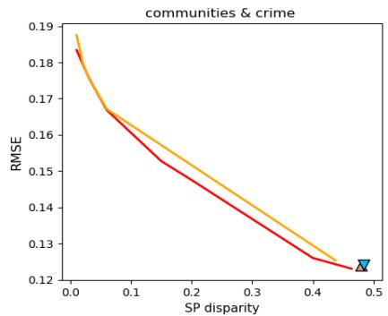

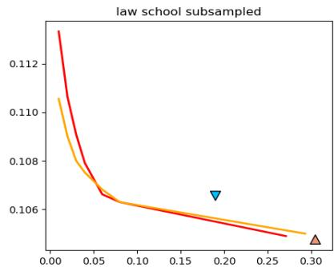

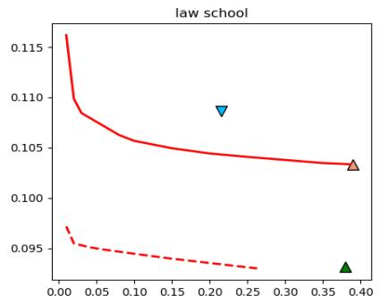

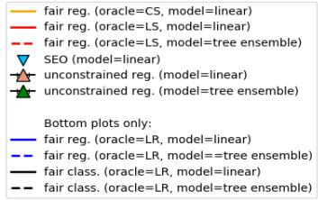

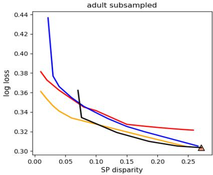

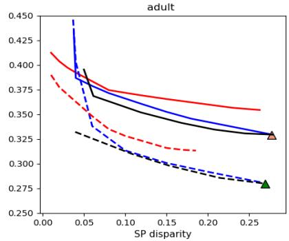  
Figure 2. Training loss versus constraint violation with respect to DP. For our algorithm, we varied the fairness slackness parameter and plot the Pareto frontiers of the sets of returned predictors. For the logistic regression experiments, we also plot the Pareto frontiers of the sets of returned predictors given by fair classification reduction methods.

Table 1. Runtime comparison on the oracles over different model classes. We ran the oracles on a sub-sampled law school data set with 1,000 examples, using a machine with a 2.7 GHz Intel processor and 16GB memory.   

<table><tr><td>Oracle</td><td>Model class</td><td>Runtime per call (seconds)</td></tr><tr><td>CS</td><td>linear</td><td>18.94</td></tr><tr><td>LS</td><td>linear</td><td>3.48</td></tr><tr><td>LS</td><td>tree ensemble</td><td>3.60</td></tr><tr><td>LR</td><td>linear</td><td>3.62</td></tr><tr><td>LR</td><td>tree ensemble</td><td>3.69</td></tr></table>

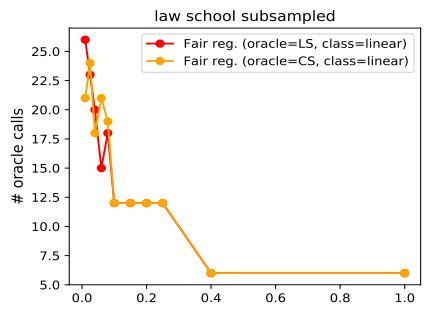

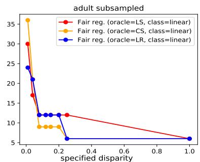

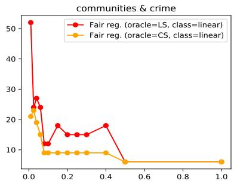  
Figure 3. Number of oracle calls versus specified value of fairness slackness.

In our experiments, this optimization problem was solved with the Gurobi Optimizer (Gurobi Optimization, 2018).

Runtime comparison. We performed a comparison on the running time of a single call of the three supervised learning oracles. On a subsampled law school data set with 1,000 examples, we ran the oracles to solve an instance of the $\boldsymbol { \mathrm { B E S T } } _ { h }$ problem, optimizing over either the linear models or tree ensemble models. The details are listed in Table 1. We also compare the number of oracle calls for different specified values of fairness slackness.