# A Causal Bayesian Networks Viewpoint on Fairness

Silvia Chiappa and William S. Isaac

DeepMind, London, UK {csilvia,williamis}@google.com

Abstract. We offer a graphical interpretation of unfairness in a dataset as the presence of an unfair causal path in the causal Bayesian network representing the data-generation mechanism. We use this viewpoint to revisit the recent debate surrounding the COMPAS pretrial risk assessment tool and, more generally, to point out that fairness evaluation on a model requires careful considerations on the patterns of unfairness underlying the training data. We show that causal Bayesian networks provide us with a powerful tool to measure unfairness in a dataset and to design fair models in complex unfairness scenarios.

# 1 Introduction

Machine learning is increasingly used in a wide range of decision-making scenarios that have serious implications for individuals and society, including financial lending [10,36], hiring [8,28], online advertising [27,41], pretrial and immigration detention [5,43], child maltreatment screening [14,47], health care [19,32], and social services [1,23]. Whilst this has the potential to overcome undesirable aspects of human decision-making, there is concern that biases in the training data and model inaccuracies can lead to decisions that treat historically discriminated groups unfavourably. The research community has therefore started to investigate how to ensure that learned models do not take decisions that are unfair with respect to sensitive attributes (e.g. race or gender).

This effort has led to the emergence of a rich set of fairness definitions [13,16,21,24,38] providing researchers and practitioners with criteria to evaluate existing systems or to design new ones. Many such definitions have been found to be mathematically incompatible [7,13,15,16,30], and this has been viewed as representing an unavoidable trade-off establishing fundamental limits on fair machine learning, or as an indication that certain definitions do not map on to social or legal understandings of fairness [17].

Most fairness definitions express properties of the model output with respect to sensitive information, without considering the relations among the relevant variables underlying the data-generation mechanism. As different relations would require a model to satisfy different properties in order to be fair, this could lead

to erroneously classify as fair/unfair models exhibiting undesirable/legitimate biases.

In this manuscript, we use the causal Bayesian network framework to draw attention to this point, by visually describing unfairness in a dataset as the presence of an unfair causal path in the data-generation mechanism. We then use this viewpoint to raise concern on the fairness debate surrounding the COMPAS pretrial risk assessment tool. Finally, we show that causal Bayesian networks offer a powerful tool for representing, reasoning about, and dealing with complex unfairness scenarios.

# 2 A Graphical View of (Un)fairness

Consider a dataset $\varDelta = \{ a ^ { n } , x ^ { n } , y ^ { n } \} _ { n = 1 } ^ { N }$ , corresponding to $N$ individuals, where $a ^ { n }$ indicates a sensitive attribute, and $x ^ { n }$ a set of observations that can be used (possibly together with $a ^ { n }$ ) to form a prediction $\hat { y } ^ { n }$ of outcome $y ^ { n }$ . We assume a binary setting $a ^ { n } , y ^ { n } , \hat { y } ^ { n } \in \{ 0 , 1 \}$ (unless otherwise specified), and indicate with $A , { \mathcal { X } }$ , $Y$ , and $\hat { Y }$ the (set of) random variables1 corresponding to $a ^ { n } , x ^ { n } , y ^ { n }$ , and ${ \hat { y } } ^ { n }$ respectively.

In this section we show at a high-level that a correct use of fairness definitions concerned with statistical properties of $\hat { Y }$ with respect to $A$ requires an understanding of the patterns of unfairness underlying $\varDelta$ , and therefore of the relationships among $A$ , $\mathcal { X }$ and $Y$ . More specifically we show that:

(i) Using the framework of causal Bayesian networks (CBNs), unfairness in $\varDelta$ can be viewed as the presence of an unfair causal path from $A$ to $\mathcal { X }$ or $Y$ .   
(ii) In order to determine which properties $\hat { Y }$ should possess to be fair, it is necessary to question and understand unfairness in $\varDelta$ .

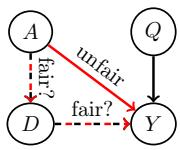

Assume a dataset $\varDelta = \{ a ^ { n } , x ^ { n } = \{ q ^ { n } , d ^ { n } \} , y ^ { n } \} _ { n = 1 } ^ { N }$ corresponding to a college admission scenario in which applicants are admitted based on qualifications $Q$ , choice of department $D$ , and gender $A$ ; and in which female applicants apply more often to certain departments. This scenario can be represented by

the CBN on the left (see Appendix A for an overview of BNs, and Sect. 3 for a detailed treatment of CBNs). The causal path $A  Y$ represents direct influence of gender $A$ on admission $Y$ , capturing the fact that two individuals with the same qualifications and applying to the same department can be treated differently depending on their gender. The indirect causal path $A  D  Y$ represents influence of $A$ on $Y$ through $D$ , capturing the fact that female applicants more often apply to certain departments. Whilst the direct path $A  Y$ is certainly an unfair one, the paths $A  D$ and $D  Y$ , and therefore $A  D  Y$ , could either be considered as fair or as unfair. For example, rejecting women more often due to department choice could be considered fair with respect to college

responsibility. However, this could be considered unfair with respect to societal responsibility if the departmental differences were a result of systemic historical or cultural factors (e.g. if female applicants apply to specific departments at lower rates because of overt or covert societal discouragement). Finally, if the college were to lower the admission rates for departments chosen more often by women, then the path $D  Y$ would be unfair.

Deciding whether a path is fair or unfair2 requires careful ethical and sociological considerations and/or might not be possible from a dataset alone. Nevertheless, this example illustrates that we can view unfairness in a dataset as the presence of an unfair causal path from the sensitive attribute $A$ to $\mathcal { X }$ or $Y$ .

Different (un)fair path labeling requires $\hat { Y }$ to have different characteristics in order to be fair. In the case in which the causal paths from $A$ to $Y$ are all unfair (e.g. if $A  D  Y$ is considered unfair), a $\hat { Y }$ that is statistically independent of $A$ (denoted with $\hat { Y } \perp \perp A ^ { \prime }$ ) would not contain any of the unfair influence of $A$ on $Y$ . In such a case, $\hat { Y }$ is said to satisfy demographic parity.

Demographic Parity (DP). $\hat { Y }$ satisfies demographic parity if $\hat { Y } \perp \perp A$ , i.e. $p ( { \hat { Y } } =$ $1 | A = 0 ) = p ( \hat { Y } = 1 | A = 1 )$ ), where e.g. $p ( \hat { Y } = 1 | A = 0 )$ can be estimated as

$$
p (\hat {Y} = 1 | A = 0) \approx \frac {1}{N _ {0}} \sum_ {n = 1} ^ {N} \mathbb {1} _ {\hat {y} ^ {n} = 1, a ^ {n} = 0},
$$

with $\mathbb { 1 } _ { \hat { y } ^ { n } = 1 , a ^ { n } = 0 } = 1$ if $\hat { y } ^ { n } = 1$ and $\boldsymbol { a } ^ { n } = 0$ (and zero otherwise), and where $N _ { 0 }$ indicates the number of individuals with $a ^ { \prime \iota } = 0$ . Notice that many classifiers, rather than a binary prediction $\hat { y } ^ { n } \in \{ 0 , 1 \}$ , output a degree of belief that the individual belongs to class 1, $r ^ { \pi }$ , also called score. For example, in the case of logistic regression $r ^ { n }$ corresponds to the probability of class 1, i.e. $r ^ { n } = p ( Y =$ $1 | a ^ { n } , x ^ { n } )$ . To obtain the prediction $\hat { y } ^ { n } \in \{ 0 , 1 \}$ from $r ^ { \pi }$ , it is common to use a threshold $\theta$ , i.e. $\hat { y } ^ { \prime \prime } = \mathbb { 1 } _ { r ^ { n } > \theta }$ . In this case, we can rewrite the estimate for $p ( \hat { Y } = 1 | A = 0 )$ ) as

$$
p (\hat {Y} = 1 | A = 0) \approx \frac {1}{N _ {0}} \sum_ {n = 1} ^ {N} \mathbb {1} _ {r ^ {n} > \theta , a ^ {n} = 0}.
$$

Notice that $R \perp \perp A$ implies $\hat { Y } \perp \perp A$ for all values of $\theta$ .

In the case in which the causal paths from $A$ to $Y$ are all fair (e.g. if $A  Y$ is absent and $A  D  Y$ is considered fair), a $\hat { Y }$ such that ${ \hat { Y } } \perp \perp A | Y$ or $Y \perp A | \hat { Y }$ would be allowed to contain such a fair influence, but the (dis)agreement between $Y$ and $\hat { Y }$ would not be allowed to depend on $A$ . In these cases, $\hat { Y }$ is said to satisfy equal false positive/false negative rates and calibration respectively.

Equal False Positive and Negative Rates (EFPRs/EFNRs). $\hat { Y }$ satisfies EFPRs and EFNRs if ${ \hat { Y } } \perp \perp A | Y$ , i.e. (EFPRs) $p ( \hat { Y } = 1 | Y = 0 , A = 0 ) = p ( \hat { Y } =$

$$
1 | Y = 0, A = 1) \text {a n d (E F N R s)} p (\hat {Y} = 0 | Y = 1, A = 0) = p (\hat {Y} = 0 | Y = 1, A = 1).
$$

Calibration. $\hat { Y }$ satisfies calibration if $Y ~ \perp ~ A | \hat { Y }$ . In the case of score output $R$ , this condition is often instead called predictive parity at threshold $\theta$ , $p ( Y = 1 | R > \theta , A = 0 ) = p ( Y = 1 | R > \theta , A = 1 )$ , and calibration defined as requiring $Y \perp \perp A | R$ .

In the case in which at least one causal path from $A$ to $Y$ is unfair (e.g. if $A $ $Y$ is present), EFPRs/EFNRs and calibration are inappropriate criteria, as they would not require the unfair influence of $A$ on $Y$ to be absent from $\hat { Y }$ (e.g. a perfect model ( ${ \hat { Y } } = Y$ ) would automatically satisfy EFPRs/EFNRs and calibration, but would contain the unfair influence). This observation is particularly relevant to the recent debate surrounding the correctional offender management profiling for alternative sanctions (COMPAS) pretrial risk assessment tool. We revisit this debate in the next section.

# 2.1 The COMPAS Debate

Over the past few years, numerous state and local governments around the United States have sought to reform their pretrial court systems with the aim of reducing unprecedented levels of incarceration, and specifically the population of low-income defendants and racial minorities in America’s prisons and jails [2,25,31]. As part of this effort, quantitative tools for determining a person’s likelihood for reoffending or failure to appear, called risk assessment instruments (RAIs), were introduced to replace previous systems driven largely by opaque discretionary decisions and money bail [6,26]. However, the expansion of pretrial RAIs has unearthed new concerns of racial discrimination which would nullify the purported benefits of these systems and adversely impact defendants’ civil liberties.

An intense ongoing debate, in which the research community has also been heavily involved, was triggered by an exposé from investigative journalists at ProPublica [5] on the COMPAS pretrial RAI developed by Equivant (formerly Northpointe) and deployed in Broward County in Florida. The COMPAS general recidivism risk scale (GRRS) and violent recidivism risk scale (VRRS), the focus of ProPublica’s investigation, sought to leverage machine learning techniques to improve the predictive accuracy of recidivism compared to older RAIs such as the level of service inventory-revised [3] which were primarily based on theories and techniques from a sub-field of psychology known as the psychology of criminal conduct [4,9]3.

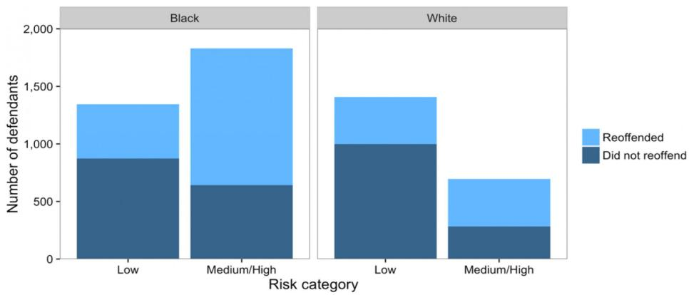  
Fig. 1. Number of black and white defendants in each of two aggregate risk categories [15]. The overall recidivism rate for black defendants is higher than for white defendants ( $5 2 \%$ vs. 39%), i.e. Y ✚⊥⊥A. Within each risk category, the proportion of defendants who reoffend is approximately the same regardless of race, i.e. $Y \perp \perp A | \hat { Y }$ . Black defendants are more likely to be classified as medium or high risk (58% vs. 33%) i.e. $\hat { Y } \mathcal { M } A$ . Among individuals who did not reoffend, black defendants are more likely to be classified as medium or high risk than white defendants (44.9% to $2 3 . 5 \%$ ). Among individuals who did reoffend, white defendant are more likely to be classified as low risk than black defendants (47.7% vs 28 $\%$ ), i.e. ${ \hat { Y } } { \mathcal { H } } A | Y$ .

ProPublica’s criticism of COMPAS centered on two concerns. First, the authors argued that the distribution of the risk score $R \in \{ 1 , \ldots , 1 0 \}$ exhibited discriminatory patterns, as black defendants displayed a fairly uniform distribution across each value, while white defendants exhibited a right skewed distribution, suggesting that the COMPAS recidivism risk scores disproportionately rated white defendants as lower risk than black defendants. Second, the authors claimed that the GRRS and VRRS did not satisfy EFPRs and EFNRs, as FPRs = 44.9% and FNRs $= 2 8 . 0 \%$ for black defendants, whilst FPRs = 23.5% and FNRs = 47.7% for white defendants (see Fig. 1). This evidence led ProPublica to conclude that COMPAS had a disparate impact on black defendants, leading to public outcry over potential biases in RAIs and machine learning writ large.

In response, Equivant published a technical report [20] refuting the claims of bias made by ProPublica and concluded that COMPAS is sufficiently calibrated, in the sense that it satisfies predictive parity at key thresholds. Subsequent analyses [13,16,30] confirmed Equivant’s claims of calibration, but also demonstrated the incompatibility of EFPRs/EFNRs and calibration due to differences in base

rates across groups (Y ✚⊥⊥A) (see Appendix B). Moreover, the studies suggested that attempting to satisfy these competing forms of fairness force unavoidable trade-offs between criminal justice reformers’ purported goals of racial equity and public safety.

As explained in Sect. 2, by requiring the rate of (dis)agreement between $Y$ and $\hat { Y }$ to be the same for black and white defendants (and therefore by not being concerned with dependence of $Y$ on $A$ ), EFPRs/EFNRs and calibration are inappropriate fairness criteria if dependence of $Y$ on $A$ includes influence of $A$ on $Y$ through an unfair causal path.

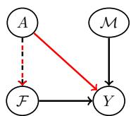  
Fig. 2. Possible CBN underlying the dataset used for COMPAS.

As previous research has shown [29,35,44], modern policing tactics center around targeting a small number of neighborhoods — often disproportionately populated by non-white and low income residents — with recurring patrols and stops. This uneven distribution of police attention, as well as other factors such as funding for pretrial services [31,46], means that differences in base rates between racial groups are not reflective of ground truth rates. We can rephrase these findings as indicating the presence

of a direct path $A  Y$ (through unobserved neighborhood) in the CBN representing the data-generation mechanism (Fig. 2). Such tactics also imply an influence of $A$ on $Y$ through the set of variables $\mathcal { F }$ containing number of prior arrests. In addition, the influence of $A$ on $Y$ through $A  Y$ and $A  { \mathcal { F } }  Y$ could be more prominent or contain more unfairness due to racial discrimination.

These observations indicate that EFPRs/EFNRs and calibration are inappropriate criteria for this case (and therefore that their incompatibility is irrelevant), and more generally that the current fairness debate surrounding COMPAS gives insufficient consideration to the patterns of unfairness underlying the training data. Our analysis formalizes the concerns raised by social scientists and legal scholars on mismeasurement and unrepresentative data in the US criminal justice system. Multiple studies [22,34,37,46] have argued that the core premise of RAIs, to assess the likelihood a defendant reoffends, is impossible to measure and that the empirical proxy used (e.g. arrest or conviction) introduces embedded biases and norms which render existing fairness tests unreliable.

This section used the CBN framework to describe at a high-level different patterns of unfairness that can underlie a dataset and to point out issues with current deployment of fairness definitions. In the remainder of the manuscript, we use this framework more extensively to further advance our analysis on fairness. Before doing that, we give some background on CBNs [18,39,40,42,45], assuming that all variables except $A$ are continuous.

# 3 Causal Bayesian Networks

A Bayesian network is a directed acyclic graph where nodes and edges represent random variables and statistical dependencies. Each node $X _ { i }$ in the graph is

associated with the conditional distribution $p ( X _ { i } | \mathrm { p a } ( X _ { i } ) )$ , where $\operatorname { p a } ( X _ { i } )$ is the set of parents of $X _ { i }$ . The joint distribution of all nodes, $p ( X _ { 1 } , \ldots , X _ { I } )$ , is given by the product of all conditional distributions, i.e. $\begin{array} { r } { p ( X _ { 1 } , \ldots , X _ { I } ) = \prod _ { i = 1 } ^ { I } p ( X _ { i } | \mathrm { p a } ( X _ { i } ) ) } \end{array}$ (see Appendix A for more details on Bayesian networks).

When equipped with causal semantic, namely when representing the datageneration mechanism, Bayesian networks can be used to visually express causal relationships. More specifically, CBNs enable us to give a graphical definition of causes and causal effects: if there exists a directed path from $A$ to $Y$ , then $A$ is a potential cause of $Y$ . Directed paths are also called causal paths.

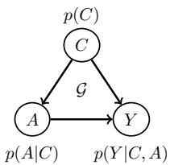  
(a)

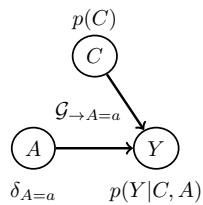  
(b)   
Fig. 3. (a): CBN with a confounder $C$ for the effect of $A$ on $Y$ . (b): Modified CBN resulting from intervening on $A$ .

The causal effect of $A$ on $Y$ can be seen as the information traveling from $A$ to $Y$ through causal paths, or as the conditional distribution of $Y$ given $A$ restricted to causal paths. This implies that, to compute the causal effect, we need to disregard the information that travels along non-causal paths, which occurs if such paths are open. Since paths with an arrow emerging from $A$ are either causal or closed (blocked) by a collider, the problematic paths are

only those with an arrow pointing into $A$ , called back-door paths, which are open if they do not contain a collider.

An example of an open back-door path is given by $A \left. C \right. Y$ in the CBN $\vec { \mathcal { G } }$ of Fig. 3(a): the variable $C$ is said to be a confounder for the effect of $A$ on $Y$ , as it confounds the causal effect with non-causal information. To understand this, assume that $A$ represents hours of exercise in a week, $Y$ cardiac health, and $C$ age: observing cardiac health conditioning on exercise level from $p ( Y | A )$ does not enable us to understand the effect of exercise on cardiac health, since $p ( Y | A )$ includes the dependence between $A$ and $Y$ induced by age.

Each parent-child relationship in a CBN represents an autonomous mechanism, and therefore it is conceivable to change one such a relationship without changing the others. This enables us to express the causal effect of $A \ = \ a$ on $Y$ as the conditional distribution $p _ {  A = a } ( Y | A = a )$ on the modified CBN $\scriptstyle { \mathcal { G } } _ { \to A = a }$ of Fig. 3(b), resulting from replacing $p ( A | C )$ with a Dirac delta distribution $\delta _ { A = a }$ (thereby removing the link from $C$ to $A$ ) and leaving the remaining conditional distributions $p ( { Y } | { A } , { C } )$ and $p ( C )$ unaltered — this process is called intervention on $A$ . The distribution $p _ {  A = a } ( Y | A = a )$ can be estimated as $p _ {  A = a } ( Y | A =$ $\begin{array} { r } { a ) = \int _ { C } p _ {  A = a } ( Y | A = a , C ) p _ {  A = a } ( C | A = a ) = \int _ { C } p ( Y | A = a , C ) p ( C ) } \end{array}$ . This is a special case of the following back-door adjustment formula.

Back-door Adjustment. If a set of variables $\boldsymbol { \mathscr { C } }$ satisfies the back-door criterion relative to $\{ A , Y \}$ , the causal effect of $A$ on $Y$ is given by $p _ {  A } ( Y | A ) =$ $\begin{array} { r } { \int _ { \mathcal { C } } p ( Y | A , \mathcal { C } ) p ( \mathcal { C } ) } \end{array}$ . $\boldsymbol { \mathscr { C } }$ satisfies the back-door criterion if (a) no node in $c$ is a descendant of $A$ and (b) $\boldsymbol { \mathscr { C } }$ blocks every back-door path from $A$ to $Y$ .

The equality $p _ {  A = a } ( Y | A = a , \mathcal { C } ) = p ( Y | A = a , \mathcal { C } )$ follows from the fact that $\mathcal { G } _ { A  }$ , obtained by removing from $\mathcal { G }$ all links emerging from $A$ , retains all (and only) the back-door paths from $A$ to $Y$ . As $\boldsymbol { \mathscr { C } }$ blocks all such paths, $Y \perp A | { \mathcal { C } }$ in $\mathcal { G } _ { A  }$ . This means that there is no non-causal information traveling from $A$ to $Y$ when conditioning on $c$ and therefore conditioning on $A$ coincides with intervening.

Conditioning on $C$ to block an open back-door path may open a closed path on which $C$ is a collider. For example, in the CBN of Fig. 4(a), conditioning on $C$ closes the paths $A  C  X  Y$ and $A \left. C \right. Y$ , but opens the path $A  E  C $ $X  Y$ (additional conditioning on $X$ would close $A \left. E \right. C \left. X \right. Y$ ).

The back-door criterion can also be derived from the rules of do-calculus [39,40], which indicate whether and how $p _ {  A } ( Y | A )$ can be estimated using observations from $\vec { \mathcal { G } }$ : for many graph structures with unobserved confounders the only way to compute causal effects is by collecting obser-

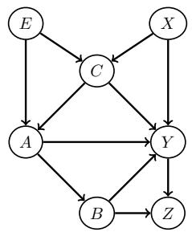  
(a)

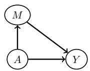  
  
Fig. 4. (a): CBN in which conditioning on $C$ closes the paths $A  C  X  Y$ and $A \left. C \right. Y$ but opens the path $A \left. E \right.$ $C \left. X \right. Y$ . (b): CBN with one direct and one indirect causal path from $A$ to $Y$ .

vations directly from $\mathcal { G } _ {  A }$ — in this case the effect is said to be non-identifiable.

Potential Outcome Viewpoint. Let $Y _ { A = a }$ be the random variable with distribution $p ( Y _ { A = a } ) = p _ {  A = a } ( Y | A = a )$ . $Y _ { A = a }$ is called potential outcome and, when not ambiguous, we will refer to it with the shorthand $Y _ { a }$ . The relation between $Y _ { a }$ and all the variables in $\mathcal { G }$ other than $Y$ can be expressed by the graph obtained by removing from $\vec { \mathcal { G } }$ all the links emerging from $A$ , and by replacing $Y$ with $Y _ { a }$ . If $Y _ { a }$ is independent on $A$ in this graph, then4 $p ( Y _ { a } ) = p ( Y _ { a } | A = a ) = p ( Y | A = a )$ . If $Y _ { a }$ is independent of $A$ in this graph when conditioning on $c$ , then

$$
p (Y _ {a}) = \int_ {\mathcal {C}} p (Y _ {a} | \mathcal {C}) p (\mathcal {C}) = \int_ {\mathcal {C}} p (Y _ {a} | A = a, \mathcal {C}) p (\mathcal {C}) = \int_ {\mathcal {C}} p (Y | A = a, \mathcal {C}) p (\mathcal {C}),
$$

i.e. we retrieve the back-door adjustment formula.

In the remainder of the section we show that, by performing different interventions on $A$ along different causal paths, it is possible to isolate the contribution of the causal effect of $A$ on $Y$ along a group of paths.

# Direct and Indirect Effect

Consider the CBN of Fig. 4(b), containing the direct path $A  Y$ and one indirect causal path through the variable $M$ . Let $Y _ { a } ( M _ { \bar { a } } )$ be the random variable

with distribution equal to the conditional distribution of $Y$ given $A$ restricted to causal paths, with $A = a$ along $A  Y$ and $A = { \bar { a } }$ along $A  M  Y$ . The average direct effect (ADE) of $A = a$ with respect to $A = \bar { a }$ , defined as

$$
\mathrm {A D E} _ {\bar {a} a} = \left\langle Y _ {a} \left(M _ {\bar {a}}\right) \right\rangle_ {p \left(Y _ {a} \left(M _ {\bar {a}}\right)\right)} - \left\langle Y _ {\bar {a}} \right\rangle_ {p \left(Y _ {\bar {a}}\right)},
$$

where e.g. $\begin{array} { r } { \langle Y _ { \bar { a } } \rangle _ { p ( Y _ { \bar { a } } ) } = \int _ { Y _ { \bar { a } } } Y _ { \bar { a } } p ( Y _ { \bar { a } } ) } \end{array}$ , measures the difference in flow of causal information from $A$ to $Y$ between the case in which $A = a$ along $A  Y$ and $A = \bar { a }$ along $A  M  Y$ and the case in which $A = \bar { a }$ along both paths.

Analogously, the average indirect effect (AIE) of $A = a$ with respect to $A = \bar { a }$ is defined as $\mathrm { A I E } _ { \bar { a } a } = \langle Y _ { \bar { a } } ( M _ { a } ) \rangle _ { p ( Y _ { \bar { a } } ( M _ { a } ) ) } - \langle Y _ { \bar { a } } \rangle _ { p ( Y _ { \bar { a } } ) }$ .

The difference $\mathrm { A D E } _ { \bar { a } a } - \mathrm { A I E } _ { a \bar { a } }$ gives the average total effect (ATE) $\mathrm { A T E } _ { \bar { a } a } =$ $\langle Y _ { a } \rangle _ { p ( Y _ { a } ) } - \langle Y _ { \bar { a } } \rangle _ { p ( Y _ { \bar { a } } ) } { } ^ { 5 }$ .

# Path-Specific Effect

To estimate the effect along a specific group of causal paths, we can generalize the formulas for the ADE and AIE by replacing the variable in the first term with the one resulting from performing the intervention $A = a$ along the group of interest and $A = { \bar { a } }$ along the remaining causal paths. For example, consider the CBN of Fig. 5 (top) and assume that we are interested in isolating the effect of $A$ on $Y$ along the direct path $A  Y$ and the paths passing through $M$ , $A \to M \to , \dots , \to Y$ , namely along the red links. The path-specific effect (PSE) of $A = a$ with respect to $A = \bar { a }$ for this group of paths is defined as

$$
\mathrm {P S E} _ {\bar {a} a} = \left\langle Y _ {a} \left(M _ {a}, L _ {\bar {a}} \left(M _ {a}\right)\right) \right\rangle - \left\langle Y _ {\bar {a}} \right\rangle ,
$$

where $p ( Y _ { a } ( M _ { a } , L _ { \bar { a } } ( M _ { a } ) ) )$ is given by

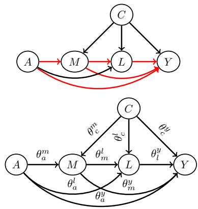  
Fig. 5. Top: CBN with the direct path from $A$ to $Y$ and the indirect paths passing through $M$ highlighted in red. Bottom: CBN corresponding to Eq. (1).

$$
\int_ {C, M, L} p (Y | A = a, C, M, L) p (L | A = \bar {a}, C, M) p (M | A = a, C) p (C).
$$

In the simple case in which the CBN corresponds to a linear model, e.g.

$$
A \sim \operatorname {B e r n} (\pi), C = \epsilon_ {c},
$$

$$
M = \theta^ {m} + \theta_ {a} ^ {m} A + \theta_ {c} ^ {m} C + \epsilon_ {m}, L = \theta^ {l} + \theta_ {a} ^ {l} A + \theta_ {c} ^ {l} C + \theta_ {m} ^ {l} M + \epsilon_ {l},
$$

$$
Y = \theta^ {y} + \theta_ {a} ^ {y} A + \theta_ {c} ^ {y} C + \theta_ {m} ^ {y} M + \theta_ {l} ^ {y} L + \epsilon_ {y}, \tag {1}
$$

where $\epsilon _ { c }$ , $\epsilon _ { m }$ , $\epsilon _ { l }$ and $\epsilon _ { y }$ are unobserved independent zero-mean Gaussian variables, we can compute $\left. Y _ { \bar { a } } \right.$ by expressing $Y$ as a function of $A = \bar { a }$ and the Gaussian variables, by recursive substitutions in $C , M$ and $L$ , i.e.

$$
\begin{array}{l} Y _ {\bar {a}} = \theta^ {y} + \theta_ {a} ^ {y} \bar {a} + \theta_ {c} ^ {y} \epsilon_ {c} + \theta_ {m} ^ {y} \left(\theta^ {m} + \theta_ {a} ^ {m} \bar {a} + \theta_ {c} ^ {m} \epsilon_ {c} + \epsilon_ {m}\right) \\ + \theta_ {l} ^ {y} \left(\theta^ {l} + \theta_ {a} ^ {l} \bar {a} + \theta_ {c} ^ {l} \epsilon_ {c} + \theta_ {m} ^ {l} \left(\theta^ {m} + \theta_ {a} ^ {m} \bar {a} + \theta_ {c} ^ {m} \epsilon_ {c} + \epsilon_ {m}\right) + \epsilon_ {l}\right) + \epsilon_ {y}, \\ \end{array}
$$

and then take the mean, obtaining $\langle Y _ { \bar { a } } \rangle = \theta ^ { y } + \theta _ { a } ^ { y } \bar { a } + \theta _ { m } ^ { y } ( \theta ^ { m } + \theta _ { a } ^ { m } \bar { a } ) + \theta _ { l } ^ { y } ( \theta ^ { l } +$ $\theta _ { a } ^ { l } \bar { a } + \theta _ { m } ^ { l } ( \theta ^ { m } + \theta _ { a } ^ { m } \bar { a } ) )$ . Analogously

$$
\left\langle Y _ {a} \left(M _ {a}, L _ {\bar {a}} (M _ {a})\right) \right\rangle = \theta^ {y} + \theta_ {a} ^ {y} a + \theta_ {m} ^ {y} \left(\theta^ {m} + \theta_ {a} ^ {m} a\right) + \theta_ {l} ^ {y} \left(\theta^ {l} + \theta_ {a} ^ {l} \bar {a} + \theta_ {m} ^ {l} \left(\theta^ {m} + \theta_ {a} ^ {m} a\right)\right).
$$

For $a = 1$ and $\bar { a } = 0$ , this gives

$$
\mathrm {P S E} _ {\bar {a} a} = \theta_ {a} ^ {y} (a - \bar {a}) + \theta_ {m} ^ {y} \theta_ {a} ^ {m} (a - \bar {a}) + \theta_ {l} ^ {y} \theta_ {m} ^ {l} \theta_ {a} ^ {m} (a - \bar {a}) = \theta_ {a} ^ {y} + \theta_ {m} ^ {y} \theta_ {a} ^ {m} + \theta_ {l} ^ {y} \theta_ {m} ^ {l} \theta_ {a} ^ {m}.
$$

The same conclusion could have been obtained by looking at the graph annotated with path coefficients (Fig. 5 (bottom)). The PSE is obtained by summing over the three causal paths of interest ( $A  Y$ , $A  M  Y$ , and $A \to M \to L \to Y$ ) the product of all coefficients in each path.

Notice that AIE $\bar { a } a$ , given by

$$
\begin{array}{l} \mathrm {A I E} _ {\bar {a} a} = \left\langle Y _ {\bar {a}} \left(M _ {a}, L _ {a} \left(M _ {a}\right)\right) \right\rangle - \left\langle Y _ {\bar {a}} \right\rangle \\ = \theta^ {y} + \theta_ {a} ^ {y} \bar {a} + \theta_ {m} ^ {y} \left(\theta^ {m} + \theta_ {a} ^ {m} a\right) + \theta_ {l} ^ {y} \left(\theta^ {l} + \theta_ {a} ^ {l} a + \theta_ {m} ^ {l} \left(\theta^ {m} + \theta_ {a} ^ {m} a\right)\right) \\ - \theta^ {y} + \theta_ {a} ^ {y} \bar {a} + \theta_ {m} ^ {y} \left(\theta^ {m} + \theta_ {a} ^ {m} \bar {a}\right) + \theta_ {l} ^ {y} \left(\theta^ {l} + \theta_ {a} ^ {l} \bar {a} + \theta_ {m} ^ {l} \left(\theta^ {m} + \theta_ {a} ^ {m} \bar {a}\right)\right) \\ = \theta_ {m} ^ {y} \theta_ {a} ^ {m} (a - \bar {a}) + \theta_ {l} ^ {y} \left(\theta_ {a} ^ {l} (a - \bar {a}) + \theta_ {m} ^ {l} \theta_ {a} ^ {m} (a - \bar {a})\right), \tag {2} \\ \end{array}
$$

coincides with $\mathrm { A I E } _ { \bar { a } a } ^ { a }$ , given by

$$
\begin{array}{l} \mathrm {A I E} _ {\bar {a} a} ^ {a} = \left\langle Y _ {a} \right\rangle - \left\langle Y _ {a} \left(M _ {\bar {a}}, L _ {\bar {a}} \left(M _ {\bar {a}}\right)\right) \right\rangle \\ = \theta^ {y} + \theta_ {a} ^ {y} a + \theta_ {m} ^ {y} \left(\theta^ {m} + \theta_ {a} ^ {m} a\right) + \theta_ {l} ^ {y} \left(\theta^ {l} + \theta_ {a} ^ {l} a + \theta_ {m} ^ {l} \left(\theta^ {m} + \theta_ {a} ^ {m} a\right)\right) \\ - \theta^ {y} + \theta_ {a} ^ {y} a + \theta_ {m} ^ {y} \left(\theta^ {m} + \theta_ {a} ^ {m} \bar {a}\right) + \theta_ {l} ^ {y} \left(\theta^ {l} + \theta_ {a} ^ {l} \bar {a} + \theta_ {m} ^ {l} \left(\theta^ {m} + \theta_ {a} ^ {m} \bar {a}\right)\right). \tag {3} \\ \end{array}
$$

Effect of Treatment on Treated. Consider the conditional distribution $p ( Y _ { a } | A = \bar { a } )$ . This distribution measures the information travelling from $A$ to $Y$ along all open paths, when $A$ is set to $a$ along causal paths and to $a$ along non-causal paths. The effect of treatment on treated (ETT) of $A = a$ with respect to $A = \bar { a }$ is defined as $\mathrm { E T T } _ { \bar { a } a } = \langle Y _ { a } \rangle _ { p ( Y _ { a } | A = \bar { a } ) } - \langle Y _ { \bar { a } } \rangle _ { p ( Y _ { \bar { a } } | A = \bar { a } ) } =$ $\langle Y _ { a } \rangle _ { p ( Y _ { a } | A = \bar { a } ) } - \langle Y \rangle _ { p ( Y | A = \bar { a } ) }$ . As the PSE, the ETT measures difference in flow of information from $A$ to $Y$ when $A$ takes different values along different paths. However, the PSE considers only causal paths and different values for $A$ along different causal paths, whilst the ETT considers all open paths and different values for $A$ along causal and non-causal paths respectively. Similarly to $\mathrm { A T E } _ { \bar { a } a }$ $^ { 1 } a a$ , ETT $\bar { a } a$ for the CBN of Fig. 4(b) can be expressed as

$$
\mathrm {E T T} _ {\bar {a} a} = \underbrace {\langle Y _ {a} (M _ {\bar {a}}) \rangle - \langle Y _ {\bar {a}} \rangle} _ {\mathrm {A D E} _ {\bar {a} a | \bar {a}}} - (\underbrace {\langle Y _ {a} (M _ {\bar {a}}) \rangle - \langle Y _ {a} \rangle} _ {\mathrm {A I E} _ {a \bar {a} | \bar {a}}}).
$$

Notice that, if we define difference in flow of non-causal (along the open back-door paths) information from $A$ to $Y$ when $A = a$ with respect to when $A = \bar { a }$ as $\mathrm { { N C I } } _ { \bar { a } a } = \langle Y _ { \bar { a } } \rangle _ { p ( Y _ { \bar { a } } | A = a ) } - \langle Y \rangle _ { p ( Y | A = \bar { a } ) } .$ $- \left. Y \right. _ { p \left( Y \mid A = \bar { a } \right) }$ we obtain

$$
\begin{array}{l} \langle Y \rangle_ {p (Y | A = a)} - \langle Y \rangle_ {p (Y | A = \bar {a})} = \langle Y _ {\bar {a}} \rangle_ {p (Y _ {\bar {a}} | A = a)} - \langle Y \rangle_ {p (Y | A = \bar {a})} \\ - \left(\left\langle Y _ {\bar {a}} \right\rangle_ {p \left(Y _ {\bar {a}} \mid A = a\right)} - \left\langle Y \right\rangle_ {p \left(Y \mid A = a\right)}\right) \\ = \mathrm {N C I} _ {\bar {a} a} - \mathrm {E T T} _ {a \bar {a}} = \mathrm {N C I} _ {\bar {a} a} - \mathrm {A D E} _ {a \bar {a} | a} + \mathrm {A I E} _ {\bar {a} a | a}. \\ \end{array}
$$

# 4 Fairness Considerations using CBNs

Equipped with the background on CBNs from Sect. 3, in this section we further investigate unfairness in a dataset $\varDelta = \{ a ^ { n } , x ^ { n } , y ^ { n } \} _ { n = 1 } ^ { N }$ , discuss issues that might arise when building a decision system from it, and show how to measure and deal with unfairness in complex scenarios, revisiting and extending material from [11,33,48].

# 4.1 Back-door Paths from $\pmb { A }$ to $\mathbf { Y }$

In Sect. 2 we have introduced a graphical interpretation of unfairness in a dataset $\varDelta$ as the presence of an unfair causal path from $A$ to $\mathcal { X }$ or $Y$ . More specifically, we have shown through a college admission example that unfairness can be due to an unfair link emerging (a) from $A$ or (b) from a subsequent variable in a causal path from $A$ to $Y$ (e.g. $D  Y$ in the example). Our discussion did not mention paths from $A$ to $Y$ with an arrow pointing into $A$ , namely back-door paths. This is because such paths are not problematic.

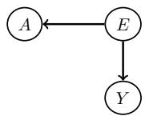

To understand this, consider the hiring scenario described by the CBN on the left, where $A$ represents religious belief and $E$ educational background of the applicant, which influences religious participation ( $E  A$ ). Whilst Y ✚⊥⊥A due to the open back-door path from $A$ to $Y$ , the hiring decision $Y$ is

only based on $E$

# 4.2 Opening Closed Unfair Paths from $\pmb { A }$ to $\mathbf { Y }$

In Sect. 2, we have seen that, in order to reason about fairness of $\hat { Y }$ , it is necessary to question and understand unfairness in $\varDelta$ . In this section, we warn that another crucial element needs to be considered in the fairness discussion around $\hat { Y }$ , namely

(i) The variables used to form $\hat { Y }$ could project into $\hat { Y }$ unfair patterns in $\mathcal { X }$ that do not concern $Y$ .

This could happen, for example, if a closed unfair path from $A$ to $Y$ is opened when conditioning on the variables used to form $\hat { Y }$ .

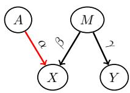  
Fig. 6. CBN underlying a music degree scenario.

As an example, assume the CBN in Fig. 6 representing the data-generation mechanism underlying a music degree scenario, where $A$ corresponds to gender, $M$ to music aptitude (unobserved, i.e. $M \not \in \varDelta$ ), $X$ to the score obtained from an ability test taken at the beginning of the degree, and $Y$ to the score obtained from an ability test taken at the end of the degree. Individuals with higher music aptitude $M$ are more likely to obtain higher initial and final scores ( $M  X$ , $M  Y$ ). Due to discrimination occurring at the

initial testing, women are assigned a lower initial score than men for the same aptitude level ( $A  X$ ). The only path from $A$ to $Y$ , $A \to X  M \to Y$ , is closed as $X$ is a collider on this path. Therefore the unfair influence of $A$ on $X$ does not reach $Y$ $( Y \perp \perp A )$ . Nevertheless, as $Y { \mathcal { A } } A | X$ , a prediction $\hat { Y }$ based on the initial score $X$ only would contain the unfair influence of $A$ on $X$ . For example, assume the following linear model: $Y = \gamma M , X = \alpha A + \beta M$ , with $\langle A ^ { 2 } \rangle _ { p ( A ) } = 1$ and $\langle M ^ { 2 } \rangle _ { p ( M ) } = 1$ . A linear predictor of the form $\hat { Y } = \theta _ { X } X$ minimizing $\langle ( Y - \hat { Y } ) ^ { 2 } \rangle _ { p ( A ) p ( M ) }$ would have parameters $\theta _ { X } = \gamma \beta / ( \alpha ^ { 2 } + \beta ^ { 2 } )$ , giving $\dot { Y } = \gamma \beta ( \alpha A + \beta M ) / ( \alpha ^ { 2 } + \beta ^ { 2 } )$ , i.e. $\hat { Y } .$ ✚⊥⊥A. Therefore, this predictor would be using the sensitive attribute to form a decision, although implicitly rather than explicitly. Instead, a predictor explicitly using the sensitive attribute, $\hat { Y } = \theta _ { X } X + \theta _ { A } A$ , would have parameters

$$
\left( \begin{array}{c} \theta_ {X} \\ \theta_ {A} \end{array} \right) = \left( \begin{array}{c c} \alpha^ {2} + \beta^ {2} & \alpha \\ \alpha & 1 \end{array} \right) ^ {- 1} \left( \begin{array}{c} \gamma \beta \\ 0 \end{array} \right) = \left( \begin{array}{c} \gamma / \beta \\ - \alpha \gamma / \beta \end{array} \right),
$$

i.e. $\hat { Y } = \gamma M$ . Therefore, this predictor would be fair. From the CBN we can see that the explicit use of $A$ can be of help in retrieving $M$ . Indeed, since $M { \mathrel { \mathop { A C A } } } | X$ , using $A$ in addition to $X$ can give information about $M$ . In general (e.g. in a non-linear setting) it is not guaranteed that using $A$ would ensure $\hat { Y } \perp \perp A$ . Nevertheless, this example shows how explicit use of the sensitive attribute in a model can ensure fairness rather than leading to unfairness.

This observation is relevant to one of the simplest fairness definitions, motivated by legal requirements, called fairness through unawareness, which states that $\hat { Y }$ is fair as long as it does not make explicit use of the sensitive attribute $A$ Whilst this fairness criterion is often indicated as problematic because some of the variables used to form $\hat { Y }$ could be a proxy for $A$ (such as neighborhood for race), the example above shows a more subtle issue with it.

# 4.3 Path-Specific Population-level Unfairness

In this section, we show that the path-specific effect introduced in Sect. 3 can be used to quantify unfairness in $\varDelta$ in complex scenarios.

Consider the college admission example discussed in Sect. 2 (Fig. 7). In the case in which the path $A  D$ , and therefore $A  D  Y$ , is considered unfair, unfairness overall population can be quantified with $\langle Y \rangle _ { p ( Y | a ) } - \langle Y \rangle _ { p ( Y | \bar { a } ) }$

(coinciding with $\mathrm { A T E } _ { \bar { a } a } = \langle Y _ { a } \rangle _ { p ( Y _ { a } ) } - \langle Y _ { \bar { a } } \rangle _ { p ( Y _ { \bar { a } } ) } )$ where, for example, $A = a$ and $A = \bar { a }$ indicate female and male applicants respectively.

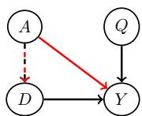  
Fig. 7. CBN underlying a college admission scenario.

In the more complex case in which the path $A $ $D  Y$ is considered fair, unfairness can instead be quantified with the path-specific effect along the direct path $A  Y$ , PSE $^ { a a }$ , given by

$$
\langle Y _ {a} (D _ {\bar {a}}) \rangle_ {p (Y _ {a} (D _ {\bar {a}}))} - \langle Y _ {\bar {a}} \rangle_ {p (Y _ {\bar {a}})}.
$$

Notice that computing $p ( Y _ { a } ( D _ { \bar { a } } ) )$ requires knowledge of the CBN. If the CBN structure is not known or

estimating its conditional distributions is challenging, the resulting estimate could be imprecise.

# 4.4 Path-Specific Individual-level Unfairness

In the college admission example of Fig. 7 in which the path $A  D  Y$ is considered fair, rather than measuring unfairness overall population, we might want to know e.g. whether a rejected female applicant $\{ a ^ { n } = a , q ^ { n } , d ^ { n } , y ^ { n } = 0 \}$ was treated unfairly. We can answer this question by estimating whether the applicant would have been admitted had she been male ( $A = \bar { a }$ ) along the direct path $A  Y$ from $p ( Y _ { \bar { a } } ( D _ { a } ) | A = a , Q = q ^ { n } , D = d ^ { n } , Y = y ^ { n } )$ (notice that the outcome in the actual world, $y ^ { \pi }$ , corresponds to $p ( Y _ { a } ( D _ { a } ) | A = a , Q = q ^ { n } , D =$ $d ^ { n } ) = \mathbb { 1 } _ { Y _ { a } ( D _ { a } ) = y ^ { n } } .$ ).

To understand how this can be achieved, consider the following linear model associated to a CBN with the same structure as the one in Fig. 7

$$
A \sim \operatorname {B e r n} (\pi), \quad Q = \theta^ {q} + \epsilon_ {q}, \quad D = \theta^ {d} + \theta_ {a} ^ {d} A + \epsilon_ {d},
$$

$$
Y = \theta^ {y} + \theta_ {a} ^ {y} A + \theta_ {q} ^ {y} Q + \theta_ {d} ^ {y} D + \epsilon_ {y}, \tag {4}
$$

where $\epsilon _ { q } , \epsilon _ { d }$ and $\epsilon _ { y }$ are unobserved independent zero-mean Gaussian variables.

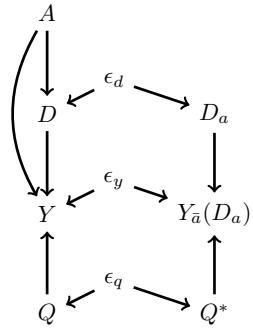

The relationships between $A , Q , D , Y$ and $Y _ { \bar { a } } ( D _ { a } )$ in this model can be inferred from the twin Bayesian network [39] on the left resulting from the intervention $A \ = \ a$ along $A \  \ D$ and $A \ = \ \bar { a }$ along $A  Y$ : in addition to $A , Q , D$ and $Y$ , the network contains the variables $Q ^ { * }$ , $D _ { a }$ and $Y _ { \bar { a } } ( D _ { a } )$ corresponding to the counterfactual world in which $A = \bar { a }$ along $A  Y$ , with $Q ^ { * } = \theta ^ { q } + \epsilon _ { q } , D _ { a } = \theta ^ { d } + \theta _ { a } ^ { d } a + \epsilon _ { d }$ , and $Y _ { \bar { a } } ( D _ { a } ) = \theta ^ { y } + \theta _ { a } ^ { y } \bar { a } + \theta _ { q } ^ { y } Q ^ { * } + \theta _ { d } ^ { y } D _ { a } + \epsilon _ { y }$ . The two groups of variables are connected through $\epsilon _ { d } , \epsilon _ { q } , \epsilon _ { y }$ , indicating that the factual and counterfactual worlds

share the same unobserved randomness. From this network, we can deduce that $Y _ { \bar { a } } ( D _ { a } ) \perp \perp \{ A , Q , D , Y \} | \epsilon = \{ \epsilon _ { q } , \epsilon _ { d } , \epsilon _ { y } \} ^ { 6 }$ , and therefore that we can express

$$
\begin{array}{l} p \left(Y _ {\bar {a}} \left(D _ {a}\right) \mid A = a, Q = q ^ {n}, D = d ^ {n}, Y = y ^ {n}\right) \text {a s} \\ p \left(Y _ {\bar {a}} \left(D _ {a}\right) \mid a, q ^ {n}, d ^ {n}, y ^ {n}\right) = \int_ {\epsilon} p \left(Y _ {\bar {a}} \left(D _ {a}\right) \mid \epsilon , \not \epsilon , \not \epsilon^ {\mathcal {H}}, \not \epsilon^ {\mathcal {H}}, \not \epsilon^ {\mathcal {H}}\right) p \left(\epsilon \mid a, q ^ {n}, d ^ {n}, y ^ {n}\right). \tag {5} \\ \end{array}
$$

As $p ( \epsilon _ { q } ^ { n } | a , q ^ { n } , d ^ { n } , y ^ { n } ) \ = \ \delta _ { \epsilon _ { q } ^ { n } = q ^ { n } - \theta ^ { q } }$ , p(nd |a, qn, dn, yn) = δn=dn−θd−θda, and $p ( \epsilon _ { y } ^ { n } | a , q ^ { n } , d ^ { n } , y ^ { n } ) = \delta _ { \epsilon _ { y } ^ { n } = y ^ { n } - \theta ^ { y } - \theta _ { a } ^ { y } a - \theta _ { q } ^ { y } q ^ { n } - \theta _ { d } ^ { y } d ^ { n } }$ , we obtain

$$
p \big (Y _ {\bar {a}} (D _ {a}) \big | A = a, Q = q ^ {n}, D = d ^ {n}, Y = y ^ {n} \big) = \mathbb {1} _ {Y _ {\bar {a}} (D _ {a}) = y ^ {n} - \theta_ {a} ^ {y} a + \theta_ {a} ^ {y} \bar {a}}.
$$

Indeed, by expressing $Y _ { \bar { a } } ( D _ { a } )$ as a function of $\epsilon _ { q } ^ { n } , \epsilon _ { d } ^ { n }$ and $\epsilon _ { y } ^ { n }$ , we obtain

$$
\begin{array}{l} Y _ {\bar {a}} (D _ {a}) = \theta^ {y} + \theta_ {a} ^ {y} \bar {a} + \theta_ {q} ^ {y} Q ^ {*} + \theta_ {d} ^ {y} D _ {a} + \epsilon_ {y} ^ {n} \\ = \theta^ {y} + \theta_ {a} ^ {y} \bar {a} + \theta_ {q} ^ {y} (\theta^ {q} + \epsilon_ {q} ^ {n}) + \theta_ {d} ^ {y} (\theta^ {d} + \theta_ {a} ^ {d} a + \epsilon_ {d} ^ {n}) + \epsilon_ {y} ^ {n} = y ^ {n} - \theta_ {a} ^ {y} a + \theta_ {a} ^ {y} \bar {a}. \\ \end{array}
$$

Therefore, as $Q$ is not a descendant of $A$ and $D$ is a descendant of $A$ along a fair path, the outcome in the counterfactual world is obtained by correcting the outcome in the factual world through replacing $\theta _ { a } ^ { y } a$ with $\theta _ { a } ^ { y } \bar { a }$ .

Suppose that we want to post-process a learned model (4) to give a prediction ${ \hat { y } } ^ { n }$ for individual $\{ a ^ { n } = a , q ^ { n } , d ^ { n } \}$ based on the counterfactual distribution $p ( Y _ { \bar { a } } ( D _ { a } ) | A = a , Q = q ^ { n } , D = d ^ { n } )$ , e.g. $\hat { y } ^ { n } = \langle Y _ { \bar { a } } ( D _ { a } ) \rangle _ { p ( Y _ { \bar { a } } ( D _ { a } ) | A = a , Q = q ^ { n } , D = d ^ { n } ) } \longrightarrow$ the resulting model is said to satisfy path-specific counterfactual fairness [11]. By performing a similar reasoning to the one above for $p ( Y _ { \bar { a } } ( D _ { a } ) | A = a , Q =$ $q ^ { n } , D = d ^ { n }$ ), we obtain7

$$
\begin{array}{l} p \left(Y _ {\tilde {a}} \left(D _ {a}\right) \mid A = a, Q = q ^ {n}, D = d ^ {n}\right) = p \left(Y _ {\tilde {a}} \left(D _ {a}\right) \mid Q ^ {*} = q ^ {n}, D _ {a} = d ^ {n}\right) \\ = p (Y | A = \bar {a}, Q = q ^ {n}, D = d ^ {n}), \\ \end{array}
$$

i.e. the counterfactual prediction can be estimated by conditioning $Y$ on $q ^ { n }$ and $d ^ { n }$ , and by replacing $a$ with $a$ in the direct path $A  Y$ .

In the case in which $A  D$ is also unfair, we have

$$
\begin{array}{l} p \left(Y _ {\bar {a}} \left(D _ {\bar {a}}\right) \mid A = a, Q = q ^ {n}, D = d ^ {n}\right) = p \left(Y _ {\bar {a}} \left(D _ {\bar {a}}\right) \mid Q ^ {*} = q ^ {n}, D _ {\bar {a}} = d ^ {n} - \theta_ {a} ^ {d} a + \theta_ {a} ^ {d} \bar {a}\right) \\ = p (Y | A = \bar {a}, Q = q ^ {n}, D = d ^ {n} - \theta_ {a} ^ {d} a + \theta_ {a} ^ {d} \bar {a}), \\ \end{array}
$$

i.e. the counterfactual prediction can be estimated by conditioning $Y$ on $q ^ { n }$ and the corrected version of $d ^ { n }$ , given by $d ^ { n } - \theta _ { a } ^ { d } a + \theta _ { a } ^ { d } \bar { a }$ . In a more complex scenario in which e.g. $D = f ( A , \epsilon _ { d } )$ for a non-linear function $f$ we can sample $\epsilon _ { d } ^ { { n , m } }$ from $p ( \epsilon _ { d } | a , q ^ { n } , d ^ { n } )$ and perform a Monte-Carlo approximation of Eq. (5), obtaining

$$
p (Y _ {\bar {a}} (D _ {\bar {a}}) | A = a, Q = q ^ {n}, D = d ^ {n}) = \frac {1}{M} \sum_ {m = 1} ^ {M} p (Y | A = \bar {a}, Q = q ^ {n}, D = d ^ {n, m}),
$$

where $d ^ { n , m } = f ( A = \bar { a } , \epsilon _ { d } ^ { n , m } )$ can be interpreted as a corrected version of $d ^ { n }$

From the discussion above we can deduce that the general procedure for computing the desired counterfactual outcome is to condition $Y$ on the nondescendants of $A$ , on the descendants of $A$ that are only fairly influenced by $A$ , and on corrected versions of the descendants that are (partially) unfairly influenced by $A$ .

# 5 Conclusions

We used causal Bayesian networks to provide a graphical interpretation of unfairness in a dataset as the presence of an unfair causal path. We used this viewpoint to revisit the recent debate surrounding the COMPAS pretrial risk assessment tool and, more generally, to point out that fairness evaluation on a model requires careful considerations on the patterns of unfairness underlying the training data. We then showed that causal Bayesian networks provide us with a powerful tool to measure unfairness in a dataset and to design fair models in complex unfairness scenarios.

Our discussion did not cover difficulties in making reasonable assumptions on the structure of the causal Bayesian network underlying a dataset, nor on the estimations of the associated conditional distributions or of other quantities of interest. These are obstacles that need to be carefully considered to avoid improper usage of this framework.

# Acknowledgements

The authors would like to thank Ray Jiang, Christina Heinze-Deml, Tom Stepleton, Tom Everitt, and Shira Mitchell for useful discussions.

# Appendix A Bayesian Networks

A graph is a collection of nodes and links connecting pairs of nodes. The links may be directed or undirected, giving rise to directed or undirected graphs respectively.

A path from node $X _ { i }$ to node $X _ { j }$ is a sequence of linked nodes starting at $X _ { i }$ and ending at $X _ { j }$ . A directed path is a path whose links are directed and pointing from preceding towards following nodes in the sequence.

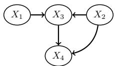  
(a)

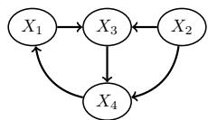  
(b)   
Fig. 8. Directed (a) acyclic and (b) cyclic graph.

A directed acyclic graph (DAG) is a directed graph with no directed paths starting and ending at the same node. For example, the directed graph in Fig. 8(a) is acyclic. The addition of a link from $X _ { 4 }$ to $X _ { 1 }$ makes the graph cyclic (Fig. 8(b)). A node $X _ { i }$ with a directed link to $X _ { j }$ is called parent of $X _ { j }$ . In this case, $X _ { j }$ is called child of $X _ { i }$ .

A node is a collider on a path if it has (at least) two parents on that path. Notice that a node can be a collider on a path and a non-collider on another path. For example, in Fig. 8(a) $X _ { 3 }$ is a collider on the path $X _ { 1 } \right. X _ { 3 } \left. X _ { 2 }$ and a non-collider on the path $X _ { 2 }  X _ { 3 }  X _ { 4 }$ .

A node $X _ { i }$ is an ancestor of a node $X _ { j }$ if there exists a directed path from $X _ { i }$ to $X _ { j }$ . In this case, $X _ { j }$ is a descendant of $X _ { i }$ .

A Bayesian network is a DAG in which nodes represent random variables and links express statistical relationships between the variables. Each node $X _ { i }$ in the graph is associated with the conditional distribution $p ( X _ { i } | \mathrm { p a } ( X _ { i } ) )$ , where $\operatorname { p a } ( X _ { i } )$ is the set of parents of $X _ { i }$ . The joint distribution of all nodes, $p ( X _ { 1 } , \ldots , X _ { I } )$ , is given by the product of all conditional distributions, i.e. $p ( X _ { 1 } , \ldots , X _ { I } ) =$ $\textstyle \prod _ { i = 1 } ^ { I } p ( X _ { i } | \mathrm { p a } ( X _ { i } ) )$ .

In a Bayesian network, the sets of variables $\mathcal { X }$ and $_ { \mathcal { V } }$ are statistically independent given $\mathcal { Z }$ $\mathcal { Z } \left( \mathcal { X } \perp \mathcal { Y } | \mathcal { Z } \right)$ if all paths from any element of $\mathcal { X }$ to any element of $_ { \mathcal { V } }$ are closed (or blocked ). A path is closed if at least one of the following conditions is satisfied:

(a) There is a non-collider on the path which belongs to the conditioning set $\mathcal { L }$ .   
(b) There is a collider on the path such that neither the collider nor any of its descendants belong to the conditioning set $\mathcal { Z }$ .

# Appendix B EFPRs/EFNRs and Calibration

Assume that EFPRs/EFNRs are satisfied, i.e. $p ( \hat { Y } = 1 | A = 0 , Y = 1 ) = p ( \hat { Y } =$ $1 | A = 1 , Y = 1 ) \equiv p _ { \hat { Y } _ { 1 } | Y _ { 1 } }$ and $p ( \dot { Y } = 1 | A = 0 , Y = 0 ) = p ( \dot { Y } = 1 | A = 1 , Y = 0 ) \equiv$ $\psi _ { \hat { Y } _ { 1 } | Y _ { 0 } }$ . From

$$
p (Y = 1 | A = 0, \hat {Y} = 1) = \frac {\overbrace {p (\hat {Y _ {1}} | Y _ {1} \mid A = 0)} ^ {p _ {\hat {Y _ {1}} | Y _ {1}}} ,}{p _ {\hat {Y _ {1}} | Y _ {1}} p _ {Y _ {1} | A _ {0}} + p _ {\hat {Y _ {1}} | Y _ {0}} (1 - p _ {Y _ {1} | A _ {0}})},
$$

$$
p (Y = 1 | A = 1, \hat {Y} = 1) = \frac {p _ {\hat {Y} _ {1} | Y _ {1}} p _ {Y _ {1} | A _ {1}}}{p _ {\hat {Y} _ {1} | Y _ {1}} p _ {Y _ {1} | A _ {1}} + p _ {\hat {Y} _ {1} | Y _ {0}} (1 - p _ {Y _ {1} | A _ {1}})},
$$

we see that, to also satisfy $p ( Y = 1 | A = 0 , \hat { Y } = 1 ) = p ( Y = 1 | A = 1 , \hat { Y } = 1 ) .$ , we need $\bigl ( \underline { { p } } _ { \hat { X } _ { 1 } | \mathcal { H } _ { 1 } } \underline { { p } } _ { \hat { Y } _ { 1 } ^ { \prime } | \mathcal { A } _ { 1 } } + \underline { { p } } _ { \hat { Y } _ { 1 } | \mathcal { T } _ { 0 } } \bigl ( 1 - \underline { { p } } _ { X _ { 1 } | \mathcal { A } _ { 1 } } \bigr ) \bigr ) p _ { Y _ { 1 } | \mathcal { A } _ { 0 } } = \bigl ( \underline { { p } } _ { \hat { X } _ { 1 } | \mathcal { H } _ { 1 } } \underline { { p } } _ { \hat { Y } _ { 1 } ^ { \prime } | \mathcal { A } _ { 0 } } + \underline { { p } } _ { \hat { Y } _ { 1 } | \mathcal { T } _ { 0 } } \bigl ( 1 - \underline { { p } } _ { \hat { X } _ { 1 } | \mathcal { H } _ { 1 } } \bigr ) \bigr )$ $\underbrace { p _ { Y _ { 1 } | A _ { 0 } } ) } _ { \substack { p _ { Y _ { 1 } | A _ { 1 } } } }$ , i.e. $p _ { Y _ { 1 } | A _ { 0 } } = p _ { Y _ { 1 } | A _ { 1 } }$ .

# References

1. AI Now Institute. Litigating algorithms: Challenging government use of algorithmic decision systems, 2018.   
2. M. Alexander. The New Jim Crow: Mass Incarceration in the Age of Colorblindness. The New Press, 2012.

3. D. A. Andrews and J. Bonta. Level of Service Inventory – Revised. Multi-Health Systems Toronto, 2000.   
4. D. A. Andrews, J. Bonta, and J. S. Wormith. The recent past and near future of risk and/or need assessment. Crime & Delinquency, 52(1):7–27, 2006.   
5. J. Angwin, J. Larson, S. Mattu, and L. Kirchner. Machine Bias: There’s software used across the country to predict future criminals. And it’s biased against blacks., May 2016. https://www.propublica.org/article/machine-bias-riskassessments-in-criminal-sentencing.   
6. D. Arnold, W. Dobbie, and C. S. Yang. Racial bias in bail decisions. The Quarterly Journal of Economics, 133:1885–1932, 2018.   
7. R. Berk, H. Heidari, S. Jabbari, M. Kearns, and A. Roth. Fairness in criminal justice risk assessments: The state of the art. Sociological Methods & Research, 2018.   
8. M. Bogen and A. Rieke. Help wanted: An examination of hiring algorithms, equity, and bias. Technical report, Upturn, 2018.   
9. T. Brennan, W. Dieterich, and B. Ehret. Evaluating the predictive validity of the COMPAS risk and needs assessment system. Criminal Justice and Behavior, 36(1):21–40, 2009.   
10. A. Byanjankar, M. Heikkilä, and J. Mezei. Predicting credit risk in peer-to-peer lending: A neural network approach. In IEEE Symposium Series on Computational Intelligence, pages 719–725, 2015.   
11. S. Chiappa. Path-specific counterfactual fairness. In Thirty-Third AAAI Conference on Artificial Intelligence, 2019.   
12. S. Chiappa and W. S. Isaac. A causal Bayesian networks viewpoint on fairness. In E. Kosta, J. Pierson, D. Slamanig, S. Fischer-Hübner, S. Krenn (eds) Privacy and Identity Management. Fairness, Accountability, and Transparency in the Age of Big Data. Privacy and Identity 2018. IFIP Advances in Information and Communication Technology, volume 547. Springer, Cham, 2019.   
13. A. Chouldechova. Fair prediction with disparate impact: A study of bias in recidivism prediction instruments. Big data, 5(2):153–163, 2017.   
14. A. Chouldechova, E. Putnam-Hornstein, D. Benavides-Prado, O. Fialko, and R. Vaithianathan. A case study of algorithm-assisted decision making in child maltreatment hotline screening decisions. Proceedings of Machine Learning Research, 81:134–148, 2018.   
15. S. Corbett-Davies, E. Pierson, A. Feller, S. Goel, and A. Huq. A computer program used for bail and sentencing decisions was labeled biased against blacks. It’s actually not that clear., October 2016. https://www.washingtonpost.com/news/ monkey-cage/wp/2016/10/17/can-an-algorithm-be-racist-our-analysis-ismore-cautious-than-propublicas/?utm_term=.8c6e8c1cfbdf.   
16. S. Corbett-Davies, E. Pierson, A. Feller, S. Goel, and A. Huq. Algorithmic decision making and the cost of fairness. In Proceedings of the 23rd ACM SIGKDD International Conference on Knowledge Discovery and Data Mining, page 797–806, 2017.   
17. S. Corbett-Davies and S.Goel. The measure and mismeasure of fairness: A critical review of fair machine learning. CoRR, abs/1808.00023, 2018.   
18. P. Dawid. Fundamentals of statistical causality. Technical report, University College London, 2007.   
19. J. De Fauw, J. R. Ledsam, B. Romera-Paredes, S. Nikolov, N. Tomasev, S. Blackwell, H. Askham, X. Glorot, B. O’Donoghue, D. Visentin, G. van den Driessche, B. Lakshminarayanan, C. Meyer, F. Mackinder, S. Bouton, K. Ayoub, R. Chopra,

D. King, A. Karthikesalingam, C. O. Hughes, R. Raine, J. Hughes, D. A. Sim, C. Egan, A. Tufail, H. Montgomery, D. Hassabis, G. Rees, T. Back, P. T. Khaw, M. Suleyman, J. Cornebise, P. A. Keane, and O. Ronneberger. Clinically applicable deep learning for diagnosis and referral in retinal disease. Nature Medicine, 24(9):1342–1350, 2018.   
20. W. Dieterich, C. Mendoza, and T. Brennan. COMPAS risk scales: Demonstrating accuracy equity and predictive parity, 2016.   
21. C. Dwork, M. Hardt, T. Pitassi, O. Reingold, and R. Zemel. Fairness through awareness. In Proceedings of the 3rd Innovations in Theoretical Computer Science Conference, pages 214–226, 2012.   
22. L. Eckhouse, K. Lum, C. Conti-Cook, and J. Ciccolini. Layers of bias: A unified approach for understanding problems with risk assessment. Criminal Justice and Behavior, 46:185–209, 2018.   
23. V. Eubanks. Automating Inequality: How High-Tech Tools Profile, Police, and Punish the Poor. St. Martin’s Press, 2018.   
24. M. Feldman, S. A. Friedler, J. Moeller, C. Scheidegger, and S. Venkatasubramanian. Certifying and removing disparate impact. In Proceedings of the 21th ACM SIGKDD International Conference on Knowledge Discovery and Data Mining, pages 259–268, 2015.   
25. A. W. Flores, K. Bechtel, and C. T. Lowenkamp. False positives, false negatives, and false analyses: A rejoinder to "Machine Bias: There’s software used across the country to predict future criminals. And it’s biased against blacks.". Federal Probation, 80(2):38–46, 2016.   
26. Harvard Law School. Note: Bail reform and risk assessment: The cautionary tale of federal sentencing. Harvard Law Review, 131(4):1125–1146, 2018.   
27. X. He, J. Pan, O. Jin, T. Xu, B. Liu, T. Xu, Y. Shi, A. Atallah, R. Herbrich, S. Bowers, et al. Practical lessons from predicting clicks on ads at facebook. In Proceedings of the Eighth International Workshop on Data Mining for Online Advertising, pages 1–9, 2014.   
28. M. Hoffman, L. B. Kahn, and D. Li. Discretion in hiring. The Quarterly Journal of Economics, 133(2):765–800, 2018.   
29. W. S. Isaac. Hope, hype, and fear: The promise and potential pitfalls of artificial intelligence in criminal justice. Ohio State Journal of Criminal Law, 15(2):543–558, 2017.   
30. J. Kleinberg, S. Mullainathan, and M. Raghavan. Inherent trade-offs in the fair determination of risk scores. In 8th Innovations in Theoretical Computer Science Conference, pages 43:1–43:23, 2016.   
31. J. L. Koepke and D. G. Robinson. Danger ahead: Risk assessment and the future of bail reform. Washington Law Review, 93:1725–1807, 2017.   
32. K. Kourou, T. P. Exarchos, K. P. Exarchos, M. V. Karamouzis, and D. I. Fotiadis. Machine learning applications in cancer prognosis and prediction. Computational and Structural Biotechnology Journal, 13:8–17, 2015.   
33. M. J. Kusner, J. R. Loftus, C. Russell, and R. Silva. Counterfactual fairness. In Advances in Neural Information Processing Systems 30, pages 4069–4079, 2017.   
34. K. Lum. Limitations of mitigating judicial bias with machine learning. Nature Human Behaviour, 1(7):1, 2017.   
35. K. Lum and W. Isaac. To predict and serve? Significance, 13(5):14–19, 2016.   
36. M. Malekipirbazari and V. Aksakalli. Risk assessment in social lending via random forests. Expert Systems with Applications, 42(10):4621–4631, 2015.   
37. S. G. Mayson. Bias in, bias out. Yale Law School Journal, 128, 2019.

38. S. Mitchell, E. Potash, and S. Barocas. Prediction-based decisions and fairness: A catalogue of choices, assumptions, and definitions, 2018.   
39. J. Pearl. Causality: Models, Reasoning, and Inference. Cambridge University Press, 2000.   
40. J. Pearl, M. Glymour, and N. P. Jewell. Causal Inference in Statistics: A Primer. Wiley, 2016.   
41. C. Perlich, B. Dalessandro, T. Raeder, O. Stitelman, and F. Provost. Machine learning for targeted display advertising: Transfer learning in action. Machine learning, 95(1):103–127, 2014.   
42. J. Peters, D. Janzing, and B. Schölkopf. Elements of Causal Inference: Foundations and Learning Algorithms. MIT Press, 2017.   
43. M. Rosenberg and R. Levinson. Trump’s catch-and-detain policy snares many who call the U.S. home. https://www.reuters.com/investigates/special-report/ usa-immigration-court, June 2018.   
44. A. D. Selbst. Disparate impact in big data policing. Georgia Law Review, 52:109–195, 2017.   
45. P. Spirtes, C. N. Glymour, R. Scheines, D. Heckerman, C. Meek, G. Cooper, and T. Richardson. Causation, Prediction, and Search. MIT Press, 2000.   
46. M. T. Stevenson. Assessing risk assessment in action. Minnesota Law Review, 103, 2017.   
47. R. Vaithianathan, T. Maloney, E. Putnam-Hornstein, and N. Jiang. Children in the public benefit system at risk of maltreatment: Identification via predictive modeling. American Journal of Preventive Medicine, 45(3):354–359, 2013.   
48. J. Zhang and E. Bareinboim. Fairness in decision-making – the causal explanation formula. In Proceedings of the 32nd AAAI Conference on Artificial Intelligence, 2018.