# Wasserstein Fair Classification

Ray Jiang∗

DeepMind

rayjiang@google.com

Aldo Pacchiano∗

UC Berkeley, DeepMind

pacchiano@berkeley.edu

Tom Stepleton

DeepMind

stepleton@google.com

Heinrich Jiang

Google Research

heinrichj@google.com

Silvia Chiappa

DeepMind

csilvia@google.com

# Abstract

We propose an approach to fair classification that enforces independence between the classifier outputs and sensitive information by minimizing Wasserstein-1 distances. The approach has desirable theoretical properties and is robust to specific choices of the threshold used to obtain class predictions from model outputs. We introduce different methods that enable hiding sensitive information at test time or have a simple and fast implementation. We show empirical performance against different fairness baselines on several benchmark fairness datasets.

# 1 INTRODUCTION

The increasing use of machine learning in decisionmaking scenarios that have serious implications for individuals and society, such as health care, criminal risk assessment, social services, hiring, financial lending, and online advertising (De Fauw et al., 2018; Dieterich et al., 2016; Eubanks, 2018; Hoffman et al., 2018; Malekipirbazari and Aksakalli, 2015; Perlich et al., 2014), is raising concern that bias in the data and model inaccuracies can lead to decisions that are “unfair” towards underrepresented or historically discriminated groups.

This concern has motivated researchers to investigate ways of ensuring that sensitive information (e.g. race and gender) does not unfairly influence the decisions. In the classification case considered in this paper, the most widely used approach is to enforce statistical independence between class predictions and sensitive attributes,

a criterion called demographic parity (Feldman et al., 2015).

In the common scenario in which the model outputs continuous values from which class predictions are obtained through thresholds, this approach would however ensure fairness only with respect to the particular choice of thresholds. Furthermore, as independence constraints on the class predictions are difficult to impose in practice, uncorrelation constraints on the model outputs are often imposed instead.

In this paper, we propose an approach that overcomes these limitations by imposing independence constraints directly on the model outputs. This is achieved through enforcing small Wasserstein distances between the distributions of the model outputs corresponding to groups of individuals with different sensitive attributes. We demonstrate that using Wasserstein-1 distances to the barycenter is optimal, in the sense that it achieves independence with minimal changes to the class predictions that would have been obtained without constraints. We introduce a Wasserstein-1 penalized logistic regression method that learns the optimal transport map in the logistic model parameters, with a variation that has the advantage of being demographically blind at test time. In addition, we provide a simpler and faster post-processing method. We show that the proposed methods outperform previous approaches in the literature on four benchmark fairness datasets.

# 2 STRONG DEMOGRAPHIC PARITY

Let $\boldsymbol { \mathcal { D } } = \{ ( \boldsymbol { \mathbf { a } } ^ { n } , \boldsymbol { \mathbf { x } } ^ { n } , y ^ { n } ) \} _ { n = 1 } ^ { N }$ be a sequence of $N$ i.i.d. samples drawn from an unknown probability distribution over $\mathcal { A } \times \mathcal { X } \times \mathcal { Y } = \mathbb { N } ^ { k } \times \mathbb { R } ^ { d } \times \{ 0 , 1 \}$ . Each datapoint $( \pmb { a } ^ { n } , \pmb { x } ^ { n } , \pmb { y } ^ { n } )$ corresponds to information from an individual (or community): $y ^ { n }$ indicates a binary class, each element $a _ { i } ^ { n }$ of $\pmb { a } ^ { n }$ corresponds to a different sensitive attribute, e.g. to the gender of the individual, and $\pmb { x } ^ { n }$ is a

feature vector that, possibly together with $\pmb { a } ^ { n }$ , can be used to form a prediction $\hat { y } ^ { n } \in \{ 0 , 1 \}$ of the class $y ^ { n }$ . We denote with ${ \mathcal { D } } _ { a } = \{ ( a ^ { n } , x ^ { n } , y ^ { n } ) \in { \mathcal { D } }$ s.t. $\pmb { a } ^ { n } = \pmb { a } \}$ the set of $N _ { a }$ individuals belonging to group $\textbf { \em a }$ . We indicate with $A , X , Y$ and $\hat { Y }$ the random variables corresponding to $\mathbf { \boldsymbol { a } } ^ { n } , \boldsymbol { y } ^ { n }$ and ${ \hat { y } } ^ { n }$ , and with $p ( \cdot )$ or $p _ { X } ( \cdot )$ probability density functions (pdfs), where the latter is used to emphasize the associated random variable.

Many classifiers, rather than a binary class prediction ${ \hat { y } } ^ { n }$ , output a non-binary value $s ^ { n }$ . In the logistic regression case considered in this paper, $s ^ { n } \in \Omega = [ 0 , 1 ]$ indicates the model belief that individual $n$ belongs to class 1, i.e. $s ^ { n } = \mathbb { P } ( Y = 1 | A = \pmb { a } ^ { n } , \pmb { X } = \pmb { x } ^ { n } ) ^ { 2 }$ . From $s ^ { n }$ , a class prediction $\hat { y } ^ { n } \in \{ 0 , 1 \}$ is obtained using a threshold $\tau \in \Omega$ , i.e. $\hat { y } ^ { n } : = \mathbb { 1 } _ { s ^ { n } > \tau }$ , where $\mathbb { 1 } _ { s ^ { n } > \tau }$ equals to one if $s ^ { n } > \tau$ and zero otherwise. We call the random variable $S$ corresponding to $s ^ { n }$ the belief variable, and denote with $S _ { a }$ the belief variable for group $\textbf { \em a }$ , i.e. with pdf $p ( S _ { \pmb { a } } ) = p ( S | \pmb { A } = \pmb { a } )$ .

We are interested in ensuring that sensitive information does not influence the decisions. This is often achieved by imposing that the model satisfies a fairness criterion called demographic parity $( D P )$ , defined as

$$
\mathbb {P} (\hat {Y} = 1 | \boldsymbol {A} = \boldsymbol {a}) = \mathbb {P} (\hat {Y} = 1 | \boldsymbol {A} = \bar {\boldsymbol {a}}), \forall \boldsymbol {a}, \bar {\boldsymbol {a}} \in \mathcal {A}.
$$

DP can equivalently be expressed as requiring statistical independence between $\hat { Y }$ and $\pmb { A }$ , denoted as $\breve { \hat { Y } } \perp \perp A$ .

Enforcing demographic parity at a given threshold $\tau$ does not necessarily imply that the criterion is satisfied for other thresholds. Furthermore, to alleviate difficulties in optimizing on the class prediction $\hat { Y }$ , relaxations are often considered, such as imposing the constraint $\mathbb { E } [ S | A = a ] = \mathbb { E } [ S | A = { \bar { a } } ] \forall a , { \bar { a } } \in { \mathcal { A } }$ , where $\mathbb { E } [ \cdot ]$ denotes expectation (Goh et al., 2016; Zafar et al., 2017).

To deal with these limitations, we propose an approach that enforces statistical independence between $S$ and $\pmb { A }$ , $S \perp \perp A$ . We call this fairness criterion strong demographic parity $( S D P )$ , as it ensures that the decision does not depend on the sensitive attribute regardless of the threshold $\tau$ used, since $S \perp \perp A$ implies $\check { \hat { Y } } \perp \perp A$ for any value of $\tau$ . SDP can be defined as

$$
p _ {S _ {\boldsymbol {a}}} = p _ {S _ {\bar {\boldsymbol {a}}}}, \quad \forall \boldsymbol {a}, \bar {\boldsymbol {a}} \in \mathcal {A}.
$$

In Remark 1, we prove that this definition is equivalent to3

$$
\mathbb {E} _ {\tau \sim U (\Omega)} | \mathbb {P} (S _ {\boldsymbol {a}} > \tau) - \mathbb {P} (S _ {\bar {\boldsymbol {a}}} > \tau) | = 0, \forall \boldsymbol {a}, \bar {\boldsymbol {a}} \in \mathcal {A},
$$

where $U ( \Omega )$ denotes the uniform distribution over $\Omega$ . This result leads us to use

$$
\sum_{\substack{\boldsymbol {a},\bar{\boldsymbol{a}}\in \mathcal{A}\\ s.t.\boldsymbol {a}\neq \bar{\boldsymbol{a}}}}\mathbb{E}_{\tau \sim U(\Omega)}|\mathbb{P}(S_{\boldsymbol{a}} > \tau) - \mathbb{P}(S_{\bar{\boldsymbol{a}}} > \tau)|  ,
$$

as a measure of dependence of $S$ on $\pmb { A }$ , the we call strong pairwise demographic disparity (SPDD).

# 3 WASSERSTEIN FAIR CLASSIFICATION

We suggest to achieve SDP by enforcing the model output pdfs corresponding to groups of individuals with different sensitive attributes, $\{ p _ { S _ { a } } \} _ { a \in \mathcal { A } }$ , to coincide with their Wasserstein-1 barycenter distribution $p _ { \bar { S } }$ . The use of the Wasserstein distance is motivated because this distance is defined and computable even between distributions with disjoint supports. This is critical because the empirical estimates $\{ \hat { p } _ { S _ { a } } \}$ , $\hat { p } _ { \bar { S } }$ of $\{ p _ { S _ { a } } \}$ and $p _ { \bar { S } }$ used to implement the methods and their supports are typically disjoint.

# 3.1 OPTIMALITY OF WASSERSTEIN-1 DISTANCE

Preliminary. Given two pdfs $p _ { X }$ and $p _ { Y }$ on $\mathcal { X }$ and $\mathcal { V }$ , a transportation map $T : \mathcal { X } \ :  \ : \mathcal { Y }$ is defined by $\begin{array} { r } { \int _ { \mathcal { B } } p _ { Y } ( y ) d y = \int _ { T ^ { - 1 } ( \mathcal { B } ) } p _ { X } ( x ) d x } \end{array}$ for any measurable subset $B \subset \mathcal { V }$ (indicating that the mass of the set $\boldsymbol { B }$ with respect to the density $p _ { Y }$ equals the mass of the set $T ^ { - 1 } ( \boldsymbol { B } )$ with respect to the density $p _ { X }$ ). Let $\tau$ be the set of transportation maps from $\mathcal { X }$ to $\mathcal { V }$ , and $\mathrm { ~ c ~ } : \mathcal { X } \times \mathcal { Y }  [ 0 , \infty ]$ be a cost function such that $\mathsf { c } ( x , T ( x ) )$ indicates the cost of transporting $x$ to $T ( x )$ . In the original formulation (Monge, 1781), the optimal transport map $T ^ { * }$ is the one that minimizes the total transportation cost, i.e.

$$
T ^ {*} = \underset {T \in \mathcal {T}} {\arg \min } \int_ {x \in \mathcal {X}} \mathrm {c} (x, T (x)) p _ {X} (x) d x.
$$

To address limitations of this formulation, Kantorovich (1942) reformulated the optimal transport problem as finding an optimal pdf $p _ { X \times Y }$ in the set $\Gamma ( p _ { X } , p _ { Y } )$ of joint pdfs on $\mathcal { X } \times \mathcal { V }$ with marginals over $Y$ and $X$ given by $p _ { X }$ and $p _ { Y }$ such that

$$
\gamma^ {*} = \underset {\gamma \in \Gamma (f _ {X}, f _ {Y})} {\arg \min } \int_ {\mathcal {X} \times \mathcal {Y}} \mathfrak {c} (x, y) p _ {X \times Y} d x d y.
$$

The $p$ -Wasserstein distance is defined as

$$
\mathcal {W} _ {p} (p _ {X}, p _ {Y}) = \min  _ {\gamma \in \Gamma (f _ {X}, f _ {Y})} \left(\int_ {\mathcal {X} \times \mathcal {Y}} \mathrm {d} (x, y) ^ {p} p _ {X \times Y} d x d y\right) ^ {\frac {1}{p}},
$$

where $\mathcal { X } = \mathcal { y }$ , d is a distance on $\mathcal { X }$ , and $p \geq 1$

Fair Optimal Post-Processing. Let us first consider the problem of post-processing the beliefs of a model to achieve SDP while making minimal model class prediction changes.

Let $S _ { 1 }$ and $S _ { 2 }$ be two belief variables with values in $\Omega \ = \ [ 0 , 1 ]$ and pdfs $p _ { S _ { 1 } }$ and $p _ { S _ { 2 } }$ , and let $T : \Omega $ $\Omega$ be a transportation map satisfying $\begin{array} { r l r } { \int _ { B } p _ { S _ { 2 } } ( y ) d y } & { { } = } & { } \end{array}$ $\int _ { T ^ { - 1 } ( \mathcal { B } ) } p _ { S _ { 1 } } ( x ) d x$ for any measurable subset $B \subset \Omega$ Let $\dot { \tau }$ be the set of all such transportation maps. A class prediction $\hat { y } = \mathbb { 1 } _ { s _ { 1 } > \tau }$ changes due to transportation $T ( s _ { 1 } )$ if and only if $\bar { \tau } \in ( m _ { s _ { 1 } } ^ { T } , M _ { s _ { 1 } } ^ { T } )$ where $m _ { s _ { 1 } } ^ { T } =$ = $\operatorname* { m i n } [ s _ { 1 } , T ( s _ { 1 } ) ]$ and $M _ { s _ { 1 } } ^ { T } = \mathrm { m a x } [ \dot { s _ { 1 } } , T ( \dot { s } _ { 1 } ) ]$ . This observation leads to the following result.

Proposition 1. Given two belief variables $S _ { 1 }$ and $S _ { 2 }$ in $\Omega = [ 0 , 1 ]$ with pdfs $p _ { S _ { 1 } }$ and $p _ { S _ { 2 } }$ , the following three quantities are equal:

(ii) $\mathbb { E } _ { \tau \sim U ( \Omega ) } | \mathbb { P } ( S _ { 1 } > \tau ) - \mathbb { P } ( S _ { 2 } > \tau ) | .$   
(iii) Expected class prediction changes due to transporting $p _ { S _ { 1 } }$ into $p _ { S _ { 2 } }$ through the map $T ^ { * }$

$$
\mathbb {E} _ {\tau \sim U (\Omega), x \sim p _ {S _ {1}}} \mathbb {P} \left(\tau \in \left(m _ {x} ^ {T ^ {*}}, M _ {x} ^ {T ^ {*}}\right)\right).
$$

Proof. In the one-dimensional case of $p _ { S _ { 1 } }$ and $p _ { S _ { 2 } }$ , the total transportation cost $\mathcal { W } _ { 1 } ( p _ { S _ { 1 } } , p _ { S _ { 2 } } )$ can be written as

$$
\begin{array}{l} \mathcal {W} _ {1} \left(p _ {S _ {1}}, p _ {S _ {2}}\right) = ^ {4} \int_ {x = 0} ^ {1} \left| P _ {S _ {1}} ^ {- 1} (x) - P _ {S _ {2}} ^ {- 1} (x) \right| d x \\ = \int_ {\tau = 0} ^ {1} | P _ {S _ {1}} (\tau) - P _ {S _ {2}} (\tau) | d \tau \\ = \mathbb {E} _ {\tau \sim U (\Omega)} | \mathbb {P} (S _ {1} \leq \tau) - \mathbb {P} (S _ {2} \leq \tau) | \\ = \mathbb {E} _ {\tau \sim U (\Omega)} | \mathbb {P} (S _ {1} > \tau) - \mathbb {P} (S _ {2} > \tau) |, \\ \end{array}
$$

where $P _ { S _ { 1 } }$ and $P _ { S _ { 2 } }$ are the cumulative distribution functions of $S _ { 1 }$ and $S _ { 2 }$ respectively. This prove that (i) equals (ii).

The expected class prediction changes due to applying the transportation map $T$ is given by

$$
\begin{array}{l} \mathbb{E}_{\substack{\tau \sim U(\Omega)\\ x\sim p_{S_{1}}}}\mathbb{P}\big(\tau \in (m^{T}_{x},M^{T}_{x})\big) \\ = \int_ {\tau = 0} ^ {1} \int_ {x} | x - T (x) | p _ {S _ {1}} (x) d x d \tau \\ = \int_ {x} | x - T (x) | p _ {S _ {1}} (x) d x. \\ \end{array}
$$

Thus,

$$
\begin{array}{l} \mathcal {W} _ {1} \left(p _ {S _ {1}}, p _ {S _ {2}}\right) = \min  _ {T \in \mathcal {T}} \int_ {x} | x - T (x) | p _ {S _ {1}} (x) d x \\ = \int_ {x} | x - T ^ {*} (x) | p _ {S _ {1}} (x) d x \\ = \mathop{\mathbb{E}}_{\substack{\tau \sim U(\Omega)\\ x\sim p_{S_{1}}}}\mathbb{P}\big(\tau \in \big(m_{x}^{T^{*}},M_{x}^{T^{*}}\big)\big). \\ \end{array}
$$

This prove that (i) equals (iii).

Remark 1. Notice that $\begin{array} { r } { ( i i ) = \mathbb { E } _ { \tau \sim U ( \Omega ) } | \mathbb { P } ( S _ { 1 } > \tau ) - } \end{array}$ $\mathbb { P } ( S _ { 2 } > \tau ) | = 0$ if and only if $p _ { S _ { 1 } } = p _ { S _ { 2 } }$ . Indeed, by Proposition 1 and the property of the $\mathcal { W } _ { 1 }$ metric, $( i i ) = 0$ $\iff \mathcal { W } _ { 1 } ( p _ { S _ { 1 } } , p _ { S _ { 2 } } ) = 0 \iff p _ { S _ { 1 } } = p _ { S _ { 2 } } .$

To reach SDP, we need to achieve $p _ { S _ { a } } = p ^ { * } \forall a \in { \mathcal { A } }$ , where $p ^ { * } \in \mathcal { P } ( \Omega )$ , the space of pdfs on $\Omega$ . We would like to choose transportation maps $T$ and a target distribution $p ^ { * }$ such that the transportation process from $p _ { S _ { a } }$ to $p ^ { * }$ incurs minimal total expected class prediction changes. Assume that the groups are all disjoint, so that the per-group transportation maps $T$ are independent from each other. Let $\mathbb { T } ( p ^ { * } )$ be the set of transportation maps with elements $T$ such that, restricted to group $^ { a }$ , $T$ is a transportation map from $p _ { S _ { a } }$ to $p ^ { * }$ (i.e. $\mathbb { T } ( p ^ { * } ) = \{ T \in \mathcal { T } ( p _ { S } , p ^ { * } ) \mid$ $T ( S ) { \big \vert } _ { A = a } = T _ { a } \in { \mathcal { T } } _ { a } = { \mathcal { T } } ( p _ { S _ { a } } , p ^ { * } ) \}$ where $\boldsymbol { \mathcal { T } } ( \boldsymbol { p } _ { \boldsymbol { S } } , \boldsymbol { p } ^ { * } )$ denotes the space of transportation maps from $p _ { S }$ to $p ^ { * }$ ). We would like to obtain

$$
\begin{array}{l} \min  _ {\left. \begin{array}{l} T \in \mathbb {T} (M _ {*}) ^ {*} \end{array} \right.} \quad \mathbb {E} _ {(0)} \mathbb {P} (\tau \in \left(m _ {x} ^ {T}, M _ {x} ^ {T}\right)) \\ \begin{array}{l} I \in \mathbb {1} (p) \quad \tau \sim U (\Omega) \\ p ^ {*} \in \mathcal {P} (\Omega) \quad x \sim p _ {\Sigma} \end{array} \\ = \min_{\substack{T\in \mathbb{T}(p^{*})\\ p^{*}\in \mathcal{P}(\Omega)}}\sum_{\boldsymbol {a}\in \mathcal{A}}\underbrace{p(A = \boldsymbol{a})}_{p_{\boldsymbol{a}}}\underset {\tau \sim U(\Omega)}{\mathbb{E}}_{x\sim p_{S_{\boldsymbol{a}}}}\mathbb{P}(\tau \in (m_{x}^{T},M_{x}^{T})) \\ = \min_{p^{*}\in \mathcal{P}(\Omega)}\sum_{\boldsymbol {a}\in \mathcal{A}}p_{\boldsymbol{a}}\min_{T\in \mathcal{T}_{\boldsymbol{a}}}\underset { \begin{array}{c}\tau \sim U(\Omega)\\ x\sim p_{S_{\boldsymbol{a}}} \end{array} }{\mathbb{E}}\mathbb{P}(\tau \in (m_{x}^{T},M_{x}^{T})) \\ = \min  _ {p ^ {*} \in \mathcal {P} (\Omega)} \sum_ {\boldsymbol {a} \in \mathcal {A}} p _ {\boldsymbol {a}} \min  _ {T \in \mathcal {T} _ {\boldsymbol {a}}} \int_ {x \in \Omega} | x - T (x) | p _ {S _ {\boldsymbol {a}}} (x) d x \\ = \min  _ {p ^ {*} \in \mathcal {P} (\Omega)} \sum_ {\boldsymbol {a} \in \mathcal {A}} p _ {\boldsymbol {a}} \mathcal {W} _ {1} \left(p _ {S _ {\boldsymbol {a}}}, p ^ {*}\right). \\ \end{array}
$$

Therefore we are interested in

$$
p _ {\bar {S}} = \underset {p ^ {*} \in \mathcal {P} (\Omega)} {\arg \min } \sum_ {\boldsymbol {a} \in \mathcal {A}} p _ {\boldsymbol {a}} \mathcal {W} _ {1} \left(p _ {S _ {\boldsymbol {a}}}, p ^ {*}\right), \tag {1}
$$

which coincides with the Wasserstein-1 barycenter with normalized subgroup size as weight to every group distribution $p _ { S _ { a } }$ (Agueh and Carlier, 2011).

In summary, we have demonstrated that the optimal postprocessing procedure that minimizes total expected model prediction changes is to use the Wasserstein-1 optimal transport map $T ^ { * }$ to transport all group distributions $p _ { S _ { a } }$ to their weighted barycenter distribution $p _ { \bar { S } }$ .

Optimal Trade-Offs. We have shown that postprocessing the beliefs of a model through optimal transportation achieves SDP (and therefore $\mathrm { S P D D } = 0$ ) whilst minimizing expected prediction changes. We now examine the case in which, after transportation, SDP is not attained, i.e. SPDD is positive. By triangle inequality

$$
\begin{array}{l} \operatorname {S P D D} \leq 2 (| \mathcal {A} | - 1) \sum_ {\boldsymbol {a} \in \mathcal {A}} \mathbb {E} _ {\tau \sim U (\Omega)} | \mathbb {P} (S _ {\boldsymbol {a}} > \tau) - \mathbb {P} (\bar {S} > \tau) | \\ = 2 (| \mathcal {A} | - 1) \sum_ {\boldsymbol {a} \in \mathcal {A}} \mathcal {W} _ {1} \left(p _ {S _ {\boldsymbol {a}}}, p _ {\bar {S}}\right). \\ \end{array}
$$

We call this upper bound on SPDD pseudo-SPDD. Pseudo-SPDD is the tightest upper bound to SPDD among all possible target distributions by the definition of the barycenter $p _ { \bar { S } }$ and Proposition 1. Indeed

$$
\begin{array}{l} \sum_ {\boldsymbol {a} \in \mathcal {A}} \mathbb {E} _ {\tau \sim U (\Omega)} | \mathbb {P} (S _ {\boldsymbol {a}} > \tau) - \mathbb {P} (\bar {S} > \tau) | \\ = \sum_ {\boldsymbol {a} \in \mathcal {A}} \mathcal {W} _ {1} \left(p _ {S _ {\boldsymbol {a}}}, p _ {\bar {S}}\right) \leq \sum_ {\boldsymbol {a} \in \mathcal {A}} \mathcal {W} _ {1} \left(p _ {S _ {\boldsymbol {a}}}, p _ {S ^ {0}}\right) \\ = \sum_ {\boldsymbol {a} \in \mathcal {A}} \mathbb {E} _ {\tau \sim U (\Omega)} | \mathbb {P} (S _ {\boldsymbol {a}} > \tau) - \mathbb {P} (S ^ {0} > \tau) |, \\ \end{array}
$$

for any distribution $p _ { S ^ { 0 } } \in \mathcal { P } ( \Omega )$ . Since SPDD is difficult to derive optimal trade-offs for, we do that with respect to the pseudo-SPDD as the measure of fairness instead.

We are interested in changing $p _ { S _ { a } }$ to ${ p } _ { { S } _ { a } ^ { * } }$ , $\forall a \ \in \ A$ , to reach a fairness bound $\lambda \in \mathbb { R } _ { + }$ for pseudo-SPDD such that the required model prediction changes are minimal in expectation. This is obtained by choosing the $p _ { S _ { a } ^ { \ast } } \in \mathscr { P } ( \Omega )$ that minimizes the total expected prediction changes, which equals $\scriptstyle \sum _ { \pmb { a } \in \mathcal { A } } p _ { \pmb { a } } \mathcal { W } _ { 1 } ( p _ { S _ { \pmb { a } } } , p _ { S _ { \pmb { a } } ^ { * } } )$ by Proposition 1, while bounding the pseudo-SPDD by $\lambda$ , i.e. $\begin{array} { r } { \sum _ { { \pmb a } \in \mathcal { A } } \mathcal { W } _ { 1 } ( p _ { S _ { \pmb a } ^ { * } } , p _ { \bar { S } } ) \leq \lambda } \end{array}$ . Assuming that the groups are disjoint, we can optimize each group transportation in turn independently assuming the other groups are fixed. This gives

$$
\begin{array}{l} p_{S_{\boldsymbol{a}}^{*}} = \operatorname *{arg  min}_{\substack{p^{*}\in \mathcal{P}(\Omega) s.t.\\ \mathcal{W}_{1}(p^{*},p_{\mathcal{S}})\leq \lambda -\gamma}}p_{\boldsymbol{a}}\mathcal{W}_{1}(p_{S_{\boldsymbol{a}}},p^{*}) \\ = \operatorname *{arg  min}_{\substack{p^{*}\in \mathcal{P}(\Omega) s.t.\\ \mathcal{W}_{1}(p^{*},p_{\bar{S}})\leq \lambda -\gamma}}\mathcal{W}_{1}(p_{S_{a}},p^{*}), \\ \end{array}
$$

where $\begin{array} { r } { \gamma = \sum _ { \bar { \mathbf { a } } \in \mathcal { A } \backslash \mathbf { a } } \mathcal { W } _ { 1 } ( p _ { S _ { \bar { \mathbf { a } } } ^ { * } } , p _ { \bar { S } } ) } \end{array}$ . By triangle inequality, $\mathcal { W } _ { 1 } ( p _ { S _ { a } } , p ^ { * } ) \geq | \mathcal { W } _ { 1 } ( p _ { S _ { a } } , p _ { \bar { S } } ) - \mathcal { W } _ { 1 } ( p ^ { * } , p _ { \bar { S } } ) |$ . The distance $\mathcal { W } _ { 1 } ( p _ { S _ { a } } , p ^ { * } )$ reaches its minimum if and only if $p ^ { * }$ lies on a shortest path between $p _ { S _ { a } }$ and $p _ { \bar { S } }$ . Thus it is optimal to transport $p _ { S _ { a } }$ along any shortest path between itself and $p _ { \bar { S } }$ in the Wasserstein-1 metric space. In the approach proposed in the next section, we approximate transporting group distributions along these shortest paths with hyperparameter tuning of a gradient descent method to minimize $\mathcal { W } _ { 1 } ( p _ { S _ { a } } , p _ { \bar { S } } )$ for every group.

Empirical Computation of the Barycenter. In practice, as building the barycenter from the population distributions $p _ { S _ { a } }$ is impossible, we use the empirical distributions $\hat { p } _ { S _ { a } }$ obtained from $\mathcal { D } _ { \pmb { a } }$ . The choice is justified by the following result:

Lemma 1. If the samples in $\mathcal { D }$ are i.i.d., as $| \mathcal { D } | \to \infty ,$ , if $\mathcal { W } _ { 1 } ( p _ { S } , p _ { S _ { a } } ) < \infty$ for all $^ { a }$ , the empirical barycenter distribution satisfies $\begin{array} { r l } { \operatorname* { l i m } \sum _ { a } \hat { p } _ { a } \mathcal { W } _ { 1 } \big ( \hat { p } _ { \bar { S } } , \hat { p } _ { S _ { a } } \big ) } & { { } \to } \end{array}$ $\begin{array} { r } { \sum _ { \pmb { a } } p _ { \pmb { a } } \mathcal { W } _ { 1 } ( p _ { \bar { S } } , p _ { S _ { \pmb { a } } } ) } \end{array}$ almost surely5.

The proof is given in Appendix A.

In the next two sections we introduce two different approaches to achieve SDP with Wasserstein-1 distances: A penalization approach to logistic regression and a simpler practical approach consisting in post-processing model beliefs.

# 3.2 WASSERSTEIN-1 PENALIZED LOGISTIC REGRESSION

The average logistic regression loss function over $\mathcal { D } =$ $\{ a ^ { n } , { \pmb x } ^ { n } , y ^ { n } \} _ { n = 1 } ^ { N }$ is given by

$$
J _ {\mathcal {D}} (\boldsymbol {\theta}) = \frac {1}{N} \sum_ {n = 1} ^ {N} - y ^ {n} \log s ^ {n} - (1 - y ^ {n}) \log (1 - s ^ {n}),
$$

where the model belief that individual $n$ belongs to class $1 , s ^ { n }$ , is obtained as $s ^ { n } = \sigma ( \pmb { \theta } ^ { \top } \pmb { w } ^ { n } ) = 1 / ( 1 + e ^ { - \pmb { \theta } ^ { \top } \pmb { w } ^ { n } } )$ , with $\pmb { w } ^ { n } = ( \pmb { x } ^ { n } , \pmb { a } ^ { n } , 1 ) ^ { \top }$ , and where $\pmb { \theta } \in \mathbb { R } ^ { d + k + 1 }$ are the model parameters. We denote with $\{ s _ { a } ^ { i } \}$ the model beliefs for group $\textbf { \em a }$ and with $\{ \bar { s } ^ { j } \} _ { j = 1 } ^ { \bar { N } }$ athe atoms of $p _ { \bar { S } }$ .

The gradient of $J _ { \mathcal { D } } ( \pmb { \theta } )$ with respect to $\pmb { \theta }$ is given by

$$
\nabla_ {\boldsymbol {\theta}} J _ {\mathcal {D}} (\boldsymbol {\theta}) = \frac {1}{N} \sum_ {n = 1} ^ {N} \boldsymbol {w} ^ {n} \left(\sigma \left(\boldsymbol {\theta} ^ {\top} \boldsymbol {w} ^ {n}\right) - y ^ {n}\right).
$$

We propose to find model parameters $\pmb { \theta } ^ { * }$ that minimize the population level logistic loss $\mathbb { E } \left[ J _ { \mathcal { D } } ( \pmb { \theta } ) \right]$ under the constraint of small Wasserstein-1 distances $\mathcal { W } _ { 1 } ( \hat { p } _ { S _ { a } } , \hat { p } _ { \bar { S } } )$ between $\hat { p } _ { S _ { a } }$ and the empirical barycenter $\hat { p } _ { \bar { S } }$ , $\forall a \in { \mathcal { A } }$ .

The Wasserstein-1 distance between any two empirical distributions $\hat { p } _ { b }$ and $\hat { p } _ { c }$ underlying two datasets $\{ b ^ { i } \} _ { i = 1 } ^ { N _ { b } } , \{ c ^ { j } \} _ { j = 1 } ^ { N _ { c } } \mathcal { \bar { \mathrm { ~ C ~ } } } \mathbb { R }$ is given by

$$
\mathcal {W} _ {1} \left(\hat {p} _ {b}, \hat {p} _ {c}\right) = \min  _ {T _ {b, c} \in U (b, c)} \left\langle T _ {b, c}, \mathbf {C} \right\rangle , \tag {2}
$$

where $U ( b , c ) ~ = ~ \{ T ~ \in ~ \mathbb { R } ^ { N _ { b } \times N _ { c } }$ s.t. $\begin{array} { r l } { T _ { b , c } \mathbf { 1 } _ { c } } & { { } = } \end{array}$ $\scriptstyle { \frac { 1 } { N _ { b } } } \mathbf { 1 } _ { b }$ and $\begin{array} { r } { T _ { b , c } ^ { \top } \mathbf { 1 } _ { b } ~ = ~ \frac { 1 } { N _ { c } } \mathbf { 1 } _ { c } \big \} } \end{array}$ with $\mathbf { 1 } _ { c }$ denoting a vector of ones of size $N _ { c }$ . The brackets $\langle \cdot , \cdot \rangle$ denote the trace

dot product and C is the cost matrix associated with the Wasserstein-1 cost function c of elements $\mathbf { C } _ { i , j } = | b ^ { i } - c ^ { j } |$

In particular, the Wasserstein-1 distance $\mathcal { W } _ { 1 } ( \hat { p } _ { S _ { a } } , \hat { p } _ { \bar { S } } )$ can be computed by solving the optimization problem of Eq. (2) with cost matrix $\mathbb { C } _ { a } ^ { \theta } \in \mathbb { R } ^ { \tilde { N _ { a } } \times \tilde { N } }$ satisfying

$$
\left(\mathbf {C} _ {\boldsymbol {a}} ^ {\boldsymbol {\theta}}\right) _ {i, j} = \left| s _ {\boldsymbol {a}} ^ {i} - \bar {s} ^ {j} \right|,
$$

where the upper script $\pmb \theta$ in $\mathbf { C } _ { a } ^ { \theta }$ is maintained to remind the reader that model predictions are a function of the model parameter $\pmb \theta$ .

The Wasserstein-1 penalized logistic regression objective is given by

$$
J _ {\mathcal {W} _ {1}} (\boldsymbol {\theta}) = \alpha J _ {\mathcal {D}} (\boldsymbol {\theta}) + (1 - \alpha) \beta \sum_ {\boldsymbol {a} \in \mathcal {A}} \mathcal {W} _ {1} \left(\hat {p} _ {S _ {\boldsymbol {a}}}, \hat {p} _ {\bar {S}}\right), \tag {3}
$$

where $\alpha$ and $\beta$ are penalization coefficients.

Lemma 2. If the datasets $\{ b ^ { i } \} _ { i = 1 } ^ { N _ { b } } , \{ c ^ { j } \} _ { j = 1 } ^ { N _ { c } } \subset \mathbb { R }$ have empirical distributions $\hat { p } _ { b }$ and $\hat { p } _ { c } ,$ , and $C$ is the cost matrix of elements $C _ { i , j } = | b ^ { i } - c ^ { j } |$ :

$$
\nabla_ {C} \mathcal {W} _ {1} (\hat {p} _ {b}, \hat {p} _ {c}) = T _ {b, c} ^ {*},
$$

where $T _ { b , c } ^ { * } = \arg \operatorname* { m i n } _ { T _ { b , c } \in U ( b , c ) } \langle T _ { b , c } , C \rangle$ is the optimal coupling resulting from the optimization objective of Eq. (2).

Proof. The result follows immediately from the subgradient rule for a pointwise max function (see Boyd and Vandenberghe (2004)). □

Lemma 3. The gradient of $J _ { \mathcal { W } _ { 1 } } ( \pmb \theta )$ equals:

$$
\alpha \nabla_ {\boldsymbol {\theta}} J _ {\mathcal {D}} (\boldsymbol {\theta}) + (1 - \alpha) \beta \big (\sum_ {\boldsymbol {a} \in \mathcal {A}} \sum_ {i, j} T _ {\boldsymbol {a}} ^ {*} (\boldsymbol {\theta}) \nabla_ {\boldsymbol {\theta}} \left| s _ {\boldsymbol {a}} ^ {i} - \bar {s} ^ {i} \right| \big),
$$

where $T _ { a } ^ { * }$ is the optimal coupling between $\hat { p } _ { S _ { a } }$ and ${ \hat { p } } _ { \bar { S } } { } ^ { 6 }$ .

Proof. This formula is a consequence of the chain rule and Lemma 1. □

Computation Method. We propose to optimize the Wasserstein penalized logistic loss objective (Eq. (3)) via gradient descent. The procedure is detailed in Algorithm 1. We start by describing how to perform Step 2. under the assumption that $\hat { p } _ { \bar { S } }$ and $\{ \bar { s } ^ { i } \} _ { i = 1 } ^ { \bar { N } }$ have been computed. The computation of the optimal coupling family $\{ T _ { a } ^ { * } \}$ hinges on the following Lemma.

Lemma 4. If $\{ b ^ { i } \} _ { i = 1 } ^ { N _ { b } } , \{ c ^ { j } \} _ { j = 1 } ^ { N _ { c } } \ \subset \ \mathbb { R } ,$ and $B _ { i } ~ = ~ [ i ~ \times$ $( N _ { c } - 1 ) + 1 , \cdots , i \times N _ { c } ]$ for all i and $C _ { j } = [ j \times ( N _ { b } -$ $1 ) + 1 , \cdots , j \times N _ { c } ] _ { } ^ { }$ for all $j$ , then: $\begin{array} { r } { ( T _ { b , c } ^ { * } ) _ { i , j } = \frac { \# | B _ { i } \cap C _ { j } | } { N _ { b } N _ { c } } } \end{array}$ .

Algorithm 1 Wass-1 Penalized Logistic Regression

Input: Dataset $\mathscr { D } = \{ ( \pmb { a } ^ { n } , \pmb { x } ^ { n } , y ^ { n } ) \} _ { n = 1 } ^ { N }$ , penalization coefficients $\alpha , \beta$ , gradient step size $\eta _ { : }$ , number of optimization rounds $M$ , frequency of barycenter computation $K$ .

Compute datasets $\{ \mathcal { D } _ { { \pmb a } } \}$

Initialize model parameters $\theta _ { 0 }$

for $m = 1 , \cdots , M$ do

1. Compute the barycenter disand Courty (2017)) once every bution steps, $\hat { p } _ { \bar { S } }$ d $K$ $\{ \bar { s } ^ { i } \} _ { i = 1 } ^ { \bar { N } }$   
2. Compute optimal couplings $\{ T _ { { \pmb { a } } ^ { * } } \}$ as defined in Lemma 3.   
3. Update parameter $\pmb { \theta } _ { m } = \pmb { \theta } _ { m - 1 } - \eta \nabla _ { \pmb { \theta } } J _ { \mathcal { W } _ { 1 } } ( \pmb { \theta } _ { m } )$

end

Return: $\pmb { \theta } _ { M }$

This lemma characterizes the coupling matrix between the empirical distributions of two datasets made of real numbers. When $N _ { b } = N _ { c }$ and the datasets are $\{ b ^ { i } \} _ { b } ^ { N }$ and $\{ c ^ { i } \} _ { c } ^ { N }$ , with $b ^ { 1 } < \ldots < b ^ { N }$ , and $a ^ { 1 } < \ldots < a ^ { N }$ , then the optimal coupling equals $1 / N \times I _ { N }$ where $I _ { N }$ denotes the $N \times N$ identity matrix. Lemma 4 extends this simple case to the general case of datasets of arbitrary orderings and sizes, see Deshpande et al. (2018) for a proof. It is easy to see that the optimal coupling $T _ { b , c } ^ { * }$ is sparse and has at most $\mathcal { O } ( N _ { b } + N _ { c } )$ nonzero entries (see Cuturi (2013)). As a consequence, the computation of $\nabla _ { \pmb { \theta } } J _ { \mathcal { W } _ { 1 } } ( \pmb { \theta } )$ can be performed in linear time $\mathcal { O } \big ( \sum _ { \mathbf { a } } ( N _ { \mathbf { a } } + \bar { N } ) \big )$ where $N _ { a } = | \mathcal { D } _ { a } |$ . In the computation of $\nabla _ { \pmb { \theta } } J _ { \mathcal { W } _ { 1 } } ( \pmb { \theta } )$ only the nonzero entries of $T _ { b , c } ^ { * }$ matter.

We compute the empirical barycenter $\hat { p } _ { \bar { S } }$ and $\{ \bar { s } ^ { i } \} _ { i = 1 } ^ { \bar { N } }$ using the POT library by Flamary and Courty (2017). We fix the support of potential barycenters to bins of equal-width spanning the [0, 1] interval, and use the iterative KL-projection method proposed by Benamou et al. (2015). We then generate a number of samples from the normalized probability distribution of the computed barycenter.

Demographically-Blind Wasserstein-1 Penalized Logistic Regression. In real-world applications, the use of sensitive attributes might be prohibited when deploying a system. We therefore consider the variation where $\bar { \mathbf { \Psi } } \bar { \mathbf { \Psi } } = \bar { ( \mathbf { \Psi } } \mathbf { x } ^ { n } , 1 ) ^ { \top }$ . This variation still uses the sensitive attributes to calculate the Wasserstein-1 loss but, by not including them into the feature set, does not require knowledge of sensitive information at test time.

# 3.3 WASSERSTEIN-1 POST-PROCESSING

In this section, we propose a simple, fast quantile matching method to post-process the beliefs of a classifier

# Algorithm 2 Wass-1 Post-Processing

Input: dataset $\mathcal { D } = \{ ( { \pmb a } ^ { n } , { \pmb x } ^ { n } , y ^ { n } ) \} _ { n = 1 } ^ { N }$ , set of quantile bins $\boldsymbol { B }$ , model beliefs $\{ s ^ { n } \}$

Compute datasets $\{ \mathcal { D } _ { { \pmb a } } \}$ and their barycenter $\bar { \mathcal D }$ .

Define the $i$ -th quantile of dataset $\mathcal { D } _ { a }$ as

$$
q _ {\mathcal {D} _ {\boldsymbol {a}}} (i) := \sup  \left\{s: \frac {1}{N _ {\boldsymbol {a}}} \sum_ {n s. t. \boldsymbol {a} ^ {n} = \boldsymbol {a}} \mathbb {1} _ {s ^ {n} \leq s} \leq \frac {i - 1}{| \mathcal {B} |} \right\},
$$

and its inverse as $q _ { \mathcal { D } _ { a } } ^ { - 1 } ( s ) : = \operatorname* { s u p } \{ i \in \mathcal { B } : q _ { \mathcal { D } _ { a } } ( i ) \le s \} .$ .

Return: $\left\{ q _ { \bar { D } } \left( q _ { \bar { D } _ { a } } ^ { - 1 } ( \bar { s } ^ { n } ) \right) \right\}$

trained on $\mathcal { D }$ . This method corresponds to an approximate Wasserstein-1 optimal transport map by the formulation of Rachev and Ruschendorf (1998): ¨

$$
\mathcal {W} _ {1} \left(p _ {S _ {a}}, p _ {\bar {S}}\right) = \int_ {\tau = 0} ^ {1} \left| P _ {S _ {a}} ^ {- 1} (\tau) - P _ {\bar {S}} ^ {- 1} (\tau) \right| d \tau .
$$

The procedure is detailed in Algorithm 2. For each group $\textbf { \em a }$ , we compute quantiles of $\hat { p } _ { S _ { a } }$ and map all group beliefs belonging in each quantile bin to the supremum of those belonging to the corresponding quantile bin of $\hat { p } _ { \bar { S } }$ .

# 3.4 GENERALIZATION

The following lemma addresses generalization of the Wasserstein-1 objective. Assume $\mathcal { W } _ { 1 } ( p _ { S _ { a } } , p _ { \bar { S } } ) ~ \leq ~ L$ for all $\mathbf { \alpha } _ { \mathbf { { a } } } \in \mathcal { A }$ . Let $P _ { S } , P _ { S _ { a } }$ and $P _ { \bar { S } }$ be the cumulative density functions of $S$ , $S _ { a }$ and $\bar { S }$ . Assume these random variables all have domain $\Omega = [ 0 , 1 ]$ and that all $P \in \{ P _ { S } , P _ { \bar { S } } \} \cup \{ P _ { S _ { a } } \} _ { a \in \mathcal { A } }$ are continuous, then:

Lemma 5. For any $\epsilon , \delta > 0$ , $i f \operatorname * { m i n } \left[ \bar { N } , \operatorname * { m i n } _ { a } \left[ N _ { a } \right] \right] \geq$ $\frac { 1 6 \log ( 2 | \mathcal { A } | / \delta ) | \mathcal { A } | ^ { 2 } \operatorname* { m a x } [ 1 , L ] ^ { 2 } } { \epsilon ^ { 2 } }$ 2 , with probability $1 - \delta$ :

$$
\sum_ {\boldsymbol {a} \in \mathcal {A}} p _ {\boldsymbol {a}} \mathcal {W} _ {1} \left(p _ {S _ {\boldsymbol {a}}}, p _ {\bar {S}}\right) \leq \sum_ {\boldsymbol {a} \in \mathcal {A}} \hat {p} _ {\boldsymbol {a}} \mathcal {W} _ {1} \left(\hat {p} _ {S _ {\boldsymbol {a}}}, \hat {p} _ {\bar {S}}\right) + \epsilon .
$$

In other words, provided access to sufficient samples, a low value of $\begin{array} { r } { \sum _ { a } \hat { p } _ { a } \mathcal { W } _ { 1 } ( \hat { p } _ { S _ { a } } , \hat { p } _ { \bar { S } } ) } \end{array}$ implies a low value for $\begin{array} { r } { \sum _ { a } p _ { a } \mathcal { W } _ { 1 } ( p _ { S _ { a } } , p _ { \bar { S } } ) } \end{array}$ with high probability and therefore good performance at test time.

The proof is given in Appendix B.

Lemma 5 implies that under appropriate conditions, the value of the population objective of the Wasserstein cost is upper bounded by the empirical Wasserstein cost plus a small constant.

# 4 RELATED WORK

Broadly speaking, we can group current literature on fair classification and regression into three main approaches.

The first approach consists in pre-processing the data to remove bias, or in extracting representations that do not contain sensitive information during training (Beutel et al., 2017; Calders et al., 2009; Calmon et al., 2017; Edwards and Storkey, 2016; Feldman et al., 2015; Fish et al., 2015; Kamiran and Calders, 2009, 2012; Louizos et al., 2016; Zemel et al., 2013; Zliobaite et al., 2011). This approach ˇ includes current methods to fairness using Wasserstein distances consisting in achieving SDP through transportation of features (Del Barrio et al., 2019; Johndrow and Lum, 2019). The second approach consists in performing a post-processing of the model outputs (Chiappa, 2019; Doherty et al., 2012; Feldman, 2015; Hardt et al., 2016; Kusner et al., 2017). The third approach consists in enforcing fairness notions by imposing constraints into the optimization, or by using an adversary. Some methods transform the constrained optimization problem via the method of Lagrange multipliers (Agarwal et al., 2018; Corbett-Davies et al., 2017; Cotter et al., 2018; Goh et al., 2016; Narasimhan, 2018; Wu et al., 2018; Zafar et al., 2017). Other work similar in spirit adds penalties to the objective (Donini et al., 2018; Komiyama et al., 2018). Adversarial methods maximize the system ability to predict $Y$ while minimizing the ability to predict $\pmb { A }$ (Zhang et al., 2018).

# 5 EXPERIMENTS

In this section, we evaluate the methods introduced in Sections 3.2 and 3.3 on four datasets from the UCI repository (Lichman, 2013). For penalized logistic regression, we refer to the method in which sensitive information is included in the feature set, i.e. $\pmb { w } ^ { n } = ( \mathbf { x } ^ { n } , \pmb { a } ^ { n } , 1 ) ^ { \top }$ , as Wass-1 Penalty; and to the demographically-blind variant in which sensitive information is not included, i.e. $\pmb { w } ^ { n } = ( \pmb { x } ^ { n } , 1 ) ^ { \top }$ , as Wass-1 Penalty DB. We refer to the post-processing method as Wass-1 Post-Process. We also include a variant of this method using $\hat { p } _ { S }$ instead of the barycenter $\hat { p } _ { \bar { S } }$ (Wass-1 Post-Process $\hat { p } _ { S }$ ), which gives a simpler algorithm that only requires computing basic quantile functions. We compare these methods with the following baselines:

Unconstrained: Logistic regression with no fairness constraints.

Hardt’s Post-Process: Post-processing of the logistic regression beliefs $s ^ { n }$ of all individuals in group $^ { a }$ by adding $0 . 5 - \tau _ { a }$ , where the threshold $\tau _ { a }$ is found using the method of Hardt et al. (2016). This ensures that DP is satisfied at threshold $\tau = 0 . 5$ .

Constrained Optimization: Lagrangian-based method (see e.g. Eban et al. (2017); Goh et al. (2016)) using a linear model as the underlying predictor and equal positive prediction rate between each group $\mathcal { D } _ { a }$ and $\mathcal { D }$

Table 1: Adult Dataset – German Credit Dataset   

<table><tr><td rowspan="2"></td><td colspan="5">Adult</td><td colspan="5">German</td></tr><tr><td>Err-.5</td><td>Err-Exp</td><td>DD-.5</td><td>SDD</td><td>SPDD</td><td>Err-.5</td><td>Err-Exp</td><td>DD-.5</td><td>SDD</td><td>SPDD</td></tr><tr><td>Unconstrained</td><td>.142</td><td>.198</td><td>.413</td><td>.426</td><td>.806</td><td>.248</td><td>.319</td><td>.124</td><td>.102</td><td>.103</td></tr><tr><td>Hardt&#x27;s Post-Process</td><td>.165</td><td>.289</td><td>.327</td><td>.551</td><td>1.058</td><td>.248</td><td>.333</td><td>.056</td><td>.045</td><td>.045</td></tr><tr><td>Constrained Opt.</td><td>.205</td><td>.198</td><td>.065</td><td>.087</td><td>.166</td><td>.318</td><td>.320</td><td>.173</td><td>.149</td><td>.149</td></tr><tr><td>Adv. Constr. Opt.</td><td>.219</td><td>.207</td><td>.0</td><td>.114</td><td>.203</td><td>.306</td><td>.307</td><td>.0</td><td>.021</td><td>.021</td></tr><tr><td>Wass-1 Penalty</td><td>.199</td><td>.208</td><td>.014</td><td>.022</td><td>.044</td><td>.306</td><td>.311</td><td>.0</td><td>.003</td><td>.003</td></tr><tr><td>Wass-1 Penalty DB</td><td>.230</td><td>.233</td><td>.010</td><td>.012</td><td>.023</td><td>.306</td><td>.309</td><td>.0</td><td>.010</td><td>.010</td></tr><tr><td>Wass-1 Post-Process</td><td>.174</td><td>.214</td><td>.013</td><td>.017</td><td>.042</td><td>.258</td><td>.327</td><td>.068</td><td>.023</td><td>.023</td></tr><tr><td>Wass-1 Post-ProcesshatS</td><td>.165</td><td>.216</td><td>.032</td><td>.022</td><td>.059</td><td>.248</td><td>.320</td><td>.056</td><td>.025</td><td>.025</td></tr></table>

as fairness constraints with threshold $\tau = 0$ .

Adv. Constr. Opt.: The same as the previous method, but with more fairness constraints. Specifically, the fairness constraints are equal positive prediction rates for a set of thresholds from $- 2$ to 2 in increments of 0.2 on the output of the linear model.

# 5.1 TRAINING DETAILS

In the approaches Unconstrained, Hardt’s Post-Process, Wass-1 Penalty, and Wass-1 Post-Process, we trained a logistic regression model using Scikit-Learn with default hyper-parameters (Pedregosa and et al., 2011).

For Wass-1 Penalty (Algorithm 1), as initial model parameters $\pmb { \theta } _ { 0 }$ we used the ones given by the trained logistic regression. We swept over penalization coefficients $\alpha \ = \ [ 0 , 0 . 5 ]$ , $\beta ~ = ~ [ 1 0 ^ { - 2 } , 3$ · $1 0 ^ { - 2 } , 1 0 ^ { - 1 } , 3 \cdot 1 0 ^ { - 1 } , 1 , 3 , 1 0 , \bar { 3 } 0 , 1 0 ^ { \bar { 2 } } ]$ , gradient step sizes $\eta = [ 1 0 ^ { - 4 } , 1 0 ^ { - 3 } , 1 0 ^ { - 2 } , 1 0 ^ { - 1 } ]$ , set the maximum number of training steps to $M \ : = \ : 8 0 , 0 0 0$ , and computed the barycenter once every $K > M$ steps, effectively only once after the initialization of $\pmb { \theta } _ { 0 }$ . In the computation of the barycenter (using the POT library by Flamary and Courty (2017)), we swept over numbers of bins $B = [ 5 0 , 9 0 ]$ , entropy penalty $\delta = [ 1 0 ^ { - 3 } , 5 \cdot 1 0 ^ { - 3 } , 1 0 ^ { - 2 } ]$ , and used number of iterations $M = 1 , 0 0 0$ . The time complexity of our implementation is $\mathcal { O } ( N \log ( N ) )$ . Our gradient steps take on average ${ \sim } 0 . 0 2$ seconds.

For Wass-1 Post-Process (Algorithm 2), we used a number of bins $| B | = 1 0 0$ .

For Constrained Optimization, we used the hinge loss as objective and the hinge relaxation for the fairness constraints. We trained by jointly optimizing the model parameters and Lagrange multipliers on the Lagrangian using ADAM with the default step-size of 0.001 and minibatch size of 100, and trained for 50 steps. We allowed an additive slack of 0.05 on the constraints, as otherwise we

found feasibility issues leading to degenerate classifiers.

# 5.2 DATASETS

The UCI Adult Dataset. The Adult dataset contains 14 attributes including age, working class, education level, marital status, occupation, relationship, race, gender, capital gain and loss, working hours, and nationality for 48,842 individuals; 32,561 and 16,281 for the training and test sets respectively. The goal is to predict whether the individual’s annual income is above or below $\$ 50,000$ .

Pre-processing and Sensitive Attributes. We preprocessed the data in the same way as done in Goh et al. (2016); Zafar et al. (2017). The categorical features were encoded into binary features (one for each category), and the continuous features were transformed into binary encodings depending on five quantile values, obtaining a total of 122 features. As sensitive attributes, we considered race (Black and White) and gender (female and male), obtaining four groups corresponding to black females, white females, black males, and white males.

The UCI German Credit Dataset. This dataset contains 20 attributes for 1,000 individuals applying for loans. Each applicant is classified as a good or bad credit risk, i.e. as likely or not likely to repay the loan. We randomly divided the dataset into training and test sets of sizes 670 and 330 respectively.

Pre-processing and Sensitive Attributes. We did not do any pre-processing. As sensitive attributes, we considered age $\leq 3 0$ and $> 3 0$ years old), obtaining two groups.

The UCI Bank Marketing Dataset. This dataset contains 20 attributes for 41,188 individuals. Each individual is classified as subscribed or not to a term deposit. We divided the dataset into train and test sets of sizes 32,950 and 8,238 respectively.

Table 2: Bank Marketing Dataset – Community & Crime Dataset   

<table><tr><td rowspan="2"></td><td colspan="5">Bank Marketing</td><td colspan="5">Community &amp; Crime</td></tr><tr><td>Err-.5</td><td>Err-Exp</td><td>DD-.5</td><td>SDD</td><td>SPDD</td><td>Err-.5</td><td>Err-Exp</td><td>DD-.5</td><td>SDD</td><td>SPDD</td></tr><tr><td>Unconstrained</td><td>.094</td><td>.138</td><td>.135</td><td>.134</td><td>.61</td><td>.116</td><td>.195</td><td>.581</td><td>1.402</td><td>7.649</td></tr><tr><td>Hardt&#x27;s Post-Process</td><td>.097</td><td>.181</td><td>.018</td><td>.367</td><td>1.057</td><td>.321</td><td>.441</td><td>.226</td><td>.536</td><td>2.679</td></tr><tr><td>Constrained Opt.</td><td>.105</td><td>.110</td><td>.049</td><td>.026</td><td>.076</td><td>.289</td><td>.263</td><td>.193</td><td>.369</td><td>2.003</td></tr><tr><td>Adv. Constr. Opt.</td><td>.105</td><td>.105</td><td>.050</td><td>.064</td><td>.184</td><td>.303</td><td>.275</td><td>.022</td><td>.312</td><td>1.628</td></tr><tr><td>Wass-1 Penalty</td><td>.114</td><td>.151</td><td>.001</td><td>.015</td><td>.050</td><td>.313</td><td>.315</td><td>.0</td><td>.008</td><td>.039</td></tr><tr><td>Wass-1 Penalty DB</td><td>.114</td><td>.131</td><td>.001</td><td>.006</td><td>.018</td><td>.313</td><td>.315</td><td>.0</td><td>.011</td><td>.051</td></tr><tr><td>Wass-1 Post-Process</td><td>.100</td><td>.144</td><td>.016</td><td>.020</td><td>.062</td><td>.321</td><td>.363</td><td>.226</td><td>.133</td><td>.680</td></tr><tr><td>Wass-1 Post-ProcesshatS</td><td>.097</td><td>.141</td><td>.014</td><td>.020</td><td>.063</td><td>.321</td><td>.335</td><td>.226</td><td>.159</td><td>.822</td></tr></table>

Pre-processing and Sensitive Attributes. We preprocessed the data as for the Adult dataset. We transformed the categorical features into binary ones, and the continuous features into five binary features based on five quantile bins, obtaining a total of 60 features. We also subtracted the mean from cons.price.idx, cons.conf.idx, euribor3m, and nr.employed to make them zero-centered. As sensitive attributes, we considered age, which was discretized based on five quantiles leading to five groups.

The UCI Communities & Crime Dataset. This dataset contains 135 attributes for 1994 communities; 1495 and 499 for the training and test sets respectively. The goal is to predict whether a community has high (above the 70-th percentile) crime rate.

Pre-processing and Sensitive Attributes. We preprocessed the data as in Wu et al. (2018). As sensitive attributes, we considered race (Black, White, Asian and Hispanic), thresholded at the median to form height groups.

# 5.3 RESULTS

We compared the different methods using the following metrics:

Err-.5: Binary classification error using threshold $\tau = 0 . 5$ , i.e. Err- $\begin{array} { r } { . 5 = \frac { 1 } { N } \sum _ { n = 1 } ^ { N } \mathbb { 1 } _ { \hat { y } ^ { n } \ne y ^ { n } } } \end{array}$ .

Err-Exp: As above, but averaging over 100 uniformlyspaced thresholds $\tau \in [ 0 , 1 ]$ .

DD-.5: Demographic disparity at $\tau = 0 . 5$ , summed over all groups $\textbf { \em a } \in \mathcal { A }$ , i.e. DD- $\begin{array} { r } { . 5 = \sum _ { \pmb { a } \in \mathcal { A } } | \mathbb { P } ( S _ { \pmb { a } } > } \end{array}$ $0 . 5 ) \mathrm { ~ - ~ } \mathbb { P } ( S ~ > ~ 0 . 5 ) |$ , where e.g. $\mathbb { P } ( S ~ > ~ \tau )$ is estimated as $\begin{array} { r } { \mathbb { P } ( S > \tau ) \approx \frac { 1 } { N } \sum _ { n = 1 } ^ { N } \mathbb { 1 } _ { s ^ { n } > \tau } } \end{array}$ .

SDD (strong demographic disparity): As above, but averaging over 100 uniformly-spaced thresholds $\tau \in [ 0 , 1 ]$ , i.e. $\begin{array} { r } { \mathrm { S D D } = \sum _ { { \pmb { a } } \in \mathcal { A } } \mathbb { E } _ { \tau \sim U ( [ 0 , 1 ] ) } | \mathbb { P } ( S _ { \pmb { a } } > } \end{array}$ $\tau ) - \mathbb { P } ( S > \tau ) |$ . We use this metric to compare with other baselines that use the full-dataset belief

distribution.

SPDD: $\begin{array} { r } { \mathrm { S P D D } = \sum _ { a , \bar { a } \in \mathcal { A } } \mathbb { E } _ { \tau \sim U ( [ 0 , 1 ] ) } | \mathbb { P } ( S _ { a } \mathrm { ~ > ~ } \tau ) - } \end{array}$ $\mathbb { P } ( S _ { \bar { \mathbf { a } } } ~ > ~ \tau ) |$ . This metric is the most important, target-neutral, (un)fairness measurement as it does not depend on the target distribution, e.g. the fulldataset belief distribution or the barycenter.

Figure 1 shows overlaying model belief histograms for four demographic groups and their barycenter in the Adult dataset. Wasserstein-1 Penalty effectively matches all group histograms to the barycenter after training for 10,000 steps with $\beta = 1 0 0$ .

The main experiment results are shown in Tables 1 and $2 ^ { 7 }$ . Focusing on the three more relevant metrics – namely Err-Exp as the robust error measure, SDD as the conventional fairness comparison metric, and SPDD as the targetneural, preferred fairness metric (according to which we picked the best hyperparameter settings) – we can see that Wass-1 Penalty and Wass-1 Penalty DB have lowest SDD and SPDD (blue) on the German and Crime datasets and on the Adult and Bank datasets respectively. The fairness performance of these two methods are followed closely by the simpler Wass-1 Post-Process methods on all datasets. Hardt’s Post-Process method incurs largest errors (red) on all datasets. After the Unconstrained baseline, Constrained Optimization and Adv. Contr. Opt. give lowest error on the Adult, Bank and Crime datasets, whilst Constrained Optimization and Wass-1 Penalty (DB) give lowest error on the German dataset. Overall the Wasserstein-1 methods gave best fairness performance on all the datasets with similar or lower compromise on accuracy than the baselines.

Since Wass-1 Penalty is trained by gradient descent, earlystopping can be an effective way to control trade-off between accuracy and fairness. Figure 2 shows a typical example of two trade-off curves between SDD/SPDD and

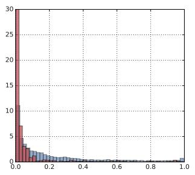

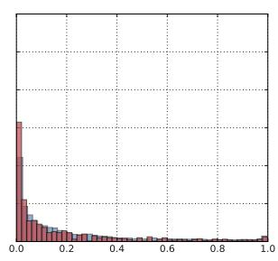

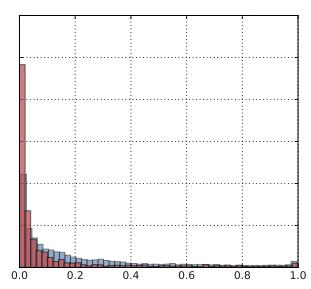

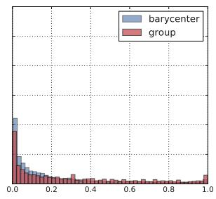

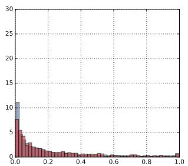

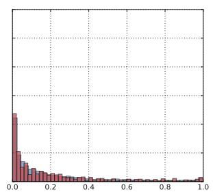

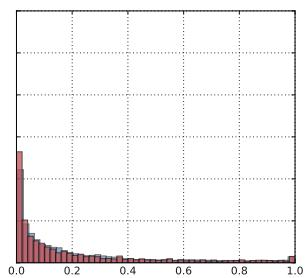

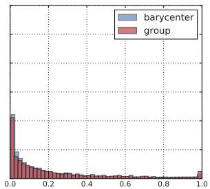

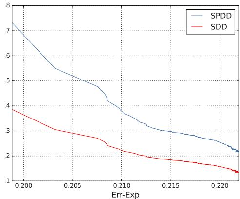  
Figure 1: Histograms of model beliefs for groups of Black females, Black males, White females, and White males, and their barycenter on the Adult dataset using Wass-1 Penalty. Top: Initial state. Bottom: After 10,000 training steps with $\alpha = 0 , \beta = 1 0 0$ each group histogram matches the barycenter.   
Figure 2: Err-Exp v.s. SDD, Err-Exp v.s. SPDD trade-off curves on Bank test set using Wass-1 Penalty DB, points plotted every 100 steps over 80,000 total training steps.

Err-Exp. Though not always the case, often as the learning model moves towards the fairness goal of SDP, model accuracy decreases (Err-Exp increases).

# 6 CONCLUSIONS

We introduced an approach to ensure that the output of a classification system does not depend on sensitive information using the Wasserstein-1 distance. We demon-

strated that using the Wasserstein-1 barycenter enables us to reach independence with minimal modifications of the model decisions. We introduced two methods with different desirable properties, a Wasserstein-1 constrained method that does not necessarily require access to sensitive information at deployment time, and an alternative fast and practical approximation method that requires knowledge of sensitive information at test time. We showed that these methods outperform previous approaches in the literature.

# Acknowledgements

The authors would like to thank Mark Rowland for useful feedback on the manuscript.

# References

A. Agarwal, A. Beygelzimer, M. Dud´ık, J. Langford, and H. Wallach. A reduction approach to fair classification. In Proceedings of the 35th International Conference on Machine Learning, 2018.   
M. Agueh and G. Carlier. Barycenters in the Wasserstein space. SIAM Journal on Mathematical Analysis, 43(2): 904–924, 2011.   
J. Benamou, G. Carlier, M. Cuturi, L. Nenna, and G. Peyre. Iterative Bregman projections for regularized ´

transportation problems. SIAM Journal on Scientific Computing, 2(37):A1111–A1138, 2015.   
A. Beutel, J. Chen, Z. Zhao, and E. H. Chi. Data decisions and theoretical implications when adversarially learning fair representations. CoRR, abs/1707.00075, 2017.   
S. Boyd and L. Vandenberghe. Convex Optimization. Cambridge University Press, 2004.   
T. Calders, F. Kamiran, and M. Pechenizkiy. Building classifiers with independency constraints. In Data mining workshops, 2009. ICDMW’09. IEEE international conference on, pages 13–18, 2009.   
F. Calmon, D. Wei, B. Vinzamuri, K. N. Ramamurthy, and K. R. Varshney. Optimized pre-processing for discrimination prevention. In Advances in Neural Information Processing Systems 30, pages 3995–4004, 2017.   
S. Chiappa. Path-specific counterfactual fairness. In Thirty-Third AAAI Conference on Artificial Intelligence, pages 7801–7808, 2019.   
S. Corbett-Davies, E. Pierson, A. Feller, S. Goel, and A. Huq. Algorithmic decision making and the cost of fairness. In Proceedings of the 23rd ACM SIGKDD International Conference on Knowledge Discovery and Data Mining, pages 797–806, 2017.   
A. Cotter, H. Jiang, and K. Sridharan. Two-player games for efficient non-convex constrained optimization. CoRR, abs/1804.06500, 2018.   
M. Cuturi. Sinkhorn distances: Lightspeed computation of optimal transport. In Advances in Neural Information Processing Systems 26, pages 2292–2300, 2013.   
J. De Fauw et al. Clinically applicable deep learning for diagnosis and referral in retinal disease. Nature Medicine, 24(9):1342–1350, 2018.   
E. Del Barrio, F. Gamboa, P. Gordaliza, and J.-M. Loubes. Obtaining fairness using optimal transport theory. In Proceedings of the 36th International Conference on Machine Learning, pages 2357–2365, 2019.   
I. Deshpande, Z. Zhang, and A. G. Schwing. Generative modeling using the sliced Wasserstein distance. In The IEEE Conference on Computer Vision and Pattern Recognition, 2018.   
W. Dieterich, C. Mendoza, and T. Brennan. Compas risk scales: Demonstrating accuracy equity and predictive parity, 2016.   
N. A. Doherty, A. V. Kartasheva, and R. D. Phillips. Information effect of entry into credit ratings market: The case of insurers’ ratings. Journal of Financial Economics, 106(2):308–330, 2012.   
M. Donini, L. Oneto, S. Ben-David, J. Shawe-Taylor, and M. Pontil. Empirical risk minimization under fairness

constraints. In Advances in Neural Information Processing Systems 31, pages 2791–2801, 2018.   
E. Eban, M. Schain, A. Mackey, A. Gordon, R. Rifkin, and G. Elidan. Scalable learning of non-decomposable objectives. In Proceedings of the 20th International Conference on Artificial Intelligence and Statistics, pages 832–840, 2017.   
H. Edwards and A. Storkey. Censoring representations with an adversary. In 4th International Conference on Learning Representations, 2016.   
V. Eubanks. Automating Inequality: How High-Tech Tools Profile, Police, and Punish the Poor. St. Martin’s Press, 2018.   
M. Feldman. Computational fairness: Preventing machine-learned discrimination. 2015.   
M. Feldman, S. A. Friedler, J. Moeller, C. Scheidegger, and S. Venkatasubramanian. Certifying and removing disparate impact. In Proceedings of the 21th ACM SIGKDD International Conference on Knowledge Discovery and Data Mining, pages 259–268, 2015.   
B. Fish, J. Kun, and A. D. Lelkes. Fair boosting: a case study. In FAT/ML Workshop, 2015.   
R. Flamary and N. Courty. POT python optimal transport library, 2017. https://github.com/ rflamary/POT.   
G. Goh, A. Cotter, M. Gupta, and M. P. Friedlander. Satisfying real-world goals with dataset constraints. In Advances in Neural Information Processing Systems 29, pages 2415–2423, 2016.   
M. Hardt, E. Price, and N. Srebro. Equality of opportunity in supervised learning. In Advances in Neural Information Processing Systems 29, pages 3315–3323, 2016.   
M. Hoffman, L. B. Kahn, and D. Li. Discretion in hiring. The Quarterly Journal of Economics, 133(2):765–800, 2018.   
J. Johndrow and K. Lum. An algorithm for removing sensitive information: Application to race-independent recidivism prediction. The Annals of Applied Statistics, 13(1):189–220, 2019.   
F. Kamiran and T. Calders. Classifying without discriminating. In Computer, Control and Communication, 2009. IC4 2009. 2nd International Conference on, pages 1–6, 2009.   
F. Kamiran and T. Calders. Data preprocessing techniques for classification without discrimination. Knowledge and Information Systems, 33(1):1–33, 2012.   
L. Kantorovich. On the transfer of masses (in Russian). Doklady Akademii Nauk, 37(2):227–229, 1942.

A. Klenke. Probability Theory: A Comprehensive Course. Springer Science & Business Media, 2013.   
J. Komiyama, A. Takeda, J. Honda, and H. Shimao. Nonconvex optimization for regression with fairness constraints. In Proceedings of the 35th International Conference on Machine Learning, pages 2742–2751, 2018.   
M. J. Kusner, J. R. Loftus, C. Russell, and R. Silva. Counterfactual fairness. In Advances in Neural Information Processing Systems 30, pages 4069–4079, 2017.   
C.-A. Laisant. Integration des fonctions inverses. ´ Nouvelles annales de mathmatiques, journal des candidats aux coles polytechnique et normale, 5 (4):253–257, 1905.   
M. Lichman. UCI Machine Learning Repository, 2013. http://archive.ics.uci.edu/ml.   
C. Louizos, K. Swersky, Y. Li, M. Welling, and R. Zemel. The variational fair autoencoder. In 4th International Conference on Learning Representations, 2016.   
M. Malekipirbazari and V. Aksakalli. Risk assessment in social lending via random forests. Expert Systems with Applications, 42(10):4621–4631, 2015.   
P. Massart. The tight constant in the Dvoretzky-Kiefer-Wolfowitz inequality. The Annals of Probability, pages 1269–1283, 1990.   
G. Monge. Memoire sur la theorie des deblais et des ´ remblais. Histoire de l’ Academie des Sciences de´ Paris, 1781.   
H. Narasimhan. Learning with complex loss functions and constraints. In Proceedings of the 21st International Conference on Artificial Intelligence and Statistics, pages 1646–1654, 2018.   
F. Pedregosa and et al. Scikit-learn: Machine learning in Python. Journal of Machine Learning Research, 12: 2825–2830, 2011.   
C. Perlich, B. Dalessandro, T. Raeder, O. Stitelman, and F. Provost. Machine learning for targeted display advertising: Transfer learning in action. Machine Learning, 95(1):103–127, 2014.   
S. Rachev and L. Ruschendorf. ¨ Mass Transportation Problems. Springer, 1998.   
J. Weed and F. Bach. Sharp asymptotic and finite-sample rates of convergence of empirical measures in Wasserstein distance. CoRR, abs/1707.00087, 2017.   
S. Wu, M. Kearns, S. Neel, and A. Roth. Preventing fairness gerrymandering: Auditing and learning for subgroup fairness. In Proceedings of the 35th International Conference on Machine Learning, pages 2564–2572, 2018.

M. B. Zafar, I. Valera, M. Gomez Rodriguez, and K. P. Gummadi. Fairness constraints: Mechanisms for fair classification. In Proceedings of the 20th International Conference on Artificial Intelligence and Statistics, pages 962–970, 2017.   
R. Zemel, Y. Wu, K. Swersky, T. Pitassi, and C. Dwork. Learning fair representations. In Proceedings of the 30th International Conference on Machine Learning, pages 325–333, 2013.   
B. Zhang, H Lemoine, and M. Mitchell. Mitigating unwanted biases with adversarial learning. In Proceedings of the 2018 AAAI/ACM Conference on AI, Ethics, and Society, pages 335–340, 2018.   
I. Zliobaite, F. Kamiran, and T. Calders. Handling condi- ˇ tional discrimination. In Proceedings of the 2011 IEEE 11th International Conference on Data Mining, pages 992–1001, 2011.

# Appendix

# A Empirical Estimates

Lemma 1. As $| \mathcal { D } | \to \infty$ , $\mathrm { \backslash } f \mathcal { W } _ { 1 } ( p _ { S } , p _ { S _ { a } } ) < \infty$ for all $\textbf { \em a }$ , the empirical barycenter satisfies $\begin{array} { r } { \operatorname* { l i m } \sum _ { a } \hat { p } _ { a } \mathcal { W } _ { 1 } ( \hat { p } _ { \bar { S } } , \hat { p } _ { S _ { a } } )  } \end{array}$ $\begin{array} { r } { \sum _ { \pmb { a } } p _ { \pmb { a } } \mathcal { W } _ { 1 } ( p _ { \bar { S } } , p _ { S _ { \pmb { a } } } ) } \end{array}$ almost surely8.

Proof. By triangle inequality:

$$
\sum_ {\boldsymbol {a}} \hat {p} _ {\boldsymbol {a}} \mathcal {W} _ {1} \left(\hat {p} _ {\bar {S}}, p _ {S _ {\boldsymbol {a}}}\right) \leq \sum_ {\boldsymbol {a}} \hat {p} _ {\boldsymbol {a}} \mathcal {W} _ {1} \left(\hat {p} _ {\bar {S}}, \hat {p} _ {S _ {\boldsymbol {a}}}\right) + \hat {p} _ {\boldsymbol {a}} \mathcal {W} _ {1} \left(p _ {S _ {\boldsymbol {a}}}, \hat {p} _ {S _ {\boldsymbol {a}}}\right), \tag {4}
$$

$$
\sum_ {\boldsymbol {a}} p _ {\boldsymbol {a}} \mathcal {W} _ {1} \left(p _ {\bar {S}}, \hat {p} _ {S _ {\boldsymbol {a}}}\right) \leq \sum_ {\boldsymbol {a}} p _ {\boldsymbol {a}} \mathcal {W} _ {1} \left(p _ {\bar {S}}, p _ {S _ {\boldsymbol {a}}}\right) + p _ {\boldsymbol {a}} \mathcal {W} _ {1} \left(p _ {S _ {\boldsymbol {a}}}, \hat {p} _ {S _ {\boldsymbol {a}}}\right). \tag {5}
$$

Since $p _ { \bar { S } }$ and $\hat { p } _ { \bar { S } }$ are the weighted barycenters of $\{ p _ { S _ { a } } \}$ and $\{ \hat { p } _ { S _ { a } } \}$ respectively:

$$
\sum_ {\boldsymbol {a}} p _ {\boldsymbol {a}} \mathcal {W} _ {1} \left(p _ {\bar {S}}, p _ {S _ {\boldsymbol {a}}}\right) \leq \sum_ {\boldsymbol {a}} p _ {\boldsymbol {a}} \mathcal {W} _ {1} \left(\hat {p} _ {\bar {S}}, p _ {S _ {\boldsymbol {a}}}\right), \tag {6}
$$

$$
\sum_ {\boldsymbol {a}} \hat {p} _ {\boldsymbol {a}} \mathcal {W} _ {1} \left(\hat {p} _ {\bar {S}}, \hat {p} _ {S _ {\boldsymbol {a}}}\right) \leq \sum_ {\boldsymbol {a}} \hat {p} _ {\boldsymbol {a}} \mathcal {W} _ {1} \left(p _ {\bar {S}}, \hat {p} _ {S _ {\boldsymbol {a}}}\right). \tag {7}
$$

Combining Eqs. (4) and (6), and (5) and (7):

$$
\begin{array}{l} \sum_ {\pmb {a}} p _ {\pmb {a}} \mathcal {W} _ {1} (p _ {\bar {S}}, p _ {S _ {\pmb {a}}}) \leq \sum_ {\pmb {a}} p _ {\pmb {a}} \mathcal {W} _ {1} (\hat {p} _ {\bar {S}}, \hat {p} _ {S _ {\pmb {a}}}) + p _ {\pmb {a}} \mathcal {W} _ {1} (p _ {S _ {\pmb {a}}}, \hat {p} _ {S _ {\pmb {a}}}) \\ \leq \sum_ {\pmb {a}} \hat {p} _ {\pmb {a}} \mathcal {W} _ {1} (\hat {p} _ {\bar {S}}, \hat {p} _ {S _ {\pmb {a}}}) + | \hat {p} _ {\pmb {a}} \mathcal {W} _ {1} (\hat {p} _ {\bar {S}}, \hat {p} _ {S _ {\pmb {a}}}) - p _ {\pmb {a}} \mathcal {W} _ {1} (\hat {p} _ {\bar {S}}, \hat {p} _ {S _ {\pmb {a}}}) | + p _ {\pmb {a}} \mathcal {W} _ {1} (p _ {S _ {\pmb {a}}}, \hat {p} _ {S _ {\pmb {a}}}) \\ \leq \sum_ {\boldsymbol {a}} \hat {p} _ {\boldsymbol {a}} \mathcal {W} _ {1} (\hat {p} _ {\bar {S}}, \hat {p} _ {S _ {\boldsymbol {a}}}) + | \hat {p} _ {\boldsymbol {a}} - p _ {\boldsymbol {a}} | \cdot | \mathcal {W} _ {1} (\hat {p} _ {\bar {S}}, \hat {p} _ {S _ {\boldsymbol {a}}}) | + p _ {\boldsymbol {a}} \mathcal {W} _ {1} (p _ {S _ {\boldsymbol {a}}}, \hat {p} _ {S _ {\boldsymbol {a}}}) \\ \end{array}
$$

$$
\begin{array}{l} \sum_ {\pmb {a}} \hat {p} _ {\pmb {a}} \mathcal {W} _ {1} (\hat {p} _ {\bar {S}}, \hat {p} _ {S _ {\pmb {a}}}) \leq \sum_ {\pmb {a}} \hat {p} _ {\pmb {a}} \mathcal {W} _ {1} (p _ {\bar {S}}, p _ {S _ {\pmb {a}}}) + \hat {p} _ {\pmb {a}} \mathcal {W} _ {1} (p _ {S _ {\pmb {a}}}, \hat {p} _ {S _ {\pmb {a}}}) \\ \leq \sum_ {\pmb {a}} p _ {\pmb {a}} \mathcal {W} _ {1} (p _ {\bar {S}}, p _ {S _ {\pmb {a}}}) + | p _ {\pmb {a}} \mathcal {W} _ {1} (p _ {\bar {S}}, p _ {S _ {\pmb {a}}}) - \hat {p} _ {\pmb {a}} \mathcal {W} _ {1} (p _ {\bar {S}}, p _ {S _ {\pmb {a}}}) | + \hat {p} _ {\pmb {a}} \mathcal {W} _ {1} (p _ {S _ {\pmb {a}}}, \hat {p} _ {S _ {\pmb {a}}}) \\ \leq \sum_ {\boldsymbol {a}} p _ {\boldsymbol {a}} \mathcal {W} _ {1} \left(p _ {\bar {S}}, p _ {S _ {\boldsymbol {a}}}\right) + \left| p _ {\boldsymbol {a}} - \hat {p} _ {\boldsymbol {a}} \right| \cdot \left| \mathcal {W} _ {1} \left(p _ {\bar {S}}, p _ {S _ {\boldsymbol {a}}}\right) \right| + \hat {p} _ {\boldsymbol {a}} \mathcal {W} _ {1} \left(p _ {S _ {\boldsymbol {a}}}, \hat {p} _ {S _ {\boldsymbol {a}}}\right). \\ \end{array}
$$

Therefore the following inequality holds almost surely:

$$
\begin{array}{l} \left| \sum_ {\boldsymbol {a}} p _ {\boldsymbol {a}} \mathcal {W} _ {1} \left(p _ {\bar {S}}, p _ {S _ {\boldsymbol {a}}}\right) - \sum_ {\boldsymbol {a}} \hat {p} _ {\boldsymbol {a}} \mathcal {W} _ {1} \left(\hat {p} _ {\bar {S}}, \hat {p} _ {S _ {\boldsymbol {a}}}\right) \right| \leq \sum_ {\boldsymbol {a}} \hat {p} _ {\boldsymbol {a}} \mathcal {W} _ {1} \left(p _ {S _ {\boldsymbol {a}}}, \hat {p} _ {S _ {\boldsymbol {a}}}\right) + | p _ {\boldsymbol {a}} - \hat {p} _ {\boldsymbol {a}} | \cdot \mathcal {W} _ {1} \left(p _ {\bar {S}}, p _ {S _ {\boldsymbol {a}}}\right) \\ \leq \sum_ {\boldsymbol {a}} \mathcal {W} _ {1} (p _ {S _ {\boldsymbol {a}}}, \hat {p} _ {S _ {\boldsymbol {a}}}) + | p _ {\boldsymbol {a}} - \hat {p} _ {\boldsymbol {a}} | \cdot \mathcal {W} _ {1} (p _ {\bar {S}}, p _ {S _ {\boldsymbol {a}}}) \\ \leq \sum_ {\boldsymbol {a}} \mathcal {W} _ {1} (p _ {S _ {\boldsymbol {a}}}, \hat {p} _ {S _ {\boldsymbol {a}}}) + | p _ {\boldsymbol {a}} - \hat {p} _ {\boldsymbol {a}} | \cdot \mathcal {W} _ {1} (p _ {S}, p _ {S _ {\boldsymbol {a}}}). \\ \end{array}
$$

Since $\mathcal { W } _ { 1 } ( p _ { S _ { a } } , \hat { p } _ { S _ { a } } )  0$ almost surely for all $^ { a }$ (see Weed and Bach (2017)), and $\hat { p } _ { a } \to p _ { a }$ almost surely (by the strong law of large numbers) and $\mathcal { W } _ { 1 } ( p _ { S } , p _ { S _ { a } } ) < \infty$ for all $^ { a }$ , the result follows:

$$
\lim  \sum_ {\boldsymbol {a}} \hat {p} _ {\boldsymbol {a}} \mathcal {W} _ {1} (\hat {p} _ {\bar {S}}, \hat {p} _ {S _ {\boldsymbol {a}}}) \rightarrow \sum_ {\boldsymbol {a}} p _ {\boldsymbol {a}} \mathcal {W} _ {1} (p _ {\bar {S}}, p _ {S _ {\boldsymbol {a}}}),
$$

almost surely.

# B Generalization

The following lemma addresses generalization of the Wasserstein-1 objective. Assume $\mathcal { W } _ { 1 } ( p _ { S _ { a } } , p _ { \bar { S } } ) \leq L$ for all $\mathbf { \pmb { a } } \in \mathcal { A }$ . Let $P _ { S } , P _ { S _ { a } }$ and $P _ { \bar { S } }$ be the cumulative density functions of $S$ , $S _ { a }$ and $\bar { S }$ . Assume these random variables all have domain $\Omega = [ 0 , 1 ]$ and that all $P \in \{ P _ { S } , P _ { \bar { S } } \} \cup \{ P _ { S _ { a } } \} _ { a \in \mathcal { A } }$ are continuous, then:

Lemma 5. For any $\epsilon , \delta > 0$ , $\begin{array} { r } { i f \operatorname* { m i n } \left[ \bar { N } , \operatorname* { m i n } _ { a } \left[ N _ { a } \right] \right] \geq \frac { 1 6 \log ( 2 | A | / \delta ) | A | ^ { 2 } \operatorname* { m a x } [ 1 , L ] ^ { 2 } } { \epsilon ^ { 2 } } } \end{array}$ , with probability $1 - \delta$

$$
\sum_ {\boldsymbol {a} \in \mathcal {A}} p _ {\boldsymbol {a}} \mathcal {W} _ {1} \left(p _ {S _ {\boldsymbol {a}}}, p _ {\bar {S}}\right) \leq \sum_ {\boldsymbol {a} \in \mathcal {A}} \hat {p} _ {\boldsymbol {a}} \mathcal {W} _ {1} \left(\hat {p} _ {S _ {\boldsymbol {a}}}, \hat {p} _ {\bar {S}}\right) + \epsilon .
$$

In other words, provided access to sufficient samples, a low value of $\begin{array} { r } { \sum _ { a } \hat { p } _ { a } \mathcal { W } _ { 1 } ( \hat { p } _ { S _ { a } } , \hat { p } _ { \bar { S } } ) } \end{array}$ implies a low value for $\begin{array} { r } { \sum _ { a } p _ { a } \mathcal { W } _ { 1 } ( p _ { S _ { a } } , p _ { \bar { S } } ) } \end{array}$ with high probability and therefore good performance at test time.

Proof. We start with the case when $p _ { \bar { S } } = p _ { S }$ . By the triangle inequality for Wasserstein-1 distances, for all $\mathbf { \pmb { a } } \in \mathcal { A }$ :

$$
\hat {p} _ {\boldsymbol {a}} \mathcal {W} _ {1} \left(p _ {S _ {\boldsymbol {a}}}, p _ {\bar {S}}\right) \leq \hat {p} _ {\boldsymbol {a}} \mathcal {W} _ {1} \left(\hat {p} _ {S _ {\boldsymbol {a}}}, \hat {p} _ {\bar {S}}\right) + \hat {p} _ {\boldsymbol {a}} \mathcal {W} _ {1} \left(\hat {p} _ {\bar {S}}, p _ {\bar {S}}\right) + \hat {p} _ {\boldsymbol {a}} \mathcal {W} _ {1} \left(\hat {p} _ {S _ {\boldsymbol {a}}}, p _ {S _ {\boldsymbol {a}}}\right). \tag {8}
$$

Let $\hat { P }$ for $P \in \{ P _ { S } , P _ { \bar { S } } \} \cup \{ P _ { S _ { a } } \} _ { a \in \mathcal { A } }$ denote the empirical CDF of $P$ . Since their domain is restricted to [0, 1] and are one dimensional random variables:

$$
\mathcal {W} _ {1} \left(\hat {p} _ {S _ {*}}, p _ {S _ {*}}\right) = \int_ {0} ^ {1} | \hat {P} (x) - P (x) | d x. \tag {9}
$$

For $S _ { * } \in \{ S , \bar { S } \} \cup \{ S _ { a } \} _ { a \in \mathcal { A } }$ . Since $P \in \{ P _ { S } , P _ { \bar { S } } \} \cup \{ P _ { S _ { a } } \} _ { a \in \mathcal { A } }$ are all continuous, the Dvorestky-Kiefer-Wolfowitz theorem (see main theorem in Massart (1990) ) and the condition mi $\begin{array} { r } { 1 \left[ \bar { N } , \operatorname* { m i n } _ { a } \left[ N _ { a } \right] \right] \geq \frac { 1 6 \log ( 2 | \mathcal { A } | / \delta ) | \mathcal { A } | ^ { 2 } \operatorname* { m a x } [ 1 , L ] ^ { 2 } } { \epsilon ^ { 2 } } } \end{array}$ implies that:

$$
\mathbb{P}\left(\sup_{x\in [0,1]}|\hat{P} (x) - P(x)|\geq \frac{\epsilon}{4}\right)\leq \frac{\delta}{2|\mathcal{A}|}.
$$

Since all the random variables have domain [0, 1] this in turn implies that for all $S _ { * } \in \{ S , \bar { S } \} \cup \{ S _ { a } \} _ { a \in \mathcal { A } }$ :

$$
\mathbb {P} \left(\mathcal {W} _ {1} (\hat {p} _ {S _ {*}}, p _ {S _ {*}}) \geq \frac {\epsilon}{4}\right) \leq \frac {\delta}{2 | \mathcal {A} |}.
$$

And therefore that with probability $\geq 1 - \frac { \delta } { 2 }$ the following inequalities hold simultaneously for all $\mathbf { \pmb { a } } \in \mathcal { A }$ :

$$
\hat {p} _ {\boldsymbol {a}} \mathcal {W} _ {1} (\hat {p} _ {\bar {S}}, p _ {\bar {S}}) \leq \frac {\hat {p} _ {\boldsymbol {a}} \epsilon}{4}, \quad \hat {p} _ {\boldsymbol {a}} \mathcal {W} _ {1} (\hat {p} _ {S _ {\boldsymbol {a}}}, p _ {S _ {\boldsymbol {a}}}) \leq \frac {\hat {p} _ {\boldsymbol {a}} \epsilon}{4}. \tag {10}
$$

Summing Eq. (8) over $\textbf { \em a }$ and applying the last observation yields

$$
\sum_ {\boldsymbol {a} \in \mathcal {A}} \hat {p} _ {\boldsymbol {a}} \mathcal {W} _ {1} \left(p _ {S _ {\boldsymbol {a}}}, p _ {\bar {S}}\right) \leq \sum_ {\boldsymbol {a} \in \mathcal {A}} \hat {p} _ {\boldsymbol {a}} \mathcal {W} _ {1} \left(\hat {p} _ {S _ {\boldsymbol {a}}}, \hat {p} _ {\bar {S}}\right) + \frac {\epsilon}{2}.
$$

Recall that we assume $\forall a \in { \mathcal { A } }$ ,

$$
\mathcal {W} _ {1} \left(p _ {S _ {a}}, p _ {\bar {S}}\right) \leq L.
$$

By concentration of measure of Bernoulli random variables, with probability $\geq 1 - \frac { \delta } { 2 }$ the following inequality holds simultaneously for all $\mathbf { \pmb { a } } \in \mathcal { A }$ :

$$
\left| p _ {\boldsymbol {a}} - \hat {p} _ {\boldsymbol {a}} \right| \leq \frac {\epsilon}{4 | \mathcal {A} | \max  [ L , 1 ]}. \tag {11}
$$

Consequently the desired result holds:

$$
\sum_ {\boldsymbol {a} \in \mathcal {A}} p _ {\boldsymbol {a}} \mathcal {W} _ {1} \left(p _ {S _ {\boldsymbol {a}}}, p _ {\bar {S}}\right) \leq \sum_ {\boldsymbol {a} \in \mathcal {A}} \hat {p} _ {\boldsymbol {a}} \mathcal {W} _ {1} \left(\hat {p} _ {S _ {\boldsymbol {a}}}, \hat {p} _ {\bar {S}}\right) + \epsilon .
$$

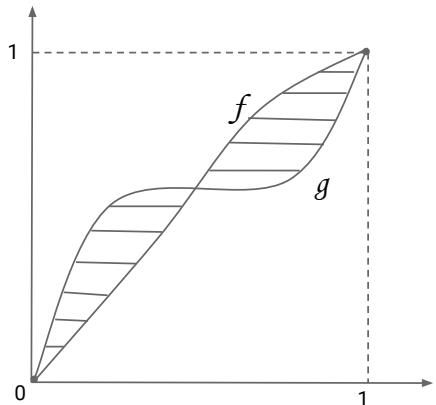  
(a) Left side of Eq. (12)

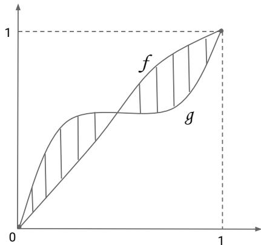  
(b) Right side of Eq. (12)   
Figure 3: Integrating $| f ^ { - 1 } - g ^ { - 1 } |$ along the $x$ axis (left) and integrating $| f - g |$ along the $y$ axis (right) both compute the area of the same shaded region, thus the equality in Eq. (12).

If $p _ { \bar { S } }$ equals the weighted barycenter of the population level distributions $\{ p _ { S _ { a } } \}$ , then

$$
\sum_ {\boldsymbol {a} \in \mathcal {A}} p _ {\boldsymbol {a}} \mathcal {W} _ {1} \left(p _ {S _ {a}}, p _ {\bar {S}}\right) \leq \sum_ {\boldsymbol {a} \in \mathcal {A}} p _ {\boldsymbol {a}} \mathcal {W} _ {1} \left(p _ {S _ {a}}, \hat {p} _ {\bar {S}}\right).
$$

Since $\hat { p } _ { \pm } \mathcal { W } _ { 1 } ( p _ { S _ { a } } , \hat { p } _ { \bar { S } } ) \leq \hat { p } _ { \pm } \mathcal { W } _ { 1 } ( \hat { p } _ { S _ { a } } , \hat { p } _ { \bar { S } } ) + \hat { p } _ { \pm } \mathcal { W } _ { 1 } ( \hat { p } _ { S _ { a } } , p _ { S _ { a } } )$ , with probability $1 - \delta$ :

$$
\begin{array}{l} \sum_ {\boldsymbol {a} \in \mathcal {A}} p _ {\boldsymbol {a}} \mathcal {W} _ {1} \left(p _ {S _ {\boldsymbol {a}}}, p _ {\bar {S}}\right) \leq \sum_ {\boldsymbol {a} \in \mathcal {A}} \hat {p} _ {\boldsymbol {a}} \mathcal {W} _ {1} \left(p _ {S _ {\boldsymbol {a}}}, p _ {\bar {S}}\right) + \frac {\epsilon}{2} \\ \leq \sum_ {\boldsymbol {a} \in \mathcal {A}} \hat {p} _ {\boldsymbol {a}} \mathcal {W} _ {1} (\hat {p} _ {S _ {\boldsymbol {a}}}, \hat {p} _ {\bar {S}}) + \hat {p} _ {\boldsymbol {a}} \mathcal {W} _ {1} (\hat {p} _ {S _ {\boldsymbol {a}}}, p _ {S _ {\boldsymbol {a}}}) + \frac {\epsilon}{2} \\ \leq \sum_ {\boldsymbol {a} \in \mathcal {A}} \hat {p} _ {\boldsymbol {a}} \mathcal {W} _ {1} \left(\hat {p} _ {S _ {\boldsymbol {a}}}, \hat {p} _ {\bar {S}}\right) + \epsilon \\ \end{array}
$$

The first inequality follows from Eq. (11), and the third one by Eq. (10). The result follows.

# C Inverse CDFs

Lemma 6. Given two differentiable and invertible cumulative distribution functions $f , g$ over the probability space $\Omega = [ 0 , 1 ]$ , thus $f , g : [ 0 , 1 ] \to [ 0 , 1 ]$ , we have

$$
\int_ {s = 0} ^ {1} | f ^ {- 1} (s) - g ^ {- 1} (s) | d s = \int_ {\tau = 0} ^ {1} | f (\tau) - g (\tau) | d \tau . \tag {12}
$$

Intuitively, we see that the left and right side of Eq. (12) correspond to two ways of computing the same shaded area in Figure 3. Here is a complete proof.

Proof. Invertible CDFs $f , g$ are strictly increasing functions due to being bijective and non-decreasing. Furthermore, we have $f ( 0 ) = 0 , f ( 1 ) = 1$ by definition of CDFs and $\Omega = [ 0 , 1 ]$ , since $P ( X \leq 0 ) = 0 , P ( X \leq 1 ) = 1$ where $X$ is the corresponding random variable. The same holds for the function $g$ . Given an interval $( x _ { 1 } , x _ { 2 } ) \subset [ 0 , 1 ]$ , let $y _ { 1 } = f ( x _ { 1 } ) , y _ { 2 } = f ( x _ { 2 } )$ . Since $f$ is differentiable, we have

$$
\int_ {x = x _ {1}} ^ {x _ {2}} f (x) d x + \int_ {y = y _ {1}} ^ {y _ {2}} f ^ {- 1} (y) d y = x _ {2} y _ {2} - x _ {1} y _ {1}. \tag {13}
$$

The proof of Eq. (13) is the following (see also Laisant (1905)).

$$
\begin{array}{l} f ^ {- 1} (f (x)) = x \\ \Longrightarrow f ^ {\prime} (x) f ^ {- 1} (f (x)) = f ^ {\prime} (x) x \quad (\text {m u l t i p l y b o t h s i d e s b y} f ^ {\prime} (x)) \\ \Rightarrow \int_ {x = x _ {1}} ^ {x _ {2}} f ^ {\prime} (x) f ^ {- 1} (f (x)) d x = \int_ {x = x _ {1}} ^ {x _ {2}} f ^ {\prime} (x) x d x \quad (\text {i n t e g r a t e b o t h s i d e s}) \\ \Rightarrow \int_ {y = y _ {1}} ^ {y _ {2}} f ^ {- 1} (y) d y = \int_ {x = x _ {1}} ^ {x _ {2}} f ^ {\prime} (x) x d x \quad \text {(a p p l y c h a n g e o f v a r i a b l e} y = f (x) \text {o n t h e l e f t s i d e)} \\ \Rightarrow \int_ {y = y _ {1}} ^ {y _ {2}} f ^ {- 1} (y) d y = x f (x) \Big | _ {x = x _ {1}} ^ {x _ {2}} - \int_ {x = x _ {1}} ^ {x _ {2}} f (x) d x \quad (\text {i n t e g r a t e b y p a r t s o n t h e r i g h t s i d e}) \\ \Rightarrow \int_ {y = y _ {1}} ^ {y _ {2}} f ^ {- 1} (y) d y + \int_ {x = x _ {1}} ^ {x _ {2}} f (x) d x = x _ {2} y _ {2} - x _ {1} y _ {1}. \\ \end{array}
$$

Define a function $h : = f - g$ on $[ 0 , 1 ]$ . Then $h$ is differentiable and thus continuous. Define the set of roots $A : = \{ x \in [ 0 , 1 ] \mid h ( x ) = 0 \}$ . Define the set of open intervals on which either $h > 0$ or $h < 0$ by $B : = \{ ( a , b ) ~ | ~ b =$ $\operatorname* { i n f } \{ s \in A \mid a < s \} , 0 \leq a < b \leq 1 , a \in A \}$ . By continuity of $h$ , for any $( a , b ) \in B$ , we have $b \in A$ , i.e. $b$ is also a root of $h$ . Since there are no other roots of $h$ in $( a , b )$ , by continuity of $h$ , we must have either $h > 0$ or $h < 0$ on $( a , b )$ . For any two elements $( a , b ) , ( c , d ) \in B$ , we argue that they must be disjoint intervals. Without loss of generality, we assume $a < c$ . Since $b = \operatorname* { i n f } \{ s \in A \mid a < s \} \leq c , i$ i.e. $b \leq c$ , then $( a , b ) \cap ( c , d ) = \emptyset$ . For any open interval $( a , b ) \in B$ , there exists a rational number $q \in \mathbb { Q }$ such that $a < q < b$ . We pick such a rational number and call it $\scriptstyle q ( a , b )$ . Since all elements of $B$ are disjoint, for any two intervals $( a _ { 0 } , b _ { 0 } ) , ( a _ { 1 } , b _ { 1 } )$ containing $q _ { ( a _ { 0 } , b _ { 0 } ) } , q _ { ( a _ { 1 } , b _ { 1 } ) } \in \mathbb { Q }$ respectively, we must have $q _ { ( a _ { 0 } , b _ { 0 } ) } \neq q _ { ( a _ { 1 } , b _ { 1 } ) }$ . We define the set $Q _ { B } : = \{ q _ { ( a , b ) } \in \mathbb { Q } \mid ( a , b ) \in B \}$ . Then $Q _ { B } \subset \mathbb { Q }$ and $\left| Q _ { B } \right| = \left| B \right|$ . Since 0 0 1 1the set of rational numbers $\mathbb { Q }$ is countable, the set $B$ must also be countable. Let $B = \{ ( a _ { i } , b _ { i } ) \} _ { i = 0 } ^ { N }$ where $N \in \mathbb N$ or $N = \infty$ . Recall that $h = f - g$ on $[ 0 , 1 ] , h ( a _ { i } ) = 0 , h ( b _ { i } ) = 0$ and either $h < 0$ or $h > 0$ on $( a _ { i } , b _ { i } )$ for $\forall i > 0$ .

Consider the interval $( a _ { i } , b _ { i } )$ for some $i > 0$ , by Eq.13 we have

$$
\begin{array}{l} \int_ {\tau = a _ {i}} ^ {b _ {i}} f (\tau) d \tau + \int_ {s = f (a _ {i})} ^ {f (b _ {i})} f ^ {- 1} (s) d s = b _ {i} f (b _ {i}) - a _ {i} f (a _ {i}) \\ = b _ {i} g \left(b _ {i}\right) - a _ {i} g \left(a _ {i}\right) = \int_ {\tau = a _ {i}} ^ {b _ {i}} g (\tau) d \tau + \int_ {s = g \left(a _ {i}\right)} ^ {g \left(b _ {i}\right)} g ^ {- 1} (s) d s. \\ \end{array}
$$

Thus

$$
\int_ {\tau = a _ {i}} ^ {b _ {i}} f (\tau) - g (\tau) d \tau = \int_ {s = f (a _ {i})} ^ {f (b _ {i})} g ^ {- 1} (s) - f ^ {- 1} (s) d s.
$$

Notice that if $f > g$ on $[ a _ { i } , b _ { i } ]$ , then $f ^ { - 1 } < g ^ { - 1 }$ on $[ f ( a _ { i } ) , f ( b _ { i } ) ]$ . This is due to the following. Given any $y \in$ $[ f ( a _ { i } ) , f ( b _ { i } ) ] = [ g ( a _ { i } ) , g ( b _ { i } ) ]$ , we have $g ^ { - 1 } ( y ) \in [ a _ { i } , b _ { i } ]$ and $f ( g ^ { - 1 } ( y ) ) > g ( g ^ { - 1 } ( y ) ) = y = f ( f ^ { - 1 } ( y ) )$ . Thus $g ^ { - 1 } > f ^ { - 1 }$ since $f$ is strictly increasing. The contrary holds by the same reasoning, i.e. if $f < g$ on $[ a _ { i } , b _ { i } ]$ , then $f ^ { - 1 } > g ^ { - 1 }$ on $[ f ( a _ { i } ) , f ( b _ { i } ) ]$ . Therefore,

$$
\int_ {\tau = a _ {i}} ^ {b _ {i}} | f (\tau) - g (\tau) | d \tau = \int_ {s = f (a _ {i})} ^ {f (b _ {i})} | g ^ {- 1} (s) - f ^ {- 1} (s) | d s,
$$

which holds for all intervals $( a _ { i } , b _ { i } )$ . Summing over $i$ on both sides, we have

$$
\sum_ {i = 0} ^ {N} \int_ {\tau = a _ {i}} ^ {b _ {i}} | f (\tau) - g (\tau) | d \tau = \sum_ {i = 0} ^ {N} \int_ {s = f (a _ {i})} ^ {f (b _ {i})} | g ^ {- 1} (s) - f ^ {- 1} (s) | d s,
$$

or equivalently,

$$
\int_ {s = 0} ^ {1} | f ^ {- 1} (s) - g ^ {- 1} (s) | d s = \int_ {\tau = 0} ^ {1} | f (\tau) - g (\tau) | d \tau .
$$

□