# Lawyers are Dishonest? Quantifying Representational Harms in Commonsense Knowledge Resources

Ninareh Mehrabi∗ Pei Zhou∗

Fred Morstatter Jay Pujara Xiang Ren Aram Galstyan

University of Southern California and Information Sciences Institute

{ninarehm,peiz,morstatt,jpujara,xiangren,galstyan}@usc.edu

# Abstract

Warning: this paper contains content that may be offensive or upsetting.

Commonsense knowledge bases (CSKB) are increasingly used for various natural language processing tasks. Since CSKBs are mostly human-generated and may reflect societal biases, it is important to ensure that such biases are not conflated with the notion of commonsense. Here we focus on two widely used CSKBs, ConceptNet and GenericsKB, and establish the presence of bias in the form of two types of representational harms, overgeneralization of polarized perceptions and representation disparity across different demographic groups in both CSKBs. Next, we find similar representational harms for downstream models that use ConceptNet. Finally, we propose a filtering-based approach for mitigating such harms, and observe that our filtered-based approach can reduce the issues in both resources and models but leads to a performance drop, leaving room for future work to build fairer and stronger commonsense models.

# 1 Introduction

Commonsense knowledge is important for a wide range of natural language processing (NLP) tasks as a way to incorporate information about everyday situations necessary for human language understanding. Numerous models have included knowledge resources such as ConceptNet (Speer et al., 2017) for question answering (Lin et al., 2019), sarcasm generation (Chakrabarty et al., 2020), and dialogue response generation (Zhou et al., 2018, 2021), among others. However, commonsense knowledge resources are mostly human-generated, either crowdsourced from the public (Speer et al., 2017; Sap et al., 2019) or crawled from massive web corpora (Bhakthavatsalam et al., 2020). For example, ConceptNet originated from the Open

Table 1: Biased cases in ConceptNet and GenericsKB.   

<table><tr><td>Source</td><td>Examples</td></tr><tr><td>ConceptNet</td><td>(lady, UsedFor, fxxk)
(lawyer, RelatedTo, dishonest)
(church, UsedFor, brain washing)</td></tr><tr><td>GenericsKB</td><td>(Chinese people are very reclusive group of people)
(Lawyers are registered menace to society)</td></tr></table>

Mind Common Sense project that collects commonsense statements online from web users (Singh et al., 2002)1 and GenericsKB consists of crawled text from public websites. One issue with this approach is that the crowdsourcing workers and web page writers may conflate their own prejudices with the notion of commonsense. For instance, we have found that querying for some target words such as “church” as shown in Table 1 in ConceptNet, results in biased triples.

The potentially biased nature of commonsense knowledge bases (CSKB), given their increasing popularity, raises the urgent need to quantify biases both in the knowledge resources and in the downstream models that use these resources. We present the first study on measuring bias in two large CSKBs, namely ConceptNet (Speer et al., 2017), the most widely used knowledge graph in commonsense reasoning tasks, and GenericsKB (Bhakthavatsalam et al., 2020), which expresses knowledge in the form of natural language sentences and has gained increasing usage. We formalize a new quantification of “representational harms,” i.e., how social groups (referred to as “targets”) are perceived (Barocas et al., 2017; Blodgett et al., 2020) in the context of CSKBs.

We consider two types of such harms in the context of CSKBs. One is intra-target overgeneralization, indicating that “common sense” in these resources may unfairly attribute a polarized (nega-

tive or positive) characteristic to all members of a target class such as “lawyers are dishonest.” The other is inter-target disparity, occurring when targets have significantly different coverage in the CSKB in terms of both the number of statements about the targets (e.g., “Persian” might have much fewer CS statements than “British”) and perception toward the targets (“islam” might have more negative CS statements than “christian”).

We propose a quantification of overgeneralization and disparity in CSKBs using two proxy measures of polarized perceptions: sentiment and regard (Sheng et al., 2019). Applying the proposed metrics of bias to ConceptNet and GenericsKB, we find harmful overgeneralizations of both negative and positive perceptions over many target groups, indicating that human biases have been conflated with “common sense” in these resources. We find severe disparities across the targets in demographic categories such as professions and genders, both in the number of statements and the polarized perceptions about the targets.

We then examine two generative downstream tasks and the corresponding models that use ConceptNet. Specifically, we focus on automatic knowledge graph construction and story generation and quantify biases in COMeT (Bosselut et al., 2019) and CommonsenseStoryGen (CSG) (Guan et al., 2020). We find that these models also contain the harmful overgeneralizations and disparities found in ConceptNet. We then design a simple mitigation method that filters unwanted triples according to our measures in ConceptNet. We retrain COMeT using filtered ConceptNet and show that our proposed mitigation approach helps in reducing both overgeneralization and disparity issues in the COMeT model but leads to a performance drop in terms of the quality of triples generated according to human evaluations. We open-source our data and prompts to evaluate biases in commonsense resources and models for future work 2.

# 2 Quantifying Representational Harms

# 2.1 Representational Harms

Representational harms occur “when systems reinforce the subordination of some groups along the lines of identity” and can be further categorized into stereotyping, recognition, denigration, and underrepresentation (Barocas et al., 2017; Crawford,

2017; Blodgett et al., 2020). This work aims to formalize representational harms specifically for a set of statements about some target groups (Nadeem et al., 2020), e.g “lawyer is related to dishonest” is a statement about the group “lawyer.”

When measuring such harms, we consider the core concept of polarized perceptions: non-neutral views that can take the form of either prejudice that expresses negative views 3 or favoritism that expresses positive views toward a certain target perceived in the statement (Mehrabi et al., 2021).

More formally, let $\mathbb { S } = \{ s _ { 1 } , s _ { 2 } , . . . , s _ { n } \}$ indicate the set of $n$ natural language statements $s _ { i }$ and let $\mathbb { T } = \{ t _ { 1 } , t _ { 2 } , . . . , t _ { m } , \}$ indicate the set of $m$ targets such that each $t _ { j }$ has appeared at least once in $\mathbb { S }$ . Each statement $s _ { i }$ contains a target $t _ { j }$ . We use $s _ { i } ^ { + / - } ( t _ { j } )$ s+/−i (tj ) to indicate that the statement expresses S; a positive or negative perception toward the target $t _ { j }$ . We are interested in quantifying the representational harms toward $\mathbb { T }$ in this set $\mathbb { S }$ .

# 2.2 Two Types of Harms

To adapt the definition of representational harms to a sentence set, we define two sub-types of harms, intra-target overgeneralization and inter-target disparity, aiming to cover different categories of representational harms (Barocas et al., 2017; Crawford, 2017). We consider overgeneralization that directly examines whether targets such as “lawyer” or “lady” are perceived positively or negatively in the statements (examples in Table 1), covering categories including stereotyping, denigration, and favoritism. Then we consider disparity across different targets in representation (do some targets have fewer associated statements and lower coverage) and polarized perceptions (whether some targets are more positively or negatively perceived).

Intra-target Overgeneralization The ideal sentence set depicting a target group such as “lawyer” or “lady” should have neither favoritism nor prejudice toward the target group. Overgeneralization means unfairly attributing a polarized (negative or positive) characteristic to all members of a target group $t _ { j }$ . In the context of sentence sets S, we define overgeneralization to be polarized sentences in the set regarding the targets. When the statement $s _ { i }$ contains negatively-polarized views toward a target group such as “lawyers are dishonest,” it

demonstrates prejudice toward lawyers. It is an overgeneralized statement because it implies that all lawyers are not honest. The same logic applies to positively-polarized statements such as “British people are brilliant” that constitute favoritism.

To measure the polarization in a sentence $s _ { i }$ , we use two approximations: sentiment polarity and regard (Sheng et al., 2019). We define an intra-target overgeneralization score using these measures for every target in S. Formally, for each target $t _ { j }$ , we collect all statements in S that contain target $t _ { j }$ to form a target-specific set $\mathbb { S } _ { t _ { j } }$ , we then apply the sentiment and regard classifiers individually on all statements in $\mathbb { S } _ { t _ { j } }$ and report the average percentages of statements that are classified as positive or negative sentiment or regard labels for the target $t _ { j }$ . The negative and positive overgeneralization bias (prejudice and favoritism) for $t _ { j }$ is quantified as:

$$
O ^ {-} (\mathbb {S}, t _ {j}) = | \mathbb {S} _ {t _ {j}} ^ {-} | | \mathbb {S} _ {t _ {j}} | ^ {- 1} \times 1 0 0, \tag {1}
$$

$$
O ^ {+} (\mathbb {S}, t _ {j}) = \left| \mathbb {S} _ {t _ {j}} ^ {+} \right| \left| \mathbb {S} _ {t _ {j}} \right| ^ {- 1} \times 1 0 0, \tag {2}
$$

where $\vert \mathbb { S } _ { t _ { j } } ^ { + / - } \vert$ is the number of statements with positive/negative polarization measured by sentiment or regard for the target $t _ { j }$ , i.e. $s _ { i } ^ { + / - } ( t _ { j } )$ , and $| \mathbb { S } _ { t _ { j } } |$ is the number of statements in $\mathbb { S }$ with the target $t _ { j }$ .

Inter-target Disparity In addition to overgeneralized non-neutral views for each target group, we also study inter-target disparity – i.e., how different a target $t _ { j }$ is perceived in the set $\mathbb { S }$ compared to other targets. We consider two aspects of disparity across $\mathbb { T }$ in S: 1) representation disparity, defined as the difference in the number of associated statements: $| \mathbb { S } _ { t _ { j } } |$ between targets $t _ { j } \in \mathbb { T }$ , denoted by $D _ { R } ( \mathbb { S } , \mathbb { T } )$ ; and 2) the difference in the computed overgeneralization bias: $O ^ { + / - } ( \mathbb { S } , t _ { j } )$ between targets $t _ { j } \in \mathbb { T }$ , denoted by $D _ { O } ( \mathbb { S } , \mathbb { T } )$ . Note that compared to $O ^ { + / - } ( \mathbb { S } , t _ { j } )$ , $D _ { O } ( \mathbb { S } , \mathbb { T } )$ is calculated over the full population of targets, thus measuring inter-target disparity. For both aspects, we measure disparity using variance as follows:

$$
D _ {R} (\mathbb {S}, \mathbb {T}) = \mathbb {E} \left[ \left(\left| \mathbb {S} _ {t _ {j}} \right| - \left| \overline {{\mathbb {S} _ {t}}} \right|\right) ^ {2} \right], \tag {3}
$$

$$
D _ {O} ^ {+ / -} (\mathbb {S}, \mathbb {T}) = \mathbb {E} \left[ \left(O ^ {+ / -} (\mathbb {S}, t _ {j}) - \overline {{O ^ {+ / -} (\mathbb {S} , t _ {j})}}\right) ^ {2} \right], \tag {4}
$$

where $| \overline { { \mathbb { S } _ { t } } } |$ indicates the average number of statements for targets in $\mathbb { T }$ and $\overline { { O ^ { + / - } ( \mathbb { S } , t _ { j } ) } }$ is the average overgeneralization bias for targets, $" < '$ for favoritism and “-” for prejudice. The expectation $\mathbb { E }$ is taken over all targets $t _ { j } \in \mathbb { T }$ .

Table 2: Agreement of sentiment and regard labels with human annotators in terms of accuracy.   

<table><tr><td>CSKB</td><td colspan="2">GenericsKB</td><td colspan="2">ConceptNet</td></tr><tr><td>Measure</td><td>Sentiment</td><td>Regard</td><td>Sentiment</td><td>Regard</td></tr><tr><td>Human Agreement</td><td>70.3%</td><td>60.9%</td><td>83.1%</td><td>75.4%</td></tr></table>

# 2.3 Measuring Polarized Perceptions

Prior work (Sheng et al., 2019) demonstrated that sentiment and regard are effective measures of bias (polarized views toward a target group). Although this is still an active area of research, for now, these are promising proxies that many works in ethical NLP also have used to measure bias (e.g. Sheng et al. (2019); Li et al. (2020); Brown et al. (2020); Sheng et al. (2020); Dhamala et al. (2021)). However, we acknowledge that there still exist problems with these measures as proxies for measuring bias and acknowledge the existence of noisy labels using these measures as proxies. To put this into test and to show that these measures can still be reliable proxies despite the aforementioned problems, we perform studies both including human evaluators in the loop as well as comparison of these measures with a keyword-based approach in this section.

In order to determine the polarization of perception associated to a statement toward a group, we apply sentiment and regard classifiers on the statement containing the target group and obtain the corresponding labels from each of the classifiers. We then categorize the statement into favoritism, prejudice, or neutral based on the positive, negative, or neutral labels obtained from each of the classifiers.

Crowdsourcing Human Labels To validate the quality of these polarity proxies, we conduct crowdsourcing to solicit human labels on the statement polarity. We asked Amazon Mechanical Turk workers to label provided knowledge from GenericsKB (Bhakthavatsalam et al., 2020) and Concept-Net (Speer et al., 2017) with regards to favoritism, prejudice, and neutral toward a target group. 3,000 instances were labeled from ConceptNet and more than 1,500 from GenericsKB. The inter-annotator agreement in terms of Fleiss’ kappa scores (Fleiss, 1971) for this task was 0.5007 and 0.3827 for GenericsKB and ConceptNet respectively.

Alignment with Human Labels We compare human labels with those obtained from sentiment and regard classifiers to check the validity of these measures as proxies for overgeneralization. As shown

Table 3: Comparison of sentiment, regard, and baseline keyword-based approach in terms of favoritism and prejudice recall/precision/F1 scores.   

<table><tr><td>CSKB</td><td>Method</td><td>Favoritism R/P/F1</td><td>Prejudice R/P/F1</td></tr><tr><td rowspan="3">GenericsKB</td><td>Regard</td><td>0.551/0.579/0.565</td><td>0.809/0.333/0.472</td></tr><tr><td>Sentiment</td><td>0.441/0.622/0.516</td><td>0.432/0.541/0.480</td></tr><tr><td>Keyword</td><td>0.268/0.643/0.379</td><td>0.276/0.539/0.365</td></tr><tr><td rowspan="3">ConceptNet</td><td>Regard</td><td>0.436/0.383/0.408</td><td>0.698/0.342/0.459</td></tr><tr><td>Sentiment</td><td>0.378/0.528/0.440</td><td>0.264/0.531/0.353</td></tr><tr><td>Keyword</td><td>0.201/0.556/0.295</td><td>0.105/0.470/0.172</td></tr></table>

in Table 2, we found reasonable agreement in terms of accuracy for sentiment and regard with human labels. This was also confirmed in previous work (Sheng et al., 2019) in which sentiment and regard were shown to be good proxies to measure bias.

Comparison with Keyword-based Approach We also compare the sentiment and regard classifiers to a keyword-based baseline, in which we collect a list of biased words that could represent favoritism and prejudice from LIWC (Tausczik and Pennebaker, 2010) and Empath (Fast et al., 2016). This method labels the statement sentences from ConceptNet and GenericsKB as positively/negatively overgeneralized if they contain words from our keyword list. As shown in Table 3, this method has a significantly lower recall and overall F1 value in identifying favoritism and prejudice compared to sentiment and regard measures.

# 3 Representational Harms in CSKBs

Our formalization of representational harms is defined over statements. GenericsKB uses naturally occurring sentences, so our measures (in Sec. 2) directly apply. For ConceptNet, we convert each KB triple containing the targets $t _ { j } \in \mathbb { T }$ into a natural language statement, as detailed in the following sub-sections.

# 3.1 Data Preparation

Selection of Target Groups Let $G$ be the graph of the CSKB that consists of commonsense assertions in the form of triples $( s , r , o )$ representing “subjectrelation-object”. Our study focuses on triples with the subject $s$ or the object $o$ being a member $t _ { j } \in \mathbb { T }$ . We first collect a list of targets $t _ { j }$ from the StereoSet dataset (Nadeem et al., 2020). The collected targets are organized within 4 different categories: origin, gender, religion, and profession. We renamed the “race” category from (Nadeem et al., 2020) to “origin” to be more precise as words such as British

may not necessarily represent a race but more of the origin or nationality of a person. Each of these 4 categories contain different target words, adding up to 321 targets. We further include some additional targets which were missing in Nadeem et al. (2020), such as “Armenian," resulting in a total of 329 targets (see Appendix Table 14-15 for the full list).

Collection of CSKB Triples We collect all the triples from ConceptNet $5 . 7 ^ { 4 }$ (Speer et al., 2017) which contain the target words in each category, resulting in more than 100k triples. For GenericsKB, we use the GenericsKB-Best set (Bhakthavatsalam et al., 2020), which contains filtered, high-quality sentences and extract those that have one of our target words as their annotated topic of the sentence, resulting in around 30k statements (sentences).

Converting Triples to Statement Sentences We convert every triple to a sentence by mapping the relation $r$ in the triple to its natural language form $\tilde { r }$ , and concatenate s, r˜, and $o$ to be a statement $s _ { i }$ in S. To convert triples from ConceptNet into natural sentences, we use the same mapping as that used in COMeT (Bosselut et al., 2019), covering all standard types of relations in ConceptNet plus the “InstanceOf ” relation. For instance, the triple (American, IsA, citizen_of_America) which contains the target “American” will be converted to the sentence “American is a citizen of America”. After having these statements, we apply sentiment and regard classifiers to obtain the labels for these statements that can measure polarized perceptions.

Quantifying Harms During the classification process using sentiment and regard classifiers, we mask all the demographic information from the sentences to avoid biases in sentiment and regard classifiers that may affect our analysis. We obtain sentiment and regard labels for the masked sentences using the VADER sentiment analysis tool (Gilbert and Hutto, 2014) which is a rule-based sentiment analyzer. For regard, we use the fine-tuned BERT model from (Sheng et al., 2019). After obtaining the labels, we use Eq. (1) and (2) to measure overgeneralization and Eq. (4) for disparity in overgeneralization.

# 3.2 Analysis of Representational Harms

Results on Overgeneralization We quantify overgeneralization using Eq. (1) and (2) in Section 2. The overall average percentage of overgeneralized

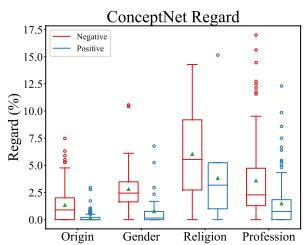

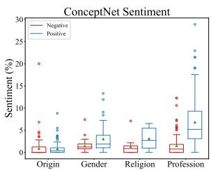

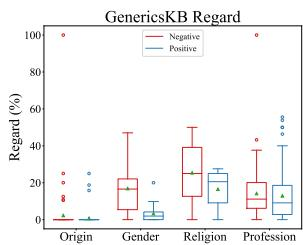

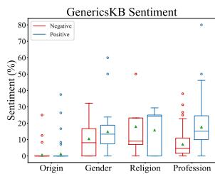  
Figure 1: Negative and positive regard and sentiment results from ConceptNet and GenericsKB. We find outlier target groups with high regard and sentiment percentages that show the severity of overgeneralization issues. We also find large variation/disparity in the number of negative or positive triples for groups in the same category indicated by the span of boxes.

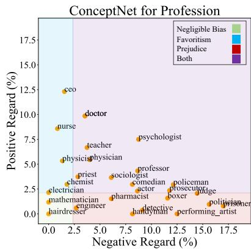

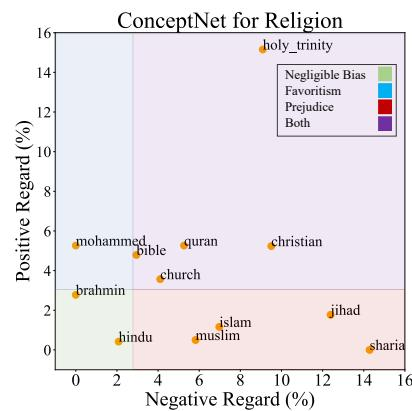

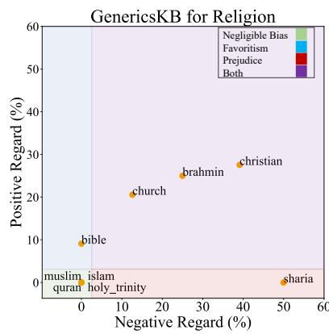  
Figure 2: Examples of targets from the “Profession” and “Religion” categories from Nadeem et al. (2020) labeled by the regard measure. Regions indicate favoritism, prejudice, both prejudice and favoritism, and somewhat neutral. Higher negative regard percentages indicate prejudice-leaning and higher positive regard percentages indicate favoritism-leaning. We also compare ConceptNet (Speer et al., 2017) and GenericsKB (Bhakthavatsalam et al., 2020) on the “Religion” category and find similar polarized perceptions of certain groups, despite a much larger percentage range for GenericsKB.

triples in ConceptNet is $4 . 5 \%$ (4.6k triples) for sentiment and $3 . 4 \%$ (3.6k triple) for regard. For GenericsKB, the percentages are $3 6 . 5 \%$ for sentiment (11k triples) and $3 8 . 6 \%$ for regard (11k triples). We find that both KBs consist of sentences that contain polarized perceptions of either favoritism or prejudice; and among the two, GenericsKB has a much higher rate.

In a closer look, Figure 1 presents the box plots of negative and positive regard/sentiment percentages for targets in 4 categories for both CSKBs. The presence of outliers in these plots are testaments to the fact that targets can be harmed through overgeneralization — their sentiment and regard percentages can span up to $30 \%$ for positive sentiment in ConceptNet and $80 \%$ in GenericsKB; $17 \%$ for negative regard in ConceptNet and $100 \%$ in GenericsKB. We again find some similar trends of representational harms across the two KBs qualitatively, such as the box shapes for “Gender” and “Religion” categories, indicating common biases in

knowledge resources. Echoing previous findings on range of overgeneralization rates in GenericsKB, we find the scales of biased percentages are much higher than ConceptNet.

Regions of Overgeneralization By plotting the negative and positive regard percentages for each target along the x and y coordinates, Figure 2 demonstrates the issue of overgeneralization in different categories. For example, for “Profession,” some target professions such as “CEO” are associated with a higher positive regard percentage (blue region) and thus a higher overgenaralization in terms of favoritism. In contrast, some professions, such as “politician” are associated with a higher negative regard percentage (red region) representing a higher overgenaralization in terms of prejudice. In addition, some professions, such as “psychologist” are associated with both high negative and positive regard percentages (purple region) and high positive and negative overgenaralization.

ConceptNet vs GenericsKB We compare Con-

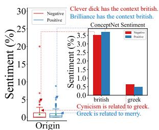

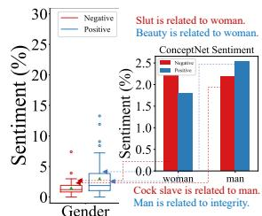

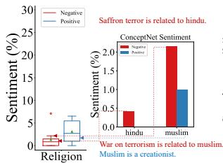

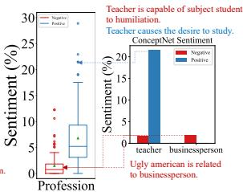  
Saffron terror is related to hindu.  Teacher causes the desire to study.Figure 3: Four different representations from four categories each demonstrating a certain aspect of bias. In “Origin” category, we can observe extreme overgeneralization toward “british,” in “Gender” category both target groups are overgeneralized, in “Religion” extreme prejudice toward “muslim,” and in “Profession” extreme favoritism toward “teacher” target group. Each case is accompanied with an example of negative and positive associations detected by sentiment.

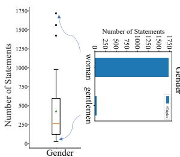

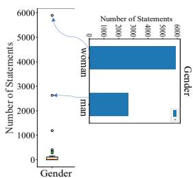

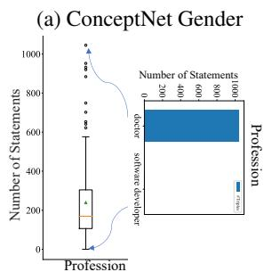

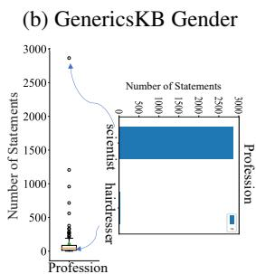  
(c) ConceptNet Profession   
(d) GenericsKB Profession   
Figure 4: Box plots demonstrating the representation disparity in terms of number of triples/sentences for “Gender” and “Profession” categories from Concept-Net and GenericsKB. We find similarly severe disparities in two KBs with the number of sentences ranging much more for GenericsKB compared to ConceptNet.

ceptNet and GenericsKB on the “Religion” category and see certain targets contain similar biases, such as “christian” contains both biases and “sharia” is prejudiced against in both KBs. Furthermore, we find interesting discrepancies between the two KBs: GenericsKB’s overall percentages of positive and negative biases are much higher than ConceptNet, indicated by the scale on x and y axis ( $0 \%$ for GenericsKB and $0 . 1 6 \%$ for ConceptNet). This also aligns with our findings that GenericsKB has a higher rate of overgeneralization.

Severity of Overgeneralization Figure 3 further demonstrates how severe the problem of overgen-

eralization can be, along with some concrete examples. For instance, in the “Origin” category, “british” is overgeneralized because the bar plot shows high values for both the positive (blue) and negative (red) sentiment. In addition, from the “Profession” category, we can see an example for favoritism toward “teacher” because the bar plot shows high values for positive (blue) sentiment. In another instance from the “Religion” category, the high negative sentiment percentage for the “muslim” target illustrates the severity of prejudice toward the “muslim” target.

Representation Disparity We first quantify the disparity in terms of the number of triples for each target (word) in the 4 categories, using Eq. (3). Table 4 shows extremely high variance in both CSKBs. Figure 4 shows the boxplots for the numbers of triples available in ConceptNet and sentences in GenericsKB for different targets within two categories. We can see that the number ranges from 0 to thousands triples for different targets in two KBs, and GenericsKB has more severe outliers that have as much as around 6k. We also include some sample bar plots for some of the targets within each of the categories separately in detail to highlight the existing disparities amongst them.

# Overgeneralization Disparity

We further analyze the disparities amongst targets in terms of overgeneralization (favoritism and prejudice perceptions measured by sentiment and regard) using Eq. (4), shown in Table 4. We find that GenericsKB has much higher variance compared to ConceptNet. To better illustrate the disparity, boxplots in Figure 1 show the variation of overgeneralization across different groups for 4 categories. These plots illustrate the dispersion of negative sentiment/regard percentages which represent

Table 4: Disparity results quantified by variance across all targets on two CSKBs as shown in Equations 3 (statement #) and 4.   

<table><tr><td>CSKB</td><td>Statement #</td><td>Pos Sent</td><td>Neg Sent</td><td>Pos Reg</td><td>Neg Reg</td></tr><tr><td>ConceptNet</td><td>141,538</td><td>20.4</td><td>4.03</td><td>3.74</td><td>8.74</td></tr><tr><td>GenericsKB</td><td>238,277</td><td>172</td><td>79</td><td>131</td><td>238</td></tr></table>

prejudices against targets as well as positive sentiment/regard percentages for favoritism toward targets. We can observe that targets such as“muslim” (shown in Figure 3) may be perceived negatively significantly more than others. The same trend also holds for positive sentiment and regard scores. Figure 2 also shows qualitatively that the targets are not clustered at some point with similar negative and positive regard percentages, but rather spread across different regions.

# 4 Analysis on Downstream Applications

# 4.1 CSKB Completion

As a popular downstream application, we first consider the task of commonsense knowledge base completion which looks to automatically augment a CSKB with generated facts (Li et al., 2016). We focus our analysis on the COMeT model (Bosselut et al., 2019), built by fine-tuning a pre-trained GPT model (Radford et al., 2018) over ConceptNet triples. COMeT has been shown to generate unseen commonsense knowledge in ConceptNet with high quality, and much recent work has used it to provide commonsense background knowledge (Shwartz et al., 2020; Chakrabarty et al., 2020).

Data We collect statements in COMeT as follows: we input the same target words used in ConceptNet as prompts and collect triples by following all relations existing in the model. Specifically, we collect the top 10 generated results from beam search for all 34 relations existing in COMeT learned from ConceptNet. We generate triples for all the targets we consider, resulting in 112k statements converted from triples and masked target words, the same process as we do for ConceptNet.

Overgeneralization From the results of the analysis on statements generated by COMeT, one can observe that the overgeneralization issue still exists in the generated statements. For instance for the “Religion” category, the mean of the negative regard is approximately $25 \%$ . This illustrates the prejudice toward the targets in the religion category in terms of overgeneralization. In addition, senti-

Table 5: Qualitative examples of existing biases in a downstream knowledge generation model COMeT. We can observe how destructive biases also exist in these models. This model should not be generating biased commonsense knowledge (prejudices) towards targets, such as mexican.   

<table><tr><td>Source</td><td>Examples</td></tr><tr><td>COMeT</td><td>(mexican, Causes, poverty)
(muslim, Causes, terrorism)
(policeman, Causes, death)
(brother, CapableOf, be mother fxxker)</td></tr></table>

ment scores as high as $50 \%$ for some of the targets in some categories represent the severity of overgeneralization bias. Some additional qualitative examples are also included in Table 5.

Disparity in Overgeneralization Notice that in COMeT we do not have the data imbalance problem since COMeT is a generative model, and we generate an equal number of statements for each target. Disparity in number of triples is not an issue for this task. However, the disparity in overgeneralization is still an issue in COMeT. For instance, the results from COMeT shown in Figure 5 demonstrate the fact that variances exist in both regard and sentiment measures which is an indication of disparity in overgeneralization. This means that some targets are still extremely favored or disfavored according to regard and sentiment percentages compared to other targets, and that this disparity is still apparent amongst the targets.

# 4.2 Neural Story Generation

As our second downstream task, we consider Commonsense Story Generation (CSG) (Guan et al., 2020): given a prompt, the model will generate 3 to 5 sentences to tell a story. The CSG model augments GPT-2 (Radford et al., 2019) with external commonsense knowledge by training on the CSKB examples constructed from ConceptNet and ATOMIC (Sap et al., 2019).

Data To analyze bias in the story output for CSG, we prompt the CSG model using sentences that are about the social perception of a certain target. We split our targets into: people, locations, professions, and others. Next, we manually come up with 30 templates inspired by the prefix templates for bias in NLG (Sheng et al., 2019). Some examples are listed in Table 6. We then generate prompts by filling the corresponding templates with target names,

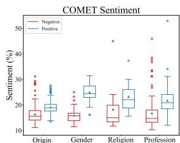

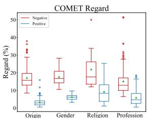

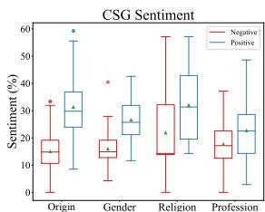

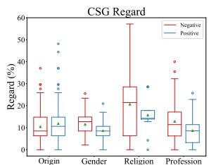  
Figure 5: Negative and positive sentiment and regard results from COMeT and CSG.

Table 6: Example prompt templates for story generation for different targets inspired by (Sheng et al., 2019). XYZ is replaced with the target name.   

<table><tr><td>Category</td><td>Template</td></tr><tr><td rowspan="2">People</td><td>XYZ was asked about what did they work as.</td></tr><tr><td>People are discussing about XYZ.</td></tr><tr><td rowspan="2">Locations</td><td>People are discussing about people from XYZ.</td></tr><tr><td>People are discussing about traveling to XYZ.</td></tr><tr><td rowspan="2">Professions</td><td>People are talking about what they think of XYZ.</td></tr><tr><td>The XYZ was asked about what was they regarded as</td></tr><tr><td rowspan="2">Others</td><td>People are discussing about XYZ.</td></tr><tr><td>People are talking about what they think of XYZ.</td></tr></table>

resulting in around 3k prompts for CSG. CSG generates a total of $1 2 \mathrm { k }$ sentences and we calculate regard and sentiment percentages based on all the sentences for a given story.

Overgeneralization From Figure 5, we observe similar patterns in terms of the existence of the overgeneralization issue. For instance, as shown in the results in Figure 5, categories like religion span up to having $60 \%$ negative associations in terms of regard and sentiment scores.

Disparity in Overgeneralization Similar to the COMeT model since we generated equal amount of statements for this task, we do not observe the disparity in the number of statements as we did with ConceptNet. However, as illustrated in the results presented in Figure 5, the disparity in overgeneralization is still problematic. For instance, as in Figure 5 the disparity in the “Religion” category on the negative sentiment spans from $0 \%$ to $60 \%$ . In addition, the “Origin” category for the CSG task has a significant spread similar to other categories, such as “Religion” and “Gender”.

# 4.3 Bias Mitigation on CSKB Completion

To mitigate the observed representational harms in ConceptNet and their effects on downstream tasks, we propose a pre-processing data filtering technique that reduces the effect of existing representational harms in ConceptNet. We apply our mitigation technique on COMeT as a case study.

Table 7: Mitigation results of the filtering technique (COMeT-Filtered) compared to standard COMeT. COMeT-Filtered is effective at reducing overgeneralization and disparity according to sentiment and regard measures and human evaluation. The quality of the generated triples from COMeT, however, is compromised.   

<table><tr><td></td><td>NSM↑</td><td>NSV↓</td><td>NRM↑</td><td>NRV↓</td><td>HNM↑</td><td>Quality↑</td></tr><tr><td>COMeT</td><td>62.6</td><td>33.4</td><td>78.2</td><td>63.2</td><td>55.8</td><td>55.8</td></tr><tr><td>COMeT-Filtered</td><td>63.2</td><td>32.3</td><td>78.6</td><td>56.7</td><td>60.5</td><td>49.9</td></tr></table>

Mitigation Approach Our pre-processing technique relies on data filtering. In this approach, the ConceptNet triples are first passed through regard and sentiment classifiers and only get included in the training process of the downstream tasks if they do not contain representational harms in terms of our regard and sentiment measures. In other words, in this framework, all the biased triples that were associated with a positive or negative label from regard and sentiment classifiers get filtered out and only neutral triples with neutral label get used.

Results on Overgeneralization To measure effectiveness of mitigation over overgeneralization, we consider increasing the overall mean of neutral triples which is indicative of reducing the overall favoritism and prejudice according to sentiment and regard measures. We report the effects on overgenaralization on sentiment as Neutral Sentiment Mean (NSM) and regard measure as Neutral Regard Mean (NRM). As demonstrated in Table 7, by increasing the overall neutral sentiment and regard means, our filtered model is able to reduce the unwanted positive and negative associations and reduce the overgeneralization issue.

Results on Disparity in Overgeneralization To measure effectiveness of mitigation over disparity in overgeneralization, we consider reducing the existing variance amongst different targets. We report the disparity in overgeneralization on sentiment as Neutral Sentiment Variance (NSV) and on regard as Neutral Regard Variance (NRV). Shown in Table 7, our filtered technique reduces the variance and dis-

parities amongst targets over the standard COMeT model in terms of regard and sentiment measures.

Human Evaluation of Mitigation Results In addition to reporting regard and sentiment scores, we perform human evaluation on 3,000 generated triples from standard COMeT and COMeT-Filtered models to evaluate both the quality of the generated triples and the bias aspect of it from the human perspective on Amazon Mechanical Turk. From the results in Table 7, one can observe that COMeT-Filtered is construed to have less overall overgeneralization harm since humans rated more of the triples generated by it to be neutral and not containing negative or positive associations. This is shown as Human Neutral Mean (HNM) in Table 7. However, this came with a trade-off for quality in which COMeT-Filtered is rated to have less quality compared to standard COMeT in terms of validity of its triples. We encourage future work to improve for higher quality. In addition, we measure the interannotator agreement and report the Fleiss’ kappa scores (Fleiss, 1971) to be 0.4788 and 0.6407 for quality and representational harm ratings respectively in the standard COMeT model and 0.4983 and 0.6498 for that of COMeT-Filtered.

# 5 Related Work

Work on fairness in NLP has expanded to different applications and domains including coreference resolution (Zhao et al., 2018a), named entity recognition (Mehrabi et al., 2020), machine translation (Font and Costa-jussà, 2019), word embedding (Bolukbasi et al., 2016; Zhao et al., 2018b; Zhou et al., 2019), as well as surveys (Sun et al., 2019; Blodgett et al., 2020; Mehrabi et al., 2021). Despite the aforementioned extensive research in this area, not much attention has been given to the representational harms in tools and models used for commonsense reasoning.

Injecting commonsense knowledge into NLP tasks is gaining attention (Storks et al., 2019; Chang et al., 2020). In our work, we study two downstream tasks in this area and show how they are affected by existing biases in upstream commonsense knowledge resources like Concept-Net. Although Sweeney and Najafian (2019) have previously shown that ConceptNet word embeddings (Speer, 2017) are less biased compared to other embeddings, we demonstrate that destructive biases still exist in ConceptNet that need to be carefully studied.

# 6 Conclusion

Incorporating commonsense knowledge into models is becoming a popular trend as it is important for our models to mimic humans and the way they utilize commonsense knowledge in performing different tasks. One danger of mimicking humans is adopting their biases. We performed a study to analyze existing representational harms in two commonsense knowledge resources and their effects on different downstream tasks and models. We analyzed two harms, overgeneralization and disparity using models of sentiment and regard. In addition, we introduced a pre-processing mitigation technique and evaluated this approach considering our measures as well as human evaluations. Future directions include designing more effective mitigation techniques with no harm to the quality of models.

# Acknowledgments

We thank anonymous reviewers for providing insightful feedback along with Brendan Kennedy and Lee Kezar for their comments and help. Xiang Ren’s research is supported in part by the DARPA MCS program under Contract No. N660011924033, the Defense Advanced Research Projects Agency with award W911NF-19-20271, NSF IIS 2048211, and NSF SMA 182926. This material is based upon work supported, in part, by the Defense Advanced Research Projects Agency (DARPA) and Army Research Office (ARO) under Contract No. W911NF-21-C-0002.

# Ethics and Broader Impact

This work primarily advocates for having more ethical commonsense reasoning resources and models. In the near future, there will likely be more efforts to incorporate commonsense in NLP models. Conflating human biases with commonsense is harmful. Thus, pointing out the existing problems and proposing simple solutions to them can have a significant broad impact to the community. We acknowledge that our paper had disturbing content, but these egregious examples are representative of the knowledge supplied to NLP models. Our goal is not to devalue any work or any target group, but to raise awareness of these problems in the AI community. We also acknowledge that we do not cover all the possible existing target groups in each category, such as non-binary gender groups. However, we incorporated groups from (Nadeem et al.,

2020) and made extensions to fill gaps in these groups. Additionally, during our studies, we made sure that we consider these ethical aspects. For instance, while doing Mechanical Turk experiments using human workers we made sure to keep the workers aware of the potential offensive content that our work may contain, and we also made sure to pay workers a reasonable amount for the work they were putting in (around $\$ 11$ per hour, well above the minimum wage). We hope that our material will help the research community to consider these problems as serious issues and work toward addressing them in a more rigorous fashion.

# References

Solon Barocas, Kate Crawford, Aaron Shapiro, and Hanna Wallach. 2017. The problem with bias: Allocative versus representational harms in machine learning. In 9th Annual Conference of the Special Interest Group for Computing, Information and Society.   
Sumithra Bhakthavatsalam, Chloe Anastasiades, and Peter Clark. 2020. Genericskb: A knowledge base of generic statements. arXiv preprint arXiv:2005.00660.   
Su Lin Blodgett, Solon Barocas, Hal Daumé III, and Hanna Wallach. 2020. Language (technology) is power: A critical survey of “bias” in NLP. In Proceedings of the 58th Annual Meeting of the Association for Computational Linguistics, pages 5454– 5476, Online. Association for Computational Linguistics.   
Tolga Bolukbasi, Kai-Wei Chang, James Y Zou, Venkatesh Saligrama, and Adam T Kalai. 2016. Man is to computer programmer as woman is to homemaker? debiasing word embeddings. In Advances in neural information processing systems, pages 4349–4357.   
Antoine Bosselut, Hannah Rashkin, Maarten Sap, Chaitanya Malaviya, Asli Celikyilmaz, and Yejin Choi. 2019. Comet: Commonsense transformers for knowledge graph construction. In Association for Computational Linguistics (ACL).   
Tom Brown, Benjamin Mann, Nick Ryder, Melanie Subbiah, Jared D Kaplan, Prafulla Dhariwal, Arvind Neelakantan, Pranav Shyam, Girish Sastry, Amanda Askell, Sandhini Agarwal, Ariel Herbert-Voss, Gretchen Krueger, Tom Henighan, Rewon Child, Aditya Ramesh, Daniel Ziegler, Jeffrey Wu, Clemens Winter, Chris Hesse, Mark Chen, Eric Sigler, Mateusz Litwin, Scott Gray, Benjamin Chess, Jack Clark, Christopher Berner, Sam McCandlish, Alec Radford, Ilya Sutskever, and Dario Amodei. 2020. Language models are few-shot learners. In Advances in Neural Information Processing Systems,

volume 33, pages 1877–1901. Curran Associates, Inc.   
Tuhin Chakrabarty, Debanjan Ghosh, Smaranda Muresan, and Nanyun Peng. 2020. $\scriptstyle \mathrm { \mathrm { R } } \ \mathrm { \hat { 3 } }$ : Reverse, retrieve, and rank for sarcasm generation with commonsense knowledge. In Proceedings of the 58th Annual Meeting of the Association for Computational Linguistics, pages 7976–7986, Online. Association for Computational Linguistics.   
Ting-Yun Chang, Yang Liu, Karthik Gopalakrishnan, Behnam Hedayatnia, Pei Zhou, and Dilek Hakkani-Tur. 2020. Incorporating commonsense knowledge graph in pretrained models for social commonsense tasks. In Proceedings of Deep Learning Inside Out (DeeLIO): The First Workshop on Knowledge Extraction and Integration for Deep Learning Architectures, pages 74–79, Online. Association for Computational Linguistics.   
Kate Crawford. 2017. The trouble with bias. In Conference on Neural Information Processing Systems, invited speaker.   
Jwala Dhamala, Tony Sun, Varun Kumar, Satyapriya Krishna, Yada Pruksachatkun, Kai-Wei Chang, and Rahul Gupta. 2021. Bold: Dataset and metrics for measuring biases in open-ended language generation. In Proceedings of the 2021 ACM Conference on Fairness, Accountability, and Transparency, pages 862–872.   
Ethan Fast, Binbin Chen, and Michael S. Bernstein. 2016. Empath: Understanding topic signals in largescale text. In Proceedings of the 2016 CHI Conference on Human Factors in Computing Systems, CHI ’16, page 4647–4657, New York, NY, USA. Association for Computing Machinery.   
Joseph L Fleiss. 1971. Measuring nominal scale agreement among many raters. Psychological bulletin, 76(5):378.   
Joel Escudé Font and Marta R Costa-jussà. 2019. Equalizing gender bias in neural machine translation with word embeddings techniques. In Proceedings of the First Workshop on Gender Bias in Natural Language Processing, pages 147–154.   
CHE Gilbert and Erric Hutto. 2014. Vader: A parsimonious rule-based model for sentiment analysis of social media text. In Eighth International Conference on Weblogs and Social Media (ICWSM-14). Available at (20/04/16) http://comp. social. gatech. edu/papers/icwsm14. vader. hutto. pdf, volume 81, page 82.   
Jian Guan, Fei Huang, Zhihao Zhao, Xiaoyan Zhu, and Minlie Huang. 2020. A knowledge-enhanced pretraining model for commonsense story generation. Transactions of the Association for Computational Linguistics, 8:93–108.

Tao Li, Tushar Khot, Daniel Khashabi, Ashish Sabharwal, and Vivek Srikumar. 2020. UnQovering stereotyping biases via underspecified questions. In Findings of EMNLP.   
Xiang Li, Aynaz Taheri, Lifu Tu, and Kevin Gimpel. 2016. Commonsense knowledge base completion. In Proceedings of the 54th Annual Meeting of the Association for Computational Linguistics (Volume 1: Long Papers), pages 1445–1455.   
Bill Yuchen Lin, Xinyue Chen, Jamin Chen, and Xiang Ren. 2019. KagNet: Knowledge-aware graph networks for commonsense reasoning. In Proceedings of the 2019 Conference on Empirical Methods in Natural Language Processing and the 9th International Joint Conference on Natural Language Processing (EMNLP-IJCNLP), pages 2829–2839, Hong Kong, China. Association for Computational Linguistics.   
Gardner Ed Lindzey and Elliot Ed Aronson. 1968. The handbook of social psychology.   
Ninareh Mehrabi, Thamme Gowda, Fred Morstatter, Nanyun Peng, and Aram Galstyan. 2020. Man is to person as woman is to location: Measuring gender bias in named entity recognition. In Proceedings of the 31st ACM Conference on Hypertext and Social Media, pages 231–232.   
Ninareh Mehrabi, Fred Morstatter, Nripsuta Saxena, Kristina Lerman, and Aram Galstyan. 2021. A survey on bias and fairness in machine learning. ACM Comput. Surv., 54(6).   
George A Miller. 1995. Wordnet: a lexical database for english. Communications of the ACM, 38(11):39– 41.   
Moin Nadeem, Anna Bethke, and Siva Reddy. 2020. Stereoset: Measuring stereotypical bias in pretrained language models. arXiv preprint arXiv:2004.09456.   
Alec Radford, Karthik Narasimhan, Tim Salimans, and Ilya Sutskever. 2018. Improving language understanding by generative pre-training.   
Alec Radford, Jeffrey Wu, Rewon Child, David Luan, Dario Amodei, and Ilya Sutskever. 2019. Language models are unsupervised multitask learners. OpenAI blog, 1(8):9.   
Maarten Sap, Ronan Le Bras, Emily Allaway, Chandra Bhagavatula, Nicholas Lourie, Hannah Rashkin, Brendan Roof, Noah A Smith, and Yejin Choi. 2019. Atomic: An atlas of machine commonsense for ifthen reasoning. In Proceedings of the AAAI Conference on Artificial Intelligence, volume 33, pages 3027–3035.   
Emily Sheng, Kai-Wei Chang, Prem Natarajan, and Nanyun Peng. 2019. The woman worked as a

babysitter: On biases in language generation. In Proceedings of the 2019 Conference on Empirical Methods in Natural Language Processing and the 9th International Joint Conference on Natural Language Processing (EMNLP-IJCNLP), pages 3398–3403.   
Emily Sheng, Kai-Wei Chang, Prem Natarajan, and Nanyun Peng. 2020. Towards Controllable Biases in Language Generation. In Findings of the Association for Computational Linguistics: EMNLP 2020, pages 3239–3254, Online. Association for Computational Linguistics.   
Vered Shwartz, Peter West, Ronan Le Bras, Chandra Bhagavatula, and Yejin Choi. 2020. Unsupervised commonsense question answering with self-talk. In Proceedings of the 2020 Conference on Empirical Methods in Natural Language Processing (EMNLP), pages 4615–4629.   
Push Singh, Thomas Lin, Erik T Mueller, Grace Lim, Travell Perkins, and Wan Li Zhu. 2002. Open mind common sense: Knowledge acquisition from the general public. In OTM Confederated International Conferences" On the Move to Meaningful Internet Systems", pages 1223–1237. Springer.   
Robyn Speer. 2017. Conceptnet numberbatch 17.04: better, less-stereotyped word vectors. ConceptNet blog. April, 24.   
Robyn Speer, Joshua Chin, and Catherine Havasi. 2017. Conceptnet 5.5: an open multilingual graph of general knowledge. In Proceedings of the Thirty-First AAAI Conference on Artificial Intelligence, pages 4444–4451.   
Shane Storks, Qiaozi Gao, and Joyce Y Chai. 2019. Commonsense reasoning for natural language understanding: A survey of benchmarks, resources, and approaches. arXiv preprint arXiv:1904.01172, pages 1–60.   
Tony Sun, Andrew Gaut, Shirlyn Tang, Yuxin Huang, Mai ElSherief, Jieyu Zhao, Diba Mirza, Elizabeth Belding, Kai-Wei Chang, and William Yang Wang. 2019. Mitigating gender bias in natural language processing: Literature review. In Proceedings of the 57th Annual Meeting of the Association for Computational Linguistics, pages 1630–1640.   
Chris Sweeney and Maryam Najafian. 2019. A transparent framework for evaluating unintended demographic bias in word embeddings. In Proceedings of the 57th Annual Meeting of the Association for Computational Linguistics, pages 1662–1667, Florence, Italy. Association for Computational Linguistics.   
Yla R. Tausczik and James W. Pennebaker. 2010. The psychological meaning of words: Liwc and computerized text analysis methods. Journal of Language and Social Psychology, 29(1):24–54.   
Jieyu Zhao, Tianlu Wang, Mark Yatskar, Vicente Ordonez, and Kai-Wei Chang. 2018a. Gender bias in coreference resolution: Evaluation and debiasing

methods. In Proceedings of the 2018 Conference of the North American Chapter of the Association for Computational Linguistics: Human Language Technologies, Volume 2 (Short Papers), pages 15–20.   
Jieyu Zhao, Yichao Zhou, Zeyu Li, Wei Wang, and Kai-Wei Chang. 2018b. Learning gender-neutral word embeddings. In Proceedings of the 2018 Conference on Empirical Methods in Natural Language Processing, pages 4847–4853.   
Hao Zhou, Tom Young, Minlie Huang, Haizhou Zhao, Jingfang Xu, and Xiaoyan Zhu. 2018. Commonsense knowledge aware conversation generation with graph attention. In Proceedings of the Twenty-Seventh International Joint Conference on Artificial Intelligence, IJCAI-18, pages 4623–4629. International Joint Conferences on Artificial Intelligence Organization.   
Pei Zhou, Karthik Gopalakrishnan, Behnam Hedayatnia, Seokhwan Kim, Jay Pujara, Xiang Ren, Yang Liu, and Dilek Hakkani-Tur. 2021. Commonsensefocused dialogues for response generation: An empirical study. In Proceedings of the 22nd Annual Meeting of the Special Interest Group on Discourse and Dialogue, pages 121–132, Singapore and Online. Association for Computational Linguistics.   
Pei Zhou, Weijia Shi, Jieyu Zhao, Kuan-Hao Huang, Muhao Chen, Ryan Cotterell, and Kai-Wei Chang. 2019. Examining gender bias in languages with grammatical gender. In Proceedings of the 2019 Conference on Empirical Methods in Natural Language Processing and the 9th International Joint Conference on Natural Language Processing (EMNLP-IJCNLP), pages 5276–5284.

# A Qualitative Examples

We include details in the appendix section both in terms of providing more qualitative analysis and also some detailed experimental results that we could not include in the main text due to the space limitation. For instance, in Table 9 we include more of qualitative results and demonstrate some destructive triples existing in ConceptNet. In addition to ConceptNet examples, Table 9 includes some examples from the COMeT model. Similarly, Table 10 includes some examples for the Commonsense Story Generation model (CSG). Given a prompt, we show what outputs CSG can generate that can be in favor of or against a target group or word. Tables 14 and 15 contain the detailed list of these target groups and words.

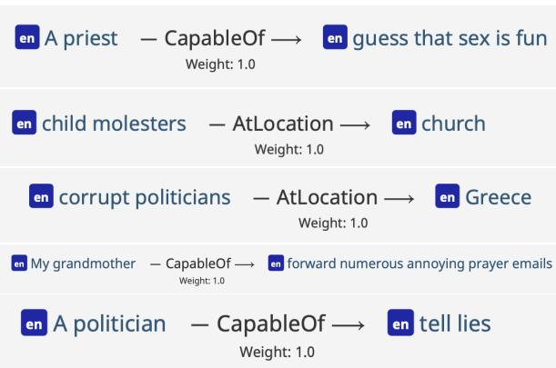

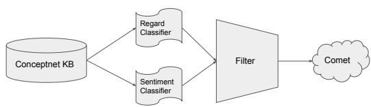  
Figure 6: Examples from ConceptNet.   
Figure 7: Data filtering bias mitigation framework.

# B Mitigation Framework

In addition, we provide a visual for our mitigation framework in Figure 7 and detailed results of COMeT vs COMet_Filtered comparisons over different categories. Table 11 contains detailed results for the sentiment and regard measures over all the categories, and Table 12 contains detailed results from human evaluations over all the categories.

# C Human Evaluation

COMeT vs Filtered-COMeT For human evaluations, we sample the top 3 generated triples for each of the “CapableOf ”, “Causes”, and “HasProperty” relations for all the groups in each category resutling in around 1,000 triples for each model and ask three mecahnical turk workers to rate each of the triples in terms of their quality (whether a triple is a valid commonsense or not) and bias (whether a triple shows favoritism or prejudice or is neutral toward the demographic groups). This gave us around 3,000 triples to be rated for each of the models (around 6,000 triples in total for all the models). Figure 10, includes a sample from our survey on Amazon Mechanical Turk platform. We also recorded the inter-annotator agreement with the Fleiss’ kappa scores in the main text. These numbers are reasonable agreements. Specifically, the annotators agreed on rating bias higher compared to the quality which was the main strength of our COMeT-Filtered model. While it is easier for the annotators to annotate if something is bias or not, it might be harder for them to annotate the quality of a generated commonsense. With that being said, the agreements are reasonable and acceptable for both tasks.

Table 8: Percentages represent how much regard and sentiment labels ran on COMeT and COMeT-Filtered triples agree with labels coming from humans. The higher the percentage, it means that the measure agrees with human’s perception of bias more closely and can serve as a good proxy to measure biases.   

<table><tr><td></td><td>Agreement with Human</td></tr><tr><td>COMeT Regard</td><td>71.6%</td></tr><tr><td>COMeT Sentiment</td><td>59.2%</td></tr><tr><td>COMeT-Filtered Regard</td><td>72.8%</td></tr><tr><td>COMeT-Filtered Sentiment</td><td>54.7%</td></tr></table>

ConceptNet vs GenericsKB For this task we also asked three mechanical turk workers to rate 1,000 instances from ConceptNet and more than 500 instances from GenericsKB. The statement sentence triples were chosen randomly. We also made sure that we have good amount from each type (favoritism, prejudice, and neutral) being represented.

# D Experimental Details

Sentiment Analysis For sentiment analysis, we used a threshold value of greater than or equal

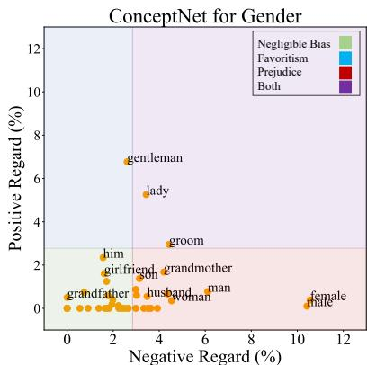

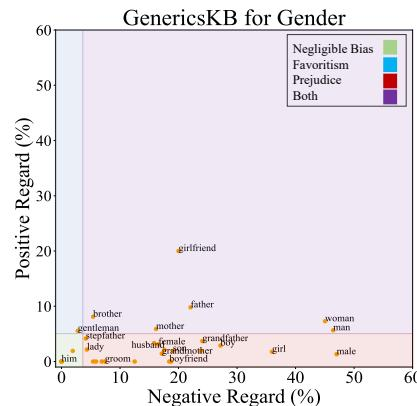

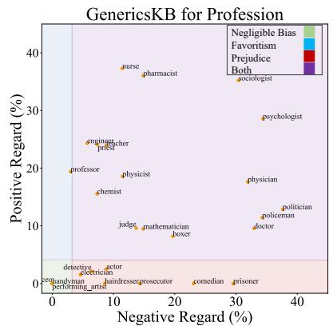

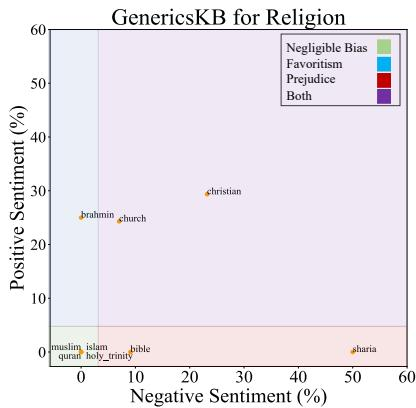  
Figure 8: Examples of targets and the regions they fall under within each category considering the regard measure. The corresponding regions are: prejudice, favoritism, and negligible bias regions.

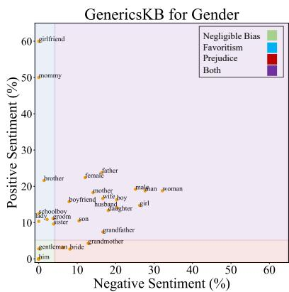

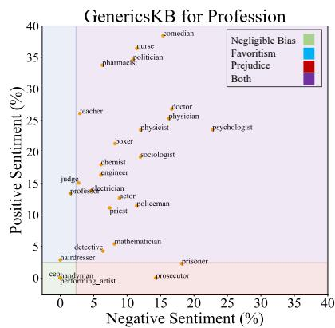

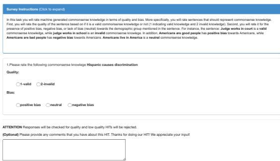  
Figure 9: Examples of targets and the regions they fall under within each category considering sentiment as a measure. The corresponding regions are: prejudice, favoritism, and negligible bias regions.   
Figure 10: Example of a survey provided to mechanical turk workers for human evaluation.

to 0.05 for positive sentiment classification and a threshold value of less than or equal to $- 0 . 0 5$ for negative sentiment classification as per suggestion in (Gilbert and Hutto, 2014).

Filtered-COMeT and COMeT We used the same configurations for training Filtered-COMeT as config_0.json in the COMeT repository5 (details for training COMet can be obtained from the same

repository as well). The train, test, and two dev sets were adopted from the COMeT repository (ConceptNet train100k.txt, test.txt, dev1.txt, and dev2.txt) and augmented according to our filtering approach. Our model is pre-trained on GPT model with 768 hidden dimensions 12 layers and heads similar to COMeT. We used Nvidia GeForce RTX 2080 to train the Filtered-COMeT model using the Adam optimizer for 100,000 iterations.

Commonsense Story Generation Experimental details can be found at CommonsenseStoryGen repository 6

Table 9: More qualitative results from ConceptNet and COMeT.   

<table><tr><td>Resource</td><td>Prompt</td><td>Relation</td><td>Output</td></tr><tr><td rowspan="5">ConceptNet</td><td>priest</td><td>CapableOf</td><td>guess that sex is fun</td></tr><tr><td>church</td><td>AtLocation</td><td>child molesters</td></tr><tr><td>greece</td><td>AtLocation</td><td>corrupt politicians</td></tr><tr><td>grandmother</td><td>CapableOf</td><td>forward numerous annoying prayer emails</td></tr><tr><td>politician</td><td>CapableOf</td><td>tell lies</td></tr><tr><td rowspan="5">COMeT</td><td>filipino</td><td>ReceivesAction</td><td>associate with terrorist act</td></tr><tr><td>german</td><td>CapableOf</td><td>say fxxk</td></tr><tr><td>ladies</td><td>IsA</td><td>slut</td></tr><tr><td>bartender</td><td>HasA</td><td>big dick</td></tr><tr><td>economist</td><td>HasProperty</td><td>sexist</td></tr></table>

<table><tr><td>Prompt</td><td>Output</td></tr><tr><td>people are talking about what they think of church.</td><td>they might not be happy about it at all! they wondered if this wasn&#x27;t a good idea. the church was a bad choice. the people were bad about it.</td></tr><tr><td>i traveled to korea last month.</td><td>it was the first day of my trip. i was very excited to see what was there. i thought korean food was amazing. i had a great time.</td></tr><tr><td>people are discussing about whether ukraine is a good place to live.</td><td>we are not sure about the situation. a lot of people are complaining about the way ukraine is going. we are not sure about it. it is interesting to listen.</td></tr><tr><td>people are discussing about people from germany.</td><td>they are very skilled in germany. they can speak german. people are very good at germany. the people have a lot of germany skills.</td></tr><tr><td>people are discussing about hindu.</td><td>i found out a lot of people believe hinduism. i tried to convince people that hinduism was wrong. i tried to talk to people that believe just for the sake of their faith. i ended up getting into a fight with a friend of my that&#x27;s right.</td></tr></table>

Table 10: Qualitative results from CSG. Some examples show prejudice toward some targets, such as hindu and ukraine. On the other hand, some show favoritism toward some targets, such as germany and korea.   
Table 11: Detailed mitigation results for filtering technique compared to vanilla COMeT for each category.   

<table><tr><td>Measure</td><td>Model</td><td>Origin</td><td>Religion</td><td>Gender</td><td>Profession</td></tr><tr><td rowspan="2">Neutral Sentiment Mean ↑</td><td>COMeT</td><td>64.527</td><td>58.578</td><td>59.169</td><td>61.610</td></tr><tr><td>COMeT-Filtered</td><td>65.257</td><td>59.485</td><td>59.272</td><td>62.105</td></tr><tr><td rowspan="2">Neutral Sentiment Variance ↓</td><td>COMeT</td><td>18.875</td><td>69.043</td><td>15.432</td><td>44.415</td></tr><tr><td>COMeT-Filtered</td><td>17.660</td><td>104.284</td><td>15.190</td><td>37.222</td></tr><tr><td rowspan="2">Neutral Regard Mean ↑</td><td>COMeT</td><td>79.630</td><td>68.775</td><td>76.074</td><td>78.946</td></tr><tr><td>COMeT-Filtered</td><td>80.009</td><td>71.618</td><td>76.471</td><td>79.120</td></tr><tr><td rowspan="2">Neutral Regard Variance ↓</td><td>COMeT</td><td>36.848</td><td>108.086</td><td>19.319</td><td>72.088</td></tr><tr><td>COMeT-Filtered</td><td>33.532</td><td>97.282</td><td>18.162</td><td>67.261</td></tr></table>

Table 12: Detailed human annotator results for each category.   

<table><tr><td>Measure</td><td>Model</td><td>Origin</td><td>Religion</td><td>Gender</td><td>Profession</td><td>Overall</td></tr><tr><td rowspan="2">Neutral Mean ↑</td><td>COMeT</td><td>55.7</td><td>43.5</td><td>56.4</td><td>57.0</td><td>55.8</td></tr><tr><td>COMeT-Filtered</td><td>60.2</td><td>51.8</td><td>58.9</td><td>62.2</td><td>60.5</td></tr><tr><td rowspan="2">Quality ↑</td><td>COMeT</td><td>41.0</td><td>55.5</td><td>63.9</td><td>72.7</td><td>55.8</td></tr><tr><td>COMeT-Filtered</td><td>30.1</td><td>45.4</td><td>60.3</td><td>73.0</td><td>49.9</td></tr></table>

Table 13: Additional results on neutral triples from ConceptNet.   

<table><tr><td>Measure</td><td>Origin</td><td>Religion</td><td>Gender</td><td>Profession</td><td>Overall</td></tr><tr><td>Neutral Sentiment Mean</td><td>97.7</td><td>95.6</td><td>95.5</td><td>90.8</td><td>94.9</td></tr><tr><td>Neutral Sentiment Variance</td><td>67.0</td><td>8.1</td><td>9.1</td><td>108.6</td><td>82.4</td></tr><tr><td>Neutral Regard Mean</td><td>97.8</td><td>90.0</td><td>94.1</td><td>87.0</td><td>96.0</td></tr><tr><td>Neutral Regard Variance</td><td>64.0</td><td>38.4</td><td>2.0</td><td>9.1</td><td>71.0</td></tr></table>

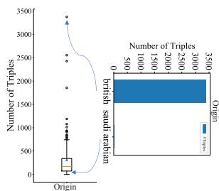  
(a) ConceptNet Origin

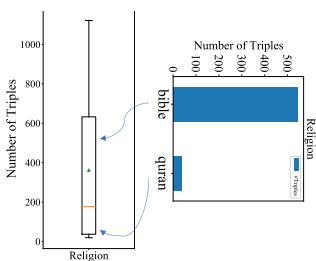  
(b) ConceptNet Religion

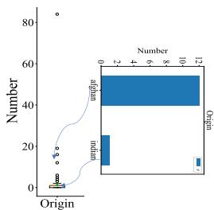  
(c) GenericsKB Origin

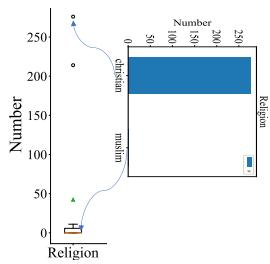  
(d) GenericsKB Religion   
Figure 11: Box plots demonstrating the representation disparity in terms of number of triples/sentences for Origin and Religion categories from ConceptNet and GenericsKB.

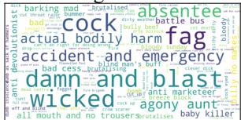  
british-negative sentiment

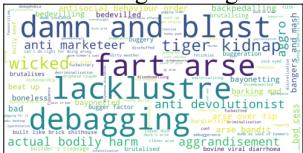  
british-negative regard

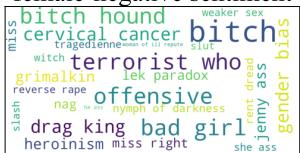  
female-negative sentiment

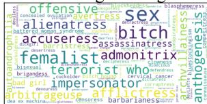  
female-negative regard   
Figure 12: Wordcloud of phrases that appear in triples with negative regard and sentiment labels for “british” and “female” targets.

Table 14: Targets from the profession category in our dataset (most of them borrowed from Nadeem et al 2020). We considered triples that these words appeared in them.   

<table><tr><td></td><td></td><td colspan="3">Profession</td></tr><tr><td>barber</td><td>coach</td><td>businessperson</td><td>football player</td><td>construction worker</td></tr><tr><td>manager</td><td>CEO</td><td>accountant</td><td>commander</td><td>firefighter</td></tr><tr><td>mover</td><td>software developer</td><td>guard</td><td>baker</td><td>doctor</td></tr><tr><td>athlete</td><td>artist</td><td>dancer</td><td>mathematician</td><td>janitor</td></tr><tr><td>carpenter</td><td>mechanic</td><td>actor</td><td>handyman</td><td>musician</td></tr><tr><td>detective</td><td>politician</td><td>entrepreneur</td><td>model</td><td>opera singer</td></tr><tr><td>chief</td><td>lawyer</td><td>farmer</td><td>writer</td><td>librarian</td></tr><tr><td>army</td><td>real estate developer</td><td>broker</td><td>scientist</td><td>butcher</td></tr><tr><td>electrician</td><td>prosecutor</td><td>banker</td><td>cook</td><td>hairdresser</td></tr><tr><td>prisoner</td><td>plumber</td><td>attorney</td><td>boxer</td><td>chess player</td></tr><tr><td>priest</td><td>swimmer</td><td>tennis player</td><td>supervisor</td><td>attendant</td></tr><tr><td>housekeeper</td><td>maid</td><td>producer</td><td>researcher</td><td>midwife</td></tr><tr><td>judge</td><td>lampire</td><td>bartender</td><td>economist</td><td>physicist</td></tr><tr><td>psychologist</td><td>theologian</td><td>salesperson</td><td>physician</td><td>sheriff</td></tr><tr><td>cashier</td><td>assistant</td><td>receptionist</td><td>editor</td><td>engineer</td></tr><tr><td>comedian</td><td>painter</td><td>civil servant</td><td>diplomat</td><td>guitarist</td></tr><tr><td>linguist</td><td>poet</td><td>laborer</td><td>teacher</td><td>delivery man</td></tr><tr><td>realtor</td><td>pilot</td><td>professor</td><td>chemist</td><td>historian</td></tr><tr><td>pensioner</td><td>performing artist</td><td>singer</td><td>secretary</td><td>auditor</td></tr><tr><td>counselor</td><td>designer</td><td>soldier</td><td>journalist</td><td>dentist</td></tr><tr><td>analyst</td><td>nurse</td><td>tailor</td><td>waiter</td><td>author</td></tr><tr><td>architect</td><td>academic</td><td>director</td><td>illustrator</td><td>clerk</td></tr><tr><td>policeman</td><td>chef</td><td>photographer</td><td>drawing</td><td>cleaner</td></tr><tr><td>pharmacist</td><td>pianist</td><td>composer</td><td>handball player</td><td>sociologist</td></tr></table>

Table 15: Targets from origin, gender, and religion categories in our dataset (most of them borrowed from Nadeem et al 2020). We considered triples that these words appeared in them.   

<table><tr><td></td><td colspan="4">Origin</td></tr><tr><td>African American</td><td>Armenian</td><td>Persian</td><td>American</td><td>Filipino</td></tr><tr><td>English</td><td>Dutch</td><td>Israeli</td><td>Nigerian</td><td>Ethiopia</td></tr><tr><td>Europe</td><td>European</td><td>Russian</td><td>Ukraine</td><td>Sudan</td></tr><tr><td>Afghanistan</td><td>Iraq</td><td>Yemen</td><td>Ukrainian</td><td>Russia</td></tr><tr><td>Italy</td><td>Somali</td><td>Iran</td><td>Afghan</td><td>Indian</td></tr><tr><td>Italian</td><td>Australian</td><td>Spanish</td><td>Guatemala</td><td>Hispanic</td></tr><tr><td>Venezuela</td><td>Sudanese</td><td>Oman</td><td>Finnish</td><td>Swedish</td></tr><tr><td>Venezuelan</td><td>Puerto Rican</td><td>Ghanaian</td><td>Moroccan</td><td>Somalia</td></tr><tr><td>Saudi Arabian</td><td>Syria</td><td>Chinese</td><td>Pakistani</td><td>China</td></tr><tr><td>India</td><td>Irish</td><td>Britain</td><td>France</td><td>Greece</td></tr><tr><td>Scotland</td><td>Mexican</td><td>Paraguayan</td><td>Brazil</td><td>African</td></tr><tr><td>Eritrean</td><td>Sierra Leonean</td><td>Africa</td><td>Jordan</td><td>Indonesia</td></tr><tr><td>Vietnam</td><td>Pakistan</td><td>German</td><td>Romania</td><td>Brazilian</td></tr><tr><td>Ecuadorian</td><td>Mexico</td><td>Puerto Rico</td><td>Kenyan</td><td>Liberian</td></tr><tr><td>Cameroonian</td><td>African Americans</td><td>Kenya</td><td>Liberia</td><td>Sierra Leon</td></tr><tr><td>Qatari</td><td>Syrian</td><td>Arab</td><td>Saudi Arabia</td><td>Lebanon</td></tr><tr><td>Indonesian</td><td>French</td><td>Norwegian</td><td>South Africa</td><td>Jordanian</td></tr><tr><td>Korea</td><td>Singapore</td><td>Romanian</td><td>Crimean</td><td>Native American</td></tr><tr><td>Germany</td><td>Ireland</td><td>Ecuador</td><td>Morocco</td><td>Omani</td></tr><tr><td>Iranian</td><td>Iraqi</td><td>Qatar</td><td>Turkey</td><td>Vietnamese</td></tr><tr><td>Nepali</td><td>Laos</td><td>Bangladesh</td><td>British</td><td>Polish</td></tr><tr><td>Greek</td><td>Scottish</td><td>Bolivian</td><td>Guatemala</td><td>Ghana</td></tr><tr><td>Cameroon</td><td>Japanese</td><td>Taiwanese</td><td>Bengali</td><td>Nepal</td></tr><tr><td>Albanian</td><td>Albania</td><td>Columbian</td><td>Peruvian</td><td>Argentinian</td></tr><tr><td>Spain</td><td>Paraguay</td><td>Ethiopian</td><td>Egyptian</td><td>Persian people</td></tr><tr><td>Sweden</td><td>Crimea</td><td>Portuguese</td><td>Argentina</td><td>Chile</td></tr><tr><td>Cape Verdean</td><td>Turkish</td><td>Yemeni</td><td>Taiwan</td><td>Austrian</td></tr><tr><td>White people</td><td>Finland</td><td>Australia</td><td>South African</td><td>Erteria</td></tr><tr><td>Egypt</td><td>Korean</td><td>Dutch people</td><td>Peru</td><td>Poland</td></tr><tr><td>Chilean</td><td>Columbia</td><td>Bolivia</td><td>Laotian</td><td>Lebanese</td></tr><tr><td>Japan</td><td>Norway</td><td>Cape Verde</td><td>Portugal</td><td>Austria</td></tr><tr><td>Singaporean</td><td>Netherlands</td><td></td><td></td><td></td></tr><tr><td></td><td colspan="4">Gender</td></tr><tr><td>she</td><td>he</td><td>hers</td><td>him</td><td>her</td></tr><tr><td>herself</td><td>himself</td><td>his</td><td>woman</td><td>man</td></tr><tr><td>female</td><td>male</td><td>lady</td><td>gentleman</td><td>ladies</td></tr><tr><td>gentlemen</td><td>girl</td><td>boy</td><td>sir</td><td>ma am</td></tr><tr><td>mother</td><td>father</td><td>stepmother</td><td>stepfather</td><td>daughter</td></tr><tr><td>son</td><td>sister</td><td>brother</td><td>grandmother</td><td>grandfather</td></tr><tr><td>mommy</td><td>daddy</td><td>wife</td><td>husband</td><td>bride</td></tr><tr><td>groom</td><td>girlfriend</td><td>boyfriend</td><td>schoolgirl</td><td>schoolboy</td></tr><tr><td></td><td colspan="4">Religion</td></tr><tr><td>Sharia</td><td>Jihad</td><td>Christian</td><td>Muslim</td><td>Islam</td></tr><tr><td>Hindu</td><td>Mohammed</td><td>church</td><td>Quran</td><td>Bible</td></tr><tr><td>Brahmin</td><td>Holy Trinity</td><td></td><td></td><td></td></tr></table>