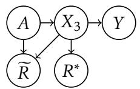
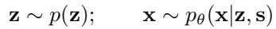

# Evidence Report: l1_de_1610.02413_0122

**Difficulty Level**: ?  
**Difficulty Label**: ?  
**Pair Type**: figure+formula  
**Doc ID**: 1610.02413  
**Pair ID**: ?  
**Query Style**: academic  

## Query

> Why does the shared-parent layout still permit leakage under epsilon matching?

## Answer

The leakage remains because the graph shows the protected attribute feeding both the target and the observed feature, so a representation built from that feature can still encode protected information indirectly. This is consistent with the formula’s epsilon term, because matching probabilities only up to epsilon does not force exact invariance. The context even notes that values between 0 and 1 can satisfy the penalty while information still leaks through. So the topology and the epsilon-bounded penalty together explain why dependence can survive.

## Reasoning Chain

The causal graph routes the protected attribute into both the target and a feature, making the feature an indirect carrier of protected information. The penalty term compares representation probabilities across domains with an epsilon tolerance. This suggests the shared-parent structure can still leak information when only that probabilistic closeness is controlled.

## Evidence Elements (2)

### 1610.02413_figure_5 (`figure`)

**Caption**: Figure 5: Graphical model for Scenario II.

**Content**:

Figure 5: Graphical model for Scenario II.

Context Before

Scenario I Consider the dependency structure depicted in Figure 4. Here, $X _ { 1 }$ is a feature highly (even deterministically) correlated with the protected attribute $A$ , but independent of the target Y given A. For example, $X _ { 1 }$ might be “languages spoken at home” or “great great grandfather’s profession”. The target Y has a statistical correlation with the protected attribute. There’s a second real-valued feature $X _ { 2 }$ correlated with Y , but only related to A through Y . For

Scenario I Consider the dependency structure depicted in Figure 4.

the feature $X _ { 2 }$ through the score $\widetilde { R } = X _ { 2 } ^ { { \mathbf { \Upsilon } } }$ . The score $\widetilde { R }$ satisfies equalized odds, since $X _ { 2 }$ and $A$ are independent conditional on Y . Because 

... (truncated)

Context After

6.1 Unidentifiability

The above two scenarios seem rather different. The optimal score $R ^ { * }$ is in one case based directly on $A$ or its surrogate, and in another only on a directly predictive feature, but this is not apparent by considering the equalized odds criterion, suggesting a possible shortcoming of equalized odds. In fact, as we will now see, the two scenarios are indistinguishable using any oblivious test. That is, no test based only on the target labels, the protected attribute and the score would give different indications for the optimal score $R ^ { * }$ in the two scenarios. If it were judged unfair in one scenario, it would also be judged unfair in the other.

We will show this by constructing specific instantiations of the two scenarios where the joint distributions

... (truncated)

---

### 1511.00830_formula_2 (`formula`)

**Content (formula)**:

$$\mathrm {P A D} (\epsilon) = 2 (1 - 2 \epsilon)$$

Context Before

returns 1 or 0, while $p ( z _ { k } = 1 | x _ { i } , s = 1 )$ returns values between values 0 and 1, then the penalty could still be satisfied, but information could still leak through. We addressed both of these issues in this paper.

Domain adaptation can also be cast as learning representations that are “invariant” with respect to a discrete variable s, the domain. Most similar to our work are neural network approaches which try to match the feature distributions between the domains. This was performed in an unsupervised way with mSDA (Chen et al., 2012) by training denoising autoencoders jointly on all domains, thus implicitly obtaining a representation general enough to explain both the domain and the data. This is in contrast to our approach where we instead try to learn representa

... (truncated)

---

## Required Evidence Spans

| Element ID | Span | Evidence Type |
| --- | --- | --- |
| `1610.02413_figure_5` | shared-parent causal structure where the protected attribute sends arrows to both the target and an observed feature | observation |
| `1511.00830_formula_2` | probability-based penalty with P, D, and epsilon that allows approximate matching rather than exact equality | mechanism |

## Visual Anchors

| Element ID | Anchor |
| --- | --- |
| `1610.02413_figure_5` | central parent node with outgoing edges toward two downstream nodes on separate branches |
| `1511.00830_formula_2` | epsilon term alongside P and D in the penalty expression |

## Text Evidence

> then the penalty could still be satisfied, but information could still leak through. We addressed both of these issues in this paper.

## Query-level Image Paths

## QC Metadata

- **QC Pass**: True
- **QC Issues**: none
- **Quality Tier**: unknown
- **Bridge Quality**: ?
