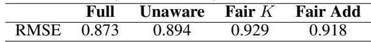

# Evidence Report: l1_de_1703.06856_0064

**Difficulty Level**: ?  
**Difficulty Label**: ?  
**Pair Type**: formula+table  
**Doc ID**: 1703.06856  
**Pair ID**: ?  
**Query Style**: academic  

## Query

> Why does invariance cost accuracy in Fair K and Fair Add?

## Answer

Fair K and Fair Add are slightly worse on prediction because the representation is constrained to be invariant against the sensitive attribute. Accuracy drops from about 0.821 in Full and 0.819 in Unaware to about 0.809 in Fair K and 0.804 in Fair Add, consistent with sacrificing some predictive signal due to fairness constraints.

## Reasoning Chain

The formula discusses enforcing invariance against the sensitive attribute, which should reduce dependence on protected information. The results show accuracy slipping slightly for Fair K and Fair Add compared with Full and Unaware. This aligns with a fairness constraint trading predictive similarity for reduced sensitive-attribute leakage.

## Evidence Elements (2)

### 1703.06856_table_1 (`table`)

**Caption**: Table 1: Prediction results using logistic regression. Note that we must sacrifice a small amount of accuracy to ensuring counterfactually fair prediction (Fair $K$ , Fair Add), versus the models that use unfair features: GPA, LSAT, race, sex (Full, Unaware).

**Content**:

Table 1: Prediction results using logistic regression. Note that we must sacrifice a small amount of accuracy to ensuring counterfactually fair prediction (Fair $K$ , Fair Add), versus the models that use unfair features: GPA, LSAT, race, sex (Full, Unaware).

Context Before

The causal graph corresponding to this model is shown in Figure 2, (Level 2).

Note that in this case, this model is not fair even if the data was generated by one of the models shown in Figure 2 as it corresponds to Scenario 3.

In Level 3, we model GPA, LSAT, and FYA as continuous variables with additive error terms independent of race and sex (that may in turn be correlated with one-another). This model is shown

Context After

in Figure 2, (Level 3), and is expressed by:

$$ \mathbf {G P A} = b _ {G} + w _ {G} ^ {R} R + w _ {G} ^ {S} S + \epsilon_ {G}, \epsilon_ {G} \sim p (\epsilon_ {G}) $$

$$ \mathrm {L S A T} = b _ {L} + w _ {L} ^ {R} R + w _ {L} ^ {S} S + \epsilon_ {L}, \quad \epsilon_ {L} \sim p (\epsilon_ {L}) $$

To provide an intuition for counterfactual fairness, we will consider two real-world fair prediction scenarios: insurance pricing and crime prediction. Each of these correspond to one of the two causal graphs in Figure 1(a),(b). The Supplementary Material provides a more mathematical discussion of these examples with more detailed insights.

Scenario 1: The Red Car. A car insurance company wishes to price insurance for car owners by predicting their accident rate $Y$ . They assume there is an un

... (truncated)

---

### 1511.00830_formula_1 (`formula`)

**Content (formula)**:

$$\mathbf {z} \sim p (\mathbf {z}); \qquad \mathbf {x} \sim p _ {\theta} (\mathbf {x} | \mathbf {z}, \mathbf {s})$$

Context After

As for the Health dataset; this dataset is extremely imbalanced, with only $15 \%$ of the patients being admitted to a hospital. Therefore, each of the classifiers seems to predict the majority class as the label y for every point. For the invariance against s however, the results were more interesting. On the one hand, the VAE model on this dataset did maintain some sensitive information, which could be identified both linearly and non-linearly. On the other hand, VFAE and the LFR methods were able to retain less information in their latent representation, since only Random Forest was able to achieve higher than random chance accuracy. This further justifies our choice for including the MMD penalty in the lower bound of the VAE. .

In order to further assess the nature of our new represen

... (truncated)

---

## Required Evidence Spans

| Element ID | Span | Evidence Type |
| --- | --- | --- |
| `1511.00830_formula_1` | invariance against the sensitive attribute | constraint |
| `1703.06856_table_1` | Fair K, Fair Add versus Full, Unaware prediction accuracy | result |

## Visual Anchors

| Element ID | Anchor |
| --- | --- |
| `1511.00830_formula_1` | sensitive-attribute invariance term |
| `1703.06856_table_1` | accuracy cells for Full, Unaware, Fair K, Fair Add |

## Text Evidence

> Note that we must sacrifice a small amount of accuracy to ensuring counterfactually fair prediction (Fair K, Fair Add), versus the models that use unfair features

## Query-level Image Paths

## QC Metadata

- **QC Pass**: True
- **QC Issues**: none
- **Quality Tier**: unknown
- **Bridge Quality**: ?
