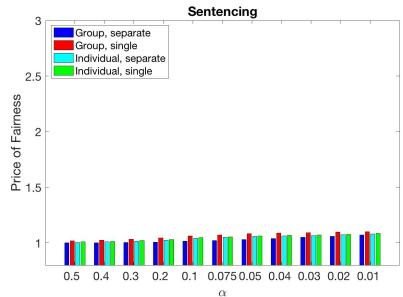
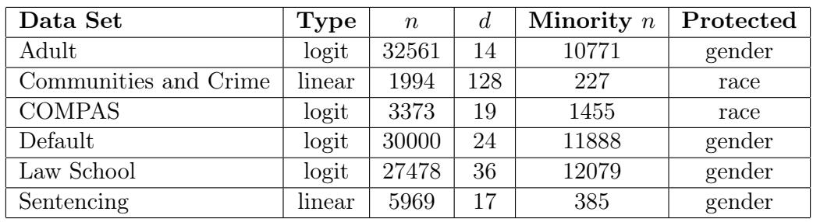

# Evidence Report: l1_de_1706.02409_0270

**Difficulty Level**: ?  
**Difficulty Label**: ?  
**Pair Type**: figure+table  
**Doc ID**: 1706.02409  
**Pair ID**: ?  
**Query Style**: academic  

## Query

> Why do PoF spikes track the smallest minority population?

## Answer

The strongest PoF spikes are most plausibly tied to Communities and Crime, because its minority group is the smallest in the dataset summary, consistent with the bridge linking PoF diversity to minority size. Adult has a much larger minority population and correspondingly looks less extreme by comparison, because larger minority samples constrain fairness estimates better.

## Reasoning Chain

The PoF varies sharply across datasets in the fairness-regularizer panels. The bridge says this cross-dataset diversity persists even after normalization and points to dataset properties, especially minority size. The dataset with the smallest minority count is likely to show the most unstable or largest fairness cost.

## Evidence Elements (2)

### 1706.02409_figure_2 (`figure`)

**Caption**: Figure 2: The “Price of Fairness” across data sets, for each type of fairness regularizer, in both the single and separate model case.

**Content**:

Figure 2: The “Price of Fairness” across data sets, for each type of fairness regularizer, in both the single and separate model case.

Context After

A Missing Details from the Experiments

A.1 Cross Validation for Picking $\gamma$

In this section we show how we used cross validation in our experiments to find $\gamma$ . For each dataset $S$ , our framework requires that we solve optimization problems of the form $\mathrm { m i n } _ { \mathbf { w } } \ell ( \mathbf { w } , S ) + \lambda f ( \mathbf { w } , S ) +$ $\gamma | | \mathbf { w } | | _ { 2 }$ for variable values of $\lambda$ , where $\ell ( \mathbf { w } , S )$ is either MSE (linear regression) or the logistic regression loss. For each $\lambda$ we picked $\gamma$ as a function of this $\lambda$ as follows:

Figure 2 displays the PoF on each of the 6 datasets we study, for each fairness regularizer (individual, hybrid, and group), and for the single and separate model case. W

... (truncated)

---

### 1706.02409_table_1 (`table`)

**Caption**: Table 1: Summary of datasets. Type indicates whether regression is logistic or linear; $n$ is total number of data points; $d$ is dimensionality; Minority $n$ is the number of data points in the smaller population; Protected indicates which feature is protected or fairness-sensitive.

**Content**:

Table 1: Summary of datasets. Type indicates whether regression is logistic or linear; $n$ is total number of data points; $d$ is dimensionality; Minority $n$ is the number of data points in the smaller population; Protected indicates which feature is protected or fairness-sensitive.

Context Before

5We only used the data in Adult.data in our experiments.

6http://www2.law.ucla.edu/sander/Systemic/Data.htm

goal is to predict the sentence length given by the judge based on factors such as previous criminal records and the crimes for which the conviction was obtained. The protected attribute is gender.

Context After

4.1 Accuracy-Fairness Efficient Frontiers

We begin by examining the efficient frontier of accuracy vs. fairness for the six datasets. These curves are shown in Figure 1, and are obtained by varying the weight $\lambda$ on the fairness regularizer, and for each value of $\lambda$ finding the model which minimizes the associated regularized loss function. For the logistic regression cases, we extract probabilities from the learned model w as ${ \mathrm { P r } } [ y _ { i } = 1 ] =$ $\exp ( \mathbf { w } \cdot x _ { i } ) / ( 1 + \exp ( \mathbf { w } \cdot x _ { i } ) )$ and evaluate these probabilities as predictions for the binary labels using MSE. 7 In all of the datasets, as $\lambda$ increases, the models converge to the best constant predictor, which minimizes the fairness penalties.

... (truncated)

---

## Required Evidence Spans

| Element ID | Span | Evidence Type |
| --- | --- | --- |
| `1706.02409_figure_2` | PoF varies strongly across datasets and regularizers | observation |
| `1706.02409_table_1` | Minority n differs substantially across datasets | result |

## Visual Anchors

| Element ID | Anchor |
| --- | --- |
| `1706.02409_figure_2` | top-row and bottom-row dataset panels with visibly different PoF heights |
| `1706.02409_table_1` | Minority n column across all listed datasets |

## Text Evidence

> We first note that even when normalized on a common scale, we continue to see the diversity across datasets ... The datasets themselves are summarized ... along with | Minority n

## Query-level Image Paths

## QC Metadata

- **QC Pass**: True
- **QC Issues**: none
- **Quality Tier**: unknown
- **Bridge Quality**: ?
