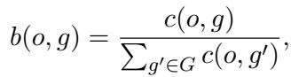
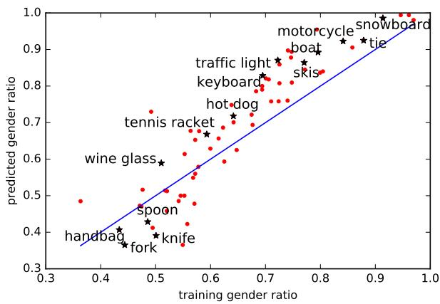

# Evidence Report: l1_de_1707.09457_0002

**Difficulty Level**: ?  
**Difficulty Label**: ?  
**Pair Type**: figure+formula  
**Doc ID**: 1707.09457  
**Pair ID**: ?  
**Query Style**: academic  

## Query

> Why does noun bias amplification persist despite regularized training?

## Answer

The upward pattern in the noun scatter indicates that predictions on the development set move further toward man as training bias increases, with many nouns lying in the amplification region. This is consistent with an objective that optimizes label fit while adding only a lambda-weighted regularizer on theta, because that term controls model complexity rather than gender balance. The regularizer can shrink parameters, but without a parity-specific term it still allows biased correlations to be learned. So the observed amplification persists because the loss favors reproducing predictive associations from biased data.

## Reasoning Chain

Noun points trend upward so predicted man ratio increases with training man ratio, indicating amplification rather than correction. The objective includes a data-fit loss over labels plus a regularization term weighted by lambda on parameters theta, but no explicit gender-parity penalty. Because optimization only balances prediction fit and parameter shrinkage, correlations in the data can be preserved or strengthened.

## Evidence Elements (2)

### 1707.09457_formula_1 (`formula`)

**Content (formula)**:

$$\begin{array}{l} L (\lambda , \{y ^ {i} \}) = \\ \sum_ {i} f _ {\theta} \left(y ^ {i}\right) - \sum_ {j = 1} ^ {l} \lambda_ {j} \left(A _ {j} \sum_ {i} y ^ {i} - b _ {j}\right), \tag {4} \\ \end{array}$$

Context After

tics from images and require large quantities of labeled data, predominantly retrieved from the web. Methods often combine structured prediction and deep learning to model correlations between labels and images to make judgments that otherwise would have weak visual support. For example, in the first image of Figure 1, it is possible to predict a spatula by considering that it is a common tool used for the activity cooking. Yet such methods run the risk of discovering and exploiting societal bia

Our analysis reveals that over $45 \%$ and $37 \%$ of verbs and objects, respectively, exhibit bias toward a gender greater than 2:1. For example, as seen in Figure 1, the cooking activity in imSitu is a heavily biased verb. Furthermore, we show that after training state-of-the-art structured pred

... (truncated)

---

### 1707.09457_figure_2 (`figure`)

**Caption**: (b) Bias analysis on MS-COCO MLC Figure 2: Gender bias analysis of imSitu vSRL and MS-COCO MLC. (a) gender bias of verbs toward man in the training set versus bias on a predicted development set. (b) gender bias of nouns toward man in the training set versus bias on the predicted development set. Values near zero indicate bias toward woman while values near 0.5 indicate unbiased variables. Across both dataset, there is significant bias toward males, and significant bias amplification after training on biased training data.

**Content**:

(b) Bias analysis on MS-COCO MLC Figure 2: Gender bias analysis of imSitu vSRL and MS-COCO MLC. (a) gender bias of verbs toward man in the training set versus bias on a predicted development set. (b) gender bias of nouns toward man in the training set versus bias on the predicted development set. Values near zero indicate bias toward woman while values near 0.5 indicate unbiased variables. Across both dataset, there is significant bias toward males, and significant bias amplification after training on biased training data.

Context After

Training on MS-COCO amplifies bias In Figure 2(b), along the y-axis, we show the ratio of man $\%$ of both gender) in predictions on an unseen development set. The mean bias amplification across all objects is 0.036, with $6 5 . 6 7 \%$ of nouns exhibiting amplification. Larger training bias again tended to indicate higher bias amplification: biased objects with training bias over 0.7 had mean amplification of 0.081. Again, several problematic biases have now been amplified. For example, kitchen categories already biased toward females such as knife, fork and spoon have all been amplified. Technology oriented categories initially biased toward men such as keyboard and mouse have each increased their bias toward males by over 0.100.

We confirmed our hypothesis that (a) both the im-Situ and

... (truncated)

---

## Required Evidence Spans

| Element ID | Span | Evidence Type |
| --- | --- | --- |
| `1707.09457_figure_2` | noun scatter trends upward from training bias to predicted development bias, with many nouns showing amplification toward man rather than returning to the unbiased center | observation |
| `1707.09457_formula_1` | objective uses labels y with parameters theta and includes a lambda-weighted regularization term, but no explicit fairness or gender-balance penalty | mechanism |

## Visual Anchors

| Element ID | Anchor |
| --- | --- |
| `1707.09457_figure_2` | right-side noun points and overall diagonal upward trend in the scatter |
| `1707.09457_formula_1` | lambda regularization term applied to theta within the training objective |

## Text Evidence

> Training on MS-COCO amplifies bias In Figure 2(b), along the y-axis, we show the ratio of man % of both gender) in predictions on an unseen development set.

## Query-level Image Paths

## QC Metadata

- **QC Pass**: True
- **QC Issues**: none
- **Quality Tier**: unknown
- **Bridge Quality**: ?
