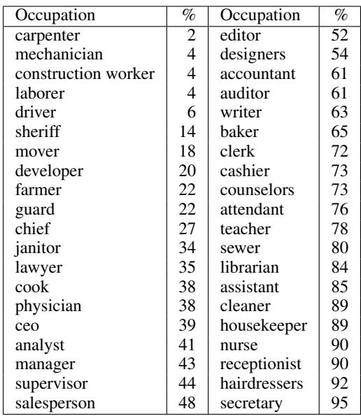

# Evidence Report: l1_de_1804.06876_0202

**Difficulty Level**: ?  
**Difficulty Label**: ?  
**Pair Type**: figure+table  
**Doc ID**: 1804.06876  
**Pair ID**: ?  
**Query Style**: academic  

## Query

> Why does the below-parity scatter matter most for manager-like occupations?

## Answer

It matters most for borderline occupations because the scatter indicates Bergsma and Lin systematically underestimates female representation relative to BLS, with a positive but imperfect correlation of 0.67. Due to discrete coreference choices, a mid-range occupation like manager at 38.5% female is more vulnerable to stereotype assignment shifts than extremes like carpenter at 2.4% female or nurse at 90.1% female.

## Reasoning Chain

The scatter sits mostly below the parity line, indicating older counts understate women. Because discrete coreference decisions can amplify percentage gaps into categorical stereotype labels, occupations near the middle of the table can flip interpretation. In the occupation list, manager at 38.5% female is a concrete borderline case, unlike strongly male jobs such as carpenter at 2.4% female.

## Evidence Elements (2)

### 1804.06876_table_1 (`table`)

**Caption**: Table 1: Occupations statistics used in WinoBias dataset, organized by the percent of people in the occupation who are reported as female. When woman dominate profession, we call linking the noun phrase referring to the job with female and male pronoun as ‘pro-stereotypical‘, and ‘anti-stereotypical‘, respectively. Similarly, if the occupation is male dominated, linking the noun phrase with the male and female pronoun is called, ‘pro-stereotypical‘ and ‘anti-steretypical‘, respectively.

**Content**:

Table 1: Occupations statistics used in WinoBias dataset, organized by the percent of people in the occupation who are reported as female. When woman dominate profession, we call linking the noun phrase referring to the job with female and male pronoun as ‘pro-stereotypical‘, and ‘anti-stereotypical‘, respectively. Similarly, if the occupation is male dominated, linking the noun phrase with the male and female pronoun is called, ‘pro-stereotypical‘ and ‘anti-steretypical‘, respectively.

Context Before

Type 2: [entity1] [interacts with] [entity2] and then [interacts with] [pronoun] for [circumstances]. These tests can be resolved using syntactic information and understanding of the pronoun (Figure 1; Type 2). We expect systems to do well on such cases because both semantic and syntactic cues help disambiguation.

Prototypical WinoCoRef style sentences, where co-reference decisions must be made using world knowledge about given circumstances (Figure 1; Type 1).

Berkeley Coreference Resolution System (Durrett and Klein, 2013) and the current best published system: the UW End-to-end Neural Coreference Resolution System (Lee et al., 2017). Despite qualitatively different approaches, all systems exhibit gender bias, showing an average difference in performance between pro-stereotypical and a

... (truncated)

Context After

and designed to cover cases requiring semantics and syntax separately.4

Type 1: [entity1] [interacts with] [entity2] [conjunction] [pronoun] [circumstances]. Prototypical WinoCoRef style sentences, where co-reference decisions must be made using world knowledge about given circumstances (Figure 1; Type 1). Such examples are challenging because they contain no syntactic cues.

Type 2: [entity1] [interacts with] [entity2] and then [interacts with] [pronoun] for [circumstances]. These tests can be resolved using syntactic information and understanding of the pronoun (Figure 1; Type 2). We expect systems to do well on such cases because both semantic and syntactic cues help disambiguation.

nouns to either male or female stereotypical occupations (see the illustrative examples in Figure 1). N

... (truncated)

---

### 1804.09301_figure_3 (`figure`)

**Caption**: Figure 3: Gender statistics from Bergsma and Lin (2006) correlate with Bureau of Labor Statistics 2015. However, the former has systematically lower female percentages; most points lie well below the 45-degree line (dotted). Regression line and $9 5 \%$ confidence interval in blue. Pearson $\Gamma = 0 . 6 7$ .

**Content**:

Figure 3: Gender statistics from Bergsma and Lin (2006) correlate with Bureau of Labor Statistics 2015. However, the former has systematically lower female percentages; most points lie well below the 45-degree line (dotted). Regression line and $9 5 \%$ confidence interval in blue. Pearson $\Gamma = 0 . 6 7$ .

Context Before

As the riddle reveals, the task of coreference resolution in English is tightly bound with questions of gender, for humans and automated systems alike (see Figure 1).

Our intent is to reveal cases where coreference systems may be more or less likely to recognize a pronoun as coreferent with a particular occupation based on pronoun gender, as observed in Figure 1.

Bureau of Labor Statistics) and the gender statistics from text (Bergsma and Lin, 2006) which these systems access directly; correlation values are in Table 1.

Context After

4 Results and Discussion

We evaluate examples of each of the three coreference system architectures described in 2: the Lee et al. (2011) sieve system from the rulebased paradigm (referred to as RULE), Durrett and Klein (2013) from the statistical paradigm (STAT), and the Clark and Manning (2016a) deep reinforcement system from the neural paradigm (NEURAL).

By multiple measures, the Winogender schemas reveal varying degrees of gender bias in all three systems. First we observe that these systems do not behave in a gender-neutral fashion. That is to say, we have designed test sentences where correct pronoun resolution is not a function of gender (as validated by human annotators), but system predictions do exhibit sensitivity to pronoun gender: $68 \%$ of male-female minimal pair test sen

... (truncated)

---

## Required Evidence Spans

| Element ID | Span | Evidence Type |
| --- | --- | --- |
| `1804.09301_figure_3` | most points lie well below the 45-degree line | observation |
| `1804.06876_table_1` | manager 38.5% female; carpenter 2.4%; nurse 90.1% | result |

## Visual Anchors

| Element ID | Anchor |
| --- | --- |
| `1804.09301_figure_3` | scatter cloud concentrated below the diagonal with blue regression line |
| `1804.06876_table_1` | occupation rows spanning low, middle, and high female percentages |

## Text Evidence

> Because coreference systems need to make discrete choices about which mentions are coreferent, percentage-wise differences in real-world statistics may translate into absolute differences in system predictions.

## Query-level Image Paths

## QC Metadata

- **QC Pass**: True
- **QC Issues**: none
- **Quality Tier**: unknown
- **Bridge Quality**: ?
