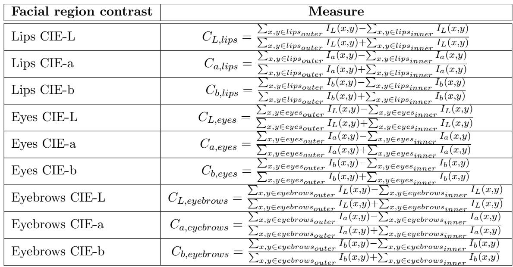
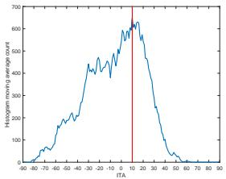

# Evidence Report: l1_de_1901.10436_0217

**Difficulty Level**: ?  
**Difficulty Label**: ?  
**Pair Type**: figure+table  
**Doc ID**: 1901.10436  
**Pair ID**: ?  
**Query Style**: academic  

## Query

> I notice the pipeline narrows from full face to masked skin before a compact ITA histogram; how does that skin-first CIE-Lab processing justify the specific contrasts retained?

## Answer

It justifies retaining lip contrast, eye contrast, and eyebrow contrast in Table 10, because the ITA pipeline first isolates facial skin and summarizes it in CIE-Lab before any region-level comparison. That is consistent with the bridge description that contrast is measured in the L, a, and b channels for those three regions, due to skin occupying a large fraction of the face and serving as the comparison baseline.

## Reasoning Chain

The workflow visibly moves from input face to skin map, Lab channels, ITA map, masked ITA map, and finally a concentrated histogram, indicating skin pixels are separated before summary. The bridge states that coding scheme 5 also operates in CIE-Lab but on region-versus-skin differences for lips, eyes, and eyebrows. Therefore Table 10 should report exactly those three contrast metrics, because skin characterization provides the reference appearance that those regional contrasts are measured against.

## Evidence Elements (2)

### 1901.10436_table_10 (`table`)

**Caption**: Table 10: Coding scheme 5 is made up of three measures of facial region contrast [6].

**Content**:

Table 10: Coding scheme 5 is made up of three measures of facial region contrast [6].

Context Before

Table 4 summarizes many of the prominent face image data sets used for evaluating face recognition technology.

Table 4 outlined many of the currently used face data sets.

We adopted facial regions contrast as the basis for coding scheme 5. To compute facial contrast, we measured contrast individually for each image color channel $I _ { L }$ , $I _ { a }$ , $\mathit { 1 } _ { b }$ , corresponding to the CIE-Lab color space, for three facial regions: lips, eyes, and eyebrows, as shown in Figure 4. First, we defined the internal regions ringed by facial key points computed from DLIB for each of these facial parts (shown as the inner rings around lips, eyes, and eyebrows in Figure 4). Then, we expanded this region by 50% to define an outer region around each of these facial parts (shown as t

... (truncated)

Context After

4.6 Coding Scheme 6: Skin Color

Skin occupies a large fraction of the face. As such, characteristics of the skin influence the appearance and perception of faces. Prior work has studied different methods of characterizing skin based on skin color [7, 69, 70], skin type [7, 38] and skin reflectance [71]. Early studies used Fitzpatrick skin type (FST) to classify sun-reactive skin types [38], which was also adopted recently in [36]. However, to-date, there is no universal measure for skin color, even within the dermatology field. In a study of 556 participants in South Africa, self-identified as either black, Indian/Asian, white, or mixed, Wilkes et al. found a high correlation between the Melanin Index (MI), which is frequently used to assign FST, with Individual Typology Angle (ITA) [72].

... (truncated)

---

### 1901.10436_figure_5 (`figure`)

**Caption**: (h) Figure 5: Process for extracting skin color for coding scheme 6 based on Individual Typology Angle-based (ITA). (a) Input face (b) skin map (c) $L$ channel (d) $a$ channel (e) $b$ channel (f) ITA map (g) masked ITA map (h) ITA histogram.

**Content**:

(h) Figure 5: Process for extracting skin color for coding scheme 6 based on Individual Typology Angle-based (ITA). (a) Input face (b) skin map (c) $L$ channel (d) $a$ channel (e) $b$ channel (f) ITA map (g) masked ITA map (h) ITA histogram.

Context After

In this Section, we describe the implementation of the ten facial coding schemes and the process of extracting them from the $D i F$ face images. The advantage of using ten coding schemes is that it gives a diversity of methods and allows us to compare statistical measures for facial diversity. As described above, the ten schemes have been selected based on their strong scientific basis, computational feasibility, numerical representation and interpretability. Overall the chosen ten coding schem

The first coding scheme for craniofacial distances has been adopted from [2]. It comprises eight measures which characterize all the vertical distances between elements in a face: the top of the forehead, the eyes, the nose, the mouth and the chin. In referring to the implementation of the coding 

... (truncated)

---

## Required Evidence Spans

| Element ID | Span | Evidence Type |
| --- | --- | --- |
| `1901.10436_figure_5` | input face to skin map to ITA histogram | observation |
| `1901.10436_table_10` | lip contrast, eye contrast, eyebrow contrast | result |

## Visual Anchors

| Element ID | Anchor |
| --- | --- |
| `1901.10436_figure_5` | left-to-right processing sequence ending in histogram |
| `1901.10436_table_10` | entries naming the retained facial region contrast measures |

## Text Evidence

> Skin occupies a large fraction of the face. As such, characteristics of the skin influence the appearance and perception of faces.

## Query-level Image Paths

## QC Metadata

- **QC Pass**: True
- **QC Issues**: none
- **Quality Tier**: unknown
- **Bridge Quality**: ?
