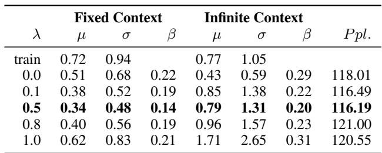

# Evidence Report: l1_de_1904.03035_0209

**Difficulty Level**: ?  
**Difficulty Label**: ?  
**Pair Type**: figure+table  
**Doc ID**: 1904.03035  
**Pair ID**: ?  
**Query Style**: academic  

## Query

> I notice the only explicit control is λ on the embedding penalty; why do the generated-text neutrality metrics improve steadily while language-model fit degrades across both corpora?

## Answer

The architecture localizes λ to the embedding-matrix debiasing term rather than the whole recurrent stack, and the bridge defines neutrality through lower average absolute bias in generated outputs. Due to that targeted regularization, both WikiText-2 and CNN/Daily Mail show progressively smaller generated-text bias scores at higher λ, whereas perplexity becomes worse compared with lower λ settings because the model is increasingly constrained by the debiasing objective.

## Reasoning Chain

The model diagram shows λ only affects the embedding debiasing objective, not the rest of the three-layer LSTM directly. The bridge links that objective to measured generated-text bias via average absolute bias. Therefore the table should show the clearest monotonic change in generated bias metrics, with a weaker or adverse change in language-model fit such as perplexity.

## Evidence Elements (2)

### 1904.03035_table_2 (`table`)

**Caption**: Table 2: Experimental results for WikiText-2 and generated text for different $\lambda$ values Table 3: Experimental results for CNN/Daily Mail and generated text for different $\lambda$ values

**Content**:

Table 2: Experimental results for WikiText-2 and generated text for different $\lambda$ values Table 3: Experimental results for CNN/Daily Mail and generated text for different $\lambda$ values

Context After

3.3 Quantifying Biases

For numeric data, bias can be caused simply by class imbalance, which is relatively easy to quantify and fix. For text and image data, the complexity in the nature of the data increases and it becomes difficult to quantify. Nonetheless, defining relevant metrics is crucial in assessing the bias exhibited in a dataset or in a model’s behavior.

3.3.1 Bias Score Definition

The difference between the pairs encodes the gender information corresponding to the gender pair. We then perform singular value decomposition on $C$ , obtaining UΣV . The gender subspace $B$ is then defined as the first $k$ columns (where $k$ is chosen to capture $5 0 \%$ of the variation) of the right singular matrix $V$ :

Let $N$ be the matrix consisting of the embeddings for which we would lik

... (truncated)

---

### 1904.03035_figure_1 (`figure`)

**Caption**: Figure 1: Word level language model is a three layer LSTM model. $\lambda$ controls the importance of minimizing bias in the embedding matrix.

**Content**:

Figure 1: Word level language model is a three layer LSTM model. $\lambda$ controls the importance of minimizing bias in the embedding matrix.

Context Before

Towards this pursuit, we aim to evaluate the effect of gender bias on word-level language models that are trained on a text corpus. Our contributions in this work include: (i) an analysis of the gender bias exhibited by publicly available datasets used in building state-of-the-art language models; (ii) an analysis of the effect of this bias on recurrent neural networks (RNNs) based word-level language models; (iii) a method for reducing bias learned in these models; and (iv) an analysis of the results of our method.

A number of methods have been proposed for evaluating and addressing biases that exist in datasets and the models that use them. Recasens et al. (2013) studies the neutral point of view (NPOV) edit tags in the Wikipedia edit histories to understand linguistic realization of bi

... (truncated)

Context After

sentence—“Usually, smaller cottage-style houses have been demolished to make way for these Mc-Mansions.”, the word McMansions has a negative connotation towards large and pretentious houses. Epistemological biases are entailed, asserted or hedged in the text. For example, in the sentence—“Kuypers claimed that the mainstream press in America tends to favor liberal viewpoints,” the word claimed has a doubtful effect on Kuypers statement as opposed to stated in the sentence—“Kuypers stated that the mainstream press in America tends to favor liberal viewpoints.” It may be possible to capture both of these kinds of biases through the distributions of co-occurrences. In this paper, we deal with identifying and reducing gender bias based on words co-occurring in a context window.

Bolukbasi et al

... (truncated)

---

## Required Evidence Spans

| Element ID | Span | Evidence Type |
| --- | --- | --- |
| `1904.03035_figure_1` | three layer LSTM model; λ controls the importance of minimizing bias | observation |
| `1904.03035_table_2` | experimental results for WikiText-2 and CNN/Daily Mail for different λ values | result |

## Visual Anchors

| Element ID | Anchor |
| --- | --- |
| `1904.03035_figure_1` | single lambda-controlled debiasing component attached to embeddings in the LSTM schematic |
| `1904.03035_table_2` | cross-corpus columns showing improving bias metrics but worsening perplexity with larger lambda |

## Text Evidence

> We first examine the bias existing in the datasets through qualitative and quantitative analysis of trained embeddings and cooccurrence patterns. We then train an LSTM word-level language model on a dataset and measure the bias of the generated outputs.

## Query-level Image Paths

## QC Metadata

- **QC Pass**: True
- **QC Issues**: none
- **Quality Tier**: unknown
- **Bridge Quality**: ?
