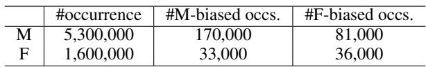

# Evidence Report: l1_de_1904.03310_0153

**Difficulty Level**: ?  
**Difficulty Label**: ?  
**Pair Type**: figure+table  
**Doc ID**: 1904.03310  
**Pair ID**: ?  
**Query Style**: academic  

## Query

> Across paired cases, the correct link stays the same while only stereotype direction switches; how would ELMo's pronoun-occupation imbalance explain weaker anti-stereotypical coreference decisions?

## Answer

The paired WinoBias design means anti-stereotypical errors cannot be blamed on changed semantics, because only stereotype direction changes while the gold link stays fixed. ELMo's corpus shows many more male than female pronouns and stronger male-pronoun cooccurrence with male-biased occupations, whereas female-pronoun statistics are lower and concentrated differently. That asymmetry would weaken anti-stereotypical linking because the model is constrained by corpus priors favoring stereotype-consistent occupation-pronoun associations.

## Reasoning Chain

The examples contrast pro-stereotypical and anti-stereotypical cases while holding the true coreference relation fixed across male/female variants. The bridge is that ELMo is trained on a corpus with unequal male/female pronoun frequencies and unequal pronoun-occupation cooccurrences. Therefore, poorer anti-stereotypical behavior is expected because embeddings inherit the asymmetric occupational gender statistics from the corpus.

## Evidence Elements (2)

### 1904.03310_table_1 (`table`)

**Caption**: Table 1: Training corpus for ELMo. We show total counts for male (M) and female (F) pronouns in the corpus, and counts corresponding to their cooccurrence with occupation words where the occupations are stereotypically male (M-biased) or female (Fbiased).

**Content**:

Table 1: Training corpus for ELMo. We show total counts for male (M) and female (F) pronouns in the corpus, and counts corresponding to their cooccurrence with occupation words where the occupations are stereotypically male (M-biased) or female (Fbiased).

Context Before

To mitigate bias from word embeddings, Bolukbasi et al. (2016) propose a post-processing method to project out the bias subspace from the pre-trained embeddings. Their method is shown to reduce the gender information from the embeddings of gender-neutral words, and, remarkably, maintains the same level of performance on different downstream NLP tasks. Zhao et al. (2018b) further propose a training mechanism to separate gender information from other factors. However, Gonen and Goldberg (2019) argue that entirely removing bias is difficult, if not impossible, and the gender bias information can be often recovered. This paper investigates a natural follow-up question: What are effective bias mitigation techniques for contextualized embeddings?

3 Gender Bias in ELMo

In this section we descri

... (truncated)

Context After

nificantly more male entities compared to female entities leading to gender bias in the pre-trained contextual word embeddings (2) the geometry of trained ELMo embeddings systematically encodes gender information and (3) ELMo propagates gender information about male and female entities unequally.

3.1 Training Data Bias

Table 1 lists the data analysis on the One Billion Word Benchmark (Chelba et al., 2013) corpus, the training corpus for ELMo. We show counts for the number of occurrences of male pronouns (he, his and him) and female pronouns (she and her) in the corpus as well as the co-occurrence of occupation words with those pronouns. We use the set of occupation words defined in the WinoBias corpus and their assignments as prototypically male or female (Zhao et al., 2018a). The analys

... (truncated)

---

### 1804.06876_figure_1 (`figure`)

**Caption**: Figure 1: Pairs of gender balanced co-reference tests in the WinoBias dataset. Male and female entities are marked in solid blue and dashed orange, respectively. For each example, the gender of the pronominal reference is irrelevant for the co-reference decision. Systems must be able to make correct linking predictions in pro-stereotypical scenarios (solid purple lines) and anti-stereotypical scenarios (dashed purple lines) equally well to pass the test. Importantly, stereotypical occupations are considered based on US Department of Labor statistics.

**Content**:

Figure 1: Pairs of gender balanced co-reference tests in the WinoBias dataset. Male and female entities are marked in solid blue and dashed orange, respectively. For each example, the gender of the pronominal reference is irrelevant for the co-reference decision. Systems must be able to make correct linking predictions in pro-stereotypical scenarios (solid purple lines) and anti-stereotypical scenarios (dashed purple lines) equally well to pass the test. Importantly, stereotypical occupations are considered based on US Department of Labor statistics.

Context After

nouns to either male or female stereotypical occupations (see the illustrative examples in Figure 1). None of the examples can be disambiguated by the gender of the pronoun but this cue can potentially distract the model. We consider a system to be gender biased if it links pronouns to occupations dominated by the gender of the pronoun (pro-stereotyped condition) more accurately than occupations not dominated by the gender of the pronoun (anti-stereotyped condition). The corpus can be used to certify a system has gender bias.1

We use three different systems as prototypical examples: the Stanford Deterministic Coreference System (Raghunathan et al., 2010), the

1Note that the counter argument (i.e., systems are gender bias free) may not hold.

nouns to either male or female stereotypical o

... (truncated)

---

## Required Evidence Spans

| Element ID | Span | Evidence Type |
| --- | --- | --- |
| `1804.06876_figure_1` | correct linking predictions in pro-stereotypical scenarios and anti-stereotypical scenarios | observation |
| `1904.03310_table_1` | male and female pronoun counts and their cooccurrence with M-biased or F-biased occupations | result |

## Visual Anchors

| Element ID | Anchor |
| --- | --- |
| `1804.06876_figure_1` | paired pro-stereotypical versus anti-stereotypical examples with same gold coreference structure |
| `1904.03310_table_1` | count pattern showing male-dominated totals and occupation-linked skew |

## Text Evidence

> We find that (1) the training corpus contains significantly more male entities compared to female entities leading to gender bias in the pre-trained contextual word embeddings.

## Query-level Image Paths

## QC Metadata

- **QC Pass**: True
- **QC Issues**: none
- **Quality Tier**: unknown
- **Bridge Quality**: ?
