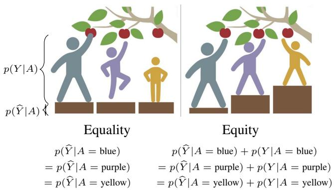
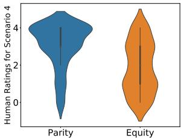

# Evidence Report: l1_de_lc_2005.07293_0179

**Difficulty Level**: ?  
**Difficulty Label**: ?  
**Pair Type**: figure+figure  
**Doc ID**: 2005.07293  
**Pair ID**: ?  
**Query Style**: real_user  

## Query

> How do human ratings differ under the equality-versus-equity setup, the θ-minimized L(θ), MannWhitney-U COMPAS/Adult fairness-gain results across β, and feedback-loop bias reductions under theta and minimizes constraints?

## Answer

Human ratings split because the paper starts from equal allocation versus need-based allocation, whereas the θ-minimized L(θ) on COMPAS and Adult, assessed with MannWhitney U, tracks fairness gain across β and shows bias falling as β increases, with Equity generally reducing feedback-loop bias more than Parity.

## Evidence Elements (2)

### 2005.07293_figure_1 (`figure`)

**Caption**: Figure 1: Notion of equality in fairness is depicted and formalized along with our newly formalized notion of equity.

**Content**:

Figure 1: Notion of equality in fairness is depicted and formalized along with our newly formalized notion of equity.

Context Before

Fred Morstatter University of Southern California Information Sciences Institute morstatt@usc.edu

Machine learning systems have been shown to propagate the societal errors of the past. In light of this, a wealth of research focuses on designing solutions that are “fair.” Even with this abundance of work, there is no singular definition of fairness, mainly because fairness is subjective and context dependent. We propose a new fairness definition, motivated by the principle of equity, that considers existing biases in the data and attempts to make equitable decisions that account for these previous historical biases. We formalize our definition of fairness, and motivate it with its appropriate contexts. Next, we operationalize it for equitable classification. We perform multiple automatic a

... (truncated)

Context After

theoretical analysis of these definitions have found that many at the forefront are incompatible with each other [Kleinberg, Mullainathan, and Raghavan, 2016]. For now at least, fairness remains a philosophical question that is not yet answered in the computational domain. In light of that, we propose and mathematically formalize the equity notion of fairness in which resources and outcomes are distributed to overcome obstacles experienced by groups in order to maximize their opportunities [Schement, 2001]. In this work we take the perspective that historical biases should be compensated and disadvantaged groups should be leveraged. We then introduce a data-driven classification objective function that operationalizes the notion of equity in which existing historical biases in the training

... (truncated)

---

### 2005.07293_figure_4 (`figure`)

**Caption**: Figure 4: Human ratings of equity and parity notions of fairness in different scenarios.

**Content**:

Figure 4: Human ratings of equity and parity notions of fairness in different scenarios.

Context After

With relatively recent popularity of fairness in machine learning and natural language processing domains, the need to find a universal and a more complete fairness definition and measure is crucial. Although finding such definition and measure is a challenge not only in machine learning but also in social and political sciences, steps need to be taken to make current definitions evolve and cover more real world cases. In light of this many fairness definitions have been proposed. Some tried to complement others and some starting a new direction and view-point on their own. Different body of work tried to incorporate the proposed definitions in different downstream tasks such as classification and regression [Menon and Williamson, 2018, Berk et al., 2017, Krasanakis et al., 2018, Agarwal, 

... (truncated)

---

## Required Evidence Spans

| Element ID | Span | Evidence Type |
| --- | --- | --- |
| `2005.07293_figure_1` | Notion of equality in fairness is depicted and formalized along with our newly formalized notion of equity. | observation |
| `2005.07293_figure_4` | Human ratings of equity and parity notions of fairness in different scenarios. | result |
| `2005.07293_formula_1` | \min _ {\theta} L (\theta). | bridge_step |
| `2005.07293_table_1` | MannWhitney U test for COMPAS and Adult datasets. The results show the statistical significance of experiments performed for evaluation of fairness gain amongst different losses over different β values. | bridge_step |
| `2005.07293_figure_2` | Top plots report the accuracy results, while bottom plots report the fairness gain results. | bridge_step |
| `2005.07293_figure_3` | As expected higher β values result in reduction of more bias in the two fairness based objectives (Equity and Parity). | bridge_step |

## Visual Anchors

| Element ID | Anchor |
| --- | --- |
| `2005.07293_figure_1` | upper right trend segment |
| `2005.07293_figure_4` | upper right trend segment |

## Text Evidence

> The method optimizes L(θ) with respect to model parameters θ. Experimental significance over different β values is reported using the MannWhitney U test on the COMPAS and Adult datasets. Across β, the bottom panels report fairness gain. In the feedback-loop simulation, increasing β lowers bias for both objectives, with Equity showing a stronger or more consistent reduction than Parity.

## Query-level Image Paths

## QC Metadata

- **QC Pass**: True
- **QC Issues**: none
- **Quality Tier**: unknown
- **Bridge Quality**: ?
