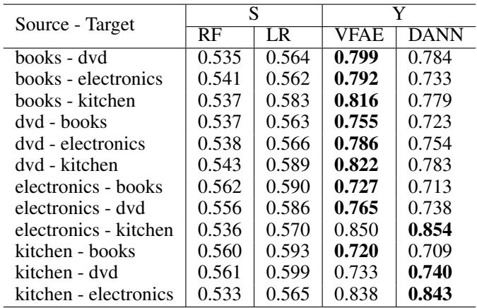

# Evidence Report: l3_de_1511.00830_0000

**Difficulty Level**: ?  
**Difficulty Label**: ?  
**Pair Type**: formula+table  
**Doc ID**: 1511.00830  
**Pair ID**: ?  
**Query Style**: academic  

## Query

> Which decoder assumption about x, z, and s underlies VFAE's stronger books - dvd sentiment accuracy than DANN on Amazon reviews?

## Answer

In the books - dvd row, VFAE scores 0.799 while DANN scores 0.784, so VFAE is stronger on that transfer. The bridge explicitly connects this Amazon Reviews comparison to "Latent-variable generative sampling of x conditioned on z and s" and says "The equation specifies a two-step generative process: first draw a". Node 3 completes the mechanism: z is first drawn from a prior, then x is generated from p_theta(x|z,s), so the decoder models x while conditioning on s.

## Reasoning Steps

1. ****: 
2. ****: 
3. ****: 

## Evidence Elements (2)

### 1511.00830_table_1 (`table`)

**Caption**: Table 1: Results on the Amazon reviews dataset. The DANN column is taken directly from Ganin et al. (2015) (the column that uses the original representation as input).

**Content**:

Table 1: Results on the Amazon reviews dataset. The DANN column is taken directly from Ganin et al. (2015) (the column that uses the original representation as input).

Context Before

In order to further assess the nature of our new representations, we visualized two dimensional Barnes-Hut SNE (van der Maaten, 2013) embeddings of the $\mathbf { z } _ { 1 }$ representations, obtained from the model trained on the Adult dataset, in Figure 4. As we can see, the nuisance/sensitive variables s can be identified both on the original representation x and on a latent representation $\mathbf { z } _ { 1 }$ that does not have the MMD penalty and the independence properties between $\ma

In order to further assess the nature of our new representations, we visualized two dimensional Barnes-Hut SNE (van der Maaten, 2013) embeddings of the $\mathbf { z } _ { 1 }$ representations, obtained from the model trained on the Adult dataset, in Figure 4.

As for the domain adaptation scenario

... (truncated)

Context After

3.4 LEARNING INVARIANT REPRESENTATIONS

Regarding the more general task of learning invariant representations; our results on the Extended Yale B dataset also demonstrate our model’s ability to learn such representations. As expected, on the original representation x the lighting conditions, s, are well identifiable with almost perfect accuracy from both RF and LR. This can also be seen in the two dimensional embeddings of the original space x in Figure 5a: the images are mostly clustered according to the lighting conditions. As soon as we utilize our VFAE model we simultaneously decrease the accuracy on s, from $96 \%$ to about $50 \%$ , and increase our accuracy on y, from $78 \%$ to about $85 \%$ . This effect can also be seen in Figure 5b: the images are now mostly clustered according 

... (truncated)

---

### 1511.00830_formula_1 (`formula`)

**Content (formula)**:

$$\mathbf {z} \sim p (\mathbf {z}); \qquad \mathbf {x} \sim p _ {\theta} (\mathbf {x} | \mathbf {z}, \mathbf {s})$$

Context After

As for the Health dataset; this dataset is extremely imbalanced, with only $15 \%$ of the patients being admitted to a hospital. Therefore, each of the classifiers seems to predict the majority class as the label y for every point. For the invariance against s however, the results were more interesting. On the one hand, the VAE model on this dataset did maintain some sensitive information, which could be identified both linearly and non-linearly. On the other hand, VFAE and the LFR methods were able to retain less information in their latent representation, since only Random Forest was able to achieve higher than random chance accuracy. This further justifies our choice for including the MMD penalty in the lower bound of the VAE. .

In order to further assess the nature of our new represen

... (truncated)

---

## Required Evidence Spans

| Element ID | Span | Evidence Type |
| --- | --- | --- |
| `1511.00830_table_1` | books - dvd ... VFAE 0.799 ... DANN 0.784 | observation |
| `bridge_paragraph` | Cross-domain sentiment classification performance on Amazon product reviews: Classification results are compared across multiple methods on the Amazon Reviews domain-adaptation | [FORMULA B] Latent-variable generative sampling of x conditioned on z and s: The equation specifies a two-step generative process: first draw a | attribution |
| `1511.00830_formula_1` | first draw a latent representation z from a chosen prior, then generate an observed sample x from a model distribution conditioned on both z and an additional variable s | explanation |

## Visual Anchors

| Element ID | Anchor |
| --- | --- |
| `1511.00830_table_1` | row 'books - dvd', columns 'VFAE' and 'DANN' |
| `1511.00830_formula_1` | formula terms 'p(z)' and 'p_theta(x|z,s)', specifically variables x, z, and s |

## Text Evidence

> Cross-domain sentiment classification performance on Amazon product reviews: Classification results are compared across multiple methods on the Amazon Reviews domain-adaptation | [FORMULA B] Latent-variable generative sampling of x conditioned on z and s: The equation specifies a two-step generative process: first draw a

## Query-level Image Paths

## QC Metadata

- **QC Pass**: True
- **QC Issues**: none
- **Quality Tier**: unknown
- **Bridge Quality**: ?
