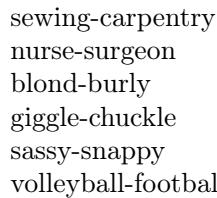

# Evidence Report: l3_de_1607.06520_0089

**Difficulty Level**: ?  
**Difficulty Label**: ?  
**Pair Type**: formula+table  
**Doc ID**: 1607.06520  
**Pair ID**: ?  
**Query Style**: real_user  

## Query

> Summarize how the DirectBias score using cos and g helps interpret the she-he occupation examples like guidance counselor.

## Answer

The occupation analogies give concrete stereotype examples, while the DirectBias measure summarizes how strongly those words align with the learned gender direction g. Using absolute cosine similarity raised to c, it turns examples like guidance counselor into an overall bias score across occupations.

## Evidence Elements (2)

### 1607.06520_formula_3 (`formula`)

**Content (formula)**:

$$\operatorname {D i r e c t B i a s} _ {c} = \frac {1}{| N |} \sum_ {w \in N} | \cos (\vec {w}, g) | ^ {c}$$

Context After

To identify the gender subspace, we took the ten gender pair difference vectors and computed its principal components (PCs). As Figure 6 shows, there is a single direction that explains the majority of variance in these vectors. The first eigenvalue is significantly larger than the rest. Note that, from the randomness in a finite sample of ten noisy vectors, one expects a decrease in eigenvalues. However, as also illustrated in 6, the decrease one observes due to random sampling is much more gra

As Figure 6 shows, there is a single direction that explains the majority of variance in these vectors.

$$ \beta (w, v) = \left(w \cdot v - \frac {w _ {\perp} \cdot v _ {\perp}}{\| w _ {\perp} \| _ {2} \| v _ {\perp} \| _ {2}}\right) \Bigg / w \cdot v. $$

The intuition behind this metric is as f

... (truncated)

---

### 1607.06520_table_1 (`table`)

**Caption**: Gender stereotype she-he analogies.

**Content**:

Gender stereotype she-he analogies.

Context Before

12. guidance counselor

Extreme he occupations

Gender stereotype she-he analogies.

---

## Required Evidence Spans

| Element ID | Span | Evidence Type |
| --- | --- | --- |
| `1607.06520_formula_3` | DirectBias averages the absolute cosine similarity of word embeddings with gender direction g, with exponent c controlling emphasis on larger alignments. | observation |
| `1607.06520_table_1` | The occupation list contains she-he analogy prompts, including guidance counselor among extreme he occupations, illustrating stereotype patterns. | observation |

## Visual Anchors

| Element ID | Anchor |
| --- | --- |
| `1607.06520_formula_3` | average of |cos| alignment to gender direction g with exponent c |
| `1607.06520_table_1` | occupation entries in she-he analogy list such as guidance counselor |

## Text Evidence

> This formula computes an average measure of how strongly a set of words aligns with a learned gender direction in the embedding space... including entries such as "guidance counselor" among extreme male-associated occupations.

## Query-level Image Paths

## QC Metadata

- **QC Pass**: True
- **QC Issues**: none
- **Quality Tier**: unknown
- **Bridge Quality**: ?
