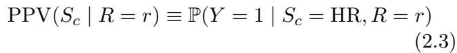

# Evidence Report: l3_de_1610.07524_0103

**Difficulty Level**: ?  
**Difficulty Label**: ?  
**Pair Type**: figure+formula  
**Doc ID**: 1610.07524  
**Pair ID**: ?  
**Query Style**: real_user  

## Query

> Why does having more Black defendants in higher deciles matter for the probability of true positives among high-risk people within each group?

## Answer

Because PPV uses P(Y=1 | S_c=HR, R=r), the key mechanism is who enters the high-risk set and at which score r. The distribution places more Black defendants in higher deciles, so more of their cases are assessed where the model assigns stronger risk. That changes the mix of high-risk cases inside each group and therefore the probability of Y=1 among them.

## Evidence Elements (2)

### 1610.07524_formula_3 (`formula`)

**Content (formula)**:

$$\operatorname {P P V} \left(S _ {c} \mid R = r\right) \equiv \mathbb {P} (Y = 1 \mid S _ {c} = \mathrm {H R}, R = r) \tag {2.3}$$

Context After

3.1 Connections to measures of effect size

A natural question to ask is whether the level of disparate impact, $\Delta$ , is related to some measures of effect size commonly used in scientific reporting. With a small generalization of the $\%$ non-overlap measure, we can answer this question in the affirmative.

The $\%$ non-overlap of two distributions is generally calculated assuming both distributions are normal, and thus has a one-to-one correspondence to Cohen’s $d$ [12].6 Figure 3 shows that the COMPAS decile score is far from being normally distributed. A more reasonable way to calculate $\%$ non-overlap is to note that in the Gaussian case $\%$ non-overlap

---

### 1610.07524_figure_2 (`figure`)

**Caption**: Figure 2: False positive rates across prior record count for defendants charged with a Misdemeanor offense. Plot is based on assessing a defendant as “high-risk” if their COMPAS decile score is $> 4$ . Error bars represent 95% confidence intervals. Figure 3: COMPAS decile score histograms for Black and White defendants. Cohen’s $d = 0 . 6 0$ , non-overlap $d _ { \mathrm { T V } } ( f _ { b } , f _ { w } ) = 2 4 . 5 \%$ .

**Content**:

Figure 2: False positive rates across prior record count for defendants charged with a Misdemeanor offense. Plot is based on assessing a defendant as “high-risk” if their COMPAS decile score is $> 4$ . Error bars represent 95% confidence intervals. Figure 3: COMPAS decile score histograms for Black and White defendants. Cohen’s $d = 0 . 6 0$ , non-overlap $d _ { \mathrm { T V } } ( f _ { b } , f _ { w } ) = 2 4 . 5 \%$ .

Context After

is equivalent to the total variation distance. Letting $f _ { r , y } ( s )$ denote the score distribution for race $r$ and recidivism outcome $y$ , one can establish the following sharp bound on $\Delta$ .

Proposition 3.2 (Percent overlap bound). Under the MinMax policy,

$$ \Delta \leq (t _ {H} - t _ {L}) d _ {\mathrm {T V}} (f _ {b, y}, f _ {w, y}). $$

One might expect that differences in false positive rates are largely attributable to the subset of defendants who are charged with more serious offenses and who have a larger number of prior arrests/convictions. While it is true that the false positive rates within both racial groups are higher for defendants with worse criminal histories, considerable between-group differences in these error rates persist across low prior count subgro

... (truncated)

---

## Required Evidence Spans

| Element ID | Span | Evidence Type |
| --- | --- | --- |
| `1610.07524_formula_3` | The formula defines PPV as the conditional probability of a true positive among high-risk individuals within a group and score level. | mechanism |
| `1610.07524_figure_2` | Black defendants appear more often in higher COMPAS deciles, whereas White defendants are more concentrated in the lowest deciles. | mechanism |

## Visual Anchors

| Element ID | Anchor |
| --- | --- |
| `1610.07524_formula_3` | PPV conditional probability tied to S_c, HR, R=r, and Y=1 |
| `1610.07524_figure_2` | greater Black bar heights above decile 6 and dominant White bars at deciles 1-2 |

## Text Evidence

> The equation defines the positive predictive value for a particular group S_c at a fixed risk-score level r as the probability that the true outcome is positive, and the overall pattern implies higher assigned risk scores for Black defendants on average.

## Query-level Image Paths

## QC Metadata

- **QC Pass**: True
- **QC Issues**: none
- **Quality Tier**: unknown
- **Bridge Quality**: ?
