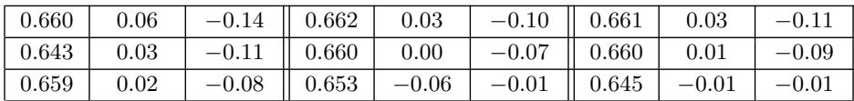
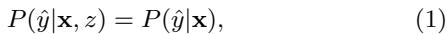

# Evidence Report: l3_de_1610.08452_0116

**Difficulty Level**: ?  
**Difficulty Label**: ?  
**Pair Type**: formula+table  
**Doc ID**: 1610.08452  
**Pair ID**: ?  
**Query Style**: real_user  

## Query

> Which error-rate disparities are evaluated, and what does the independence condition say about using the sensitive attribute?

## Answer

The evaluated disparities are false positive rate, false negative rate, and a combined constraint on both. The independence condition says hat y should be independent of z given x, expressed as P(hat y | x, z) = P(hat y | x).

## Evidence Elements (2)

### 1610.08452_table_2 (`table`)

**Caption**: Table 2: Performance of different methods while removing disparate mistreatment with respect to false positive rate, false negative rate and both.

**Content**:

Table 2: Performance of different methods while removing disparate mistreatment with respect to false positive rate, false negative rate and both.

Context After

Results. Figure 2 summarizes the results for this scenario by showing (a) the relation between decision-boundary covariance and the false positive rates for both sensitive attribute values; (b) the trade-off between accuracy and fairness; and (c) the decision boundaries for both the unconstrained classifier (solid) and the fair constrained classifier

Comparison results. Table 2 shows the performance comparison for all the methods on the three synthetic datasets described above. We can observe that, while all four methods mostly achieve similar levels of fairness, they do it at different costs in terms of accuracy. Both Our methodsen and Hardt et al.—which use sensitive feature information while making decisions—present the best performance in terms of accuracy (due to the additional infor

... (truncated)

---

### 1610.08452_formula_1 (`formula`)

**Content (formula)**:

$$P (\hat {y} | \mathbf {x}, z) = P (\hat {y} | \mathbf {x}), \tag {1}$$

Context Before

Figure 1 provides an example of decision making systems (classifiers) with and without disparate mistreatment.

Table 1 describes various ways of measuring misclassification rates.

These results suggest that satisfying all five criterion of disparate mistreatment (Table 1) simultaneously is impossible when the underlying distribution of data is different for different groups.

---

## Required Evidence Spans

| Element ID | Span | Evidence Type |
| --- | --- | --- |
| `1610.08452_table_2` | fairness constraints target false positive rate, false negative rate, and both together | data |
| `1610.08452_formula_1` | prediction hat y should not depend on sensitive attribute z once x is known | data |

## Visual Anchors

| Element ID | Anchor |
| --- | --- |
| `1610.08452_table_2` | table caption listing the three disparate mistreatment targets |
| `1610.08452_formula_1` | conditional probability notation containing hat y, x, and z |

## Text Evidence

> Multiple learning methods are compared under fairness constraints that target disparate mistreatment measured via false positive rate, false negative rate, and a combined constraint on both error types. The left-hand side is the distribution of predictions conditioned on both x and z, while the right-hand side is the distribution conditioned only on x.

## Query-level Image Paths

## QC Metadata

- **QC Pass**: True
- **QC Issues**: none
- **Quality Tier**: unknown
- **Bridge Quality**: ?
