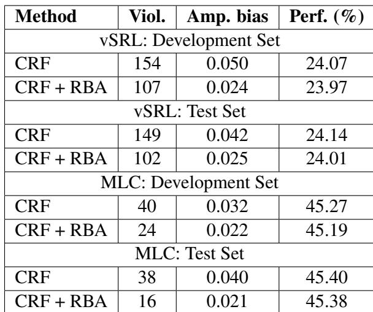

# Evidence Report: l3_de_1707.09457_0053

**Difficulty Level**: ?  
**Difficulty Label**: ?  
**Pair Type**: formula+table  
**Doc ID**: 1707.09457  
**Pair ID**: ?  
**Query Style**: real_user  

## Query

> What difference exists between maximizing f_theta over per-instance assignments and the small performance changes after CRF + RBA on development and test splits?

## Answer

The f_theta term rewards per-instance assignments y^i that fit the learned model, so it emphasizes predictive compatibility during optimization. In the results, CRF + RBA changes performance only slightly relative to CRF: for example, vSRL test goes from 24.14 to 24.01 and MLC test from 45.40 to 45.38 while bias metrics improve more. So the objective’s fit term coexists with only minor accuracy tradeoffs in practice.

## Evidence Elements (2)

### 1707.09457_formula_1 (`formula`)

**Content (formula)**:

$$\begin{array}{l} L (\lambda , \{y ^ {i} \}) = \\ \sum_ {i} f _ {\theta} \left(y ^ {i}\right) - \sum_ {j = 1} ^ {l} \lambda_ {j} \left(A _ {j} \sum_ {i} y ^ {i} - b _ {j}\right), \tag {4} \\ \end{array}$$

Context After

tics from images and require large quantities of labeled data, predominantly retrieved from the web. Methods often combine structured prediction and deep learning to model correlations between labels and images to make judgments that otherwise would have weak visual support. For example, in the first image of Figure 1, it is possible to predict a spatula by considering that it is a common tool used for the activity cooking. Yet such methods run the risk of discovering and exploiting societal bia

Our analysis reveals that over $45 \%$ and $37 \%$ of verbs and objects, respectively, exhibit bias toward a gender greater than 2:1. For example, as seen in Figure 1, the cooking activity in imSitu is a heavily biased verb. Furthermore, we show that after training state-of-the-art structured pred

... (truncated)

---

### 1707.09457_table_2 (`table`)

**Caption**: likely because bias is encoded in image statistics and cannot be removed as effectively with an image agnostic adjustment.

**Content**:

likely because bias is encoded in image statistics and cannot be removed as effectively with an image agnostic adjustment.

Context Before

Our quantitative results on MS-COCO RBA are summarized in the last two sections of Table 2. Similarly to vSRL, we are able to reduce the number of objects whose bias exceeds the original training bias by $5 \%$ , by $40 \%$ (Viol.). Bias amplification was reduced by $3 1 . 3 \%$ on the development set (Amp. bias). The underlying recognition system was evaluated by the standard measure: top-1 mean average precision, the precision averaged across object categories. Our calibration method results i

In Figure 3(c) we can see that the overall distance to the training set distribution after applying RBA decreased significantly, over $39 \%$ .

In Figure 3(d), we demonstrate that we substantially reduce the distance between training bias and bias in the development set.

Context After

likely because bias is encoded in image statistics and cannot be removed as effectively with an image agnostic adjustment. Results on the test set support our development set results: we decrease bias amplification by $40 . 5 \%$ (Amp. bias).

7.2 Multilabel Classification

Our quantitative results on MS-COCO RBA are summarized in the last two sections of Table 2. Similarly to vSRL, we are able to reduce the number of objects whose bias exceeds the original training bias by $5 \%$ , by $40 \%$ (Viol.). Bias amplification was reduced by $3 1 . 3 \%$ on the development set (Amp. bias). The underlying recognition system was evaluated by the standard measure: top-1 mean average precision, the precision averaged across object categories. Our calibration method results in a negligible loss in pe

... (truncated)

---

## Required Evidence Spans

| Element ID | Span | Evidence Type |
| --- | --- | --- |
| `1707.09457_formula_1` | the first summation adds the model’s predicted compatibility or utility f_theta for each individual assignment, encouraging choices that fit the learned model | observation |
| `1707.09457_table_2` | performance remains close after CRF + RBA, with vSRL test 24.14 to 24.01 and MLC test 45.40 to 45.38 | observation |

## Visual Anchors

| Element ID | Anchor |
| --- | --- |
| `1707.09457_formula_1` | first summation containing f_theta and assignments y^i |
| `1707.09457_table_2` | Perf. (%) column across CRF and CRF + RBA rows in development and test sections |

## Text Evidence

> The first summation adds the model’s predicted compatibility or utility f_θ for each individual assignment... Results on the test set support our development set results.

## Query-level Image Paths

## QC Metadata

- **QC Pass**: True
- **QC Issues**: none
- **Quality Tier**: unknown
- **Bridge Quality**: ?
